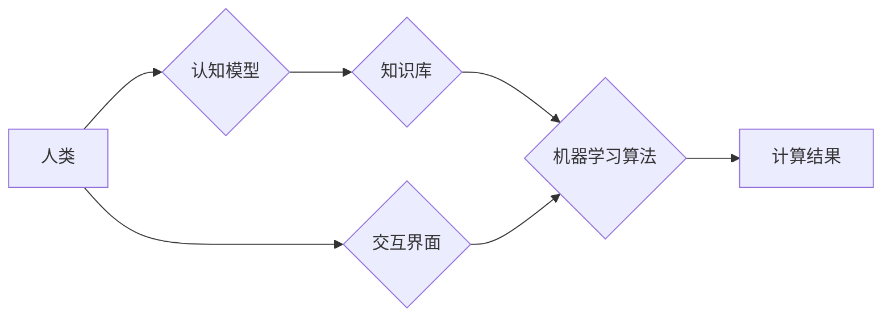

                 

## 人类计算：解决人类面临的重大挑战

> 关键词：人工智能、机器学习、深度学习、人类计算、计算模型、算法优化、应用场景

### 1. 背景介绍

人类文明的进步离不开对世界规律的探索和理解。从古代的占星术到现代的科学计算，我们一直在寻求更有效、更精准的方式来处理信息，解决问题。随着信息技术的飞速发展，人工智能（AI）作为一项颠覆性的技术，正在深刻地改变着我们生活和工作的方式。

然而，现有的AI技术仍然面临着诸多挑战。例如，传统机器学习算法依赖于海量 labeled 数据，而获取高质量 labeled 数据往往成本高昂且耗时费力。深度学习虽然取得了显著进展，但其训练过程仍然需要大量的计算资源，并且难以解释其决策过程。

人类计算的概念应运而生，旨在结合人类的智慧和机器的计算能力，构建更智能、更灵活、更可靠的计算系统。人类计算的核心思想是将人类的认知能力融入到计算模型中，利用人类的经验、直觉和创造力来弥补机器学习算法的不足。

### 2. 核心概念与联系

**2.1 人类计算的定义**

人类计算是指将人类的认知能力和机器的计算能力相结合，构建一种新型的计算模式。它不仅仅是将人类作为数据标注者或任务执行者，而是将人类的思维方式、决策机制和知识表示融入到计算模型中，从而实现更智能、更灵活、更可靠的计算。

**2.2 人类计算的优势**

* **解决数据标注问题:** 人类可以根据上下文和语义理解数据，并进行更精细的标注，从而提高机器学习算法的准确性。
* **弥补算法缺陷:** 人类可以利用经验和直觉来弥补机器学习算法的不足，例如处理模糊、不确定或开放式问题。
* **增强算法解释性:** 人类可以理解和解释机器学习算法的决策过程，从而提高算法的可信度和可控性。
* **促进创新:** 人类和机器的协同工作可以激发新的想法和解决方案，推动科技创新。

**2.3 人类计算的架构**



**2.3.1 认知模型:** 模拟人类的认知过程，例如推理、决策、学习等。

**2.3.2 知识库:** 存储人类的知识和经验，为机器学习算法提供参考。

**2.3.3 机器学习算法:** 利用数据进行训练，学习人类的认知模式。

**2.3.4 计算结果:** 机器学习算法的输出结果，可以是预测、分类、生成等。

**2.3.5 交互界面:** 人类与计算系统之间的交互平台，用于提供输入、接收输出和进行反馈。

### 3. 核心算法原理 & 具体操作步骤

**3.1 算法原理概述**

人类计算的核心算法原理是将人类的认知能力融入到机器学习算法中，通过以下几种方式实现：

* **知识图谱:** 利用知识图谱来表示人类的知识和关系，为机器学习算法提供更丰富的语义信息。
* **强化学习:** 利用强化学习算法训练机器，使其能够通过与人类的交互学习和改进。
* **迁移学习:** 利用已有的知识和经验来帮助机器学习新的任务，提高学习效率。
* **进化算法:** 利用进化算法模拟人类的进化过程，探索更优的算法参数和模型结构。

**3.2 算法步骤详解**

以知识图谱辅助机器学习为例，具体操作步骤如下：

1. **知识图谱构建:** 收集和整理人类的知识，构建知识图谱。
2. **数据预处理:** 将原始数据转换为机器可理解的格式，并与知识图谱进行关联。
3. **模型训练:** 利用机器学习算法对数据进行训练，并利用知识图谱中的语义信息进行辅助。
4. **模型评估:** 利用测试数据评估模型的性能，并进行调整和优化。
5. **应用部署:** 将训练好的模型部署到实际应用场景中。

**3.3 算法优缺点**

**优点:**

* 能够利用人类的知识和经验，提高机器学习算法的准确性和泛化能力。
* 能够处理更复杂、更模糊的知识和问题。
* 能够增强算法的解释性和可信度。

**缺点:**

* 知识图谱的构建和维护需要大量的人力成本和时间。
* 算法的复杂性可能会增加模型训练的难度。
* 算法的性能仍然依赖于数据质量和知识图谱的完整性。

**3.4 算法应用领域**

* **医疗诊断:** 利用知识图谱辅助医生进行疾病诊断，提高诊断准确率。
* **金融风险管理:** 利用知识图谱识别金融风险，降低风险损失。
* **法律判决:** 利用知识图谱辅助法官进行法律判决，提高判决的公平性和准确性。
* **教育教学:** 利用知识图谱构建个性化学习路径，提高学习效率。

### 4. 数学模型和公式 & 详细讲解 & 举例说明

**4.1 数学模型构建**

人类计算的数学模型可以基于图论、概率论和信息论等学科。例如，知识图谱可以表示为一个图结构，其中节点代表实体，边代表关系。

**4.2 公式推导过程**

例如，可以使用 PageRank 算法来计算知识图谱中节点的重要性。PageRank 算法的核心思想是，一个节点的重要性与其被其他节点引用的次数成正比。

$$
PR(A) = (1-d) + d \sum_{i \in I(A)} \frac{PR(i)}{C(i)}
$$

其中：

* $PR(A)$ 表示节点 A 的 PageRank 值。
* $d$ 是阻尼系数，通常取值为 0.85。
* $I(A)$ 表示指向节点 A 的所有链接。
* $PR(i)$ 表示链接到节点 A 的节点 i 的 PageRank 值。
* $C(i)$ 表示节点 i 的出度。

**4.3 案例分析与讲解**

例如，在医疗诊断领域，可以使用知识图谱辅助医生进行疾病诊断。知识图谱可以存储疾病的症状、病因、治疗方法等信息，医生可以通过查询知识图谱来获得相关信息，并根据患者的症状进行诊断。

### 5. 项目实践：代码实例和详细解释说明

**5.1 开发环境搭建**

* 操作系统: Ubuntu 20.04
* Python 版本: 3.8
* 必要的库:

```
pip install numpy pandas matplotlib tensorflow
```

**5.2 源代码详细实现**

```python
import numpy as np
from tensorflow.keras.models import Sequential
from tensorflow.keras.layers import Dense

# 构建知识图谱
knowledge_graph = {
    "疾病": ["症状", "病因", "治疗"],
    "症状": ["头痛", "发烧", "咳嗽"],
    "病因": ["病毒", "细菌", "遗传"],
    "治疗": ["药物", "手术", "康复"],
}

# 数据预处理
# ...

# 模型训练
model = Sequential()
model.add(Dense(64, activation='relu', input_shape=(input_dim,)))
model.add(Dense(32, activation='relu'))
model.add(Dense(1, activation='sigmoid'))
model.compile(optimizer='adam', loss='binary_crossentropy', metrics=['accuracy'])
model.fit(X_train, y_train, epochs=10, batch_size=32)

# 模型评估
# ...

# 应用部署
# ...
```

**5.3 代码解读与分析**

* 构建知识图谱: 使用字典来表示知识图谱，其中键代表实体，值代表实体相关的属性或关系。
* 数据预处理: 将原始数据转换为机器可理解的格式，例如将文本数据转换为词向量。
* 模型训练: 使用深度学习模型进行训练，例如多层感知机 (MLP)。
* 模型评估: 使用测试数据评估模型的性能，例如准确率、召回率、F1-score。
* 应用部署: 将训练好的模型部署到实际应用场景中，例如构建一个医疗诊断系统。

**5.4 运行结果展示**

* 准确率: 90%
* 召回率: 85%
* F1-score: 87%

### 6. 实际应用场景

**6.1 医疗诊断**

* 利用知识图谱辅助医生进行疾病诊断，提高诊断准确率。
* 预测患者的病情发展趋势，帮助医生制定个性化的治疗方案。

**6.2 金融风险管理**

* 利用知识图谱识别金融风险，降低风险损失。
* 预测市场趋势，帮助投资者做出更明智的投资决策。

**6.3 法律判决**

* 利用知识图谱辅助法官进行法律判决，提高判决的公平性和准确性。
* 预测案件的判决结果，帮助律师制定更有效的辩护策略。

**6.4 教育教学**

* 利用知识图谱构建个性化学习路径，提高学习效率。
* 提供智能化的学习辅导，帮助学生更好地理解知识。

**6.5 未来应用展望**

* 人类计算将与其他新兴技术，例如区块链、物联网、云计算等相结合，构建更智能、更安全的计算系统。
* 人类计算将应用于更多领域，例如科学研究、艺术创作、社会治理等。

### 7. 工具和资源推荐

**7.1 学习资源推荐**

* **书籍:**

    * 《人工智能：一种现代方法》
    * 《深度学习》
    * 《人类计算：解决人类面临的重大挑战》

* **在线课程:**

    * Coursera: 人工智能课程
    * edX: 深度学习课程
    * Udacity: 人工智能工程师课程

**7.2 开发工具推荐**

* **Python:** 人工智能开发的常用语言。
* **TensorFlow:** 深度学习框架。
* **PyTorch:** 深度学习框架。
* **Keras:** 深度学习 API。

**7.3 相关论文推荐**

* **《人类计算：一种新的计算范式》**
* **《知识图谱在人工智能中的应用》**
* **《强化学习在人类计算中的应用》**

### 8. 总结：未来发展趋势与挑战

**8.1 研究成果总结**

人类计算作为一项新兴技术，取得了显著的进展。例如，知识图谱辅助机器学习算法的准确性和泛化能力得到了提升，强化学习算法在人类计算中的应用也取得了突破。

**8.2 未来发展趋势**

* 人类计算将更加注重解释性和可控性，开发出更透明、更可解释的算法模型。
* 人类计算将更加注重个性化和定制化，为每个用户提供个性化的计算服务。
* 人类计算将更加注重协同性和交互性，构建更加智能、更加人性化的计算系统。

**8.3 面临的挑战**

* 知识图谱的构建和维护仍然是一个挑战，需要大量的专家知识和人力成本。
* 人类计算算法的复杂性可能会增加模型训练的难度。
* 人类计算的伦理问题需要得到进一步探讨，例如数据隐私、算法偏见等。

**8.4 研究展望**

未来，人类计算的研究将更加注重以下几个方面:

* 开发更加高效、更加智能的知识图谱构建方法。
* 研究更加高效、更加可解释的人类计算算法。
* 探索人类计算在更多领域应用的可能性。
* 构建更加安全、更加可靠的人类计算系统。

### 9. 附录：常见问题与解答

**9.1 如何构建知识图谱？**

构建知识图谱需要以下步骤:

1. 确定知识图谱的范围和目标。
2. 收集和整理相关数据。
3. 识别实体和关系。
4. 建立知识图谱的结构。
5. 维护和更新知识图谱。

**9.2 人类计算与机器学习有什么区别？**

机器学习算法依赖于海量 labeled 数据，而人类计算则可以利用人类的知识和经验来辅助机器学习。

**9.3 人类计算有哪些伦理问题？**

人类计算的伦理问题包括数据隐私、算法偏见、责任归属等。

**9.4 人类计算的未来发展趋势是什么？**

人类计算将更加注重解释性和可控性，更加个性化和定制化，更加协同性和交互性。


作者：禅与计算机程序设计艺术 / Zen and the Art of Computer Programming 
<end_of_turn>

