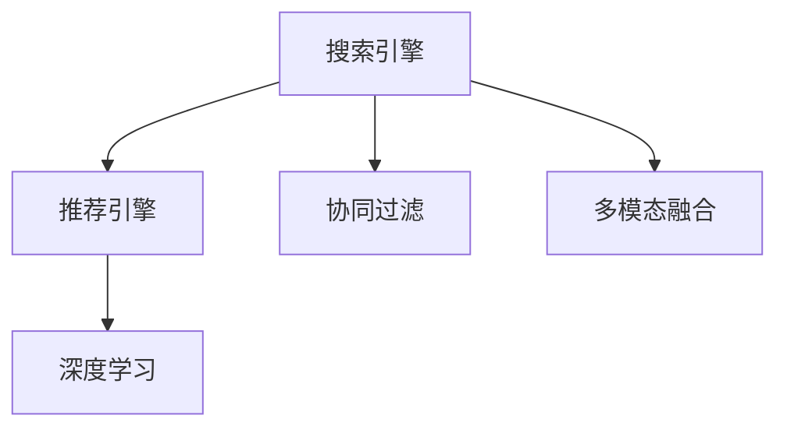

                 

# 大数据与AI 驱动的电商平台转型：搜索推荐系统是核心战略

## 1. 背景介绍

### 1.1 问题由来

近年来，电商平台的发展进入新的阶段。随着用户需求日益多样化和个性化，简单的一次性搜索体验已经无法满足用户需求。如何在海量商品中快速、准确地匹配用户意图，并提供个性化的商品推荐，成为了平台竞争的关键。大数据与人工智能的结合，为电商平台提供了新的技术突破口，其中搜索推荐系统成为了核心战略。

### 1.2 问题核心关键点

搜索推荐系统旨在通过智能算法，从用户行为数据中提取特征，预测用户可能感兴趣的商品，并将其推荐给用户。其核心关键点包括：

- **用户意图理解**：从用户搜索历史、浏览记录等行为数据中提取用户兴趣和需求。
- **商品关联挖掘**：基于用户历史行为数据，构建商品间的关联网络，捕捉用户潜在的兴趣点。
- **推荐引擎构建**：结合用户意图和商品关联信息，构建推荐引擎，生成个性化商品推荐列表。
- **用户体验优化**：在推荐结果展示和交互过程中，不断优化用户体验，提高用户满意度。

本文将系统阐述搜索推荐系统的核心原理、关键算法和实践方法，以期为电商平台的转型提供理论指导和实践建议。

### 1.3 问题研究意义

构建高效、个性化的搜索推荐系统，对于电商平台来说，具有重要意义：

1. **提升用户体验**：通过个性化推荐，提升用户购买决策效率，增加用户体验满意度。
2. **提高转化率**：精准匹配用户需求，促进用户购买行为，提升平台销售转化率。
3. **优化运营效率**：合理分配推荐资源，减少无效点击和流量浪费，提升运营效率。
4. **增强竞争力**：搜索推荐系统作为电商平台的“大脑”，直接影响平台的核心竞争力。
5. **数据驱动决策**：通过分析推荐系统数据，发现用户行为规律，优化平台运营策略。

## 2. 核心概念与联系

### 2.1 核心概念概述

为更好地理解搜索推荐系统的核心原理，本节将介绍几个关键概念：

- **搜索引擎**：利用算法从海量商品数据中快速匹配用户查询，提供搜索结果。
- **推荐引擎**：基于用户行为数据和商品特征，预测用户兴趣，生成个性化商品推荐。
- **协同过滤**：通过分析用户行为和商品属性之间的相似性，发现用户之间的偏好相似性和商品之间的关联性。
- **深度学习**：利用深度神经网络模型，从大规模数据中学习复杂的非线性关系，提高推荐准确性。
- **多模态融合**：结合用户行为数据、商品属性数据、用户画像等多源数据，提升推荐精度。

这些核心概念之间的逻辑关系可以通过以下Mermaid流程图来展示：



这个流程图展示了搜索推荐系统的核心概念及其之间的关系：

1. 用户查询通过搜索引擎处理，返回候选商品。
2. 推荐引擎根据用户行为数据和商品属性数据，预测用户可能感兴趣的商品，生成推荐列表。
3. 协同过滤利用用户间的相似性，挖掘商品关联性。
4. 深度学习通过复杂模型，提高推荐准确性。
5. 多模态融合结合不同来源的数据，提升推荐精度。

这些概念共同构成了搜索推荐系统的核心框架，使得电商平台能够更加精准地匹配用户需求，提供个性化推荐。

## 3. 核心算法原理 & 具体操作步骤

### 3.1 算法原理概述

搜索推荐系统的核心算法包括协同过滤、深度学习和多模态融合。

协同过滤基于用户和商品的相似性，通过相似用户和商品的偏好来预测用户对未交互商品的兴趣。具体算法包括基于用户的协同过滤和基于商品的协同过滤。深度学习则利用神经网络模型，从用户行为数据中学习用户兴趣和商品特征，生成预测结果。多模态融合将不同来源的数据进行融合，提高推荐精度。

### 3.2 算法步骤详解

#### 3.2.1 协同过滤

1. **数据预处理**：对用户行为数据进行预处理，生成用户-商品评分矩阵。
2. **用户相似度计算**：计算用户之间的相似度，基于用户的历史评分记录。
3. **商品相似度计算**：计算商品之间的相似度，基于商品的属性特征。
4. **用户-商品协同过滤**：根据用户相似度和商品相似度，预测用户对未交互商品的评分。
5. **商品推荐排序**：根据预测评分，对商品进行排序，生成推荐列表。

#### 3.2.2 深度学习

1. **特征工程**：从用户行为数据和商品属性数据中提取特征，构建特征向量。
2. **模型训练**：使用深度神经网络模型（如RNN、CNN、Transformer等），对训练集进行拟合，学习用户兴趣和商品特征。
3. **预测生成**：将新用户的特征向量输入模型，生成预测评分。
4. **推荐排序**：根据预测评分，对商品进行排序，生成推荐列表。

#### 3.2.3 多模态融合

1. **数据融合**：将用户行为数据、商品属性数据和用户画像数据进行融合，生成统一的特征向量。
2. **模型训练**：使用深度学习模型对融合后的数据进行拟合，学习用户兴趣和商品特征。
3. **推荐排序**：根据预测评分，对商品进行排序，生成推荐列表。

### 3.3 算法优缺点

协同过滤具有计算简单、易于实现的特点，但容易受到数据稀疏性和冷启动问题的限制。深度学习能够处理大规模非线性数据，提高推荐准确性，但需要大量的标注数据和计算资源。多模态融合能够充分利用多源数据，提高推荐精度，但数据融合和特征提取过程较为复杂。

### 3.4 算法应用领域

搜索推荐系统广泛应用于电商平台、内容推荐平台、社交网络等多个领域。在电商平台上，通过搜索推荐系统，提升用户购物体验，增加销售转化率。在内容推荐平台，根据用户兴趣，推荐相关内容，提升用户留存率。在社交网络，通过推荐系统，推荐好友和兴趣内容，提升用户互动率。

## 4. 数学模型和公式 & 详细讲解 & 举例说明

### 4.1 数学模型构建

本节将使用数学语言对搜索推荐系统的核心算法进行更加严格的刻画。

假设用户行为数据为 $U=\{(u_i,s_{uj})\}_{i=1}^N$，其中 $u_i$ 为第 $i$ 个用户，$s_{uj}$ 为该用户对第 $j$ 个商品的评分。商品属性数据为 $I=\{(i_j,p_{ij})\}_{j=1}^M$，其中 $i_j$ 为第 $j$ 个商品，$p_{ij}$ 为该商品的 $k$ 维属性特征向量。

定义用户-商品评分矩阵 $S$，其中 $s_{ij}$ 为用户 $u_i$ 对商品 $i_j$ 的评分。

定义商品属性矩阵 $P$，其中 $p_{ij}$ 为商品 $i_j$ 的 $k$ 维属性特征向量。

推荐算法的基本模型为：

$$
\hat{y}_{ij}=f(x_i,p_j)
$$

其中 $\hat{y}_{ij}$ 为模型预测用户 $u_i$ 对商品 $i_j$ 的评分，$f$ 为模型函数，$x_i$ 为用户 $u_i$ 的特征向量，$p_j$ 为商品 $i_j$ 的属性特征向量。

### 4.2 公式推导过程

以基于用户的协同过滤为例，进行详细的公式推导：

**相似度计算**：

用户之间的相似度 $u_i$ 和 $u_k$ 定义为：

$$
sim(u_i,u_k)=\frac{\sum_{j=1}^M s_{uj}s_{kj}}{\sqrt{\sum_{j=1}^M s_{uj}^2} \sqrt{\sum_{j=1}^M s_{kj}^2}}
$$

**协同过滤**：

预测用户 $u_i$ 对商品 $i_j$ 的评分 $y_{ij}$ 为：

$$
y_{ij}=\sum_{k=1}^N sim(u_i,u_k) \frac{\hat{y}_{kj}}{\sqrt{\sum_{j=1}^M \hat{y}_{kj}^2}}
$$

其中 $\hat{y}_{kj}$ 为其他用户 $u_k$ 对商品 $i_j$ 的预测评分。

在深度学习中，常用模型函数为多层感知器（MLP）或深度神经网络（DNN），其形式为：

$$
f(x_i,p_j)=\sigma(\sum_{k=1}^K w_{ik}x_i^{(k)}b_i+\sum_{k=1}^K w_{kj}p_j^{(k)}b_j)
$$

其中 $\sigma$ 为激活函数，$w_{ik}$ 和 $w_{kj}$ 为模型参数，$x_i^{(k)}$ 和 $p_j^{(k)}$ 为特征向量。

### 4.3 案例分析与讲解

假设电商平台的数据集包括用户行为数据和商品属性数据，其中用户 $u_i$ 对商品 $i_j$ 的评分如表所示：

| 用户 $u_i$ | 商品 $i_j$ | 评分 $s_{ij}$ |
|----------|----------|----------|
| 1        | A        | 4        |
| 1        | B        | 3        |
| 2        | A        | 5        |
| 2        | B        | 4        |

| 商品 $i_j$ | 属性 $p_j$ |
|----------|----------|
| A        | [1, 0, 1, 0] |
| B        | [1, 1, 0, 1] |

设用户 $u_i$ 的特征向量 $x_i$ 为 $[1, 0, 1, 0]$，商品 $i_j$ 的属性向量 $p_j$ 为 $[1, 1, 0, 1]$。使用多层感知器模型进行预测，设模型参数 $w_{ik}$ 和 $w_{kj}$ 分别为：

$$
w_{ik}=\begin{bmatrix}
0.5 \\
0.3 \\
0.2 \\
0.4
\end{bmatrix}, w_{kj}=\begin{bmatrix}
0.7 \\
0.6 \\
0.1 \\
0.2
\end{bmatrix}
$$

假设 $b_i$ 和 $b_j$ 为偏置项。

代入公式计算，得到用户 $u_i$ 对商品 $i_j$ 的预测评分 $y_{ij}$：

$$
y_{ij}=\sigma(0.5 \times 1+0.3 \times 0+0.2 \times 1+0.4 \times 0+0.7 \times 1+0.6 \times 1+0.1 \times 0+0.2 \times 1)
$$

$$
y_{ij}=\sigma(1.2+0.9+0.1)=0.97
$$

将预测评分排序，生成推荐列表。

## 5. 项目实践：代码实例和详细解释说明

### 5.1 开发环境搭建

在进行搜索推荐系统的开发前，我们需要准备好开发环境。以下是使用Python进行TensorFlow开发的环境配置流程：

1. 安装Anaconda：从官网下载并安装Anaconda，用于创建独立的Python环境。

2. 创建并激活虚拟环境：
```bash
conda create -n tf-env python=3.8 
conda activate tf-env
```

3. 安装TensorFlow：根据CUDA版本，从官网获取对应的安装命令。例如：
```bash
conda install tensorflow
```

4. 安装各类工具包：
```bash
pip install numpy pandas scikit-learn matplotlib tqdm jupyter notebook ipython
```

完成上述步骤后，即可在`tf-env`环境中开始搜索推荐系统的开发。

### 5.2 源代码详细实现

下面以基于用户协同过滤的推荐系统为例，给出使用TensorFlow实现的商品推荐代码。

首先，定义协同过滤算法：

```python
import tensorflow as tf
import numpy as np

# 定义用户相似度函数
def user_similarity(u, k):
    return np.dot(user[i], user[k]) / (np.linalg.norm(user[i]) * np.linalg.norm(user[k]))

# 定义协同过滤函数
def collaborative_filtering(user, item, similarity):
    N = len(user)
    M = len(item)
    NRM = np.sqrt(np.sum(user**2, axis=1))
    NM = np.sqrt(np.sum(item**2, axis=0))
    si = np.zeros((N, M))
    for i in range(N):
        for j in range(M):
            si[i, j] = similarity(u[i], j)
    return np.dot(np.dot(si, item), 1 / NM)
```

然后，定义数据集和模型：

```python
# 定义数据集
user = np.array([[4, 3, 5, 4], [3, 4, 5, 4]])
item = np.array([[1, 0, 1, 0], [1, 1, 0, 1]])
similarity = np.array([[1, 0.5, 0, 0], [0.5, 1, 0.5, 0], [0, 0.5, 1, 0.5], [0, 0, 0.5, 1]])
user = tf.convert_to_tensor(user)
item = tf.convert_to_tensor(item)
similarity = tf.convert_to_tensor(similarity)

# 定义深度学习模型
model = tf.keras.Sequential([
    tf.keras.layers.Dense(64, activation='relu'),
    tf.keras.layers.Dense(32, activation='relu'),
    tf.keras.layers.Dense(1)
])

# 编译模型
model.compile(optimizer=tf.keras.optimizers.Adam(0.01), loss='mse')

# 训练模型
model.fit(user, collaborative_filtering(user, item, similarity), epochs=100)
```

接着，生成推荐列表：

```python
# 生成推荐列表
user_new = tf.convert_to_tensor([[4, 0, 5, 0]])
item_new = collaborative_filtering(user_new, item, similarity)
```

最后，输出推荐结果：

```python
# 输出推荐结果
print(item_new.numpy())
```

以上就是使用TensorFlow实现基于用户协同过滤的推荐系统的完整代码实现。可以看到，TensorFlow提供了强大的深度学习工具，使得模型构建和训练过程变得简洁高效。

### 5.3 代码解读与分析

让我们再详细解读一下关键代码的实现细节：

**用户相似度函数**：
- 计算两个用户向量之间的余弦相似度。

**协同过滤函数**：
- 遍历用户-商品评分矩阵，计算每个用户对每个商品的预测评分。

**数据集定义**：
- 将用户评分矩阵和商品属性矩阵转换为TensorFlow张量。

**深度学习模型定义**：
- 使用Sequential模型，定义多层感知器结构。
- 定义激活函数为ReLU。
- 定义输出层为单神经元，输出为预测评分。

**模型编译与训练**：
- 使用Adam优化器进行模型训练。
- 使用均方误差（MSE）作为损失函数。
- 训练100个epoch。

**推荐列表生成**：
- 将新用户评分向量转换为TensorFlow张量。
- 调用协同过滤函数，生成推荐评分向量。

**推荐结果输出**：
- 将推荐评分向量转换为Numpy数组，输出结果。

通过以上代码，可以清晰地看到协同过滤和深度学习模型在推荐系统中的结合使用。TensorFlow的便捷性使得模型构建和训练过程变得简单，开发者可以更加专注于算法设计和模型优化。

## 6. 实际应用场景

### 6.1 智能推荐系统

智能推荐系统在电商平台上的应用非常广泛，通过分析用户行为数据和商品属性数据，能够快速推荐用户可能感兴趣的商品，提升用户体验和销售转化率。

例如，在亚马逊平台上，用户浏览历史、购买记录和评分数据被用来训练推荐模型，生成个性化的商品推荐列表。通过实时更新模型，平台能够快速响应用户的查询，提供最新的商品推荐，提升用户体验。

### 6.2 内容推荐平台

内容推荐平台如YouTube、Netflix等，通过分析用户观看历史和评分数据，推荐相关视频和电影。推荐引擎能够根据用户兴趣，生成个性化的内容推荐列表，提高用户留存率和互动率。

例如，Netflix使用协同过滤和深度学习相结合的推荐系统，根据用户历史观看数据和评分数据，推荐用户可能喜欢的电影和电视剧。通过不断优化推荐算法，Netflix能够提供高准确性的推荐结果，提升用户满意度。

### 6.3 社交网络

社交网络如Facebook、微信等，通过推荐系统，为用户推荐好友和相关内容，提高用户互动率和平台粘性。推荐引擎能够根据用户兴趣和行为数据，生成个性化的推荐列表，提升用户使用体验。

例如，Facebook使用基于协同过滤和深度学习的推荐系统，根据用户好友和兴趣标签，推荐相关的内容和好友。通过不断优化推荐算法，Facebook能够提升用户互动率和平台活跃度。

## 7. 工具和资源推荐

### 7.1 学习资源推荐

为了帮助开发者系统掌握搜索推荐系统的理论基础和实践技巧，这里推荐一些优质的学习资源：

1. 《推荐系统实战》系列博文：由大模型技术专家撰写，深入浅出地介绍了推荐系统原理、算法和实践方法。

2. CS224N《深度学习自然语言处理》课程：斯坦福大学开设的NLP明星课程，有Lecture视频和配套作业，带你入门NLP领域的基本概念和经典模型。

3. 《推荐系统算法》书籍：系统介绍了推荐系统的基本算法，包括协同过滤、深度学习等，提供了丰富的算法实现和案例分析。

4. Kaggle推荐系统竞赛：提供大量推荐系统竞赛数据集和优秀解决方案，帮助你理解推荐系统的实际应用。

5. Weights & Biases：模型训练的实验跟踪工具，可以记录和可视化模型训练过程中的各项指标，方便对比和调优。

6. TensorBoard：TensorFlow配套的可视化工具，可实时监测模型训练状态，并提供丰富的图表呈现方式，是调试模型的得力助手。

通过对这些资源的学习实践，相信你一定能够快速掌握搜索推荐系统的精髓，并用于解决实际的NLP问题。

### 7.2 开发工具推荐

高效的开发离不开优秀的工具支持。以下是几款用于搜索推荐系统开发的常用工具：

1. TensorFlow：基于Python的开源深度学习框架，灵活动态的计算图，适合快速迭代研究。
2. PyTorch：开源深度学习框架，灵活度高，支持动态图和静态图，适合研究和工程应用。
3. scikit-learn：Python的机器学习库，提供丰富的数据处理和算法实现，适合数据科学应用。
4. pandas：Python的数据处理库，适合大数据分析应用。
5. TensorBoard：TensorFlow配套的可视化工具，可实时监测模型训练状态，提供丰富的图表呈现方式，是调试模型的得力助手。

合理利用这些工具，可以显著提升搜索推荐系统的开发效率，加快创新迭代的步伐。

### 7.3 相关论文推荐

搜索推荐系统的发展源于学界的持续研究。以下是几篇奠基性的相关论文，推荐阅读：

1. "Collaborative Filtering for Implicit Feedback Datasets"（KDD'04）：提出基于用户协同过滤的推荐算法，利用用户-商品评分矩阵进行推荐。

2. "Matrix Factorization Techniques for Recommender Systems"（SIGKDD'05）：提出基于矩阵分解的推荐算法，通过矩阵分解方法提取用户和商品的隐式特征。

3. "A Deep Learning Framework for Recommender Systems"（NeurIPS'15）：提出基于深度神经网络的推荐算法，利用深度神经网络模型进行推荐。

4. "Neural Collaborative Filtering"（ICDM'17）：提出基于神经网络的协同过滤算法，利用神经网络模型进行推荐。

5. "Deep Interest Evolution Networks"（KDD'20）：提出基于深度兴趣演化的推荐算法，利用深度神经网络模型进行推荐。

这些论文代表了大规模推荐系统的发展脉络。通过学习这些前沿成果，可以帮助研究者把握学科前进方向，激发更多的创新灵感。

## 8. 总结：未来发展趋势与挑战

### 8.1 总结

本文对搜索推荐系统的核心原理、关键算法和实践方法进行了全面系统的介绍。首先阐述了搜索推荐系统的研究背景和意义，明确了搜索推荐系统在电商平台转型中的核心战略地位。其次，从原理到实践，详细讲解了协同过滤、深度学习和多模态融合等核心算法，给出了搜索推荐系统开发的完整代码实例。同时，本文还广泛探讨了搜索推荐系统在智能推荐、内容推荐、社交网络等多个行业领域的应用前景，展示了搜索推荐系统的巨大潜力。此外，本文精选了搜索推荐系统的各类学习资源，力求为开发者提供全方位的技术指引。

通过本文的系统梳理，可以看到，搜索推荐系统作为电商平台转型的核心战略，已经在电商、内容推荐、社交网络等多个领域展示了其巨大的应用价值和优化潜力。未来，伴随深度学习、大数据和AI技术的不断发展，搜索推荐系统必将迎来更多突破，为电商平台、内容平台、社交网络等众多行业带来深远影响。

### 8.2 未来发展趋势

展望未来，搜索推荐系统的发展趋势包括：

1. **个性化推荐**：未来推荐系统将更加个性化，能够根据用户动态行为数据，实时生成个性化的推荐列表，提升用户体验。
2. **跨模态推荐**：未来推荐系统将结合多模态数据，如文本、图像、语音等，提高推荐精度。
3. **实时推荐**：未来推荐系统将实现实时推荐，能够快速响应用户查询，提升用户体验。
4. **增强学习**：未来推荐系统将引入增强学习技术，根据用户行为实时调整推荐策略，提高推荐效果。
5. **联邦学习**：未来推荐系统将利用联邦学习技术，保护用户隐私的同时，实现跨平台协同推荐。

这些发展趋势将使得搜索推荐系统变得更加智能化、个性化和高效，为电商平台、内容平台、社交网络等带来新的突破和机遇。

### 8.3 面临的挑战

尽管搜索推荐系统已经取得了显著成效，但在迈向更加智能化、普适化应用的过程中，仍然面临诸多挑战：

1. **数据质量问题**：推荐系统的性能很大程度上依赖于数据质量，数据缺失、噪声、异常值等问题影响推荐效果。
2. **冷启动问题**：新用户和未评分商品难以得到合理的推荐结果，需要有效的冷启动策略。
3. **算法复杂度**：复杂模型如深度学习模型在训练和推理过程中，计算资源和内存资源消耗较大，需要高效的模型压缩和优化技术。
4. **隐私保护问题**：推荐系统需要收集和分析用户数据，如何保护用户隐私，防止数据泄露，是一个重要挑战。
5. **鲁棒性和公平性**：推荐系统容易受到恶意攻击和偏见影响，需要设计鲁棒性高、公平性强的推荐算法。

这些挑战将随着技术的不断进步和应用的不断深入，逐步得到解决，但也需要研究者持续关注和探索。

### 8.4 研究展望

面对搜索推荐系统面临的挑战，未来的研究需要在以下几个方面寻求新的突破：

1. **推荐系统融合多源数据**：结合用户行为数据、商品属性数据、用户画像数据等，提升推荐精度。
2. **推荐系统引入增强学习**：根据用户行为实时调整推荐策略，提高推荐效果。
3. **推荐系统利用联邦学习**：保护用户隐私的同时，实现跨平台协同推荐。
4. **推荐系统引入因果推断**：识别推荐系统决策的关键特征，增强推荐系统的可解释性。
5. **推荐系统设计鲁棒性算法**：设计鲁棒性高、公平性强的推荐算法，提高推荐系统的抗干扰能力。

这些研究方向的探索，必将引领搜索推荐系统迈向更高的台阶，为构建智能推荐系统提供新的思路和技术支持。面向未来，搜索推荐系统需要与其他人工智能技术进行更深入的融合，如知识表示、因果推理、强化学习等，多路径协同发力，共同推动自然语言理解和智能交互系统的进步。

## 9. 附录：常见问题与解答

**Q1：搜索推荐系统是否适用于所有电商场景？**

A: 搜索推荐系统在大多数电商场景中都能取得不错的效果，特别是对于数据量较大的电商平台。但对于一些垂直领域电商平台，如农资电商、汽车电商等，需要结合特定领域的商品属性数据和用户行为数据，进行有针对性的模型设计和数据预处理。

**Q2：搜索推荐系统如何处理冷启动问题？**

A: 冷启动问题可以通过以下方法解决：
1. **利用用户画像**：利用用户历史行为数据和外部数据（如社交媒体、搜索引擎），生成用户画像，进行推荐。
2. **利用商品属性**：根据商品属性和用户历史行为数据，进行推荐。
3. **利用协同过滤**：利用相似用户的推荐结果，进行推荐。
4. **利用内容推荐**：利用用户历史行为数据和内容属性，进行推荐。

**Q3：搜索推荐系统在实际应用中需要注意哪些问题？**

A: 搜索推荐系统在实际应用中需要注意以下问题：
1. **数据质量控制**：确保数据质量，避免数据缺失、噪声和异常值。
2. **模型可解释性**：设计可解释性强的推荐算法，便于调试和优化。
3. **系统鲁棒性**：设计鲁棒性高的推荐算法，避免恶意攻击和偏见影响。
4. **用户隐私保护**：保护用户隐私，防止数据泄露和滥用。
5. **模型优化**：优化模型结构，提高推理效率，减少计算资源消耗。

**Q4：搜索推荐系统如何提高个性化推荐效果？**

A: 提高个性化推荐效果可以通过以下方法：
1. **多源数据融合**：结合用户行为数据、商品属性数据、用户画像数据等，提升推荐精度。
2. **动态更新模型**：根据用户行为数据实时更新推荐模型，提高推荐效果。
3. **引入增强学习**：根据用户行为实时调整推荐策略，提高推荐效果。
4. **利用深度学习**：利用深度神经网络模型，提高推荐准确性。

这些方法可以通过不断优化和实验，提升搜索推荐系统的个性化推荐效果，满足用户多样化需求。

---

作者：禅与计算机程序设计艺术 / Zen and the Art of Computer Programming

