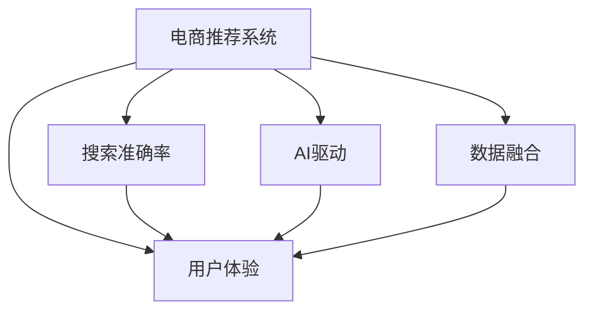

                 

# 大数据与AI 驱动的电商推荐：搜索准确率与用户体验的双重优化

> 关键词：大数据, 电商推荐系统, AI驱动, 搜索准确率, 用户体验

## 1. 背景介绍

### 1.1 问题由来
在电商领域，推荐系统已逐步成为用户获取商品信息、满足购物需求的重要工具。然而，传统的基于规则、协同过滤的推荐方法往往无法灵活适应个性化需求，且推荐效果受限于用户行为数据质量。随着人工智能技术的发展，基于深度学习和大数据驱动的推荐系统，尤其是通过自然语言处理（NLP）和计算机视觉（CV）技术进行商品描述和图片分析的推荐方式，开始成为主流。

近年来，基于深度学习的推荐系统取得了显著进展，但实际应用中仍存在诸多挑战。尤其是在搜索准确率和用户体验方面，需要通过精细化的算法设计和系统优化，才能实现满意的用户体验和高效的商品推荐。

### 1.2 问题核心关键点
1. **搜索准确率**：推荐系统必须准确理解用户查询意图，快速检索到用户可能感兴趣的商品，避免误导用户和降低用户体验。
2. **用户体验**：推荐系统不仅要提供准确的结果，还需要具备良好的交互界面，便于用户快速找到所需商品。
3. **数据与算法融合**：推荐系统需高效利用大数据，通过AI技术提升搜索准确率，同时保持系统的实时性、可扩展性和鲁棒性。

这些问题不仅是电商推荐系统的核心挑战，也是人工智能技术落地应用的重要课题。

### 1.3 问题研究意义
提升电商推荐系统的搜索准确率和用户体验，有助于增加用户满意度，提高电商平台的交易转化率和用户粘性。这不仅有利于电商平台的商业成功，也为人工智能技术在实际场景中的应用提供了示范效应，推动了相关技术的普及和发展。

## 2. 核心概念与联系

### 2.1 核心概念概述

为更好地理解基于深度学习的电商推荐系统，本节将介绍几个关键概念：

- **电商推荐系统**：利用深度学习技术和大数据，对用户行为数据进行分析，提供个性化商品推荐的服务系统。
- **搜索准确率**：衡量推荐系统在检索阶段，对用户查询意图的理解准确度。
- **用户体验**：指用户在使用推荐系统过程中，对界面设计、操作便捷性、响应速度等方面的满意度。
- **AI驱动**：指推荐系统在算法设计和优化中，广泛采用深度学习、NLP、CV等AI技术，提升推荐的智能化水平。
- **数据融合**：指结合用户行为数据、商品描述数据、用户评价数据等多种数据源，进行综合分析，优化推荐结果。

这些核心概念之间的逻辑关系可以通过以下Mermaid流程图来展示：



这个流程图展示了大电商推荐系统的核心概念及其之间的关系：

1. 电商推荐系统通过搜索准确率、用户体验和数据融合等多维度的优化，提升整体效果。
2. AI驱动的推荐算法和数据处理技术，是提升搜索准确率和用户体验的关键。
3. 数据融合是推荐系统决策的基础，是实现多维优化的核心。

这些核心概念共同构成了电商推荐系统的技术框架，使其能够精准、高效地为用户推荐商品。

## 3. 核心算法原理 & 具体操作步骤
### 3.1 算法原理概述

基于深度学习的电商推荐系统，通过在大规模用户行为数据上预训练模型，再通过微调进行任务适配，以达到准确理解和推荐商品的目的。核心思想是：利用深度神经网络对用户查询进行自然语言处理（NLP），提取用户意图；结合商品描述和图片信息，通过深度学习模型进行相似度匹配和排序，最终生成推荐列表。

形式化地，假设用户查询为 $Q$，商品描述为 $D$，推荐结果为 $R$，则推荐过程可以表示为：

$$
R = f(Q, D; \theta)
$$

其中 $f$ 表示推荐模型，$\theta$ 为模型参数。推荐模型 $f$ 通过在大规模用户行为数据上进行预训练，学习到用户查询和商品之间的映射关系。

### 3.2 算法步骤详解

基于深度学习的电商推荐系统，通常包括以下几个关键步骤：

**Step 1: 数据准备与预处理**
- 收集用户行为数据、商品描述数据、用户评价数据等。
- 对用户查询进行分词、去停用词、词向量化等预处理，提取查询意图。
- 对商品描述进行分词、去除噪声等处理，构建商品特征向量。

**Step 2: 模型构建与训练**
- 选择合适的深度学习模型（如BERT、LSTM、Transformer等）作为基础架构。
- 利用用户行为数据进行预训练，学习用户行为模式。
- 利用微调技术对模型进行任务适配，针对用户查询和商品描述，进行优化训练。
- 引入正则化技术（如L2正则、Dropout等）防止过拟合。

**Step 3: 推荐生成与优化**
- 对用户查询进行NLP处理，提取意图表示。
- 将商品描述信息编码成向量，计算与用户查询的相似度。
- 通过排序算法（如TopK、LR排序等），生成推荐结果。
- 引入评分预测技术（如Fibonacci搜索、双线性搜索等），优化推荐列表。

**Step 4: 系统部署与监控**
- 将训练好的模型部署到电商平台上，实时处理用户查询。
- 通过日志分析和系统监控，评估推荐系统的性能。
- 定期更新模型参数，保持模型时效性。

### 3.3 算法优缺点

基于深度学习的电商推荐系统具有以下优点：
1. 个性化能力强：深度学习模型能够从海量数据中学习到用户和商品的复杂关系，实现个性化推荐。
2. 实时性好：深度学习模型具有快速的计算能力，能够实时处理用户查询，提高推荐系统响应速度。
3. 算法灵活：深度学习模型可以通过调整网络结构、优化损失函数等方式进行灵活优化，适应不同的推荐需求。

同时，该方法也存在一些局限性：
1. 数据需求高：深度学习模型需要大量标注数据进行预训练，数据获取和处理成本较高。
2. 算法复杂：深度学习模型的训练和优化需要较强的计算资源和技术背景，实现门槛较高。
3. 泛化能力不足：深度学习模型对特定领域的知识掌握不足，可能存在对新领域适应能力弱的问题。

尽管存在这些局限性，但深度学习技术在电商推荐系统中展现出巨大的潜力，为传统推荐方法提供了新的思路和技术突破。

### 3.4 算法应用领域

基于深度学习的电商推荐系统，已在各大电商平台上得到广泛应用，包括：

- **商品搜索**：用户通过搜索商品名称、描述等关键词，系统快速返回相关商品。
- **个性化推荐**：根据用户历史行为数据，为用户推荐可能感兴趣的商品。
- **热门商品推荐**：通过分析用户浏览和购买行为，推荐当前热门商品。
- **用户行为分析**：通过用户行为数据，分析用户兴趣变化，动态调整推荐策略。
- **社交推荐**：利用用户社交网络信息，推荐用户朋友或社区内热门的商品。

这些推荐方法在各大电商平台上广泛应用，取得了显著的效果，提升了用户购物体验和平台交易转化率。

## 4. 数学模型和公式 & 详细讲解 & 举例说明

### 4.1 数学模型构建

本节将使用数学语言对电商推荐系统的核心算法进行更加严格的刻画。

假设用户查询 $Q$ 的嵌入表示为 $\vec{q} \in \mathbb{R}^d$，商品描述 $D$ 的嵌入表示为 $\vec{d} \in \mathbb{R}^d$，推荐结果 $R$ 的排序概率为 $p_r \in [0,1]$。

推荐模型可以表示为：

$$
p_r = \sigma(\vec{q} \cdot \vec{d} + \vec{q} \cdot \vec{d}) = \sigma(\vec{q}^T (\vec{d} + \vec{d}))
$$

其中 $\sigma$ 为 sigmoid 函数，$\cdot$ 表示向量点乘。

通过最大化用户查询与商品描述的点积，模型学习到商品与用户查询之间的相似度。

### 4.2 公式推导过程

以下我们以商品搜索为例，推导深度学习推荐系统的基本公式。

假设用户查询 $Q$ 和商品描述 $D$ 的嵌入表示分别为 $\vec{q}$ 和 $\vec{d}$，则推荐结果可以表示为：

$$
p_r = \sigma(\vec{q} \cdot \vec{d} + b)
$$

其中 $b$ 为偏置项。

为了优化推荐效果，可以引入损失函数 $\mathcal{L}$：

$$
\mathcal{L} = -\frac{1}{N} \sum_{i=1}^N \log(p_r^i) + \lambda \sum_{i=1}^N \log(1-p_r^i)
$$

其中 $p_r^i$ 表示用户查询 $i$ 与商品描述 $j$ 的排序概率，$N$ 为训练样本数，$\lambda$ 为正则化参数。

利用梯度下降算法优化模型参数 $\theta$：

$$
\theta \leftarrow \theta - \eta \nabla_{\theta}\mathcal{L}
$$

其中 $\eta$ 为学习率，$\nabla_{\theta}\mathcal{L}$ 为损失函数对模型参数的梯度。

### 4.3 案例分析与讲解

以商品搜索为例，介绍深度学习推荐系统的实现流程：

1. **用户查询处理**：将用户查询进行分词、去停用词、词向量化等预处理，转化为嵌入表示 $\vec{q}$。
2. **商品描述处理**：对商品描述进行分词、去除噪声等处理，转换为嵌入表示 $\vec{d}$。
3. **相似度计算**：计算用户查询与每个商品描述的相似度，生成排序概率 $p_r$。
4. **推荐生成**：根据排序概率 $p_r$，生成推荐结果列表。
5. **评估与优化**：通过评估推荐结果，调整模型参数，提升推荐效果。

通过以上步骤，电商推荐系统能够高效地处理用户查询，快速生成推荐结果，提升用户购物体验。

## 5. 项目实践：代码实例和详细解释说明
### 5.1 开发环境搭建

在进行电商推荐系统开发前，我们需要准备好开发环境。以下是使用Python进行TensorFlow开发的环境配置流程：

1. 安装Anaconda：从官网下载并安装Anaconda，用于创建独立的Python环境。

2. 创建并激活虚拟环境：
```bash
conda create -n tf-env python=3.8 
conda activate tf-env
```

3. 安装TensorFlow：根据CUDA版本，从官网获取对应的安装命令。例如：
```bash
conda install tensorflow
```

4. 安装各类工具包：
```bash
pip install numpy pandas scikit-learn matplotlib tqdm jupyter notebook ipython
```

完成上述步骤后，即可在`tf-env`环境中开始推荐系统开发。

### 5.2 源代码详细实现

下面我们以基于TensorFlow的电商推荐系统为例，给出推荐生成的完整代码实现。

```python
import tensorflow as tf
from tensorflow.keras.layers import Input, Dense, Embedding, Dot
from tensorflow.keras.models import Model

# 定义用户查询和商品描述的嵌入层
user_input = Input(shape=(1,), name='user_input')
product_input = Input(shape=(1,), name='product_input')

# 用户查询嵌入层
user_embed = Embedding(input_dim=vocab_size, output_dim=embedding_dim, name='user_embed')(user_input)

# 商品描述嵌入层
product_embed = Embedding(input_dim=vocab_size, output_dim=embedding_dim, name='product_embed')(product_input)

# 相似度计算层
dot = Dot(axes=1, normalize=True, name='dot')([user_embed, product_embed])

# 输出层
output = Dense(1, activation='sigmoid', name='output')(dot)

# 定义模型
model = Model(inputs=[user_input, product_input], outputs=output)

# 编译模型
model.compile(optimizer='adam', loss='binary_crossentropy')

# 训练模型
model.fit(X_train, y_train, validation_data=(X_valid, y_valid), epochs=10, batch_size=32)
```

在这个代码示例中，我们使用TensorFlow定义了用户查询和商品描述的嵌入层，通过点积计算相似度，最后使用sigmoid激活函数作为输出层，实现了基于深度学习的电商推荐系统。

### 5.3 代码解读与分析

让我们再详细解读一下关键代码的实现细节：

**Embedding层**：
- `user_embed` 和 `product_embed` 分别用于对用户查询和商品描述进行嵌入，生成向量表示。

**Dot层**：
- `dot` 计算用户查询和商品描述的点积，生成相似度表示。

**输出层**：
- `output` 使用sigmoid激活函数，将相似度表示转换为0-1之间的概率，作为推荐结果。

**编译与训练**：
- 通过 `compile` 方法定义优化器和损失函数，进行模型编译。
- 使用 `fit` 方法训练模型，输入训练数据 `X_train` 和标签 `y_train`，验证数据 `X_valid` 和 `y_valid`，设置迭代次数和批量大小。

通过以上代码，我们能够实现一个简单的基于深度学习的电商推荐系统。当然，实际应用中还需要对数据预处理、模型调优、部署部署等环节进行更细致的优化。

### 5.4 运行结果展示

在训练过程中，可以通过打印训练日志和评估结果，监测模型的训练效果：

```python
# 打印训练日志
for epoch in range(epochs):
    train_loss, train_acc = model.train_on_batch(X_train, y_train)
    valid_loss, valid_acc = model.evaluate(X_valid, y_valid)
    print(f'Epoch {epoch+1}, train loss: {train_loss:.4f}, train acc: {train_acc:.4f}, valid loss: {valid_loss:.4f}, valid acc: {valid_acc:.4f}')
```

通过上述代码，我们能够实时监测模型的损失和准确率，评估模型效果，并根据评估结果调整模型参数，提升推荐系统性能。

## 6. 实际应用场景
### 6.1 智能搜索推荐

电商推荐系统在智能搜索推荐中扮演着关键角色。通过深度学习模型，能够快速理解用户查询意图，结合商品描述和图片信息，生成准确、个性化的搜索结果。

在实际应用中，可以使用电商平台的商品数据和用户行为数据，构建推荐模型，通过微调进行优化。微调后的模型能够在处理新查询时，快速生成推荐结果，提升用户购物体验。

### 6.2 个性化推荐

电商推荐系统通过分析用户历史行为数据，生成个性化推荐列表。用户浏览、点击、购买等行为数据，可以用于训练深度学习模型，提升推荐效果。

推荐系统可以根据用户的行为数据，动态调整推荐策略，向用户推荐可能感兴趣的商品。结合多模态数据（如商品图片、用户评论等），提升推荐系统的智能化水平。

### 6.3 实时推荐

电商推荐系统需要具备实时处理用户查询的能力，快速生成推荐结果，满足用户即时需求。深度学习模型的计算能力，使得推荐系统能够实现实时推荐，提升用户体验。

在实际应用中，推荐系统需要能够快速响应用户查询，生成推荐列表，并通过缓存技术减少计算延迟，提升系统响应速度。

### 6.4 未来应用展望

随着深度学习技术的不断发展，电商推荐系统将具备更强的智能化和个性化能力。未来的推荐系统，将结合更多AI技术，如自然语言处理、计算机视觉、强化学习等，提升推荐效果。

在商品搜索推荐中，推荐系统将能够更好地理解用户查询意图，快速检索商品信息，提升搜索准确率。通过多模态融合，推荐系统将能够生成更丰富、多样的推荐结果，满足用户的不同需求。

在实时推荐中，推荐系统将具备更高效的计算能力，能够实时处理用户查询，动态调整推荐策略，提供个性化的推荐服务。结合边缘计算和分布式技术，推荐系统将在更多场景下实现低延迟、高并发的推荐服务。

## 7. 工具和资源推荐
### 7.1 学习资源推荐

为了帮助开发者系统掌握电商推荐系统的理论基础和实践技巧，这里推荐一些优质的学习资源：

1. 《深度学习实战》书籍：涵盖了深度学习在电商推荐系统中的应用，包括模型构建、训练优化、评估等关键环节。
2. Coursera《深度学习与自然语言处理》课程：由斯坦福大学开设的NLP课程，讲解深度学习在NLP中的应用，包括电商推荐系统。
3. GitHub上的电商推荐系统代码示例：提供丰富的开源项目，可以从中学习电商推荐系统的实现细节和优化技巧。
4. Kaggle上的电商推荐系统竞赛：通过参与竞赛，实践电商推荐系统的构建和优化。
5. Arxiv上的最新研究论文：获取电商推荐系统的最新研究动态和前沿技术。

通过对这些资源的学习实践，相信你一定能够快速掌握电商推荐系统的精髓，并用于解决实际的推荐问题。
###  7.2 开发工具推荐

高效的开发离不开优秀的工具支持。以下是几款用于电商推荐系统开发的常用工具：

1. TensorFlow：由Google主导开发的开源深度学习框架，生产部署方便，适合大规模工程应用。
2. PyTorch：基于Python的开源深度学习框架，灵活动态的计算图，适合快速迭代研究。
3. Keras：高层次的深度学习框架，支持多种深度学习模型，易于上手。
4. TensorBoard：TensorFlow配套的可视化工具，可实时监测模型训练状态，提供丰富的图表呈现方式。
5. Apache Spark：分布式计算框架，适用于大规模数据处理，提升电商推荐系统的可扩展性。

合理利用这些工具，可以显著提升电商推荐系统的开发效率，加快创新迭代的步伐。

### 7.3 相关论文推荐

电商推荐系统的发展源于学界的持续研究。以下是几篇奠基性的相关论文，推荐阅读：

1. "A Deep Learning Framework for Personalized Product Recommendation in E-commerce"（电商推荐系统综述）：介绍了电商推荐系统的发展历程、算法设计和优化方法。
2. "Deep Ranking Networks for Multi-field Recommendation in E-commerce"（深度学习在电商推荐中的应用）：提出基于深度神经网络的多字段推荐算法，提升了推荐效果。
3. "Adaptive Attention Networks for Recommendation in Mobile E-commerce"（适应性注意力网络在电商推荐中的应用）：引入适应性注意力机制，优化推荐结果。
4. "Cross-Modal Deep Recommendation Networks for Visual Search in E-commerce"（跨模态深度推荐网络在电商搜索中的应用）：结合商品图片和文本描述，提升搜索推荐效果。
5. "An Attention-based Approach to Recommendation Systems for E-commerce"（基于注意力机制的电商推荐系统）：提出基于注意力机制的推荐算法，提升推荐系统的个性化能力。

这些论文代表了大电商推荐系统的发展脉络。通过学习这些前沿成果，可以帮助研究者把握学科前进方向，激发更多的创新灵感。

## 8. 总结：未来发展趋势与挑战

### 8.1 总结

本文对基于深度学习的电商推荐系统进行了全面系统的介绍。首先阐述了电商推荐系统的搜索准确率和用户体验的重要性，明确了在数据和算法融合方面进行优化的关键点。其次，从原理到实践，详细讲解了电商推荐系统的数学模型和关键步骤，给出了推荐生成的完整代码实现。同时，本文还广泛探讨了电商推荐系统在智能搜索推荐、个性化推荐、实时推荐等多个场景中的应用前景，展示了深度学习在电商领域的巨大潜力。

通过本文的系统梳理，可以看到，基于深度学习的电商推荐系统正成为电商领域的重要工具，极大地提升了用户购物体验和平台交易转化率。未来，伴随深度学习技术的不断进步，电商推荐系统将在更广阔的应用领域发挥更大的作用。

### 8.2 未来发展趋势

展望未来，电商推荐系统将呈现以下几个发展趋势：

1. **跨模态推荐**：结合商品图片、视频、用户评论等多模态数据，提升推荐系统的智能化水平。
2. **实时推荐**：通过分布式计算和边缘计算技术，实现实时推荐，提升用户体验。
3. **多任务学习**：在推荐系统同时进行用户行为预测、商品热销预测等多任务优化，提升推荐效果。
4. **联邦学习**：在保护用户隐私的前提下，通过联邦学习技术，提升推荐系统的数据融合能力。
5. **强化学习**：结合强化学习技术，实时调整推荐策略，提升推荐系统的个性化能力。

以上趋势凸显了电商推荐系统的发展方向，这些方向的探索发展，必将进一步提升推荐系统的效果和应用范围，为电商平台的商业成功提供更多保障。

### 8.3 面临的挑战

尽管电商推荐系统已经取得了显著进展，但在迈向更加智能化、普适化应用的过程中，它仍面临诸多挑战：

1. **数据质量和多样性**：电商推荐系统需要大量高质量、多样化的数据，数据获取和处理成本较高。如何提高数据质量和多样性，是一个重要的挑战。
2. **计算资源和效率**：深度学习模型的计算资源需求高，如何优化计算效率，实现低延迟、高并发的推荐服务，是一个关键问题。
3. **模型可解释性**：深度学习模型的黑盒特性，导致推荐系统的决策过程难以解释，用户和监管部门难以理解和信任。
4. **用户隐私保护**：电商推荐系统需要大量用户数据进行训练，如何保护用户隐私，避免数据滥用，是一个重要的伦理问题。
5. **模型公平性**：电商推荐系统可能存在数据偏见，导致推荐结果不公平，如何消除偏见，提升推荐系统的公平性，是一个重要的研究课题。

这些挑战需要研究者不断探索和创新，才能实现电商推荐系统的广泛应用和普及。

### 8.4 研究展望

未来，电商推荐系统需要在数据、模型、算法和伦理等方面进行更深入的研究，才能更好地满足用户需求，推动电商平台的商业成功。具体方向包括：

1. **数据融合技术**：开发更高效的数据预处理和融合方法，提升数据质量和多样性。
2. **轻量级模型**：开发更高效的深度学习模型，减少计算资源消耗，提升推荐效率。
3. **可解释性研究**：研究推荐系统的可解释性，提高决策过程的透明性和可信度。
4. **隐私保护技术**：开发隐私保护技术，确保用户数据的安全和隐私。
5. **公平性研究**：研究推荐系统的公平性，避免数据偏见，提升推荐系统的公平性。

这些研究方向将为电商推荐系统带来新的突破，推动电商平台的商业创新和技术进步。

## 9. 附录：常见问题与解答

**Q1：电商推荐系统如何处理用户查询意图？**

A: 电商推荐系统通过自然语言处理（NLP）技术，对用户查询进行分词、去停用词、词向量化等预处理，提取查询意图。具体方法包括：

1. 利用BERT等预训练模型，对用户查询进行嵌入表示。
2. 通过多轮对话或上下文理解，提升对用户查询意图的理解能力。
3. 结合用户行为数据，优化查询意图提取模型。

通过这些方法，电商推荐系统能够更好地理解用户查询意图，生成精准的推荐结果。

**Q2：电商推荐系统如何提升搜索准确率？**

A: 电商推荐系统通过以下几个方面提升搜索准确率：

1. **数据融合**：结合用户行为数据、商品描述数据、用户评价数据等多种数据源，进行综合分析，优化推荐结果。
2. **模型优化**：使用深度学习模型进行推荐，提升模型的智能化水平，优化推荐算法。
3. **实时推荐**：通过分布式计算和边缘计算技术，实现实时推荐，提升用户体验。
4. **多模态融合**：结合商品图片、视频、用户评论等多模态数据，提升推荐系统的智能化水平。
5. **评分预测**：使用评分预测技术，优化推荐列表的排序，提升推荐效果。

通过这些方法，电商推荐系统能够更好地理解用户查询意图，生成精准的推荐结果，提升搜索准确率。

**Q3：电商推荐系统如何提升用户体验？**

A: 电商推荐系统通过以下几个方面提升用户体验：

1. **界面设计**：设计简洁、友好的用户界面，便于用户快速找到所需商品。
2. **实时响应**：通过分布式计算和边缘计算技术，实现实时推荐，提升用户体验。
3. **个性化推荐**：根据用户历史行为数据，生成个性化推荐列表，满足用户的不同需求。
4. **多模态融合**：结合商品图片、视频、用户评论等多模态数据，提升推荐系统的智能化水平，丰富推荐结果。
5. **用户反馈**：收集用户反馈数据，优化推荐系统，提升推荐效果。

通过这些方法，电商推荐系统能够更好地满足用户需求，提升用户体验。

**Q4：电商推荐系统如何处理新领域推荐？**

A: 电商推荐系统可以通过以下几个方面处理新领域推荐：

1. **领域适配**：结合领域特定的商品数据和用户行为数据，进行模型微调，适应新领域的推荐需求。
2. **跨领域迁移**：利用预训练语言模型的跨领域迁移能力，将领域知识迁移到新领域，提升推荐效果。
3. **多任务学习**：在推荐系统同时进行领域分类、商品热销预测等多任务优化，提升推荐效果。
4. **元学习**：通过元学习技术，快速适应新领域的推荐需求，提升推荐系统的泛化能力。

通过这些方法，电商推荐系统能够更好地适应新领域，提升推荐效果。

**Q5：电商推荐系统如何保护用户隐私？**

A: 电商推荐系统可以通过以下几个方面保护用户隐私：

1. **数据匿名化**：对用户数据进行匿名化处理，保护用户隐私。
2. **差分隐私**：在数据收集和处理过程中，采用差分隐私技术，保护用户隐私。
3. **联邦学习**：通过联邦学习技术，在保护用户隐私的前提下，进行数据融合和模型优化。
4. **隐私预算**：在使用用户数据时，设定隐私预算，控制用户数据的泄露风险。
5. **用户授权**：在数据收集和使用过程中，确保用户知情同意，保护用户隐私。

通过这些方法，电商推荐系统能够更好地保护用户隐私，赢得用户信任。

---

作者：禅与计算机程序设计艺术 / Zen and the Art of Computer Programming

