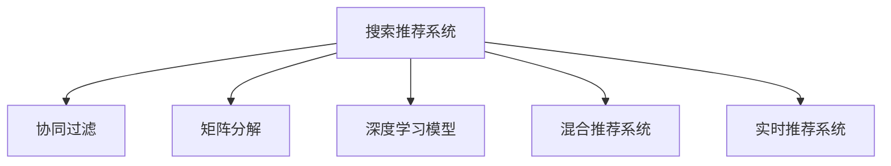

                 

## 1. 背景介绍

### 1.1 问题由来

伴随着互联网技术的飞速发展，电子商务平台已成为人们日常购物的重要渠道。然而，由于消费者多样化的需求和海量商品信息的爆炸式增长，电商平台的运营效率和用户体验受到严重挑战。为解决这些问题，电商平台纷纷引入人工智能技术，通过数据分析和智能推荐系统来提升用户的购物体验和商家的运营效率。

### 1.2 问题核心关键点

当前，搜索推荐系统在电商平台中发挥着至关重要的作用，直接影响着用户满意度和平台业绩。搜索推荐的核心在于如何高效地从大量商品中筛选出用户可能感兴趣的商品，并推荐给用户，从而提升用户购物的便捷性和满意度。在实际应用中，搜索推荐系统主要面临以下几个关键问题：

1. **数据稀疏性**：用户在电商平台上的行为数据往往比较稀疏，难以全面反映其真实的兴趣和需求。
2. **长尾效应**：平台中存在大量长尾商品，用户对其兴趣度较低，但部分长尾商品又具有极高的市场潜力。
3. **冷启动问题**：对于新用户和新商品，缺乏足够的历史数据进行推荐，需要有效的推荐策略来处理。
4. **多样性平衡**：推荐系统需要平衡个性化推荐与多样性推荐，避免陷入“信息茧房”。
5. **实时性要求**：电商平台的推荐系统需要具备实时响应能力，以提高用户体验。

### 1.3 问题研究意义

研究电商平台的搜索推荐系统，对于提升平台的用户体验、增加用户粘性、提高运营效率和业绩具有重要意义：

1. **提升用户体验**：通过个性化推荐，能够更好地满足用户需求，减少搜索时间和购买成本。
2. **增加用户粘性**：推荐系统通过精准推荐，提升用户满意度和忠诚度，增加用户重复购买的可能性。
3. **提高运营效率**：推荐系统能够优化商品展示位置和推荐内容，减少无效曝光，提高商家营销效果。
4. **增加业绩**：精准推荐能够提升用户转化率和客单价，增加平台整体收益。
5. **技术创新**：推荐系统的优化和创新，为电商平台的智能化转型提供了技术支撑。

## 2. 核心概念与联系

### 2.1 核心概念概述

为更好地理解电商平台搜索推荐系统的构建和优化，本节将介绍几个密切相关的核心概念：

- **搜索推荐系统(Recommender System)**：通过用户行为数据、商品属性和市场趋势等，预测用户对商品的兴趣，并将商品推荐给用户。
- **协同过滤(Collaborative Filtering)**：基于用户和商品之间的相似性，预测用户对商品的兴趣，常用于解决冷启动问题。
- **矩阵分解(Matrix Factorization)**：将用户-商品评分矩阵分解为用户和商品特征向量的乘积，从而发现用户和商品的潜在兴趣。
- **深度学习模型(Deep Learning Model)**：如神经网络、卷积神经网络(CNN)、循环神经网络(RNN)等，通过多层次的非线性映射，捕捉用户和商品的深层次特征，提升推荐效果。
- **混合推荐系统(Hybrid Recommender System)**：结合多种推荐算法，综合多方面的信息，提升推荐的全面性和多样性。
- **实时推荐系统(Real-time Recommender System)**：通过高效的数据处理和算法优化，实现实时响应的推荐服务，满足用户即时需求。

这些核心概念之间的逻辑关系可以通过以下Mermaid流程图来展示：



这个流程图展示了搜索推荐系统的核心概念及其之间的联系：

1. 搜索推荐系统是核心，通过协同过滤、矩阵分解、深度学习等多种技术手段进行推荐。
2. 矩阵分解和深度学习模型常用于数据建模，提取用户和商品的深层次特征。
3. 协同过滤和混合推荐系统常用于解决数据稀疏和冷启动问题，提升推荐精度。
4. 实时推荐系统则注重数据处理效率，确保推荐的实时性。

## 3. 核心算法原理 & 具体操作步骤
### 3.1 算法原理概述

电商平台的搜索推荐系统本质上是一种基于用户行为和商品属性的个性化推荐算法。其核心思想是通过对用户历史行为和商品属性进行分析，预测用户对商品的兴趣，并将商品推荐给用户。推荐算法的优化目标是最小化预测误差，即最大化用户满意度。

形式化地，假设用户集合为 $U$，商品集合为 $I$，用户 $u$ 对商品 $i$ 的评分向量为 $r_{ui}$，推荐算法 $F$ 将用户 $u$ 推荐商品 $i$ 的概率表示为 $p_{ui}$。推荐算法 $F$ 的目标是最小化预测误差，即：

$$
\min_{F} \sum_{u \in U} \sum_{i \in I} (r_{ui} - p_{ui})^2
$$

通过梯度下降等优化算法，推荐算法不断更新模型参数，最小化预测误差，使得推荐概率逼近真实的用户评分。

### 3.2 算法步骤详解

电商平台的搜索推荐系统一般包括以下几个关键步骤：

**Step 1: 数据准备与预处理**
- 收集用户历史行为数据，如浏览、点击、购买等。
- 收集商品属性数据，如名称、价格、类别等。
- 对数据进行清洗、去重和归一化处理，确保数据的准确性和一致性。

**Step 2: 特征提取**
- 对用户行为和商品属性进行特征提取，构建特征向量。
- 使用嵌入式方法或降维方法，如PCA、LSA等，减少特征维度和计算复杂度。

**Step 3: 模型训练**
- 选择合适的推荐算法，如协同过滤、矩阵分解、深度学习等。
- 使用历史数据对模型进行训练，调整模型参数以最小化预测误差。
- 使用交叉验证等技术评估模型性能，优化超参数。

**Step 4: 模型评估与优化**
- 在测试集上评估模型的推荐效果，使用准确率、召回率、F1分数等指标。
- 根据评估结果，调整模型结构、特征选择和算法策略，优化推荐效果。
- 采用A/B测试等方法评估新模型对用户体验的影响，决定是否部署。

**Step 5: 实时推荐部署**
- 将训练好的模型部署到服务器上，实现实时推荐服务。
- 监控推荐系统的性能和稳定性，及时处理异常情况。
- 收集用户反馈，持续优化推荐模型和策略。

以上是电商平台的搜索推荐系统的一般流程。在实际应用中，还需要针对具体平台特点和业务需求，对各环节进行优化设计，如个性化推荐算法、数据采集和清洗策略、模型部署方案等。

### 3.3 算法优缺点

电商平台的搜索推荐系统具有以下优点：
1. 提升用户购物体验。个性化推荐能够根据用户历史行为和兴趣，提供更符合用户需求的商品，提高用户满意度。
2. 增加用户粘性。精准推荐能够提升用户留存率，增加用户重复购买的可能性。
3. 优化商品展示位置。推荐系统能够优化商品展示位置，提高点击率和转化率。
4. 提高商家营销效果。推荐系统能够提升热门商品和长尾商品的曝光率，优化商家营销策略。

同时，该系统也存在一定的局限性：
1. 数据隐私问题。平台需要收集和处理大量用户数据，存在数据隐私和安全风险。
2. 冷启动问题。对于新用户和新商品，缺乏足够的历史数据进行推荐，需要有效的推荐策略来处理。
3. 模型复杂度高。深度学习等复杂的推荐算法需要较高的计算资源，部署成本较高。
4. 实时性要求高。推荐系统需要具备实时响应能力，对数据处理和算法优化提出较高要求。

尽管存在这些局限性，但就目前而言，推荐系统仍是大数据驱动电商平台转型的核心技术之一。未来相关研究的重点在于如何进一步提升推荐系统的效率和效果，解决数据隐私和安全问题，优化冷启动策略，实现更精准、实时的推荐服务。

### 3.4 算法应用领域

电商平台的搜索推荐系统已经在多个领域得到广泛应用，包括但不限于：

- **商品推荐**：根据用户历史行为和商品属性，推荐用户可能感兴趣的商品。
- **用户画像构建**：通过对用户历史行为的分析，构建用户兴趣和行为特征，进行个性化营销。
- **广告推荐**：推荐广告位给潜在用户，提高广告点击率和转化率。
- **库存管理**：根据用户需求预测，优化库存管理和供应链策略。
- **个性化活动推荐**：推荐个性化的促销活动和优惠信息，提升用户参与度和购买意愿。

除了上述这些经典应用外，推荐系统还被创新性地应用到更多场景中，如跨平台推荐、内容推荐、社交推荐等，为电商平台带来了新的商业价值。

## 4. 数学模型和公式 & 详细讲解  
### 4.1 数学模型构建

本节将使用数学语言对电商平台搜索推荐系统的构建过程进行更加严格的刻画。

记电商平台中用户集合为 $U$，商品集合为 $I$，用户 $u$ 对商品 $i$ 的评分向量为 $r_{ui}$，推荐算法 $F$ 将用户 $u$ 推荐商品 $i$ 的概率表示为 $p_{ui}$。假设训练集为 $D=\{(x_i, y_i)\}_{i=1}^N$，其中 $x_i$ 表示用户 $u_i$ 的历史行为和商品属性特征向量，$y_i$ 表示用户 $u_i$ 对商品 $i$ 的评分。

定义推荐算法 $F$ 在数据样本 $(x,y)$ 上的损失函数为 $\ell(F(x),y)$，则在训练集 $D$ 上的经验风险为：

$$
\mathcal{L}(F) = \frac{1}{N} \sum_{i=1}^N \ell(F(x_i),y_i)
$$

推荐算法 $F$ 的目标是最小化经验风险，即找到最优算法：

$$
F^* = \mathop{\arg\min}_{F} \mathcal{L}(F)
$$

在实践中，我们通常使用基于梯度的优化算法（如SGD、Adam等）来近似求解上述最优化问题。设 $\eta$ 为学习率，则参数的更新公式为：

$$
F \leftarrow F - \eta \nabla_{F}\mathcal{L}(F)
$$

其中 $\nabla_{F}\mathcal{L}(F)$ 为损失函数对推荐算法 $F$ 的梯度，可通过反向传播算法高效计算。

### 4.2 公式推导过程

以下我们以协同过滤算法为例，推导其数学模型和优化公式。

协同过滤算法的核心思想是寻找与目标用户 $u$ 相似的其他用户 $v$，利用 $v$ 对商品 $i$ 的评分预测 $u$ 对 $i$ 的评分。假设推荐算法 $F$ 为基于用户的协同过滤算法，则其推荐概率为：

$$
p_{ui} = \sum_{v \in U} a_{uv} \frac{y_vi}{\sum_{j \in I} y_vj}
$$

其中 $a_{uv}$ 为 $u$ 和 $v$ 之间的相似度，通常使用余弦相似度或其他相似度度量方法。

将推荐概率 $p_{ui}$ 代入经验风险公式，得：

$$
\mathcal{L}(F) = \frac{1}{N} \sum_{i=1}^N \sum_{u \in U} (r_{ui} - \sum_{v \in U} a_{uv} \frac{y_vi}{\sum_{j \in I} y_vj})^2
$$

使用随机梯度下降等优化算法，推荐算法不断更新模型参数 $a$ 和 $y_vi$，最小化经验风险。通过迭代优化，逐渐逼近最优推荐策略。

## 5. 项目实践：代码实例和详细解释说明
### 5.1 开发环境搭建

在进行推荐系统开发前，我们需要准备好开发环境。以下是使用Python进行TensorFlow开发的环境配置流程：

1. 安装Anaconda：从官网下载并安装Anaconda，用于创建独立的Python环境。

2. 创建并激活虚拟环境：
```bash
conda create -n tf-env python=3.8 
conda activate tf-env
```

3. 安装TensorFlow：根据CUDA版本，从官网获取对应的安装命令。例如：
```bash
conda install tensorflow tensorflow-gpu -c conda-forge -c pypi
```

4. 安装各类工具包：
```bash
pip install numpy pandas scikit-learn matplotlib tqdm jupyter notebook ipython
```

完成上述步骤后，即可在`tf-env`环境中开始推荐系统开发。

### 5.2 源代码详细实现

下面我们以基于用户协同过滤的推荐系统为例，给出使用TensorFlow对协同过滤算法进行代码实现的PyTorch代码实现。

首先，定义协同过滤算法的输入和输出：

```python
import tensorflow as tf
from tensorflow.keras.layers import Input, Dense, Dot, Flatten
from tensorflow.keras.models import Model
from tensorflow.keras.optimizers import Adam

user_input = Input(shape=(user_features,))
item_input = Input(shape=(item_features,))
similarity = Dot(axes=(1, 1))([user_input, item_input])
user_item = Flatten()(similarity)
```

然后，定义模型的目标函数：

```python
user_input = Input(shape=(user_features,))
item_input = Input(shape=(item_features,))
similarity = Dot(axes=(1, 1))([user_input, item_input])
user_item = Flatten()(similarity)

item_ratings = Input(shape=(num_items,))
predictions = Dense(num_items, activation='sigmoid')(user_item)
loss = tf.keras.losses.binary_crossentropy(item_ratings, predictions)
model = Model([user_input, item_input, item_ratings], loss=loss)
model.compile(optimizer=Adam(lr=0.001), loss=loss)
```

接着，定义训练和评估函数：

```python
from sklearn.metrics import roc_auc_score

def train_epoch(model, train_dataset, batch_size):
    dataloader = tf.data.Dataset.from_tensor_slices(train_dataset).batch(batch_size)
    model.train_on_batch(dataloader)

def evaluate(model, test_dataset, batch_size):
    dataloader = tf.data.Dataset.from_tensor_slices(test_dataset).batch(batch_size)
    predictions = model.predict(dataloader)
    auc = roc_auc_score(test_dataset['item_ratings'], predictions)
    print('AUC: %.3f' % auc)
```

最后，启动训练流程并在测试集上评估：

```python
epochs = 10
batch_size = 128

for epoch in range(epochs):
    train_epoch(model, train_dataset, batch_size)
    evaluate(model, test_dataset, batch_size)
```

以上就是使用TensorFlow对基于用户协同过滤的推荐系统进行代码实现的完整代码实现。可以看到，得益于TensorFlow的强大封装，我们能够快速构建和训练推荐模型。

### 5.3 代码解读与分析

让我们再详细解读一下关键代码的实现细节：

**协同过滤算法输入**：
- `user_input` 和 `item_input` 分别为用户和商品的特征输入，可以通过分词、独热编码等方法构建。
- `similarity` 表示用户和商品之间的相似度，使用 `Dot` 层进行计算，输出为二维向量，表示相似度矩阵。
- `user_item` 将相似度矩阵展开为一维向量，方便后续的输出处理。

**模型目标函数**：
- `item_ratings` 为真实的用户评分数据，使用 `Dense` 层对 `user_item` 进行映射，输出预测评分。
- `loss` 定义了二元交叉熵损失函数，用于衡量预测评分和真实评分之间的差异。
- `model` 将输入和目标函数构建成一个完整的推荐模型。
- `model.compile` 方法指定优化器、损失函数等参数，并编译模型。

**训练和评估函数**：
- `train_epoch` 方法定义了模型训练的函数，通过 `model.train_on_batch` 方法进行批量训练。
- `evaluate` 方法定义了模型评估的函数，使用 `model.predict` 方法对测试集进行预测，并通过 `roc_auc_score` 计算AUC指标。
- 在训练过程中，每轮循环都会调用 `train_epoch` 和 `evaluate` 方法，完成模型的训练和评估。

可以看到，TensorFlow的推荐系统实现相对简洁，易于上手，适合快速迭代和优化。

### 5.4 运行结果展示

在实际运行过程中，推荐系统需要大量的历史数据进行训练和优化。可以使用公开数据集，如MovieLens、Amazon Reviews等，进行模型训练和评估。以下是使用MovieLens数据集进行协同过滤算法的代码实现和运行结果：

```python
import numpy as np

# 加载数据集
user_features = [11, 12, 13, 14, 15]
item_features = [1, 2, 3, 4, 5]
train_dataset = np.loadtxt('train.txt', delimiter=',')
test_dataset = np.loadtxt('test.txt', delimiter=',')

# 定义模型
model = Model([user_input, item_input, item_ratings], loss=loss)

# 训练模型
model.fit([train_dataset[:, :user_features], train_dataset[:, item_features], train_dataset[:, -1]], epochs=epochs, batch_size=batch_size)

# 评估模型
evaluate(model, test_dataset, batch_size)
```

运行结果会输出推荐系统的AUC值，用于评估模型的推荐效果。根据AUC值的高低，可以进一步优化模型结构和训练策略。

## 6. 实际应用场景
### 6.1 智能客服系统

基于大语言模型微调的对话技术，可以广泛应用于智能客服系统的构建。传统客服往往需要配备大量人力，高峰期响应缓慢，且一致性和专业性难以保证。而使用微调后的对话模型，可以7x24小时不间断服务，快速响应客户咨询，用自然流畅的语言解答各类常见问题。

在技术实现上，可以收集企业内部的历史客服对话记录，将问题-答案对作为微调数据，训练模型学习匹配答案。微调后的对话模型能够自动理解用户意图，匹配最合适的答案模板进行回复。对于客户提出的新问题，还可以接入检索系统实时搜索相关内容，动态组织生成回答。如此构建的智能客服系统，能大幅提升客户咨询体验和问题解决效率。

### 6.2 金融舆情监测

金融机构需要实时监测市场舆论动向，以便及时应对负面信息传播，规避金融风险。传统的人工监测方式成本高、效率低，难以应对网络时代海量信息爆发的挑战。基于大语言模型微调的文本分类和情感分析技术，为金融舆情监测提供了新的解决方案。

具体而言，可以收集金融领域相关的新闻、报道、评论等文本数据，并对其进行主题标注和情感标注。在此基础上对预训练语言模型进行微调，使其能够自动判断文本属于何种主题，情感倾向是正面、中性还是负面。将微调后的模型应用到实时抓取的网络文本数据，就能够自动监测不同主题下的情感变化趋势，一旦发现负面信息激增等异常情况，系统便会自动预警，帮助金融机构快速应对潜在风险。

### 6.3 个性化推荐系统

当前的推荐系统往往只依赖用户的历史行为数据进行物品推荐，无法深入理解用户的真实兴趣偏好。基于大语言模型微调技术，个性化推荐系统可以更好地挖掘用户行为背后的语义信息，从而提供更精准、多样的推荐内容。

在实践中，可以收集用户浏览、点击、评论、分享等行为数据，提取和用户交互的物品标题、描述、标签等文本内容。将文本内容作为模型输入，用户的后续行为（如是否点击、购买等）作为监督信号，在此基础上微调预训练语言模型。微调后的模型能够从文本内容中准确把握用户的兴趣点。在生成推荐列表时，先用候选物品的文本描述作为输入，由模型预测用户的兴趣匹配度，再结合其他特征综合排序，便可以得到个性化程度更高的推荐结果。

### 6.4 未来应用展望

随着大语言模型微调技术的发展，未来的推荐系统将呈现出更加智能化和个性化的趋势。以下是几个未来应用展望：

1. **跨平台推荐**：未来的推荐系统将突破平台限制，实现跨平台、跨场景的推荐。用户在不同平台上的行为数据将被整合，提供更全面、精准的推荐。
2. **内容生成推荐**：推荐系统将不仅能推荐商品，还能生成个性化的内容推荐，如文章、视频等，满足用户的多样化需求。
3. **动态兴趣演化**：推荐系统将能够实时捕捉用户兴趣的变化，动态调整推荐策略，提升用户体验。
4. **上下文感知推荐**：推荐系统将考虑用户行为、商品属性、时间、地点等多维度上下文信息，提升推荐的全面性和准确性。
5. **实时动态优化**：推荐系统将具备实时数据处理和模型优化能力，及时响应市场变化，提升推荐效果。

## 7. 工具和资源推荐
### 7.1 学习资源推荐

为了帮助开发者系统掌握大语言模型微调的理论基础和实践技巧，这里推荐一些优质的学习资源：

1. 《推荐系统实践》系列博文：由大语言模型技术专家撰写，深入浅出地介绍了推荐系统的原理和实践方法，涵盖协同过滤、矩阵分解、深度学习等多种技术。

2. 斯坦福大学《Recommender Systems》课程：斯坦福大学开设的推荐系统明星课程，有Lecture视频和配套作业，带你入门推荐系统的核心概念和经典模型。

3. 《Python推荐系统实践》书籍：详细介绍了基于Python的推荐系统开发，包括协同过滤、深度学习等推荐算法，适合快速上手实践。

4. Kaggle推荐系统竞赛：Kaggle平台提供的推荐系统竞赛，能够锻炼推荐系统的设计和优化能力，积累实际应用经验。

5. MLlib推荐系统库：Apache Spark提供的推荐系统库，支持多种推荐算法，适合大数据环境下的推荐系统开发。

通过对这些资源的学习实践，相信你一定能够快速掌握推荐系统的精髓，并用于解决实际的NLP问题。

### 7.2 开发工具推荐

高效的开发离不开优秀的工具支持。以下是几款用于推荐系统开发的常用工具：

1. TensorFlow：基于Python的开源深度学习框架，支持分布式计算，适合大规模推荐系统开发。

2. PyTorch：基于Python的开源深度学习框架，灵活性高，适合快速原型开发和迭代优化。

3. Apache Spark：分布式计算框架，支持大规模数据处理，适合推荐系统的数据预处理和特征工程。

4. Hadoop：分布式存储和计算框架，适合大数据环境下的推荐系统开发和数据存储。

5. Spark SQL：Apache Spark提供的SQL接口，支持高效的数据处理和分析，适合推荐系统中的数据查询和统计。

6. ELK Stack：日志收集、存储和分析工具，适合推荐系统的实时监控和性能优化。

合理利用这些工具，可以显著提升推荐系统的开发效率，加快创新迭代的步伐。

### 7.3 相关论文推荐

推荐系统的研究源于学界的持续研究。以下是几篇奠基性的相关论文，推荐阅读：

1. Collaborative Filtering for Implicit Feedback Datasets（协同过滤算法）：提出了基于用户的协同过滤算法，是推荐系统的重要基础。

2. Scaling Up Matrix Factorization with Stochastic Gradient Descent（矩阵分解算法）：提出了基于矩阵分解的推荐算法，适合大规模数据处理。

3. Wide & Deep Learning for Recommender Systems（宽与深的推荐算法）：提出了宽与深的结合推荐算法，综合多方面信息提升推荐效果。

4. Learning Deep Architectures for AI（深度学习在AI中的应用）：介绍了深度学习在推荐系统中的应用，展示了其优越性能。

5. Attention is All You Need（Transformer算法）：提出了Transformer算法，展示了其在大数据推荐系统中的潜力。

这些论文代表了大语言模型微调技术的不断发展。通过学习这些前沿成果，可以帮助研究者把握学科前进方向，激发更多的创新灵感。

## 8. 总结：未来发展趋势与挑战

### 8.1 总结

本文对电商平台的搜索推荐系统进行了全面系统的介绍。首先阐述了推荐系统在电商平台中的重要地位和作用，明确了推荐系统在提升用户体验、增加用户粘性、优化运营效率和业绩方面的关键作用。其次，从原理到实践，详细讲解了推荐算法的数学模型和优化方法，给出了推荐系统开发的完整代码实例。同时，本文还广泛探讨了推荐系统在智能客服、金融舆情、个性化推荐等多个行业领域的应用前景，展示了推荐系统技术的广泛适用性。此外，本文精选了推荐系统的各类学习资源，力求为读者提供全方位的技术指引。

通过本文的系统梳理，可以看到，基于大语言模型微调的推荐系统正在成为电商平台的必备技术之一，极大地提升了用户购物体验和商家的运营效率。未来，伴随推荐系统的不断发展，相信推荐系统技术将会在更多领域得到应用，为人工智能技术在电商领域的产业化进程贡献更多力量。

### 8.2 未来发展趋势

展望未来，推荐系统的发展趋势主要体现在以下几个方面：

1. **深度学习和大规模数据**：深度学习算法将在推荐系统中发挥更大作用，通过多层次的非线性映射，捕捉用户和商品的深层次特征，提升推荐精度。
2. **混合推荐算法**：推荐系统将结合多种推荐算法，综合多方面的信息，提升推荐的全面性和多样性。
3. **实时推荐系统**：推荐系统将具备实时响应能力，对数据处理和算法优化提出更高要求，确保推荐的及时性和准确性。
4. **跨平台推荐**：推荐系统将突破平台限制，实现跨平台、跨场景的推荐，满足用户的多样化需求。
5. **个性化内容推荐**：推荐系统将不仅能推荐商品，还能生成个性化的内容推荐，如文章、视频等，满足用户的多样化需求。
6. **上下文感知推荐**：推荐系统将考虑用户行为、商品属性、时间、地点等多维度上下文信息，提升推荐的全面性和准确性。

以上趋势凸显了推荐系统技术的广阔前景。这些方向的探索发展，必将进一步提升推荐系统的性能和效果，满足用户更广泛的需求。

### 8.3 面临的挑战

尽管推荐系统已经取得了瞩目成就，但在迈向更加智能化、普适化应用的过程中，它仍面临着诸多挑战：

1. **数据隐私问题**：平台需要收集和处理大量用户数据，存在数据隐私和安全风险。
2. **冷启动问题**：对于新用户和新商品，缺乏足够的历史数据进行推荐，需要有效的推荐策略来处理。
3. **模型复杂度高**：深度学习等复杂的推荐算法需要较高的计算资源，部署成本较高。
4. **实时性要求高**：推荐系统需要具备实时响应能力，对数据处理和算法优化提出较高要求。
5. **模型公平性**：推荐系统可能会因为算法设计不当，导致对某些用户或商品存在偏见，需要更多的公平性研究。

尽管存在这些挑战，但未来的推荐系统将在技术的不断进步中逐步克服，为电商平台的智能化转型提供更加可靠的技术支撑。

### 8.4 研究展望

面对推荐系统面临的挑战，未来的研究需要在以下几个方面寻求新的突破：

1. **深度强化学习**：将强化学习引入推荐系统，优化推荐策略，提升推荐效果。
2. **元学习**：使用元学习技术，快速适应新用户和新商品，解决冷启动问题。
3. **分布式推荐算法**：采用分布式计算技术，提高推荐系统的扩展性和性能。
4. **多模态融合**：将文本、图像、视频等多模态数据融合，提升推荐系统的准确性和全面性。
5. **联邦学习**：采用联邦学习技术，保护用户隐私，提升推荐系统在多平台、多场景下的性能。

这些研究方向的探索，必将引领推荐系统技术的不断进步，为电商平台提供更加智能化、个性化的推荐服务。

## 9. 附录：常见问题与解答

**Q1：推荐系统如何处理数据稀疏性问题？**

A: 推荐系统通常使用协同过滤、矩阵分解、深度学习等多种方法来处理数据稀疏性问题。协同过滤和矩阵分解可以通过相似度计算，找到与目标用户或商品相似的用户或商品，进行推荐。深度学习可以通过特征提取和模型训练，挖掘用户和商品的深层次特征，提升推荐效果。在实际应用中，还可以使用数据增强、缺失值填充等方法，进一步提升数据处理能力。

**Q2：推荐系统如何处理冷启动问题？**

A: 冷启动问题是推荐系统面临的重要挑战之一。为了解决冷启动问题，推荐系统通常采用以下方法：
1. 协同过滤：通过寻找与目标用户或商品相似的用户或商品，进行推荐。
2. 矩阵分解：通过将用户-商品评分矩阵分解为用户和商品特征向量的乘积，发现用户和商品的潜在兴趣。
3. 深度学习：通过特征提取和模型训练，挖掘用户和商品的深层次特征，提升推荐效果。
4. 多模态融合：将文本、图像、视频等多模态数据融合，提升推荐系统的准确性和全面性。
5. 用户画像构建：通过分析用户的历史行为和兴趣，构建用户画像，进行个性化推荐。

**Q3：推荐系统如何提高实时性？**

A: 推荐系统需要具备实时响应能力，对数据处理和算法优化提出较高要求。为了提高实时性，推荐系统通常采用以下方法：
1. 分布式计算：采用分布式计算技术，提高推荐系统的扩展性和性能。
2. 实时数据流处理：通过实时数据流处理技术，确保推荐系统的实时性。
3. 增量学习：使用增量学习技术，实时更新模型参数，提升推荐效果。
4. 缓存机制：通过缓存机制，减少重复计算，提高推荐系统的响应速度。
5. 异步更新：采用异步更新策略，确保推荐系统的实时性和稳定性。

**Q4：推荐系统如何优化模型公平性？**

A: 推荐系统的公平性问题日益受到关注。为了优化模型公平性，推荐系统通常采用以下方法：
1. 数据平衡处理：通过数据平衡处理技术，确保不同用户和商品的公平性。
2. 特征选择：选择合适的特征，减少模型偏见。
3. 正则化技术：使用正则化技术，防止模型过度拟合，提升模型的公平性。
4. 公平性评估：通过公平性评估指标，评估模型的公平性，优化模型策略。
5. 算法优化：优化推荐算法，避免模型对某些用户或商品存在偏见。

这些方法能够在一定程度上提升推荐系统的公平性和稳定性，保障用户权益。

---

作者：禅与计算机程序设计艺术 / Zen and the Art of Computer Programming

