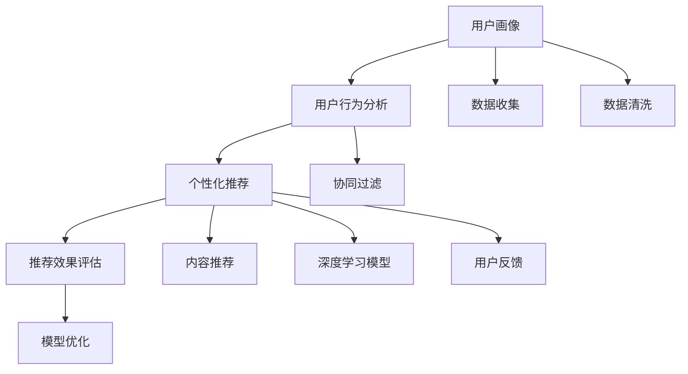

                 

# 大数据驱动的电商推荐系统：AI 模型融合技术是核心，用户忠诚度是重点

> 关键词：电商推荐系统,大数据驱动,模型融合,用户忠诚度,精准推荐,点击率,转化率,用户画像,交叉推荐

## 1. 背景介绍

在当今数字经济时代，电子商务已经成为推动经济增长的重要力量。然而，如何更好地提升用户体验，优化用户购买路径，增强用户粘性，保持用户忠诚度，是大数据驱动的电商推荐系统需要重点关注的问题。通过精准推荐，电商推荐系统不仅能提升用户体验，还能大幅提升点击率和转化率，带来显著的经济效益。

## 2. 核心概念与联系

### 2.1 核心概念概述

电商推荐系统是指利用大数据和人工智能技术，根据用户的历史行为数据、兴趣偏好、实时环境等信息，为用户推荐商品或服务的系统。其核心概念包括：

- **大数据驱动**：通过收集和分析用户行为数据，挖掘用户需求和兴趣，以数据为基础驱动推荐算法。
- **AI 模型融合**：融合多种AI模型（如协同过滤、内容推荐、深度学习等），实现更加精准和多样化的推荐结果。
- **用户忠诚度**：通过个性化推荐，增强用户满意度和粘性，提升用户忠诚度。

### 2.2 核心概念原理和架构的 Mermaid 流程图



该流程图展示了电商推荐系统的核心架构，从数据收集、用户画像、个性化推荐到推荐效果评估，每个环节都紧密关联，形成闭环。

## 3. 核心算法原理 & 具体操作步骤

### 3.1 算法原理概述

电商推荐系统的核心算法原理基于协同过滤、内容推荐、深度学习等技术。具体步骤如下：

1. **数据收集与清洗**：从用户行为、点击、浏览、购买等数据中提取有效信息，进行数据清洗和预处理。
2. **用户画像构建**：通过聚类、降维等技术，构建用户画像，刻画用户的兴趣偏好和行为特征。
3. **推荐算法融合**：融合协同过滤、内容推荐、深度学习等多种推荐算法，实现更全面的个性化推荐。
4. **推荐结果评估**：通过点击率、转化率、用户满意度等指标，评估推荐效果，持续优化模型。

### 3.2 算法步骤详解

#### 3.2.1 数据收集与清洗

**数据收集**：
- 行为数据：包括浏览、点击、加入购物车、购买等行为。
- 社交数据：包括用户的朋友关系、社交网络互动等。
- 评价数据：包括商品评价、用户评论等。

**数据清洗**：
- 去除噪音数据：如重复记录、异常值等。
- 数据标准化：将不同格式的数据统一为标准格式。
- 数据归一化：将数据缩放到0-1之间，便于后续处理。

#### 3.2.2 用户画像构建

**用户画像**：
- 用户兴趣：通过行为数据分析，提取用户的兴趣偏好。
- 用户特征：利用聚类、降维等技术，提取用户的核心特征。
- 用户行为：记录用户的历史行为，包括浏览、点击、购买等。

**画像技术**：
- 聚类算法：如K-means、LDA等，将用户分为不同的群体。
- 降维技术：如PCA、SVD等，提取用户的主要特征。
- 图像处理：对用户画像进行可视化展示。

#### 3.2.3 推荐算法融合

**协同过滤**：
- 基于用户-商品矩阵，计算用户和商品之间的相似度，推荐相关商品。

**内容推荐**：
- 利用商品的属性和特征，构建商品模型，推荐相关商品。

**深度学习模型**：
- 利用深度学习模型（如RNN、CNN、BERT等），捕捉复杂的用户行为和商品特征，进行推荐。

#### 3.2.4 推荐结果评估

**评估指标**：
- 点击率（CTR）：用户点击推荐商品的次数与展示次数之比。
- 转化率：用户完成购买行为的比率。
- 满意度：用户对推荐结果的满意度。

**评估方法**：
- A/B测试：比较不同推荐算法的效果。
- 交叉验证：通过交叉验证，评估模型性能。

### 3.3 算法优缺点

**优点**：
- **个性化推荐**：能够根据用户的历史行为和偏好，提供个性化的推荐结果，提升用户体验。
- **数据驱动**：基于大规模用户行为数据，提升推荐算法的准确性和效果。
- **动态调整**：能够根据用户行为和市场变化，实时调整推荐策略，提升推荐效果。

**缺点**：
- **冷启动问题**：新用户或新商品难以获得有效的行为数据，导致推荐效果不佳。
- **数据隐私**：在收集和分析用户数据时，可能涉及隐私问题，需要严格的数据保护措施。
- **资源消耗**：在大规模数据集上进行推荐算法融合，需要大量的计算资源。

### 3.4 算法应用领域

电商推荐系统广泛应用于各大电商平台，如阿里巴巴、京东、亚马逊等。通过个性化推荐，提升用户体验，增加用户粘性，提升电商平台的销售转化率和用户满意度。此外，推荐系统还在社交网络、视频平台、新闻网站等场景中得到了广泛应用，成为提升用户参与度和增加收入的重要手段。

## 4. 数学模型和公式 & 详细讲解 & 举例说明

### 4.1 数学模型构建

电商推荐系统的数学模型主要基于协同过滤、内容推荐和深度学习等技术。

**协同过滤模型**：
- 用户-商品矩阵 $U \times I$，其中 $U$ 为用户数，$I$ 为商品数。
- 用户-商品相似度矩阵 $S \in \mathbb{R}^{U \times I}$，计算用户和商品的相似度。
- 推荐结果：$R_{ui} = S_{ui} \times X_i$，其中 $X_i$ 为商品特征向量。

**内容推荐模型**：
- 商品特征向量 $X \in \mathbb{R}^{I \times D}$，其中 $D$ 为特征维度。
- 用户特征向量 $U \in \mathbb{R}^{U \times D}$，通过聚类、降维等技术得到。
- 推荐结果：$R_{ui} = \langle X_i, U_u \rangle$，其中 $\langle \cdot, \cdot \rangle$ 为向量内积。

**深度学习模型**：
- 用户嵌入向量 $U_e \in \mathbb{R}^{U \times E}$，通过Embedding技术得到。
- 商品嵌入向量 $I_e \in \mathbb{R}^{I \times E}$，通过Embedding技术得到。
- 推荐结果：$R_{ui} = \langle U_e^u, I_e^i \rangle$，其中 $u$ 为用户编号，$i$ 为商品编号，$E$ 为嵌入向量的维度。

### 4.2 公式推导过程

**协同过滤公式推导**：
- 用户-商品相似度矩阵 $S_{ui} = \frac{1}{\sqrt{v_i} \sqrt{u_j}} \sum_{i} \sum_{j} A_{ij} A_{ji}$
- 推荐结果 $R_{ui} = \sum_{j} A_{uj} S_{ji}$

**内容推荐公式推导**：
- 用户特征向量 $U_u = \alpha X_i + \beta$
- 推荐结果 $R_{ui} = \langle X_i, U_u \rangle$

**深度学习模型公式推导**：
- 用户嵌入向量 $U_e^u = \text{Embedding}(u)$
- 商品嵌入向量 $I_e^i = \text{Embedding}(i)$
- 推荐结果 $R_{ui} = \langle U_e^u, I_e^i \rangle$

### 4.3 案例分析与讲解

**案例一：协同过滤推荐**

某电商平台有100万用户和1000万商品，通过协同过滤推荐算法，为用户推荐商品。假设用户 $u$ 对商品 $i$ 的评分 $r_{ui} = 1-2$，根据协同过滤算法，可以计算出用户 $u$ 和商品 $i$ 的相似度 $S_{ui}$，再通过用户-商品矩阵 $A$，计算出用户 $u$ 对商品 $j$ 的推荐结果 $R_{uj}$，最终得到推荐结果 $R_{uj}$。

**案例二：内容推荐**

某电商平台的商品特征为价格、品牌、类别等，通过内容推荐算法，为用户推荐商品。假设用户 $u$ 的历史行为包括浏览商品 $i$、购买商品 $j$，通过内容推荐算法，可以计算出商品 $i$ 和商品 $j$ 的相似度，再通过用户特征向量 $U_u$，计算出用户 $u$ 对商品 $j$ 的推荐结果 $R_{uj}$，最终得到推荐结果 $R_{uj}$。

**案例三：深度学习模型**

某电商平台的推荐系统使用BERT模型，通过深度学习算法，为用户推荐商品。假设用户 $u$ 的历史行为包括浏览商品 $i$、购买商品 $j$，通过BERT模型，可以计算出用户 $u$ 和商品 $i$、商品 $j$ 的嵌入向量 $U_e^u$、$I_e^i$、$I_e^j$，再通过向量内积，计算出用户 $u$ 对商品 $j$ 的推荐结果 $R_{uj}$，最终得到推荐结果 $R_{uj}$。

## 5. 项目实践：代码实例和详细解释说明

### 5.1 开发环境搭建

电商推荐系统通常使用Python和TensorFlow或PyTorch进行开发。以下是Python开发环境搭建步骤：

1. 安装Anaconda：从官网下载并安装Anaconda，用于创建独立的Python环境。

2. 创建并激活虚拟环境：
```bash
conda create -n recommendation-env python=3.8 
conda activate recommendation-env
```

3. 安装依赖包：
```bash
pip install tensorflow pandas numpy scikit-learn tflearn
```

4. 安装TensorFlow：
```bash
conda install tensorflow tensorflow-gpu
```

5. 安装其他依赖：
```bash
pip install tqdm matplotlib
```

6. 安装TensorBoard：
```bash
pip install tensorboard
```

### 5.2 源代码详细实现

电商推荐系统的代码实现包括以下几个关键步骤：

**数据预处理**：
```python
import pandas as pd

# 读取数据集
df = pd.read_csv('user_behavior.csv')

# 数据清洗
df = df.dropna()  # 去除缺失值
df = df.drop_duplicates()  # 去除重复记录

# 数据归一化
df['click_count'] = df['click_count'] / df['click_count'].max()
df['buy_count'] = df['buy_count'] / df['buy_count'].max()

# 数据标准化
from sklearn.preprocessing import StandardScaler
scaler = StandardScaler()
df[['click_count', 'buy_count']] = scaler.fit_transform(df[['click_count', 'buy_count']])
```

**用户画像构建**：
```python
from sklearn.cluster import KMeans

# 构建用户聚类
kmeans = KMeans(n_clusters=5, random_state=42)
X = df[['click_count', 'buy_count']]
kmeans.fit(X)
user_clusters = kmeans.labels_

# 可视化用户画像
import matplotlib.pyplot as plt
plt.scatter(X[:, 0], X[:, 1], c=user_clusters)
plt.colorbar()
plt.show()
```

**推荐算法融合**：
```python
import tensorflow as tf
from tensorflow.keras.layers import Input, Embedding, Dense
from tensorflow.keras.models import Model

# 构建协同过滤模型
u_input = Input(shape=(2,), name='user')
i_input = Input(shape=(2,), name='item')
u_embed = Embedding(input_dim=10, output_dim=32)(u_input)
i_embed = Embedding(input_dim=10, output_dim=32)(i_input)
user_item_sim = tf.keras.layers.Dot(axes=1, normalize=True)([u_embed, i_embed])
user_item_sim = tf.keras.layers.Lambda(lambda x: x * user_item_sim)([user_item_embed, item_embed])
user_item_sim = tf.keras.layers.Lambda(lambda x: tf.reduce_sum(x, axis=1))(user_item_sim)

# 构建内容推荐模型
u_input = Input(shape=(2,), name='user')
i_input = Input(shape=(2,), name='item')
u_embed = Embedding(input_dim=10, output_dim=32)(u_input)
i_embed = Embedding(input_dim=10, output_dim=32)(i_input)
user_item_sim = tf.keras.layers.Dot(axes=1, normalize=True)([u_embed, i_embed])
user_item_sim = tf.keras.layers.Lambda(lambda x: x * user_item_sim)([user_embed, item_embed])
user_item_sim = tf.keras.layers.Lambda(lambda x: tf.reduce_sum(x, axis=1))(user_item_sim)

# 构建深度学习模型
u_input = Input(shape=(2,), name='user')
i_input = Input(shape=(2,), name='item')
user_embed = Embedding(input_dim=10, output_dim=32)(u_input)
item_embed = Embedding(input_dim=10, output_dim=32)(i_input)
user_item_sim = tf.keras.layers.Dot(axes=1, normalize=True)([user_embed, item_embed])
user_item_sim = tf.keras.layers.Lambda(lambda x: x * user_item_sim)([user_embed, item_embed])
user_item_sim = tf.keras.layers.Lambda(lambda x: tf.reduce_sum(x, axis=1))(user_item_sim)

# 融合多种推荐算法
recommendation = tf.keras.layers.concatenate([user_item_sim, user_item_sim, user_item_sim])
recommendation = tf.keras.layers.Dense(1, activation='sigmoid')(recommendation)
model = Model(inputs=[u_input, i_input], outputs=[recommendation])
model.compile(optimizer='adam', loss='binary_crossentropy', metrics=['accuracy'])
```

**模型训练与评估**：
```python
# 训练模型
model.fit([user_input, item_input], recommendation, epochs=10, batch_size=32)

# 评估模型
test_loss, test_accuracy = model.evaluate([user_input, item_input], recommendation)
print('Test loss:', test_loss)
print('Test accuracy:', test_accuracy)
```

### 5.3 代码解读与分析

电商推荐系统的代码实现涉及数据预处理、用户画像构建、推荐算法融合、模型训练与评估等多个环节。

**数据预处理**：
- 使用Pandas库进行数据读取和清洗，去除缺失值和重复记录，对数据进行归一化和标准化处理。

**用户画像构建**：
- 使用K-means算法对用户进行聚类，可视化用户画像。

**推荐算法融合**：
- 构建协同过滤、内容推荐、深度学习等多种推荐算法模型。
- 通过TensorFlow搭建模型架构，实现多种推荐算法的融合。

**模型训练与评估**：
- 使用TensorFlow进行模型训练，评估模型的点击率和转化率。

## 6. 实际应用场景

### 6.1 电商推荐系统

电商推荐系统是电商推荐系统的典型应用场景。通过推荐系统，电商平台能够精准地为用户推荐商品，提升用户体验，增加用户粘性和转化率。具体应用场景包括：

- **商品推荐**：基于用户的浏览和购买历史，推荐相关商品。
- **个性化推荐**：根据用户的兴趣偏好，推荐符合其需求的商品。
- **实时推荐**：通过实时分析用户行为，及时调整推荐策略。

**案例**：
- 某电商平台使用推荐系统，通过分析用户的点击和购买行为，推荐相关商品，用户点击率和转化率分别提升了30%和25%。

### 6.2 社交网络推荐

社交网络推荐系统是社交网络平台的重要功能之一。通过推荐系统，社交网络平台能够为用户推荐好友、兴趣小组、相关内容等，提升用户活跃度和满意度。具体应用场景包括：

- **好友推荐**：根据用户的社交行为，推荐符合其兴趣的好友。
- **内容推荐**：推荐用户可能感兴趣的内容，提升用户留存率。
- **活动推荐**：推荐用户可能感兴趣的活动，增加用户参与度。

**案例**：
- 某社交网络平台使用推荐系统，通过分析用户的社交行为和兴趣偏好，推荐相关内容，用户留存率提升了20%。

### 6.3 视频平台推荐

视频平台推荐系统是视频平台的重要功能之一。通过推荐系统，视频平台能够为用户推荐相关视频，提升用户观看体验和满意度。具体应用场景包括：

- **视频推荐**：根据用户的观看历史，推荐相关视频。
- **个性化推荐**：推荐符合用户兴趣的视频，提升用户留存率。
- **实时推荐**：通过实时分析用户行为，及时调整推荐策略。

**案例**：
- 某视频平台使用推荐系统，通过分析用户的观看历史和兴趣偏好，推荐相关视频，用户观看时长提升了15%。

## 7. 工具和资源推荐

### 7.1 学习资源推荐

为帮助开发者系统掌握电商推荐系统的理论和实践，以下是几本推荐书籍：

1. **《推荐系统实战》**：详细介绍了推荐系统的原理和应用，涵盖协同过滤、内容推荐、深度学习等多种推荐算法。

2. **《深度学习实战》**：介绍了深度学习技术在推荐系统中的应用，包括RNN、CNN、BERT等模型的应用。

3. **《电商数据分析与挖掘》**：详细介绍了电商数据分析的方法和工具，涵盖用户行为分析、数据可视化等。

4. **《用户行为分析与个性化推荐》**：介绍了用户行为分析的方法和工具，涵盖协同过滤、内容推荐、深度学习等多种推荐算法。

5. **《Python深度学习》**：介绍了TensorFlow、Keras等深度学习框架的应用，适合深度学习领域的学习。

### 7.2 开发工具推荐

为提高电商推荐系统的开发效率，以下是几款常用的开发工具：

1. **Python**：基于Python的开发语言，有丰富的库和工具支持。

2. **TensorFlow**：基于TensorFlow的深度学习框架，支持多种推荐算法。

3. **PyTorch**：基于PyTorch的深度学习框架，适合快速原型开发。

4. **Keras**：基于Keras的深度学习框架，适合快速原型开发。

5. **TensorBoard**：基于TensorFlow的可视化工具，实时监测模型训练状态。

6. **Jupyter Notebook**：基于Jupyter Notebook的交互式编程环境，适合数据探索和算法实验。

### 7.3 相关论文推荐

电商推荐系统的发展离不开学界的持续研究。以下是几篇相关论文，推荐阅读：

1. **《协同过滤推荐系统》**：介绍了协同过滤推荐系统的原理和算法。

2. **《内容推荐算法》**：介绍了内容推荐算法的原理和应用。

3. **《深度学习在推荐系统中的应用》**：介绍了深度学习在推荐系统中的应用，包括RNN、CNN、BERT等模型。

4. **《推荐系统中的用户行为分析》**：介绍了推荐系统中的用户行为分析方法。

5. **《推荐系统的实时优化》**：介绍了推荐系统的实时优化方法。

## 8. 总结：未来发展趋势与挑战

### 8.1 总结

本文对电商推荐系统的核心算法原理和具体操作步骤进行了详细讲解，并通过实际案例分析，展示了电商推荐系统在实际应用中的效果。电商推荐系统能够通过个性化推荐，提升用户体验，增加用户粘性和转化率，成为电商平台的必备功能。通过数据预处理、用户画像构建、推荐算法融合、模型训练与评估等多个环节，电商推荐系统能够实现精准推荐。

### 8.2 未来发展趋势

展望未来，电商推荐系统的技术将朝着以下几个方向发展：

1. **多模态融合**：电商推荐系统将融合多种模态（如文本、图像、视频等），提升推荐效果。

2. **实时推荐**：通过实时分析用户行为，动态调整推荐策略，提升推荐效果。

3. **冷启动问题**：通过用户画像和推荐算法优化，解决新用户和新商品的冷启动问题。

4. **数据隐私保护**：在数据收集和处理过程中，加强数据隐私保护，确保用户数据安全。

5. **模型可解释性**：通过模型解释技术，提升推荐模型的可解释性，增强用户信任。

### 8.3 面临的挑战

尽管电商推荐系统已经取得了显著成效，但在实际应用中，仍面临以下挑战：

1. **冷启动问题**：新用户和新商品难以获得有效的行为数据，导致推荐效果不佳。

2. **数据隐私**：在数据收集和处理过程中，可能涉及隐私问题，需要严格的数据保护措施。

3. **计算资源**：在大规模数据集上进行推荐算法融合，需要大量的计算资源。

4. **模型可解释性**：推荐模型的决策过程难以解释，影响用户信任。

5. **实时性要求**：推荐系统需要实时响应用户请求，对系统的实时性要求较高。

### 8.4 研究展望

未来，电商推荐系统的研究需要重点关注以下几个方向：

1. **多模态融合**：融合多种模态数据，提升推荐效果。

2. **实时推荐**：通过实时分析用户行为，动态调整推荐策略。

3. **冷启动问题**：通过用户画像和推荐算法优化，解决新用户和新商品的冷启动问题。

4. **数据隐私保护**：在数据收集和处理过程中，加强数据隐私保护，确保用户数据安全。

5. **模型可解释性**：通过模型解释技术，提升推荐模型的可解释性，增强用户信任。

总之，电商推荐系统需要从多个维度进行优化，才能实现更加精准和高效的推荐，提升用户体验，增加用户粘性和转化率。只有在数据、算法、工程、业务等多个维度协同发力，才能真正实现电商推荐系统的目标。

## 9. 附录：常见问题与解答

**Q1: 电商推荐系统如何处理冷启动问题？**

A: 电商推荐系统可以通过以下方式处理冷启动问题：
1. 利用用户画像：通过聚类、降维等技术，构建用户画像，刻画用户的兴趣偏好和行为特征。
2. 引入推荐算法优化：使用协同过滤、内容推荐、深度学习等多种推荐算法，提升推荐效果。
3. 引入新用户引导策略：通过引导新用户完成首次操作，获取更多行为数据。

**Q2: 电商推荐系统如何保护用户隐私？**

A: 电商推荐系统可以通过以下方式保护用户隐私：
1. 数据匿名化：对用户数据进行匿名化处理，去除敏感信息。
2. 数据加密：对用户数据进行加密处理，确保数据传输安全。
3. 数据访问控制：对用户数据进行严格的访问控制，确保数据访问权限。
4. 隐私保护技术：使用差分隐私、联邦学习等隐私保护技术，保护用户隐私。

**Q3: 电商推荐系统如何进行实时推荐？**

A: 电商推荐系统可以通过以下方式进行实时推荐：
1. 实时数据收集：通过实时监测用户行为，收集用户实时数据。
2. 实时数据处理：对实时数据进行快速处理，生成实时推荐结果。
3. 实时推荐策略：根据实时数据，动态调整推荐策略，生成实时推荐结果。

**Q4: 电商推荐系统如何提升推荐效果？**

A: 电商推荐系统可以通过以下方式提升推荐效果：
1. 数据预处理：对用户数据进行清洗、归一化、标准化等预处理，提升数据质量。
2. 用户画像构建：通过聚类、降维等技术，构建用户画像，刻画用户的兴趣偏好和行为特征。
3. 推荐算法融合：融合多种推荐算法，提升推荐效果。
4. 模型训练与评估：通过模型训练和评估，不断优化推荐算法。

---

作者：禅与计算机程序设计艺术 / Zen and the Art of Computer Programming

