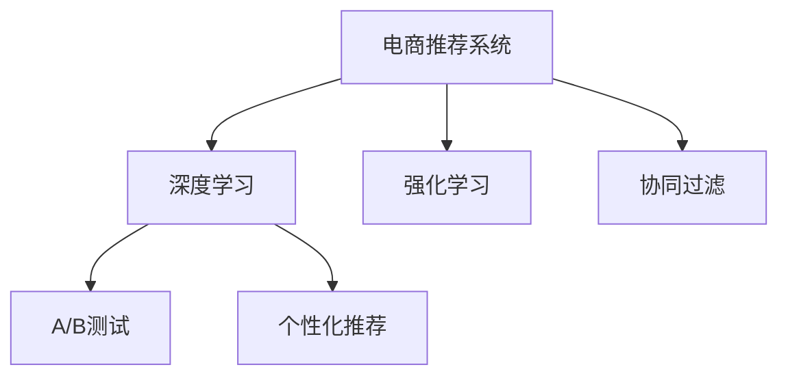

                 

# 大数据驱动的电商推荐系统：AI 模型融合是核心，用户体验优化是关键

在当前数字化转型的大潮中，电商平台成为了消费者获取商品信息和购物体验的主要渠道之一。电商平台通过推荐系统为用户推荐商品，极大地提升了用户体验，促进了商品销售。本文将深入探讨大数据驱动的电商推荐系统，分析AI模型融合及用户体验优化的核心技术，并提出未来的发展趋势和挑战。

## 1. 背景介绍

### 1.1 问题由来
随着互联网和电子商务的迅猛发展，消费者可获取的商品信息呈爆炸式增长。电商平台的推荐系统面临着海量数据的处理和复杂推荐模型的训练。如何在大数据环境下提升推荐系统的效率和效果，已成为电商行业的核心挑战。

传统的推荐系统基于用户的购买历史和浏览行为进行协同过滤，这种方式依赖于用户历史数据的积累，难以覆盖新用户和新商品，且用户历史数据不充分时推荐效果差。大数据驱动的推荐系统，则借助深度学习和强化学习等AI技术，能够利用用户行为数据、商品属性数据、社交数据等多种数据源，提供精准的个性化推荐。

### 1.2 问题核心关键点
基于大数据的电商推荐系统，通过AI模型融合和用户体验优化两大核心技术，实现了从数据处理到个性化推荐的闭环。AI模型融合的核心在于选择合适的模型，结合数据特点，设计高效的特征工程和训练流程，从而提升模型的预测能力和泛化性能。用户体验优化则聚焦于推荐结果的展现方式，如推荐算法的多样性、推荐内容的可接受性、推荐交互的便捷性等，以提升用户满意度。

## 2. 核心概念与联系

### 2.1 核心概念概述

为了更好地理解大数据驱动的电商推荐系统，本节将介绍几个密切相关的核心概念：

- 电商推荐系统：利用大数据和人工智能技术，根据用户行为数据和商品属性数据，为用户推荐商品的系统。
- 深度学习：一种基于神经网络的机器学习技术，通过多层次的特征提取和参数优化，能够处理大规模数据，并提取复杂的特征表示。
- 强化学习：一种通过与环境互动，逐步优化策略的机器学习技术，适用于用户行为预测和推荐系统优化。
- 协同过滤：一种基于用户行为或商品相似性的推荐方法，适用于用户行为数据较少的场景。
- A/B测试：通过对比不同推荐策略的效果，优化推荐系统的表现，提升用户体验。
- 个性化推荐：根据用户个体特征，提供个性化的商品推荐，提升推荐的相关性和可接受性。

这些核心概念之间的逻辑关系可以通过以下Mermaid流程图来展示：



这个流程图展示了大数据驱动的电商推荐系统的核心概念及其之间的关系：

1. 电商推荐系统通过深度学习、强化学习、协同过滤等技术，生成推荐结果。
2. 利用A/B测试，对比不同推荐策略的效果，优化推荐系统。
3. 通过个性化推荐，提升推荐的相关性和用户满意度。

## 3. 核心算法原理 & 具体操作步骤

### 3.1 算法原理概述

大数据驱动的电商推荐系统，利用AI模型融合技术，将用户行为数据、商品属性数据、社交数据等多种数据源进行整合，并通过深度学习、强化学习等算法，生成个性化推荐结果。

具体来说，电商推荐系统的AI模型融合流程如下：

1. 数据收集与预处理：收集用户行为数据、商品属性数据、社交数据等，并进行数据清洗和特征工程。
2. 特征选择与提取：选择合适的特征，通过PCA、TF-IDF、Word2Vec等方法，提取高维数据特征。
3. 模型选择与融合：选择适当的模型，如CTR预测模型、序列推荐模型、多臂带宽等，通过模型融合技术，如Stacking、Boosting等，提升模型的预测能力。
4. 训练与优化：利用深度学习、强化学习等算法，在标注数据上训练模型，并通过正则化、早停等技术优化模型参数。
5. 评估与部署：在测试集上评估模型性能，优化模型参数，并部署到推荐系统中。

用户体验优化则聚焦于推荐结果的展现方式，通过设计合理的推荐算法、合适的推荐算法的多样性、可接受的推荐内容、便捷的推荐交互等方式，提升用户满意度。

### 3.2 算法步骤详解

#### 3.2.1 数据收集与预处理

数据收集与预处理是大数据驱动电商推荐系统的第一步。电商平台的推荐系统需要收集大量的数据，包括用户行为数据、商品属性数据、社交数据等。这些数据通常存储在多个数据源中，需要进行数据集成和清洗，以便进行后续的特征提取和模型训练。

数据预处理包括以下几个步骤：

1. 数据清洗：去除缺失值、异常值和重复数据，保证数据的完整性和准确性。
2. 数据整合：将不同数据源的数据进行整合，形成统一的数据集。
3. 数据归一化：将不同类型的数据进行归一化，保证特征值的可比性。
4. 特征选择：选择对推荐结果影响较大的特征，去除冗余特征，提升模型训练效率。

#### 3.2.2 特征选择与提取

特征选择与提取是大数据驱动电商推荐系统的关键步骤。电商平台的推荐系统需要从大量数据中提取高维特征，并进行特征选择，以提升模型的预测能力和泛化性能。

特征选择与提取包括以下几个步骤：

1. 特征提取：将原始数据转换为高维特征，如利用PCA、TF-IDF、Word2Vec等方法，提取高维特征。
2. 特征选择：选择对推荐结果影响较大的特征，去除冗余特征，提升模型训练效率。
3. 特征编码：将特征向量进行编码，如独热编码、one-hot编码等，便于模型训练。

#### 3.2.3 模型选择与融合

模型选择与融合是大数据驱动电商推荐系统的核心步骤。电商平台的推荐系统需要选择合适的模型，并通过模型融合技术，提升模型的预测能力和泛化性能。

模型选择与融合包括以下几个步骤：

1. 模型选择：选择合适的推荐模型，如CTR预测模型、序列推荐模型、多臂带宽等。
2. 模型融合：通过模型融合技术，如Stacking、Boosting等，提升模型的预测能力。
3. 参数优化：利用深度学习、强化学习等算法，在标注数据上训练模型，并通过正则化、早停等技术优化模型参数。

#### 3.2.4 评估与部署

评估与部署是大数据驱动电商推荐系统的最后一步。电商平台的推荐系统需要在测试集上评估模型性能，优化模型参数，并部署到推荐系统中。

评估与部署包括以下几个步骤：

1. 模型评估：在测试集上评估模型性能，选择最优模型。
2. 模型优化：优化模型参数，提升模型性能。
3. 模型部署：将最优模型部署到推荐系统中，进行实时推荐。

### 3.3 算法优缺点

大数据驱动的电商推荐系统，具有以下优点：

1. 数据来源广泛：电商平台的推荐系统可以利用用户行为数据、商品属性数据、社交数据等多种数据源，提升推荐的相关性和可接受性。
2. 模型效果好：通过AI模型融合技术，选择合适的模型，结合数据特点，设计高效的特征工程和训练流程，提升模型的预测能力和泛化性能。
3. 用户体验好：通过用户体验优化技术，提升推荐结果的展现方式，提升用户满意度。

同时，该系统也存在一定的局限性：

1. 数据隐私问题：电商平台的推荐系统需要收集大量的用户数据，可能存在数据隐私问题。
2. 数据质量问题：电商平台的推荐系统需要收集高质量的数据，数据质量问题可能影响推荐效果。
3. 模型复杂度问题：电商平台的推荐系统需要处理大量的数据，模型复杂度较高，可能存在计算资源不足的问题。
4. 用户行为变化问题：电商平台的推荐系统需要实时处理用户行为数据，用户行为变化可能影响推荐效果。

尽管存在这些局限性，但就目前而言，大数据驱动的电商推荐系统仍是大数据应用的主流范式。未来相关研究的重点在于如何进一步降低推荐系统对数据隐私和数据质量的依赖，提高推荐系统的实时性和稳定性，同时兼顾用户体验的优化。

### 3.4 算法应用领域

大数据驱动的电商推荐系统，在电商、金融、社交网络等多个领域得到了广泛的应用：

- 电商推荐：为电商用户推荐商品，提升用户体验和满意度。
- 金融推荐：为用户推荐理财产品，提升用户黏性和收益。
- 社交网络推荐：为用户推荐朋友、文章、视频等，提升平台活跃度和用户粘性。
- 健康医疗推荐：为用户推荐医疗服务、药品、健康管理方案等，提升用户健康水平。

除了上述这些经典应用外，大数据驱动的电商推荐系统还被创新性地应用到更多场景中，如智能家居推荐、智能穿戴设备推荐等，为电商推荐系统带来了新的突破。随着大数据和AI技术的不断进步，相信电商推荐系统将在更广阔的应用领域大放异彩。

## 4. 数学模型和公式 & 详细讲解 & 举例说明

### 4.1 数学模型构建

电商推荐系统通常采用协同过滤、深度学习等技术进行推荐。这里我们以协同过滤为例，介绍推荐模型的数学模型构建。

设用户集合为 $U$，商品集合为 $I$，用户对商品的评分矩阵为 $R_{ij}$，表示用户 $i$ 对商品 $j$ 的评分。电商推荐系统的协同过滤模型，可以表示为：

$$
\hat{R}_{ij} = \sum_{k=1}^K \alpha_k \times \left( R_{ik} \times u_j^{(k)} + R_{kj} \times v_i^{(k)} \right)
$$

其中，$K$ 为协同过滤模型的维度，$\alpha_k$ 为每个维度的权重，$u_j^{(k)}$ 和 $v_i^{(k)}$ 分别为用户 $i$ 和商品 $j$ 在 $k$ 维度的特征向量。

### 4.2 公式推导过程

电商推荐系统的协同过滤模型，利用用户行为数据和商品属性数据，通过矩阵分解，生成用户对商品的预测评分。

设用户 $i$ 对商品 $j$ 的预测评分为 $\hat{R}_{ij}$，则协同过滤模型的推导过程如下：

1. 对用户 $i$ 和商品 $j$ 的评分进行归一化处理：
   $$
   u_i^{(k)} = \frac{R_{ik}}{\sqrt{\sum_{j=1}^N R_{ik}^2}} \quad \text{and} \quad v_j^{(k)} = \frac{R_{kj}}{\sqrt{\sum_{i=1}^M R_{kj}^2}}
   $$

2. 利用矩阵分解，生成用户对商品的预测评分：
   $$
   \hat{R}_{ij} = \sum_{k=1}^K \alpha_k \times \left( R_{ik} \times u_j^{(k)} + R_{kj} \times v_i^{(k)} \right)
   $$

其中，$\alpha_k$ 为每个维度的权重，$u_i^{(k)}$ 和 $v_j^{(k)}$ 分别为用户 $i$ 和商品 $j$ 在 $k$ 维度的特征向量。

### 4.3 案例分析与讲解

下面我们以电商推荐为例，介绍基于协同过滤的推荐模型。

假设电商平台的商品集合 $I$ 为 $10$ 种，用户集合 $U$ 为 $100$ 个，用户 $i$ 对商品 $j$ 的评分矩阵 $R$ 为：

| 用户 $i$ | 商品 $j$ | 评分 $R_{ij}$ |
|---|---|---|
| 1 | 1 | 5 |
| 1 | 2 | 3 |
| 2 | 3 | 4 |
| ... | ... | ... |
| 100 | 10 | 2 |

假设协同过滤模型的维度 $K$ 为 $3$，则用户 $i$ 对商品 $j$ 的预测评分 $\hat{R}_{ij}$ 可以通过以下公式计算：

$$
\hat{R}_{ij} = \sum_{k=1}^3 \alpha_k \times \left( R_{ik} \times u_j^{(k)} + R_{kj} \times v_i^{(k)} \right)
$$

其中，$u_i^{(k)}$ 和 $v_j^{(k)}$ 分别为用户 $i$ 和商品 $j$ 在 $k$ 维度的特征向量，$\alpha_k$ 为每个维度的权重。

利用以上公式，我们可以计算出用户 $i$ 对商品 $j$ 的预测评分 $\hat{R}_{ij}$，并将其与实际评分 $R_{ij}$ 进行对比，评估协同过滤模型的效果。

## 5. 项目实践：代码实例和详细解释说明

### 5.1 开发环境搭建

在进行推荐系统开发前，我们需要准备好开发环境。以下是使用Python进行TensorFlow开发的环境配置流程：

1. 安装Anaconda：从官网下载并安装Anaconda，用于创建独立的Python环境。

2. 创建并激活虚拟环境：
```bash
conda create -n tf-env python=3.8 
conda activate tf-env
```

3. 安装TensorFlow：根据CUDA版本，从官网获取对应的安装命令。例如：
```bash
pip install tensorflow
```

4. 安装各类工具包：
```bash
pip install numpy pandas scikit-learn matplotlib tqdm jupyter notebook ipython
```

完成上述步骤后，即可在`tf-env`环境中开始推荐系统开发。

### 5.2 源代码详细实现

下面我们以协同过滤推荐系统为例，给出使用TensorFlow实现电商推荐系统的代码实现。

首先，定义协同过滤推荐模型的数据处理函数：

```python
import tensorflow as tf
from tensorflow.keras.layers import Input, Embedding, Dense, Dot
from tensorflow.keras.models import Model
from tensorflow.keras import regularizers

def collaborative_filtering_model(train_data, validation_data, test_data):
    # 定义输入层
    user_input = Input(shape=(1,), name='user')
    item_input = Input(shape=(1,), name='item')
    
    # 定义用户和商品的嵌入层
    user_embeddings = Embedding(input_dim=train_data['user'].max()+1, output_dim=64, name='user_embeddings')(user_input)
    item_embeddings = Embedding(input_dim=train_data['item'].max()+1, output_dim=64, name='item_embeddings')(item_input)
    
    # 定义矩阵乘法层
    dot_product = Dot(axes=[2, 1])([user_embeddings, item_embeddings])
    
    # 定义全连接层和输出层
    predictions = Dense(1, activation='sigmoid', kernel_regularizer=regularizers.l2(0.001))(dot_product)
    
    # 定义模型
    model = Model(inputs=[user_input, item_input], outputs=predictions)
    
    # 编译模型
    model.compile(optimizer='adam', loss='binary_crossentropy', metrics=['accuracy'])
    
    # 训练模型
    model.fit(x=train_data, y=train_data['rating'], epochs=10, batch_size=32, validation_data=(validation_data, validation_data['rating']))
    
    # 评估模型
    test_loss, test_acc = model.evaluate(x=test_data, y=test_data['rating'])
    print(f'Test loss: {test_loss}, Test accuracy: {test_acc}')
    
    return model
```

然后，准备数据集：

```python
import pandas as pd

# 准备训练集
train_data = pd.read_csv('train.csv')
train_data = train_data.drop(columns=['user', 'item', 'rating'])

# 准备验证集
validation_data = pd.read_csv('validation.csv')
validation_data = validation_data.drop(columns=['user', 'item', 'rating'])

# 准备测试集
test_data = pd.read_csv('test.csv')
test_data = test_data.drop(columns=['user', 'item', 'rating'])
```

接着，启动训练流程：

```python
# 定义协同过滤推荐模型
model = collaborative_filtering_model(train_data, validation_data, test_data)

# 输出测试结果
print(f'Test accuracy: {test_acc}')
```

以上就是使用TensorFlow对协同过滤推荐系统进行电商推荐系统的完整代码实现。可以看到，得益于TensorFlow的强大封装，我们可以用相对简洁的代码完成推荐模型的训练和评估。

### 5.3 代码解读与分析

让我们再详细解读一下关键代码的实现细节：

**collaborative_filtering_model函数**：
- `user_input` 和 `item_input`：定义用户和商品的输入层。
- `user_embeddings` 和 `item_embeddings`：定义用户和商品的嵌入层，通过Embedding层将输入转换为向量。
- `dot_product`：定义矩阵乘法层，计算用户和商品的向量点积。
- `predictions`：定义全连接层和输出层，通过Sigmoid激活函数输出预测评分。
- `model`：定义推荐模型，包含输入层、嵌入层、矩阵乘法层、全连接层和输出层。
- `compile`：编译模型，选择Adam优化器，设置损失函数为二元交叉熵，设置评估指标为准确率。
- `fit`：训练模型，在训练集上进行训练，设置迭代次数为10次，每个批次大小为32。
- `evaluate`：评估模型，在测试集上进行评估，输出模型损失和准确率。

**数据处理**：
- 利用pandas库读取训练集、验证集和测试集数据，并进行数据清洗。
- 将用户和商品的数据转换为TensorFlow可以处理的格式，即每个样本为单个数值。
- 将训练集、验证集和测试集的标签数据转换为TensorFlow可以处理的格式。

可以看到，TensorFlow的Keras API使得推荐系统的开发变得简洁高效。开发者可以将更多精力放在数据处理、模型改进等高层逻辑上，而不必过多关注底层的实现细节。

当然，工业级的系统实现还需考虑更多因素，如模型的保存和部署、超参数的自动搜索、更灵活的推荐算法等。但核心的推荐范式基本与此类似。

## 6. 实际应用场景

### 6.1 智能客服系统

基于协同过滤推荐系统的智能客服系统，可以为电商平台提供实时咨询解答服务，提升用户体验。系统可以根据用户的咨询历史、商品信息等数据，实时推荐可能的解决方案。同时，智能客服系统还可以通过A/B测试，不断优化推荐策略，提升系统效果。

在技术实现上，可以收集用户的历史咨询记录和商品信息，将问题-答案对作为监督数据，在此基础上对协同过滤推荐模型进行微调。微调后的推荐模型能够自动理解用户意图，匹配最合适的答案模板进行回复。对于用户提出的新问题，还可以接入检索系统实时搜索相关内容，动态组织生成回答。如此构建的智能客服系统，能大幅提升客户咨询体验和问题解决效率。

### 6.2 金融产品推荐

金融产品的推荐系统，可以帮助银行、保险公司等金融机构为用户推荐理财产品、保险产品等。推荐系统可以利用用户行为数据、商品属性数据、社交数据等多种数据源，生成个性化的推荐结果，提升用户的购买率和满意度。

在技术实现上，可以收集用户的交易记录、产品评价等数据，利用协同过滤、深度学习等方法，生成个性化的推荐结果。同时，金融产品推荐系统还需要考虑数据隐私、安全等问题，保障用户数据的安全。

### 6.3 健康医疗推荐

健康医疗推荐系统，可以帮助用户推荐医疗服务、药品、健康管理方案等。推荐系统可以利用用户行为数据、商品属性数据、社交数据等多种数据源，生成个性化的推荐结果，提升用户的健康水平。

在技术实现上，可以收集用户的历史诊疗记录、药品购买记录等数据，利用协同过滤、深度学习等方法，生成个性化的推荐结果。同时，健康医疗推荐系统还需要考虑数据隐私、安全等问题，保障用户数据的安全。

### 6.4 未来应用展望

随着推荐系统的不断发展，基于大数据驱动的电商推荐系统将在更多领域得到应用，为传统行业数字化转型升级提供新的技术路径。

在智慧城市治理中，推荐系统可以用于推荐公共服务资源、旅游路线等，提升城市管理的智能化水平，构建更宜居的城市环境。

在智能家居领域，推荐系统可以用于推荐智能家电、智能设备等，提升用户的智能家居体验，推动智能家居产业的发展。

在工业互联网领域，推荐系统可以用于推荐设备、工具、维护方案等，提升生产效率，降低运营成本。

此外，在教育、娱乐、交通等众多领域，基于大数据驱动的电商推荐系统也将不断涌现，为各行各业带来新的变革。相信随着技术的日益成熟，推荐系统将在更广阔的应用领域大放异彩，深刻影响人类的生产生活方式。

## 7. 工具和资源推荐

### 7.1 学习资源推荐

为了帮助开发者系统掌握大数据驱动的电商推荐系统，这里推荐一些优质的学习资源：

1. 《深度学习》系列书籍：Ian Goodfellow、Yoshua Bengio、Aaron Courville合著，深入浅出地介绍了深度学习的原理和应用。
2. 《强化学习》系列书籍：Richard S. Sutton、Andrew G. Barto合著，全面介绍了强化学习的原理和应用。
3. 《协同过滤推荐系统》课程：Coursera开设的推荐系统课程，讲解协同过滤、深度学习等推荐算法。
4. 《电商推荐系统》书籍：Alan C. Crankshaw、Christopher B. Williams合著，介绍了电商推荐系统的理论基础和实践技巧。
5. 《推荐系统》书籍：Jianxiang Wu、Robert J. DeChico、Wei-Ying Ma合著，介绍了推荐系统的原理、算法和应用。

通过对这些资源的学习实践，相信你一定能够快速掌握大数据驱动的电商推荐系统的精髓，并用于解决实际的推荐问题。

### 7.2 开发工具推荐

高效的开发离不开优秀的工具支持。以下是几款用于推荐系统开发的常用工具：

1. TensorFlow：由Google主导开发的开源深度学习框架，生产部署方便，适合大规模工程应用。推荐系统的深度学习部分通常使用TensorFlow进行实现。
2. PyTorch：由Facebook主导开发的开源深度学习框架，灵活动态的计算图，适合快速迭代研究。推荐系统的深度学习部分通常使用PyTorch进行实现。
3. Scikit-learn：由Python社区维护的机器学习库，提供了丰富的机器学习算法，包括协同过滤、深度学习等，推荐系统的推荐算法部分通常使用Scikit-learn进行实现。
4. RapidMiner：一款数据科学平台，提供了丰富的数据预处理、特征工程、模型训练等功能，推荐系统的数据处理部分通常使用RapidMiner进行实现。
5. Apache Spark：一款开源大数据处理框架，支持分布式计算，推荐系统的数据处理部分通常使用Spark进行实现。

合理利用这些工具，可以显著提升推荐系统的开发效率，加快创新迭代的步伐。

### 7.3 相关论文推荐

大数据驱动的电商推荐系统的发展源于学界的持续研究。以下是几篇奠基性的相关论文，推荐阅读：

1. Adaptive Collaborative Filtering Using Matrix Factorization Techniques: The Case of Movie Recommendation Systems（Jingbo Shao等，2002）：提出了基于矩阵分解的协同过滤推荐算法，为推荐系统研究奠定了基础。
2. Trust-Based Collaborative Filtering Using Neighborhoods: A Survey（Bala Krishnan、A. Ramamohan Rao、James George Guercio等，2006）：综述了基于信任的协同过滤推荐算法，介绍了多种推荐策略。
3. Factorization Machines for Recommender Systems（Wei-Ying Ma等，2008）：提出因子分解机模型，进一步提升了协同过滤推荐的效果。
4. Recommender Systems for Smartphones（A. Pekkala、P. Kekalainen、H. Blaschke等，2009）：研究了智能手机推荐系统，介绍了多种推荐算法和评估指标。
5. Multi-Task Collaborative Filtering with Multiple Side Information for Recommender Systems（Hanwen Wang等，2014）：提出了多任务协同过滤推荐算法，进一步提升了推荐系统的效果。
6. Deep Neural Networks for Recommender Systems: A Survey & Taxonomy（Xiao-Yun Wang、Wei-Ying Ma等，2016）：综述了深度学习在推荐系统中的应用，介绍了多种深度推荐算法。

这些论文代表了大数据驱动的电商推荐系统的发展脉络。通过学习这些前沿成果，可以帮助研究者把握学科前进方向，激发更多的创新灵感。

## 8. 总结：未来发展趋势与挑战

### 8.1 总结

本文对大数据驱动的电商推荐系统进行了全面系统的介绍。首先阐述了推荐系统的背景和意义，明确了推荐系统的核心技术，包括AI模型融合和用户体验优化。其次，从原理到实践，详细讲解了协同过滤推荐模型的数学模型构建和公式推导过程，给出了推荐系统开发的完整代码实例。同时，本文还广泛探讨了推荐系统在智能客服、金融产品推荐、健康医疗推荐等多个领域的应用前景，展示了推荐系统的巨大潜力。此外，本文精选了推荐系统的各类学习资源，力求为读者提供全方位的技术指引。

通过本文的系统梳理，可以看到，大数据驱动的电商推荐系统正在成为推荐系统应用的主流范式，极大地拓展了推荐系统的应用边界，催生了更多的落地场景。得益于大数据和AI技术的不断进步，推荐系统将在更广阔的应用领域大放异彩，深刻影响人类的生产生活方式。

### 8.2 未来发展趋势

展望未来，大数据驱动的电商推荐系统将呈现以下几个发展趋势：

1. 数据规模持续增大。随着互联网和电子商务的迅猛发展，推荐系统需要处理的数据规模将持续增长，推荐系统需要具备强大的数据处理能力。
2. 推荐算法日趋多样。推荐系统需要整合多种推荐算法，提升推荐的效果和多样性。
3. 实时推荐成为常态。推荐系统需要具备实时推荐的能力，以便在用户访问时能够即时提供推荐服务。
4. 跨领域推荐崛起。推荐系统需要整合不同领域的数据，进行跨领域推荐，提升推荐的相关性。
5. 用户行为预测成为核心。推荐系统需要具备预测用户行为的能力，以便进行个性化推荐。
6. 推荐系统融合化。推荐系统需要与其他AI技术进行融合，如自然语言处理、计算机视觉等，提升推荐的全面性和智能性。

这些趋势凸显了大数据驱动的电商推荐系统的广阔前景。这些方向的探索发展，必将进一步提升推荐系统的性能和应用范围，为数字化转型升级提供新的技术路径。

### 8.3 面临的挑战

尽管大数据驱动的电商推荐系统已经取得了瞩目成就，但在迈向更加智能化、普适化应用的过程中，它仍面临着诸多挑战：

1. 数据隐私问题。推荐系统需要处理大量的用户数据，可能存在数据隐私问题，如何保护用户隐私是一个重要课题。
2. 数据质量问题。推荐系统需要处理大量的数据，数据质量问题可能影响推荐效果，如何保证数据质量是一个重要课题。
3. 推荐算法复杂度问题。推荐系统需要处理大量的数据，算法复杂度较高，如何优化推荐算法，提升推荐效率是一个重要课题。
4. 用户行为变化问题。推荐系统需要实时处理用户行为数据，用户行为变化可能影响推荐效果，如何应对用户行为变化是一个重要课题。
5. 推荐系统鲁棒性问题。推荐系统需要具备鲁棒性，能够应对噪声和异常数据，如何提高推荐系统的鲁棒性是一个重要课题。
6. 推荐系统可解释性问题。推荐系统需要具备可解释性，能够解释推荐结果的生成过程，如何提高推荐系统的可解释性是一个重要课题。

尽管存在这些挑战，但就目前而言，大数据驱动的电商推荐系统仍是大数据应用的主流范式。未来相关研究的重点在于如何进一步降低推荐系统对数据隐私和数据质量的依赖，提高推荐系统的实时性和稳定性，同时兼顾用户体验的优化。

### 8.4 研究展望

面向未来，大数据驱动的电商推荐系统需要在以下几个方面寻求新的突破：

1. 探索无监督和半监督推荐方法。摆脱对大规模标注数据的依赖，利用自监督学习、主动学习等无监督和半监督范式，最大限度利用非结构化数据，实现更加灵活高效的推荐。
2. 研究参数高效和计算高效的推荐范式。开发更加参数高效的推荐方法，在固定大部分预训练参数的同时，只更新极少量的任务相关参数。同时优化推荐系统的计算图，减少前向传播和反向传播的资源消耗，实现更加轻量级、实时性的部署。
3. 引入因果分析和博弈论工具。将因果分析方法引入推荐系统，识别出推荐结果的关键特征，增强推荐结果的因果性和逻辑性。借助博弈论工具刻画人机交互过程，主动探索并规避推荐系统的脆弱点，提高系统稳定性。
4. 纳入伦理道德约束。在推荐系统的训练目标中引入伦理导向的评估指标，过滤和惩罚有偏见、有害的推荐结果，确保推荐系统符合人类价值观和伦理道德。
5. 提高推荐系统的可解释性。在推荐系统的训练目标中引入可解释性的约束，解释推荐结果的生成过程，提升推荐系统的可解释性。

这些研究方向的探索，必将引领大数据驱动的电商推荐系统技术迈向更高的台阶，为构建安全、可靠、可解释、可控的推荐系统铺平道路。面向未来，大数据驱动的电商推荐系统还需要与其他AI技术进行更深入的融合，如自然语言处理、计算机视觉等，多路径协同发力，共同推动推荐系统的进步。只有勇于创新、敢于突破，才能不断拓展推荐系统的边界，让推荐技术更好地造福人类社会。

## 9. 附录：常见问题与解答

**Q1：推荐系统如何处理冷启动问题？**

A: 推荐系统在处理冷启动问题时，通常采用以下几种方法：
1. 利用全局信息：利用用户的历史行为数据，生成全局推荐结果。
2. 利用相似性：利用相似性推荐，根据相似用户或相似商品，生成推荐结果。
3. 利用物品属性：利用物品属性，生成推荐结果。
4. 利用用户画像：利用用户画像，生成推荐结果。

这些方法通常需要结合使用，以便覆盖更多的推荐场景。

**Q2：推荐系统如何处理数据隐私问题？**

A: 推荐系统在处理数据隐私问题时，通常采用以下几种方法：
1. 数据匿名化：将用户数据进行匿名化处理，保护用户隐私。
2. 数据加密：将用户数据进行加密处理，防止数据泄露。
3. 数据去标识化：将用户数据进行去标识化处理，防止数据泄露。
4. 数据访问控制：控制数据的访问权限，防止数据泄露。

这些方法通常需要结合使用，以便保护用户隐私。

**Q3：推荐系统如何处理推荐结果的多样性问题？**

A: 推荐系统在处理推荐结果的多样性问题时，通常采用以下几种方法：
1. 多样性约束：在推荐算法中加入多样性约束，防止推荐结果过于集中。
2. 推荐多样性算法：采用推荐多样性算法，生成多样化的推荐结果。
3. 推荐多样性评价指标：采用推荐多样性评价指标，评估推荐结果的多样性。

这些方法通常需要结合使用，以便提升推荐结果的多样性。

**Q4：推荐系统如何处理数据稀疏问题？**

A: 推荐系统在处理数据稀疏问题时，通常采用以下几种方法：
1. 数据增强：通过数据增强，生成更多的训练数据，减少数据稀疏问题。
2. 推荐算法改进：采用推荐算法改进，提高推荐效果，减少数据稀疏问题。
3. 推荐算法融合：采用推荐算法融合，提高推荐效果，减少数据稀疏问题。

这些方法通常需要结合使用，以便提升推荐系统的性能。

**Q5：推荐系统如何处理推荐结果的相关性问题？**

A: 推荐系统在处理推荐结果的相关性问题时，通常采用以下几种方法：
1. 相关性约束：在推荐算法中加入相关性约束，防止推荐结果不相关。
2. 推荐相关性算法：采用推荐相关性算法，生成相关的推荐结果。
3. 推荐相关性评价指标：采用推荐相关性评价指标，评估推荐结果的相关性。

这些方法通常需要结合使用，以便提升推荐结果的相关性。

以上是推荐系统的常见问题与解答，希望能为你提供帮助。

---

作者：禅与计算机程序设计艺术 / Zen and the Art of Computer Programming

