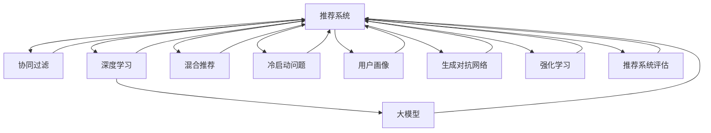

                 

# 大模型: 推荐系统的未来趋势

> 关键词：大模型推荐系统,推荐系统个性化,深度学习,协同过滤,混合推荐,冷启动问题,用户画像,生成对抗网络,强化学习,推荐系统评估

## 1. 背景介绍

### 1.1 问题由来
在电商、新闻、社交网络等众多领域，推荐系统早已成为不可或缺的核心组件。它通过分析用户的历史行为、兴趣偏好，预测并推荐最合适的物品、内容或服务，极大地提升了用户体验和运营效率。然而，传统推荐系统往往依赖用户行为数据的静态特征，难以捕捉隐含的动态变化。随着大数据时代的到来，新型智能推荐系统开始兴起，利用深度学习、协同过滤、混合推荐等多种技术手段，突破了传统推荐方法的瓶颈，为个性化推荐带来了革命性的突破。

### 1.2 问题核心关键点
当前，推荐系统的主流范式是以深度学习为核心的协同过滤推荐算法。其中，基于大模型的推荐方法尤为引人注目，它通过预训练大规模语言模型，学习用户和物品之间语义关联的复杂模式，显著提升了推荐系统的性能和效果。然而，大模型在推荐系统中的应用，也面临着数据冷启动、计算资源消耗、可解释性不足等诸多挑战。因此，未来的推荐系统如何充分利用大模型的优势，同时解决这些关键问题，将是大模型推荐系统研究的重点和方向。

### 1.3 问题研究意义
大模型推荐系统通过在推荐任务上预训练和微调大规模语言模型，具备了从用户行为文本数据中提取隐含特征的能力，为推荐系统带来了新的突破。借助大模型，推荐系统能够捕捉更丰富的用户偏好和物品属性，提升个性化推荐精度。此外，大模型推荐系统还具备更强的跨领域迁移能力，能够适应更多应用场景，加速技术落地。因此，研究大模型推荐系统，对于推动个性化推荐技术的演进，提升用户体验和运营效率，具有重要的理论价值和应用意义。

## 2. 核心概念与联系

### 2.1 核心概念概述

为更好地理解大模型推荐系统，本节将介绍几个关键概念：

- 推荐系统(Recommender System)：通过分析用户的历史行为和兴趣偏好，预测并推荐最合适的物品、内容或服务的系统。
- 协同过滤(Collaborative Filtering)：基于用户行为数据的推荐方法，通过相似度计算进行推荐。
- 深度学习(Deep Learning)：通过多层神经网络对数据进行深度建模，学习复杂特征表示。
- 大模型(Large Model)：如BERT、GPT-3等超大规模预训练模型，通过海量无标签数据训练，具备强大的语言理解和生成能力。
- 混合推荐(Hybrid Recommendation)：结合多种推荐方法，取长补短，提升推荐效果。
- 冷启动问题(Cold Start)：用户或物品没有历史行为数据时，难以进行有效推荐。
- 用户画像(User Profile)：基于用户属性、行为等多维度信息构建的详尽画像，为推荐提供精准依据。
- 生成对抗网络(Generative Adversarial Network, GAN)：通过两个相互对抗的神经网络模型，生成逼真的数据样本。
- 强化学习(Reinforcement Learning)：利用奖励信号引导模型学习最优策略。
- 推荐系统评估指标：如准确率、召回率、F1-score、NDCG等，用于衡量推荐系统性能。

这些核心概念之间的逻辑关系可以通过以下Mermaid流程图来展示：



这个流程图展示了大模型推荐系统的核心概念及其之间的关系：

1. 推荐系统通过多种推荐方法提升性能，其中深度学习尤其是大模型是重要组成部分。
2. 大模型通过预训练学习到丰富的语言知识，为推荐提供更强的特征表示能力。
3. 冷启动问题可以通过构建用户画像等方法进行缓解。
4. 生成对抗网络和强化学习等前沿技术，为推荐系统提供了新的方法和思路。
5. 评估指标用于衡量推荐系统的效果，是优化模型的关键依据。

这些概念共同构成了大模型推荐系统的学习和应用框架，使其能够更好地在推荐任务中发挥作用。通过理解这些核心概念，我们可以更好地把握大模型推荐系统的原理和优化方向。

## 3. 核心算法原理 & 具体操作步骤
### 3.1 算法原理概述

基于大模型的推荐系统，本质上是一个通过预训练和微调大模型学习用户和物品之间语义关联的过程。其核心思想是：将大模型视为一个强大的"特征提取器"，通过在大规模无标签数据上进行预训练，学习到用户和物品之间的语义表示。然后在推荐任务上进行微调，学习用户与推荐物品之间的关联，从而得到个性化推荐。

形式化地，假设用户序列为 $U=\{u_1,u_2,\ldots,u_m\}$，物品序列为 $I=\{i_1,i_2,\ldots,i_n\}$。设推荐任务的目标为最大化用户 $u$ 对物品 $i$ 的满意度，则推荐模型可表示为：

$$
M_{\theta}(u,i) = \mathop{\arg\max}_{i \in I} \log \pi_{\theta}(u,i)
$$

其中 $\pi_{\theta}(u,i)$ 为推荐模型在参数 $\theta$ 下对用户 $u$ 推荐物品 $i$ 的预测概率，通常使用深度神经网络表示。通过在大规模用户行为文本数据上进行预训练和微调，模型能够学习到用户和物品之间的语义表示，从而预测用户对物品的满意度。

### 3.2 算法步骤详解

基于大模型的推荐系统一般包括以下几个关键步骤：

**Step 1: 准备预训练模型和数据集**
- 选择合适的预训练语言模型 $M_{\theta}$ 作为初始化参数，如 BERT、GPT-3等。
- 准备推荐任务的数据集 $D$，包括用户行为序列、物品信息等。

**Step 2: 添加推荐适配层**
- 根据任务类型，在预训练模型顶层设计合适的输出层和损失函数。
- 对于评分任务，通常使用线性回归输出，并以均方误差损失函数进行训练。
- 对于排序任务，通常使用顺序回归或概率预测模型，并以交叉熵损失函数进行训练。

**Step 3: 设置推荐超参数**
- 选择合适的优化算法及其参数，如 Adam、SGD 等，设置学习率、批大小、迭代轮数等。
- 设置正则化技术及强度，包括权重衰减、Dropout、Early Stopping 等。
- 确定冻结预训练参数的策略，如仅微调顶层，或全部参数都参与微调。

**Step 4: 执行梯度训练**
- 将训练集数据分批次输入模型，前向传播计算损失函数。
- 反向传播计算参数梯度，根据设定的优化算法和学习率更新模型参数。
- 周期性在验证集上评估模型性能，根据性能指标决定是否触发 Early Stopping。
- 重复上述步骤直到满足预设的迭代轮数或 Early Stopping 条件。

**Step 5: 测试和部署**
- 在测试集上评估微调后模型 $M_{\hat{\theta}}$ 的性能，对比微调前后的精度提升。
- 使用微调后的模型对新用户和新物品进行推荐预测，集成到实际的应用系统中。
- 持续收集新的数据，定期重新微调模型，以适应数据分布的变化。

以上是基于大模型的推荐系统的一般流程。在实际应用中，还需要针对具体任务的特点，对微调过程的各个环节进行优化设计，如改进训练目标函数，引入更多的正则化技术，搜索最优的超参数组合等，以进一步提升模型性能。

### 3.3 算法优缺点

基于大模型的推荐系统具有以下优点：
1. 丰富特征表示：通过预训练大模型，学习到更丰富的用户和物品特征，提升了推荐的准确性和多样性。
2. 跨领域迁移：大模型的跨领域迁移能力，使得推荐系统能够适应更多应用场景。
3. 通用性更强：大模型推荐系统具有更强的通用性和可扩展性，可以灵活应用于不同领域的推荐任务。
4. 用户画像刻画：通过文本数据的深度学习，可以更细致地刻画用户画像，提升推荐的个性化程度。
5. 数据冷启动：在预训练阶段，可以利用无标签文本数据进行语义学习，缓解冷启动问题。

同时，该方法也存在一定的局限性：
1. 计算资源消耗大：大模型推荐系统对计算资源要求较高，需要强大的硬件支持。
2. 训练时间长：大模型参数量庞大，训练时间较长。
3. 可解释性不足：推荐模型的决策过程难以解释，难以调试和优化。
4. 数据隐私问题：推荐系统处理大量用户行为数据，可能涉及隐私问题，需要严格的法规合规。
5. 偏见和歧视：由于预训练数据的偏见，大模型推荐可能带有一定程度的歧视性。

尽管存在这些局限性，但就目前而言，基于大模型的推荐系统仍然是推荐技术的前沿范式，具有广泛的应用前景。未来相关研究的重点在于如何进一步降低计算成本，提高模型性能，同时兼顾可解释性和伦理安全性等因素。

### 3.4 算法应用领域

基于大模型的推荐系统在电子商务、新闻内容推荐、社交网络等领域得到了广泛应用，提升了推荐效果和用户满意度。

- 电子商务：通过分析用户浏览记录、购买历史，推荐商品或优惠活动，提升用户购买转化率。
- 新闻内容推荐：分析用户阅读习惯和兴趣，推荐相关新闻和文章，增加用户黏性和点击率。
- 社交网络：根据用户互动行为，推荐好友、群组和内容，增强社区活跃度。
- 金融理财：分析用户投资行为，推荐理财产品，增加用户资产增值收益。

除了上述这些经典应用外，大模型推荐系统还在更多场景中得到创新性地应用，如推荐模型的跨领域迁移、多模态推荐、动态协同过滤等，为推荐技术带来了全新的突破。

## 4. 数学模型和公式 & 详细讲解  
### 4.1 数学模型构建

本节将使用数学语言对基于大模型的推荐系统进行更加严格的刻画。

记推荐模型为 $M_{\theta}(u,i)$，其中 $u$ 为用户，$i$ 为物品，$\theta$ 为模型参数。假设推荐任务的目标为最大化用户 $u$ 对物品 $i$ 的满意度，目标函数可表示为：

$$
\mathcal{L}(u,i) = -\log \pi_{\theta}(u,i)
$$

其中 $\pi_{\theta}(u,i)$ 为推荐模型在参数 $\theta$ 下对用户 $u$ 推荐物品 $i$ 的预测概率。

在预训练阶段，通过在大规模无标签数据上进行自监督学习任务训练大模型 $M_{\theta}$。例如，在文本数据上进行预训练，学习到用户和物品之间的语义表示。然后在推荐任务上进行微调，得到适应当前推荐任务的最佳模型参数 $\theta^*$。

### 4.2 公式推导过程

以下我们以评分任务为例，推导大模型推荐系统的损失函数及其梯度的计算公式。

假设模型 $M_{\theta}$ 在输入 $u$ 和 $i$ 上的输出为 $\hat{y}=M_{\theta}(u,i) \in [0,1]$，表示用户对物品的满意度预测。真实满意度标签 $y \in \{0,1\}$。则评分任务的目标函数为：

$$
\ell(M_{\theta}(u,i),y) = -[y\log \hat{y} + (1-y)\log (1-\hat{y})]
$$

将其代入经验风险公式，得：

$$
\mathcal{L}(\theta) = -\frac{1}{N}\sum_{i=1}^N \sum_{u=1}^M \ell(M_{\theta}(u,i),y_{ui})
$$

其中 $y_{ui}$ 为第 $u$ 个用户在物品 $i$ 上的满意度标签。

根据链式法则，损失函数对参数 $\theta_k$ 的梯度为：

$$
\frac{\partial \mathcal{L}(\theta)}{\partial \theta_k} = -\frac{1}{N}\sum_{i=1}^N \sum_{u=1}^M (\frac{y_{ui}}{\hat{y}(u,i)}-\frac{1-y_{ui}}{1-\hat{y}(u,i)}) \frac{\partial \hat{y}(u,i)}{\partial \theta_k}
$$

其中 $\frac{\partial \hat{y}(u,i)}{\partial \theta_k}$ 可进一步递归展开，利用自动微分技术完成计算。

在得到损失函数的梯度后，即可带入参数更新公式，完成模型的迭代优化。重复上述过程直至收敛，最终得到适应推荐任务的最佳模型参数 $\theta^*$。

## 5. 项目实践：代码实例和详细解释说明
### 5.1 开发环境搭建

在进行推荐系统实践前，我们需要准备好开发环境。以下是使用Python进行PyTorch开发的环境配置流程：

1. 安装Anaconda：从官网下载并安装Anaconda，用于创建独立的Python环境。

2. 创建并激活虚拟环境：
```bash
conda create -n recsys-env python=3.8 
conda activate recsys-env
```

3. 安装PyTorch：根据CUDA版本，从官网获取对应的安装命令。例如：
```bash
conda install pytorch torchvision torchaudio cudatoolkit=11.1 -c pytorch -c conda-forge
```

4. 安装PyTorch Lightining：用于构建高效的分布式机器学习应用。
```bash
pip install pytorch-lightning
```

5. 安装各类工具包：
```bash
pip install numpy pandas scikit-learn matplotlib tqdm jupyter notebook ipython
```

完成上述步骤后，即可在`recsys-env`环境中开始推荐系统开发。

### 5.2 源代码详细实现

下面我们以评分任务为例，给出使用PyTorch进行BERT模型推荐系统的PyTorch代码实现。

首先，定义评分任务的损失函数：

```python
import torch
import torch.nn as nn

class BERTRecSystem(nn.Module):
    def __init__(self, bert_model, num_users, num_items, num_labels):
        super(BERTRecSystem, self).__init__()
        self.bert_model = bert_model
        self.num_users = num_users
        self.num_items = num_items
        self.num_labels = num_labels
        self.linear = nn.Linear(bert_model.config.hidden_size, num_labels)
        
    def forward(self, user_ids, item_ids, user_labels=None):
        batch_size = user_ids.shape[0]
        user_ids = user_ids.to(device)
        item_ids = item_ids.to(device)
        
        # 使用BertForSequenceClassification进行预训练
        user_input = torch.tensor([[int(user_ids[i])] for i in range(batch_size)])
        item_input = torch.tensor([[int(item_ids[i])] for i in range(batch_size)])
        user_output = self.bert_model(user_input)[0]
        item_output = self.bert_model(item_input)[0]
        
        # 计算用户和物品的平均向量
        user_vector = torch.mean(user_output, dim=1)
        item_vector = torch.mean(item_output, dim=1)
        
        # 计算相似度
        similarity = torch.matmul(user_vector.unsqueeze(1), item_vector).squeeze(1)
        
        # 计算预测概率
        logits = self.linear(similarity)
        
        if user_labels is not None:
            labels = user_labels.to(device)
            loss = nn.BCELoss()(logits, labels)
        else:
            loss = None
        
        return logits, loss
```

然后，定义训练和评估函数：

```python
from torch.utils.data import DataLoader
from tqdm import tqdm
from sklearn.metrics import precision_recall_fscore_support

class BERTRecDataset(torch.utils.data.Dataset):
    def __init__(self, user_ids, item_ids, user_labels, tokenizer):
        self.user_ids = user_ids
        self.item_ids = item_ids
        self.user_labels = user_labels
        self.tokenizer = tokenizer
        
    def __len__(self):
        return len(self.user_ids)
    
    def __getitem__(self, item):
        user_id = self.user_ids[item]
        item_id = self.item_ids[item]
        user_label = self.user_labels[item]
        
        encoding = self.tokenizer(user_id, add_special_tokens=True, return_tensors='pt')
        user_input_ids = encoding['input_ids'][0]
        user_input_mask = encoding['attention_mask'][0]
        
        encoding = self.tokenizer(item_id, add_special_tokens=True, return_tensors='pt')
        item_input_ids = encoding['input_ids'][0]
        item_input_mask = encoding['attention_mask'][0]
        
        return {'user_input_ids': user_input_ids, 
                'item_input_ids': item_input_ids,
                'user_input_mask': user_input_mask,
                'item_input_mask': item_input_mask,
                'user_label': user_label}

# 定义训练函数
def train_epoch(model, dataloader, optimizer, device):
    model.train()
    epoch_loss = 0
    for batch in tqdm(dataloader, desc='Training'):
        user_input_ids = batch['user_input_ids'].to(device)
        item_input_ids = batch['item_input_ids'].to(device)
        user_input_mask = batch['user_input_mask'].to(device)
        item_input_mask = batch['item_input_mask'].to(device)
        user_labels = batch['user_label'].to(device)
        model.zero_grad()
        outputs = model(user_input_ids, item_input_ids, user_labels)
        loss = outputs[0].to(device)
        epoch_loss += loss.item()
        loss.backward()
        optimizer.step()
    return epoch_loss / len(dataloader)

# 定义评估函数
def evaluate(model, dataloader, device):
    model.eval()
    preds, labels = [], []
    with torch.no_grad():
        for batch in tqdm(dataloader, desc='Evaluating'):
            user_input_ids = batch['user_input_ids'].to(device)
            item_input_ids = batch['item_input_ids'].to(device)
            user_input_mask = batch['user_input_mask'].to(device)
            item_input_mask = batch['item_input_mask'].to(device)
            user_labels = batch['user_label'].to(device)
            outputs = model(user_input_ids, item_input_ids)
            preds.append(outputs[0].to(device).tolist())
            labels.append(user_labels.to(device).tolist())
    print('Precision, Recall, F1-score, Support:', precision_recall_fscore_support(labels, preds, average='micro'))
```

最后，启动训练流程并在测试集上评估：

```python
epochs = 5
batch_size = 16
device = torch.device('cuda') if torch.cuda.is_available() else torch.device('cpu')
model = BERTRecSystem(BertForSequenceClassification.from_pretrained('bert-base-cased', num_labels=num_labels), num_users, num_items, num_labels)
optimizer = AdamW(model.parameters(), lr=2e-5)

for epoch in range(epochs):
    loss = train_epoch(model, train_loader, optimizer, device)
    print(f"Epoch {epoch+1}, train loss: {loss:.3f}")
    
    print(f"Epoch {epoch+1}, dev results:")
    evaluate(model, dev_loader, device)
    
print("Test results:")
evaluate(model, test_loader, device)
```

以上就是使用PyTorch对BERT进行评分任务推荐系统的完整代码实现。可以看到，得益于PyTorch和Transformers库的强大封装，我们可以用相对简洁的代码完成BERT模型的推荐系统开发。

### 5.3 代码解读与分析

让我们再详细解读一下关键代码的实现细节：

**BERTRecSystem类**：
- `__init__`方法：初始化模型参数、输入输出维度等。
- `forward`方法：前向传播计算，计算用户和物品之间的相似度，并预测用户满意度。
- `train_epoch`函数：对数据以批为单位进行迭代，计算损失函数并更新模型参数。
- `evaluate`函数：评估模型在验证集和测试集上的性能，输出各类指标。

**BERTRecDataset类**：
- `__init__`方法：初始化用户ID、物品ID、标签等关键变量。
- `__len__`方法：返回数据集的样本数量。
- `__getitem__`方法：对单个样本进行处理，将文本输入编码为token ids，并计算标签和掩码，最终返回模型所需的输入。

可以看到，PyTorch配合Transformers库使得BERT推荐系统的代码实现变得简洁高效。开发者可以将更多精力放在数据处理、模型改进等高层逻辑上，而不必过多关注底层的实现细节。

当然，工业级的系统实现还需考虑更多因素，如模型的保存和部署、超参数的自动搜索、更灵活的任务适配层等。但核心的推荐范式基本与此类似。

## 6. 实际应用场景
### 6.1 电子商务推荐

基于大模型的推荐系统在电商领域得到广泛应用。通过分析用户的浏览记录、购买历史等数据，为用户推荐商品或优惠活动，提升用户购买转化率。

在技术实现上，可以使用用户浏览行为文本作为输入，生成用户画像。然后，在商品描述、商品评论等物品文本数据上进行预训练和微调，得到商品与用户之间的语义表示。最后，根据用户画像和商品语义表示，利用评分模型计算推荐概率，生成个性化的商品推荐列表。

### 6.2 新闻内容推荐

在新闻内容推荐中，大模型推荐系统可以分析用户的阅读习惯和兴趣，推荐相关的新闻和文章，增加用户黏性和点击率。

通过用户评论、点赞、分享等行为文本数据，构建用户画像。然后，在大规模新闻数据上进行预训练和微调，学习新闻与用户之间的语义表示。最后，根据用户画像和新闻语义表示，利用评分模型计算推荐概率，生成个性化的新闻推荐列表。

### 6.3 社交网络推荐

在社交网络推荐中，大模型推荐系统可以分析用户的互动行为，推荐好友、群组和内容，增强社区活跃度。

通过用户的点赞、评论、关注等行为文本数据，构建用户画像。然后，在社交网络文本数据上进行预训练和微调，学习社交网络中的语义表示。最后，根据用户画像和社交网络语义表示，利用评分模型计算推荐概率，生成个性化的社交网络推荐列表。

### 6.4 金融理财推荐

在金融理财推荐中，大模型推荐系统可以分析用户的投资行为，推荐理财产品，增加用户资产增值收益。

通过用户的理财记录、投资偏好等行为文本数据，构建用户画像。然后，在理财产品的描述、评价等文本数据上进行预训练和微调，学习理财产品与用户之间的语义表示。最后，根据用户画像和理财产品语义表示，利用评分模型计算推荐概率，生成个性化的理财产品推荐列表。

### 6.5 未来应用展望

随着大模型推荐系统的发展，未来的推荐系统将具备更强的个性化、跨领域迁移能力和泛化性能，能够适应更多应用场景。

在智慧医疗领域，基于大模型推荐系统，可以分析病人的历史病历和症状文本数据，推荐合适的治疗方案和药物，提升诊疗效率和效果。

在智能教育领域，大模型推荐系统可以分析学生的学习行为和成绩文本数据，推荐个性化的学习资源和路径，提高学习效果和兴趣。

在智慧城市治理中，推荐系统可以分析市民的投诉、建议等文本数据，推荐相关的公共服务改进措施，提升市民满意度。

此外，在企业生产、社会治理、文娱传媒等众多领域，大模型推荐系统也将不断涌现，为各行各业提供更智能、更精准的推荐服务。相信随着技术的日益成熟，推荐系统必将成为推动智能化产业发展的重要力量。

## 7. 工具和资源推荐
### 7.1 学习资源推荐

为了帮助开发者系统掌握大模型推荐系统的理论基础和实践技巧，这里推荐一些优质的学习资源：

1. 《Recommender Systems: Algorithms, Models, and Data》书籍：经典推荐系统教材，涵盖推荐算法、模型和数据等多方面内容，适合初学者系统学习。

2. 《Deep Learning for Recommendation Engines》书籍：由Yanquan Wang和Ming Yuan合著，全面介绍了深度学习在推荐系统中的应用，包括大模型推荐系统的原理和实现。

3. 《Building Recommendation Systems》课程：Coursera平台上的推荐系统课程，由Recommender Systems组开设，提供了丰富的推荐系统基础理论和前沿实践。

4. Kaggle推荐系统竞赛：Kaggle上各类推荐系统竞赛，可以实际参与并动手实践，快速提升推荐系统开发能力。

5. PyTorch Lightning文档：官方文档介绍了PyTorch Lightning在推荐系统中的应用，提供了丰富的样例代码和实用技巧。

通过对这些资源的学习实践，相信你一定能够快速掌握大模型推荐系统的精髓，并用于解决实际的推荐问题。
###  7.2 开发工具推荐

高效的开发离不开优秀的工具支持。以下是几款用于大模型推荐系统开发的常用工具：

1. PyTorch：基于Python的开源深度学习框架，灵活动态的计算图，适合快速迭代研究。绝大多数预训练语言模型都有PyTorch版本的实现。

2. TensorFlow：由Google主导开发的开源深度学习框架，生产部署方便，适合大规模工程应用。同样有丰富的预训练语言模型资源。

3. PyTorch Lightning：用于构建高效的分布式机器学习应用，提供了丰富的优化器、学习率调度等功能，适合构建高性能的推荐系统。

4. Weights & Biases：模型训练的实验跟踪工具，可以记录和可视化模型训练过程中的各项指标，方便对比和调优。与主流深度学习框架无缝集成。

5. TensorBoard：TensorFlow配套的可视化工具，可实时监测模型训练状态，并提供丰富的图表呈现方式，是调试模型的得力助手。

6. Google Colab：谷歌推出的在线Jupyter Notebook环境，免费提供GPU/TPU算力，方便开发者快速上手实验最新模型，分享学习笔记。

合理利用这些工具，可以显著提升大模型推荐系统的开发效率，加快创新迭代的步伐。

### 7.3 相关论文推荐

大模型推荐系统的发展源于学界的持续研究。以下是几篇奠基性的相关论文，推荐阅读：

1. "Neural Factorization Machines for Recommender Systems"：介绍基于神经网络的推荐算法，展示了深度学习在推荐系统中的潜力。

2. "Collaborative Filtering with Deep Learning"：提出基于深度学习的协同过滤方法，实现了更精确的推荐。

3. "Graph Neural Network Approaches for Recommendation"：探索基于图神经网络的推荐方法，适用于社交网络推荐等复杂场景。

4. "Deep Learning Recommendation System: A Survey"：综述深度学习在推荐系统中的应用，提供了全面的理论框架和实践经验。

5. "Generative Adversarial Networks for Recommendations"：引入生成对抗网络，通过对抗训练提升推荐系统的效果。

6. "Reinforcement Learning for Recommender Systems"：探索强化学习在推荐系统中的应用，通过奖励机制指导推荐策略。

这些论文代表了大模型推荐系统的发展脉络。通过学习这些前沿成果，可以帮助研究者把握学科前进方向，激发更多的创新灵感。

## 8. 总结：未来发展趋势与挑战

### 8.1 总结

本文对基于大模型的推荐系统进行了全面系统的介绍。首先阐述了大模型推荐系统的研究背景和意义，明确了推荐系统在大模型推荐方法中的独特价值。其次，从原理到实践，详细讲解了大模型推荐系统的数学模型和关键步骤，给出了推荐系统开发的完整代码实例。同时，本文还广泛探讨了大模型推荐系统在电商、新闻、社交网络等多个领域的应用前景，展示了其广阔的应用潜力。

通过本文的系统梳理，可以看到，基于大模型的推荐系统在大数据时代的背景下，具备更强的个性化、跨领域迁移能力和泛化性能，为推荐技术带来了新的突破。借助大模型推荐系统，推荐系统能够更好地利用用户行为文本数据，捕捉隐含的动态变化，提供更精准、多样的推荐服务。未来，伴随预训练语言模型和推荐算法的持续演进，推荐系统必将在更多领域得到应用，为智能技术的落地提供新的动力。

### 8.2 未来发展趋势

展望未来，大模型推荐系统将呈现以下几个发展趋势：

1. 模型规模持续增大。随着算力成本的下降和数据规模的扩张，预训练语言模型的参数量还将持续增长。超大规模语言模型蕴含的丰富语言知识，有望支撑更加复杂多变的推荐任务。

2. 深度学习与多种推荐方法的融合。未来推荐系统将结合深度学习与协同过滤、知识图谱、强化学习等多种推荐方法，取长补短，提升推荐效果。

3. 多模态推荐系统的兴起。未来的推荐系统将不仅仅局限于文本数据，融合视觉、语音等多模态信息，提升推荐系统的全面性和多样性。

4. 推荐系统的跨领域迁移能力。大模型推荐系统具备更强的跨领域迁移能力，能够适应更多应用场景，推动推荐技术在更多领域的应用。

5. 个性化推荐系统的精细化。通过更深入的用户画像和物品表示学习，推荐系统将能够提供更精准、更个性化的推荐服务。

6. 推荐系统的实时性和可扩展性。未来的推荐系统将具备更高的实时性和可扩展性，能够在大规模用户数据上高效处理推荐请求。

以上趋势凸显了大模型推荐系统的广阔前景。这些方向的探索发展，必将进一步提升推荐系统的性能和效果，为智能技术的落地提供更多可能性。

### 8.3 面临的挑战

尽管大模型推荐系统已经取得了瞩目成就，但在迈向更加智能化、普适化应用的过程中，它仍面临着诸多挑战：

1. 数据冷启动问题。大模型推荐系统虽然具备强大的特征表示能力，但面对新用户和物品时，仍需依靠足够的训练数据进行微调。如何缓解数据冷启动问题，是未来研究的重要方向。

2. 计算资源消耗大。大模型推荐系统对计算资源要求较高，需要强大的硬件支持。如何降低计算成本，提高模型的训练和推理效率，将是重要的优化方向。

3. 可解释性不足。推荐系统的决策过程难以解释，难以调试和优化。如何赋予推荐系统更强的可解释性，将是亟待攻克的难题。

4. 数据隐私问题。推荐系统处理大量用户行为数据，可能涉及隐私问题，需要严格的法规合规。

5. 偏见和歧视。由于预训练数据的偏见，大模型推荐可能带有一定程度的歧视性。如何消除偏见，提高推荐系统的公平性和公正性，也将是重要的研究方向。

尽管存在这些挑战，但就目前而言，基于大模型的推荐系统仍然是推荐技术的前沿范式，具有广泛的应用前景。未来研究需要在计算资源、模型可解释性、数据隐私、公平性等方面寻求新的突破，以进一步提升推荐系统的性能和效果。

### 8.4 研究展望

面对大模型推荐系统所面临的种种挑战，未来的研究需要在以下几个方面寻求新的突破：

1. 探索无监督和半监督推荐方法。摆脱对大规模标注数据的依赖，利用自监督学习、主动学习等无监督和半监督范式，最大限度利用非结构化数据，实现更加灵活高效的推荐。

2. 研究参数高效和计算高效的推荐范式。开发更加参数高效的推荐方法，在固定大部分预训练参数的同时，只更新极少量的任务相关参数。同时优化推荐模型的计算图，减少前向传播和反向传播的资源消耗，实现更加轻量级、实时性的部署。

3. 引入更多先验知识。将符号化的先验知识，如知识图谱、逻辑规则等，与神经网络模型进行巧妙融合，引导推荐过程学习更准确、合理的推荐结果。

4. 结合因果分析和博弈论工具。将因果分析方法引入推荐模型，识别出推荐决策的关键特征，增强推荐过程的因果性和逻辑性。借助博弈论工具刻画人机交互过程，主动探索并规避推荐系统的脆弱点，提高系统稳定性。

5. 纳入伦理道德约束。在推荐系统训练目标中引入伦理导向的评估指标，过滤和惩罚有偏见、有害的输出倾向。同时加强人工干预和审核，建立推荐行为的监管机制，确保推荐系统的安全性。

这些研究方向的探索，必将引领大模型推荐系统迈向更高的台阶，为构建安全、可靠、可解释、可控的智能系统铺平道路。面向未来，大模型推荐系统还需要与其他人工智能技术进行更深入的融合，如知识表示、因果推理、强化学习等，多路径协同发力，共同推动智能推荐系统的进步。只有勇于创新、敢于突破，才能不断拓展推荐系统的边界，让智能技术更好地造福人类社会。

## 9. 附录：常见问题与解答
**Q1：大模型推荐系统如何缓解数据冷启动问题？**

A: 数据冷启动问题可以通过构建用户画像和物品画像来解决。用户画像和物品画像可以基于用户行为文本数据和物品文本数据进行深度学习，学习到用户和物品的语义表示。在预训练阶段，利用用户和物品画像进行预训练，可以缓解冷启动问题。此外，可以结合协同过滤方法，利用历史用户行为数据对新用户进行推荐，加速冷启动过程。

**Q2：大模型推荐系统如何提高计算效率？**

A: 提高大模型推荐系统的计算效率，可以从以下几个方面进行优化：

1. 参数共享和稀疏化：通过共享模型参数，减少计算量和内存占用。同时，使用稀疏矩阵等技术，减少冗余计算。
2. 模型压缩和量化：通过剪枝、蒸馏等技术，压缩模型大小，减少计算资源消耗。使用定点模型、混合精度训练等技术，提高模型推理速度。
3. 分布式训练和推理：利用分布式计算框架，如TensorFlow、PyTorch等，实现模型的并行训练和推理，加速模型训练和推荐过程。
4. 硬件优化：使用GPU、TPU等高性能硬件设备，提高计算速度和并行效率。

通过这些方法，可以在保证推荐系统性能的前提下，显著降低计算资源消耗，提高推荐系统的实时性和可扩展性。

**Q3：大模型推荐系统如何提高可解释性？**

A: 提高大模型推荐系统的可解释性，可以从以下几个方面进行改进：

1. 特征可解释性：通过可视化特征映射，展示模型学习到的重要特征，增强特征可解释性。利用自然语言解释技术，将模型预测转化为自然语言描述，帮助用户理解推荐结果。
2. 决策过程可视化：通过可视化决策树、神经网络等模型结构，展示推荐模型的决策过程。利用可解释性工具，如LIME、SHAP等，对推荐模型进行局部解释。
3. 用户反馈机制：引入用户反馈机制，收集用户对推荐结果的反馈信息，用于调整和优化模型。通过A/B测试等方式，对比不同模型的推荐效果和可解释性。

通过这些方法，可以逐步提升推荐系统的可解释性，增强用户对推荐结果的理解和信任。

**Q4：大模型推荐系统如何保证公平性和公正性？**

A: 保证大模型推荐系统的公平性和公正性，可以从以下几个方面进行改进：

1. 数据清洗和预处理：清洗数据中的噪声、偏见和歧视信息，去除不合理的数据样本。对数据进行预处理，去除有害信息，保证数据质量。
2. 模型公平性评估：引入公平性评估指标，如 demographic parity、equalized odds 等，评估模型的公平性和公正性。使用公平性约束，限制模型在不同人群上的偏见。
3. 多样性增强：通过多样性增强技术，如采样、重加权等，增加推荐结果的多样性，减少单一方向推荐带来的偏见。
4. 用户隐私保护：在推荐过程中，采用隐私保护技术，如差分隐私、联邦学习等，保护用户隐私。避免推荐系统对敏感信息的过度利用。

通过这些方法，可以逐步提升推荐系统的公平性和公正性，保障推荐结果的合理性和可信度。

**Q5：大模型推荐系统如何融入外部知识库？**

A: 将外部知识库与大模型推荐系统进行融合，可以从以下几个方面进行改进：

1. 知识图谱嵌入：利用知识图谱技术，将外部知识库嵌入到推荐模型中。通过知识图谱的节点和边，增强推荐模型的语义表示能力。
2. 逻辑规则融合：将符号化的逻辑规则与神经网络模型进行融合，利用逻辑规则引导推荐模型学习更准确、合理的推荐结果。
3. 外部知识增强：在推荐模型中加入外部知识增强模块，通过外部知识库对推荐结果进行修正和补充。例如，利用外部知识库对推荐结果进行人工干预，提升推荐结果的准确性和可靠性。

通过这些方法，可以逐步提升大模型推荐系统的全面性和准确性，实现更智能、更精准的推荐服务。

---

作者：禅与计算机程序设计艺术 / Zen and the Art of Computer Programming

