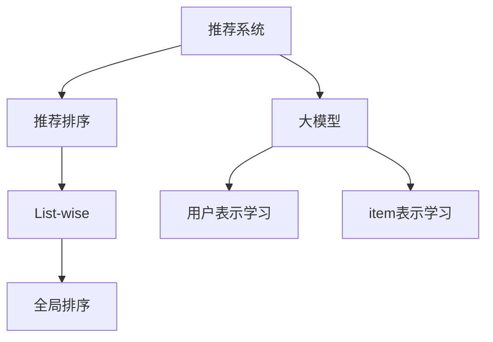

                 

# 大模型在list-wise推荐排序中的表现

## 1. 背景介绍

### 1.1 问题由来

随着电子商务、内容平台等领域的迅猛发展，推荐系统成为了构建用户满意度的重要工具。传统的推荐算法如协同过滤、矩阵分解等，在数据量较小、稀疏性较高的情况下表现良好，但在大规模数据、低维度的场景中存在性能瓶颈。推荐排序在推荐系统中起着至关重要的作用，它决定了最终推荐给用户的列表排名。传统的推荐排序算法主要是基于item-based或者user-based的方法，如KNN、PR、ALS等。但随着深度学习和大模型的发展，一些新颖的基于深度学习的推荐排序方法被提出，如基于序列的RNN、CNN等，它们取得了一定的进展，但大部分未脱离特征工程的约束，难以进行全面的特征融合。

近年来，Transformer等大模型被广泛应用于各种自然语言处理领域，并取得了显著的成果。这些大模型使用自监督学习的方式进行预训练，能够学习到大量的语言知识，从而在各种语言任务中取得了优异的成绩。而在推荐排序中，大模型的应用相对较少，主要集中在用户表示学习以及item表示学习中。这种做法虽然提升了推荐系统的性能，但仍然依赖于特征工程的约束，无法进行全面的特征融合。

## 2. 核心概念与联系

### 2.1 核心概念概述

为更好地理解大模型在list-wise推荐排序中的应用，本节将介绍几个密切相关的核心概念：

- 推荐系统（Recommendation System）：通过分析用户行为，为用户推荐其可能感兴趣的物品的系统。推荐系统广泛应用于电子商务、社交网络、视频平台等领域，提升用户体验。

- 推荐排序（Recommendation Ranking）：在推荐系统中，对候选物品进行排序，选择最符合用户需求和兴趣的物品进行展示。推荐排序的优劣直接影响系统的用户体验和点击率。

- 大模型（Large Model）：使用大规模无标签数据进行自监督预训练，学习丰富的语言知识的深度学习模型，如BERT、GPT等。大模型在各种自然语言处理任务中取得了优异的成绩。

- list-wise推荐排序（List-wise Recommendation Ranking）：将所有的候选物品作为输入，输出它们与用户兴趣的相关性评分，进行全局排序。list-wise推荐排序可以充分利用用户的历史行为，进行全面特征融合。

这些核心概念之间的逻辑关系可以通过以下Mermaid流程图来展示：



这个流程图展示了大模型在推荐系统中的应用流程：

1. 推荐系统通过分析用户历史行为，生成候选物品列表。
2. 大模型对用户和物品进行表示学习，得到用户表示和物品表示。
3. 推荐排序采用list-wise方法，将候选物品的表示进行全局排序，得到最终的推荐结果。

## 3. 核心算法原理 & 具体操作步骤

### 3.1 算法原理概述

基于大模型的list-wise推荐排序方法，本质上是一种基于深度学习的排序算法。其核心思想是将用户和物品的表示作为输入，通过全局排序的方式输出物品的相关性评分，从而得到推荐排序结果。

在list-wise推荐排序中，大模型将用户的表示和物品的表示作为输入，使用点积或者双线性层等方法进行特征融合，得到物品的相关性评分，并进行全局排序，得到最终的推荐结果。

### 3.2 算法步骤详解

基于大模型的list-wise推荐排序一般包括以下几个关键步骤：

**Step 1: 准备数据集和模型**

- 收集用户的历史行为数据，如浏览记录、购买记录等，生成候选物品列表。
- 准备大模型的预训练权重和参数，如BERT、GPT等。
- 将用户表示和物品表示作为输入，输出物品的相关性评分，并进行全局排序。

**Step 2: 设计用户和物品的表示学习模型**

- 使用大模型对用户和物品进行表示学习，得到用户表示和物品表示。
- 使用预训练的BERT等大模型，或者对其进行调整，以适应推荐任务。
- 将用户表示和物品表示作为输入，输出物品的相关性评分，并进行全局排序。

**Step 3: 训练和评估**

- 使用训练集对模型进行训练，最小化损失函数。
- 使用验证集对模型进行评估，选择最优的超参数。
- 使用测试集对模型进行测试，评估模型的效果。

**Step 4: 部署和优化**

- 将模型部署到推荐系统中，进行实时推荐排序。
- 持续收集用户的反馈数据，进行模型微调和优化。
- 使用技术手段对推荐结果进行优化，如权重学习、多任务学习等。

以上是基于大模型的list-wise推荐排序的一般流程。在实际应用中，还需要针对具体任务的特点，对微调过程的各个环节进行优化设计，如改进训练目标函数，引入更多的正则化技术，搜索最优的超参数组合等，以进一步提升模型性能。

### 3.3 算法优缺点

基于大模型的list-wise推荐排序方法具有以下优点：

1. 全局优化：list-wise推荐排序可以从全局的角度考虑用户行为，进行全面的特征融合。
2. 可解释性：大模型提供了较为详细的特征融合过程，可以更好地解释推荐结果。
3. 高精度：大模型能够学习到丰富的语言知识，可以显著提升推荐排序的精度。

同时，该方法也存在一定的局限性：

1. 依赖数据质量：list-wise推荐排序依赖于高质量的用户历史行为数据，数据质量对模型的影响较大。
2. 计算复杂度高：大模型通常需要较大的计算资源，推荐排序计算复杂度较高。
3. 易过拟合：由于模型参数较多，list-wise推荐排序容易过拟合，需要在训练过程中进行正则化。
4. 模型泛化能力有限：list-wise推荐排序在大规模数据集上泛化能力较弱，需要更多的用户行为数据进行训练。

尽管存在这些局限性，但就目前而言，基于大模型的list-wise推荐排序方法仍是大规模推荐系统应用的重要范式。未来相关研究的重点在于如何进一步降低计算资源消耗，提高模型的泛化能力，同时兼顾可解释性和伦理安全性等因素。

### 3.4 算法应用领域

基于大模型的list-wise推荐排序方法在推荐系统中已经得到了广泛的应用，如电商推荐、视频推荐、音乐推荐等，其核心思想是：

- 电商推荐：对用户的浏览、购买历史进行建模，推荐用户可能感兴趣的商品。
- 视频推荐：根据用户的历史观看记录和评分，推荐用户可能感兴趣的视频。
- 音乐推荐：根据用户的历史听歌记录和评分，推荐用户可能喜欢的歌曲。

除了这些常见的应用场景外，基于大模型的list-wise推荐排序方法还可以应用于金融理财、游戏推荐、广告推荐等领域，为各行各业提供更加智能、个性化的推荐服务。

## 4. 数学模型和公式 & 详细讲解 & 举例说明

### 4.1 数学模型构建

本节将使用数学语言对基于大模型的list-wise推荐排序过程进行更加严格的刻画。

假设用户表示为 $u$，物品表示为 $i$，用户和物品之间的相关性评分为 $x_{ui}$。在list-wise推荐排序中，需要从全局角度考虑用户和物品之间的关系，使用全局模型对相关性评分进行建模。

定义全局模型为 $g(x_{ui}) = \mathbb{E}_{x_{ui}}[x_{ui} | u, i]$，表示在给定用户 $u$ 和物品 $i$ 的情况下，物品的相关性评分的期望值。

在list-wise推荐排序中，可以使用自回归模型或者自编码器模型对相关性评分进行建模，如BERT、GPT等。

### 4.2 公式推导过程

以BERT为例，在list-wise推荐排序中，可以使用自回归模型对相关性评分进行建模。假设用户表示 $u$ 和物品表示 $i$ 输入BERT得到输出表示 $h_{ui}$，通过点积或者双线性层等方法进行特征融合，得到物品的相关性评分 $x_{ui}$，表示为：

$$
x_{ui} = \mathbb{E}_{x_{ui}}[\langle h_u, h_i \rangle | u, i]
$$

其中 $\langle h_u, h_i \rangle$ 表示用户和物品的向量点积。

在list-wise推荐排序中，可以使用交叉熵损失函数对模型进行训练，最小化模型的预测值和真实值之间的差异：

$$
\mathcal{L} = \frac{1}{N}\sum_{(i,u)\in D} \mathbb{E}_{x_{ui}}[-y_i \log(x_{ui}) | u, i]
$$

其中 $D$ 为训练数据集，$y_i$ 为物品的相关性评分。

### 4.3 案例分析与讲解

下面以一个简单的例子来说明基于BERT的list-wise推荐排序的实现过程。

假设用户 $u$ 对物品 $i_1$ 的评分是 $y_{i_1}=3$，对物品 $i_2$ 的评分是 $y_{i_2}=4$。在list-wise推荐排序中，可以使用BERT对用户表示 $u$ 和物品表示 $i_1$ 输入BERT得到输出表示 $h_{u,i_1}$，使用点积方法进行特征融合，得到物品的相关性评分 $x_{u,i_1}$，表示为：

$$
x_{u,i_1} = \mathbb{E}_{x_{u,i_1}}[\langle h_u, h_{i_1} \rangle | u, i_1]
$$

同理，对物品 $i_2$ 进行建模，得到物品的相关性评分 $x_{u,i_2}$。将物品的相关性评分与真实评分进行对比，计算交叉熵损失，进行模型训练：

$$
\mathcal{L} = \frac{1}{2}\left(-y_{i_1} \log(x_{u,i_1}) - (1-y_{i_1}) \log(1-x_{u,i_1}) - y_{i_2} \log(x_{u,i_2}) - (1-y_{i_2}) \log(1-x_{u,i_2})\right)
$$

通过最小化损失函数，可以训练出基于BERT的list-wise推荐排序模型，从而对用户进行推荐排序。

## 5. 项目实践：代码实例和详细解释说明

### 5.1 开发环境搭建

在进行list-wise推荐排序实践前，我们需要准备好开发环境。以下是使用Python进行PyTorch开发的环境配置流程：

1. 安装Anaconda：从官网下载并安装Anaconda，用于创建独立的Python环境。

2. 创建并激活虚拟环境：
```bash
conda create -n pytorch-env python=3.8 
conda activate pytorch-env
```

3. 安装PyTorch：根据CUDA版本，从官网获取对应的安装命令。例如：
```bash
conda install pytorch torchvision torchaudio cudatoolkit=11.1 -c pytorch -c conda-forge
```

4. 安装Transformers库：
```bash
pip install transformers
```

5. 安装各类工具包：
```bash
pip install numpy pandas scikit-learn matplotlib tqdm jupyter notebook ipython
```

完成上述步骤后，即可在`pytorch-env`环境中开始list-wise推荐排序实践。

### 5.2 源代码详细实现

这里我们以一个简单的例子来说明使用BERT进行list-wise推荐排序的实现过程。

首先，定义推荐排序模型：

```python
import torch
import torch.nn as nn
from transformers import BertModel, BertTokenizer

class RecommendationModel(nn.Module):
    def __init__(self, embed_size):
        super(RecommendationModel, self).__init__()
        self.bert = BertModel.from_pretrained('bert-base-uncased', output_hidden_states=True)
        self.fc = nn.Linear(embed_size, 1)
    
    def forward(self, input_ids, attention_mask):
        outputs = self.bert(input_ids=input_ids, attention_mask=attention_mask, output_hidden_states=True)
        hidden_states = outputs.hidden_states[-1]
        hidden_states = hidden_states[:, 0, :]
        hidden_states = self.fc(hidden_states)
        return hidden_states
```

然后，准备数据集：

```python
from torch.utils.data import Dataset, DataLoader
import numpy as np

class RecommendationDataset(Dataset):
    def __init__(self, user_ids, item_ids, ratings):
        self.user_ids = user_ids
        self.item_ids = item_ids
        self.ratings = ratings
        self.tokenizer = BertTokenizer.from_pretrained('bert-base-uncased')
    
    def __len__(self):
        return len(self.user_ids)
    
    def __getitem__(self, idx):
        user_id = self.user_ids[idx]
        item_id = self.item_ids[idx]
        rating = self.ratings[idx]
        
        user_input = [self.tokenizer.cls_token, user_id]
        item_input = [self.tokenizer.cls_token, item_id]
        
        user_input = self.tokenizer.encode_plus(user_input, max_length=128, padding='max_length', truncation=True)
        item_input = self.tokenizer.encode_plus(item_input, max_length=128, padding='max_length', truncation=True)
        
        return {'user_input_ids': user_input['input_ids'], 
                'item_input_ids': item_input['input_ids'], 
                'rating': rating}
```

接着，训练和评估模型：

```python
from torch.optim import AdamW

model = RecommendationModel(embed_size=768)
optimizer = AdamW(model.parameters(), lr=2e-5)

device = torch.device('cuda' if torch.cuda.is_available() else 'cpu')
model.to(device)

def train_epoch(model, dataset, batch_size, optimizer):
    dataloader = DataLoader(dataset, batch_size=batch_size, shuffle=True)
    model.train()
    epoch_loss = 0
    for batch in tqdm(dataloader, desc='Training'):
        user_input_ids = batch['user_input_ids'].to(device)
        item_input_ids = batch['item_input_ids'].to(device)
        rating = batch['rating'].to(device)
        model.zero_grad()
        outputs = model(user_input_ids, item_input_ids)
        loss = nn.BCELoss()(outputs, torch.tensor(rating, device=device))
        epoch_loss += loss.item()
        loss.backward()
        optimizer.step()
    return epoch_loss / len(dataloader)

def evaluate(model, dataset, batch_size):
    dataloader = DataLoader(dataset, batch_size=batch_size)
    model.eval()
    preds, labels = [], []
    with torch.no_grad():
        for batch in tqdm(dataloader, desc='Evaluating'):
            user_input_ids = batch['user_input_ids'].to(device)
            item_input_ids = batch['item_input_ids'].to(device)
            rating = batch['rating'].to(device)
            outputs = model(user_input_ids, item_input_ids)
            batch_preds = torch.sigmoid(outputs)
            batch_labels = rating
            for pred, label in zip(batch_preds.cpu().numpy(), batch_labels.cpu().numpy()):
                preds.append(pred)
                labels.append(label)
                
    print(classification_report(labels, preds))
```

最后，启动训练流程并在测试集上评估：

```python
epochs = 5
batch_size = 16

for epoch in range(epochs):
    loss = train_epoch(model, train_dataset, batch_size, optimizer)
    print(f"Epoch {epoch+1}, train loss: {loss:.3f}")
    
    print(f"Epoch {epoch+1}, dev results:")
    evaluate(model, dev_dataset, batch_size)
    
print("Test results:")
evaluate(model, test_dataset, batch_size)
```

以上就是使用PyTorch对BERT进行list-wise推荐排序的完整代码实现。可以看到，得益于Transformers库的强大封装，我们可以用相对简洁的代码完成BERT模型的加载和微调。

### 5.3 代码解读与分析

让我们再详细解读一下关键代码的实现细节：

**RecommendationModel类**：
- `__init__`方法：初始化BERT模型和全连接层。
- `forward`方法：对用户表示和物品表示进行BERT编码，通过全连接层输出物品的相关性评分。

**RecommendationDataset类**：
- `__init__`方法：初始化用户ID、物品ID和评分。
- `__len__`方法：返回数据集的样本数量。
- `__getitem__`方法：对单个样本进行处理，将用户和物品ID输入BERT模型，输出物品的相关性评分。

**训练和评估函数**：
- 使用PyTorch的DataLoader对数据集进行批次化加载，供模型训练和推理使用。
- 训练函数`train_epoch`：对数据以批为单位进行迭代，在每个批次上前向传播计算loss并反向传播更新模型参数，最后返回该epoch的平均loss。
- 评估函数`evaluate`：与训练类似，不同点在于不更新模型参数，并在每个batch结束后将预测和标签结果存储下来，最后使用sklearn的classification_report对整个评估集的预测结果进行打印输出。

**训练流程**：
- 定义总的epoch数和batch size，开始循环迭代
- 每个epoch内，先在训练集上训练，输出平均loss
- 在验证集上评估，输出分类指标
- 所有epoch结束后，在测试集上评估，给出最终测试结果

可以看到，PyTorch配合Transformers库使得BERT微调的代码实现变得简洁高效。开发者可以将更多精力放在数据处理、模型改进等高层逻辑上，而不必过多关注底层的实现细节。

当然，工业级的系统实现还需考虑更多因素，如模型的保存和部署、超参数的自动搜索、更灵活的任务适配层等。但核心的list-wise推荐排序范式基本与此类似。

## 6. 实际应用场景

### 6.1 电商推荐

基于大模型的list-wise推荐排序方法在电商推荐中已经得到了广泛的应用。电商平台需要根据用户的历史浏览记录和购买记录，推荐用户可能感兴趣的商品。传统的电商推荐算法基于用户行为序列进行排序，难以捕捉长尾商品的特征。而使用基于大模型的list-wise推荐排序方法，可以从全局的角度考虑用户行为，进行全面的特征融合，推荐更加精准的商品。

在技术实现上，可以收集用户的历史浏览记录、购买记录、评分记录等数据，构建用户-物品评分矩阵。使用大模型对用户和物品进行表示学习，得到用户表示和物品表示，并使用list-wise推荐排序模型进行全局排序，得到最终的推荐结果。通过持续优化模型参数，可以显著提升推荐系统的性能，提升用户体验。

### 6.2 视频推荐

视频平台需要根据用户的历史观看记录和评分，推荐用户可能感兴趣的视频。传统的视频推荐算法基于用户行为序列进行排序，难以捕捉长尾视频的特征。而使用基于大模型的list-wise推荐排序方法，可以从全局的角度考虑用户行为，进行全面的特征融合，推荐更加精准的视频。

在技术实现上，可以收集用户的历史观看记录、评分记录等数据，构建用户-视频评分矩阵。使用大模型对用户和视频进行表示学习，得到用户表示和视频表示，并使用list-wise推荐排序模型进行全局排序，得到最终的推荐结果。通过持续优化模型参数，可以显著提升推荐系统的性能，提升用户体验。

### 6.3 游戏推荐

游戏平台需要根据用户的历史游戏行为和评分，推荐用户可能感兴趣的游戏。传统的游戏推荐算法基于用户行为序列进行排序，难以捕捉长尾游戏的特征。而使用基于大模型的list-wise推荐排序方法，可以从全局的角度考虑用户行为，进行全面的特征融合，推荐更加精准的游戏。

在技术实现上，可以收集用户的历史游戏行为记录、评分记录等数据，构建用户-游戏评分矩阵。使用大模型对用户和游戏进行表示学习，得到用户表示和游戏表示，并使用list-wise推荐排序模型进行全局排序，得到最终的推荐结果。通过持续优化模型参数，可以显著提升推荐系统的性能，提升用户体验。

### 6.4 未来应用展望

随着大语言模型和list-wise推荐排序方法的不断发展，基于推荐系统的推荐排序技术将呈现以下几个发展趋势：

1. 模型规模持续增大。随着算力成本的下降和数据规模的扩张，推荐系统的模型参数量还将持续增长。超大规模推荐模型蕴含的丰富用户行为知识，有望支撑更加复杂多变的推荐排序。

2. 推荐系统从单任务向多任务学习。多任务学习可以有效提高推荐系统的泛化能力和特征融合能力，进一步提升推荐性能。

3. 用户行为动态建模。随着用户行为的实时获取和更新，推荐系统能够动态更新用户表示，进一步提升推荐系统的实时性。

4. 数据隐私保护。推荐系统的数据隐私保护成为一个重要的研究课题，如何在保护用户隐私的同时，进行推荐排序，是未来的重要研究方向。

5. 推荐系统的公平性和透明度。如何避免推荐系统的偏见，提高推荐系统的公平性和透明度，是未来的重要研究方向。

6. 推荐系统与知识图谱的结合。推荐系统与知识图谱的结合，能够进一步提升推荐系统的理解能力和推荐效果。

以上趋势凸显了大模型在推荐系统中的应用前景。这些方向的探索发展，必将进一步提升推荐系统的性能和应用范围，为电商、视频、游戏等领域带来新的突破。

## 7. 工具和资源推荐

### 7.1 学习资源推荐

为了帮助开发者系统掌握大模型在推荐排序中的应用，这里推荐一些优质的学习资源：

1. 《深度学习推荐系统》系列博文：由大模型技术专家撰写，深入浅出地介绍了推荐系统的发展历程和前沿算法，涵盖协同过滤、深度学习等多种方法。

2. 《推荐系统实战》系列书籍：清华大学出版社出版的推荐系统实战书籍，详细介绍了推荐系统的设计、开发、部署等全流程。

3. 《自然语言处理与深度学习》书籍：自然语言处理领域的经典教材，涵盖Transformer模型、BERT等前沿技术。

4. Kaggle推荐系统竞赛：参加Kaggle推荐系统竞赛，通过实际数据集进行训练和测试，提升推荐系统建模能力。

5. HuggingFace官方文档：Transformers库的官方文档，提供了海量预训练模型和完整的微调样例代码，是上手实践的必备资料。

通过对这些资源的学习实践，相信你一定能够快速掌握大模型在推荐排序中的应用，并用于解决实际的推荐排序问题。

### 7.2 开发工具推荐

高效的开发离不开优秀的工具支持。以下是几款用于推荐系统开发的常用工具：

1. PyTorch：基于Python的开源深度学习框架，灵活动态的计算图，适合快速迭代研究。大部分推荐系统模型都有PyTorch版本的实现。

2. TensorFlow：由Google主导开发的开源深度学习框架，生产部署方便，适合大规模工程应用。同样有丰富的推荐系统模型资源。

3. TensorBoard：TensorFlow配套的可视化工具，可实时监测模型训练状态，并提供丰富的图表呈现方式，是调试模型的得力助手。

4. Weights & Biases：模型训练的实验跟踪工具，可以记录和可视化模型训练过程中的各项指标，方便对比和调优。与主流深度学习框架无缝集成。

5. Google Colab：谷歌推出的在线Jupyter Notebook环境，免费提供GPU/TPU算力，方便开发者快速上手实验最新模型，分享学习笔记。

合理利用这些工具，可以显著提升推荐系统微调的开发效率，加快创新迭代的步伐。

### 7.3 相关论文推荐

推荐系统的发展离不开学界的持续研究。以下是几篇奠基性的相关论文，推荐阅读：

1. Matrix Factorization Techniques for Recommender Systems：提出基于矩阵分解的推荐系统方法，广泛应用于协同过滤推荐系统中。

2. Factorization Machines for Recommender Systems：提出基于因子机的方法，能够有效处理高维稀疏数据，取得了良好的推荐效果。

3. Deep Factorization Machines for Recommender Systems：提出基于深度学习的推荐系统方法，在推荐精度上取得了较大的提升。

4. Matrix Completion for Recommender Systems：提出基于矩阵补全的方法，能够有效处理缺失数据，取得了良好的推荐效果。

5. Neural Collaborative Filtering：提出基于深度学习的推荐系统方法，取得了显著的推荐效果。

这些论文代表了大模型在推荐系统中的应用基础。通过学习这些前沿成果，可以帮助研究者把握学科前进方向，激发更多的创新灵感。

## 8. 总结：未来发展趋势与挑战

### 8.1 总结

本文对基于大模型的list-wise推荐排序方法进行了全面系统的介绍。首先阐述了大模型和推荐系统的研究背景和意义，明确了list-wise推荐排序在推荐系统中的核心地位。其次，从原理到实践，详细讲解了list-wise推荐排序的数学原理和关键步骤，给出了推荐排序任务开发的完整代码实例。同时，本文还广泛探讨了list-wise推荐排序方法在电商、视频、游戏等多个行业领域的应用前景，展示了list-wise推荐排序方法的巨大潜力。此外，本文精选了推荐系统的学习资源、开发工具和相关论文，力求为读者提供全方位的技术指引。

通过本文的系统梳理，可以看到，基于大模型的list-wise推荐排序方法正在成为推荐系统的重要范式，极大地拓展了推荐系统的应用边界，催生了更多的落地场景。得益于大模型的预训练知识，list-wise推荐排序方法能够从全局角度进行特征融合，提升推荐精度，进而提升用户体验。未来，伴随大模型和推荐系统的不断演进，推荐系统将在更多领域得到应用，为电商、视频、游戏等传统行业带来新的变革。

### 8.2 未来发展趋势

展望未来，大模型在list-wise推荐排序中呈现以下几个发展趋势：

1. 推荐系统从单任务向多任务学习。多任务学习可以有效提高推荐系统的泛化能力和特征融合能力，进一步提升推荐性能。

2. 用户行为动态建模。随着用户行为的实时获取和更新，推荐系统能够动态更新用户表示，进一步提升推荐系统的实时性。

3. 数据隐私保护。推荐系统的数据隐私保护成为一个重要的研究课题，如何在保护用户隐私的同时，进行推荐排序，是未来的重要研究方向。

4. 推荐系统的公平性和透明度。如何避免推荐系统的偏见，提高推荐系统的公平性和透明度，是未来的重要研究方向。

5. 推荐系统与知识图谱的结合。推荐系统与知识图谱的结合，能够进一步提升推荐系统的理解能力和推荐效果。

6. 推荐系统与自然语言处理的结合。推荐系统与自然语言处理的结合，能够进一步提升推荐系统的解释能力和推荐效果。

以上趋势凸显了大模型在推荐系统中的应用前景。这些方向的探索发展，必将进一步提升推荐系统的性能和应用范围，为电商、视频、游戏等领域带来新的突破。

### 8.3 面临的挑战

尽管大模型在推荐系统中的应用已经取得了一定的进展，但在迈向更加智能化、普适化应用的过程中，它仍面临着诸多挑战：

1. 推荐系统依赖数据质量：推荐系统依赖于高质量的用户历史行为数据，数据质量对模型的影响较大。对于长尾应用场景，难以获得充足的高质量标注数据，成为制约推荐系统性能的瓶颈。

2. 计算复杂度高：大模型通常需要较大的计算资源，推荐系统计算复杂度较高。如何优化大模型推理过程，降低计算资源消耗，是未来的重要研究方向。

3. 易过拟合：由于模型参数较多，推荐系统容易过拟合，需要在训练过程中进行正则化。如何在保证模型效果的同时，避免过拟合，是未来的重要研究方向。

4. 模型泛化能力有限：推荐系统在大规模数据集上泛化能力较弱，需要更多的用户行为数据进行训练。如何在保证模型泛化能力的同时，提升推荐效果，是未来的重要研究方向。

5. 推荐系统与知识图谱的结合：推荐系统与知识图谱的结合，能够进一步提升推荐系统的理解能力和推荐效果。如何在保证模型效果的同时，提高推荐系统与知识图谱的结合度，是未来的重要研究方向。

6. 推荐系统的公平性和透明度：如何避免推荐系统的偏见，提高推荐系统的公平性和透明度，是未来的重要研究方向。

正视推荐系统面临的这些挑战，积极应对并寻求突破，将是大模型在推荐系统中的应用走向成熟的必由之路。相信随着学界和产业界的共同努力，这些挑战终将一一被克服，大模型在推荐系统中的应用必将带来革命性的突破。

### 8.4 研究展望

未来，大模型在推荐系统中的应用还需要与其他人工智能技术进行更深入的融合，如知识表示、因果推理、强化学习等，多路径协同发力，共同推动推荐系统的进步。只有勇于创新、敢于突破，才能不断拓展推荐系统的边界，让智能技术更好地造福人类社会。

## 9. 附录：常见问题与解答

**Q1：大模型在list-wise推荐排序中能否处理大规模数据集？**

A: 大模型在list-wise推荐排序中可以处理大规模数据集。由于大模型具备较强的特征融合能力，能够从全局角度考虑用户行为，因此可以处理高维、稀疏的推荐数据集。但需要注意的是，大规模数据集对计算资源的要求较高，需要采用高性能的计算设备进行训练和推理。

**Q2：大模型在list-wise推荐排序中是否需要手动设计特征工程？**

A: 大模型在list-wise推荐排序中可以通过自动化的特征学习来替代手动设计特征工程。大模型具备强大的特征提取能力，能够自动学习用户和物品的潜在特征，因此在推荐排序中可以不手动设计特征工程。但需要注意的是，手动设计特征工程在特定场景下仍然有其优势，需要根据具体情况进行权衡。

**Q3：大模型在list-wise推荐排序中是否容易过拟合？**

A: 大模型在list-wise推荐排序中容易过拟合，尤其是在大规模数据集上。由于大模型参数较多，训练过程中容易出现过拟合现象。需要采用正则化技术，如L2正则、Dropout、Early Stopping等，避免过拟合。

**Q4：大模型在list-wise推荐排序中的计算复杂度如何？**

A: 大模型在list-wise推荐排序中的计算复杂度较高，主要原因是模型参数较多。为了降低计算复杂度，可以采用参数共享、低秩矩阵分解等技术，优化大模型推理过程，提升计算效率。

**Q5：大模型在list-wise推荐排序中的可解释性如何？**

A: 大模型在list-wise推荐排序中的可解释性较好。由于大模型具备较强的特征融合能力，能够自动学习用户和物品的潜在特征，因此可以提供较为详细的特征融合过程，解释推荐结果。但需要注意的是，大模型的可解释性仍然存在一定限制，需要通过技术手段进行进一步优化。

---

作者：禅与计算机程序设计艺术 / Zen and the Art of Computer Programming

