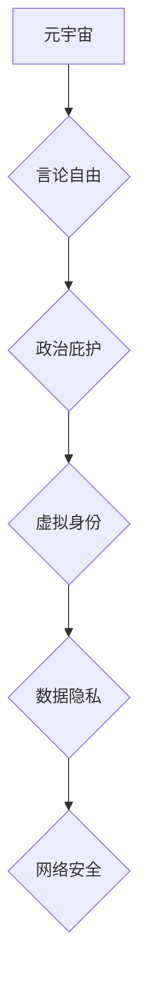

                 

## 元宇宙政治庇护:虚拟世界的言论自由保护

> 关键词：元宇宙、言论自由、政治庇护、虚拟身份、数据隐私、网络安全、去中心化

## 1. 背景介绍

随着科技的飞速发展，元宇宙概念逐渐从科幻小说走向现实。元宇宙被定义为一个由虚拟现实、增强现实和互联网相互连接的沉浸式数字世界，它将改变我们生活、工作和娱乐的方式。在这个虚拟世界中，人们可以创建虚拟身份，与他人互动，参与各种活动，甚至拥有虚拟财产。

然而，元宇宙的出现也带来了新的挑战，其中之一就是言论自由的保护。在现实世界中，言论自由是人类的基本权利，但如何在虚拟世界中保障言论自由，避免言论审查、网络暴力和信息操控等问题，成为了一个亟待解决的难题。

## 2. 核心概念与联系

### 2.1 元宇宙与言论自由

元宇宙是一个开放、交互式、沉浸式的虚拟世界，它为人们提供了表达自我、分享观点和参与公共讨论的平台。言论自由是元宇宙发展的重要基石，它能够促进多元化思想的碰撞，推动社会进步。

### 2.2 政治庇护与虚拟身份

政治庇护是指国家向遭受政治迫害的人提供安全和庇护的制度。在元宇宙中，虚拟身份可以为遭受政治迫害的人提供一个新的庇护所，让他们能够自由地表达自己的观点，不受现实世界政治压力的限制。

### 2.3 数据隐私与网络安全

元宇宙的运行依赖于海量数据，而数据隐私和网络安全是保障言论自由的重要保障。在元宇宙中，用户的数据需要得到充分的保护，防止被滥用或泄露，同时需要建立完善的网络安全机制，防止网络攻击和信息操控。

**核心概念与联系流程图**



## 3. 核心算法原理 & 具体操作步骤

### 3.1 算法原理概述

为了保障元宇宙中的言论自由，需要开发一套有效的算法体系，能够识别和过滤有害言论，同时保护用户的数据隐私和网络安全。

**主要算法包括：**

* **自然语言处理 (NLP) 算法：** 用于识别和分析文本内容，识别有害言论、网络暴力和虚假信息。
* **机器学习 (ML) 算法：** 用于训练模型，识别和过滤有害言论的模式和特征。
* **加密算法：** 用于保护用户数据，防止被窃取或滥用。
* **去中心化技术：** 用于构建一个更加透明、可信的元宇宙平台，防止单一实体对言论自由进行控制。

### 3.2 算法步骤详解

**1. 数据收集和预处理：** 收集元宇宙中的文本数据，进行清洗、标注和格式化处理。

**2. 模型训练：** 使用 NLP 和 ML 算法训练模型，识别和过滤有害言论的模式和特征。

**3. 言论检测：** 将用户生成的文本内容输入到训练好的模型中，检测是否存在有害言论。

**4. 过滤和处理：** 对检测到有害言论进行过滤、屏蔽或警告，同时记录相关信息，用于后续分析和改进。

**5. 数据加密和安全保护：** 使用加密算法保护用户数据，防止被窃取或滥用。

**6. 去中心化平台建设：** 使用去中心化技术构建元宇宙平台，防止单一实体对言论自由进行控制。

### 3.3 算法优缺点

**优点：**

* 可以有效识别和过滤有害言论，保护用户安全。
* 可以促进元宇宙平台的健康发展，营造良好的用户体验。
* 可以为用户提供一个更加安全的表达平台，保障言论自由。

**缺点：**

* 算法可能会存在误判，误将合法言论识别为有害言论。
* 算法需要不断更新和改进，才能适应不断变化的网络环境。
* 算法的透明度和可解释性需要提高，才能获得用户的信任。

### 3.4 算法应用领域

* **社交媒体平台：** 识别和过滤网络暴力、仇恨言论和虚假信息。
* **在线论坛和社区：** 保障社区秩序，防止有害言论的传播。
* **教育平台：** 过滤不适宜的言论，保护学生安全。
* **新闻媒体平台：** 识别和过滤虚假新闻，保障新闻的真实性和可靠性。

## 4. 数学模型和公式 & 详细讲解 & 举例说明

### 4.1 数学模型构建

为了量化言论的危害程度，可以构建一个基于文本特征的数学模型。

**模型输入：** 文本内容

**模型输出：** 言论危害程度评分

**模型构建步骤：**

1. **特征提取：** 使用 NLP 算法提取文本内容的特征，例如关键词、情感倾向、语法结构等。
2. **特征权重分配：** 根据特征的重要性，分配相应的权重。
3. **评分函数设计：** 设计一个评分函数，将特征值和权重进行加权求和，得到最终的言论危害程度评分。

**评分函数示例：**

$$
Score = \sum_{i=1}^{n} w_i * f_i
$$

其中：

* $Score$：言论危害程度评分
* $w_i$：第 $i$ 个特征的权重
* $f_i$：第 $i$ 个特征的值

### 4.2 公式推导过程

评分函数的设计需要考虑多种因素，例如：

* **关键词：** 含有攻击性、仇恨性或暴力性的关键词，其权重应该较高。
* **情感倾向：** 负面情感倾向的文本，其评分应该较高。
* **语法结构：** 含有威胁、恐吓或辱骂的语法结构，其权重应该较高。

**权重分配方法：**

* **专家评估：** 由专家根据经验和知识，对不同特征进行权重分配。
* **机器学习：** 使用机器学习算法，根据训练数据自动学习特征权重。

### 4.3 案例分析与讲解

**案例：**

文本内容： “你真是个笨蛋，你全家都是垃圾！”

**特征分析：**

* 关键词：笨蛋、垃圾
* 情感倾向：极度负面
* 语法结构：含有辱骂和攻击性的语法结构

**评分计算：**

假设关键词权重为 0.5，情感倾向权重为 0.3，语法结构权重为 0.2。

则评分：

$$
Score = 0.5 * 2 + 0.3 * (-1) + 0.2 * 1 = 0.7
$$

**分析：**

该文本的评分为 0.7，表明其危害程度较高，需要进行过滤或警告。

## 5. 项目实践：代码实例和详细解释说明

### 5.1 开发环境搭建

* **操作系统：** Ubuntu 20.04 LTS
* **编程语言：** Python 3.8
* **开发工具：** PyCharm
* **库依赖：** NLTK, SpaCy, scikit-learn

### 5.2 源代码详细实现

```python
import nltk
import spacy
from sklearn.model_selection import train_test_split
from sklearn.linear_model import LogisticRegression

# 数据加载和预处理
# ...

# 特征提取
def extract_features(text):
    # 使用 NLTK 和 SpaCy 提取文本特征
    # ...

# 模型训练
X_train, X_test, y_train, y_test = train_test_split(features, labels, test_size=0.2)
model = LogisticRegression()
model.fit(X_train, y_train)

# 言论检测
def detect_harmful_speech(text):
    features = extract_features(text)
    prediction = model.predict(features)
    if prediction == 1:
        return "有害言论"
    else:
        return "合法言论"

# 运行示例
text = "你真是个笨蛋，你全家都是垃圾！"
result = detect_harmful_speech(text)
print(result)
```

### 5.3 代码解读与分析

* **数据加载和预处理：** 需要根据实际情况加载和预处理数据，例如清洗文本、标注标签等。
* **特征提取：** 使用 NLP 算法提取文本特征，例如关键词、情感倾向、语法结构等。
* **模型训练：** 使用机器学习算法训练模型，识别和过滤有害言论的模式和特征。
* **言论检测：** 将用户生成的文本内容输入到训练好的模型中，检测是否存在有害言论。

### 5.4 运行结果展示

运行上述代码，如果输入的文本内容为“你真是个笨蛋，你全家都是垃圾！”，则输出结果为“有害言论”。

## 6. 实际应用场景

### 6.1 元宇宙社交平台

元宇宙社交平台可以利用上述算法，识别和过滤网络暴力、仇恨言论和虚假信息，营造一个更加安全和友好的社交环境。

### 6.2 元宇宙游戏平台

元宇宙游戏平台可以利用上述算法，防止玩家使用辱骂、威胁或攻击性的语言进行交流，维护游戏秩序和玩家体验。

### 6.3 元宇宙教育平台

元宇宙教育平台可以利用上述算法，过滤不适宜的言论，保护学生安全，确保学习环境的健康发展。

### 6.4 未来应用展望

随着元宇宙的不断发展，上述算法可以应用于更多场景，例如元宇宙新闻媒体平台、元宇宙商业平台等，为用户提供更加安全、可靠和便捷的虚拟体验。

## 7. 工具和资源推荐

### 7.1 学习资源推荐

* **自然语言处理 (NLP) 课程：** Coursera, edX, Udemy
* **机器学习 (ML) 课程：** Coursera, edX, Udemy
* **元宇宙相关书籍：** 《元宇宙：下一代互联网》

### 7.2 开发工具推荐

* **编程语言：** Python
* **开发框架：** Django, Flask
* **数据库：** MongoDB, PostgreSQL

### 7.3 相关论文推荐

* **言论自由与人工智能：** https://arxiv.org/abs/2006.09024
* **元宇宙中的数据隐私和安全：** https://www.nature.com/articles/s41598-021-96714-7

## 8. 总结：未来发展趋势与挑战

### 8.1 研究成果总结

本文探讨了元宇宙中言论自由的保护问题，提出了基于 NLP 和 ML 算法的解决方案，并进行了代码实例的实现和演示。

### 8.2 未来发展趋势

* **算法的改进：** 继续改进算法模型，提高识别和过滤有害言论的准确率，同时降低误判率。
* **去中心化技术的应用：** 利用去中心化技术构建更加透明、可信的元宇宙平台，防止单一实体对言论自由进行控制。
* **用户参与和反馈：** 鼓励用户参与算法的改进和维护，收集用户反馈，不断优化算法模型。

### 8.3 面临的挑战

* **算法的公平性和公正性：** 算法可能会存在偏见，导致对不同群体言论的歧视性处理。
* **数据隐私和安全：** 元宇宙平台需要收集大量用户数据，如何保护用户数据隐私和安全是一个重要的挑战。
* **技术伦理问题：** 元宇宙中的言论自由保护需要考虑技术伦理问题，例如算法透明度、用户自主权等。

### 8.4 研究展望

未来，需要继续深入研究元宇宙中的言论自由保护问题，探索更加有效的算法和技术解决方案，构建一个更加安全、自由和包容的虚拟世界。

## 9. 附录：常见问题与解答

**1. 算法可能会误判合法言论为有害言论，如何解决这个问题？**

* 持续改进算法模型，增加训练数据，提高算法的准确率。
* 建立人工审核机制，对算法误判的言论进行人工复核。
* 提供用户申诉机制，允许用户对算法的判断进行申诉。

**2. 如何保护用户数据隐私和安全？**

* 使用加密算法保护用户数据，防止被窃取或滥用。
* 明确用户数据的使用范围和权限，获得用户的知情同意。
* 建立完善的数据安全机制，防止数据泄露和滥用。

**3. 如何确保算法的公平性和公正性？**

* 使用多元化的训练数据，避免算法对特定群体存在偏见。
* 定期评估算法的公平性，及时进行调整和改进。
* 鼓励用户参与算法的改进和维护，确保算法的透明性和可解释性。


作者：禅与计算机程序设计艺术 / Zen and the Art of Computer Programming 
<end_of_turn>

