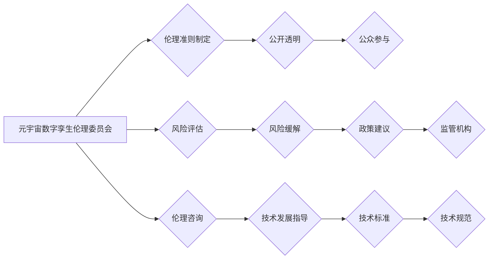

                 

## 元宇宙数字孪生伦理委员会:现实映射的道德监管机构

> 关键词：元宇宙、数字孪生、伦理委员会、道德监管、人工智能、数据隐私、虚拟现实、增强现实

## 1. 背景介绍

元宇宙概念的兴起，标志着人类迈向一个全新的数字世界。在这个虚拟世界中，数字孪生技术将现实世界中的实体、系统或过程以数字化形式映射出来，并赋予其感知、交互和演算的能力。数字孪生在各个领域都展现出巨大的潜力，例如工业生产、城市规划、医疗保健等。然而，随着元宇宙数字孪生的发展，也随之带来了新的伦理挑战和道德风险。

**1.1 元宇宙的定义与发展趋势**

元宇宙是一个融合了虚拟现实 (VR)、增强现实 (AR)、区块链、人工智能等技术的沉浸式虚拟世界。它是一个开放、共享、互联的虚拟空间，用户可以在其中创建、分享和体验数字内容，并与其他用户进行互动。元宇宙的发展趋势包括：

* **沉浸式体验:**  VR 和 AR 技术将为用户提供更加逼真的虚拟体验。
* **去中心化:** 区块链技术将赋予用户对虚拟资产和数据的拥有权，并促进元宇宙的去中心化发展。
* **社交化:** 元宇宙将成为一个新的社交平台，用户可以与朋友、家人和陌生人进行互动。
* **经济化:** 元宇宙将拥有自己的经济体系，用户可以交易虚拟资产和服务。

**1.2 数字孪生的概念与应用**

数字孪生是指利用物理模型、传感器数据和人工智能算法，构建一个与现实世界实体或系统完全对应的虚拟模型。数字孪生可以用于模拟和预测现实世界的行为，并提供决策支持。数字孪生的应用领域包括：

* **工业生产:** 模拟生产流程，优化生产效率和降低成本。
* **城市规划:** 模拟城市环境，预测交通流量和环境污染，优化城市规划。
* **医疗保健:** 模拟人体器官，辅助医生进行诊断和治疗。

**1.3 元宇宙数字孪生带来的伦理挑战**

元宇宙数字孪生的发展带来了许多伦理挑战，例如：

* **数据隐私:** 数字孪生需要收集和处理大量用户数据，如何保护用户数据隐私是一个重要问题。
* **算法偏见:** 数字孪生算法可能存在偏见，导致不公平的结果。
* **虚拟身份的真实性:** 在元宇宙中，用户可以创建虚拟身份，如何确保虚拟身份的真实性和可靠性是一个挑战。
* **责任和法律责任:** 在元宇宙中发生事故或事件，如何界定责任和法律责任是一个复杂问题。

## 2. 核心概念与联系

元宇宙数字孪生伦理委员会是一个旨在解决元宇宙数字孪生带来的伦理挑战和道德风险的机构。该委员会将由来自不同领域的专家组成，包括伦理学家、法律专家、计算机科学家、社会学家等。

**2.1 元宇宙数字孪生伦理委员会的职责**

* 制定元宇宙数字孪生的伦理准则和道德规范。
* 审查和评估元宇宙数字孪生项目的伦理风险。
* 提供伦理咨询和指导。
* 推动元宇宙数字孪生技术的负责任发展。

**2.2 元宇宙数字孪生伦理委员会的架构**



## 3. 核心算法原理 & 具体操作步骤

元宇宙数字孪生伦理委员会的运作需要依赖于一系列先进的算法和技术，例如：

**3.1 算法原理概述**

* **风险评估算法:** 基于机器学习和深度学习技术，对元宇宙数字孪生项目进行风险评估，识别潜在的伦理风险和道德风险。
* **伦理决策算法:** 基于规则引擎和案例库，为元宇宙数字孪生项目提供伦理决策建议。
* **数据隐私保护算法:** 基于加密技术和联邦学习技术，保护用户数据隐私。

**3.2 算法步骤详解**

**风险评估算法:**

1. 收集元宇宙数字孪生项目的相关信息，包括项目目标、技术方案、数据来源、用户群体等。
2. 利用机器学习模型对项目信息进行分析，识别潜在的伦理风险和道德风险。
3. 根据风险等级，给出风险评估报告，并提供风险缓解建议。

**伦理决策算法:**

1. 收集元宇宙数字孪生项目面临的伦理困境。
2. 基于规则引擎和案例库，分析伦理困境，并给出伦理决策建议。
3. 提供伦理决策报告，并解释决策依据。

**数据隐私保护算法:**

1. 对用户数据进行加密，防止未经授权的访问。
2. 利用联邦学习技术，在不泄露原始数据的情况下，训练机器学习模型。
3. 实施数据匿名化技术，保护用户隐私。

**3.3 算法优缺点**

**优点:**

* 能够有效识别和评估元宇宙数字孪生项目的伦理风险。
* 提供科学合理的伦理决策建议。
* 能够保护用户数据隐私。

**缺点:**

* 算法的准确性和可靠性需要不断提高。
* 伦理决策算法的解释性和透明度需要增强。
* 数据隐私保护算法需要不断适应新的技术发展。

**3.4 算法应用领域**

* 元宇宙数字孪生项目的伦理审查。
* 元宇宙数字孪生技术的研发和应用。
* 元宇宙数字孪生相关的法律法规制定。

## 4. 数学模型和公式 & 详细讲解 & 举例说明

元宇宙数字孪生伦理委员会的运作可以借助数学模型和公式进行量化分析和决策支持。

**4.1 数学模型构建**

可以构建一个多因素决策模型，将元宇宙数字孪生项目的伦理风险因素进行量化，并根据风险等级进行决策。

**4.2 公式推导过程**

假设元宇宙数字孪生项目的伦理风险因素包括数据隐私风险、算法偏见风险、虚拟身份风险等。每个风险因素可以赋予一个权重，并根据风险等级进行评分。

**风险等级评分公式:**

```latex
Risk Level = \sum_{i=1}^{n} w_i * Risk Score_i
```

其中：

* $Risk Level$ 表示项目的整体风险等级。
* $w_i$ 表示第 $i$ 个风险因素的权重。
* $Risk Score_i$ 表示第 $i$ 个风险因素的评分。

**4.3 案例分析与讲解**

例如，一个元宇宙数字孪生项目用于模拟城市交通，需要收集大量用户的出行数据。

* 数据隐私风险权重：0.4
* 数据隐私风险评分：3 (中等风险)
* 算法偏见风险权重：0.3
* 算法偏见风险评分：2 (低风险)
* 虚拟身份风险权重：0.3
* 虚拟身份风险评分：1 (低风险)

根据公式计算，该项目的整体风险等级为：

```latex
Risk Level = 0.4 * 3 + 0.3 * 2 + 0.3 * 1 = 1.2 + 0.6 + 0.3 = 2.1
```

该项目的整体风险等级为中等风险，需要加强伦理审查和风险缓解措施。

## 5. 项目实践：代码实例和详细解释说明

元宇宙数字孪生伦理委员会的运作可以借助开源工具和平台进行实现。

**5.1 开发环境搭建**

可以使用云平台提供的虚拟机或容器服务搭建开发环境，并安装必要的软件工具，例如Python、Java、Docker等。

**5.2 源代码详细实现**

可以使用Python语言编写风险评估算法的代码，并利用机器学习库，例如Scikit-learn、TensorFlow等，进行模型训练和评估。

**5.3 代码解读与分析**

代码中需要定义风险因素、权重、评分标准等参数，并根据实际情况进行调整。

**5.4 运行结果展示**

运行代码后，可以得到元宇宙数字孪生项目的风险评估报告，并根据报告结果进行决策。

## 6. 实际应用场景

元宇宙数字孪生伦理委员会可以应用于各个领域，例如：

**6.1 工业生产:**

* 评估工业生产过程中的伦理风险，例如机器人自动化带来的失业风险。
* 帮助企业制定伦理规范和道德准则，确保工业生产的伦理合规性。

**6.2 城市规划:**

* 评估城市数字孪生模型的伦理风险，例如数据隐私泄露和算法偏见。
* 帮助城市规划者制定更公平、更可持续的城市规划方案。

**6.3 医疗保健:**

* 评估医疗数字孪生模型的伦理风险，例如患者数据安全和医疗决策的透明度。
* 帮助医疗机构制定伦理规范和道德准则，确保医疗数字孪生的安全和有效性。

**6.4 未来应用展望**

随着元宇宙和数字孪生的发展，元宇宙数字孪生伦理委员会将发挥越来越重要的作用，帮助人类在元宇宙中构建一个更加公平、更加可持续的未来。

## 7. 工具和资源推荐

**7.1 学习资源推荐**

* **书籍:**

    * 《元宇宙：下一代互联网》
    * 《数字孪生：构建未来》

* **在线课程:**

    * Coursera: 元宇宙与数字孪生
    * edX: 伦理与人工智能

**7.2 开发工具推荐**

* **Python:** 广泛用于机器学习、数据分析和人工智能开发。
* **Java:** 适用于大型应用程序开发和分布式系统。
* **Docker:** 用于容器化应用程序部署和管理。

**7.3 相关论文推荐**

* **元宇宙伦理挑战:** https://arxiv.org/abs/2203.09422
* **数字孪生伦理指南:** https://www.ieee.org/standards/industry-connections/digital-twin-ethics-guide.html

## 8. 总结：未来发展趋势与挑战

**8.1 研究成果总结**

元宇宙数字孪生伦理委员会的概念和框架已经初步形成，并取得了一些初步成果。

**8.2 未来发展趋势**

* **人工智能技术的应用:** 利用人工智能技术，提高伦理风险评估的准确性和效率。
* **跨学科合作:** 加强伦理学家、计算机科学家、社会学家等不同领域的合作，构建更加完善的伦理框架。
* **国际标准化:** 推动元宇宙数字孪生伦理标准的制定和推广，促进全球合作。

**8.3 面临的挑战**

* **伦理标准的制定:** 如何制定更加完善、更加适应元宇宙发展趋势的伦理标准是一个挑战。
* **技术实现的难度:** 利用人工智能技术实现伦理风险评估和决策支持仍然存在技术挑战。
* **公众参与的机制:** 如何有效地促进公众参与元宇宙数字孪生伦理决策是一个重要问题。

**8.4 研究展望**

元宇宙数字孪生伦理委员会的研究将继续深入，探索元宇宙数字孪生技术的伦理边界，并为构建一个更加公平、更加可持续的元宇宙贡献力量。

## 9. 附录：常见问题与解答

**9.1 元宇宙数字孪生伦理委员会的职责是什么？**

元宇宙数字孪生伦理委员会的职责是制定元宇宙数字孪生的伦理准则和道德规范，审查和评估元宇宙数字孪生项目的伦理风险，提供伦理咨询和指导，推动元宇宙数字孪生技术的负责任发展。

**9.2 元宇宙数字孪生伦理委员会如何运作？**

元宇宙数字孪生伦理委员会由来自不同领域的专家组成，他们将利用人工智能技术、规则引擎和案例库等工具，对元宇宙数字孪生项目进行风险评估、伦理决策和数据隐私保护。

**9.3 元宇宙数字孪生伦理委员会的未来发展趋势是什么？**

元宇宙数字孪生伦理委员会的未来发展趋势包括：利用人工智能技术提高伦理风险评估的准确性和效率，加强跨学科合作，构建更加完善的伦理框架，推动元宇宙数字孪生伦理标准的制定和推广。


作者：禅与计算机程序设计艺术 / Zen and the Art of Computer Programming 
<end_of_turn>

