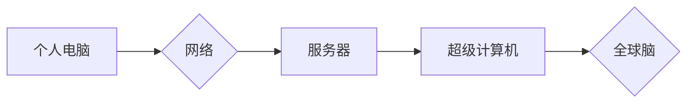

                 

## 全球脑与全球经济:集体智慧驱动的财富共享

> 关键词：全球脑、集体智慧、人工智能、分布式计算、财富共享、经济模型、算法、应用场景

## 1. 背景介绍

人类文明的发展历程，始终伴随着对智慧的追求。从古代的文字记录到现代的互联网，我们不断地探索和积累知识，并将其转化为生产力和创造力。而随着人工智能技术的飞速发展，我们正站在一个新的历史节点上，即将迎来一个全新的智慧时代——全球脑时代。

全球脑的概念最早由美国科学家约翰·塞尔曼提出，它指的是一个由全球分布的计算节点组成的超级智能网络，能够汇集和处理人类社会的所有知识和信息，并通过协同计算和智能分析，为人类社会提供前所未有的智慧服务。

全球脑的出现，将深刻地改变人类社会的面貌。它将打破地域和语言的限制，连接全球的智慧资源，促进知识共享和创新加速。同时，它也将对经济发展模式产生深远影响，推动财富的更公平共享。

## 2. 核心概念与联系

### 2.1 全球脑架构

全球脑并非一个单一的实体，而是一个由众多分散的计算节点组成的网络。这些节点可以是个人电脑、服务器、超级计算机，甚至嵌入式设备，它们通过高带宽网络连接在一起，形成一个庞大的计算平台。

**Mermaid 流程图:**



### 2.2 集体智慧

全球脑的核心价值在于其能够实现“集体智慧”。集体智慧是指通过多个个体协同合作，能够超越单个个体能力，获得更优的决策和解决方案。

在全球脑中，每个节点都拥有自己的知识和能力，通过网络连接和数据交换，这些知识和能力能够被整合和共享。通过算法和机器学习，全球脑能够从海量数据中发现隐藏的模式和规律，并将其转化为有价值的洞察和建议。

### 2.3 财富共享

全球脑的出现，将打破传统的财富分配模式，推动财富的更公平共享。

一方面，全球脑能够帮助人们更有效地利用资源，提高生产效率，创造更多的财富。

另一方面，全球脑能够促进知识和技能的共享，让更多的人能够获得教育和培训的机会，提升自身价值，参与到财富创造中。

## 3. 核心算法原理 & 具体操作步骤

### 3.1 算法原理概述

全球脑的核心算法原理是基于分布式计算和机器学习。

分布式计算是指将一个大型计算任务分解成多个子任务，并分别在不同的计算节点上执行，最终将子任务的结果汇总在一起，得到最终的计算结果。

机器学习是指通过算法训练模型，使模型能够从数据中学习，并根据学习到的知识进行预测和决策。

在全球脑中，分布式计算和机器学习相结合，能够实现海量数据的处理和分析，并从中发现隐藏的模式和规律。

### 3.2 算法步骤详解

1. **数据采集和预处理:** 从各种数据源收集数据，并进行清洗、转换和格式化，使其能够被算法处理。
2. **特征提取:** 从数据中提取具有代表性的特征，这些特征能够反映数据的本质属性。
3. **模型训练:** 使用机器学习算法训练模型，使模型能够从数据中学习，并建立预测和决策规则。
4. **模型评估和优化:** 对模型的预测结果进行评估，并根据评估结果对模型进行优化，提高模型的准确性和效率。
5. **部署和应用:** 将训练好的模型部署到全球脑网络中，并将其应用于实际场景，例如预测市场趋势、识别潜在风险、提供个性化服务等。

### 3.3 算法优缺点

**优点:**

* **高并行度:** 分布式计算能够充分利用多台计算节点的计算资源，提高计算效率。
* **可扩展性强:** 可以根据需要增加计算节点，扩展计算能力。
* **鲁棒性强:** 即使部分节点出现故障，也能保证整体系统的正常运行。

**缺点:**

* **数据同步和一致性问题:** 需要解决数据在不同节点之间的同步和一致性问题。
* **算法复杂度:** 分布式算法的开发和调试难度较高。
* **网络安全问题:** 需要确保全球脑网络的安全性和可靠性。

### 3.4 算法应用领域

全球脑的算法应用领域非常广泛，包括但不限于：

* **金融领域:** 风险管理、欺诈检测、投资决策
* **医疗领域:** 疾病诊断、药物研发、个性化医疗
* **教育领域:** 个性化学习、智能辅导、知识发现
* **交通领域:** 交通流量预测、智能导航、自动驾驶
* **能源领域:** 能源预测、智能调度、能源管理

## 4. 数学模型和公式 & 详细讲解 & 举例说明

### 4.1 数学模型构建

全球脑的运作可以抽象为一个复杂的数学模型，其中涉及到信息论、概率论、图论等多个学科。

一个基本的数学模型可以描述全球脑中的节点之间的连接关系和信息传递过程。

**节点连接矩阵:**

$$
A = \begin{bmatrix}
0 & a_{12} & a_{13} & \cdots & a_{1n} \\
a_{21} & 0 & a_{23} & \cdots & a_{2n} \\
a_{31} & a_{32} & 0 & \cdots & a_{3n} \\
\vdots & \vdots & \vdots & \ddots & \vdots \\
a_{n1} & a_{n2} & a_{n3} & \cdots & 0
\end{bmatrix}
$$

其中，$a_{ij}$ 表示节点 $i$ 和节点 $j$ 之间的连接强度。

**信息传递方程:**

$$
x_i(t+1) = f(x_i(t), \sum_{j=1}^{n} a_{ij} x_j(t))
$$

其中，$x_i(t)$ 表示节点 $i$ 在时间 $t$ 的状态，$f$ 是一个非线性函数，描述了节点的状态更新规则。

### 4.2 公式推导过程

通过对节点连接矩阵和信息传递方程的分析，我们可以推导出全球脑的整体行为模式。例如，我们可以分析节点之间的信息传播速度、信息聚合效果、以及网络的稳定性等。

### 4.3 案例分析与讲解

我们可以通过对实际案例进行分析，验证数学模型的有效性。例如，我们可以分析全球脑在预测股市趋势、识别疾病、优化交通流量等方面的应用效果。

## 5. 项目实践：代码实例和详细解释说明

### 5.1 开发环境搭建

为了实现全球脑的原型系统，我们需要搭建一个开发环境。

* **硬件:** 需要配置多台服务器或云计算节点，以提供足够的计算资源。
* **软件:** 需要安装操作系统、数据库、编程语言环境等软件。
* **网络:** 需要搭建一个高带宽、低延迟的网络，以保证节点之间的快速通信。

### 5.2 源代码详细实现

以下是一个简单的全球脑节点代码示例，使用Python语言实现：

```python
import numpy as np

class GlobalBrainNode:
    def __init__(self, id, connections):
        self.id = id
        self.connections = connections
        self.state = np.random.rand()

    def update_state(self, data):
        # 接收来自其他节点的信息
        # ...
        # 更新节点状态
        self.state = self.process_data(data)

    def process_data(self, data):
        # 对接收到的数据进行处理
        # ...
        return result

    def send_data(self, data):
        # 将处理后的数据发送给其他节点
        # ...

# 创建节点实例
node1 = GlobalBrainNode(1, connections=[2, 3])
node2 = GlobalBrainNode(2, connections=[1, 3])
node3 = GlobalBrainNode(3, connections=[1, 2])

# 模拟节点之间的通信
node1.update_state(node2.state)
node2.update_state(node1.state)
node3.update_state(node1.state, node2.state)

# 打印节点状态
print(f"Node 1 state: {node1.state}")
print(f"Node 2 state: {node2.state}")
print(f"Node 3 state: {node3.state}")
```

### 5.3 代码解读与分析

这段代码演示了全球脑节点的基本功能，包括接收数据、更新状态、处理数据、发送数据等。

* `GlobalBrainNode` 类定义了一个全球脑节点的实例，包含节点 ID、连接信息、以及当前状态。
* `update_state()` 方法模拟节点接收来自其他节点的信息，并更新自身状态。
* `process_data()` 方法模拟节点对接收到的数据进行处理，例如进行计算、分析、决策等。
* `send_data()` 方法模拟节点将处理后的数据发送给其他节点。

### 5.4 运行结果展示

运行这段代码，可以观察到节点状态的动态变化。

## 6. 实际应用场景

### 6.1 金融领域

全球脑可以应用于金融领域，例如：

* **风险管理:** 通过分析市场数据和交易记录，识别潜在的金融风险，并制定相应的风险控制策略。
* **欺诈检测:** 通过分析交易行为模式，识别异常交易，并及时进行拦截和处理。
* **投资决策:** 通过分析市场趋势和投资数据，为投资者提供个性化的投资建议。

### 6.2 医疗领域

全球脑可以应用于医疗领域，例如：

* **疾病诊断:** 通过分析患者的症状、病史、基因信息等数据，辅助医生进行疾病诊断。
* **药物研发:** 通过分析药物分子结构和生物活性数据，加速药物研发过程。
* **个性化医疗:** 通过分析患者的个体特征，提供个性化的治疗方案。

### 6.3 教育领域

全球脑可以应用于教育领域，例如：

* **个性化学习:** 根据学生的学习进度和能力，提供个性化的学习内容和学习路径。
* **智能辅导:** 通过人工智能技术，为学生提供智能化的学习辅导和答疑服务。
* **知识发现:** 通过分析海量教育资源，发现新的知识和学习模式。

### 6.4 未来应用展望

随着人工智能技术的不断发展，全球脑的应用场景将更加广泛，例如：

* **智能城市:** 建设智慧交通、智慧能源、智慧医疗等智能城市应用。
* **工业互联网:** 推动工业生产的智能化、自动化和数字化转型。
* **科学研究:** 加速科学研究的进程，解决人类面临的重大挑战。

## 7. 工具和资源推荐

### 7.1 学习资源推荐

* **书籍:**
    * 《人工智能：一种现代方法》
    * 《深度学习》
    * 《机器学习》
* **在线课程:**
    * Coursera
    * edX
    * Udacity

### 7.2 开发工具推荐

* **编程语言:** Python, Java, C++
* **机器学习框架:** TensorFlow, PyTorch, scikit-learn
* **分布式计算框架:** Apache Spark, Hadoop

### 7.3 相关论文推荐

* **《全球脑》**
* **《人工智能的未来》**
* **《分布式人工智能》**

## 8. 总结：未来发展趋势与挑战

### 8.1 研究成果总结

全球脑是一个前沿的科技概念，其研究成果将深刻地改变人类社会。

* **集体智慧的实现:** 全球脑能够实现人类智慧的集约化和放大化，推动人类文明的进步。
* **财富的更公平共享:** 全球脑能够促进知识和技能的共享，让更多的人能够参与到财富创造中。
* **解决人类面临的重大挑战:** 全球脑能够帮助人类解决气候变化、能源危机、疾病等重大挑战。

### 8.2 未来发展趋势

全球脑的未来发展趋势包括：

* **计算能力的提升:** 随着硬件技术的进步，全球脑的计算能力将得到进一步提升。
* **算法的创新:** 随着人工智能技术的进步，全球脑的算法将更加智能化和高效化。
* **应用场景的拓展:** 全球脑的应用场景将更加广泛，覆盖各个领域。

### 8.3 面临的挑战

全球脑的发展也面临着一些挑战：

* **数据安全和隐私保护:** 全球脑需要处理海量数据，如何保证数据安全和隐私保护是一个重要问题。
* **算法的透明性和可解释性:** 全球脑的算法往往是复杂的，如何提高算法的透明性和可解释性是一个挑战。
* **伦理和社会影响:** 全球脑的应用可能会带来一些伦理和社会问题，需要进行深入的思考和讨论。

### 8.4 研究展望

未来，我们需要继续深入研究全球脑的原理、算法和应用，并积极应对其带来的挑战，推动全球脑技术健康发展，为人类社会创造更加美好的未来。

## 9. 附录：常见问题与解答

**Q1: 全球脑和云计算有什么区别？**

**A1:** 云计算是指通过互联网提供计算资源、存储资源和软件服务，而全球脑则是通过分布式计算和机器学习，实现人类智慧的集约化和放大化。

**Q2: 全球脑会取代人类吗？**

**A2:** 全球脑是人类智慧的延伸，它能够帮助人类解决更复杂的问题，但不会取代人类。人类的创造力、想象力和情感是全球脑无法替代的。

**Q3: 全球脑的安全性如何保证？**

**A3:** 全球脑的安全性需要通过多方面的措施来保证，例如数据加密、身份认证、访问控制等。


作者：禅与计算机程序设计艺术 / Zen and the Art of Computer Programming 
<end_of_turn>

