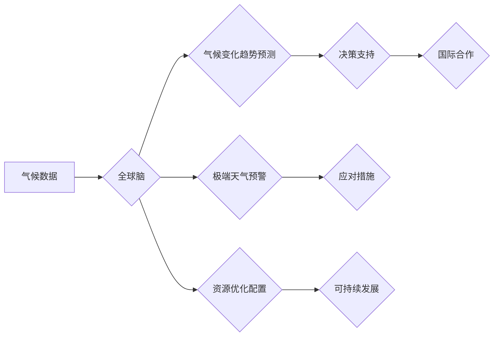

                 

## 全球脑与气候治理:集体行动的新可能性

> 关键词：全球脑、气候治理、人工智能、集体行动、数据驱动决策、可持续发展、系统性风险

## 1. 背景介绍

气候变化已成为全球面临的最严峻挑战之一，其带来的影响深刻而广泛，威胁着人类社会和生态系统的稳定。传统的气候治理模式往往局限于国家间的协商和协议，难以有效应对气候变化的复杂性和全球性。随着人工智能（AI）技术的飞速发展，全球脑的概念应运而生，为气候治理提供了新的可能性。

全球脑是指由分布式计算网络和人工智能算法组成的超级智能系统，它能够收集、分析和处理海量数据，并提供洞察力和决策支持。将全球脑应用于气候治理，可以帮助我们更好地理解气候变化的成因、趋势和影响，并制定更有效的应对策略。

## 2. 核心概念与联系

### 2.1 全球脑

全球脑是一个由分布式计算网络和人工智能算法组成的超级智能系统，其核心特征包括：

* **分布式计算:** 全球脑由众多节点组成，每个节点都拥有计算能力和数据存储能力，通过网络连接协同工作。
* **人工智能算法:** 全球脑利用各种人工智能算法，例如机器学习、深度学习和自然语言处理，对数据进行分析和处理。
* **海量数据处理:** 全球脑能够收集、存储和分析海量数据，包括气候数据、环境数据、社会经济数据等。
* **智能决策支持:** 全球脑能够根据数据分析结果，提供洞察力和决策支持，帮助人类做出更明智的决策。

### 2.2 气候治理

气候治理是指应对气候变化的综合性行动，其目标包括：

* **减缓气候变化:** 减少温室气体排放，降低全球气温升高。
* **适应气候变化:** 增强应对气候变化带来的影响的能力，例如海平面上升、极端天气等。
* **促进可持续发展:** 推动经济发展和社会进步，同时保护环境和资源。

### 2.3 连接

将全球脑应用于气候治理，可以实现以下连接：

* **数据驱动决策:** 全球脑能够收集和分析海量气候数据，为气候治理决策提供科学依据。
* **预测和预警:** 全球脑可以利用机器学习算法预测气候变化趋势和极端天气事件，为应对气候变化提供预警信息。
* **优化资源配置:** 全球脑可以帮助优化能源、水资源和土地资源的配置，提高气候治理效率。
* **促进国际合作:** 全球脑可以搭建一个共享气候数据和知识的平台，促进国际合作和共同应对气候变化。

**Mermaid 流程图**



## 3. 核心算法原理 & 具体操作步骤

### 3.1 算法原理概述

全球脑的气候治理算法主要基于以下核心算法原理：

* **机器学习:** 利用机器学习算法从海量气候数据中学习模式和规律，预测气候变化趋势和极端天气事件。
* **深度学习:** 使用深度神经网络对复杂气候系统进行建模，提高预测精度和准确性。
* **自然语言处理:** 分析气候相关文本数据，例如科学论文、新闻报道和政策文件，提取关键信息和趋势。
* **优化算法:** 优化资源配置，例如能源、水资源和土地资源，提高气候治理效率。

### 3.2 算法步骤详解

**机器学习算法步骤:**

1. **数据收集:** 收集各种气候数据，例如气温、降雨、海平面上升等。
2. **数据预处理:** 对数据进行清洗、转换和特征提取，使其适合机器学习算法训练。
3. **模型选择:** 选择合适的机器学习算法，例如线性回归、支持向量机或决策树。
4. **模型训练:** 利用训练数据训练机器学习模型，使其能够学习气候变化的模式和规律。
5. **模型评估:** 使用测试数据评估模型的预测精度和准确性。
6. **模型部署:** 将训练好的模型部署到实际应用场景中，用于预测气候变化趋势和极端天气事件。

**深度学习算法步骤:**

1. **数据收集和预处理:** 与机器学习算法类似，收集和预处理气候数据。
2. **网络结构设计:** 设计深度神经网络结构，例如卷积神经网络或循环神经网络。
3. **模型训练:** 利用训练数据训练深度神经网络模型，使其能够学习复杂气候系统。
4. **模型评估:** 使用测试数据评估模型的预测精度和准确性。
5. **模型部署:** 将训练好的模型部署到实际应用场景中，用于预测气候变化趋势和极端天气事件。

### 3.3 算法优缺点

**优点:**

* **数据驱动决策:** 基于海量数据分析，提供更科学、更精准的决策支持。
* **预测和预警:** 预测气候变化趋势和极端天气事件，帮助提前应对风险。
* **优化资源配置:** 优化能源、水资源和土地资源配置，提高气候治理效率。
* **促进国际合作:** 共享气候数据和知识，促进国际合作和共同应对气候变化。

**缺点:**

* **数据依赖:** 算法的准确性依赖于数据质量和数量。
* **算法复杂性:** 训练和部署复杂的算法需要强大的计算能力和技术 expertise。
* **伦理风险:** 数据隐私保护和算法偏见等伦理风险需要得到充分考虑。

### 3.4 算法应用领域

* **气候变化预测:** 预测全球和区域气候变化趋势，例如气温升高、海平面上升、极端天气事件等。
* **极端天气预警:** 预警强降雨、洪水、干旱、热浪等极端天气事件，帮助人们做好防范准备。
* **资源管理:** 优化能源、水资源和土地资源配置，提高气候治理效率。
* **减排策略:** 评估不同减排策略的有效性，帮助制定更有效的减排政策。
* **适应措施:** 评估不同适应措施的成本效益，帮助制定更有效的适应策略。

## 4. 数学模型和公式 & 详细讲解 & 举例说明

### 4.1 数学模型构建

气候变化是一个复杂的系统，其演化过程受多种因素影响。为了更好地理解和预测气候变化，我们可以构建数学模型来模拟气候系统。

一个常见的数学模型是气候动力学模型，它基于物理定律和数学方程，模拟大气、海洋、陆地和冰川等不同气候要素之间的相互作用。

**气候动力学模型的基本方程包括:**

* **热力学方程:** 描述能量的传递和转换。
* **动量方程:** 描述气流和海洋流动的运动规律。
* **物质守恒方程:** 描述大气成分和海洋盐度的变化。

### 4.2 公式推导过程

气候动力学模型的方程推导过程非常复杂，涉及到流体力学、热力学、海洋学等多个学科的知识。

**举例说明:**

一个简单的热力学方程可以描述大气层中温度的变化:

$$
\frac{dT}{dt} = -\frac{Q}{C_p}
$$

其中:

* $T$ 是温度
* $t$ 是时间
* $Q$ 是能量传递率
* $C_p$ 是气体比热容

这个方程表明，温度的变化率与能量传递率成反比，与气体比热容成正比。

### 4.3 案例分析与讲解

通过气候动力学模型，我们可以模拟不同情景下的气候变化，例如不同排放水平下的温室气体浓度变化、不同适应措施下的海平面上升速度等。

**案例分析:**

使用气候动力学模型模拟不同排放水平下的全球气温变化，可以得出以下结论:

* 如果全球排放继续增加，全球气温将继续升高，极端天气事件将更加频繁和严重。
* 如果全球采取积极的减排措施，可以减缓气温升高速度，降低气候变化带来的风险。

## 5. 项目实践：代码实例和详细解释说明

### 5.1 开发环境搭建

* **操作系统:** Linux 或 macOS
* **编程语言:** Python
* **深度学习框架:** TensorFlow 或 PyTorch
* **数据处理库:** Pandas 和 NumPy
* **可视化库:** Matplotlib 或 Seaborn

### 5.2 源代码详细实现

```python
# 导入必要的库
import pandas as pd
from sklearn.model_selection import train_test_split
from sklearn.linear_model import LinearRegression

# 加载气候数据
data = pd.read_csv("climate_data.csv")

# 选择特征变量和目标变量
features = ["temperature", "precipitation", "wind_speed"]
target = "sea_level_rise"

# 将数据划分为训练集和测试集
X_train, X_test, y_train, y_test = train_test_split(data[features], data[target], test_size=0.2)

# 创建线性回归模型
model = LinearRegression()

# 训练模型
model.fit(X_train, y_train)

# 评估模型性能
score = model.score(X_test, y_test)
print("模型性能:", score)

# 使用模型预测未来海平面上升
future_data = pd.DataFrame({"temperature": [25], "precipitation": [100], "wind_speed": [10]})
predicted_rise = model.predict(future_data)
print("未来海平面上升预测值:", predicted_rise)
```

### 5.3 代码解读与分析

这段代码演示了如何使用线性回归模型预测海平面上升。

1. 首先，导入必要的库。
2. 加载气候数据，并选择特征变量和目标变量。
3. 将数据划分为训练集和测试集。
4. 创建线性回归模型，并训练模型。
5. 评估模型性能，并使用模型预测未来海平面上升。

### 5.4 运行结果展示

运行结果将显示模型的性能分数和未来海平面上升的预测值。

## 6. 实际应用场景

### 6.1 气候变化预测

全球脑可以帮助预测全球和区域气候变化趋势，例如气温升高、海平面上升、极端天气事件等。

### 6.2 极端天气预警

全球脑可以预警强降雨、洪水、干旱、热浪等极端天气事件，帮助人们做好防范准备。

### 6.3 资源管理

全球脑可以优化能源、水资源和土地资源配置，提高气候治理效率。

### 6.4 未来应用展望

* **个性化气候服务:** 为个人和企业提供个性化的气候信息和建议。
* **气候风险评估:** 评估不同地区和行业的气候风险，帮助制定应对策略。
* **气候变化适应:** 帮助人们适应气候变化带来的影响，例如海平面上升和极端天气事件。

## 7. 工具和资源推荐

### 7.1 学习资源推荐

* **书籍:**

    * 《气候变化：科学、影响和解决方案》
    * 《全球变暖：人类活动与气候变化》

* **在线课程:**

    * Coursera: Climate Change
    * edX: Climate Change and Sustainability

### 7.2 开发工具推荐

* **编程语言:** Python
* **深度学习框架:** TensorFlow, PyTorch
* **数据处理库:** Pandas, NumPy
* **可视化库:** Matplotlib, Seaborn

### 7.3 相关论文推荐

* **IPCC报告:** https://www.ipcc.ch/report/ar6/wg1/
* **Nature Climate Change:** https://www.nature.com/nclimate/

## 8. 总结：未来发展趋势与挑战

### 8.1 研究成果总结

全球脑技术在气候治理领域具有巨大的潜力，可以帮助我们更好地理解和应对气候变化。

### 8.2 未来发展趋势

* **模型精度提升:** 开发更精确、更可靠的气候变化预测模型。
* **数据融合:** 将来自不同来源的数据融合在一起，构建更全面的气候模型。
* **可解释性增强:** 提高气候模型的可解释性，帮助人们更好地理解模型的预测结果。
* **应用场景拓展:** 将全球脑技术应用到更多气候治理领域，例如减排策略、适应措施等。

### 8.3 面临的挑战

* **数据质量:** 气候数据往往存在缺失、不完整和不准确等问题，需要进行有效的数据清洗和处理。
* **算法复杂性:** 训练和部署复杂的算法需要强大的计算能力和技术 expertise。
* **伦理风险:** 数据隐私保护和算法偏见等伦理风险需要得到充分考虑。

### 8.4 研究展望

未来，全球脑技术将继续发展和完善，为气候治理提供更强大的工具和支持。我们需要加强跨学科合作，攻克技术难题，并关注伦理风险，确保全球脑技术能够真正服务于人类社会和地球环境。

## 9. 附录：常见问题与解答

**Q1: 全球脑技术是否能够完全解决气候变化问题？**

**A1:** 全球脑技术可以为气候治理提供强大的工具和支持，但它不能完全解决气候变化问题。气候变化是一个复杂的全球性挑战，需要全球范围内的共同努力和行动。

**Q2: 全球脑技术的应用是否会带来新的伦理风险？**

**A2:** 全球脑技术的应用确实会带来新的伦理风险，例如数据隐私保护和算法偏见等。我们需要加强伦理研究和监管，确保全球脑技术能够安全、公平地应用于社会。


作者：禅与计算机程序设计艺术 / Zen and the Art of Computer Programming 
<end_of_turn>

