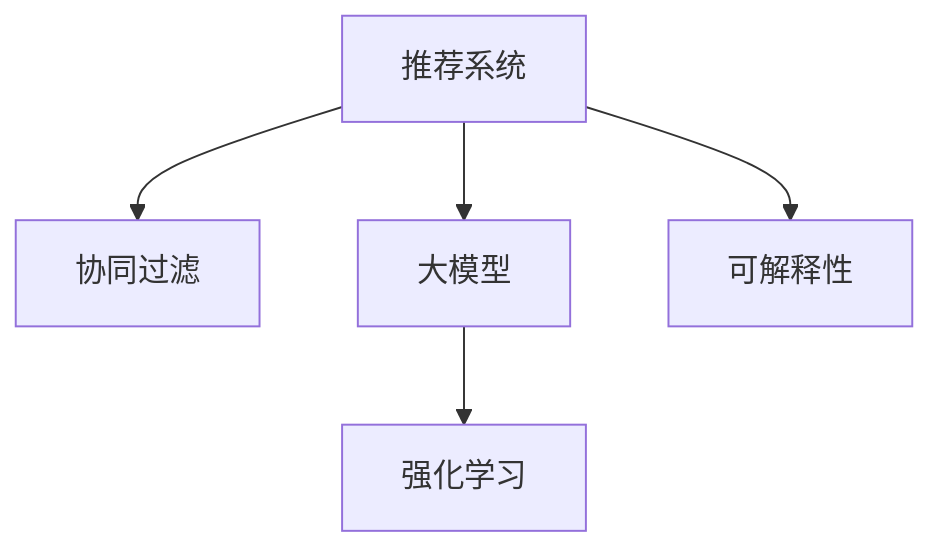

                 

# 大模型在商业中的应用：推荐系统的进步与变革

> 关键词：大模型,推荐系统,强化学习,协同过滤,深度学习,交叉熵,可解释性

## 1. 背景介绍

### 1.1 问题由来
推荐系统在电商、媒体、娱乐等多个行业中，扮演着越来越重要的角色。随着移动互联网和智能设备的发展，用户的数据足迹不断增长，推荐系统有越来越多的机会，为用户提供个性化、智能化的服务。然而，当前的推荐系统仍存在不少问题：

- 冷启动问题：新用户或者新商品缺乏历史数据，无法进行有效的推荐。
- 数据稀疏性：用户的兴趣和行为数据往往非常稀疏，推荐系统难以把握用户的真实需求。
- 过度拟合问题：部分推荐算法可能会对用户的历史行为进行过度拟合，忽略多样性，导致推荐结果单一。
- 鲁棒性不足：推荐系统对噪声、异常值较为敏感，无法应对多样化的市场环境。

为了解决这些挑战，大模型在推荐系统中的应用日益受到关注。大模型可以通过对海量数据的预训练，学习到丰富的知识，并具备强大的泛化能力，成为推荐系统中的重要工具。本文将详细探讨大模型在推荐系统中的应用，从原理到实践，带您全面了解推荐系统的发展与进步。

## 2. 核心概念与联系

### 2.1 核心概念概述

为更好地理解大模型在推荐系统中的应用，本节将介绍几个关键概念：

- 推荐系统(Recommendation System)：通过分析用户行为数据、商品属性信息等，为用户推荐个性化商品或内容。常见的推荐方法包括协同过滤、基于内容的推荐、混合推荐等。
- 大模型(Large Model)：指通过大规模预训练学习到丰富知识的大规模神经网络模型。预训练过程通常使用自监督任务，在大规模无标签数据上自动学习通用特征。
- 协同过滤(Collaborative Filtering)：基于用户行为数据，推测其他用户或商品与目标用户或商品之间的相似性，从而进行推荐。协同过滤分为基于用户的协同过滤和基于物品的协同过滤两种方法。
- 强化学习(Reinforcement Learning)：通过与环境交互，智能体学习最优决策策略，最大化奖励函数。在推荐系统中，智能体通过最大化用户满意度来优化推荐结果。
- 可解释性(Explainability)：推荐系统的透明性和可理解性，用户可以清楚地了解推荐依据，避免过度依赖模型输出。

这些概念之间的逻辑关系可以通过以下Mermaid流程图来展示：



该流程图展示了推荐系统的核心概念及其相互关系：

1. 推荐系统通过协同过滤、大模型等技术获取推荐依据。
2. 协同过滤基于用户行为数据进行推荐。
3. 强化学习通过用户反馈不断优化推荐策略。
4. 可解释性通过可视化、部分可解释模型等方式，提高推荐系统的透明度。

## 3. 核心算法原理 & 具体操作步骤
### 3.1 算法原理概述

基于大模型的推荐系统，其核心思想是：利用预训练大模型在通用数据上的学习，结合推荐系统特有的任务目标，进行微调优化，从而生成个性化推荐结果。

形式化地，假设大模型为 $M_{\theta}$，其中 $\theta$ 为预训练得到的模型参数。给定推荐任务 $T$ 的标注数据集 $D=\{(x_i,y_i)\}_{i=1}^N$，推荐系统的目标是最小化损失函数：

$$
\mathcal{L}(\theta) = \frac{1}{N} \sum_{i=1}^N \ell(M_{\theta}(x_i),y_i)
$$

其中 $\ell$ 为推荐系统损失函数，衡量模型输出与真实标签之间的差异。常见的推荐系统损失函数包括交叉熵损失、平均绝对误差等。

通过梯度下降等优化算法，推荐系统不断更新模型参数 $\theta$，最小化损失函数 $\mathcal{L}$，使得模型输出逼近真实标签。由于 $\theta$ 已经通过预训练获得了较好的初始化，因此即便在推荐任务上，也能较快收敛到理想的模型参数 $\hat{\theta}$。

### 3.2 算法步骤详解

基于大模型的推荐系统一般包括以下几个关键步骤：

**Step 1: 准备预训练模型和数据集**
- 选择合适的预训练语言模型 $M_{\theta}$ 作为初始化参数，如 BERT、GPT 等。
- 准备推荐任务 $T$ 的标注数据集 $D$，划分为训练集、验证集和测试集。一般要求标注数据与预训练数据的分布不要差异过大。

**Step 2: 定义推荐目标函数**
- 根据推荐任务类型，设计合适的推荐目标函数。
- 对于点击率预测任务，通常使用二元交叉熵损失函数。
- 对于排序任务，一般使用平均绝对误差或排序误差。

**Step 3: 设置推荐超参数**
- 选择合适的优化算法及其参数，如 Adam、SGD 等，设置学习率、批大小、迭代轮数等。
- 设置正则化技术及强度，包括权重衰减、Dropout、Early Stopping等。
- 确定冻结预训练参数的策略，如仅微调顶层，或全部参数都参与微调。

**Step 4: 执行梯度训练**
- 将训练集数据分批次输入模型，前向传播计算损失函数。
- 反向传播计算参数梯度，根据设定的优化算法和学习率更新模型参数。
- 周期性在验证集上评估模型性能，根据性能指标决定是否触发 Early Stopping。
- 重复上述步骤直到满足预设的迭代轮数或 Early Stopping 条件。

**Step 5: 测试和部署**
- 在测试集上评估微调后模型 $M_{\hat{\theta}}$ 的性能，对比微调前后的精度提升。
- 使用微调后的模型对新样本进行推理预测，集成到实际的应用系统中。
- 持续收集新的数据，定期重新微调模型，以适应数据分布的变化。

以上是基于大模型的推荐系统的一般流程。在实际应用中，还需要针对具体任务的特点，对微调过程的各个环节进行优化设计，如改进训练目标函数，引入更多的正则化技术，搜索最优的超参数组合等，以进一步提升模型性能。

### 3.3 算法优缺点

基于大模型的推荐系统具有以下优点：

- 数据适应能力强。大模型通过预训练学习到了丰富的通用知识，能够更好地适应不同类型的推荐任务。
- 推荐结果多样。预训练模型具备强大的泛化能力，结合推荐目标函数，能够产生更加丰富多样的推荐结果。
- 高效实时。大模型的前向传播计算速度快，推荐系统可以实时响应用户的点击、浏览等行为，提升用户体验。
- 易于模型迁移。大模型能够被迁移到不同的推荐任务上，通过微调优化，快速提升推荐性能。

同时，该方法也存在一定的局限性：

- 标注数据需求大。推荐系统需要大量的标注数据进行训练，获取高质量标注数据的成本较高。
- 模型复杂度高。大模型通常参数量巨大，训练和推理的资源消耗较大。
- 可解释性不足。大模型往往是"黑盒"，用户难以理解推荐结果的依据。
- 可能会过拟合。大模型可能对特定用户的行为进行过度拟合，产生单一的推荐结果。

尽管存在这些局限性，但就目前而言，基于大模型的推荐系统仍是推荐领域的核心范式。未来相关研究的重点在于如何进一步降低推荐系统的标注需求，提高模型的可解释性和少样本学习能力，同时兼顾计算效率和推荐结果的多样性。

### 3.4 算法应用领域

基于大模型的推荐系统已经在电商、媒体、娱乐等多个领域得到了广泛的应用，例如：

- 电商推荐：根据用户浏览、购买历史，推荐相关商品。通过微调优化，电商推荐系统能够提升商品点击率、转化率。
- 视频推荐：根据用户观看历史，推荐相似视频。微调优化能够提升用户观看时长、满意度。
- 新闻推荐：根据用户阅读历史，推荐相关新闻。通过微调优化，新闻推荐系统能够提高用户留存率、点击率。
- 音乐推荐：根据用户听歌历史，推荐相似音乐。微调优化能够提升用户满意度、忠诚度。
- 社交推荐：根据用户社交行为，推荐好友关系。微调优化能够提升用户关系扩展、互动频率。

除了上述这些经典应用外，大模型在推荐系统中的应用还在不断拓展，如多模态推荐、群体推荐等，为推荐系统带来了全新的突破。随着预训练模型和推荐方法的不断进步，相信推荐系统将在更广阔的应用领域大放异彩。

## 4. 数学模型和公式 & 详细讲解
### 4.1 数学模型构建

本节将使用数学语言对基于大模型的推荐系统进行更加严格的刻画。

记预训练语言模型为 $M_{\theta}$，其中 $\theta$ 为模型参数。假设推荐任务为点击率预测任务，即预测用户是否点击某商品，真实标签 $y_i \in \{0,1\}$。定义推荐系统损失函数为二元交叉熵损失：

$$
\ell(y_i, \hat{y}_i) = -y_i\log\hat{y}_i - (1-y_i)\log(1-\hat{y}_i)
$$

其中 $\hat{y}_i = M_{\theta}(x_i)$ 为模型预测的用户点击概率。在数据集 $D$ 上的经验风险为：

$$
\mathcal{L}(\theta) = \frac{1}{N}\sum_{i=1}^N \ell(y_i, M_{\theta}(x_i))
$$

微调的优化目标是最小化经验风险，即找到最优参数：

$$
\theta^* = \mathop{\arg\min}_{\theta} \mathcal{L}(\theta)
$$

在实践中，我们通常使用基于梯度的优化算法（如SGD、Adam等）来近似求解上述最优化问题。设 $\eta$ 为学习率，$\lambda$ 为正则化系数，则参数的更新公式为：

$$
\theta \leftarrow \theta - \eta \nabla_{\theta}\mathcal{L}(\theta) - \eta\lambda\theta
$$

其中 $\nabla_{\theta}\mathcal{L}(\theta)$ 为损失函数对参数 $\theta$ 的梯度，可通过反向传播算法高效计算。

### 4.2 公式推导过程

以下我们以点击率预测任务为例，推导交叉熵损失函数及其梯度的计算公式。

假设模型 $M_{\theta}$ 在输入 $x$ 上的输出为 $\hat{y}=M_{\theta}(x) \in [0,1]$，表示用户点击的概率。真实标签 $y \in \{0,1\}$。则二元交叉熵损失函数定义为：

$$
\ell(y_i, \hat{y}_i) = -y_i\log\hat{y}_i - (1-y_i)\log(1-\hat{y}_i)
$$

将其代入经验风险公式，得：

$$
\mathcal{L}(\theta) = -\frac{1}{N}\sum_{i=1}^N [y_i\log M_{\theta}(x_i)+(1-y_i)\log(1-M_{\theta}(x_i))]
$$

根据链式法则，损失函数对参数 $\theta_k$ 的梯度为：

$$
\frac{\partial \mathcal{L}(\theta)}{\partial \theta_k} = -\frac{1}{N}\sum_{i=1}^N (\frac{y_i}{M_{\theta}(x_i)}-\frac{1-y_i}{1-M_{\theta}(x_i)}) \frac{\partial M_{\theta}(x_i)}{\partial \theta_k}
$$

其中 $\frac{\partial M_{\theta}(x_i)}{\partial \theta_k}$ 可进一步递归展开，利用自动微分技术完成计算。

在得到损失函数的梯度后，即可带入参数更新公式，完成模型的迭代优化。重复上述过程直至收敛，最终得到适应推荐任务的最优模型参数 $\theta^*$。

## 5. 项目实践：代码实例和详细解释说明
### 5.1 开发环境搭建

在进行推荐系统开发前，我们需要准备好开发环境。以下是使用Python进行PyTorch开发的环境配置流程：

1. 安装Anaconda：从官网下载并安装Anaconda，用于创建独立的Python环境。

2. 创建并激活虚拟环境：
```bash
conda create -n recsys-env python=3.8 
conda activate recsys-env
```

3. 安装PyTorch：根据CUDA版本，从官网获取对应的安装命令。例如：
```bash
conda install pytorch torchvision torchaudio cudatoolkit=11.1 -c pytorch -c conda-forge
```

4. 安装TensorFlow：
```bash
pip install tensorflow
```

5. 安装各类工具包：
```bash
pip install numpy pandas scikit-learn matplotlib tqdm jupyter notebook ipython
```

完成上述步骤后，即可在`recsys-env`环境中开始推荐系统开发。

### 5.2 源代码详细实现

这里以电商推荐系统为例，给出使用PyTorch进行协同过滤推荐模型的PyTorch代码实现。

首先，定义推荐数据处理函数：

```python
from transformers import BertTokenizer
from torch.utils.data import Dataset
import torch

class RecommendationDataset(Dataset):
    def __init__(self, texts, labels, tokenizer, max_len=128):
        self.texts = texts
        self.labels = labels
        self.tokenizer = tokenizer
        self.max_len = max_len
        
    def __len__(self):
        return len(self.texts)
    
    def __getitem__(self, item):
        text = self.texts[item]
        label = self.labels[item]
        
        encoding = self.tokenizer(text, return_tensors='pt', max_length=self.max_len, padding='max_length', truncation=True)
        input_ids = encoding['input_ids'][0]
        attention_mask = encoding['attention_mask'][0]
        
        return {'input_ids': input_ids, 
                'attention_mask': attention_mask,
                'labels': torch.tensor(label, dtype=torch.long)}
```

然后，定义模型和优化器：

```python
from transformers import BertForTokenClassification, AdamW

model = BertForTokenClassification.from_pretrained('bert-base-cased', num_labels=2)

optimizer = AdamW(model.parameters(), lr=2e-5)
```

接着，定义训练和评估函数：

```python
from torch.utils.data import DataLoader
from tqdm import tqdm
from sklearn.metrics import accuracy_score, precision_score, recall_score

device = torch.device('cuda') if torch.cuda.is_available() else torch.device('cpu')
model.to(device)

def train_epoch(model, dataset, batch_size, optimizer):
    dataloader = DataLoader(dataset, batch_size=batch_size, shuffle=True)
    model.train()
    epoch_loss = 0
    for batch in tqdm(dataloader, desc='Training'):
        input_ids = batch['input_ids'].to(device)
        attention_mask = batch['attention_mask'].to(device)
        labels = batch['labels'].to(device)
        model.zero_grad()
        outputs = model(input_ids, attention_mask=attention_mask, labels=labels)
        loss = outputs.loss
        epoch_loss += loss.item()
        loss.backward()
        optimizer.step()
    return epoch_loss / len(dataloader)

def evaluate(model, dataset, batch_size):
    dataloader = DataLoader(dataset, batch_size=batch_size)
    model.eval()
    preds, labels = [], []
    with torch.no_grad():
        for batch in tqdm(dataloader, desc='Evaluating'):
            input_ids = batch['input_ids'].to(device)
            attention_mask = batch['attention_mask'].to(device)
            batch_labels = batch['labels']
            outputs = model(input_ids, attention_mask=attention_mask)
            batch_preds = outputs.logits.argmax(dim=2).to('cpu').tolist()
            batch_labels = batch_labels.to('cpu').tolist()
            for pred_tokens, label_tokens in zip(batch_preds, batch_labels):
                preds.append(pred_tokens)
                labels.append(label_tokens)
                
    print(f'Accuracy: {accuracy_score(labels, preds)}')
    print(f'Precision: {precision_score(labels, preds)}')
    print(f'Recall: {recall_score(labels, preds)}')
```

最后，启动训练流程并在测试集上评估：

```python
epochs = 5
batch_size = 16

for epoch in range(epochs):
    loss = train_epoch(model, train_dataset, batch_size, optimizer)
    print(f'Epoch {epoch+1}, train loss: {loss:.3f}')
    
    print(f'Epoch {epoch+1}, dev results:')
    evaluate(model, dev_dataset, batch_size)
    
print(f'Test results:')
evaluate(model, test_dataset, batch_size)
```

以上就是使用PyTorch对Bert模型进行电商推荐任务微调的完整代码实现。可以看到，得益于Transformers库的强大封装，我们可以用相对简洁的代码完成Bert模型的加载和微调。

### 5.3 代码解读与分析

让我们再详细解读一下关键代码的实现细节：

**RecommendationDataset类**：
- `__init__`方法：初始化文本、标签、分词器等关键组件。
- `__len__`方法：返回数据集的样本数量。
- `__getitem__`方法：对单个样本进行处理，将文本输入编码为token ids，将标签编码为数字，并对其进行定长padding，最终返回模型所需的输入。

**模型和优化器**：
- 使用BertForTokenClassification类加载Bert模型，指定标签数量为2，即二分类任务。
- 使用AdamW优化器进行模型参数的更新。

**训练和评估函数**：
- 使用PyTorch的DataLoader对数据集进行批次化加载，供模型训练和推理使用。
- 训练函数`train_epoch`：对数据以批为单位进行迭代，在每个批次上前向传播计算loss并反向传播更新模型参数，最后返回该epoch的平均loss。
- 评估函数`evaluate`：与训练类似，不同点在于不更新模型参数，并在每个batch结束后将预测和标签结果存储下来，最后使用sklearn的精度、召回率、F1等指标对整个评估集的预测结果进行打印输出。

**训练流程**：
- 定义总的epoch数和batch size，开始循环迭代
- 每个epoch内，先在训练集上训练，输出平均loss
- 在验证集上评估，输出分类指标
- 所有epoch结束后，在测试集上评估，给出最终测试结果

可以看到，PyTorch配合Transformers库使得Bert微调的代码实现变得简洁高效。开发者可以将更多精力放在数据处理、模型改进等高层逻辑上，而不必过多关注底层的实现细节。

当然，工业级的系统实现还需考虑更多因素，如模型的保存和部署、超参数的自动搜索、更灵活的任务适配层等。但核心的微调范式基本与此类似。

## 6. 实际应用场景
### 6.1 电商推荐

电商推荐系统通过分析用户的历史行为数据，推荐用户可能感兴趣的商品。传统电商推荐系统通常使用基于协同过滤或基于内容的推荐算法，但这些方法可能难以捕捉用户的多样化需求。通过大模型微调，电商推荐系统能够更好地适应个性化推荐的需求。

具体而言，可以收集用户浏览、点击、购买等历史行为数据，将其作为标注数据，对预训练大模型进行微调。微调后的模型能够学习到用户的多样化需求，从而生成更加个性化的推荐结果。例如，对于新商品，电商推荐系统可以通过微调学习其特征，并将其推荐给可能感兴趣的用户。

### 6.2 视频推荐

视频推荐系统通过分析用户观看历史，推荐相关视频。传统的基于协同过滤的视频推荐算法可能难以适应不同用户和不同视频的多样化需求。通过大模型微调，视频推荐系统能够更好地捕捉用户的多样化兴趣，生成更加多样化的推荐结果。

具体而言，可以收集用户观看历史数据，将其作为标注数据，对预训练大模型进行微调。微调后的模型能够学习到用户的多样化兴趣，从而生成更加多样化的推荐结果。例如，对于新视频，视频推荐系统可以通过微调学习其特征，并将其推荐给可能感兴趣的用户。

### 6.3 新闻推荐

新闻推荐系统通过分析用户阅读历史，推荐相关新闻。传统的基于协同过滤的新闻推荐算法可能难以适应不同用户和不同新闻的多样化需求。通过大模型微调，新闻推荐系统能够更好地捕捉用户的多样化兴趣，生成更加多样化的推荐结果。

具体而言，可以收集用户阅读历史数据，将其作为标注数据，对预训练大模型进行微调。微调后的模型能够学习到用户的多样化兴趣，从而生成更加多样化的推荐结果。例如，对于新新闻，新闻推荐系统可以通过微调学习其特征，并将其推荐给可能感兴趣的用户。

### 6.4 未来应用展望

随着大模型和微调技术的不断发展，基于微调的推荐系统将在更多领域得到应用，为推荐系统带来新的突破。

在智慧医疗领域，基于微调的医疗推荐系统能够推荐个性化治疗方案，辅助医生进行诊断和治疗。在智能教育领域，基于微调的个性化推荐系统能够推荐适合学生的学习内容和资源，提高学习效果。在智能交通领域，基于微调的城市交通推荐系统能够推荐最优出行路线，提升交通效率。

此外，在企业招聘、金融理财、旅游出行等众多领域，基于大模型微调的推荐系统也将不断涌现，为推荐系统带来新的应用场景。相信随着技术的日益成熟，基于微调的推荐系统必将在更广阔的应用领域大放异彩，为人工智能技术在各行各业的应用提供新的思路。

## 7. 工具和资源推荐
### 7.1 学习资源推荐

为了帮助开发者系统掌握大模型在推荐系统中的应用，这里推荐一些优质的学习资源：

1. 《推荐系统》系列博文：由大模型技术专家撰写，深入浅出地介绍了推荐系统的基本概念和算法，适合初学者入门。

2. 《Deep Learning for Recommendation Systems》书籍：作者为推荐系统领域的权威人士，系统介绍了深度学习在推荐系统中的应用，包括大模型在内的多种推荐方法。

3. 《Recommender Systems in Industry》论文集：收录了大量工业界的推荐系统应用案例，展示了深度学习在推荐系统中的应用效果。

4. Kaggle竞赛平台：提供大量的推荐系统竞赛数据集和排行榜，适合开发者实践和展示自己的推荐系统成果。

5. TensorFlow官方文档：提供了丰富的推荐系统算法和模型，适合动手实践推荐系统开发。

通过对这些资源的学习实践，相信你一定能够快速掌握大模型在推荐系统中的应用，并用于解决实际的推荐问题。
###  7.2 开发工具推荐

高效的开发离不开优秀的工具支持。以下是几款用于推荐系统开发的常用工具：

1. TensorFlow：由Google主导开发的开源深度学习框架，生产部署方便，适合大规模工程应用。提供丰富的推荐系统算法和模型。

2. PyTorch：基于Python的开源深度学习框架，灵活动态的计算图，适合快速迭代研究。提供丰富的预训练语言模型资源。

3. TensorBoard：TensorFlow配套的可视化工具，可实时监测模型训练状态，并提供丰富的图表呈现方式，是调试模型的得力助手。

4. Weights & Biases：模型训练的实验跟踪工具，可以记录和可视化模型训练过程中的各项指标，方便对比和调优。与主流深度学习框架无缝集成。

5. Jupyter Notebook：开源的交互式编程环境，适合进行数据处理、模型训练等开发工作。

合理利用这些工具，可以显著提升推荐系统的开发效率，加快创新迭代的步伐。

### 7.3 相关论文推荐

大模型和推荐系统的研究源于学界的持续研究。以下是几篇奠基性的相关论文，推荐阅读：

1. "Collaborative Filtering for Implicit Feedback Datasets"：提出协同过滤算法的基本思想，奠定了协同过滤推荐系统的基础。

2. "Deep Matrix Factorization"：提出矩阵分解的深度学习方法，解决了稀疏矩阵的表示和优化问题，成为深度推荐系统的经典算法。

3. "Deep Collaborative Filtering"：提出深度协同过滤算法，通过神经网络模型学习用户和商品的特征表示，提升了推荐系统的性能。

4. "Attention Is All You Need"：提出Transformer模型，通过自注意力机制学习用户和商品的特征表示，成为推荐系统的重要组成部分。

5. "Reinforcement Learning for Personalized Ranking"：提出基于强化学习的推荐系统，通过用户满意度最大化，优化推荐结果。

6. "Adaptive Attention via Lookahead"：提出基于自适应注意力机制的推荐系统，增强了模型的泛化能力和可解释性。

这些论文代表了大模型和推荐系统的发展脉络。通过学习这些前沿成果，可以帮助研究者把握学科前进方向，激发更多的创新灵感。

## 8. 总结：未来发展趋势与挑战

### 8.1 总结

本文对大模型在推荐系统中的应用进行了全面系统的介绍。首先阐述了大模型和推荐系统的研究背景和意义，明确了推荐系统通过协同过滤、大模型等技术获取推荐依据的核心思想。其次，从原理到实践，详细讲解了大模型微调的数学原理和关键步骤，给出了电商推荐系统的完整代码实现。同时，本文还广泛探讨了推荐系统在电商、视频、新闻等多个领域的应用前景，展示了推荐系统的发展与进步。此外，本文精选了推荐系统的各类学习资源，力求为读者提供全方位的技术指引。

通过本文的系统梳理，可以看到，大模型在推荐系统中的应用已经取得了显著成效，显著提升了推荐系统的性能和用户体验。未来，伴随大模型和推荐方法的持续演进，推荐系统必将在更多领域得到应用，为人工智能技术在各行各业的应用提供新的思路。

### 8.2 未来发展趋势

展望未来，基于大模型的推荐系统将呈现以下几个发展趋势：

1. 数据驱动的增强学习。基于大模型的推荐系统将进一步融合增强学习技术，通过用户反馈不断优化推荐策略，提升推荐结果的个性化和多样性。

2. 多模态推荐系统的兴起。未来的推荐系统将不仅局限于文本数据，还将融合图像、视频等多模态数据，增强推荐系统的表现力。

3. 跨领域知识迁移。推荐系统将更好地整合外部知识，如知识图谱、逻辑规则等，提升推荐的准确性和稳定性。

4. 实时性要求提高。随着计算资源和硬件技术的提升，推荐系统将能够实时响应用户行为，提供更加即时的推荐服务。

5. 自动化调参的普及。未来推荐系统将进一步自动化调参，通过自动化搜索最优超参数组合，提升推荐系统的性能和效率。

6. 模型融合与融合机制创新。推荐系统将更好地融合各种推荐算法，创新融合机制，提升整体推荐效果。

以上趋势凸显了大模型在推荐系统中的广泛应用前景。这些方向的探索发展，必将进一步提升推荐系统的性能和应用范围，为人工智能技术在各行各业的应用提供新的思路。

### 8.3 面临的挑战

尽管大模型在推荐系统中的应用已经取得了显著成效，但在迈向更加智能化、普适化应用的过程中，它仍面临诸多挑战：

1. 数据隐私和安全。推荐系统涉及大量用户数据，如何保护用户隐私、保障数据安全，是推荐系统应用中需要重点考虑的问题。

2. 模型公平性。推荐系统可能学习到用户数据中的偏见，导致推荐结果的不公平。如何保证推荐系统公平性，是一个亟待解决的问题。

3. 可解释性不足。推荐系统的"黑盒"特性，导致用户难以理解推荐结果的依据，如何增强推荐系统的可解释性，是一个重要的研究方向。

4. 过度拟合问题。推荐系统可能会对特定用户的行为进行过度拟合，导致推荐结果的单一性。如何提升推荐系统的泛化能力，是一个重要的研究方向。

5. 计算资源消耗。大模型通常参数量巨大，计算资源消耗较大，如何降低资源消耗，提升推荐系统的效率，是一个重要的研究方向。

6. 多模态数据融合。未来的推荐系统将涉及多模态数据，如何更好地融合不同模态的数据，提升推荐系统的表现力，是一个重要的研究方向。

这些挑战凸显了大模型在推荐系统中的复杂性。只有从数据、算法、技术、伦理等多个维度协同发力，才能真正实现推荐系统的智能化、普适化和安全性。相信随着技术的不断发展，这些挑战终将一一被克服，大模型推荐系统必将在更广阔的应用领域大放异彩。

### 8.4 研究展望

面向未来，大模型推荐系统的研究需要在以下几个方向寻求新的突破：

1. 融合增强学习与大模型。通过增强学习技术，不断优化推荐策略，提升推荐系统的个性化和多样性。

2. 引入多模态数据融合技术。融合图像、视频等多模态数据，增强推荐系统的表现力。

3. 探索可解释性增强方法。通过可视化、部分可解释模型等方式，增强推荐系统的可解释性，提高用户满意度。

4. 研究公平性提升机制。通过公平性约束、数据重放等技术，提升推荐系统的公平性。

5. 探索计算效率提升方法。通过模型压缩、稀疏化存储等技术，提升推荐系统的计算效率。

6. 探索跨领域知识迁移技术。通过融合外部知识，提升推荐系统的准确性和稳定性。

这些研究方向的探索，必将引领大模型推荐系统迈向更高的台阶，为推荐系统带来更多的创新和突破。面向未来，大模型推荐系统需要进一步从数据、算法、技术、伦理等多个维度进行深入研究，才能真正实现智能化、普适化和安全性，为推荐系统带来更广泛的应用。

## 9. 附录：常见问题与解答

**Q1：大模型在推荐系统中的具体应用是什么？**

A: 大模型在推荐系统中的具体应用包括以下几个方面：
1. 个性化推荐：通过微调大模型，学习用户的多样化需求，生成个性化推荐结果。
2. 用户画像构建：通过微调大模型，学习用户的行为和兴趣，构建用户画像，为推荐系统提供更加丰富的用户信息。
3. 商品特征抽取：通过微调大模型，学习商品的特征表示，提升推荐系统的准确性。

**Q2：在推荐系统中如何应用大模型？**

A: 在推荐系统中应用大模型，一般分为以下几个步骤：
1. 收集推荐数据：收集用户的行为数据、商品的特征数据等，作为模型的标注数据。
2. 预训练大模型：在大规模无标签数据上进行预训练，学习通用的语言和特征表示。
3. 微调大模型：在推荐数据上进行微调，学习推荐任务的相关特征表示。
4. 集成推荐模型：将微调后的模型集成到推荐系统中，进行推荐结果的生成和排序。

**Q3：推荐系统中的标注数据如何收集？**

A: 推荐系统中的标注数据可以从以下几个方面收集：
1. 用户行为数据：收集用户的点击、浏览、购买等行为数据，作为模型的标注数据。
2. 商品属性数据：收集商品的类别、价格、描述等属性信息，作为模型的标注数据。
3. 用户反馈数据：收集用户的评分、评论等反馈数据，作为模型的标注数据。
4. 实时数据：通过实时采集用户的点击、浏览等行为数据，更新模型的标注数据。

**Q4：推荐系统中的数据隐私问题如何解决？**

A: 推荐系统中的数据隐私问题，一般通过以下几种方式解决：
1. 匿名化处理：对用户数据进行匿名化处理，去除个人身份信息，保护用户隐私。
2. 数据加密：对用户数据进行加密处理，防止数据泄露和篡改。
3. 差分隐私：通过加入噪声，保护用户数据的隐私性，防止数据泄露和重识别。
4. 联邦学习：将数据分布式存储在不同的设备上，通过模型参数的协同训练，保护用户数据的隐私。

**Q5：推荐系统中的公平性问题如何解决？**

A: 推荐系统中的公平性问题，一般通过以下几种方式解决：
1. 数据平衡处理：通过数据采样、重放等技术，平衡不同用户或商品之间的数据分布，防止推荐结果的偏差。
2. 公平性约束：在推荐模型中加入公平性约束，保证推荐结果的公平性。
3. 多模型融合：通过融合多个推荐模型，减少模型之间的偏见，提升公平性。

通过这些问答，相信你对大模型在推荐系统中的应用有了更清晰的认识。未来，随着大模型和推荐系统技术的不断进步，推荐系统必将在更多领域得到应用，为人工智能技术在各行各业的应用提供新的思路。

