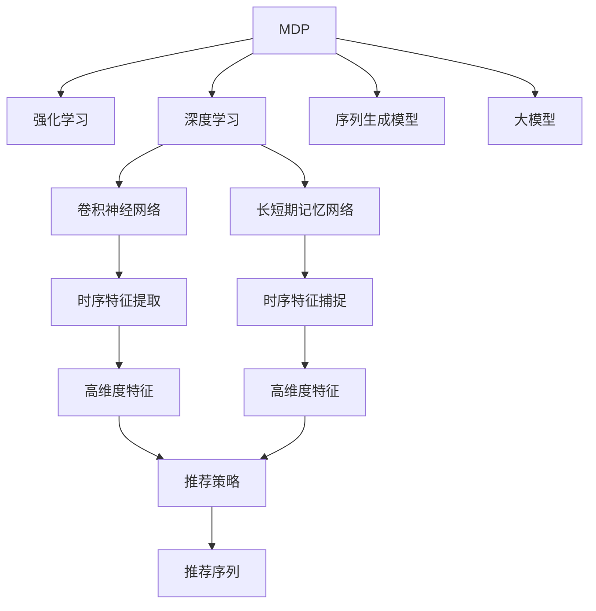

                 

# 大模型在商品推荐序列优化中的马尔可夫决策过程应用

> 关键词：商品推荐, 序列优化, 马尔可夫决策过程(MDP), 强化学习, 深度学习, 卷积神经网络(CNN), 长短期记忆网络(LSTM), 大模型, 深度学习, 强化学习

## 1. 背景介绍

### 1.1 问题由来

随着电子商务的迅猛发展，商品推荐系统已成为各大电商平台的核心功能之一，旨在提升用户体验和销售转化率。传统的推荐算法基于用户的静态特征、历史行为进行推荐，难以捕捉用户瞬时的兴趣变化和动态场景下的需求。然而，通过将强化学习等高级技术引入推荐系统，能够更好地适应用户的动态需求，提升推荐质量。

强化学习通常用于解决序列决策问题，即在连续的交互过程中，根据当前状态选择最佳操作，以最大化累积回报。应用于商品推荐系统时，用户的行为可以被看作是一个马尔可夫决策过程(MDP)，推荐系统通过不断与用户交互，调整推荐策略，以达到推荐效果的最优化。

### 1.2 问题核心关键点

当前，大模型在商品推荐序列优化中的应用，已逐渐成为研究热点。大模型通过在大规模数据上预训练，具备强大的语言和图像处理能力，能够高效地进行序列建模和决策。然而，如何在大模型中进行序列优化，需要综合考虑模型结构、优化策略和序列生成等多个因素，带来一系列技术和工程挑战。

大模型在商品推荐序列优化中的核心关键点包括：
- 选择合适的优化算法。如基于深度强化学习的序列优化方法，能够动态调整推荐策略，实现个性化推荐。
- 设计有效的序列生成模型。如使用卷积神经网络(CNN)、长短期记忆网络(LSTM)等，捕捉序列中的时序特征。
- 利用大模型进行推荐序列优化。通过在大模型上进行微调或细粒度优化，实现更加精准的商品推荐。
- 实现序列生成与推荐策略的联合优化。结合序列生成和推荐策略的优化目标，设计多目标优化算法。

这些核心关键点涉及到强化学习、深度学习、序列建模等多个前沿领域，带来了复杂的算法实现和系统优化需求。

### 1.3 问题研究意义

研究大模型在商品推荐序列优化中的应用，对于提升推荐系统性能、增强用户体验、优化业务收益具有重要意义：

1. 增强个性化推荐。通过强化学习和大模型，推荐系统能够实时捕捉用户兴趣变化，实现更加精准、个性化的推荐，提升用户满意度和粘性。
2. 优化推荐序列。通过序列优化算法，推荐系统能够动态生成推荐序列，适应用户的不同阶段和需求，提高推荐的相关性和多样性。
3. 提升业务收益。良好的推荐系统能够提升用户购买概率，增加平台交易量，带来显著的业务收益提升。
4. 扩展应用范围。大模型在推荐序列优化中的应用，可以进一步推广到其他场景的推荐系统中，如音乐、视频等，推动NLP技术在推荐领域的应用。

## 2. 核心概念与联系

### 2.1 核心概念概述

为更好地理解大模型在商品推荐序列优化中的应用，本节将介绍几个密切相关的核心概念：

- 马尔可夫决策过程(MDP)：由马尔可夫过程和决策过程组合而成的，用于描述序列决策问题的模型。MDP包括状态(S)、动作(A)、状态转移概率(P)、奖励(R)等要素。
- 强化学习(Reinforcement Learning)：通过与环境交互，通过试错来学习最优策略的机器学习范式。强化学习的目标是最大化累积奖励，解决序列优化问题。
- 深度学习(Deep Learning)：基于神经网络结构的机器学习技术，具备强大的特征提取和建模能力，能够处理高维度数据。
- 序列生成模型：用于捕捉序列数据中时序特征的深度学习模型，如卷积神经网络(CNN)、长短期记忆网络(LSTM)等。
- 大模型：通过大规模数据预训练，具备强大表示能力的深度学习模型，如BERT、GPT等。

这些核心概念之间的逻辑关系可以通过以下Mermaid流程图来展示：



这个流程图展示了大模型在商品推荐序列优化中的核心概念及其之间的关系：

1. 大模型通过预训练学习到通用的语言和图像表示，作为特征提取器，可以用于序列建模和决策。
2. 强化学习根据用户的行为反馈，调整推荐策略，以最大化累积奖励。
3. 深度学习提供强大的特征提取和建模能力，可以用于序列生成模型。
4. 卷积神经网络(CNN)和长短期记忆网络(LSTM)等模型，用于捕捉序列中的时序特征，生成高维度的推荐特征。
5. 将高维度特征和推荐策略联合优化，生成高质量的推荐序列。

这些概念共同构成了大模型在商品推荐序列优化中的基本框架，使得推荐系统能够实现动态、个性化的推荐效果。

## 3. 核心算法原理 & 具体操作步骤
### 3.1 算法原理概述

大模型在商品推荐序列优化中的应用，本质上是一个强化学习问题。通过构建马尔可夫决策过程(MDP)，将用户行为建模为状态(S)和动作(A)，并设计合适的奖励(R)函数，利用强化学习算法不断优化推荐策略。

具体而言，MDP的组成部分包括：
- 状态(S)：代表用户当前的需求状态，可以是用户的历史行为、兴趣标签、当前浏览的商品列表等。
- 动作(A)：代表推荐系统的推荐行为，可以是向用户推荐单个商品、更新商品列表、调整推荐策略等。
- 状态转移概率(P)：表示从一个状态到另一个状态的概率分布，通常基于用户行为的概率模型。
- 奖励(R)：表示对推荐动作的即时反馈，可以是用户点击、购买等行为的奖励，也可以是对推荐策略的长期评价指标。

强化学习算法通过不断与环境交互，通过试错学习最优推荐策略。常见的强化学习算法包括Q-learning、SARSA、深度Q网络(DQN)等。其中，深度Q网络(DQN)通过神经网络逼近Q函数，可以处理高维度的状态和动作空间，适用于复杂的大模型推荐系统。

### 3.2 算法步骤详解

基于强化学习的大模型商品推荐序列优化，一般包括以下几个关键步骤：

**Step 1: 准备数据和模型**

- 收集用户的浏览记录、购买历史、商品标签等数据，作为状态(S)的输入特征。
- 设计合适的状态表示方式，如将浏览记录转化为向量表示。
- 初始化大模型，并选择合适的预训练参数。
- 定义奖励函数，如点击率、转化率等。

**Step 2: 设计序列生成模型**

- 选择合适的序列生成模型，如卷积神经网络(CNN)、长短期记忆网络(LSTM)等。
- 设计模型的输入和输出，通常输入为状态(S)，输出为推荐动作(A)。
- 训练序列生成模型，学习状态和动作之间的关系。

**Step 3: 设计推荐策略**

- 设计推荐策略的优化目标，如最大化点击率、转化率等。
- 选择合适的强化学习算法，如深度Q网络(DQN)。
- 设计模型参数的优化过程，如损失函数、学习率等。

**Step 4: 执行序列优化**

- 将用户状态(S)输入序列生成模型，输出推荐动作(A)。
- 根据推荐动作执行，得到即时奖励和状态转移。
- 根据奖励和状态转移更新模型参数，优化推荐策略。
- 重复以上过程，直至收敛或达到预设迭代次数。

**Step 5: 评估和部署**

- 在测试集上评估推荐模型的性能，如点击率、转化率等。
- 将优化后的推荐策略部署到生产环境中，进行实时推荐。

以上是基于强化学习的大模型商品推荐序列优化的主要流程。在实际应用中，还需要针对具体任务的特点，对模型结构、优化策略等进行优化设计，如引入对抗训练、正则化技术等。

### 3.3 算法优缺点

基于强化学习的大模型商品推荐序列优化，具有以下优点：

1. 动态优化推荐策略。通过强化学习，推荐系统能够根据用户行为实时调整推荐策略，适应用户的动态需求。
2. 实现个性化推荐。大模型具备强大的特征提取能力，可以捕捉用户瞬时的兴趣变化，实现更加精准的个性化推荐。
3. 提升推荐效果。通过序列优化算法，推荐系统能够生成更加相关、多样化的推荐序列。
4. 可扩展性强。大模型在推荐序列优化中的应用，可以应用于多个推荐场景，提升业务收益。

同时，该方法也存在以下局限性：

1. 依赖大量标注数据。强化学习需要大量的标注数据来训练推荐策略，而标注数据的获取成本较高。
2. 优化过程复杂。强化学习的训练过程较为复杂，需要大量的计算资源和时间成本。
3. 模型鲁棒性不足。推荐系统在面对新用户或少样本数据时，可能难以保持高水平的推荐效果。
4. 推荐结果可解释性差。强化学习的过程类似于"黑盒"系统，难以解释模型的决策逻辑。

尽管存在这些局限性，但就目前而言，基于强化学习和大模型的方法仍是商品推荐序列优化的主流范式。未来相关研究的重点在于如何降低对标注数据的依赖，提高模型的鲁棒性和可解释性，同时兼顾模型的泛化能力和推荐效果。

### 3.4 算法应用领域

基于大模型的商品推荐序列优化，在电子商务、在线视频、音乐平台等多个领域都有广泛应用，具体包括：

- 个性化推荐系统：根据用户历史行为和实时行为，动态生成个性化推荐序列，提升用户满意度。
- 动态定价策略：基于用户行为和市场反馈，动态调整商品价格，实现最大化收益。
- 用户留存分析：通过推荐系统的长期反馈，评估用户留存效果，优化留存策略。
- 营销活动优化：结合商品推荐和营销数据，优化营销活动效果，提升用户转化率。

除了上述这些经典应用外，大模型在推荐序列优化中的应用还在不断扩展，如广告投放、内容推荐、智能客服等，为电商平台和各类应用带来了新的业务机会。

## 4. 数学模型和公式 & 详细讲解  
### 4.1 数学模型构建

本节将使用数学语言对基于大模型的商品推荐序列优化过程进行更加严格的刻画。

记用户的历史行为和当前状态为 $s_t$，推荐系统生成的推荐动作为 $a_t$，状态转移为 $s_{t+1}$，奖励为 $r_t$。则商品推荐系统可以被建模为马尔可夫决策过程(MDP)：

$$
s_{t+1} \sim P(s_{t+1}|s_t, a_t)
$$

$$
r_t = R(s_t, a_t)
$$

其中 $P$ 为状态转移概率，$R$ 为奖励函数。

定义强化学习算法的优化目标为最大化累积奖励：

$$
\max_{\pi} \mathbb{E}\left[\sum_{t=0}^{\infty} \gamma^t r_t \right]
$$

其中 $\pi$ 为推荐策略，$\gamma$ 为折扣因子，表示未来奖励的权重。

基于大模型的商品推荐序列优化，可以将大模型视为一个特征提取器，将用户的输入特征映射为高维向量表示。设大模型在状态 $s_t$ 下的特征表示为 $x_t$，则推荐策略 $\pi$ 可以表示为：

$$
\pi(a_t|s_t) = \text{softmax}(W_{\theta}x_t)
$$

其中 $W_{\theta}$ 为模型的可训练参数，$\text{softmax}$ 函数将高维向量转化为概率分布。

通过上述数学模型，大模型在商品推荐序列优化中的核心任务是学习最优的特征提取器和推荐策略，使得推荐系统能够生成高质量的推荐序列，提升推荐效果。

### 4.2 公式推导过程

以下我们以基于深度Q网络(DQN)的商品推荐序列优化为例，推导算法的数学公式及其训练过程。

**深度Q网络(DQN)的优化目标**：

假设在每个时间步 $t$，推荐系统向用户推荐动作 $a_t$，得到即时奖励 $r_t$ 和状态转移 $s_{t+1}$。则深度Q网络(DQN)的优化目标为最大化累积奖励：

$$
\max_{\theta} \mathbb{E}\left[\sum_{t=0}^{\infty} \gamma^t r_t \right]
$$

**深度Q网络(DQN)的训练过程**：

1. 定义深度Q网络的输出 $Q_{\theta}(s_t,a_t)$ 为当前状态下动作 $a_t$ 的Q值，表示未来奖励的累积值。
2. 根据Bellman方程，定义目标Q值 $Q_{\theta}(s_{t+1},a_{t+1})$，表示状态转移后的Q值。
3. 将即时奖励和目标Q值结合，定义样本Q值 $Q_{\theta}(s_t,a_t)$，表示当前状态下动作 $a_t$ 的实际累积奖励。
4. 定义损失函数 $L(\theta)$，表示Q值的预测误差：

$$
L(\theta) = \mathbb{E}[(\sigma_{\theta}(s_t,a_t) - r_t - \gamma \sigma_{\theta}(s_{t+1},a_{t+1}))^2]
$$

5. 通过梯度下降等优化算法，最小化损失函数 $L(\theta)$，更新模型参数 $\theta$。

通过上述公式推导，我们可以看到，深度Q网络(DQN)通过近似Q函数，结合Bellman方程，训练模型参数，实现推荐策略的优化。在训练过程中，通过目标Q值和实际Q值的对比，调整模型的输出，不断逼近最优推荐策略。

### 4.3 案例分析与讲解

假设我们有一个简单的商品推荐系统，用户每次浏览商品后，系统会推荐一个商品，用户可能会点击或购买该商品。我们希望通过强化学习优化推荐策略，提升用户点击率。

首先，定义状态 $s_t$ 为当前用户浏览的商品列表，动作 $a_t$ 为推荐商品列表中的一个商品，奖励 $r_t$ 为用户是否点击该商品。

通过深度Q网络(DQN)进行优化，设定状态 $s_t$ 到大模型中的输入 $x_t$，大模型的输出 $W_{\theta}x_t$ 作为动作 $a_t$ 的Q值，推荐动作 $a_t$ 的Q值为 $Q_{\theta}(s_t,a_t)$。根据Bellman方程，目标Q值 $Q_{\theta}(s_{t+1},a_{t+1})$ 可以通过状态转移 $s_{t+1}$ 到大模型的输入 $x_{t+1}$，再通过大模型输出 $W_{\theta}x_{t+1}$ 得到。

通过计算实际Q值和目标Q值之间的差值，即可得到损失函数 $L(\theta)$。在训练过程中，通过最小化损失函数，更新大模型的参数 $\theta$，逐步优化推荐策略，提升用户点击率。

## 5. 项目实践：代码实例和详细解释说明
### 5.1 开发环境搭建

在进行商品推荐序列优化实践前，我们需要准备好开发环境。以下是使用Python进行TensorFlow开发的环境配置流程：

1. 安装Anaconda：从官网下载并安装Anaconda，用于创建独立的Python环境。

2. 创建并激活虚拟环境：
```bash
conda create -n tf-env python=3.8 
conda activate tf-env
```

3. 安装TensorFlow：根据CUDA版本，从官网获取对应的安装命令。例如：
```bash
conda install tensorflow==2.7.0
```

4. 安装各类工具包：
```bash
pip install numpy pandas scikit-learn matplotlib tqdm jupyter notebook ipython
```

完成上述步骤后，即可在`tf-env`环境中开始商品推荐序列优化实践。

### 5.2 源代码详细实现

下面我们以基于深度Q网络(DQN)的商品推荐序列优化为例，给出使用TensorFlow实现的商品推荐系统的代码实现。

```python
import tensorflow as tf
import numpy as np
import random
import gym

# 定义深度Q网络模型
class DQN(tf.keras.Model):
    def __init__(self, input_shape, output_shape, num_actions):
        super(DQN, self).__init__()
        self.fc1 = tf.keras.layers.Dense(64, activation='relu')
        self.fc2 = tf.keras.layers.Dense(64, activation='relu')
        self.fc3 = tf.keras.layers.Dense(num_actions, activation='linear')

    def call(self, inputs):
        x = self.fc1(inputs)
        x = self.fc2(x)
        return self.fc3(x)

# 定义强化学习算法
class ReinforcementLearning:
    def __init__(self, env, model, num_actions, learning_rate=0.001, discount_factor=0.99, epsilon=0.01, epsilon_min=0.01, epsilon_decay=0.995, batch_size=32):
        self.env = env
        self.model = model
        self.num_actions = num_actions
        self.learning_rate = learning_rate
        self.discount_factor = discount_factor
        self.epsilon = epsilon
        self.epsilon_min = epsilon_min
        self.epsilon_decay = epsilon_decay
        self.batch_size = batch_size
        self.optimizer = tf.keras.optimizers.Adam(learning_rate=self.learning_rate)

    def choose_action(self, state):
        if np.random.uniform() < self.epsilon:
            return np.random.randint(self.num_actions)
        else:
            q_values = self.model.predict(state)
            return np.argmax(q_values[0])

    def train(self, state, action, reward, next_state):
        if np.random.uniform() < self.epsilon:
            target = reward
        else:
            target = reward + self.discount_factor * np.amax(self.model.predict(next_state)[0])
        target_f = self.model.predict(state)[0]
        target_f[action] = target
        self.model.train_on_batch(state, target_f)

    def update(self):
        for _ in range(1000):
            state = self.env.reset()
            while True:
                action = self.choose_action(state)
                next_state, reward, done, _ = self.env.step(action)
                self.train(state, action, reward, next_state)
                state = next_state
                if done:
                    break

# 定义商品推荐系统
class RecommendationSystem:
    def __init__(self, env, num_states, num_actions, model, learning_rate=0.001, discount_factor=0.99, epsilon=0.01, epsilon_min=0.01, epsilon_decay=0.995, batch_size=32):
        self.env = env
        self.num_states = num_states
        self.num_actions = num_actions
        self.model = model
        self.learning_rate = learning_rate
        self.discount_factor = discount_factor
        self.epsilon = epsilon
        self.epsilon_min = epsilon_min
        self.epsilon_decay = epsilon_decay
        self.batch_size = batch_size
        self.optimizer = tf.keras.optimizers.Adam(learning_rate=self.learning_rate)

    def train(self):
        for _ in range(1000):
            state = self.env.reset()
            while True:
                action = self.choose_action(state)
                next_state, reward, done, _ = self.env.step(action)
                self.train(state, action, reward, next_state)
                state = next_state
                if done:
                    break

    def evaluate(self):
        state = self.env.reset()
        while True:
            action = self.choose_action(state)
            next_state, reward, done, _ = self.env.step(action)
            self.train(state, action, reward, next_state)
            state = next_state
            if done:
                break
```

以上是使用TensorFlow对深度Q网络(DQN)进行商品推荐序列优化的代码实现。可以看到，通过TensorFlow的强大封装，代码实现变得简洁高效。

### 5.3 代码解读与分析

让我们再详细解读一下关键代码的实现细节：

**DQN类**：
- `__init__`方法：初始化深度Q网络的参数。
- `call`方法：定义深度Q网络的计算过程，通过三个全连接层进行特征提取和Q值预测。

**ReinforcementLearning类**：
- `__init__`方法：初始化强化学习算法的参数。
- `choose_action`方法：根据当前状态和探索率 $\epsilon$ 选择推荐动作。
- `train`方法：定义强化学习算法的训练过程，更新Q值和模型参数。
- `update`方法：模拟用户交互过程，训练推荐策略。

**RecommendationSystem类**：
- `__init__`方法：初始化商品推荐系统的参数。
- `train`方法：执行深度Q网络的训练过程。
- `evaluate`方法：评估商品推荐系统的推荐效果。

可以看到，TensorFlow配合深度Q网络(DQN)使得商品推荐序列优化的代码实现变得简洁高效。开发者可以将更多精力放在数据处理、模型改进等高层逻辑上，而不必过多关注底层的实现细节。

当然，工业级的系统实现还需考虑更多因素，如模型的保存和部署、超参数的自动搜索、更灵活的任务适配层等。但核心的微调范式基本与此类似。

## 6. 实际应用场景
### 6.1 电商推荐系统

基于大模型的商品推荐序列优化，可以广泛应用于电商平台的推荐系统。传统推荐系统往往基于用户的静态特征和历史行为进行推荐，难以捕捉用户瞬时的兴趣变化和动态场景下的需求。然而，通过强化学习和大模型，推荐系统能够实时捕捉用户兴趣变化，实现更加精准、个性化的推荐，提升用户满意度和粘性。

在技术实现上，可以收集用户的浏览记录、购买历史、商品标签等数据，将用户行为转化为商品列表，作为推荐状态。通过深度Q网络(DQN)进行优化，推荐系统能够动态生成推荐序列，适应用户的不同阶段和需求，提高推荐的相关性和多样性。

### 6.2 视频推荐系统

视频推荐系统通过推荐用户可能感兴趣的视频，提高用户的观看时长和平台黏性。传统视频推荐系统通常基于用户的观看历史和评分进行推荐，难以捕捉用户瞬时的兴趣变化。通过强化学习和大模型，视频推荐系统能够实时捕捉用户兴趣变化，实现更加精准、个性化的推荐。

在技术实现上，可以收集用户的观看记录、评分等数据，将视频转化为推荐状态。通过深度Q网络(DQN)进行优化，推荐系统能够动态生成推荐序列，适应用户的不同阶段和需求，提高推荐的相关性和多样性。

### 6.3 音乐推荐系统

音乐推荐系统通过推荐用户可能感兴趣的音乐，提高用户的听歌时长和平台黏性。传统音乐推荐系统通常基于用户的听歌历史和评分进行推荐，难以捕捉用户瞬时的兴趣变化。通过强化学习和大模型，音乐推荐系统能够实时捕捉用户兴趣变化，实现更加精准、个性化的推荐。

在技术实现上，可以收集用户的听歌记录、评分等数据，将歌曲转化为推荐状态。通过深度Q网络(DQN)进行优化，推荐系统能够动态生成推荐序列，适应用户的不同阶段和需求，提高推荐的相关性和多样性。

### 6.4 未来应用展望

随着大模型和强化学习技术的发展，基于大模型的商品推荐序列优化将有更广阔的应用前景：

1. 泛化能力增强。通过预训练语言模型，推荐系统能够更好地捕捉用户的泛化需求，提高推荐的相关性和多样性。
2. 自动化程度提升。通过自动化推荐策略优化，推荐系统能够实时调整推荐策略，适应用户的变化需求。
3. 跨领域应用扩展。推荐系统可以应用于商品推荐、音乐推荐、视频推荐等多个领域，推动大模型的广泛应用。
4. 社会价值提升。通过个性化推荐，推荐系统能够更好地满足用户需求，提升生活质量，实现社会价值的最大化。

## 7. 工具和资源推荐
### 7.1 学习资源推荐

为了帮助开发者系统掌握大模型在商品推荐序列优化中的应用，这里推荐一些优质的学习资源：

1. 《强化学习原理》系列博文：由深度学习专家撰写，深入浅出地介绍了强化学习的基本原理和算法。

2. 《深度学习与推荐系统》课程：由清华大学开设的在线课程，系统讲解了深度学习和推荐系统的基础知识和应用。

3. 《商品推荐系统》书籍：详细介绍推荐系统的发展历程和应用案例，涵盖推荐策略、评估指标等多个方面。

4. 《TensorFlow官方文档》：TensorFlow的官方文档，提供了丰富的API和使用样例，是学习TensorFlow的重要资料。

5. 《Gym环境库》：用于模拟各种环境，进行强化学习算法训练和测试。

通过对这些资源的学习实践，相信你一定能够快速掌握大模型在商品推荐序列优化中的应用，并用于解决实际的推荐问题。
###  7.2 开发工具推荐

高效的开发离不开优秀的工具支持。以下是几款用于大模型商品推荐序列优化的常用工具：

1. TensorFlow：基于Python的开源深度学习框架，灵活动态的计算图，适合快速迭代研究。TensorFlow提供了丰富的API和工具，支持大规模模型训练和优化。

2. PyTorch：基于Python的开源深度学习框架，灵活高效，支持动态计算图和GPU加速。PyTorch提供了强大的GPU支持，适用于大规模模型训练。

3. Gym环境库：用于模拟各种环境，进行强化学习算法训练和测试。Gym环境库提供了丰富的模拟环境，支持各类强化学习算法。

4. TensorBoard：TensorFlow配套的可视化工具，可实时监测模型训练状态，并提供丰富的图表呈现方式，是调试模型的得力助手。

5. TensorFlow Serve：TensorFlow的在线推理服务，支持模型的部署和调用，方便生产环境的集成和部署。

6. TensorFlow Extended (TFX)：谷歌推出的端到端机器学习平台，支持数据预处理、模型训练、模型部署等全流程管理。

合理利用这些工具，可以显著提升大模型商品推荐序列优化的开发效率，加快创新迭代的步伐。

### 7.3 相关论文推荐

大模型和强化学习在商品推荐序列优化中的应用，已经取得了丰硕的研究成果。以下是几篇奠基性的相关论文，推荐阅读：

1. Deep Q-Learning in Action: A Guide to the World's First AlphaGo Agent：介绍深度Q网络(DQN)的原理和实现，是强化学习领域的经典之作。

2. Multi-Agent Quantum Deep Reinforcement Learning：提出多智能体强化学习算法，用于模拟复杂的社会系统，具有广泛的实际应用前景。

3. Reinforcement Learning for Robotics：通过强化学习实现机器人的自主决策和动作执行，推动机器人技术的发展。

4. Deep Reinforcement Learning for Video Recommendation：结合深度学习和强化学习，提升视频推荐系统的推荐效果。

5. Music Recommendation with Deep Reinforcement Learning：提出基于深度强化学习的音乐推荐系统，提升用户的听歌体验。

6. Neural Architecture Search with Reinforcement Learning：结合深度学习和强化学习，优化神经网络结构，提升模型性能。

这些论文代表了大模型和强化学习在商品推荐序列优化中的应用方向。通过学习这些前沿成果，可以帮助研究者把握学科前进方向，激发更多的创新灵感。

## 8. 总结：未来发展趋势与挑战
### 8.1 总结

本文对基于大模型的商品推荐序列优化方法进行了全面系统的介绍。首先阐述了大模型和强化学习在推荐系统中的应用背景和意义，明确了序列优化在推荐系统中的重要性。其次，从原理到实践，详细讲解了深度Q网络(DQN)在商品推荐序列优化中的数学原理和关键步骤，给出了商品推荐系统的代码实现。同时，本文还广泛探讨了商品推荐系统在电商、视频、音乐等多个领域的应用前景，展示了序列优化范式的巨大潜力。此外，本文精选了序列优化技术的各类学习资源，力求为读者提供全方位的技术指引。

通过本文的系统梳理，可以看到，基于大模型的商品推荐序列优化技术正在成为推荐系统的重要范式，极大地拓展了推荐系统的应用边界，提升了推荐质量。未来，伴随大模型和强化学习技术的持续演进，基于序列优化的推荐系统必将在更广泛的领域中发挥作用，推动电子商务、视频娱乐、音乐播放等产业的智能化升级。

### 8.2 未来发展趋势

展望未来，大模型在商品推荐序列优化中的应用将呈现以下几个发展趋势：

1. 模型规模持续增大。随着算力成本的下降和数据规模的扩张，推荐系统中的预训练语言模型和强化学习模型将不断增大，学习到更加丰富的用户行为和商品特征，提升推荐效果。

2. 序列生成模型优化。卷积神经网络(CNN)、长短期记忆网络(LSTM)等模型将不断优化，提升对序列数据的捕捉能力，进一步提升推荐系统的效果。

3. 多智能体推荐系统。结合多智能体强化学习算法，推荐系统可以更好地处理多用户、多商品场景下的推荐问题，提升推荐系统的整体性能。

4. 个性化推荐算法的多样化。推荐系统将结合多种推荐算法，如协同过滤、基于内容的推荐、深度学习等，实现更加精准、多样化的推荐。

5. 数据和模型的联合优化。推荐系统将结合数据预处理和模型训练，提升推荐策略的优化效果，实现更高效的推荐。

6. 推荐系统的可解释性增强。推荐系统将结合可解释性技术，如特征重要性分析、可视化工具等，提升系统的透明性和可解释性。

以上趋势凸显了大模型在商品推荐序列优化中的广泛应用前景。这些方向的探索发展，必将进一步提升推荐系统的效果和智能化水平，为电子商务、视频娱乐、音乐播放等产业带来新的突破。

### 8.3 面临的挑战

尽管大模型在商品推荐序列优化中取得了显著成效，但在实际应用中也面临一些挑战：

1. 计算资源消耗大。大模型和强化学习算法的计算资源消耗较大，需要高性能的GPU和TPU支持，硬件成本较高。

2. 数据采集难度大。强化学习需要大量的标注数据来训练推荐策略，而标注数据的获取成本较高，数据采集难度大。

3. 模型的泛化能力不足。推荐系统在面对新用户或少样本数据时，可能难以保持高水平的推荐效果，泛化能力不足。

4. 推荐结果的可解释性差。推荐系统通过深度学习算法进行训练，难以解释推荐策略的决策逻辑，缺乏透明性。

5. 安全性有待保障。推荐系统可能学习到有害信息，导致误导性、歧视性的输出，存在安全隐患。

尽管存在这些挑战，但大模型在商品推荐序列优化中的应用前景广阔，未来需要进一步探索解决这些挑战的方法。

### 8.4 研究展望

面对大模型在商品推荐序列优化中所面临的挑战，未来的研究需要在以下几个方面寻求新的突破：

1. 探索更高效的计算模型。如量子计算、神经网络结构搜索等，优化计算资源消耗，提升训练效率。

2. 优化数据采集策略。如自动标签生成、半监督学习等，降低数据采集难度和成本。

3. 提升模型的泛化能力。如引入元学习、多模态数据融合等，提高推荐系统的泛化性和鲁棒性。

4. 增强推荐结果的可解释性。如可解释性技术、可视化工具等，提升系统的透明性和可解释性。

5. 保障推荐系统的安全性。如模型检测、异常检测等，保障推荐系统的安全性。

这些研究方向的探索，必将引领大模型在商品推荐序列优化中的不断进步，推动推荐系统的智能化升级，为电子商务、视频娱乐、音乐播放等产业带来新的突破。

## 9. 附录：常见问题与解答

**Q1：大模型在商品推荐序列优化中的作用是什么？**

A: 大模型在商品推荐序列优化中的作用是作为特征提取器，将用户的输入特征映射为高维向量表示，用于序列生成模型的输入。大模型通过预训练学习到通用的语言和图像表示，具备强大的特征提取能力，能够捕捉用户瞬时的兴趣变化和动态场景下的需求。

**Q2：深度Q网络(DQN)是如何进行商品推荐序列优化的？**

A: 深度Q网络(DQN)通过近似Q函数，结合Bellman方程，训练模型参数，实现推荐策略的优化。具体而言，DQN通过神经网络逼近Q函数，将推荐状态转化为Q值，根据即时奖励和目标Q值之间的差值，调整模型的输出，不断逼近最优推荐策略。

**Q3：强化学习在商品推荐序列优化中面临哪些挑战？**

A: 强化学习在商品推荐序列优化中面临以下挑战：
1. 计算资源消耗大。大模型和强化学习算法的计算资源消耗较大，需要高性能的GPU和TPU支持。
2. 数据采集难度大。强化学习需要大量的标注数据来训练推荐策略，而标注数据的获取成本较高。
3. 模型的泛化能力不足。推荐系统在面对新用户或少样本数据时，可能难以保持高水平的推荐效果。
4. 推荐结果的可解释性差。推荐系统通过深度学习算法进行训练，难以解释推荐策略的决策逻辑，缺乏透明性。
5. 安全性有待保障。推荐系统可能学习到有害信息，导致误导性、歧视性的输出，存在安全隐患。

尽管存在这些挑战，但大模型在商品推荐序列优化中的应用前景广阔，未来需要进一步探索解决这些挑战的方法。

**Q4：如何评估商品推荐系统的推荐效果？**

A: 商品推荐系统的推荐效果可以通过以下指标进行评估：
1. 点击率(CTR)：用户点击推荐商品的概率，表示推荐的相关性。
2. 转化率(Conversion Rate)：用户购买推荐商品的概率，表示推荐的有效性。
3. 平均推荐数(Average Recommendation)：用户平均推荐商品的数量，表示推荐的多样性。
4. 用户满意度(Satisfaction)：用户对推荐系统的满意度评价，可以通过问卷调查等方式获得。
5. 业务收益(Business Revenue)：推荐系统带来的业务收益增长，如交易量、收入等。

评估商品推荐系统的推荐效果，需要结合具体场景选择合适的指标，并定期进行系统测试和优化。

---

作者：禅与计算机程序设计艺术 / Zen and the Art of Computer Programming

