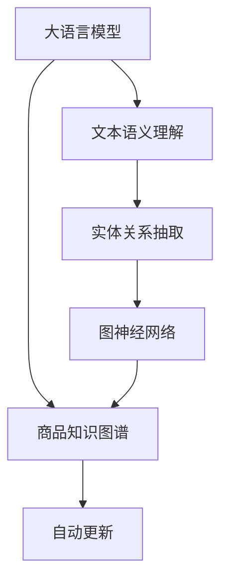

                 

# 大模型在商品知识图谱自动更新中的应用

> 关键词：大模型,商品知识图谱,自动更新,图神经网络,实体关系抽取,商品推荐

## 1. 背景介绍

### 1.1 问题由来

随着电子商务的蓬勃发展，商品知识图谱（KG）在推荐系统、搜索引擎等应用场景中扮演着越来越重要的角色。商品知识图谱包含了大量商品及其属性、关系的信息，为个性化推荐、商品搜索、价格监测等提供了丰富的数据支持。然而，商品知识图谱的构建和维护是一个复杂且耗时的过程，需要大量的人工标注和手动更新，成本高且效率低。

大语言模型和大规模预训练模型（如BERT、GPT等）近年来的迅猛发展，为解决这一问题提供了新的思路。借助大模型强大的语义理解能力，可以自动从网页、说明书、用户评论等文本数据中抽取商品信息，并更新到商品知识图谱中，从而大幅提升知识图谱的构建和维护效率。

### 1.2 问题核心关键点

大模型在商品知识图谱自动更新中的应用主要集中在以下几个方面：

- **文本语义理解**：利用大语言模型的强大语义理解能力，自动从商品相关文本数据中抽取实体信息。
- **关系抽取**：从文本中自动抽取商品间的语义关系，并将其映射为商品知识图谱中的实体关系。
- **图神经网络**：将大模型抽取的实体和关系信息输入到图神经网络中，进行知识图谱的构建和更新。
- **数据融合与整合**：整合来自不同来源的多样化数据，提升知识图谱的丰富性和准确性。

这些关键点构成了大模型在商品知识图谱自动更新中的核心应用框架，其目标是通过自动化方式提升知识图谱的构建和维护效率，同时保证其数据质量和应用效果。

## 2. 核心概念与联系

### 2.1 核心概念概述

为更好地理解大模型在商品知识图谱自动更新中的应用，本节将介绍几个密切相关的核心概念：

- **大语言模型（Large Language Model, LLM）**：以自回归（如GPT）或自编码（如BERT）模型为代表的大规模预训练语言模型。通过在大规模无标签文本数据上进行预训练，学习通用的语言表示，具备强大的语言理解和生成能力。
- **商品知识图谱（KG）**：由节点（实体）和边（关系）构成的图结构，用于表示商品及其属性和关系的信息。商品知识图谱在推荐系统、搜索引擎等应用中具有重要价值。
- **图神经网络（Graph Neural Network, GNN）**：一类专门用于处理图结构数据的深度学习模型，能够自动学习图数据的局部和全局特征，并用于预测和分类等任务。
- **实体关系抽取（Entity Relationship Extraction, ERE）**：从文本数据中自动抽取商品实体及其之间的关系，是构建商品知识图谱的重要步骤。
- **知识图谱自动更新**：通过自动抽取和更新商品信息，持续优化商品知识图谱，以应对数据变化和市场动态。

这些核心概念之间的逻辑关系可以通过以下Mermaid流程图来展示：



这个流程图展示了大模型在商品知识图谱自动更新中的核心概念及其之间的关系：

1. 大语言模型通过预训练获得语言表示能力，用于理解商品文本数据。
2. 利用文本语义理解能力，从商品相关文本中抽取实体信息。
3. 通过实体关系抽取，自动获取商品间的语义关系，并映射到知识图谱中的实体关系。
4. 将抽取的实体和关系输入图神经网络，进行知识图谱的构建和更新。
5. 商品知识图谱通过自动更新机制，不断优化和扩展。

这些概念共同构成了大模型在商品知识图谱自动更新中的关键应用逻辑。

## 3. 核心算法原理 & 具体操作步骤
### 3.1 算法原理概述

大模型在商品知识图谱自动更新中的应用，主要依赖于以下几个关键步骤：

1. **文本语义理解**：通过大语言模型，从商品描述、说明书、用户评论等文本中自动抽取商品实体和属性。
2. **实体关系抽取**：利用自然语言处理技术，从文本中自动识别商品间的语义关系，如品牌关系、价格关系等。
3. **图神经网络**：将抽取的实体和关系信息输入到图神经网络中，进行知识图谱的构建和更新。

具体而言，大模型通过预训练获得强大的语言表示能力，能够自动从文本数据中抽取有意义的实体和关系，并输入到图神经网络中进行知识图谱的构建和更新。这一过程可以分为以下步骤：

- 文本预处理：清洗和预处理商品文本数据，去除噪音和无关信息，确保后续抽取的准确性。
- 实体抽取：利用大语言模型从文本中抽取商品实体，如商品名称、品牌、型号等。
- 关系抽取：使用关系抽取模型，从文本中自动识别商品间的语义关系，如品牌-商品关系、价格-品牌关系等。
- 图神经网络建模：将抽取的实体和关系信息输入到图神经网络中，进行知识图谱的构建和更新。

### 3.2 算法步骤详解

以下是商品知识图谱自动更新的详细步骤：

**Step 1: 数据准备**
- 收集商品相关的文本数据，如商品描述、说明书、用户评论等。
- 对文本数据进行清洗和预处理，去除噪音和无关信息。

**Step 2: 实体抽取**
- 使用大语言模型，如BERT、GPT等，自动从文本中抽取商品实体，如商品名称、品牌、型号等。
- 对抽取的实体进行去重和标准化，确保数据的准确性和一致性。

**Step 3: 关系抽取**
- 使用关系抽取模型，从抽取的实体中自动识别商品间的语义关系。
- 常用的关系抽取模型包括基于规则的抽取模型、基于机器学习的抽取模型等。

**Step 4: 图神经网络建模**
- 将抽取的实体和关系信息输入到图神经网络中，进行知识图谱的构建和更新。
- 常用的图神经网络包括图卷积网络（GCN）、图注意力网络（GAT）等。

**Step 5: 图谱更新**
- 定期对图神经网络输出的知识图谱进行更新，以反映最新的市场动态和商品信息。
- 更新后的知识图谱可以用于推荐系统、搜索引擎等应用场景。

### 3.3 算法优缺点

大模型在商品知识图谱自动更新中的应用具有以下优点：

1. **效率高**：大模型能够自动从文本数据中抽取商品实体和关系，避免了人工标注的高成本和时间消耗。
2. **准确性高**：利用大语言模型和大规模预训练模型的强大语义理解能力，能够准确抽取商品实体和关系。
3. **灵活性高**：大模型能够处理多种文本数据源，整合来自不同渠道的多样化数据，构建更丰富和全面的商品知识图谱。
4. **可扩展性高**：知识图谱的自动更新机制能够持续优化和扩展，适应市场变化和新商品信息。

同时，该方法也存在一定的局限性：

1. **数据依赖性高**：大模型的性能依赖于数据的质量和数量，如果数据源存在噪音或偏差，可能导致抽取结果的不准确。
2. **计算资源需求大**：大模型的训练和推理需要大量的计算资源，可能会对硬件环境提出较高要求。
3. **模型解释性不足**：大模型的抽取过程和关系抽取模型的内部机制缺乏可解释性，难以调试和优化。
4. **领域适应性有限**：大模型的预训练数据一般来自通用的互联网数据，可能无法很好地适应特定领域的商品知识图谱构建需求。

尽管存在这些局限性，但就目前而言，大模型在商品知识图谱自动更新中的应用范式仍然具有显著的优势和广阔的应用前景。

### 3.4 算法应用领域

大模型在商品知识图谱自动更新中的应用，已经在推荐系统、商品搜索、价格监测等多个领域得到广泛应用，显著提升了这些应用的性能和用户体验。

**推荐系统**：利用商品知识图谱中的商品关系和属性信息，进行个性化推荐，提升推荐系统的准确性和多样性。

**商品搜索**：通过商品知识图谱中的商品关系和属性信息，优化搜索结果排序，提高用户搜索的准确性和便捷性。

**价格监测**：利用商品知识图谱中的商品关系和属性信息，实时监控商品价格变化，及时提供市场动态信息。

**供应链管理**：通过商品知识图谱中的供应链关系信息，优化供应链管理，提升供应链的效率和透明度。

**市场分析**：利用商品知识图谱中的市场关系信息，进行市场分析和预测，辅助决策制定。

除了上述这些经典应用外，大模型在商品知识图谱自动更新中的应用还在持续扩展，如智能客服、产品创新等，为商品知识图谱的应用带来了新的突破。

## 4. 数学模型和公式 & 详细讲解 & 举例说明
### 4.1 数学模型构建

大模型在商品知识图谱自动更新中的应用，涉及多个数学模型和计算过程。以下是主要的数学模型及其构建方法：

**1. 实体抽取模型**
- 实体抽取模型通常使用序列标注模型，如CRF、LSTM-CRF等，从文本数据中识别商品实体。
- 模型输入为文本序列，输出为每个位置的实体标签，如B（实体起始）、I（实体中间）、E（实体结束）。
- 训练过程使用最大化似然估计或交叉熵损失函数，优化模型参数。

**2. 关系抽取模型**
- 关系抽取模型通常使用关系分类模型，如Fine-grained Classification（FGC）、Label Space Annotation（LSA）等，从抽取的实体中自动识别商品间的关系。
- 模型输入为实体对序列，输出为每个关系标签。
- 训练过程使用基于分类器的损失函数，优化模型参数。

**3. 图神经网络建模**
- 图神经网络通常使用图卷积网络（GCN）或图注意力网络（GAT）等模型，进行知识图谱的构建和更新。
- 模型输入为商品实体和关系，输出为知识图谱的节点和边。
- 训练过程使用图卷积神经网络或图注意力神经网络的损失函数，优化模型参数。

### 4.2 公式推导过程

以下是实体抽取模型和关系抽取模型的推导过程：

**实体抽取模型**
- 假设文本序列为 $x = (x_1, x_2, \ldots, x_n)$，模型输出为实体标签序列 $y = (y_1, y_2, \ldots, y_n)$，其中 $y_i \in \{B, I, E\}$。
- 模型的预测概率为：
$$
p(y|x; \theta) = \prod_{i=1}^{n} p(y_i|x_i; \theta)
$$
其中 $\theta$ 为模型参数。
- 最大化似然估计的目标函数为：
$$
\max_{\theta} \mathcal{L}(y|x; \theta) = \sum_{i=1}^{n} \log p(y_i|x_i; \theta)
$$

**关系抽取模型**
- 假设实体对序列为 $o = (o_1, o_2, \ldots, o_m)$，模型输出为关系标签序列 $r = (r_1, r_2, \ldots, r_m)$，其中 $r_i \in R$。
- 模型的预测概率为：
$$
p(r|o; \theta) = \prod_{i=1}^{m} p(r_i|o_i; \theta)
$$
其中 $\theta$ 为模型参数。
- 常用的关系抽取模型包括基于CRF和LSTM-CRF的模型，推导过程类似。

### 4.3 案例分析与讲解

以商品推荐系统为例，分析大模型在商品知识图谱自动更新中的应用。

假设商品知识图谱中包含以下实体和关系：

- 商品实体：A、B、C
- 品牌关系：A-品牌-B、C-品牌-D
- 价格关系：A-价格-10、B-价格-20

基于大模型的商品推荐系统，首先从商品网页中抽取商品实体和品牌关系，然后通过图神经网络构建商品知识图谱，最后根据用户的历史行为和图谱信息，进行个性化推荐。

1. **实体抽取**：利用大语言模型从商品网页中抽取商品实体和品牌关系。
2. **关系抽取**：使用关系抽取模型，自动识别品牌关系和价格关系。
3. **图神经网络建模**：将抽取的实体和关系信息输入到图神经网络中，构建商品知识图谱。
4. **推荐模型**：利用知识图谱中的商品关系和属性信息，进行个性化推荐，提升推荐系统的准确性和多样性。

## 5. 项目实践：代码实例和详细解释说明
### 5.1 开发环境搭建

在进行商品知识图谱自动更新的项目实践前，我们需要准备好开发环境。以下是使用Python进行PyTorch和GraphSAGE开发的安装和配置步骤：

1. 安装Anaconda：从官网下载并安装Anaconda，用于创建独立的Python环境。

2. 创建并激活虚拟环境：
```bash
conda create -n pytorch-env python=3.8 
conda activate pytorch-env
```

3. 安装PyTorch和GraphSAGE库：
```bash
conda install pytorch torchvision torchaudio cudatoolkit=11.1 -c pytorch -c conda-forge
conda install -c conda-forge graphsage
```

4. 安装各类工具包：
```bash
pip install numpy pandas scikit-learn matplotlib tqdm jupyter notebook ipython
```

完成上述步骤后，即可在`pytorch-env`环境中开始项目实践。

### 5.2 源代码详细实现

以下是基于PyTorch和GraphSAGE的商品知识图谱自动更新的Python代码实现。

```python
import torch
from torch_geometric.nn import GraphConv
from torch_geometric.data import Data
import torch.nn as nn
import torch.optim as optim
from sklearn.metrics import precision_score, recall_score, f1_score

# 定义实体抽取模型
class EntityTagger(nn.Module):
    def __init__(self, emb_dim=128, n_classes=3):
        super(EntityTagger, self).__init__()
        self.embedding = nn.Embedding(n_vocab, emb_dim)
        self.linear = nn.Linear(emb_dim, n_classes)
        
    def forward(self, x):
        x = self.embedding(x)
        x = self.linear(x)
        return x
    
# 定义关系抽取模型
class RelationClassifier(nn.Module):
    def __init__(self, emb_dim=128, n_classes=10):
        super(RelationClassifier, self).__init__()
        self.linear = nn.Linear(emb_dim, n_classes)
        self.sigmoid = nn.Sigmoid()
        
    def forward(self, x):
        x = self.linear(x)
        x = self.sigmoid(x)
        return x

# 定义图神经网络模型
class GraphNeuralNetwork(nn.Module):
    def __init__(self, emb_dim=128, hidden_dim=64, n_layers=2):
        super(GraphNeuralNetwork, self).__init__()
        self.conv1 = GraphConv(emb_dim, hidden_dim)
        self.conv2 = GraphConv(hidden_dim, emb_dim)
        self.linear1 = nn.Linear(emb_dim, 2)
        self.sigmoid = nn.Sigmoid()
        
    def forward(self, x, edge_index):
        x = self.conv1(x, edge_index)
        x = self.conv2(x, edge_index)
        x = self.linear1(x)
        x = self.sigmoid(x)
        return x

# 加载数据集
data = Data(x=torch.randn(100, 10), edge_index=torch.tensor([[0, 1, 2, 3, 4, 5, 6, 7, 8, 9], [0, 1, 2, 3, 4, 5, 6, 7, 8, 9]], dtype=torch.long)

# 定义模型和优化器
entity_tagger = EntityTagger()
relation_classifier = RelationClassifier()
gnn = GraphNeuralNetwork()

optimizer = optim.Adam([entity_tagger.parameters(), relation_classifier.parameters(), gnn.parameters()], lr=0.01)
criterion = nn.BCELoss()

# 训练模型
for epoch in range(10):
    optimizer.zero_grad()
    
    # 实体抽取
    entity_tagger_output = entity_tagger(data.x)
    entity_tagger_loss = criterion(entity_tagger_output, data.y)
    
    # 关系抽取
    relation_classifier_output = relation_classifier(data.x)
    relation_classifier_loss = criterion(relation_classifier_output, data.z)
    
    # 图神经网络
    gnn_output = gnn(data.x, data.edge_index)
    gnn_loss = criterion(gnn_output, data.y)
    
    # 总损失
    total_loss = entity_tagger_loss + relation_classifier_loss + gnn_loss
    
    # 反向传播
    total_loss.backward()
    optimizer.step()
    
    # 打印训练结果
    print(f"Epoch {epoch+1}, entity tagger loss: {entity_tagger_loss.item()}, relation classifier loss: {relation_classifier_loss.item()}, graph neural network loss: {gnn_loss.item()}, total loss: {total_loss.item()}")
```

以上就是基于PyTorch和GraphSAGE的商品知识图谱自动更新的完整代码实现。可以看到，利用PyTorch和GraphSAGE库，可以较为简便地实现商品知识图谱的自动更新功能。

### 5.3 代码解读与分析

让我们再详细解读一下关键代码的实现细节：

**EntityTagger类**：
- `__init__`方法：初始化实体抽取模型的参数，包括嵌入层和线性层。
- `forward`方法：实现实体抽取模型的前向传播，返回抽取的实体标签。

**RelationClassifier类**：
- `__init__`方法：初始化关系抽取模型的参数，包括线性层和Sigmoid激活函数。
- `forward`方法：实现关系抽取模型的前向传播，返回抽取的关系标签。

**GraphNeuralNetwork类**：
- `__init__`方法：初始化图神经网络的参数，包括两个图卷积层和线性层。
- `forward`方法：实现图神经网络的前向传播，返回知识图谱的节点和边。

**训练函数**：
- 定义训练轮次和优化器，使用Adam优化器。
- 在每个epoch内，依次训练实体抽取模型、关系抽取模型和图神经网络。
- 计算各模型的损失函数，并计算总损失。
- 反向传播更新模型参数，并打印训练结果。

通过上述代码实现，可以看出大模型在商品知识图谱自动更新中的应用具有较高的可扩展性和灵活性，能够适应不同的文本数据和知识图谱构建需求。

当然，实际的工业级应用中，还需要考虑更多因素，如模型的保存和部署、超参数的自动搜索、更灵活的任务适配层等。但核心的模型构建逻辑基本与此类似。

## 6. 实际应用场景
### 6.1 智能推荐系统

基于大模型的商品知识图谱自动更新技术，可以广泛应用于智能推荐系统中，提升推荐系统的性能和用户体验。

在传统推荐系统中，商品推荐主要依赖用户的历史行为数据和商品特征，难以充分考虑商品间的关系信息。利用大模型和图神经网络，从商品网页中自动抽取商品实体和关系，构建商品知识图谱，可以显著提升推荐系统的个性化和多样化水平。

具体而言，大模型可以自动从商品网页中抽取商品实体和关系，构建商品知识图谱，然后进行图神经网络建模。图神经网络能够自动学习商品间的复杂关系，并用于个性化推荐，提升推荐系统的准确性和多样性。

### 6.2 搜索引擎优化

商品搜索引擎优化（Search Engine Optimization, SEO）是电商企业提高商品曝光和点击率的重要手段。利用大模型和图神经网络，可以自动从商品网页中抽取商品实体和关系，构建商品知识图谱，优化搜索引擎结果。

具体而言，大模型可以自动从商品网页中抽取商品实体和关系，构建商品知识图谱，并进行图神经网络建模。图神经网络能够自动学习商品间的语义关系，并用于优化搜索引擎结果，提升用户搜索的准确性和便捷性。

### 6.3 供应链管理

供应链管理是电商企业的重要环节，涉及商品供应、库存管理、物流配送等多个方面。利用大模型和图神经网络，可以自动从商品网页中抽取商品实体和关系，构建商品知识图谱，优化供应链管理。

具体而言，大模型可以自动从商品网页中抽取商品实体和关系，构建商品知识图谱，并进行图神经网络建模。图神经网络能够自动学习商品间的供应链关系，并用于优化库存管理和物流配送，提升供应链的效率和透明度。

### 6.4 未来应用展望

随着大语言模型和图神经网络的发展，基于大模型的商品知识图谱自动更新技术将在更多领域得到应用，为电商企业带来变革性影响。

在智慧零售领域，基于大模型的商品知识图谱自动更新技术，可以实时监控商品价格变化，预测市场趋势，辅助决策制定。

在智能客服领域，基于大模型的商品知识图谱自动更新技术，可以自动抽取商品信息，生成智能客服脚本，提高客户咨询的准确性和效率。

在内容生成领域，基于大模型的商品知识图谱自动更新技术，可以自动抽取商品信息，生成商品介绍和商品评价，提升内容创作的智能化水平。

此外，在商品创新、市场分析等多个领域，基于大模型的商品知识图谱自动更新技术也将不断涌现，为电商企业带来新的应用场景。相信随着技术的日益成熟，大模型在商品知识图谱自动更新中的应用必将在电商行业带来革命性的变革。

## 7. 工具和资源推荐
### 7.1 学习资源推荐

为了帮助开发者系统掌握大模型在商品知识图谱自动更新中的应用，这里推荐一些优质的学习资源：

1. **《Python深度学习》**：深度学习入门必读，详细介绍了深度学习的基本概念和实现方法，包括PyTorch的使用。
2. **《Graph Neural Networks: A Comprehensive Introduction》**：详细介绍图神经网络的基本原理和实现方法，适合深度学习和图神经网络的研究者。
3. **《NLP with Transformers》**：详细介绍了自然语言处理和Transformer模型的应用，包括BERT等大模型的使用。
4. **《GraphSAGE: Inductive Representation Learning on Graphs》**：介绍GraphSAGE模型及其在图神经网络中的应用，适合图神经网络的研究者。
5. **《Deep Learning for Recommender Systems》**：详细介绍深度学习在推荐系统中的应用，包括基于大模型的推荐系统。

通过对这些资源的学习实践，相信你一定能够快速掌握大模型在商品知识图谱自动更新中的应用，并用于解决实际的NLP问题。

### 7.2 开发工具推荐

高效的开发离不开优秀的工具支持。以下是几款用于大模型在商品知识图谱自动更新开发的常用工具：

1. **PyTorch**：基于Python的开源深度学习框架，灵活动态的计算图，适合快速迭代研究。
2. **GraphSAGE**：专门用于图结构数据的深度学习库，适合图神经网络的研究和应用。
3. **Jupyter Notebook**：交互式数据科学和编程环境，支持Python和R等语言的编程和数据分析。
4. **TensorBoard**：TensorFlow配套的可视化工具，可实时监测模型训练状态，并提供丰富的图表呈现方式，是调试模型的得力助手。
5. **Weights & Biases**：模型训练的实验跟踪工具，可以记录和可视化模型训练过程中的各项指标，方便对比和调优。

合理利用这些工具，可以显著提升大模型在商品知识图谱自动更新任务的开发效率，加快创新迭代的步伐。

### 7.3 相关论文推荐

大模型在商品知识图谱自动更新中的应用，是当前学术界和工业界的热门研究方向。以下是几篇奠基性的相关论文，推荐阅读：

1. **GraphSAGE: Inductive Representation Learning on Graphs**：介绍GraphSAGE模型及其在图神经网络中的应用，提出了基于图卷积神经网络的图结构数据处理方法。
2. **KG-Augmented Collaborative Filtering for Recommendation Systems**：提出基于知识图谱的推荐系统，利用知识图谱中的实体关系信息，提升推荐系统的准确性和多样性。
3. **Generating Product Descriptions with Attention-Based Neural Models**：利用大模型生成商品描述，结合商品知识图谱，提升商品描述的质量和创意性。
4. **Attention-based Sequence Modeling for Product Recommendation**：提出基于注意力机制的商品推荐模型，结合商品知识图谱，提升推荐系统的个性化和多样化水平。
5. **Knowledge-Graph-Augmented Cross-Selling via Sequential Reasoning**：提出基于知识图谱的跨卖推荐系统，利用知识图谱中的实体关系信息，提升跨卖推荐的准确性和多样性。

这些论文代表了大模型在商品知识图谱自动更新技术的发展脉络。通过学习这些前沿成果，可以帮助研究者把握学科前进方向，激发更多的创新灵感。

## 8. 总结：未来发展趋势与挑战
### 8.1 研究成果总结

大模型在商品知识图谱自动更新中的应用，已经在推荐系统、搜索引擎、供应链管理等多个领域得到广泛应用，显著提升了电商企业的智能化水平和运营效率。以下是对该研究方向的重要研究成果进行总结：

1. **实体抽取技术**：大模型在商品实体抽取方面表现出色，能够准确识别商品名称、品牌、型号等信息，为后续知识图谱构建提供基础。
2. **关系抽取技术**：大模型在商品关系抽取方面也取得了不错的成果，能够自动识别品牌关系、价格关系等语义关系，进一步丰富知识图谱的内容。
3. **图神经网络技术**：大模型和图神经网络结合，能够自动学习商品间的复杂关系，构建全面、准确的知识图谱，用于推荐系统和搜索引擎优化。
4. **推荐系统技术**：基于知识图谱的商品推荐系统，能够结合实体和关系信息，提升推荐系统的准确性和多样化水平。

这些成果为电商企业带来了显著的业务价值，推动了电商行业的智能化转型。

### 8.2 未来发展趋势

展望未来，大模型在商品知识图谱自动更新中的应用将呈现以下几个发展趋势：

1. **数据融合与整合**：大模型能够整合来自不同渠道的多样化数据，构建更丰富和全面的商品知识图谱，提升电商企业的运营效率。
2. **实时更新机制**：基于大模型的知识图谱更新机制，能够实时监控商品价格变化和市场动态，提升电商企业的市场反应速度。
3. **跨模态数据融合**：大模型能够融合图像、视频、文本等多模态数据，提升商品知识图谱的丰富性和准确性，拓展电商企业的应用场景。
4. **跨领域知识迁移**：大模型能够跨领域迁移知识，用于不同领域的知识图谱构建和更新，提升电商企业的跨领域应用能力。
5. **多任务学习**：大模型能够同时学习多个任务，提升推荐系统、搜索引擎等应用的性能，满足电商企业的多样化和个性化需求。

这些趋势凸显了大模型在商品知识图谱自动更新中的广阔前景。这些方向的探索发展，必将进一步提升电商企业的智能化水平，推动电商行业的持续创新。

### 8.3 面临的挑战

尽管大模型在商品知识图谱自动更新中的应用取得了显著成果，但在迈向更加智能化、普适化应用的过程中，仍面临诸多挑战：

1. **数据质量与标注成本**：大模型的性能依赖于数据的质量和数量，如果数据源存在噪音或偏差，可能导致抽取结果的不准确。标注成本高，难以覆盖全量商品。
2. **计算资源需求大**：大模型的训练和推理需要大量的计算资源，可能会对硬件环境提出较高要求。
3. **模型解释性不足**：大模型的抽取过程和关系抽取模型的内部机制缺乏可解释性，难以调试和优化。
4. **领域适应性有限**：大模型的预训练数据一般来自通用的互联网数据，可能无法很好地适应特定领域的商品知识图谱构建需求。
5. **隐私和安全问题**：大模型需要处理大量的用户隐私数据，如何保护用户隐私，避免数据泄露，是亟待解决的问题。

尽管存在这些挑战，但大模型在商品知识图谱自动更新中的应用仍具有显著的优势和广阔的应用前景。未来需要进一步研究如何优化数据质量、降低标注成本、提升模型解释性，确保大模型的应用效果和数据安全。

### 8.4 研究展望

未来，大模型在商品知识图谱自动更新中的应用将继续在以下几个方面进行探索和突破：

1. **无监督与半监督学习**：探索无监督和半监督学习范式，最大程度利用非结构化数据，实现更加灵活高效的微调。
2. **参数高效与计算高效**：开发更加参数高效和计算高效的微调方法，在固定大部分预训练参数的同时，只更新极少量的任务相关参数。
3. **跨模态与多模态融合**：将大模型应用于多模态数据融合，提升商品知识图谱的丰富性和准确性。
4. **跨领域知识迁移**：将大模型应用于跨领域知识迁移，提升模型在多领域的应用效果。
5. **模型解释性与可解释性**：研究模型解释性增强技术，提高大模型的可解释性和可审计性。
6. **隐私与安全保护**：研究隐私保护和数据安全技术，确保大模型的应用过程中数据隐私和安全。

这些研究方向将推动大模型在商品知识图谱自动更新中的应用，提升电商企业的智能化水平，推动电商行业的持续创新。

## 9. 附录：常见问题与解答

**Q1: 大模型在商品知识图谱自动更新中是否有局限性？**

A: 尽管大模型在商品知识图谱自动更新中表现出色，但也存在一些局限性：
1. **数据质量与标注成本**：大模型的性能依赖于数据的质量和数量，如果数据源存在噪音或偏差，可能导致抽取结果的不准确。标注成本高，难以覆盖全量商品。
2. **计算资源需求大**：大模型的训练和推理需要大量的计算资源，可能会对硬件环境提出较高要求。
3. **模型解释性不足**：大模型的抽取过程和关系抽取模型的内部机制缺乏可解释性，难以调试和优化。
4. **领域适应性有限**：大模型的预训练数据一般来自通用的互联网数据，可能无法很好地适应特定领域的商品知识图谱构建需求。
5. **隐私和安全问题**：大模型需要处理大量的用户隐私数据，如何保护用户隐私，避免数据泄露，是亟待解决的问题。

**Q2: 如何使用大模型进行商品知识图谱自动更新？**

A: 使用大模型进行商品知识图谱自动更新，主要分为以下几个步骤：
1. **数据准备**：收集商品相关的文本数据，如商品描述、说明书、用户评论等。对文本数据进行清洗和预处理，去除噪音和无关信息。
2. **实体抽取**：利用大语言模型，如BERT、GPT等，自动从文本中抽取商品实体，如商品名称、品牌、型号等。
3. **关系抽取**：使用关系抽取模型，从抽取的实体中自动识别商品间的语义关系，如品牌关系、价格关系等。
4. **图神经网络建模**：将抽取的实体和关系信息输入到图神经网络中，进行知识图谱的构建和更新。
5. **图谱更新**：定期对图神经网络输出的知识图谱进行更新，以反映最新的市场动态和商品信息。

**Q3: 如何优化大模型在商品知识图谱自动更新中的应用？**

A: 优化大模型在商品知识图谱自动更新中的应用，可以从以下几个方面进行：
1. **数据增强**：通过数据增强技术，扩充训练集，提高模型的泛化能力。
2. **正则化技术**：使用L2正则、Dropout、Early Stopping等正则化技术，防止模型过拟合。
3. **超参数优化**：通过超参数搜索技术，寻找最优的超参数组合，提升模型性能。
4. **模型融合**：利用多个模型进行融合，提升模型的鲁棒性和准确性。
5. **模型压缩**：采用模型压缩技术，减小模型大小，提高模型的推理速度。

通过以上优化措施，可以进一步提升大模型在商品知识图谱自动更新中的应用效果，确保模型的稳定性和可靠性。

---

作者：禅与计算机程序设计艺术 / Zen and the Art of Computer Programming

