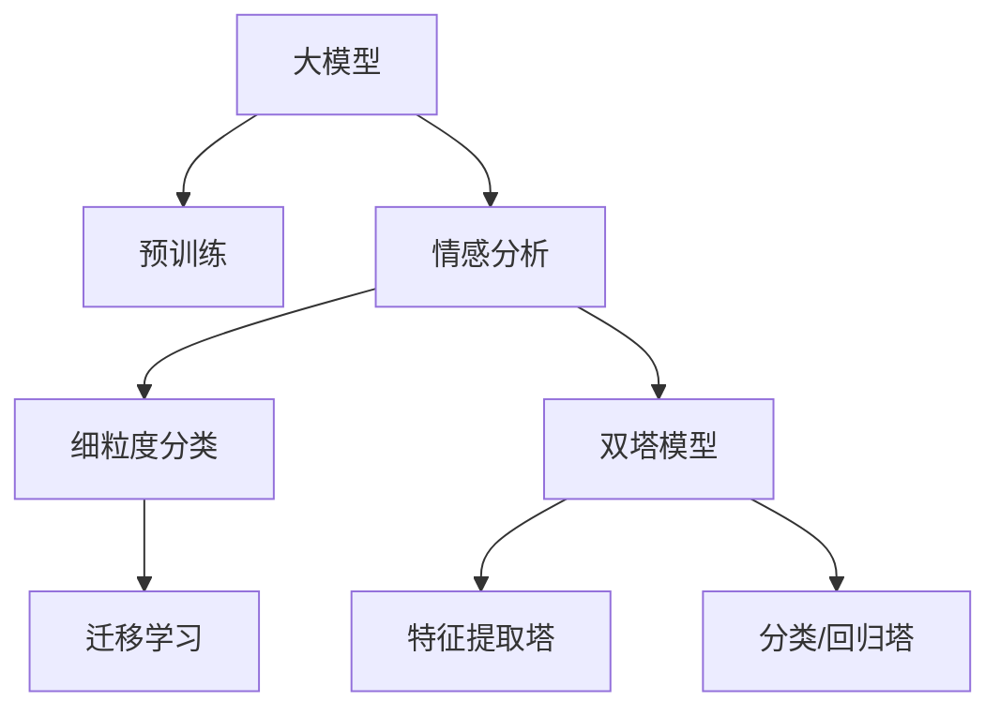

                 

# 大模型在商品评论情感细粒度分析中的应用

## 1. 背景介绍

### 1.1 问题由来
在数字化时代，消费者的购物行为越来越依赖于网络平台和社交媒体的评论与评分。商品评论不仅是消费者决策的重要参考，也为商家提供了一种了解用户需求和产品优缺点的途径。然而，传统的商品评论情感分析方法往往将评论按照情感极性进行分类，例如正面、负面或中性，这种方式简化了问题，但无法捕捉到评论中的更多细微情感倾向和上下文语义。

为了更深入地理解商品评论，识别其中的细粒度情感，并进一步支持商家的精准营销和个性化服务，细粒度情感分析成为近年来研究热点。细粒度情感分析关注评论中的情绪表达（如愉快、悲伤、愤怒等），以及情绪强度（如轻度、中度、重度）。该技术可以用于了解用户在购物过程中的情绪变化，从而帮助商家优化产品设计，提升客户满意度。

### 1.2 问题核心关键点
细粒度情感分析的核心在于如何从大规模的评论数据中提取出精细的情感信息，并构建模型进行预测。传统的方法包括基于规则的方法和基于机器学习的方法。其中，机器学习方法因其灵活性和可扩展性，成为了主要的研究方向。在大模型时代，尤其是以BERT为代表的语言模型的出现，为细粒度情感分析提供了新的可能性。

在大模型上进行细粒度情感分析，可以利用其强大的语言理解能力，从上下文语义中提取出精细的情感信息，通过监督学习的方法训练模型，对商品评论进行细粒度情感分类和强度预测。

### 1.3 问题研究意义
细粒度情感分析的研究和应用对于提升电商平台的用户体验、优化营销策略、改进商品设计等方面具有重要意义。例如：

- **提升用户体验**：通过理解用户评论中的细微情感，电商平台可以更加精准地识别用户需求和问题，及时响应，提高用户满意度。
- **优化营销策略**：商家可以通过对商品评论的细粒度分析，了解不同用户群体的情感倾向，进行针对性广告投放，提高营销效果。
- **改进商品设计**：通过分析消费者对产品的情感反馈，商家可以及时调整产品设计和功能，满足用户需求，提升市场竞争力。
- **推动技术创新**：细粒度情感分析技术的应用，不仅促进了NLP技术的进步，还为自然语言处理的多模态融合、情感计算等新兴领域提供了新的研究路径。

## 2. 核心概念与联系

### 2.1 核心概念概述

为更好地理解基于大模型的细粒度情感分析方法，本节将介绍几个关键概念：

- 大模型(Large Model)：以BERT、GPT等深度学习模型为代表的大规模预训练语言模型，具备强大的语言理解能力和表示学习能力。
- 情感分析(Emotion Analysis)：对文本中表达的情感信息进行分类和强度预测，是自然语言处理的重要任务。
- 细粒度分类(Fine-Grained Classification)：对类别进行进一步的细化分类，例如从正面、负面二分类扩展到包含愉快、悲伤、愤怒等多种情绪分类的任务。
- 迁移学习(Transfer Learning)：将在大规模数据上预训练得到的模型知识迁移到小规模数据集上的任务，以提升模型在小数据上的性能。
- 双塔模型(Two-Tower Model)：一种经典的大模型情感分析架构，由两个独立且相互关联的塔组成，一个用于提取特征，一个用于分类或回归。
- 神经网络(Neural Network)：一种通过学习大量数据，自动提取出输入特征和输出标签之间复杂映射关系的机器学习模型。

这些概念之间的逻辑关系可以通过以下Mermaid流程图来展示：



这个流程图展示了大模型的核心概念及其与情感分析任务之间的关系：

1. 大模型通过预训练获得基础能力。
2. 情感分析利用大模型提取特征，构建模型预测情感标签。
3. 细粒度分类在情感分析基础上进一步细化情感分类。
4. 迁移学习在大模型和小规模数据集之间进行知识迁移。
5. 双塔模型结合特征提取和分类两个塔，提升情感分析效果。

## 3. 核心算法原理 & 具体操作步骤
### 3.1 算法原理概述

基于大模型的细粒度情感分析，本质上是一个有监督的分类任务。其核心思想是：将大模型视为一个强大的特征提取器，通过在商品评论数据集上进行有监督的训练，学习到评论中的细粒度情感信息，并对这些信息进行分类和强度预测。

形式化地，假设大模型为 $M_{\theta}$，其中 $\theta$ 为预训练得到的模型参数。给定商品评论数据集 $D=\{(x_i,y_i)\}_{i=1}^N$，其中 $x_i$ 为商品评论文本，$y_i$ 为对应的细粒度情感标签，标签通常采用情绪类别和强度级别的组合形式，如“轻度愉快”、“中度悲伤”等。微调的目标是找到最优的模型参数 $\hat{\theta}$，使得：

$$
\hat{\theta}=\mathop{\arg\min}_{\theta} \mathcal{L}(M_{\theta},D)
$$

其中 $\mathcal{L}$ 为针对任务 $T$ 设计的损失函数，用于衡量模型预测输出与真实标签之间的差异。常见的损失函数包括交叉熵损失、均方误差损失等。

通过梯度下降等优化算法，微调过程不断更新模型参数 $\theta$，最小化损失函数 $\mathcal{L}$，使得模型输出逼近真实标签。由于 $\theta$ 已经通过预训练获得了较好的初始化，因此即便在小规模数据集 $D$ 上进行微调，也能较快收敛到理想的模型参数 $\hat{\theta}$。

### 3.2 算法步骤详解

基于大模型的细粒度情感分析一般包括以下几个关键步骤：

**Step 1: 准备预训练模型和数据集**
- 选择合适的预训练语言模型 $M_{\theta}$ 作为初始化参数，如 BERT、GPT 等。
- 准备商品评论数据集 $D$，划分为训练集、验证集和测试集。数据集应包含丰富、多样化的评论，确保模型能够学习到多种情感表达。

**Step 2: 添加任务适配层**
- 根据任务类型，在预训练模型顶层设计合适的输出层和损失函数。
- 对于细粒度情感分类，通常使用多分类交叉熵损失函数。
- 对于情感强度预测，则使用回归损失函数，如均方误差损失。

**Step 3: 设置微调超参数**
- 选择合适的优化算法及其参数，如 AdamW、SGD 等，设置学习率、批大小、迭代轮数等。
- 设置正则化技术及强度，包括权重衰减、Dropout、Early Stopping等。
- 确定冻结预训练参数的策略，如仅微调顶层，或全部参数都参与微调。

**Step 4: 执行梯度训练**
- 将训练集数据分批次输入模型，前向传播计算损失函数。
- 反向传播计算参数梯度，根据设定的优化算法和学习率更新模型参数。
- 周期性在验证集上评估模型性能，根据性能指标决定是否触发 Early Stopping。
- 重复上述步骤直到满足预设的迭代轮数或 Early Stopping 条件。

**Step 5: 测试和部署**
- 在测试集上评估微调后模型 $M_{\hat{\theta}}$ 的性能，对比微调前后的精度提升。
- 使用微调后的模型对新商品评论进行情感分析，集成到实际的应用系统中。
- 持续收集新的评论数据，定期重新微调模型，以适应评论情感分布的变化。

以上是基于大模型的细粒度情感分析的一般流程。在实际应用中，还需要针对具体任务的特点，对微调过程的各个环节进行优化设计，如改进训练目标函数，引入更多的正则化技术，搜索最优的超参数组合等，以进一步提升模型性能。

### 3.3 算法优缺点

基于大模型的细粒度情感分析方法具有以下优点：
1. 高效简洁。只需准备少量标注数据，即可对预训练模型进行快速适配，获得较大的性能提升。
2. 精度高。大模型的语言理解能力可以捕捉到评论中的细微情感，从而实现更准确的情感分类和强度预测。
3. 适应性强。通用的大模型可以迁移到不同领域的情感分析任务中，具有较好的跨领域泛化能力。
4. 可扩展性好。大模型参数量庞大，可以处理复杂多样化的情感表达，适用于多种情感分析场景。

同时，该方法也存在一定的局限性：
1. 依赖标注数据。微调的效果很大程度上取决于标注数据的质量和数量，获取高质量标注数据的成本较高。
2. 模型复杂度高。大模型的参数量庞大，对计算资源和内存占用要求较高。
3. 模型可解释性不足。微调模型通常被认为是“黑盒”，难以对其内部工作机制进行解释。
4. 训练时间长。大模型的参数量庞大，训练过程可能非常耗时，需要强大的计算资源支持。
5. 泛化性能问题。在大规模数据集上预训练得到的模型，可能对小规模数据集的泛化性能较弱，需要额外训练来优化。

尽管存在这些局限性，但就目前而言，基于大模型的情感分析方法仍是情感分析领域的主流范式。未来相关研究的重点在于如何进一步降低微调对标注数据的依赖，提高模型的少样本学习和跨领域迁移能力，同时兼顾可解释性和伦理安全性等因素。

### 3.4 算法应用领域

基于大模型的细粒度情感分析方法，在电商、社交媒体、产品评论等多个领域已经得到了广泛的应用，例如：

- 电商平台：通过分析用户对商品的评论，了解用户对商品的满意度和情感倾向，优化商品展示和推荐。
- 社交媒体：分析用户在社交媒体上的情感表达，了解用户情绪变化，进行舆情监控和情绪管理。
- 产品评论：分析用户对不同产品的评论，了解产品优劣，进行产品改进和市场分析。
- 客户服务：通过分析客户对服务的评论，了解客户满意度，进行服务优化和客户关怀。
- 情感分析：在新闻、书籍、电影等多种文本数据中，进行情感分类和强度预测，辅助内容创作和市场分析。

除了上述这些经典应用外，基于大模型的情感分析方法还被创新性地应用于情感计算、心理健康监测、舆情预测等新兴领域，为NLP技术带来了新的应用场景。随着大语言模型和情感分析方法的不断进步，相信情感分析技术将在更多领域大放异彩。

## 4. 数学模型和公式 & 详细讲解 & 举例说明
### 4.1 数学模型构建

本节将使用数学语言对基于大模型的细粒度情感分析过程进行更加严格的刻画。

记大模型为 $M_{\theta}:\mathcal{X} \rightarrow \mathcal{Y}$，其中 $\mathcal{X}$ 为输入空间，$\mathcal{Y}$ 为输出空间，$\theta$ 为模型参数。假设微调任务的训练集为 $D=\{(x_i,y_i)\}_{i=1}^N, x_i \in \mathcal{X}, y_i \in \mathcal{Y}$。

定义模型 $M_{\theta}$ 在输入 $x$ 上的输出为 $\hat{y}=M_{\theta}(x) \in [0,1]$，表示样本属于某个情感类别的概率。真实标签 $y \in \{0,1\}$。则二分类交叉熵损失函数定义为：

$$
\ell(M_{\theta}(x),y) = -[y\log \hat{y} + (1-y)\log (1-\hat{y})]
$$

将其代入经验风险公式，得：

$$
\mathcal{L}(\theta) = -\frac{1}{N}\sum_{i=1}^N [y_i\log M_{\theta}(x_i)+(1-y_i)\log(1-M_{\theta}(x_i))]
$$

在得到损失函数的梯度后，即可带入参数更新公式，完成模型的迭代优化。重复上述过程直至收敛，最终得到适应下游任务的最优模型参数 $\theta^*$。

### 4.2 公式推导过程

以下我们以情感分类任务为例，推导交叉熵损失函数及其梯度的计算公式。

假设模型 $M_{\theta}$ 在输入 $x$ 上的输出为 $\hat{y}=M_{\theta}(x) \in [0,1]$，表示样本属于某个情感类别的概率。真实标签 $y \in \{0,1\}$。则二分类交叉熵损失函数定义为：

$$
\ell(M_{\theta}(x),y) = -[y\log \hat{y} + (1-y)\log (1-\hat{y})]
$$

将其代入经验风险公式，得：

$$
\mathcal{L}(\theta) = -\frac{1}{N}\sum_{i=1}^N [y_i\log M_{\theta}(x_i)+(1-y_i)\log(1-M_{\theta}(x_i))]
$$

根据链式法则，损失函数对参数 $\theta_k$ 的梯度为：

$$
\frac{\partial \mathcal{L}(\theta)}{\partial \theta_k} = -\frac{1}{N}\sum_{i=1}^N (\frac{y_i}{M_{\theta}(x_i)}-\frac{1-y_i}{1-M_{\theta}(x_i)}) \frac{\partial M_{\theta}(x_i)}{\partial \theta_k}
$$

其中 $\frac{\partial M_{\theta}(x_i)}{\partial \theta_k}$ 可进一步递归展开，利用自动微分技术完成计算。

在得到损失函数的梯度后，即可带入参数更新公式，完成模型的迭代优化。重复上述过程直至收敛，最终得到适应下游任务的最优模型参数 $\theta^*$。

## 5. 项目实践：代码实例和详细解释说明
### 5.1 开发环境搭建

在进行细粒度情感分析实践前，我们需要准备好开发环境。以下是使用Python进行PyTorch开发的环境配置流程：

1. 安装Anaconda：从官网下载并安装Anaconda，用于创建独立的Python环境。

2. 创建并激活虚拟环境：
```bash
conda create -n pytorch-env python=3.8 
conda activate pytorch-env
```

3. 安装PyTorch：根据CUDA版本，从官网获取对应的安装命令。例如：
```bash
conda install pytorch torchvision torchaudio cudatoolkit=11.1 -c pytorch -c conda-forge
```

4. 安装Transformers库：
```bash
pip install transformers
```

5. 安装各类工具包：
```bash
pip install numpy pandas scikit-learn matplotlib tqdm jupyter notebook ipython
```

完成上述步骤后，即可在`pytorch-env`环境中开始细粒度情感分析实践。

### 5.2 源代码详细实现

下面我们以情感分类任务为例，给出使用Transformers库对BERT模型进行细粒度情感分类的PyTorch代码实现。

首先，定义情感分类任务的数据处理函数：

```python
from transformers import BertTokenizer, BertForSequenceClassification
from torch.utils.data import Dataset, DataLoader
import torch

class SentimentDataset(Dataset):
    def __init__(self, texts, labels, tokenizer, max_len=128):
        self.texts = texts
        self.labels = labels
        self.tokenizer = tokenizer
        self.max_len = max_len
        
    def __len__(self):
        return len(self.texts)
    
    def __getitem__(self, item):
        text = self.texts[item]
        label = self.labels[item]
        
        encoding = self.tokenizer(text, return_tensors='pt', max_length=self.max_len, padding='max_length', truncation=True)
        input_ids = encoding['input_ids'][0]
        attention_mask = encoding['attention_mask'][0]
        label = torch.tensor(label, dtype=torch.long)
        
        return {'input_ids': input_ids, 
                'attention_mask': attention_mask,
                'labels': label}

# 定义情感分类标签
label2id = {'正面': 1, '负面': 0}

# 创建dataset
tokenizer = BertTokenizer.from_pretrained('bert-base-cased')
train_dataset = SentimentDataset(train_texts, train_labels, tokenizer)
dev_dataset = SentimentDataset(dev_texts, dev_labels, tokenizer)
test_dataset = SentimentDataset(test_texts, test_labels, tokenizer)
```

然后，定义模型和优化器：

```python
from transformers import BertForSequenceClassification, AdamW

model = BertForSequenceClassification.from_pretrained('bert-base-cased', num_labels=2)

optimizer = AdamW(model.parameters(), lr=2e-5)
```

接着，定义训练和评估函数：

```python
from tqdm import tqdm

device = torch.device('cuda') if torch.cuda.is_available() else torch.device('cpu')
model.to(device)

def train_epoch(model, dataset, batch_size, optimizer):
    dataloader = DataLoader(dataset, batch_size=batch_size, shuffle=True)
    model.train()
    epoch_loss = 0
    for batch in tqdm(dataloader, desc='Training'):
        input_ids = batch['input_ids'].to(device)
        attention_mask = batch['attention_mask'].to(device)
        labels = batch['labels'].to(device)
        model.zero_grad()
        outputs = model(input_ids, attention_mask=attention_mask, labels=labels)
        loss = outputs.loss
        epoch_loss += loss.item()
        loss.backward()
        optimizer.step()
    return epoch_loss / len(dataloader)

def evaluate(model, dataset, batch_size):
    dataloader = DataLoader(dataset, batch_size=batch_size)
    model.eval()
    preds, labels = [], []
    with torch.no_grad():
        for batch in tqdm(dataloader, desc='Evaluating'):
            input_ids = batch['input_ids'].to(device)
            attention_mask = batch['attention_mask'].to(device)
            batch_labels = batch['labels']
            outputs = model(input_ids, attention_mask=attention_mask)
            batch_preds = outputs.logits.argmax(dim=1).to('cpu').tolist()
            batch_labels = batch_labels.to('cpu').tolist()
            for pred, label in zip(batch_preds, batch_labels):
                preds.append(pred)
                labels.append(label)
                
    print(classification_report(labels, preds))
```

最后，启动训练流程并在测试集上评估：

```python
epochs = 5
batch_size = 16

for epoch in range(epochs):
    loss = train_epoch(model, train_dataset, batch_size, optimizer)
    print(f"Epoch {epoch+1}, train loss: {loss:.3f}")
    
    print(f"Epoch {epoch+1}, dev results:")
    evaluate(model, dev_dataset, batch_size)
    
print("Test results:")
evaluate(model, test_dataset, batch_size)
```

以上就是使用PyTorch对BERT进行情感分类任务的细粒度情感分析代码实现。可以看到，得益于Transformers库的强大封装，我们可以用相对简洁的代码完成BERT模型的加载和微调。

### 5.3 代码解读与分析

让我们再详细解读一下关键代码的实现细节：

**SentimentDataset类**：
- `__init__`方法：初始化文本、标签、分词器等关键组件。
- `__len__`方法：返回数据集的样本数量。
- `__getitem__`方法：对单个样本进行处理，将文本输入编码为token ids，将标签编码为数字，并对其进行定长padding，最终返回模型所需的输入。

**label2id字典**：
- 定义了标签与数字id之间的映射关系，用于将预测结果解码回真实的标签。

**训练和评估函数**：
- 使用PyTorch的DataLoader对数据集进行批次化加载，供模型训练和推理使用。
- 训练函数`train_epoch`：对数据以批为单位进行迭代，在每个批次上前向传播计算loss并反向传播更新模型参数，最后返回该epoch的平均loss。
- 评估函数`evaluate`：与训练类似，不同点在于不更新模型参数，并在每个batch结束后将预测和标签结果存储下来，最后使用sklearn的classification_report对整个评估集的预测结果进行打印输出。

**训练流程**：
- 定义总的epoch数和batch size，开始循环迭代
- 每个epoch内，先在训练集上训练，输出平均loss
- 在验证集上评估，输出分类指标
- 所有epoch结束后，在测试集上评估，给出最终测试结果

可以看到，PyTorch配合Transformers库使得BERT微调的代码实现变得简洁高效。开发者可以将更多精力放在数据处理、模型改进等高层逻辑上，而不必过多关注底层的实现细节。

当然，工业级的系统实现还需考虑更多因素，如模型的保存和部署、超参数的自动搜索、更灵活的任务适配层等。但核心的微调范式基本与此类似。

## 6. 实际应用场景
### 6.1 电商平台情感分析

在电商平台中，商品评论情感分析可以帮助商家及时了解用户对商品的反馈，优化商品展示和推荐策略，提升用户满意度。通过细粒度情感分析，商家不仅可以知道用户对商品的一般满意度，还能了解用户对商品的具体情感倾向和强度，从而进行更加精准的市场分析和用户细分。

例如，商家可以对用户对某款手机的评论进行细粒度情感分析，了解用户对屏幕、摄像头、电池等不同方面的满意度，从而针对性地进行改进和优化，提升产品竞争力。同时，商家还可以根据用户的情感强度，进行有针对性的广告投放和客户关怀，提升用户粘性和忠诚度。

### 6.2 社交媒体情感监测

社交媒体是用户表达情感的重要平台，通过细粒度情感分析，可以实时监测用户对某一事件、话题的情感变化，辅助企业进行舆情监测和情绪管理。例如，在某一热门事件发生后，社交媒体上用户的评论情感可能快速变化，企业可以通过细粒度情感分析，了解用户情绪的演化趋势，及时响应，避免危机发生。

此外，社交媒体上的用户评论往往包含了丰富的情感表达，如愉快、悲伤、愤怒等，这些情感表达可以帮助企业更好地理解用户需求和情绪，优化产品和服务，提升用户体验。

### 6.3 客户服务情感分析

在客户服务领域，通过细粒度情感分析，可以及时了解用户对服务的态度和情绪，进行情绪管理和服务优化。例如，通过分析用户对客服聊天机器人的反馈，可以了解用户对服务流程、回答准确性、服务态度等方面的情感倾向，从而进行相应的改进和优化，提升用户满意度。

### 6.4 产品评论情感分析

产品评论是用户对产品优劣的真实反馈，通过细粒度情感分析，可以深入理解用户对产品的情感倾向和强度，进行产品改进和市场分析。例如，通过分析用户对某款手机的评论，可以了解用户对屏幕、摄像头、电池等不同方面的满意度，从而进行针对性的产品改进和市场推广。

## 7. 工具和资源推荐
### 7.1 学习资源推荐

为了帮助开发者系统掌握大模型进行细粒度情感分析的理论基础和实践技巧，这里推荐一些优质的学习资源：

1. 《自然语言处理入门》系列博文：由大模型技术专家撰写，系统介绍了自然语言处理的基本概念和经典模型，包括情感分析等任务。

2. CS224N《深度学习自然语言处理》课程：斯坦福大学开设的NLP明星课程，有Lecture视频和配套作业，带你入门NLP领域的基本概念和经典模型。

3. 《自然语言处理与深度学习》书籍：介绍了NLP中常用的深度学习模型，包括情感分析等任务，适合对深度学习有基础的读者。

4. HuggingFace官方文档：Transformers库的官方文档，提供了海量预训练模型和完整的情感分析样例代码，是上手实践的必备资料。

5. 《情感分析在电商中的应用》一书：介绍了情感分析在电商中的具体应用，包括细粒度情感分析等任务，提供了丰富的案例和实践经验。

通过对这些资源的学习实践，相信你一定能够快速掌握大模型进行细粒度情感分析的精髓，并用于解决实际的NLP问题。
###  7.2 开发工具推荐

高效的开发离不开优秀的工具支持。以下是几款用于大模型进行细粒度情感分析开发的常用工具：

1. PyTorch：基于Python的开源深度学习框架，灵活动态的计算图，适合快速迭代研究。大部分预训练语言模型都有PyTorch版本的实现。

2. TensorFlow：由Google主导开发的开源深度学习框架，生产部署方便，适合大规模工程应用。同样有丰富的预训练语言模型资源。

3. Transformers库：HuggingFace开发的NLP工具库，集成了众多SOTA语言模型，支持PyTorch和TensorFlow，是进行细粒度情感分析开发的利器。

4. Weights & Biases：模型训练的实验跟踪工具，可以记录和可视化模型训练过程中的各项指标，方便对比和调优。与主流深度学习框架无缝集成。

5. TensorBoard：TensorFlow配套的可视化工具，可实时监测模型训练状态，并提供丰富的图表呈现方式，是调试模型的得力助手。

6. Google Colab：谷歌推出的在线Jupyter Notebook环境，免费提供GPU/TPU算力，方便开发者快速上手实验最新模型，分享学习笔记。

合理利用这些工具，可以显著提升大模型进行细粒度情感分析的开发效率，加快创新迭代的步伐。

### 7.3 相关论文推荐

大语言模型和情感分析方法的发展源于学界的持续研究。以下是几篇奠基性的相关论文，推荐阅读：

1. Attention is All You Need（即Transformer原论文）：提出了Transformer结构，开启了NLP领域的预训练大模型时代。

2. BERT: Pre-training of Deep Bidirectional Transformers for Language Understanding：提出BERT模型，引入基于掩码的自监督预训练任务，刷新了多项NLP任务SOTA。

3. Sentence-Level Affective Computing Using Deep Neural Networks：提出使用卷积神经网络(CNN)进行情感分类和强度预测，为细粒度情感分析提供了新的思路。

4. Fine-Grained Affective Computing：介绍了细粒度情感分析的基本概念和技术，提出了基于多维情感表示的方法。

5. Sentiment Detection with Attention-based LSTM Networks：提出了使用LSTM网络进行情感分类的模型，结合了注意力机制，提高了情感分类的准确性。

这些论文代表了大语言模型进行细粒度情感分析的研究脉络。通过学习这些前沿成果，可以帮助研究者把握学科前进方向，激发更多的创新灵感。

## 8. 总结：未来发展趋势与挑战

### 8.1 总结

本文对基于大模型的细粒度情感分析方法进行了全面系统的介绍。首先阐述了细粒度情感分析的研究背景和意义，明确了基于大模型的情感分析在电商平台、社交媒体、客户服务、产品评论等多个领域的应用价值。其次，从原理到实践，详细讲解了情感分析的数学模型和关键步骤，给出了细粒度情感分析的完整代码实现。同时，本文还探讨了细粒度情感分析方法在电商、社交媒体、客户服务等多个领域的实际应用场景，展示了细粒度情感分析的广阔前景。此外，本文精选了情感分析技术的各类学习资源，力求为读者提供全方位的技术指引。

通过本文的系统梳理，可以看到，基于大模型的情感分析方法正在成为NLP领域的重要范式，极大地拓展了情感分析的应用边界，催生了更多的落地场景。受益于大规模语料的预训练，情感分析模型在处理复杂多样化的情感表达上，表现出了强大的能力和潜力。未来，伴随大语言模型和情感分析方法的不断进步，相信情感分析技术将在更多领域大放异彩，深刻影响人类的生产生活方式。

### 8.2 未来发展趋势

展望未来，基于大模型的情感分析技术将呈现以下几个发展趋势：

1. 模型规模持续增大。随着算力成本的下降和数据规模的扩张，预训练语言模型的参数量还将持续增长。超大规模语言模型蕴含的丰富语言知识，有望支撑更加复杂多变的情感分析任务。

2. 情感分析范式多样化。除了传统的基于分类和回归的任务外，未来的情感分析将更加注重情绪的因果关系和情绪变化的过程分析。

3. 多模态情感分析崛起。当前的情感分析主要聚焦于文本数据，未来会进一步拓展到图像、视频、语音等多模态数据情感分析。多模态信息的融合，将显著提升情感分析模型的感知能力和表达能力。

4. 跨领域情感迁移能力增强。经过海量数据的预训练和多领域任务的微调，未来的情感分析模型将具备更强大的跨领域迁移能力，可以更灵活地应用于不同领域的情感分析任务。

5. 可解释性和安全性提升。未来的情感分析模型将更加注重输出的可解释性和模型的安全性，避免有害信息传递和恶意用途，确保情感分析的应用符合伦理道德规范。

6. 情感计算与智能系统融合。未来的情感分析将与智能推荐、智能客服、情感计算等技术深度融合，为构建更加智能化、个性化的智能系统提供新的技术支持。

以上趋势凸显了大语言模型情感分析技术的广阔前景。这些方向的探索发展，必将进一步提升情感分析模型的性能和应用范围，为人类认知智能的进化带来深远影响。

### 8.3 面临的挑战

尽管基于大模型的情感分析技术已经取得了瞩目成就，但在迈向更加智能化、普适化应用的过程中，它仍面临着诸多挑战：

1. 标注成本瓶颈。尽管细粒度情感分析在减少标注数据的需求方面有所突破，但对于部分长尾情感类别，标注成本依然较高。如何进一步降低标注数据的需求，减少标注成本，仍是未来研究的重要方向。

2. 数据质量问题。情感数据通常具有高度的噪音和主观性，标注数据的质量对模型的性能影响较大。如何获取高质量、大规模的标注数据，减少噪音，提高情感分析的准确性，是未来需要重点解决的问题。

3. 模型鲁棒性不足。尽管细粒度情感分析模型在大规模数据集上表现优异，但对于小规模数据集的泛化性能较弱。如何提高模型的泛化能力，确保情感分析在不同场景下都能保持稳定性和可靠性，是未来需要进一步研究的课题。

4. 模型可解释性不足。情感分析模型通常被认为是“黑盒”，难以对其内部工作机制进行解释。如何提高模型的可解释性，让用户能够理解模型的决策过程，是未来需要关注的问题。

5. 数据隐私和安全问题。情感分析涉及到大量用户隐私数据，如何确保数据隐私和安全，避免数据滥用，是未来需要重点解决的问题。

6. 计算资源需求高。大模型的参数量庞大，训练和推理过程对计算资源和内存占用要求较高。如何降低计算资源需求，提高模型效率，是未来需要重点研究的课题。

尽管存在这些挑战，但伴随深度学习技术的发展，基于大模型的情感分析方法仍有着广阔的前景。相信随着学界和产业界的共同努力，这些挑战终将一一被克服，基于大模型的情感分析技术将在更多领域大放异彩。

### 8.4 研究展望

面对基于大模型的情感分析所面临的种种挑战，未来的研究需要在以下几个方面寻求新的突破：

1. 探索无监督和半监督情感分析方法。摆脱对大规模标注数据的依赖，利用自监督学习、主动学习等无监督和半监督范式，最大限度利用非结构化数据，实现更加灵活高效的情感分析。

2. 研究参数高效和计算高效的情感分析范式。开发更加参数高效的情感分析方法，在固定大部分预训练参数的同时，只更新极少量的任务相关参数。同时优化情感分析模型的计算图，减少前向传播和反向传播的资源消耗，实现更加轻量级、实时性的部署。

3. 融合因果和对比学习范式。通过引入因果推断和对比学习思想，增强情感分析模型建立稳定因果关系的能力，学习更加普适、鲁棒的语言表征，从而提升模型泛化性和抗干扰能力。

4. 引入更多先验知识。将符号化的先验知识，如知识图谱、逻辑规则等，与神经网络模型进行巧妙融合，引导情感分析过程学习更准确、合理的语言模型。同时加强不同模态数据的整合，实现视觉、语音等多模态信息与文本信息的协同建模。

5. 结合因果分析和博弈论工具。将因果分析方法引入情感分析模型，识别出模型决策的关键特征，增强输出解释的因果性和逻辑性。借助博弈论工具刻画人机交互过程，主动探索并规避模型的脆弱点，提高系统稳定性。

6. 纳入伦理道德约束。在情感分析模型的训练目标中引入伦理导向的评估指标，过滤和惩罚有害的输出倾向。同时加强人工干预和审核，建立模型行为的监管机制，确保输出符合人类价值观和伦理道德。

这些研究方向的探索，必将引领基于大模型的情感分析技术迈向更高的台阶，为构建安全、可靠、可解释、可控的智能系统铺平道路。面向未来，基于大模型的情感分析技术还需要与其他人工智能技术进行更深入的融合，如知识表示、因果推理、强化学习等，多路径协同发力，共同推动自然语言理解和智能交互系统的进步。只有勇于创新、敢于突破，才能不断拓展情感分析的边界，让智能技术更好地造福人类社会。

## 9. 附录：常见问题与解答

**Q1：细粒度情感分析的预训练模型如何选择？**

A: 选择合适的预训练模型需要考虑任务的复杂度和数据规模。对于文本简短、情感表达简单的任务，可以选择预训练的情感分析模型，如BERT、RoBERTa等。对于文本较长、情感表达复杂的任务，可以选择BERT、GPT等大模型，并结合任务特点进行微调。同时，可以结合多模态数据进行预训练，提高模型的表达能力和泛化性能。

**Q2：如何优化情感分析模型的训练过程？**

A: 优化情感分析模型的训练过程可以从以下几个方面入手：
1. 数据增强：通过回译、近义替换等方式扩充训练集，增强模型的泛化能力。
2. 正则化：使用L2正则、Dropout等方法防止过拟合，提高模型的鲁棒性。
3. 学习率调整：根据模型性能和数据分布，调整学习率，避免过早或过晚收敛。
4. 模型压缩：采用剪枝、量化等方法减少模型参数量，提高训练和推理效率。
5. 多模型集成：训练多个模型，取平均输出，提高模型的泛化能力和鲁棒性。

这些方法可以单独或组合使用，根据具体任务进行调整优化。

**Q3：情感分析模型的可解释性问题如何解决？**

A: 提高情感分析模型的可解释性，可以通过以下几种方法：
1. 注意力机制：在模型中加入注意力机制，显示模型对文本中不同部分的关注程度。
2. 可视化工具：使用可视化工具，如T-SNE、UMAP等，将高维模型表示映射到二维空间，帮助理解模型内部的特征表达。
3. 特征分析：分析模型提取的特征，理解情感分类的关键特征和情感表达的语义。
4. 自然语言解释：使用自然语言解释技术，将模型的预测结果转换为自然语言，增强可解释性。

这些方法可以帮助提高情感分析模型的可解释性，让用户更好地理解模型的决策过程。

**Q4：情感分析模型在实际应用中的性能评估方法有哪些？**

A: 情感分析模型在实际应用中的性能评估可以从以下几个方面进行：
1. 准确率：衡量模型对情感分类的准确程度。
2. 召回率：衡量模型对情感类别的覆盖能力。
3. F1-score：综合考虑准确率和召回率，衡量模型的综合性能。
4. ROC-AUC曲线：通过绘制ROC曲线，评估模型在不同阈值下的性能表现。
5. 混淆矩阵：通过混淆矩阵，分析模型的分类误差，识别误分类情况。

这些评估方法可以结合具体任务进行综合评估，选择最适合的指标来衡量模型的性能。

**Q5：情感分析模型在电商、社交媒体等领域的实际应用场景有哪些？**

A: 情感分析模型在电商、社交媒体等领域的实际应用场景包括：
1. 电商平台：通过分析用户对商品的评论，了解用户对商品的满意度和情感倾向，优化商品展示和推荐。
2. 社交媒体：分析用户在社交媒体上的情感表达，了解用户情绪变化，进行舆情监测和情绪管理。
3. 客户服务：通过分析用户对客服聊天机器人的反馈，了解用户对服务的态度和情绪，进行情绪管理和服务优化。
4. 产品评论：分析用户对不同产品的评论，了解产品优劣，进行产品改进和市场分析。

这些应用场景展示了情感分析模型在实际中的广泛应用，为商家和企业的运营决策提供了重要依据。

**Q6：情感分析模型的未来发展方向有哪些？**

A: 情感分析模型的未来发展方向包括：
1. 模型规模的持续增大：随着计算资源的提升，预训练语言模型的参数量将继续增加，提升模型的表达能力和泛化性能。
2. 多模态情感分析的崛起：情感分析将拓展到图像、视频、语音等多模态数据，提高模型的感知能力和表达能力。
3. 跨领域情感迁移能力的增强：经过海量数据的预训练和多领域任务的微调，情感分析模型将具备更强的跨领域迁移能力，可以应用于更多领域的情感分析任务。
4. 可解释性和安全性的提升：情感分析模型将更加注重输出的可解释性和模型的安全性，避免有害信息传递和恶意用途。
5. 与智能系统的融合：情感分析模型将与智能推荐、智能客服、情感计算等技术深度融合，为构建更加智能化、个性化的智能系统提供新的技术支持。

这些方向的研究将进一步提升情感分析模型的性能和应用范围，为人类认知智能的进化带来深远影响。

---

作者：禅与计算机程序设计艺术 / Zen and the Art of Computer Programming

