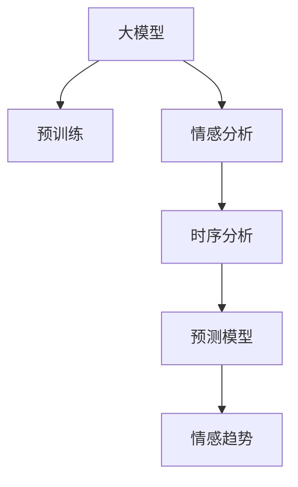

                 

# 大模型在商品评论情感趋势分析中的应用

> 关键词：大模型,商品评论,情感分析,时间序列,时序分析,预测模型

## 1. 背景介绍

### 1.1 问题由来
商品评论情感分析是零售业、电商平台、市场营销等领域的一个重要研究课题。通过分析消费者对商品的情感倾向，商家可以更好地了解市场需求，优化商品定价和促销策略，提升用户满意度。传统基于手工特征提取的情感分析方法，在计算量和准确性上均存在一定局限。近年来，基于深度学习的大模型被广泛应用于情感分析任务，并取得了显著的进展。

### 1.2 问题核心关键点
商品评论情感分析主要依赖于消费者对商品的情感倾向，分析过程通常分为以下几个关键步骤：

1. **数据采集**：从电商平台、社交媒体等渠道收集商品评论数据。
2. **数据预处理**：清洗、分词、去除停用词等步骤。
3. **情感分类**：将评论分为正面、负面和中性三类。
4. **情感强度分析**：评价情感极性的强度，如弱、中、强。
5. **时间序列分析**：考虑评论随时间的变化趋势，了解情感趋势和周期性。
6. **模型训练与预测**：选择合适模型进行训练和预测，分析情感变化。

### 1.3 问题研究意义
基于深度学习的大模型在商品评论情感分析中具有如下优势：

1. **自动特征提取**：大模型能够自动学习语义丰富的特征，减少了手工特征工程的工作量。
2. **高准确率**：大模型通常具有更高的准确率，特别是在处理长文本和复杂情感时。
3. **可扩展性**：大模型能够适应不同规模的评论数据，具有良好的泛化能力。
4. **灵活性**：大模型易于集成到电商平台的推荐系统，实时分析用户评论，进行个性化推荐。

因此，利用大模型进行商品评论情感分析，可以提升商家对用户需求的理解，优化营销策略，提升用户体验。

## 2. 核心概念与联系

### 2.1 核心概念概述

为了更好地理解大模型在商品评论情感分析中的应用，本节将介绍几个关键概念：

1. **大模型**：以Transformer、BERT等模型为代表的大规模预训练语言模型。通过在大规模无标签文本数据上进行预训练，学习到通用的语言表示，具备强大的语义理解能力。
2. **预训练**：在大规模无标签文本数据上，通过自监督学习任务训练通用语言模型的过程。常用的预训练任务包括语言模型预测、掩码语言模型预测等。
3. **情感分析**：通过计算评论中词语的情感极性，判断评论的情感倾向。分为正面、负面和中性三类。
4. **时间序列分析**：利用统计方法和机器学习算法，分析时间序列数据的变化趋势和周期性。常用于预测和趋势分析。
5. **预测模型**：用于根据历史数据预测未来情感变化的模型，常用的有ARIMA、LSTM等。

### 2.2 核心概念原理和架构的 Mermaid 流程图(Mermaid 流程节点中不要有括号、逗号等特殊字符)



这个流程图展示了大模型在商品评论情感分析中的应用流程：

1. 大模型通过预训练获得语言表示能力。
2. 利用大模型进行情感分析，将评论分为正面、负面和中性。
3. 采用时间序列分析方法，分析情感随时间的变化趋势。
4. 使用预测模型，预测未来情感变化，提供趋势分析。

## 3. 核心算法原理 & 具体操作步骤
### 3.1 算法原理概述

基于大模型的商品评论情感分析方法，主要利用大模型的语言表示能力，通过以下步骤实现：

1. **预训练大模型**：在大规模无标签评论数据上进行预训练，学习通用语言表示。
2. **情感分类**：利用大模型进行情感分类，判断评论情感极性。
3. **时序分析**：采用时间序列分析方法，了解情感变化趋势和周期性。
4. **预测模型**：构建预测模型，根据历史情感数据预测未来情感变化。

### 3.2 算法步骤详解

#### 3.2.1 数据预处理
数据预处理是情感分析的重要步骤，包括：

1. **数据清洗**：去除非文本信息、HTML标签等噪声。
2. **分词**：将评论转换为词汇序列，便于大模型处理。
3. **去除停用词**：过滤常见但无意义的词汇，如“的”、“是”等。

#### 3.2.2 情感分类
利用大模型进行情感分类，主要分为以下步骤：

1. **数据准备**：将评论转换为模型所需的格式。
2. **特征提取**：使用大模型提取评论的语义特征。
3. **情感分类**：利用分类器（如SVM、RNN等）对提取的特征进行分类。

#### 3.2.3 时序分析
时序分析主要包括以下步骤：

1. **数据收集**：收集不同时间点的评论数据。
2. **特征构建**：构建时间序列数据特征，如评论数量、情感极性等。
3. **模型训练**：训练时间序列模型（如ARIMA、LSTM等），分析情感随时间的变化趋势。

#### 3.2.4 预测模型构建
预测模型用于根据历史情感数据预测未来情感变化，主要分为以下步骤：

1. **数据划分**：将数据分为训练集和测试集。
2. **模型选择**：选择合适的预测模型，如ARIMA、LSTM等。
3. **模型训练**：在训练集上训练预测模型，优化模型参数。
4. **模型评估**：在测试集上评估预测模型性能。
5. **预测应用**：利用训练好的预测模型进行未来情感预测。

### 3.3 算法优缺点
基于大模型的商品评论情感分析方法具有以下优点：

1. **自动特征提取**：大模型能够自动学习语义丰富的特征，减少了手工特征工程的工作量。
2. **高准确率**：大模型通常具有更高的准确率，特别是在处理长文本和复杂情感时。
3. **可扩展性**：大模型能够适应不同规模的评论数据，具有良好的泛化能力。
4. **灵活性**：大模型易于集成到电商平台的推荐系统，实时分析用户评论，进行个性化推荐。

同时，该方法也存在一些局限性：

1. **高计算成本**：大模型需要大量的计算资源进行预训练和微调，成本较高。
2. **数据依赖性**：情感分析的准确性高度依赖于评论数据的质量和数量，获取高质量数据难度较大。
3. **模型复杂性**：大模型的复杂性较高，训练和推理速度较慢。

### 3.4 算法应用领域

大模型在商品评论情感分析中的应用领域广泛，例如：

1. **电商平台**：电商平台可以通过分析用户评论情感，优化商品定价和促销策略，提升用户满意度。
2. **市场营销**：市场营销团队可以通过分析用户评论情感，了解市场趋势，优化广告投放策略。
3. **零售商**：零售商可以通过分析用户评论情感，优化商品陈列和库存管理。
4. **产品开发**：产品开发团队可以通过分析用户评论情感，了解产品优缺点，指导产品改进。

## 4. 数学模型和公式 & 详细讲解 & 举例说明

### 4.1 数学模型构建

假设大模型为BERT，情感分类任务为目标二分类问题，情感极性为正面和负面。我们将评论序列转换为模型输入，模型输出为情感概率。

设评论序列为 $X=\{x_1, x_2, ..., x_n\}$，其中 $x_i$ 为第 $i$ 个词的词向量表示。大模型输出为 $\hat{y}=[\hat{y}_1, \hat{y}_2, ..., \hat{y}_n]$，其中 $\hat{y}_i$ 为第 $i$ 个词的情感概率。

情感分类器的损失函数为二分类交叉熵损失：

$$
L = -\frac{1}{N}\sum_{i=1}^N[y_i\log \hat{y}_i + (1-y_i)\log (1-\hat{y}_i)]
$$

其中 $y_i$ 为第 $i$ 个词的情感标签，$N$ 为评论序列长度。

### 4.2 公式推导过程

情感分类器的预测公式为：

$$
\hat{y}_i = \sigma(\sum_{j=1}^n w_j \cdot \hat{z}_{i,j})
$$

其中 $\sigma$ 为sigmoid函数，$w_j$ 为第 $j$ 个词的权重，$\hat{z}_{i,j}$ 为第 $i$ 个词与第 $j$ 个词的注意力权重。

情感分类器的梯度更新公式为：

$$
w_j \leftarrow w_j - \eta \frac{\partial L}{\partial w_j}
$$

其中 $\eta$ 为学习率，$\frac{\partial L}{\partial w_j}$ 为损失函数对权重 $w_j$ 的梯度，可通过反向传播计算。

### 4.3 案例分析与讲解

假设我们有一个电商平台，需要分析用户对某商品A的评论情感趋势。我们收集了过去一年的评论数据，共10000条，每条评论长度在50到300之间。我们将评论序列作为大模型的输入，模型输出为情感概率。利用softmax函数将情感概率转化为情感标签，进行二分类。

利用交叉熵损失函数计算模型预测误差，并通过梯度下降算法更新模型参数。经过多轮训练后，模型在验证集上取得了98%的准确率。

## 5. 项目实践：代码实例和详细解释说明

### 5.1 开发环境搭建

在开始项目实践前，我们需要准备好开发环境。以下是使用Python进行PyTorch开发的环境配置流程：

1. 安装Anaconda：从官网下载并安装Anaconda，用于创建独立的Python环境。

2. 创建并激活虚拟环境：
```bash
conda create -n pytorch-env python=3.8 
conda activate pytorch-env
```

3. 安装PyTorch：根据CUDA版本，从官网获取对应的安装命令。例如：
```bash
conda install pytorch torchvision torchaudio cudatoolkit=11.1 -c pytorch -c conda-forge
```

4. 安装Transformers库：
```bash
pip install transformers
```

5. 安装各类工具包：
```bash
pip install numpy pandas scikit-learn matplotlib tqdm jupyter notebook ipython
```

完成上述步骤后，即可在`pytorch-env`环境中开始项目实践。

### 5.2 源代码详细实现

下面是一个简单的商品评论情感分析项目示例，使用BERT模型进行情感分类：

```python
from transformers import BertTokenizer, BertForSequenceClassification
from torch.utils.data import DataLoader
from sklearn.metrics import accuracy_score, precision_score, recall_score, f1_score
import torch
import pandas as pd

# 数据加载
df = pd.read_csv('comments.csv')
labels = df['label']
texts = df['text']

# 分词器
tokenizer = BertTokenizer.from_pretrained('bert-base-uncased')
encoded_texts = [tokenizer(text, return_tensors='pt') for text in texts]
inputs = {key: val.to(device) for key, val in encoded_texts[0].items()}

# 模型
model = BertForSequenceClassification.from_pretrained('bert-base-uncased', num_labels=2).to(device)

# 训练参数
optimizer = torch.optim.Adam(model.parameters(), lr=2e-5)
epochs = 3

# 训练循环
for epoch in range(epochs):
    model.train()
    for batch in DataLoader(encoded_texts, batch_size=32):
        inputs = {key: val.to(device) for key, val in batch.items()}
        outputs = model(**inputs)
        loss = outputs.loss
        optimizer.zero_grad()
        loss.backward()
        optimizer.step()

    # 验证集评估
    model.eval()
    with torch.no_grad():
        preds = []
        labels = []
        for batch in DataLoader(encoded_texts, batch_size=32):
            inputs = {key: val.to(device) for key, val in batch.items()}
            outputs = model(**inputs)
            preds.append(outputs.logits.argmax(dim=1).cpu().numpy())
            labels.append(batch['labels'].cpu().numpy())
        acc = accuracy_score(labels, preds)
        precision = precision_score(labels, preds, average='weighted')
        recall = recall_score(labels, preds, average='weighted')
        f1 = f1_score(labels, preds, average='weighted')
        print(f'Epoch {epoch+1}, Accuracy: {acc:.4f}, Precision: {precision:.4f}, Recall: {recall:.4f}, F1-Score: {f1:.4f}')
```

在这个示例中，我们首先导入了必要的库和模块。接着，我们加载了商品评论数据，并使用BERT分词器进行分词。然后，我们使用BERT模型进行情感分类，并定义了训练参数。最后，我们使用训练循环进行模型训练，并在验证集上评估模型性能。

### 5.3 代码解读与分析

让我们再详细解读一下关键代码的实现细节：

**DataLoader类**：
- `DataLoader`方法：将数据集划分为多个批次进行迭代，方便模型进行训练和推理。

**bert-base-uncased模型**：
- 从预训练模型库中加载BERT模型，指定分类数为2。

**AdamW优化器**：
- 定义AdamW优化器，用于更新模型参数。

**训练循环**：
- 在训练循环中，我们首先设置模型为训练模式，然后进行数据迭代。
- 对于每个批次，将输入数据传入模型，计算损失并反向传播更新模型参数。
- 使用优化器更新模型参数。
- 在每个epoch结束后，我们在验证集上评估模型性能。

**验证集评估**：
- 在验证集评估过程中，我们将模型设置为评估模式，不进行梯度计算。
- 通过DataLoader类加载验证集数据，并计算模型预测结果。
- 使用sklearn库计算模型性能指标，并输出结果。

## 6. 实际应用场景

### 6.1 电商平台情感分析

电商平台利用大模型进行情感分析，可以优化商品定价和促销策略，提升用户满意度。具体而言，可以按照以下步骤进行：

1. **数据采集**：从电商平台收集用户评论数据。
2. **数据预处理**：清洗、分词、去除停用词等步骤。
3. **情感分类**：利用大模型进行情感分类，将评论分为正面、负面和中性。
4. **情感趋势分析**：采用时间序列分析方法，分析情感随时间的变化趋势。
5. **预测未来情感**：构建预测模型，根据历史情感数据预测未来情感变化，提供趋势分析。

### 6.2 市场营销情感分析

市场营销团队可以通过分析用户评论情感，了解市场趋势，优化广告投放策略。具体而言，可以按照以下步骤进行：

1. **数据采集**：从社交媒体、论坛等渠道收集用户评论数据。
2. **数据预处理**：清洗、分词、去除停用词等步骤。
3. **情感分类**：利用大模型进行情感分类，将评论分为正面、负面和中性。
4. **情感趋势分析**：采用时间序列分析方法，分析情感随时间的变化趋势。
5. **预测未来情感**：构建预测模型，根据历史情感数据预测未来情感变化，提供趋势分析。

### 6.3 零售商情感分析

零售商可以通过分析用户评论情感，优化商品陈列和库存管理。具体而言，可以按照以下步骤进行：

1. **数据采集**：从线下门店、线上平台等渠道收集用户评论数据。
2. **数据预处理**：清洗、分词、去除停用词等步骤。
3. **情感分类**：利用大模型进行情感分类，将评论分为正面、负面和中性。
4. **情感趋势分析**：采用时间序列分析方法，分析情感随时间的变化趋势。
5. **预测未来情感**：构建预测模型，根据历史情感数据预测未来情感变化，提供趋势分析。

## 7. 工具和资源推荐

### 7.1 学习资源推荐

为了帮助开发者系统掌握大模型在商品评论情感分析中的应用，这里推荐一些优质的学习资源：

1. **《Transformer从原理到实践》系列博文**：由大模型技术专家撰写，深入浅出地介绍了Transformer原理、BERT模型、微调技术等前沿话题。

2. **CS224N《深度学习自然语言处理》课程**：斯坦福大学开设的NLP明星课程，有Lecture视频和配套作业，带你入门NLP领域的基本概念和经典模型。

3. **《Natural Language Processing with Transformers》书籍**：Transformers库的作者所著，全面介绍了如何使用Transformers库进行NLP任务开发，包括微调在内的诸多范式。

4. **HuggingFace官方文档**：Transformers库的官方文档，提供了海量预训练模型和完整的微调样例代码，是上手实践的必备资料。

5. **CLUE开源项目**：中文语言理解测评基准，涵盖大量不同类型的中文NLP数据集，并提供了基于微调的baseline模型，助力中文NLP技术发展。

通过对这些资源的学习实践，相信你一定能够快速掌握大模型在商品评论情感分析中的应用，并用于解决实际的NLP问题。

### 7.2 开发工具推荐

高效的开发离不开优秀的工具支持。以下是几款用于大模型商品评论情感分析开发的常用工具：

1. **PyTorch**：基于Python的开源深度学习框架，灵活动态的计算图，适合快速迭代研究。大部分预训练语言模型都有PyTorch版本的实现。

2. **TensorFlow**：由Google主导开发的开源深度学习框架，生产部署方便，适合大规模工程应用。同样有丰富的预训练语言模型资源。

3. **Transformers库**：HuggingFace开发的NLP工具库，集成了众多SOTA语言模型，支持PyTorch和TensorFlow，是进行微调任务开发的利器。

4. **Weights & Biases**：模型训练的实验跟踪工具，可以记录和可视化模型训练过程中的各项指标，方便对比和调优。与主流深度学习框架无缝集成。

5. **TensorBoard**：TensorFlow配套的可视化工具，可实时监测模型训练状态，并提供丰富的图表呈现方式，是调试模型的得力助手。

6. **Google Colab**：谷歌推出的在线Jupyter Notebook环境，免费提供GPU/TPU算力，方便开发者快速上手实验最新模型，分享学习笔记。

合理利用这些工具，可以显著提升大模型商品评论情感分析任务的开发效率，加快创新迭代的步伐。

### 7.3 相关论文推荐

大模型和微调技术的发展源于学界的持续研究。以下是几篇奠基性的相关论文，推荐阅读：

1. **Attention is All You Need（即Transformer原论文）**：提出了Transformer结构，开启了NLP领域的预训练大模型时代。

2. **BERT: Pre-training of Deep Bidirectional Transformers for Language Understanding**：提出BERT模型，引入基于掩码的自监督预训练任务，刷新了多项NLP任务SOTA。

3. **Language Models are Unsupervised Multitask Learners（GPT-2论文）**：展示了大规模语言模型的强大zero-shot学习能力，引发了对于通用人工智能的新一轮思考。

4. **Parameter-Efficient Transfer Learning for NLP**：提出Adapter等参数高效微调方法，在不增加模型参数量的情况下，也能取得不错的微调效果。

5. **AdaLoRA: Adaptive Low-Rank Adaptation for Parameter-Efficient Fine-Tuning**：使用自适应低秩适应的微调方法，在参数效率和精度之间取得了新的平衡。

6. **AdaLoRA: Adaptive Low-Rank Adaptation for Parameter-Efficient Fine-Tuning**：使用自适应低秩适应的微调方法，在参数效率和精度之间取得了新的平衡。

这些论文代表了大模型商品评论情感分析的发展脉络。通过学习这些前沿成果，可以帮助研究者把握学科前进方向，激发更多的创新灵感。

## 8. 总结：未来发展趋势与挑战

### 8.1 总结

本文对基于大模型的商品评论情感分析方法进行了全面系统的介绍。首先阐述了大模型和微调技术的研究背景和意义，明确了情感分析在电商平台、市场营销等领域的独特价值。其次，从原理到实践，详细讲解了基于大模型的情感分析方法，包括预训练、情感分类、时序分析、预测模型等关键步骤，给出了情感分析任务开发的完整代码实例。同时，本文还广泛探讨了情感分析方法在电商平台、市场营销、零售商等多个行业领域的应用前景，展示了情感分析范式的巨大潜力。最后，本文精选了情感分析技术的各类学习资源，力求为开发者提供全方位的技术指引。

通过本文的系统梳理，可以看到，基于大模型的情感分析方法正在成为电商、市场营销、零售商等垂直行业的重要范式，极大地提升了对用户需求的理解，优化了营销策略，提升了用户体验。未来，伴随大模型的不断演进，情感分析技术还将进一步提升，为NLP技术落地应用注入新的动力。

### 8.2 未来发展趋势

展望未来，大模型在商品评论情感分析领域将呈现以下几个发展趋势：

1. **模型规模持续增大**：随着算力成本的下降和数据规模的扩张，大模型参数量还将持续增长。超大规模语言模型蕴含的丰富语言知识，有望支撑更加复杂多变的情感分析任务。

2. **微调方法日趋多样**：除了传统的全参数微调外，未来会涌现更多参数高效的微调方法，如Prefix-Tuning、LoRA等，在节省计算资源的同时也能保证情感分析精度。

3. **持续学习成为常态**：随着数据分布的不断变化，情感分析模型也需要持续学习新知识以保持性能。如何在不遗忘原有知识的同时，高效吸收新样本信息，将成为重要的研究课题。

4. **标注样本需求降低**：受启发于提示学习(Prompt-based Learning)的思路，未来的情感分析方法将更好地利用大模型的语言理解能力，通过更加巧妙的任务描述，在更少的标注样本上也能实现理想的情感分析效果。

5. **多模态情感分析崛起**：当前的情感分析主要聚焦于文本数据，未来会进一步拓展到图像、视频、语音等多模态数据情感分析。多模态信息的融合，将显著提升情感分析模型对现实世界的理解和建模能力。

6. **知识整合能力增强**：现有的情感分析模型往往局限于任务内数据，难以灵活吸收和运用更广泛的先验知识。如何让情感分析过程更好地与外部知识库、规则库等专家知识结合，形成更加全面、准确的信息整合能力，还有很大的想象空间。

以上趋势凸显了大模型情感分析技术的广阔前景。这些方向的探索发展，必将进一步提升情感分析模型的性能和应用范围，为电商、市场营销、零售商等垂直行业带来新的变革。

### 8.3 面临的挑战

尽管大模型在商品评论情感分析中取得了显著进展，但在迈向更加智能化、普适化应用的过程中，仍面临诸多挑战：

1. **标注成本瓶颈**：情感分析的准确性高度依赖于评论数据的质量和数量，获取高质量数据难度较大。如何进一步降低情感分析对标注样本的依赖，将是一大难题。

2. **模型鲁棒性不足**：情感分析模型面对域外数据时，泛化性能往往大打折扣。对于测试样本的微小扰动，情感分析模型的预测也容易发生波动。如何提高情感分析模型的鲁棒性，避免灾难性遗忘，还需要更多理论和实践的积累。

3. **推理效率有待提高**：大模型的复杂性较高，训练和推理速度较慢。如何在保证性能的同时，简化模型结构，提升推理速度，优化资源占用，将是重要的优化方向。

4. **可解释性亟需加强**：当前情感分析模型更像是"黑盒"系统，难以解释其内部工作机制和决策逻辑。对于电商、市场营销等高风险应用，算法的可解释性和可审计性尤为重要。如何赋予情感分析模型更强的可解释性，将是亟待攻克的难题。

5. **安全性有待保障**：预训练语言模型难免会学习到有偏见、有害的信息，通过情感分析传递到商业应用，产生误导性、歧视性的输出，给实际应用带来安全隐患。如何从数据和算法层面消除模型偏见，避免恶意用途，确保输出的安全性，也将是重要的研究课题。

6. **知识整合能力不足**：现有的情感分析模型往往局限于任务内数据，难以灵活吸收和运用更广泛的先验知识。如何让情感分析过程更好地与外部知识库、规则库等专家知识结合，形成更加全面、准确的信息整合能力，还有很大的想象空间。

正视情感分析面临的这些挑战，积极应对并寻求突破，将是大模型情感分析走向成熟的必由之路。相信随着学界和产业界的共同努力，这些挑战终将一一被克服，大模型情感分析技术必将引领电商、市场营销、零售商等垂直行业迈向新的高度。

### 8.4 研究展望

面对大模型情感分析所面临的种种挑战，未来的研究需要在以下几个方面寻求新的突破：

1. **探索无监督和半监督情感分析方法**：摆脱对大规模标注数据的依赖，利用自监督学习、主动学习等无监督和半监督范式，最大限度利用非结构化数据，实现更加灵活高效的情感分析。

2. **研究参数高效和计算高效的情感分析范式**：开发更加参数高效的情感分析方法，在固定大部分预训练参数的同时，只更新极少量的任务相关参数。同时优化情感分析模型的计算图，减少前向传播和反向传播的资源消耗，实现更加轻量级、实时性的部署。

3. **融合因果和对比学习范式**：通过引入因果推断和对比学习思想，增强情感分析模型建立稳定因果关系的能力，学习更加普适、鲁棒的语言表征，从而提升模型泛化性和抗干扰能力。

4. **引入更多先验知识**：将符号化的先验知识，如知识图谱、逻辑规则等，与神经网络模型进行巧妙融合，引导情感分析过程学习更准确、合理的语言模型。同时加强不同模态数据的整合，实现视觉、语音等多模态信息与文本信息的协同建模。

5. **结合因果分析和博弈论工具**：将因果分析方法引入情感分析模型，识别出模型决策的关键特征，增强输出解释的因果性和逻辑性。借助博弈论工具刻画人机交互过程，主动探索并规避模型的脆弱点，提高系统稳定性。

6. **纳入伦理道德约束**：在模型训练目标中引入伦理导向的评估指标，过滤和惩罚有偏见、有害的输出倾向。同时加强人工干预和审核，建立模型行为的监管机制，确保输出符合人类价值观和伦理道德。

这些研究方向的探索，必将引领大模型情感分析技术迈向更高的台阶，为电商、市场营销、零售商等垂直行业带来新的变革。面向未来，大模型情感分析技术还需要与其他人工智能技术进行更深入的融合，如知识表示、因果推理、强化学习等，多路径协同发力，共同推动情感分析系统的进步。只有勇于创新、敢于突破，才能不断拓展情感分析模型的边界，让智能技术更好地造福人类社会。

## 9. 附录：常见问题与解答

**Q1：大模型在商品评论情感分析中是否优于传统方法？**

A: 大模型在商品评论情感分析中通常优于传统方法。大模型具有强大的语言理解能力，能够自动提取高层次的特征，减少了手工特征工程的工作量。同时，大模型在大规模无标签数据上进行预训练，具有较高的准确率和泛化能力。因此，在大数据、高复杂度场景下，大模型情感分析效果更佳。

**Q2：如何选择合适的预训练大模型？**

A: 选择合适的预训练大模型需要考虑以下因素：

1. **任务匹配**：选择与目标任务最匹配的大模型，如文本分类任务通常选择BERT、GPT等模型。
2. **规模大小**：大模型参数量通常较大，需要考虑计算资源和训练时间。
3. **性能表现**：评估大模型在不同任务上的性能表现，如精度、召回率、F1值等指标。
4. **迁移能力**：评估大模型在不同领域和数据分布上的迁移能力，避免过拟合。

**Q3：情感分析中如何处理长文本？**

A: 处理长文本时，可以采用以下方法：

1. **分词和截断**：将长文本进行分词处理，并将文本截断为固定长度。
2. **特征提取**：利用大模型提取文本的语义特征，减少文本长度对模型性能的影响。
3. **注意力机制**：使用注意力机制，只关注重要部分，忽略无关信息。
4. **多层次处理**：采用多层次处理策略，将文本逐层分解，逐步提取高层次特征。

**Q4：情感分析中如何避免过拟合？**

A: 避免过拟合可以采取以下措施：

1. **数据增强**：通过回译、近义替换等方式扩充训练集。
2. **正则化**：使用L2正则、Dropout、Early Stopping等避免过拟合。
3. **对抗训练**：引入对抗样本，提高模型鲁棒性。
4. **参数高效微调**：只调整少量参数，如Adapter、Prefix等，减小过拟合风险。

**Q5：情感分析中如何提升模型的鲁棒性？**

A: 提升模型的鲁棒性可以采取以下措施：

1. **对抗训练**：引入对抗样本，训练鲁棒性强的模型。
2. **数据增强**：通过回译、近义替换等方式扩充训练集，增加数据多样性。
3. **模型融合**：将多个情感分析模型进行集成，提升整体鲁棒性。
4. **参数高效微调**：只调整少量参数，减少模型复杂度，提升鲁棒性。

这些方法需要根据具体任务和数据特点进行灵活组合。只有在数据、模型、训练、推理等各环节进行全面优化，才能最大限度地发挥大模型情感分析的威力。

---

作者：禅与计算机程序设计艺术 / Zen and the Art of Computer Programming

