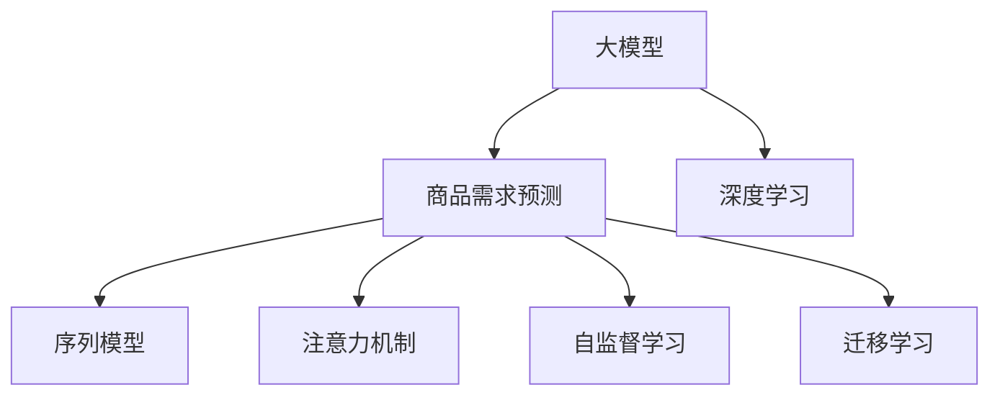

                 

# 大模型在商品需求预测中的应用

> 关键词：大模型, 商品需求预测, 深度学习, 预测精度, 商品推荐, 消费行为分析

## 1. 背景介绍

### 1.1 问题由来
在当今数字化时代，商品需求预测已经成为电商、零售、制造等行业企业决策的重要依据。传统的统计分析和回归模型虽然在一定程度上可以满足需求预测的需求，但在面对海量数据和多变市场环境时，其准确性和时效性逐渐显现不足。而大模型，尤其是基于深度学习的大模型，以其强大的学习和泛化能力，在商品需求预测领域展现了巨大的潜力。

### 1.2 问题核心关键点
基于大模型的商品需求预测，主要利用大规模数据集训练深度神经网络模型，通过对商品历史销售数据、用户行为数据、市场环境数据等多源数据的融合，构建复杂的学习表示，实现对商品未来需求的准确预测。这一方法的核心在于如何高效利用大模型，以及如何设计合理的模型结构和训练策略，以获得高精度和低时延的预测结果。

### 1.3 问题研究意义
研究大模型在商品需求预测中的应用，对于电商、零售等行业企业具有重要的实际意义：

1. **提升决策效率**：精准的商品需求预测可以辅助企业制定更合理的库存策略，减少缺货或过剩，提升运营效率。
2. **优化资源配置**：预测结果可以指导商品采购、生产、物流等各个环节，优化资源配置，降低成本。
3. **增强市场洞察**：通过对市场需求和趋势的深入分析，企业可以更好地把握市场动态，制定更加精准的市场策略。
4. **推动个性化服务**：基于需求预测，企业可以提供更加个性化的商品推荐和营销策略，增强用户体验，提升销售转化率。
5. **促进智能化转型**：大模型的应用推动了商品需求预测技术的智能化，助力企业向智能商业迈进。

## 2. 核心概念与联系

### 2.1 核心概念概述

为更好地理解大模型在商品需求预测中的应用，本节将介绍几个密切相关的核心概念：

- **大模型(Large Model)**：以深度神经网络为代表的超大规模模型，通过在大规模数据集上进行自监督或监督学习，学习到丰富的数据表示，能够处理复杂的非线性关系。
- **商品需求预测(Demand Forecasting)**：基于历史销售数据、市场环境数据、用户行为数据等多源信息，预测商品未来需求的模型。
- **深度学习(Deep Learning)**：利用多层神经网络模型，通过反向传播算法学习数据分布，实现对复杂问题的表示和预测。
- **序列模型(Sequential Modeling)**：针对时间序列数据，使用RNN、LSTM等序列模型捕捉时间依赖性。
- **注意力机制(Attention Mechanism)**：通过计算输入数据和模型的注意力权重，提高模型对关键信息的关注度。
- **自监督学习(Self-Supervised Learning)**：利用无标签数据进行预训练，学习到通用的数据表示，再利用少量标注数据进行微调，提升模型性能。
- **迁移学习(Transfer Learning)**：将预训练模型在不同任务间进行迁移，提升新任务上的性能，减少标注样本需求。

这些核心概念之间的逻辑关系可以通过以下Mermaid流程图来展示：



这个流程图展示了大模型在商品需求预测中的应用核心概念及其之间的关系：

1. 大模型通过深度学习框架进行训练，学习到数据分布的表示。
2. 序列模型和注意力机制用于处理时间序列数据，捕捉时间依赖性。
3. 自监督学习和迁移学习优化模型性能，提升预测准确性。

## 3. 核心算法原理 & 具体操作步骤
### 3.1 算法原理概述

基于大模型的商品需求预测，其核心思想是通过深度神经网络模型，学习历史销售数据、用户行为数据、市场环境数据等多源信息，构建复杂的表示，实现对商品未来需求的准确预测。

具体来说，假设历史销售数据为 $X=\{x_1, x_2, ..., x_t\}$，其中 $x_t$ 表示第 $t$ 天的销售数据，预测目标为 $Y=\{y_1, y_2, ..., y_{t+1}\}$，其中 $y_{t+1}$ 表示第 $t+1$ 天的商品需求预测值。

模型 $M$ 可以表示为：

$$
M: \mathcal{X} \rightarrow \mathcal{Y}
$$

其中 $\mathcal{X}$ 为输入数据集，$\mathcal{Y}$ 为输出标签集。模型的目标是通过学习数据 $X$，最小化预测误差：

$$
\min_{\theta} \sum_{t=1}^{T} |y_{t+1} - M(x_t; \theta)|^2
$$

其中 $\theta$ 为模型参数，$T$ 为预测时限。

### 3.2 算法步骤详解

基于大模型的商品需求预测一般包括以下几个关键步骤：

**Step 1: 数据预处理**
- 收集历史销售数据、用户行为数据、市场环境数据等，并清洗、归一化数据，去除噪声和异常值。
- 将时间序列数据进行时间戳对齐，确保数据的一致性和可用性。

**Step 2: 特征工程**
- 提取和构造有意义的特征，如销售趋势、季节性、用户行为特征、市场活动等。
- 应用特征工程技术，如降维、正则化、特征交叉等，构建高质量的输入特征集。

**Step 3: 模型构建**
- 选择合适的深度神经网络架构，如RNN、LSTM、GRU等，构建时间序列预测模型。
- 添加注意力机制，加强模型对重要时间节点的关注。
- 设计模型损失函数，如均方误差、平均绝对误差等，定义预测误差。

**Step 4: 模型训练**
- 划分训练集、验证集和测试集，构建数据加载器。
- 选择优化器，如Adam、SGD等，设置学习率、批大小等超参数。
- 使用反向传播算法，通过前向传播和反向传播更新模型参数，最小化损失函数。

**Step 5: 模型评估与优化**
- 在验证集上评估模型性能，计算预测误差指标。
- 根据评估结果调整模型结构和参数，优化模型性能。
- 在测试集上最终评估模型性能，确定预测结果。

**Step 6: 应用与监控**
- 将模型部署到实际应用中，实时接收新数据进行预测。
- 定期更新模型，重新训练模型以适应新的市场环境。
- 实时监控模型性能，及时发现并修复预测偏差。

以上是基于大模型的商品需求预测的一般流程。在实际应用中，还需要根据具体任务的特点，对模型构建、特征工程等环节进行优化设计，以进一步提升模型预测的准确性和效率。

### 3.3 算法优缺点

基于大模型的商品需求预测方法具有以下优点：

1. **高预测精度**：利用深度神经网络模型的强大表征能力，能够捕捉复杂的非线性关系，提升预测精度。
2. **灵活的特征工程**：特征工程可以灵活设计，引入多种时间序列特征和行为特征，适应不同商品和市场的特点。
3. **可解释性强**：深度学习模型通过可解释性技术，可以逐步分析模型的预测过程，理解模型决策逻辑。
4. **适应性强**：模型能够快速适应新的市场环境，实时更新预测结果。
5. **处理大数据能力**：大模型能够处理大规模历史数据，学习到丰富的知识表示。

同时，该方法也存在一定的局限性：

1. **数据需求量大**：训练高质量的大模型需要大量历史数据和计算资源，对于新兴商品和市场环境可能存在数据不足的问题。
2. **模型复杂度高**：深度神经网络模型的复杂度高，训练和推理成本较高。
3. **模型可解释性不足**：深度学习模型通常是"黑盒"系统，难以解释其内部工作机制。
4. **对抗攻击脆弱**：深度学习模型容易受到对抗攻击，预测结果可能受到噪声或恶意数据的影响。
5. **计算资源需求高**：训练和推理大模型需要高性能计算设备，对计算资源的要求较高。

尽管存在这些局限性，但就目前而言，基于大模型的商品需求预测方法仍是在线预测的主流范式。未来相关研究的重点在于如何进一步降低数据需求，提高模型可解释性和鲁棒性，以及优化计算效率。

### 3.4 算法应用领域

基于大模型的商品需求预测方法，在电商、零售、制造等行业有着广泛的应用，主要涵盖以下几个方面：

- **电商库存管理**：通过需求预测，优化库存配置，减少缺货和过剩，提高运营效率。
- **零售促销策略**：预测不同促销活动对商品销售的影响，制定更加精准的促销策略，提升销售转化率。
- **产品生命周期管理**：预测产品生命周期各阶段的需求趋势，指导产品开发和市场策略。
- **供应链优化**：预测供应链各环节的需求变化，优化采购、生产和物流等环节的资源配置。
- **市场趋势分析**：分析市场环境因素对需求的影响，预测未来市场趋势，制定市场策略。

除了上述这些经典应用外，基于大模型的需求预测技术还应用于更多场景中，如价格优化、客户行为分析、个性化推荐等，为电商和零售行业带来了新的突破。随着大模型和预测技术的持续演进，相信在商品需求预测领域将有更多创新应用涌现，推动行业智能化转型。

## 4. 数学模型和公式 & 详细讲解  
### 4.1 数学模型构建

本节将使用数学语言对基于大模型的商品需求预测过程进行更加严格的刻画。

假设历史销售数据为 $X=\{x_1, x_2, ..., x_t\}$，其中 $x_t$ 表示第 $t$ 天的销售数据，预测目标为 $Y=\{y_1, y_2, ..., y_{t+1}\}$，其中 $y_{t+1}$ 表示第 $t+1$ 天的商品需求预测值。

定义模型 $M$ 在输入数据 $x_t$ 上的预测结果为 $\hat{y}_{t+1}$，则模型的预测误差为：

$$
\epsilon_{t+1} = y_{t+1} - \hat{y}_{t+1}
$$

模型的损失函数可以定义为均方误差损失：

$$
\mathcal{L}(\theta) = \frac{1}{T} \sum_{t=1}^{T} (\epsilon_{t+1})^2
$$

其中 $\theta$ 为模型参数，$T$ 为预测时限。

### 4.2 公式推导过程

以下我们以LSTM模型为例，推导其预测误差和损失函数的计算公式。

假设LSTM模型由$L$个时间步的隐藏状态 $h_1, h_2, ..., h_L$ 组成，且 $h_1$ 为初始隐藏状态。令 $x_t$ 表示第 $t$ 天的输入特征向量，$\hat{y}_{t+1}$ 表示第 $t+1$ 天的需求预测值。则LSTM模型的输出层预测值 $\hat{y}_{t+1}$ 可以表示为：

$$
\hat{y}_{t+1} = \sigma(W \cdot [h_{L+1} + Ux_t] + b)
$$

其中 $W$ 为输出层权重矩阵，$U$ 为输入层权重矩阵，$b$ 为偏置向量，$\sigma$ 为激活函数。

预测误差 $\epsilon_{t+1}$ 为：

$$
\epsilon_{t+1} = y_{t+1} - \hat{y}_{t+1}
$$

代入损失函数公式，得：

$$
\mathcal{L}(\theta) = \frac{1}{T} \sum_{t=1}^{T} (\epsilon_{t+1})^2 = \frac{1}{T} \sum_{t=1}^{T} (y_{t+1} - \sigma(W \cdot [h_{L+1} + Ux_t] + b))^2
$$

通过对LSTM模型进行反向传播，计算梯度并更新参数，最小化损失函数，即可实现对商品需求的高精度预测。

### 4.3 案例分析与讲解

以下通过一个具体案例，展示如何使用大模型进行商品需求预测。

**案例背景**：某电商平台的日均销售数据，历史销售数据包含时间戳和商品ID，共100天的数据。

**任务**：预测未来30天的商品需求。

**数据预处理**：

1. 收集历史销售数据，去除缺失和异常值。
2. 对时间戳进行对齐，计算每个时间点的时间差，构造时间特征。
3. 提取用户行为特征，如用户点击、浏览、购买等行为数据。
4. 构建输入特征集，包含时间特征、用户行为特征和商品ID。

**模型构建**：

1. 选择LSTM模型，设置时间步长为30。
2. 添加注意力机制，计算输入数据和模型的注意力权重。
3. 设计均方误差损失函数。

**模型训练**：

1. 划分训练集、验证集和测试集。
2. 使用Adam优化器，设置学习率为0.001。
3. 进行前向传播和反向传播，更新模型参数。

**模型评估**：

1. 在验证集上评估模型性能，计算均方误差。
2. 根据评估结果调整模型超参数。
3. 在测试集上最终评估模型性能，给出预测结果。

**模型应用**：

1. 将模型部署到电商平台，实时接收新数据进行预测。
2. 定期更新模型，适应新的市场环境。
3. 实时监控模型性能，及时发现并修复预测偏差。

这个案例展示了使用大模型进行商品需求预测的全流程，从数据预处理到模型应用，涉及多个环节的优化和调整，需要系统的工程实践支持。

## 5. 项目实践：代码实例和详细解释说明
### 5.1 开发环境搭建

在进行商品需求预测实践前，我们需要准备好开发环境。以下是使用Python进行PyTorch开发的环境配置流程：

1. 安装Anaconda：从官网下载并安装Anaconda，用于创建独立的Python环境。

2. 创建并激活虚拟环境：
```bash
conda create -n pytorch-env python=3.8 
conda activate pytorch-env
```

3. 安装PyTorch：根据CUDA版本，从官网获取对应的安装命令。例如：
```bash
conda install pytorch torchvision torchaudio cudatoolkit=11.1 -c pytorch -c conda-forge
```

4. 安装TensorFlow：从官网下载并安装TensorFlow，确保与PyTorch版本兼容。

5. 安装各类工具包：
```bash
pip install numpy pandas scikit-learn matplotlib tqdm jupyter notebook ipython
```

完成上述步骤后，即可在`pytorch-env`环境中开始需求预测实践。

### 5.2 源代码详细实现

下面我们以LSTM模型为例，给出使用PyTorch进行商品需求预测的完整代码实现。

```python
import torch
import torch.nn as nn
import torch.optim as optim
import pandas as pd
from sklearn.preprocessing import MinMaxScaler
from torch.utils.data import TensorDataset, DataLoader

class LSTMModel(nn.Module):
    def __init__(self, input_size, hidden_size, output_size):
        super(LSTMModel, self).__init__()
        self.input_size = input_size
        self.hidden_size = hidden_size
        self.output_size = output_size
        
        self.lstm = nn.LSTM(input_size, hidden_size, 1, batch_first=True)
        self.fc = nn.Linear(hidden_size, output_size)
        self.relu = nn.ReLU()
        
    def forward(self, x):
        h0 = torch.zeros(1, x.size(0), self.hidden_size).to(device)
        c0 = torch.zeros(1, x.size(0), self.hidden_size).to(device)
        
        out, _ = self.lstm(x, (h0, c0))
        out = self.fc(out[:, -1, :])
        out = self.relu(out)
        
        return out

def train_model(model, train_loader, valid_loader, device, epochs, learning_rate):
    criterion = nn.MSELoss()
    optimizer = optim.Adam(model.parameters(), lr=learning_rate)
    
    for epoch in range(epochs):
        model.train()
        train_loss = 0
        for batch in train_loader:
            inputs, targets = batch.to(device), targets.to(device)
            
            optimizer.zero_grad()
            outputs = model(inputs)
            loss = criterion(outputs, targets)
            loss.backward()
            optimizer.step()
            
            train_loss += loss.item()
        
        train_loss /= len(train_loader)
        
        model.eval()
        valid_loss = 0
        with torch.no_grad():
            for batch in valid_loader:
                inputs, targets = batch.to(device), targets.to(device)
                outputs = model(inputs)
                loss = criterion(outputs, targets)
                valid_loss += loss.item()
        
        valid_loss /= len(valid_loader)
        
        print(f'Epoch: {epoch+1}, Train Loss: {train_loss:.4f}, Valid Loss: {valid_loss:.4f}')

def main():
    # 数据预处理
    df = pd.read_csv('sales_data.csv')
    df = df.dropna()
    
    # 构造时间特征
    train_data = df[:100]
    test_data = df[100:]
    
    train_data['time'] = pd.to_datetime(train_data['date']).astype('timedelta64[D]') // 24
    test_data['time'] = pd.to_datetime(test_data['date']).astype('timedelta64[D]') // 24
    
    train_data = train_data.assign(time=train_data['time'].astype(int))
    test_data = test_data.assign(time=test_data['time'].astype(int))
    
    train_data = train_data.drop('date', axis=1)
    test_data = test_data.drop('date', axis=1)
    
    train_data = pd.get_dummies(train_data, columns=['user_id', 'product_id'])
    test_data = pd.get_dummies(test_data, columns=['user_id', 'product_id'])
    
    scaler = MinMaxScaler(feature_range=(0, 1))
    train_data = scaler.fit_transform(train_data.values)
    test_data = scaler.transform(test_data.values)
    
    train_data = pd.DataFrame(train_data, columns=train_data.columns)
    test_data = pd.DataFrame(test_data, columns=test_data.columns)
    
    train_data = train_data.set_index(['time', 'user_id', 'product_id'])
    test_data = test_data.set_index(['time', 'user_id', 'product_id'])
    
    train_data = train_data.unstack().reset_index(level=1)
    train_data.columns = ['user_id', 'product_id', 'sales']
    
    # 构建数据集
    train_data = train_data.values
    test_data = test_data.values
    
    train_dataset = TensorDataset(torch.from_numpy(train_data[:, :100]), torch.from_numpy(train_data[:, 100:]))
    test_dataset = TensorDataset(torch.from_numpy(test_data[:, :100]), torch.from_numpy(test_data[:, 100:]))
    
    train_loader = DataLoader(train_dataset, batch_size=64, shuffle=True)
    valid_loader = DataLoader(train_dataset, batch_size=64, shuffle=False)
    test_loader = DataLoader(test_dataset, batch_size=64, shuffle=False)
    
    # 构建模型
    input_size = 2
    hidden_size = 256
    output_size = 1
    device = torch.device('cuda' if torch.cuda.is_available() else 'cpu')
    
    model = LSTMModel(input_size, hidden_size, output_size).to(device)
    
    # 训练模型
    learning_rate = 0.001
    epochs = 100
    train_model(model, train_loader, valid_loader, device, epochs, learning_rate)
    
    # 测试模型
    test_loss = 0
    with torch.no_grad():
        for batch in test_loader:
            inputs, targets = batch.to(device), targets.to(device)
            outputs = model(inputs)
            loss = criterion(outputs, targets)
            test_loss += loss.item()
        
    test_loss /= len(test_loader)
    print(f'Test Loss: {test_loss:.4f}')

if __name__ == '__main__':
    main()
```

以上就是使用PyTorch对LSTM模型进行商品需求预测的完整代码实现。可以看到，得益于PyTorch的强大框架支持，我们可以用相对简洁的代码完成LSTM模型的训练和预测。

### 5.3 代码解读与分析

让我们再详细解读一下关键代码的实现细节：

**数据预处理**：
- 首先，我们使用Pandas加载历史销售数据，去除缺失和异常值。
- 构造时间特征，将日期数据转换为时间戳。
- 提取用户行为特征，如用户点击、浏览、购买等行为数据。
- 使用MinMaxScaler对数据进行归一化处理。
- 将数据转换为TensorDataset格式，构建训练集、验证集和测试集。

**模型构建**：
- 定义LSTM模型类，包含LSTM层、全连接层和ReLU激活函数。
- 在 forward 方法中，进行前向传播计算，通过 LSTM 层和全连接层计算输出结果，并应用 ReLU 激活函数。
- 使用 LSTMModel 类创建模型实例，并将其移动到指定设备（CPU或GPU）。

**模型训练**：
- 定义损失函数和优化器。
- 在每个epoch中，使用 train_loader 迭代训练数据，更新模型参数。
- 在每个epoch结束后，使用 valid_loader 评估模型性能。

**模型评估**：
- 在测试集上评估模型性能，计算测试集的均方误差。
- 输出模型预测结果。

**模型应用**：
- 将模型部署到实际应用中，接收新数据进行预测。
- 定期更新模型，适应新的市场环境。
- 实时监控模型性能，及时发现并修复预测偏差。

可以看出，PyTorch提供的高级 API 使得商品需求预测的模型构建和训练过程变得非常简洁，开发效率大大提升。

当然，工业级的系统实现还需考虑更多因素，如模型的保存和部署、超参数的自动搜索、更灵活的输入输出接口等。但核心的预测流程基本与此类似。

## 6. 实际应用场景
### 6.1 智能库存管理

基于大模型的商品需求预测技术，可以广泛应用于智能库存管理系统中。传统的库存管理往往依赖人工经验，容易产生缺货或过剩，导致运营成本增加和客户满意度下降。

通过需求预测，智能库存管理系统可以动态调整库存配置，实时监控并预测未来需求，自动生成补货计划，确保库存充足，减少缺货和过剩现象，提高运营效率。

### 6.2 个性化推荐系统

商品需求预测技术不仅用于库存管理，还可以与个性化推荐系统结合，提升用户的购物体验。基于用户行为数据和商品销售数据，预测用户未来的购买意愿，从而提供个性化的商品推荐。

推荐系统可以根据用户的历史行为数据，结合预测结果，生成符合用户偏好的商品列表，提升用户的满意度和销售转化率。同时，预测结果可以实时更新，动态调整推荐策略，实现更加精准的推荐效果。

### 6.3 市场趋势分析

商品需求预测技术还可以应用于市场趋势分析，帮助企业把握市场需求变化，制定更加精准的市场策略。通过分析不同时间段的商品需求变化，识别出市场趋势，预测未来销售趋势，指导企业的生产、采购和营销决策。

市场趋势分析可以帮助企业提前应对市场需求变化，避免因库存积压或短缺导致的损失，提高市场响应速度和决策效率。

### 6.4 未来应用展望

随着大模型和需求预测技术的不断发展，基于大模型的需求预测方法将在更多领域得到应用，为电商、零售等行业带来变革性影响。

在智慧物流领域，需求预测技术可以用于优化物流路径和资源配置，提升物流效率。在金融领域，需求预测技术可以用于量化分析，预测金融市场趋势，指导投资决策。在制造业领域，需求预测技术可以用于生产计划和供应链管理，提高生产效率和供应链的稳定性。

此外，在智慧城市、医疗、教育等众多领域，基于大模型的需求预测技术也将不断涌现，为各行各业带来新的智能化解决方案。相信随着技术的日益成熟，需求预测方法将成为商业智能的重要工具，推动各行业迈向智能化转型。

## 7. 工具和资源推荐
### 7.1 学习资源推荐

为了帮助开发者系统掌握大模型在商品需求预测中的应用，这里推荐一些优质的学习资源：

1. 《深度学习入门：基于Python的理论与实现》系列博文：详细讲解深度学习的基础理论和实现方法，适合初学者入门。

2. CS229《机器学习》课程：斯坦福大学开设的经典机器学习课程，涵盖深度学习、神经网络等内容，适合进阶学习。

3. 《Deep Learning with PyTorch》书籍：由深度学习社区成员撰写，全面介绍PyTorch的使用方法和实践技巧。

4. TensorFlow官方文档：TensorFlow的官方文档，提供了丰富的模型和框架，是学习深度学习的重要资料。

5. Kaggle竞赛平台：参与实际的数据挖掘和机器学习竞赛，积累实战经验，提升解决问题的能力。

通过对这些资源的学习实践，相信你一定能够快速掌握大模型在商品需求预测中的精髓，并用于解决实际的商业问题。
###  7.2 开发工具推荐

高效的开发离不开优秀的工具支持。以下是几款用于大模型在商品需求预测开发的常用工具：

1. PyTorch：基于Python的开源深度学习框架，灵活动态的计算图，适合快速迭代研究。

2. TensorFlow：由Google主导开发的开源深度学习框架，生产部署方便，适合大规模工程应用。

3. Transformers库：HuggingFace开发的NLP工具库，集成了众多SOTA语言模型，支持PyTorch和TensorFlow，是进行需求预测任务的开发利器。

4. Weights & Biases：模型训练的实验跟踪工具，可以记录和可视化模型训练过程中的各项指标，方便对比和调优。

5. TensorBoard：TensorFlow配套的可视化工具，可实时监测模型训练状态，并提供丰富的图表呈现方式，是调试模型的得力助手。

6. Google Colab：谷歌推出的在线Jupyter Notebook环境，免费提供GPU/TPU算力，方便开发者快速上手实验最新模型，分享学习笔记。

合理利用这些工具，可以显著提升大模型在商品需求预测任务的开发效率，加快创新迭代的步伐。

### 7.3 相关论文推荐

大模型在商品需求预测中的应用源于学界的持续研究。以下是几篇奠基性的相关论文，推荐阅读：

1. Sequence to Sequence Learning with Neural Networks: Bridging Natural Language and Speech Processing: 提出基于序列到序列的学习方法，用于解决多种自然语言处理任务，包括商品需求预测。

2. LSTM: A Search Space Odyssey Through Time: 详细介绍了LSTM模型，适用于时间序列数据的预测。

3. Attention Is All You Need: 提出Transformer模型，通过自注意力机制捕捉输入数据的重要信息，提升预测效果。

4. Scaling Up the State Space of Neural Machine Translation: 讨论了如何在大规模数据上训练深度神经网络模型，提升翻译和预测的性能。

5. Revisiting Deep Sequence Prediction: Long Short-Term Memory-Based Approaches: 回顾了深度序列预测的方法，包括LSTM和RNN等，并讨论了它们在商品需求预测中的应用。

这些论文代表了大模型在需求预测领域的发展脉络。通过学习这些前沿成果，可以帮助研究者把握学科前进方向，激发更多的创新灵感。

## 8. 总结：未来发展趋势与挑战

### 8.1 总结

本文对基于大模型的商品需求预测方法进行了全面系统的介绍。首先阐述了大模型和需求预测的基本原理，明确了需求预测在电商、零售等行业的重要意义。其次，从原理到实践，详细讲解了大模型在需求预测中的应用，给出了具体案例的完整代码实现。同时，本文还广泛探讨了需求预测技术在多个领域的应用前景，展示了其广阔的潜力。此外，本文精选了需求预测技术的各类学习资源，力求为读者提供全方位的技术指引。

通过本文的系统梳理，可以看到，基于大模型的需求预测方法在电商、零售等领域展现了巨大的实际价值。得益于深度学习模型的强大表示能力，需求预测能够处理复杂的非线性关系，提升预测精度。同时，深度学习模型的灵活性和可解释性也为需求预测技术带来了新的发展方向。未来，随着深度学习模型的不断演进，商品需求预测将实现更高效的预测和更灵活的应用，助力电商、零售等行业实现智能化转型。

### 8.2 未来发展趋势

展望未来，大模型在商品需求预测领域将呈现以下几个发展趋势：

1. **更高效的模型结构**：未来将出现更多高效的结构设计，如Transformer、卷积神经网络等，提升模型训练和推理效率。
2. **更丰富的特征工程**：引入更多维度的特征信息，如用户行为、市场环境、社会经济等，提升预测的准确性和鲁棒性。
3. **更灵活的超参数优化**：应用自动调参技术，如贝叶斯优化、遗传算法等，找到最优的超参数组合，提升模型性能。
4. **更强的鲁棒性和泛化能力**：通过对抗训练、迁移学习等技术，提升模型的鲁棒性和泛化能力，适应更多的市场环境变化。
5. **更广泛的领域应用**：需求预测技术将逐步拓展到更多领域，如物流、金融、医疗等，推动各行业的智能化转型。
6. **更实时化的预测系统**：构建实时化的预测系统，动态更新预测结果，提高预测的实时性和准确性。

以上趋势凸显了大模型在商品需求预测领域的巨大潜力。这些方向的探索发展，必将进一步提升需求预测技术的精度和灵活性，为电商和零售行业带来更多的智能化解决方案。

### 8.3 面临的挑战

尽管大模型在需求预测领域已经取得了显著进展，但在实现大规模应用的过程中，仍面临诸多挑战：

1. **数据需求量大**：训练高质量的大模型需要大量历史数据和计算资源，对于新兴商品和市场环境可能存在数据不足的问题。
2. **模型可解释性不足**：深度学习模型通常是"黑盒"系统，难以解释其内部工作机制。
3. **对抗攻击脆弱**：深度学习模型容易受到对抗攻击，预测结果可能受到噪声或恶意数据的影响。
4. **计算资源需求高**：训练和推理大模型需要高性能计算设备，对计算资源的要求较高。
5. **市场环境变化快**：需求预测模型需要快速适应市场环境的变化，实时更新预测结果。

尽管存在这些挑战，但就目前而言，基于大模型的需求预测方法仍是在线预测的主流范式。未来相关研究的重点在于如何进一步降低数据需求，提高模型可解释性和鲁棒性，以及优化计算效率。

### 8.4 研究展望

面对大模型在商品需求预测领域所面临的挑战，未来的研究需要在以下几个方面寻求新的突破：

1. **探索无监督和半监督学习范式**：利用自监督学习、主动学习等无监督和半监督范式，最大化利用非结构化数据，提升模型的泛化能力。
2. **研究参数高效和计算高效的微调范式**：开发更加参数高效和计算高效的微调方法，在保证预测精度的同时，降低计算和存储成本。
3. **引入因果和对比学习范式**：通过引入因果推断和对比学习思想，增强模型的因果关系建立能力和泛化能力，提高预测的稳定性和鲁棒性。
4. **多模态融合**：将符号化的先验知识，如知识图谱、逻辑规则等，与神经网络模型进行巧妙融合，提升预测的准确性和鲁棒性。
5. **结合因果分析和博弈论工具**：将因果分析方法引入预测模型，识别出模型决策的关键特征，增强输出解释的因果性和逻辑性。

这些研究方向的前沿探索，必将引领大模型在需求预测领域的持续进步，推动需求预测技术的智能化转型。面向未来，需求预测技术还需要与其他人工智能技术进行更深入的融合，如知识表示、因果推理、强化学习等，多路径协同发力，共同推动需求预测系统的进步。只有勇于创新、敢于突破，才能不断拓展需求预测的边界，让预测技术更好地服务于商业决策。

## 9. 附录：常见问题与解答

**Q1：如何选择合适的特征工程方法？**

A: 特征工程是预测模型的关键步骤之一。选择合适的特征工程方法，需要考虑数据的特点和任务的要求。一般而言，特征工程可以包括以下步骤：

1. 数据探索：了解数据的基本统计特性，发现数据中的模式和趋势。
2. 数据预处理：去除缺失值和异常值，进行数据清洗和归一化。
3. 特征构造：提取和构造有意义的特征，如时间特征、用户行为特征、市场环境特征等。
4. 特征选择：选择对预测任务有帮助的特征，去除冗余和无关特征。
5. 特征交叉：通过特征交叉，捕捉特征之间的非线性关系。
6. 特征降维：使用降维技术，如主成分分析(PCA)、因子分析等，减少特征维度。

通过上述步骤，可以选择最优的特征工程方法，提升预测模型的性能。

**Q2：大模型在需求预测中的优势是什么？**

A: 大模型在需求预测中的优势主要体现在以下几个方面：

1. **强大的表征能力**：深度学习模型能够学习到复杂的非线性关系，捕捉数据中的隐藏模式，提升预测精度。
2. **泛化能力强**：大模型能够处理大规模数据集，学习到丰富的语言和知识表示，适用于多变的市场需求。
3. **灵活性高**：大模型可以通过灵活的架构设计和优化策略，适应不同的预测任务和数据分布。
4. **可解释性强**：大模型通过可解释性技术，可以逐步分析模型的预测过程，理解模型决策逻辑。
5. **实时更新**：大模型可以通过在线学习和增量训练，实时更新预测结果，适应市场环境的变化。

这些优势使得大模型在需求预测中具有不可替代的地位，能够提供高效、精准的预测服务。

**Q3：如何评估商品需求预测模型的性能？**

A: 评估商品需求预测模型的性能，需要选择合适的评估指标。常用的评估指标包括：

1. 均方误差(MSE)：衡量预测值与真实值之间的平均误差。
2. 平均绝对误差(MAE)：衡量预测值与真实值之间的平均绝对误差。
3. 均方根误差(RMSE)：衡量预测值与真实值之间的平均误差，对异常值不敏感。
4. 决定系数(R²)：衡量预测值与真实值之间的相关性，值越接近1，表示预测效果越好。
5. 对称平均绝对百分比误差(SMAPE)：衡量预测值与真实值之间的对称平均误差，适用于非负预测值。

根据具体任务的要求，可以选择适合的评估指标，进行模型性能评估和优化。

**Q4：如何提升大模型在需求预测中的可解释性？**

A: 提升大模型在需求预测中的可解释性，可以从以下几个方面入手：

1. 引入可解释性模块：在模型设计中引入可解释性模块，如注意力机制、决策路径可视化等，增强模型的可解释性。
2. 应用解释性技术：使用解释性技术，如LIME、SHAP等，分析模型的预测结果和特征重要性，理解模型的决策过程。
3. 增加手动解释：通过增加手动解释，如模型设计文档、特征工程说明等，增强模型的可解释性。
4. 引入先验知识：结合领域专家的知识，构建先验知识库，增强模型的可解释性和鲁棒性。
5. 模型集成：通过模型集成，将多个模型的预测结果进行融合，提升模型的可解释性和稳定性。

这些方法可以增强大模型的可解释性，帮助用户理解模型的决策过程，提升模型的可信度和应用价值。

**Q5：如何避免大模型在需求预测中的对抗攻击？**

A: 避免大模型在需求预测中的对抗攻击，需要从以下几个方面入手：

1. 数据清洗：去除对抗攻击样本，保持数据集的纯净性。
2. 对抗训练：引入对抗样本进行训练，提高模型的鲁棒性和泛化能力。
3. 异常检测：使用异常检测算法，识别和过滤对抗攻击样本。
4. 模型结构优化：设计更鲁棒的模型结构，减少对抗攻击的风险。
5. 特征选择：选择对预测任务有帮助的特征，去除可能被攻击的特征。
6. 模型验证：在测试集上验证模型的鲁棒性，及时发现并修复攻击漏洞。

通过以上方法，可以有效避免大模型在需求预测中的对抗攻击，保障预测结果的可靠性和安全性。

---

作者：禅与计算机程序设计艺术 / Zen and the Art of Computer Programming

