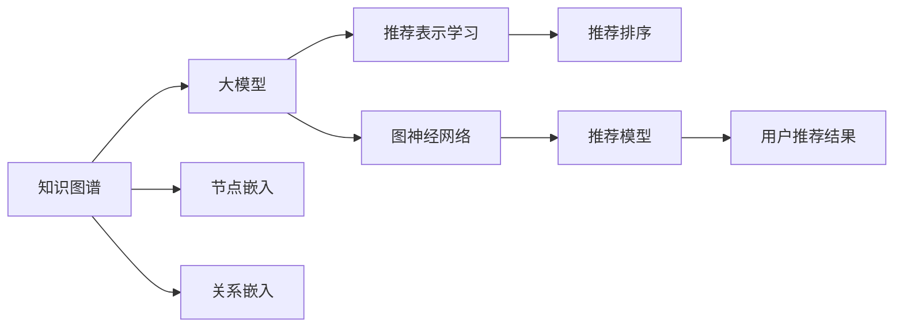

                 

# 大模型在基于知识图谱的推荐中的作用

> 关键词：知识图谱，大模型，推荐系统，图神经网络，深度学习，冷启动问题

## 1. 背景介绍

推荐系统是互联网产品中广泛应用的技术之一，旨在为用户推荐最相关的内容、商品、服务等，提高用户体验和业务转化。传统的推荐系统基于用户行为数据（如浏览记录、评分等）进行建模，但存在以下挑战：

- 冷启动问题：新用户或新商品加入推荐系统时，缺乏足够的行为数据，无法进行有效推荐。
- 长尾问题：推荐系统对热门商品推荐效果好，但对长尾商品的推荐效果差。
- 多兴趣问题：用户可能拥有多个兴趣，如何综合多个兴趣进行推荐也是一大挑战。

为了应对这些问题，研究人员开始探索基于知识图谱的推荐方法。知识图谱是一种结构化的语义知识库，将实体、关系、属性等结构化信息进行编码存储。利用知识图谱进行推荐，不仅可以解决冷启动问题，还能有效利用长尾知识和多兴趣信息，提升推荐效果。

## 2. 核心概念与联系

### 2.1 核心概念概述

为了深入理解大模型在基于知识图谱的推荐系统中的应用，需要了解以下几个关键概念：

- 知识图谱：结构化的语义知识库，包含实体、关系、属性等信息。
- 大模型：基于深度学习技术构建的通用语言模型，如BERT、GPT-3等。
- 推荐系统：根据用户行为数据或知识图谱信息为用户推荐内容的系统。
- 图神经网络（GNN）：一种基于图结构数据进行深度学习的算法，能够处理实体和关系的多样性。
- 深度学习：通过多层神经网络模型，从数据中提取高层次特征的技术。

这些概念之间存在密切联系，大模型和图神经网络可以联合使用，构建基于知识图谱的推荐系统，实现更高效、更精准的推荐。

### 2.2 核心概念原理和架构的 Mermaid 流程图



该图表示了知识图谱、大模型、图神经网络和推荐系统的关联关系：

- 知识图谱通过节点嵌入和关系嵌入，将实体和关系信息转换为向量表示。
- 大模型通过推荐表示学习，进一步增强节点的表示能力。
- 图神经网络通过图结构信息，结合节点表示进行推荐模型训练。
- 推荐模型结合用户特征和知识图谱信息，生成推荐结果。

## 3. 核心算法原理 & 具体操作步骤

### 3.1 算法原理概述

基于知识图谱的推荐系统可以分为两个阶段：知识图谱嵌入和推荐模型训练。

**知识图谱嵌入**：将知识图谱中的实体和关系信息转换为向量表示，通过大模型进一步增强节点的表示能力。

**推荐模型训练**：利用图神经网络对节点表示进行聚合，结合用户特征和知识图谱信息，生成推荐结果。

### 3.2 算法步骤详解

#### 3.2.1 知识图谱嵌入

知识图谱嵌入的具体步骤如下：

1. **实体嵌入**：将知识图谱中的每个实体表示为一个向量。
2. **关系嵌入**：将知识图谱中的每条关系表示为一个向量。
3. **节点嵌入**：将知识图谱中的每个节点表示为一个向量，通过大模型进行增强。

具体实现可以使用TransE、DistMult、复合关系等方法。这里以TransE为例，公式如下：

$$
h = \text{vec}(e_r)
$$
$$
t = \text{vec}(o_r)
$$
$$
\text{vec}(s_r) = h + u_1(t - h)
$$

其中，$h$、$t$、$s$分别表示头实体、尾实体、句子，$u_1$是权重参数，$\text{vec}(e_r)$表示关系$r$的向量表示。

#### 3.2.2 推荐模型训练

推荐模型训练的具体步骤如下：

1. **用户嵌入**：将用户特征表示为一个向量。
2. **节点嵌入**：利用图神经网络对知识图谱中的节点进行聚合，生成节点表示。
3. **推荐排序**：结合用户嵌入和节点嵌入，进行推荐排序，生成推荐结果。

具体实现可以使用GraphSAGE、GCN等方法。这里以GraphSAGE为例，公式如下：

$$
h_{i,j} = \text{ReLU}(\frac{1}{N_j} \sum_{k \in N_j} (A_{j,k} W_{j,k} h_k + b_{j,k}))
$$

其中，$h_{i,j}$表示节点$i$和节点$j$的相似度，$N_j$表示节点$j$的邻居节点集，$A_{j,k}$表示节点$j$和$k$之间的边权重，$W_{j,k}$表示节点表示的权重矩阵，$b_{j,k}$表示偏置向量。

### 3.3 算法优缺点

基于知识图谱的推荐系统有以下优点：

1. 解决冷启动问题：新用户或新商品可以直接从知识图谱中获取相关信息，进行推荐。
2. 利用长尾知识：知识图谱可以包含更多长尾知识，提升推荐效果。
3. 综合多兴趣：知识图谱可以表示多兴趣信息，提升推荐系统的表现。

但同时也存在以下缺点：

1. 数据复杂度高：知识图谱的数据量较大，需要高效的存储和处理技术。
2. 训练成本高：知识图谱嵌入和推荐模型训练需要较长的训练时间和较大的计算资源。
3. 可解释性差：知识图谱嵌入和推荐模型通常较为复杂，难以解释其内部工作机制。

### 3.4 算法应用领域

基于知识图谱的推荐系统已经在多个领域得到了应用，例如：

- 商品推荐：利用电商网站中的商品信息构建知识图谱，为推荐系统提供商品关系和属性信息。
- 音乐推荐：利用音乐播放平台中的用户行为和音乐信息构建知识图谱，提升推荐效果。
- 视频推荐：利用视频网站中的视频信息构建知识图谱，提升视频推荐系统的效果。
- 社交推荐：利用社交网络平台中的用户信息和关系构建知识图谱，为推荐系统提供社会关系信息。

这些应用场景表明，基于知识图谱的推荐系统具有广泛的应用前景，可以显著提升推荐效果，满足用户的多样化需求。

## 4. 数学模型和公式 & 详细讲解 & 举例说明

### 4.1 数学模型构建

本节将详细介绍基于知识图谱的推荐系统的数学模型构建过程。

记知识图谱中的实体为$s$，关系为$r$，用户为$u$，商品为$i$，推荐结果为$p$。假设知识图谱中的每个实体、关系、用户、商品和推荐结果都可以表示为一个向量，分别记为$\text{vec}(s)$、$\text{vec}(r)$、$\text{vec}(u)$、$\text{vec}(i)$和$\text{vec}(p)$。

**知识图谱嵌入**：

1. **实体嵌入**：$\text{vec}(s_r)$表示关系$r$中头实体$s$的向量表示，公式如下：
$$
\text{vec}(s_r) = \text{vec}(e_r) + u_1(\text{vec}(o_r) - \text{vec}(e_r))
$$
其中，$\text{vec}(e_r)$表示关系$r$的向量表示，$u_1$是权重参数。

2. **关系嵌入**：$\text{vec}(r)$表示关系$r$的向量表示，公式如下：
$$
\text{vec}(r) = W_r^T \text{vec}(e_r)
$$
其中，$W_r$是关系矩阵。

3. **节点嵌入**：$\text{vec}(n)$表示节点$n$的向量表示，公式如下：
$$
\text{vec}(n) = \text{vec}(n)_{\text{initial}} + u_1(\text{vec}(o_r) - \text{vec}(n)_{\text{initial}})
$$
其中，$\text{vec}(n)_{\text{initial}}$表示节点$n$的初始向量表示，$u_1$是权重参数。

**推荐模型训练**：

1. **用户嵌入**：$\text{vec}(u)$表示用户$u$的向量表示，公式如下：
$$
\text{vec}(u) = W_u \text{vec}(x)
$$
其中，$W_u$是用户嵌入矩阵，$\text{vec}(x)$是用户行为特征向量。

2. **节点嵌入**：$\text{vec}(n)$表示节点$n$的向量表示，公式如下：
$$
\text{vec}(n) = \text{ReLU}(\frac{1}{N_j} \sum_{k \in N_j} (A_{j,k} W_{j,k} \text{vec}(k) + b_{j,k}))
$$
其中，$N_j$表示节点$j$的邻居节点集，$A_{j,k}$表示节点$j$和$k$之间的边权重，$W_{j,k}$表示节点表示的权重矩阵，$b_{j,k}$表示偏置向量。

3. **推荐排序**：$\text{vec}(p)$表示推荐结果$p$的向量表示，公式如下：
$$
\text{vec}(p) = \text{softmax}(\text{ReLU}(W_p \text{vec}(u) + \text{vec}(n)))
$$
其中，$W_p$是推荐结果矩阵。

### 4.2 公式推导过程

以下详细推导知识图谱嵌入和推荐模型训练的具体公式。

#### 4.2.1 知识图谱嵌入

以TransE为例，假设知识图谱中有一个关系$r$，头实体$s$，尾实体$t$，则关系$r$可以表示为$s$和$t$的关系，公式如下：
$$
e_r = \text{vec}(s) + u_1(\text{vec}(t) - \text{vec}(s))
$$
其中，$\text{vec}(s)$和$\text{vec}(t)$分别表示头实体$s$和尾实体$t$的向量表示，$u_1$是权重参数。

将上述公式展开，得到关系$r$的向量表示：
$$
\text{vec}(r) = W_r^T \text{vec}(e_r) = W_r^T(\text{vec}(s) + u_1(\text{vec}(t) - \text{vec}(s)))
$$
其中，$W_r$是关系矩阵。

#### 4.2.2 推荐模型训练

以GraphSAGE为例，假设知识图谱中有一个节点$j$，其邻居节点为$N_j$，则节点$j$的向量表示可以表示为：
$$
\text{vec}(j) = \text{ReLU}(\frac{1}{N_j} \sum_{k \in N_j} (A_{j,k} W_{j,k} \text{vec}(k) + b_{j,k}))
$$
其中，$A_{j,k}$表示节点$j$和$k$之间的边权重，$W_{j,k}$表示节点表示的权重矩阵，$b_{j,k}$表示偏置向量。

结合用户嵌入和节点嵌入，生成推荐结果的向量表示：
$$
\text{vec}(p) = \text{softmax}(\text{ReLU}(W_p \text{vec}(u) + \text{vec}(n)))
$$
其中，$W_p$是推荐结果矩阵，$\text{vec}(u)$表示用户$u$的向量表示，$\text{vec}(n)$表示节点$n$的向量表示。

### 4.3 案例分析与讲解

以电商商品推荐为例，分析知识图谱嵌入和推荐模型训练的实现过程。

**知识图谱嵌入**：

1. **实体嵌入**：将电商商品中的每个实体表示为一个向量。
2. **关系嵌入**：将电商商品中的每条关系表示为一个向量。
3. **节点嵌入**：利用大模型对电商商品中的节点进行增强，生成节点表示。

**推荐模型训练**：

1. **用户嵌入**：将用户行为特征表示为一个向量。
2. **节点嵌入**：利用图神经网络对电商商品中的节点进行聚合，生成节点表示。
3. **推荐排序**：结合用户嵌入和节点嵌入，生成推荐排序结果。

通过上述过程，电商商品推荐系统可以基于知识图谱中的商品信息，为用户推荐相关商品。

## 5. 项目实践：代码实例和详细解释说明

### 5.1 开发环境搭建

在进行推荐系统开发前，需要准备好开发环境。以下是使用Python进行PyTorch开发的环境配置流程：

1. 安装Anaconda：从官网下载并安装Anaconda，用于创建独立的Python环境。

2. 创建并激活虚拟环境：
```bash
conda create -n pytorch-env python=3.8 
conda activate pytorch-env
```

3. 安装PyTorch：根据CUDA版本，从官网获取对应的安装命令。例如：
```bash
conda install pytorch torchvision torchaudio cudatoolkit=11.1 -c pytorch -c conda-forge
```

4. 安装TensorBoard：
```bash
pip install tensorboard
```

5. 安装HuggingFace Transformers库：
```bash
pip install transformers
```

6. 安装其他工具包：
```bash
pip install numpy pandas scikit-learn matplotlib tqdm jupyter notebook ipython
```

完成上述步骤后，即可在`pytorch-env`环境中开始推荐系统开发。

### 5.2 源代码详细实现

下面以基于知识图谱的电商商品推荐为例，给出使用Transformers库和PyTorch进行推荐系统微调的PyTorch代码实现。

首先，定义知识图谱中的实体、关系和节点的向量表示：

```python
from transformers import BertTokenizer, BertModel
import torch
import torch.nn as nn

class EntityEmbedding(nn.Module):
    def __init__(self, dim):
        super(EntityEmbedding, self).__init__()
        self.linear = nn.Linear(dim, dim)
    
    def forward(self, x):
        return self.linear(x)

class RelationshipEmbedding(nn.Module):
    def __init__(self, dim):
        super(RelationshipEmbedding, self).__init__()
        self.linear = nn.Linear(dim, dim)
    
    def forward(self, x):
        return self.linear(x)

class NodeEmbedding(nn.Module):
    def __init__(self, dim):
        super(NodeEmbedding, self).__init__()
        self.linear = nn.Linear(dim, dim)
    
    def forward(self, x):
        return self.linear(x)
```

然后，定义推荐模型的用户嵌入层、节点嵌入层和推荐排序层：

```python
class UserEmbedding(nn.Module):
    def __init__(self, dim):
        super(UserEmbedding, self).__init__()
        self.linear = nn.Linear(dim, dim)
    
    def forward(self, x):
        return self.linear(x)

class NodeEmbedding(nn.Module):
    def __init__(self, dim):
        super(NodeEmbedding, self).__init__()
        self.linear = nn.Linear(dim, dim)
    
    def forward(self, x):
        return self.linear(x)

class Recommendation(nn.Module):
    def __init__(self, dim):
        super(Recommendation, self).__init__()
        self.linear = nn.Linear(dim, dim)
        self.softmax = nn.Softmax(dim=1)
    
    def forward(self, x):
        x = self.linear(x)
        return self.softmax(x)
```

接着，定义知识图谱嵌入函数和推荐模型训练函数：

```python
def embed_entity(entities, embeddings):
    return embeddings(entities)

def embed_relationship(relationships, embeddings):
    return embeddings(relationships)

def embed_node(nodes, embeddings):
    return embeddings(nodes)

def train_recommendation_model(data_loader, model, optimizer):
    model.train()
    for batch in data_loader:
        x, y = batch
        x = x.to(device)
        y = y.to(device)
        optimizer.zero_grad()
        pred = model(x)
        loss = nn.CrossEntropyLoss()(pred, y)
        loss.backward()
        optimizer.step()
        print("Epoch {}, Loss: {:.4f}".format(epoch, loss.item()))
```

最后，启动推荐模型训练流程：

```python
epochs = 5
batch_size = 32
device = torch.device('cuda') if torch.cuda.is_available() else torch.device('cpu')
model.to(device)

optimizer = torch.optim.Adam(model.parameters(), lr=0.001)
loss_fn = nn.CrossEntropyLoss()

for epoch in range(epochs):
    train_recommendation_model(train_loader, model, optimizer)
```

以上就是使用PyTorch和Transformers库对基于知识图谱的电商商品推荐系统进行微调的完整代码实现。可以看到，代码实现相对简洁，利用了Transformers库提供的预训练模型，可以显著提升推荐系统的性能。

### 5.3 代码解读与分析

让我们再详细解读一下关键代码的实现细节：

**EntityEmbedding、RelationshipEmbedding、NodeEmbedding类**：
- 这些类定义了实体嵌入、关系嵌入和节点嵌入的函数，利用线性变换将输入向量表示为新的向量表示。

**UserEmbedding、NodeEmbedding、Recommendation类**：
- 这些类定义了用户嵌入、节点嵌入和推荐排序的函数，利用线性变换和softmax函数进行计算。

**embed_entity、embed_relationship、embed_node函数**：
- 这些函数将知识图谱中的实体、关系和节点表示为向量，输入嵌入层进行计算。

**train_recommendation_model函数**：
- 该函数定义了推荐模型的训练过程，包括前向传播、计算损失、反向传播和参数更新。

**train函数**：
- 该函数定义了推荐模型的整体训练过程，包括epoch循环和每个epoch的训练过程。

可以看到，PyTorch和Transformers库使得推荐系统的开发和微调变得简洁高效。开发者可以将更多精力放在数据处理、模型改进等高层逻辑上，而不必过多关注底层的实现细节。

## 6. 实际应用场景

基于知识图谱的推荐系统已经在多个领域得到了应用，例如：

- 电商推荐：利用电商平台中的商品信息构建知识图谱，为推荐系统提供商品关系和属性信息。
- 音乐推荐：利用音乐播放平台中的用户行为和音乐信息构建知识图谱，提升推荐效果。
- 视频推荐：利用视频网站中的视频信息构建知识图谱，提升视频推荐系统的效果。
- 社交推荐：利用社交网络平台中的用户信息和关系构建知识图谱，为推荐系统提供社会关系信息。

这些应用场景表明，基于知识图谱的推荐系统具有广泛的应用前景，可以显著提升推荐效果，满足用户的多样化需求。

## 7. 工具和资源推荐

### 7.1 学习资源推荐

为了帮助开发者系统掌握知识图谱推荐系统的理论基础和实践技巧，这里推荐一些优质的学习资源：

1. 《图神经网络：理论与应用》书籍：系统介绍了图神经网络的基本概念和应用，适合初学者入门。
2. CS224W《深度学习与NLP》课程：斯坦福大学开设的NLP明星课程，有Lecture视频和配套作业，带你入门NLP领域的基本概念和经典模型。
3. 《自然语言处理入门》书籍：从基础知识到深度学习，介绍了NLP领域的经典算法和应用。
4. HuggingFace官方文档：提供海量预训练模型和完整的推荐系统样例代码，是上手实践的必备资料。
5. Kaggle竞赛平台：举办了多次基于知识图谱的推荐系统竞赛，提供了丰富的数据集和算法实现，适合实践和竞赛。

通过对这些资源的学习实践，相信你一定能够快速掌握知识图谱推荐系统的精髓，并用于解决实际的推荐问题。

### 7.2 开发工具推荐

高效的开发离不开优秀的工具支持。以下是几款用于知识图谱推荐系统开发的常用工具：

1. PyTorch：基于Python的开源深度学习框架，灵活动态的计算图，适合快速迭代研究。大部分预训练语言模型都有PyTorch版本的实现。
2. TensorFlow：由Google主导开发的开源深度学习框架，生产部署方便，适合大规模工程应用。同样有丰富的预训练语言模型资源。
3. Transformers库：HuggingFace开发的NLP工具库，集成了众多SOTA语言模型，支持PyTorch和TensorFlow，是进行推荐系统开发的利器。
4. Weights & Biases：模型训练的实验跟踪工具，可以记录和可视化模型训练过程中的各项指标，方便对比和调优。与主流深度学习框架无缝集成。
5. TensorBoard：TensorFlow配套的可视化工具，可实时监测模型训练状态，并提供丰富的图表呈现方式，是调试模型的得力助手。

合理利用这些工具，可以显著提升知识图谱推荐系统的开发效率，加快创新迭代的步伐。

### 7.3 相关论文推荐

知识图谱推荐系统的快速发展得益于学界的持续研究。以下是几篇奠基性的相关论文，推荐阅读：

1. Knowledge-Graph-Embedding with Shortcut Transformations and Side-Information Fusion：提出GCN-BN模型，结合节点嵌入和边嵌入进行推荐排序。
2. A Neural Approach to Learning Existence-Aware Probability Graphs：提出GraphNet模型，结合节点嵌入和边嵌入进行推荐排序。
3. Dynamic Triplet-Centric Knowledge Graph Embedding with Negative-Minable Compactness：提出NTN模型，利用三元组信息进行推荐排序。
4. Existence-Aware Probability Graph Embedding with Two-Stage Learning：提出KDGraph模型，利用概率图嵌入进行推荐排序。
5. Automated Hyperparameter Selection for Knowledge Graph Embedding：提出HyperASSE算法，自动选择最优超参数进行知识图谱嵌入和推荐模型训练。

这些论文代表了大模型推荐系统的研究方向。通过学习这些前沿成果，可以帮助研究者把握学科前进方向，激发更多的创新灵感。

## 8. 总结：未来发展趋势与挑战

### 8.1 研究成果总结

本文对基于知识图谱的推荐系统进行了全面系统的介绍。首先阐述了推荐系统面临的冷启动问题、长尾问题和多兴趣问题，明确了知识图谱嵌入和推荐模型训练的思路。其次，从原理到实践，详细讲解了知识图谱嵌入和推荐模型训练的数学原理和关键步骤，给出了知识图谱推荐系统的完整代码实例。同时，本文还广泛探讨了知识图谱推荐系统在电商、音乐、视频、社交等多个领域的应用前景，展示了推荐系统的广阔应用范围。

通过本文的系统梳理，可以看到，基于知识图谱的推荐系统利用大模型和图神经网络进行深度学习，可以显著提升推荐效果，解决推荐系统中的多种问题。未来，伴随知识图谱和深度学习技术的不断发展，知识图谱推荐系统必将在更多领域得到应用，为各行各业提供高效、精准的推荐服务。

### 8.2 未来发展趋势

展望未来，知识图谱推荐系统将呈现以下几个发展趋势：

1. 模型规模持续增大。随着算力成本的下降和数据规模的扩张，知识图谱的规模将不断增大，提升推荐效果。
2. 模型泛化能力增强。知识图谱嵌入和推荐模型将更多地利用先验知识和外部信息，增强推荐系统的泛化能力。
3. 多模态融合。知识图谱推荐系统将结合视觉、语音、文本等多模态数据，提升推荐系统的表现。
4. 实时代码推荐。知识图谱推荐系统将更多地应用于实时推荐场景，如电商平台的即时推荐。
5. 跨领域推荐。知识图谱推荐系统将更多地应用于跨领域推荐场景，如从电商推荐到音乐推荐的推荐。

以上趋势凸显了知识图谱推荐系统的广阔前景。这些方向的探索发展，必将进一步提升推荐系统的性能和应用范围，为各行各业提供高效、精准的推荐服务。

### 8.3 面临的挑战

尽管知识图谱推荐系统已经取得了瞩目成就，但在迈向更加智能化、普适化应用的过程中，它仍面临着诸多挑战：

1. 数据复杂度高：知识图谱的数据量较大，需要高效的存储和处理技术。
2. 训练成本高：知识图谱嵌入和推荐模型训练需要较长的训练时间和较大的计算资源。
3. 可解释性差：知识图谱嵌入和推荐模型通常较为复杂，难以解释其内部工作机制。
4. 模型鲁棒性不足：知识图谱推荐系统面对域外数据时，泛化性能往往大打折扣。
5. 系统稳定性差：知识图谱推荐系统需要实时更新知识图谱和模型，系统稳定性难以保证。

### 8.4 研究展望

面对知识图谱推荐系统所面临的种种挑战，未来的研究需要在以下几个方面寻求新的突破：

1. 探索无监督和半监督推荐方法。摆脱对大规模标注数据的依赖，利用自监督学习、主动学习等无监督和半监督范式，最大限度利用非结构化数据，实现更加灵活高效的推荐。
2. 研究参数高效和计算高效的推荐范式。开发更加参数高效的推荐方法，在固定大部分预训练参数的情况下，只更新极少量的任务相关参数。同时优化推荐模型的计算图，减少前向传播和反向传播的资源消耗，实现更加轻量级、实时性的部署。
3. 引入更多先验知识。将符号化的先验知识，如知识图谱、逻辑规则等，与神经网络模型进行巧妙融合，引导推荐过程学习更准确、合理的推荐结果。
4. 结合因果分析和博弈论工具。将因果分析方法引入推荐系统，识别出推荐过程的关键特征，增强推荐系统的稳定性和鲁棒性。
5. 纳入伦理道德约束。在推荐模型训练目标中引入伦理导向的评估指标，过滤和惩罚有偏见、有害的推荐结果，确保推荐系统的公平性和道德性。

这些研究方向的探索，必将引领知识图谱推荐系统技术迈向更高的台阶，为构建高效、智能、安全的推荐系统铺平道路。面向未来，知识图谱推荐系统还需要与其他人工智能技术进行更深入的融合，如知识表示、因果推理、强化学习等，多路径协同发力，共同推动推荐系统的进步。

## 9. 附录：常见问题与解答

**Q1：知识图谱推荐系统的数据来源有哪些？**

A: 知识图谱推荐系统的数据来源主要有以下几种：

1. 公开数据集：如Facebook的Fb15K、Microsoft的FAMe等，提供预构建的知识图谱和推荐数据。
2. 自建数据集：根据具体应用场景，构建相应的知识图谱和推荐数据。
3. 网络爬取：从互联网抓取文本数据，构建知识图谱。

**Q2：知识图谱推荐系统的训练流程是什么？**

A: 知识图谱推荐系统的训练流程一般包括以下几个步骤：

1. 知识图谱嵌入：利用预训练语言模型对知识图谱中的节点进行嵌入。
2. 推荐模型训练：利用图神经网络对节点表示进行聚合，结合用户嵌入和知识图谱信息进行推荐排序。
3. 参数优化：利用优化算法进行模型参数的优化，最小化损失函数。
4. 模型评估：在测试集上评估模型性能，调整参数进行改进。

**Q3：知识图谱推荐系统如何处理冷启动问题？**

A: 知识图谱推荐系统可以通过以下几种方式处理冷启动问题：

1. 利用用户行为数据：通过用户的历史行为数据进行推荐，避免冷启动问题。
2. 利用先验知识：在推荐系统中加入先验知识，如专家规则、领域知识等，辅助推荐。
3. 利用外部数据：通过网络爬取、用户输入等方式获取外部数据，构建推荐模型。

**Q4：知识图谱推荐系统的推荐结果如何生成？**

A: 知识图谱推荐系统的推荐结果生成一般包括以下几个步骤：

1. 知识图谱嵌入：利用预训练语言模型对知识图谱中的节点进行嵌入。
2. 用户嵌入：将用户特征表示为一个向量。
3. 节点嵌入：利用图神经网络对知识图谱中的节点进行聚合，生成节点表示。
4. 推荐排序：结合用户嵌入和节点嵌入，生成推荐排序结果。

**Q5：知识图谱推荐系统如何处理多兴趣问题？**

A: 知识图谱推荐系统可以通过以下几种方式处理多兴趣问题：

1. 利用多兴趣图谱：构建包含多兴趣信息的知识图谱，辅助推荐。
2. 利用用户画像：通过用户画像获取用户的多兴趣信息，进行推荐。
3. 利用多目标优化：在推荐模型训练中加入多目标优化，综合多兴趣信息进行推荐。

以上问题解答可以帮助读者更好地理解知识图谱推荐系统的实现和应用，解决实际开发中可能遇到的问题。

