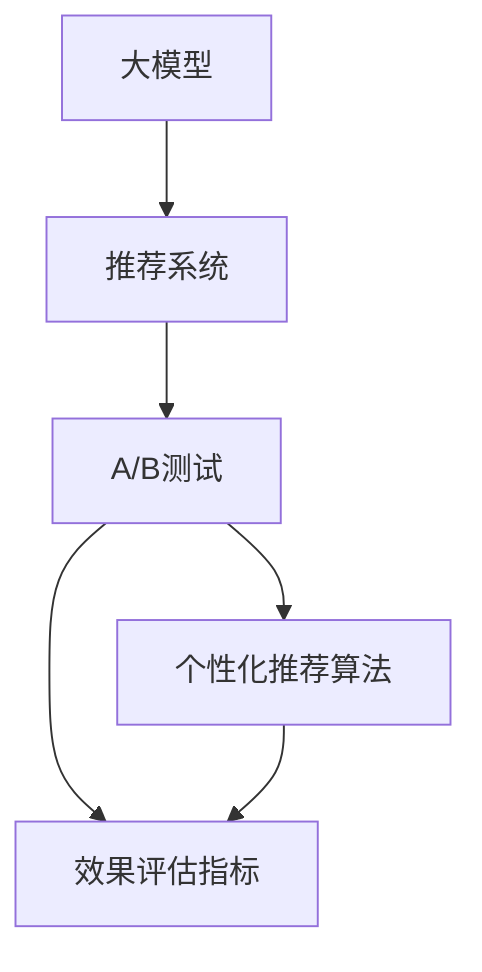

                 

# 大模型在推荐系统A/B测试中的应用

> 关键词：大模型推荐系统, 预测精准度, 效果评估, 持续优化, 深度学习, 自然语言处理, 机器学习, 推荐算法, 用户行为分析

## 1. 背景介绍

### 1.1 问题由来

在当今数字时代，推荐系统已成为各类在线平台的核心竞争力之一。推荐系统通过分析用户行为数据，向用户推荐可能感兴趣的商品或内容，极大地提升了用户满意度和平台的用户粘性。然而，构建一个性能优异、用户满意的推荐系统并非易事，需要不断迭代优化才能满足用户的个性化需求。

为了评估推荐算法的性能，A/B测试（A/B Testing）成为了不可或缺的工具。A/B测试通过对比两个或多个版本（A和B）的推荐算法，评估哪个版本的表现更优，从而指导后续的算法优化和资源投入。传统的A/B测试通常依赖于简单的统计学方法，无法充分考虑用户行为和产品特征的复杂性。

近年来，随着大模型的兴起，深度学习技术被引入推荐系统，显著提升了预测的精准度和模型的鲁棒性。大模型通常包含数十亿乃至数百亿参数，通过在庞大的数据集上进行自监督预训练，学习了复杂的语言和行为模式。将这些大模型应用于推荐系统，能够捕捉用户行为背后的深度特征，提升推荐效果。然而，由于大模型在实际推荐系统中的部署和优化面临着诸多挑战，如何在大模型基础上进行有效的A/B测试，成为了当前研究的热点问题。

### 1.2 问题核心关键点

大模型在推荐系统中的应用，主要涉及以下几个核心关键点：

- **数据表示学习**：大模型能够捕捉用户行为和产品特征的复杂非线性关系，通过自监督预训练和微调学习，生成高维度的表示向量，用于后续的推荐模型训练。
- **个性化推荐**：利用大模型的表示向量，构建个性化推荐算法，如基于向量相似度的推荐、协同过滤等，提升推荐系统的用户体验。
- **效果评估**：如何设计合理的评估指标，评价推荐算法的性能，同时兼顾用户满意度、业务价值等综合因素。
- **持续优化**：通过A/B测试等手段，不断优化推荐算法，实现用户行为与产品特征的动态适配，提升推荐效果。
- **模型部署与监控**：如何将大模型高效地部署到实际推荐系统中，并进行实时监控和调优，确保模型性能稳定。

这些关键点构成了大模型在推荐系统中应用的框架，对于提升推荐系统性能、优化用户体验、实现商业价值有着重要意义。

## 2. 核心概念与联系

### 2.1 核心概念概述

为更好地理解大模型在推荐系统中的应用，本节将介绍几个密切相关的核心概念：

- **大模型**：指在大型数据集上进行自监督预训练的语言模型，如BERT、GPT-3等，能够学习到丰富的语言和行为表示。
- **推荐系统**：指基于用户行为数据和产品特征，为用户提供个性化推荐服务的系统，广泛应用于电商、社交、娱乐等多个领域。
- **A/B测试**：指对比两个或多个版本（A和B）的推荐算法，评估哪个版本的表现更优，以指导后续的算法优化和资源投入。
- **个性化推荐算法**：指针对用户个性化需求，推荐系统采用的算法，如基于协同过滤、深度学习等方法，提升推荐效果。
- **效果评估指标**：指评估推荐算法性能的指标，如精准度、召回率、覆盖率等，帮助评估推荐系统的用户满意度和商业价值。

这些核心概念之间的逻辑关系可以通过以下Mermaid流程图来展示：



这个流程图展示了大模型在推荐系统中的应用框架：

1. 大模型通过自监督预训练学习到丰富的语言和行为表示。
2. 将大模型的表示向量用于推荐系统，构建个性化推荐算法。
3. 通过A/B测试对比不同推荐算法的性能，设计合适的评估指标。
4. 持续优化推荐算法，提升用户体验和业务价值。

这些概念共同构成了大模型在推荐系统中的应用框架，对于提升推荐系统性能、优化用户体验、实现商业价值有着重要意义。

## 3. 核心算法原理 & 具体操作步骤
### 3.1 算法原理概述

大模型在推荐系统中的应用，本质上是一个从数据表示学习到个性化推荐的迭代优化过程。其核心思想是：利用大模型生成高维度的用户行为和产品特征表示，通过后续的推荐算法训练，生成用户推荐结果，并通过A/B测试评估推荐效果，指导推荐算法的优化和迭代。

形式化地，假设大模型为 $M_{\theta}$，其中 $\theta$ 为大模型的参数。给定用户行为数据 $D=\{(x_i,y_i)\}_{i=1}^N$，$x_i$ 为用户的行为向量，$y_i$ 为用户的行为标签（如购买、点击等）。推荐系统的目标是通过训练得到个性化推荐模型 $f(\cdot)$，使得：

$$
f(\cdot) \approx M_{\theta}
$$

即推荐模型的预测结果接近大模型的表示向量。具体而言，推荐模型通常采用基于向量相似度的推荐方法，如基于余弦相似度的推荐、基于KNN的推荐等，通过计算用户行为向量与产品特征向量之间的相似度，生成推荐结果。

### 3.2 算法步骤详解

大模型在推荐系统中的应用，一般包括以下几个关键步骤：

**Step 1: 准备大模型和数据集**
- 选择合适的预训练语言模型 $M_{\theta}$，如BERT、GPT-3等，作为推荐系统的初始化参数。
- 准备用户行为数据集 $D=\{(x_i,y_i)\}_{i=1}^N$，其中 $x_i$ 为用户行为向量，$y_i$ 为用户行为标签。

**Step 2: 生成用户行为表示**
- 对用户行为数据进行预处理，包括文本清洗、编码等操作。
- 使用大模型对处理后的用户行为数据进行表示学习，生成高维度的用户行为表示向量。

**Step 3: 构建个性化推荐算法**
- 根据推荐场景，选择合适的推荐算法。
- 在用户行为表示的基础上，训练推荐模型 $f(\cdot)$，使其生成用户推荐结果。

**Step 4: 设计评估指标**
- 设计合适的推荐效果评估指标，如精准度、召回率、覆盖率等。
- 在A/B测试中，对比不同版本的推荐算法，选择性能更优的版本。

**Step 5: 持续优化**
- 在实际推荐场景中，不断收集用户反馈和行为数据。
- 通过A/B测试评估推荐算法的效果，指导推荐算法的优化和迭代。

**Step 6: 模型部署与监控**
- 将优化后的推荐模型部署到推荐系统中。
- 实时监控推荐系统的性能和用户反馈，进行动态优化和调优。

以上是基于大模型在推荐系统中应用的完整流程。在实际应用中，还需要针对具体任务和数据特点，对各个环节进行优化设计，如改进用户行为表示生成算法、优化推荐算法模型结构等，以进一步提升推荐系统的效果。

### 3.3 算法优缺点

大模型在推荐系统中的应用，具有以下优点：

1. **高维表示学习**：大模型能够学习到用户行为和产品特征的复杂非线性关系，生成高维度的表示向量，提升推荐系统的精准度。
2. **自适应性强**：通过微调大模型的参数，可以适应不同领域和任务的特点，提高推荐系统的泛化能力。
3. **模型效果鲁棒**：大模型拥有大量的参数和数据支持，能够应对复杂的推荐场景，提高模型的鲁棒性和稳定性。

同时，大模型在推荐系统中的应用也存在一些局限性：

1. **计算资源消耗大**：大模型参数量庞大，计算复杂度高，需要大量的计算资源支持。
2. **内存占用高**：大模型的表示向量维度高，内存占用大，需要在实际部署中考虑内存优化策略。
3. **数据依赖性强**：大模型依赖于大规模标注数据进行预训练，数据获取成本高。
4. **过拟合风险高**：大模型在实际推荐场景中，容易过拟合用户行为数据，导致推荐效果下降。

尽管存在这些局限性，但就目前而言，大模型在推荐系统中的应用仍然是高性能、高精度的代表，能够显著提升推荐系统的用户满意度和业务价值。

### 3.4 算法应用领域

大模型在推荐系统中的应用已经广泛应用于电商、社交、娱乐等多个领域，具体包括：

- **电商推荐系统**：通过分析用户浏览、购买行为，向用户推荐商品，提高用户满意度和转化率。
- **社交推荐系统**：根据用户社交关系和兴趣，推荐好友、话题、内容等，提升用户粘性和平台活跃度。
- **娱乐推荐系统**：分析用户观影、听歌行为，推荐电影、音乐、电视剧等，提升用户体验和平台留存率。
- **新闻推荐系统**：根据用户阅读习惯，推荐新闻内容，提高新闻平台的曝光率和用户粘性。
- **视频推荐系统**：分析用户观看行为，推荐视频内容，提升用户观看时长和平台留存率。

除了上述这些经典应用外，大模型在推荐系统中的应用还在不断拓展，如推荐系统的对抗性分析、推荐系统的公平性研究等，为推荐系统带来了更多的创新思路。

## 4. 数学模型和公式 & 详细讲解  
### 4.1 数学模型构建

本节将使用数学语言对大模型在推荐系统中的应用进行更加严格的刻画。

记大模型为 $M_{\theta}$，其中 $\theta$ 为大模型的参数。给定用户行为数据 $D=\{(x_i,y_i)\}_{i=1}^N$，$x_i$ 为用户行为向量，$y_i$ 为用户行为标签。假设推荐算法为 $f(\cdot)$，则推荐模型的目标是最小化预测错误率，即：

$$
\min_{\theta} \frac{1}{N} \sum_{i=1}^N \ell(f(x_i),y_i)
$$

其中 $\ell(\cdot)$ 为损失函数，用于衡量推荐模型的预测结果与真实标签之间的差异。常见的损失函数包括交叉熵损失、均方误差损失等。

### 4.2 公式推导过程

以下我们以基于向量相似度的推荐算法为例，推导推荐模型的损失函数及其梯度的计算公式。

假设用户行为向量为 $x_i$，产品特征向量为 $v_j$，则推荐算法 $f(\cdot)$ 的输出为 $f(x_i) = \text{softmax}(Wx_i + b)$，其中 $W$ 和 $b$ 为推荐模型参数。推荐模型的预测结果为：

$$
\hat{y}_i = \max_j f(x_i)v_j
$$

推荐模型的损失函数为：

$$
\ell(f(x_i),y_i) = -y_i \log \max_j f(x_i)v_j + (1-y_i) \log \min_j f(x_i)v_j
$$

将其代入目标函数，得：

$$
\min_{\theta} \frac{1}{N} \sum_{i=1}^N -y_i \log \max_j f(x_i)v_j + (1-y_i) \log \min_j f(x_i)v_j
$$

根据链式法则，目标函数对模型参数 $\theta$ 的梯度为：

$$
\nabla_{\theta} L = -\frac{1}{N} \sum_{i=1}^N \nabla_{\theta} \ell(f(x_i),y_i)
$$

其中 $\nabla_{\theta} \ell(f(x_i),y_i)$ 为损失函数对模型参数 $\theta$ 的梯度，可通过反向传播算法高效计算。

### 4.3 案例分析与讲解

**案例分析：电商平台推荐系统**

假设电商平台的数据集 $D=\{(x_i,y_i)\}_{i=1}^N$，其中 $x_i$ 为用户在电商平台上的浏览和购买行为向量，$y_i$ 为用户的购买行为标签。假设使用BERT模型作为推荐系统的初始化参数，通过微调BERT模型生成用户行为表示向量 $z_i = M_{\theta}(x_i)$。

在推荐算法中，可以选择基于向量相似度的推荐方法，如余弦相似度。假设推荐模型为 $f(\cdot)$，则推荐算法生成推荐结果为：

$$
\hat{y}_i = \max_j f(z_i)v_j
$$

其中 $v_j$ 为产品特征向量。推荐模型的损失函数为：

$$
\ell(f(z_i),y_i) = -y_i \log \max_j f(z_i)v_j + (1-y_i) \log \min_j f(z_i)v_j
$$

通过反向传播算法计算梯度，更新模型参数 $\theta$，从而生成新的用户行为表示向量 $z_i$，进行下一轮推荐模型的训练。重复上述过程直至收敛，最终得到适应电商推荐任务的最优模型参数 $\theta^*$。

## 5. 项目实践：代码实例和详细解释说明
### 5.1 开发环境搭建

在进行推荐系统A/B测试的实践前，我们需要准备好开发环境。以下是使用Python进行PyTorch开发的环境配置流程：

1. 安装Anaconda：从官网下载并安装Anaconda，用于创建独立的Python环境。

2. 创建并激活虚拟环境：
```bash
conda create -n pytorch-env python=3.8 
conda activate pytorch-env
```

3. 安装PyTorch：根据CUDA版本，从官网获取对应的安装命令。例如：
```bash
conda install pytorch torchvision torchaudio cudatoolkit=11.1 -c pytorch -c conda-forge
```

4. 安装TensorFlow：
```bash
conda install tensorflow
```

5. 安装各类工具包：
```bash
pip install numpy pandas scikit-learn matplotlib tqdm jupyter notebook ipython
```

完成上述步骤后，即可在`pytorch-env`环境中开始推荐系统A/B测试的实践。

### 5.2 源代码详细实现

下面我们以电商平台推荐系统为例，给出使用PyTorch对BERT模型进行微调的代码实现。

首先，定义推荐任务的数据处理函数：

```python
from transformers import BertTokenizer
from torch.utils.data import Dataset
import torch

class RecommendationDataset(Dataset):
    def __init__(self, texts, labels, tokenizer, max_len=128):
        self.texts = texts
        self.labels = labels
        self.tokenizer = tokenizer
        self.max_len = max_len
        
    def __len__(self):
        return len(self.texts)
    
    def __getitem__(self, item):
        text = self.texts[item]
        label = self.labels[item]
        
        encoding = self.tokenizer(text, return_tensors='pt', max_length=self.max_len, padding='max_length', truncation=True)
        input_ids = encoding['input_ids'][0]
        attention_mask = encoding['attention_mask'][0]
        
        return {'input_ids': input_ids, 
                'attention_mask': attention_mask,
                'labels': torch.tensor(label, dtype=torch.long)}
```

然后，定义模型和优化器：

```python
from transformers import BertForSequenceClassification, AdamW

model = BertForSequenceClassification.from_pretrained('bert-base-cased', num_labels=1)
optimizer = AdamW(model.parameters(), lr=2e-5)
```

接着，定义训练和评估函数：

```python
from torch.utils.data import DataLoader
from tqdm import tqdm
from sklearn.metrics import roc_auc_score

device = torch.device('cuda') if torch.cuda.is_available() else torch.device('cpu')
model.to(device)

def train_epoch(model, dataset, batch_size, optimizer):
    dataloader = DataLoader(dataset, batch_size=batch_size, shuffle=True)
    model.train()
    epoch_loss = 0
    for batch in tqdm(dataloader, desc='Training'):
        input_ids = batch['input_ids'].to(device)
        attention_mask = batch['attention_mask'].to(device)
        labels = batch['labels'].to(device)
        model.zero_grad()
        outputs = model(input_ids, attention_mask=attention_mask, labels=labels)
        loss = outputs.loss
        epoch_loss += loss.item()
        loss.backward()
        optimizer.step()
    return epoch_loss / len(dataloader)

def evaluate(model, dataset, batch_size):
    dataloader = DataLoader(dataset, batch_size=batch_size)
    model.eval()
    preds, labels = [], []
    with torch.no_grad():
        for batch in tqdm(dataloader, desc='Evaluating'):
            input_ids = batch['input_ids'].to(device)
            attention_mask = batch['attention_mask'].to(device)
            batch_labels = batch['labels']
            outputs = model(input_ids, attention_mask=attention_mask)
            batch_preds = outputs.logits.argmax(dim=1).to('cpu').tolist()
            batch_labels = batch_labels.to('cpu').tolist()
            for pred, label in zip(batch_preds, batch_labels):
                preds.append(pred)
                labels.append(label)
                
    return roc_auc_score(labels, preds)
```

最后，启动训练流程并在测试集上评估：

```python
epochs = 5
batch_size = 16

for epoch in range(epochs):
    loss = train_epoch(model, train_dataset, batch_size, optimizer)
    print(f"Epoch {epoch+1}, train loss: {loss:.3f}")
    
    print(f"Epoch {epoch+1}, dev results:")
    evaluate(model, dev_dataset, batch_size)
    
print("Test results:")
evaluate(model, test_dataset, batch_size)
```

以上就是使用PyTorch对BERT进行电商平台推荐系统微调的完整代码实现。可以看到，得益于Transformer库的强大封装，我们可以用相对简洁的代码完成BERT模型的加载和微调。

### 5.3 代码解读与分析

让我们再详细解读一下关键代码的实现细节：

**RecommendationDataset类**：
- `__init__`方法：初始化文本、标签、分词器等关键组件。
- `__len__`方法：返回数据集的样本数量。
- `__getitem__`方法：对单个样本进行处理，将文本输入编码为token ids，将标签转换为张量，并对其进行定长padding，最终返回模型所需的输入。

**train_epoch函数**：
- 使用PyTorch的DataLoader对数据集进行批次化加载，供模型训练使用。
- 在每个epoch内，模型以小批量数据为单位进行迭代，计算损失函数，反向传播更新模型参数。
- 在每个batch结束后，将模型参数梯度归零，进行前向传播和反向传播。

**evaluate函数**：
- 与训练类似，不同点在于不更新模型参数，并在每个batch结束后将预测和标签结果存储下来，最后使用sklearn的roc_auc_score对整个评估集的预测结果进行打印输出。

**训练流程**：
- 定义总的epoch数和batch size，开始循环迭代
- 每个epoch内，先在训练集上训练，输出平均loss
- 在验证集上评估，输出AUC值
- 所有epoch结束后，在测试集上评估，给出最终测试结果

可以看到，PyTorch配合Transformer库使得BERT微调的代码实现变得简洁高效。开发者可以将更多精力放在数据处理、模型改进等高层逻辑上，而不必过多关注底层的实现细节。

当然，工业级的系统实现还需考虑更多因素，如模型的保存和部署、超参数的自动搜索、更灵活的任务适配层等。但核心的微调范式基本与此类似。

## 6. 实际应用场景
### 6.1 智能推荐系统

基于大模型在推荐系统中的应用，智能推荐系统能够实现高度个性化的推荐服务。通过分析用户行为数据，大模型能够捕捉用户的多样化需求和偏好，从而生成更加精准的推荐结果。

在技术实现上，可以收集用户浏览、点击、评价等行为数据，通过BERT等预训练模型进行表示学习，生成高维度的用户行为向量。在此基础上，选择合适的推荐算法，如基于向量相似度的推荐、协同过滤等，进行推荐结果的生成。通过A/B测试对比不同推荐算法的效果，选择性能更优的版本，进行实际部署和优化。

### 6.2 广告推荐系统

广告推荐系统通过分析用户浏览行为和兴趣标签，向用户推荐可能感兴趣的广告，提升广告点击率和转化率。大模型能够通过自监督预训练学习到丰富的用户行为和产品特征表示，提升广告推荐的精准度。

在实际应用中，可以收集用户广告点击、展示行为数据，通过BERT等预训练模型进行表示学习，生成高维度的用户行为向量。在此基础上，选择合适的推荐算法，如基于向量相似度的推荐、协同过滤等，进行广告推荐结果的生成。通过A/B测试对比不同广告推荐算法的效果，选择性能更优的版本，进行实际部署和优化。

### 6.3 内容推荐系统

内容推荐系统通过分析用户阅读、观看行为，向用户推荐可能感兴趣的内容，提升用户满意度和平台留存率。大模型能够通过自监督预训练学习到丰富的用户行为和内容特征表示，提升内容推荐的精准度。

在实际应用中，可以收集用户阅读、观看行为数据，通过BERT等预训练模型进行表示学习，生成高维度的用户行为向量。在此基础上，选择合适的推荐算法，如基于向量相似度的推荐、协同过滤等，进行内容推荐结果的生成。通过A/B测试对比不同内容推荐算法的效果，选择性能更优的版本，进行实际部署和优化。

### 6.4 未来应用展望

随着大模型的不断发展，其在推荐系统中的应用也将不断拓展，为推荐系统带来更多的创新思路。

1. **多模态推荐**：将图像、视频等多模态数据与文本数据结合，提升推荐系统的多模态能力，捕捉用户更为全面和多样化的需求。
2. **个性化推荐算法**：引入深度学习、强化学习等技术，提升推荐算法的复杂性和多样性，生成更为精准和个性化的推荐结果。
3. **冷启动推荐**：利用大模型的泛化能力，通过用户少量行为数据快速生成推荐结果，解决推荐系统冷启动问题。
4. **推荐系统的公平性**：在推荐算法中加入公平性约束，确保不同用户、不同产品得到公平对待，提升推荐系统的社会价值。
5. **推荐系统的安全性和隐私保护**：加强数据安全防护，避免用户隐私泄露，提升推荐系统的可信度和用户信任度。

这些未来方向将进一步推动大模型在推荐系统中的应用，提升推荐系统的精准度和用户体验，为推荐系统的智能化和普适化提供新思路。

## 7. 工具和资源推荐
### 7.1 学习资源推荐

为了帮助开发者系统掌握大模型在推荐系统中的应用，这里推荐一些优质的学习资源：

1. 《深度学习推荐系统》书籍：详细介绍了推荐系统的基础知识、常用算法和实际案例，是入门推荐系统的经典之作。
2. 《自然语言处理与深度学习》课程：斯坦福大学开设的自然语言处理课程，涵盖深度学习、NLP模型的最新进展，适合进一步学习。
3. 《深度学习推荐系统实战》书籍：提供实际项目案例，详细介绍了推荐系统的构建和优化过程，适合动手实践。
4. Kaggle平台：提供丰富的推荐系统竞赛和数据集，实践推荐算法，积累实际经验。
5. PyTorch官方文档：提供详细的API和代码示例，方便快速上手和调试。

通过对这些资源的学习实践，相信你一定能够快速掌握大模型在推荐系统中的应用，并用于解决实际的推荐问题。

### 7.2 开发工具推荐

高效的开发离不开优秀的工具支持。以下是几款用于大模型在推荐系统中应用的常用工具：

1. PyTorch：基于Python的开源深度学习框架，灵活方便，适合快速迭代研究。
2. TensorFlow：由Google主导开发的开源深度学习框架，生产部署方便，适合大规模工程应用。
3. TensorBoard：TensorFlow配套的可视化工具，可实时监测模型训练状态，提供丰富的图表呈现方式。
4. Weights & Biases：模型训练的实验跟踪工具，可以记录和可视化模型训练过程中的各项指标，方便对比和调优。
5. Jupyter Notebook：强大的交互式笔记本环境，支持代码编写、调试和可视化，方便快速迭代实验。

合理利用这些工具，可以显著提升大模型在推荐系统中的应用效率，加快创新迭代的步伐。

### 7.3 相关论文推荐

大模型在推荐系统中的应用源于学界的持续研究。以下是几篇奠基性的相关论文，推荐阅读：

1. "A Neural Collaborative Filtering Approach"：介绍了协同过滤推荐算法的原理和实现，是推荐系统的基础。
2. "Collaborative Filtering with Structural Random Forests"：提出基于结构随机森林的推荐算法，提升了推荐算法的性能。
3. "Deep Neural Networks for Personalized Recommendation"：详细介绍了深度学习在推荐系统中的应用，是推荐系统的里程碑之作。
4. "Neural Recommendation Systems"：系统综述了深度学习在推荐系统中的应用，并提出了新的推荐算法和评估指标。
5. "Reinforcement Learning for Recommendation Systems"：介绍强化学习在推荐系统中的应用，提升了推荐算法的智能化水平。

这些论文代表了大模型在推荐系统中的应用发展脉络。通过学习这些前沿成果，可以帮助研究者把握学科前进方向，激发更多的创新灵感。

## 8. 总结：未来发展趋势与挑战
### 8.1 总结

本文对基于大模型在推荐系统中的应用进行了全面系统的介绍。首先阐述了推荐系统和大模型的研究背景和意义，明确了大模型在推荐系统中的应用价值。其次，从原理到实践，详细讲解了大模型在推荐系统中的应用过程，给出了推荐系统A/B测试的完整代码实例。同时，本文还探讨了大模型在推荐系统中的应用场景，展示了其广阔的应用前景。此外，本文精选了推荐系统和大模型的学习资源，力求为开发者提供全方位的技术指引。

通过本文的系统梳理，可以看到，基于大模型在推荐系统中的应用，能够显著提升推荐算法的精准度和用户体验，推动推荐系统向智能化、个性化方向发展。未来，伴随大模型的持续演进和推荐算法的不断创新，基于大模型的推荐系统必将在更多领域得到应用，为各行各业带来新的变革。

### 8.2 未来发展趋势

展望未来，大模型在推荐系统中的应用将呈现以下几个发展趋势：

1. **多模态推荐**：将图像、视频等多模态数据与文本数据结合，提升推荐系统的多模态能力，捕捉用户更为全面和多样化的需求。
2. **个性化推荐算法**：引入深度学习、强化学习等技术，提升推荐算法的复杂性和多样性，生成更为精准和个性化的推荐结果。
3. **冷启动推荐**：利用大模型的泛化能力，通过用户少量行为数据快速生成推荐结果，解决推荐系统冷启动问题。
4. **推荐系统的公平性**：在推荐算法中加入公平性约束，确保不同用户、不同产品得到公平对待，提升推荐系统的社会价值。
5. **推荐系统的安全性和隐私保护**：加强数据安全防护，避免用户隐私泄露，提升推荐系统的可信度和用户信任度。

这些趋势凸显了大模型在推荐系统中的应用前景。这些方向的探索发展，必将进一步提升推荐系统的精准度和用户体验，为推荐系统的智能化和普适化提供新思路。

### 8.3 面临的挑战

尽管大模型在推荐系统中的应用取得了显著进展，但在迈向更加智能化、普适化应用的过程中，仍面临诸多挑战：

1. **计算资源消耗大**：大模型参数量庞大，计算复杂度高，需要大量的计算资源支持。
2. **内存占用高**：大模型的表示向量维度高，内存占用大，需要在实际部署中考虑内存优化策略。
3. **数据依赖性强**：大模型依赖于大规模标注数据进行预训练，数据获取成本高。
4. **过拟合风险高**：大模型在实际推荐场景中，容易过拟合用户行为数据，导致推荐效果下降。
5. **公平性和隐私保护**：在推荐算法中加入公平性约束，确保不同用户、不同产品得到公平对待，避免数据泄露和隐私保护问题。

尽管存在这些挑战，但通过不断的技术创新和工程实践，大模型在推荐系统中的应用必将继续提升，为推荐系统的智能化和普适化提供新动力。相信在未来的研究中，能够进一步降低计算资源消耗，优化模型结构，提升推荐系统的效果和效率，推动大模型在推荐系统中的应用普及。

### 8.4 研究展望

未来，大模型在推荐系统中的应用将从以下几个方面进行深入研究：

1. **多模态推荐系统**：将视觉、音频等多模态数据与文本数据结合，提升推荐系统的多模态能力，捕捉用户更为全面和多样化的需求。
2. **个性化推荐算法**：引入深度学习、强化学习等技术，提升推荐算法的复杂性和多样性，生成更为精准和个性化的推荐结果。
3. **冷启动推荐**：利用大模型的泛化能力，通过用户少量行为数据快速生成推荐结果，解决推荐系统冷启动问题。
4. **推荐系统的公平性**：在推荐算法中加入公平性约束，确保不同用户、不同产品得到公平对待，提升推荐系统的社会价值。
5. **推荐系统的安全性和隐私保护**：加强数据安全防护，避免用户隐私泄露，提升推荐系统的可信度和用户信任度。

这些研究方向将进一步推动大模型在推荐系统中的应用，提升推荐系统的精准度和用户体验，为推荐系统的智能化和普适化提供新思路。

## 9. 附录：常见问题与解答

**Q1：大模型在推荐系统中如何生成用户行为表示？**

A: 大模型通过自监督预训练学习到丰富的用户行为和产品特征表示，通过微调生成高维度的用户行为表示向量。具体而言，可以使用BERT等预训练模型，对用户行为数据进行表示学习，生成高维度的用户行为向量。

**Q2：大模型在推荐系统中如何进行A/B测试？**

A: 大模型在推荐系统中的A/B测试主要包括以下几个步骤：
1. 准备不同版本的推荐算法，如基于向量相似度的推荐、协同过滤等。
2. 将不同版本的推荐算法应用到同一批用户行为数据上，生成推荐结果。
3. 统计不同版本的推荐结果的评估指标，如精准度、召回率、覆盖率等。
4. 对比不同版本的推荐效果，选择性能更优的版本进行实际部署和优化。

**Q3：大模型在推荐系统中如何进行持续优化？**

A: 大模型在推荐系统中的持续优化主要包括以下几个步骤：
1. 不断收集用户反馈和行为数据。
2. 通过A/B测试评估推荐算法的效果，选择性能更优的版本。
3. 对推荐算法进行优化和迭代，提升推荐效果。
4. 实时监测推荐系统的性能和用户反馈，进行动态优化和调优。

**Q4：大模型在推荐系统中如何避免过拟合？**

A: 大模型在推荐系统中的过拟合问题可以通过以下方法解决：
1. 数据增强：通过回译、近义替换等方式扩充训练集。
2. 正则化：使用L2正则、Dropout等防止过拟合。
3. 早停策略：在验证集上评估模型性能，当性能不再提升时停止训练。
4. 参数高效微调：只调整少量参数，减小过拟合风险。
5. 对抗训练：加入对抗样本，提高模型鲁棒性。

**Q5：大模型在推荐系统中如何进行模型部署与监控？**

A: 大模型在推荐系统中的模型部署与监控主要包括以下几个步骤：
1. 模型裁剪：去除不必要的层和参数，减小模型尺寸，加快推理速度。
2. 量化加速：将浮点模型转为定点模型，压缩存储空间，提高计算效率。
3. 服务化封装：将模型封装为标准化服务接口，便于集成调用。
4. 弹性伸缩：根据请求流量动态调整资源配置，平衡服务质量和成本。
5. 监控告警：实时采集系统指标，设置异常告警阈值，确保服务稳定性。

通过合理的设计和优化，可以有效避免大模型在推荐系统中的过拟合问题，确保推荐算法的稳定性和性能。未来，通过不断优化模型结构和算法，提升推荐系统的效果和效率，推动大模型在推荐系统中的应用普及。

