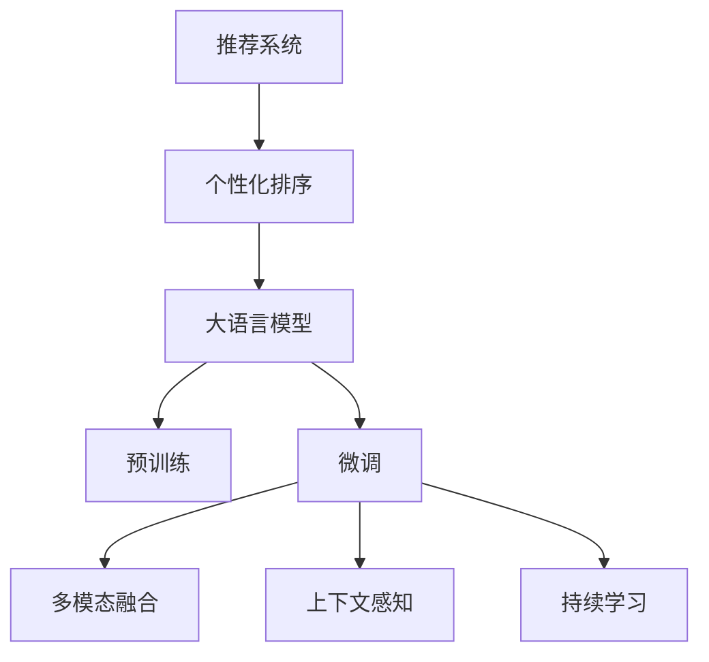

                 

# 大模型在推荐系统个性化排序中的应用

> 关键词：推荐系统,个性化排序,大语言模型,预训练,微调,深度学习,嵌入式,自然语言处理(NLP)

## 1. 背景介绍

### 1.1 问题由来
随着互联网和数字技术的迅猛发展，推荐系统已成为信息服务领域的重要工具。它通过分析用户的浏览记录、评分历史、社交关系等数据，为用户提供个性化的内容推荐，极大地提升了用户体验和系统效率。然而，传统推荐系统多基于浅层的特征工程，难以充分挖掘数据中的潜在关联，导致推荐结果泛化能力和用户体验仍有提升空间。

近年来，深度学习和大语言模型的兴起，为推荐系统注入了新的活力。通过预训练和微调技术，深度模型能够捕捉数据中的复杂语义关系，提升推荐精度和个性化程度。尤其是大语言模型，凭借其强大的语义理解和生成能力，在推荐系统个性化排序中展现出巨大潜力。

### 1.2 问题核心关键点
大语言模型在推荐系统个性化排序中的应用，主要体现在以下几个方面：

- **预训练-微调框架**：利用大模型在大规模语料上进行预训练，再针对推荐系统的具体任务进行微调，以提高推荐排序的精度和个性化程度。
- **自然语言理解**：通过自然语言处理技术，抽取和理解用户评论、产品描述等文本信息，提升推荐系统的语义理解能力。
- **多模态融合**：结合文本、图像、音频等多种模态信息，构建更加全面、准确的用户和物品表示。
- **上下文感知**：考虑用户行为的时序性和上下文信息，进行动态推荐排序，提高推荐的时效性和个性化水平。
- **实时更新**：通过持续学习和在线微调，使模型能够实时适应数据分布的变化，保持推荐效果。

本文将详细介绍大模型在推荐系统个性化排序中的应用原理、操作步骤、数学模型、代码实践和实际应用场景，并探讨其未来发展趋势和面临的挑战。

## 2. 核心概念与联系

### 2.1 核心概念概述

为更好地理解大模型在推荐系统个性化排序中的应用，本节将介绍几个密切相关的核心概念：

- **推荐系统**：通过算法对用户行为数据进行分析，向用户推荐可能感兴趣的物品或内容，如商品、文章、视频等。
- **个性化排序**：根据用户的行为和属性，对推荐物品进行排序，满足用户个性化需求。
- **大语言模型**：基于Transformer等架构的预训练语言模型，在大规模语料上进行自监督预训练，具备强大的语义理解和生成能力。
- **预训练-微调(Pre-training & Fine-tuning, PTF)框架**：在预训练模型的基础上，通过少量标注数据进行微调，提升模型在特定任务上的性能。
- **多模态融合(Multimodal Fusion)**：结合文本、图像、音频等不同模态的数据，构建更加丰富、准确的物品和用户表示。
- **上下文感知(Context-Aware)**：在推荐排序中引入用户行为的时序性和上下文信息，提高推荐的时效性和个性化水平。
- **持续学习(Continual Learning)**：使模型能够持续学习新数据，避免过拟合，保持推荐效果的时效性和相关性。

这些核心概念之间的逻辑关系可以通过以下Mermaid流程图来展示：



这个流程图展示了大模型在推荐系统个性化排序中的应用框架，主要包括预训练-微调、多模态融合、上下文感知和持续学习等核心模块。这些模块相互配合，共同构建起一个强大而灵活的推荐系统。

## 3. 核心算法原理 & 具体操作步骤
### 3.1 算法原理概述

大语言模型在推荐系统个性化排序中的应用，主要基于预训练-微调(PTF)框架。其核心思想是：将大语言模型视为一个强大的特征提取器，通过微调使其适应推荐系统的具体任务，如排序、分类、匹配等，从而获得个性化的推荐结果。

具体流程如下：

1. **预训练**：在大规模无标签语料上，通过自监督学习任务训练大语言模型，学习通用的语言表示。
2. **微调**：在预训练模型的基础上，利用推荐系统中的标注数据，通过有监督学习优化模型在特定任务上的性能。
3. **多模态融合**：结合文本、图像、音频等多模态信息，增强模型对物品和用户的全面理解。
4. **上下文感知**：考虑用户行为的时序性和上下文信息，进行动态推荐排序，提升推荐的时效性和个性化水平。
5. **持续学习**：通过在线微调和增量学习，使模型能够不断适应新数据，保持推荐效果的时效性和相关性。

### 3.2 算法步骤详解

#### 3.2.1 预训练步骤

1. **语料准备**：收集大规模无标签的语料，如维基百科、新闻文章、社交媒体等。
2. **数据预处理**：对语料进行清洗、分词、去除停用词等预处理步骤。
3. **模型选择**：选择合适的预训练语言模型，如BERT、GPT、T5等。
4. **预训练流程**：将预训练模型加载到计算平台上，通过自监督学习任务进行训练，如掩码语言模型、上下文预测等。
5. **模型评估**：在验证集上评估预训练模型的性能，确保其在预训练任务上的表现。

#### 3.2.2 微调步骤

1. **数据准备**：收集推荐系统中的标注数据，如用户评分、点击记录等。
2. **模型适配**：设计合适的任务适配层，如分类头、排序头等，用于对预训练模型进行微调。
3. **超参数设置**：选择合适的优化算法、学习率、批大小等超参数。
4. **模型训练**：使用微调数据训练模型，通过有监督学习优化模型参数。
5. **模型评估**：在验证集上评估微调后模型的性能，调整超参数以获得最佳效果。
6. **模型部署**：将微调后的模型部署到推荐系统中，进行实际推荐排序。

#### 3.2.3 多模态融合步骤

1. **数据收集**：收集不同类型的模态数据，如产品描述、用户评论、图片等。
2. **特征提取**：对不同类型的模态数据进行特征提取，得到向量表示。
3. **模型融合**：使用多模态融合技术，将不同模态的特征向量进行整合，生成更全面、准确的物品和用户表示。
4. **特征编码**：将融合后的特征向量输入预训练语言模型，进行编码处理。

#### 3.2.4 上下文感知步骤

1. **行为序列建模**：将用户的历史行为序列建模，考虑时间因素和上下文信息。
2. **上下文特征提取**：提取用户行为上下文特征，如浏览历史、点击记录等。
3. **融合上下文信息**：将上下文特征与物品特征进行融合，生成综合化的用户和物品表示。
4. **动态推荐排序**：根据用户当前行为和上下文信息，进行动态推荐排序，提高推荐的时效性和个性化水平。

#### 3.2.5 持续学习步骤

1. **在线微调**：利用用户新行为数据进行在线微调，实时更新模型参数。
2. **增量学习**：考虑新数据的分布，引入增量学习策略，提升模型适应新数据的能力。
3. **性能评估**：定期在验证集上评估模型性能，确保推荐效果的时效性和相关性。

### 3.3 算法优缺点

#### 3.3.1 优点

1. **高效性**：利用预训练语言模型强大的语义理解能力，减少了特征工程的工作量，提升了推荐排序的效率。
2. **个性化**：通过多模态融合和上下文感知，模型能够更好地理解用户需求和物品特性，提升推荐个性化水平。
3. **泛化能力强**：预训练语言模型在大规模无标签数据上进行训练，具有较强的泛化能力，能够适应不同领域和数据分布。
4. **实时更新**：通过在线微调和增量学习，模型能够实时适应新数据，保持推荐效果的时效性和相关性。

#### 3.3.2 缺点

1. **标注成本高**：推荐系统中的标注数据获取成本较高，尤其是高质量标注数据。
2. **模型复杂度**：预训练语言模型参数量较大，对计算资源和存储空间要求较高。
3. **学习曲线陡峭**：微调过程需要大量的标注数据和计算资源，模型训练和调参复杂度较高。
4. **可解释性不足**：推荐排序过程较为复杂，难以提供直观的解释和调试手段。

### 3.4 算法应用领域

大语言模型在推荐系统个性化排序中的应用，主要涉及以下几个领域：

1. **电商推荐**：为电商平台推荐用户可能感兴趣的商品，提升用户购买转化率和满意度。
2. **视频推荐**：为用户推荐可能感兴趣的视频内容，提高用户的观看体验和平台粘性。
3. **音乐推荐**：为用户推荐可能感兴趣的音乐和艺人，提升用户音乐体验和平台活跃度。
4. **新闻推荐**：为用户推荐可能感兴趣的新闻文章，增加用户对平台的粘性和使用时长。
5. **社交推荐**：为用户推荐可能感兴趣的朋友和内容，增强用户的社交互动和平台留存率。

除了上述这些经典应用外，大语言模型在推荐系统中的应用还在不断拓展，如游戏推荐、招聘推荐、旅游推荐等，为各行各业带来了新的技术突破。

## 4. 数学模型和公式 & 详细讲解

### 4.1 数学模型构建

本节将使用数学语言对大语言模型在推荐系统个性化排序中的应用进行更加严格的刻画。

记推荐系统中的用户为 $U$，物品为 $I$，用户对物品的评分表示为 $R_{ui}$。假设大语言模型 $M$ 在用户 $u$ 和物品 $i$ 上的表示分别为 $h_u$ 和 $h_i$，用户对物品的评分预测为 $r_{ui}$。

定义推荐系统中的损失函数为 $\ell$，假设 $R_{ui}$ 服从伯努利分布，则损失函数可以表示为：

$$
\ell(R_{ui}) = -R_{ui} \log r_{ui} - (1-R_{ui}) \log (1-r_{ui})
$$

微调的优化目标是最小化经验风险，即找到最优参数：

$$
\theta^* = \mathop{\arg\min}_{\theta} \mathcal{L}(\theta)
$$

其中 $\mathcal{L}$ 为针对推荐系统设计的损失函数，用于衡量模型预测评分与真实评分之间的差异。常见的损失函数包括均方误差损失、对数损失等。

### 4.2 公式推导过程

以均方误差损失为例，假设模型 $M$ 在用户 $u$ 和物品 $i$ 上的表示分别为 $h_u$ 和 $h_i$，用户对物品的评分预测为 $r_{ui}$，则均方误差损失函数可以表示为：

$$
\ell(R_{ui}) = \frac{1}{2} (R_{ui} - r_{ui})^2
$$

将损失函数对模型参数 $\theta$ 求导，得到梯度：

$$
\nabla_{\theta} \ell(R_{ui}) = (R_{ui} - r_{ui}) (h_u - h_i)
$$

根据梯度下降等优化算法，模型参数 $\theta$ 的更新公式为：

$$
\theta \leftarrow \theta - \eta \nabla_{\theta} \ell(R_{ui})
$$

其中 $\eta$ 为学习率，$\eta$ 的值通常需要根据具体任务进行调整。

在得到损失函数的梯度后，即可带入参数更新公式，完成模型的迭代优化。重复上述过程直至收敛，最终得到适应推荐系统个性化排序任务的最优模型参数 $\theta^*$。

### 4.3 案例分析与讲解

以电商推荐系统为例，分析如何使用大语言模型进行个性化排序。假设电商平台收集了用户对商品的评分数据，可以将评分数据作为标注数据，对预训练语言模型进行微调。具体步骤如下：

1. **语料准备**：收集电商平台的历史销售数据和用户评分数据，进行数据预处理。
2. **模型选择**：选择适合的预训练语言模型，如BERT、GPT等。
3. **微调流程**：将评分数据作为标注数据，利用微调算法（如AdamW）对预训练语言模型进行优化。
4. **多模态融合**：将商品图片、标题等文本信息与评分数据进行融合，得到更加全面的物品表示。
5. **上下文感知**：考虑用户的历史行为序列，提取上下文特征，生成综合化的用户和物品表示。
6. **动态推荐排序**：根据用户当前行为和上下文信息，进行动态推荐排序，提升推荐的时效性和个性化水平。

## 5. 项目实践：代码实例和详细解释说明
### 5.1 开发环境搭建

在进行推荐系统个性化排序的微调实践前，我们需要准备好开发环境。以下是使用Python进行PyTorch开发的环境配置流程：

1. 安装Anaconda：从官网下载并安装Anaconda，用于创建独立的Python环境。

2. 创建并激活虚拟环境：
```bash
conda create -n pytorch-env python=3.8 
conda activate pytorch-env
```

3. 安装PyTorch：根据CUDA版本，从官网获取对应的安装命令。例如：
```bash
conda install pytorch torchvision torchaudio cudatoolkit=11.1 -c pytorch -c conda-forge
```

4. 安装Transformers库：
```bash
pip install transformers
```

5. 安装各类工具包：
```bash
pip install numpy pandas scikit-learn matplotlib tqdm jupyter notebook ipython
```

完成上述步骤后，即可在`pytorch-env`环境中开始推荐系统个性化排序的微调实践。

### 5.2 源代码详细实现

下面以电商推荐系统为例，给出使用Transformers库对BERT模型进行微调的PyTorch代码实现。

首先，定义电商推荐系统中的数据处理函数：

```python
from transformers import BertTokenizer
from torch.utils.data import Dataset
import torch

class ProductDataset(Dataset):
    def __init__(self, texts, scores, tokenizer, max_len=128):
        self.texts = texts
        self.scores = scores
        self.tokenizer = tokenizer
        self.max_len = max_len
        
    def __len__(self):
        return len(self.texts)
    
    def __getitem__(self, item):
        text = self.texts[item]
        score = self.scores[item]
        
        encoding = self.tokenizer(text, return_tensors='pt', max_length=self.max_len, padding='max_length', truncation=True)
        input_ids = encoding['input_ids'][0]
        attention_mask = encoding['attention_mask'][0]
        
        # 对评分进行归一化处理，转化为0-1之间的概率
        score = score / 5
        
        return {'input_ids': input_ids, 
                'attention_mask': attention_mask,
                'score': score}

# 创建dataset
tokenizer = BertTokenizer.from_pretrained('bert-base-cased')

train_dataset = ProductDataset(train_texts, train_scores, tokenizer)
dev_dataset = ProductDataset(dev_texts, dev_scores, tokenizer)
test_dataset = ProductDataset(test_texts, test_scores, tokenizer)
```

然后，定义模型和优化器：

```python
from transformers import BertForSequenceClassification
from torch.optim import AdamW

model = BertForSequenceClassification.from_pretrained('bert-base-cased', num_labels=2)

optimizer = AdamW(model.parameters(), lr=2e-5)
```

接着，定义训练和评估函数：

```python
from torch.utils.data import DataLoader
from tqdm import tqdm
from sklearn.metrics import roc_auc_score

device = torch.device('cuda') if torch.cuda.is_available() else torch.device('cpu')
model.to(device)

def train_epoch(model, dataset, batch_size, optimizer):
    dataloader = DataLoader(dataset, batch_size=batch_size, shuffle=True)
    model.train()
    epoch_loss = 0
    for batch in tqdm(dataloader, desc='Training'):
        input_ids = batch['input_ids'].to(device)
        attention_mask = batch['attention_mask'].to(device)
        score = batch['score'].to(device)
        model.zero_grad()
        outputs = model(input_ids, attention_mask=attention_mask, labels=score)
        loss = outputs.loss
        epoch_loss += loss.item()
        loss.backward()
        optimizer.step()
    return epoch_loss / len(dataloader)

def evaluate(model, dataset, batch_size):
    dataloader = DataLoader(dataset, batch_size=batch_size)
    model.eval()
    preds, labels = [], []
    with torch.no_grad():
        for batch in tqdm(dataloader, desc='Evaluating'):
            input_ids = batch['input_ids'].to(device)
            attention_mask = batch['attention_mask'].to(device)
            batch_labels = batch['score'].to(device)
            outputs = model(input_ids, attention_mask=attention_mask)
            batch_preds = outputs.logits.argmax(dim=1).to('cpu').tolist()
            batch_labels = batch_labels.to('cpu').tolist()
            for pred, label in zip(batch_preds, batch_labels):
                preds.append(pred)
                labels.append(label)
                
    print(roc_auc_score(labels, preds))
```

最后，启动训练流程并在测试集上评估：

```python
epochs = 5
batch_size = 16

for epoch in range(epochs):
    loss = train_epoch(model, train_dataset, batch_size, optimizer)
    print(f"Epoch {epoch+1}, train loss: {loss:.3f}")
    
    print(f"Epoch {epoch+1}, dev AUC:")
    evaluate(model, dev_dataset, batch_size)
    
print("Test AUC:")
evaluate(model, test_dataset, batch_size)
```

以上就是使用PyTorch对BERT进行电商推荐系统个性化排序的完整代码实现。可以看到，得益于Transformers库的强大封装，我们可以用相对简洁的代码完成BERT模型的加载和微调。

### 5.3 代码解读与分析

让我们再详细解读一下关键代码的实现细节：

**ProductDataset类**：
- `__init__`方法：初始化文本、评分、分词器等关键组件。
- `__len__`方法：返回数据集的样本数量。
- `__getitem__`方法：对单个样本进行处理，将文本输入编码为token ids，将评分转化为概率，并对其进行定长padding，最终返回模型所需的输入。

**评分归一化处理**：
- 评分数据通常表示为1-5分，为了方便模型处理，需要进行归一化，转化为0-1之间的概率。

**训练和评估函数**：
- 使用PyTorch的DataLoader对数据集进行批次化加载，供模型训练和推理使用。
- 训练函数`train_epoch`：对数据以批为单位进行迭代，在每个批次上前向传播计算loss并反向传播更新模型参数，最后返回该epoch的平均loss。
- 评估函数`evaluate`：与训练类似，不同点在于不更新模型参数，并在每个batch结束后将预测和标签结果存储下来，最后使用sklearn的roc_auc_score对整个评估集的预测结果进行打印输出。

**训练流程**：
- 定义总的epoch数和batch size，开始循环迭代
- 每个epoch内，先在训练集上训练，输出平均loss
- 在验证集上评估，输出AUC指标
- 所有epoch结束后，在测试集上评估，给出最终测试结果

可以看到，PyTorch配合Transformers库使得BERT微调的代码实现变得简洁高效。开发者可以将更多精力放在数据处理、模型改进等高层逻辑上，而不必过多关注底层的实现细节。

当然，工业级的系统实现还需考虑更多因素，如模型的保存和部署、超参数的自动搜索、更灵活的任务适配层等。但核心的微调范式基本与此类似。

## 6. 实际应用场景
### 6.1 智能电商推荐

基于大语言模型微调的电商推荐系统，可以为电商平台提供个性化的商品推荐，提升用户购物体验和平台销量。

具体而言，电商平台可以收集用户的历史浏览、点击、评分、购买等行为数据，以及商品的文字描述、图片、视频等信息，构建推荐模型训练数据集。利用大语言模型进行预训练和微调，可以提取物品和用户的全面语义表示，结合多模态信息进行综合推荐。用户每次浏览商品时，系统根据其行为和上下文信息，动态生成个性化推荐列表，提升用户的购买转化率和满意度。

### 6.2 视频平台推荐

视频平台可以利用大语言模型进行个性化视频推荐，提升用户体验和平台留存率。

视频平台收集用户的历史观看记录、评分、评论等数据，以及视频的标题、描述、图片、音频等信息，构建推荐模型训练数据集。利用大语言模型进行预训练和微调，可以提取视频和用户的全面语义表示，结合多模态信息进行综合推荐。用户每次观看视频时，系统根据其行为和上下文信息，动态生成个性化推荐列表，提升用户的观看体验和平台留存率。

### 6.3 音乐推荐

音乐平台可以利用大语言模型进行个性化音乐推荐，提升用户的音乐体验和平台活跃度。

音乐平台收集用户的历史听歌记录、评分、评论等数据，以及歌曲的歌词、专辑、歌手等信息，构建推荐模型训练数据集。利用大语言模型进行预训练和微调，可以提取歌曲和用户的全面语义表示，结合多模态信息进行综合推荐。用户每次听歌时，系统根据其行为和上下文信息，动态生成个性化推荐列表，提升用户的听歌体验和平台活跃度。

### 6.4 新闻推荐

新闻平台可以利用大语言模型进行个性化新闻推荐，增加用户对平台的粘性和使用时长。

新闻平台收集用户的历史阅读记录、评分、评论等数据，以及新闻的标题、摘要、图片等信息，构建推荐模型训练数据集。利用大语言模型进行预训练和微调，可以提取新闻和用户的全面语义表示，结合多模态信息进行综合推荐。用户每次阅读新闻时，系统根据其行为和上下文信息，动态生成个性化推荐列表，提升用户的新闻阅读体验和平台粘性。

## 7. 工具和资源推荐
### 7.1 学习资源推荐

为了帮助开发者系统掌握大语言模型在推荐系统个性化排序中的应用，这里推荐一些优质的学习资源：

1. 《深度学习推荐系统》书籍：介绍深度学习在推荐系统中的应用，包括大语言模型的微调方法。
2. CS224W《深度学习在推荐系统中的应用》课程：斯坦福大学开设的深度学习推荐系统课程，涵盖推荐系统的基本概念和经典模型。
3. 《Recommender Systems with TensorFlow》书籍：利用TensorFlow构建推荐系统，包含大语言模型的微调实例。
4. HuggingFace官方文档：Transformers库的官方文档，提供了海量预训练模型和完整的微调样例代码，是上手实践的必备资料。
5. KDD开源项目：深度学习推荐系统的开源项目，提供多种推荐算法和模型的微调代码。

通过对这些资源的学习实践，相信你一定能够快速掌握大语言模型在推荐系统个性化排序中的应用方法，并用于解决实际的推荐问题。
###  7.2 开发工具推荐

高效的开发离不开优秀的工具支持。以下是几款用于大语言模型微调开发的常用工具：

1. PyTorch：基于Python的开源深度学习框架，灵活动态的计算图，适合快速迭代研究。大部分预训练语言模型都有PyTorch版本的实现。
2. TensorFlow：由Google主导开发的开源深度学习框架，生产部署方便，适合大规模工程应用。同样有丰富的预训练语言模型资源。
3. Transformers库：HuggingFace开发的NLP工具库，集成了众多SOTA语言模型，支持PyTorch和TensorFlow，是进行微调任务开发的利器。
4. Weights & Biases：模型训练的实验跟踪工具，可以记录和可视化模型训练过程中的各项指标，方便对比和调优。与主流深度学习框架无缝集成。
5. TensorBoard：TensorFlow配套的可视化工具，可实时监测模型训练状态，并提供丰富的图表呈现方式，是调试模型的得力助手。
6. Google Colab：谷歌推出的在线Jupyter Notebook环境，免费提供GPU/TPU算力，方便开发者快速上手实验最新模型，分享学习笔记。

合理利用这些工具，可以显著提升大语言模型微调任务的开发效率，加快创新迭代的步伐。

### 7.3 相关论文推荐

大语言模型在推荐系统个性化排序中的应用源于学界的持续研究。以下是几篇奠基性的相关论文，推荐阅读：

1. Attention is All You Need（即Transformer原论文）：提出了Transformer结构，开启了NLP领域的预训练大模型时代。
2. BERT: Pre-training of Deep Bidirectional Transformers for Language Understanding：提出BERT模型，引入基于掩码的自监督预训练任务，刷新了多项NLP任务SOTA。
3. E-commerce Recommendation via Preference Prediction：介绍利用深度学习构建电商推荐系统的原理和方法，包含大语言模型的微调实例。
4. Multi-Modal Fusion for E-commerce Recommendation：探讨如何结合多种模态信息构建电商推荐系统，包含多模态融合的实现细节。
5. Context-Aware Recommendation via Graph Convolutional Networks：介绍利用图卷积网络进行上下文感知的推荐排序方法，包含上下文感知的实现细节。
6. Online Learnable Pre-trained Embeddings for Recommendation Systems：探讨如何在推荐系统中进行在线微调，保持推荐效果的时效性。

这些论文代表了大语言模型在推荐系统个性化排序中的应用发展脉络。通过学习这些前沿成果，可以帮助研究者把握学科前进方向，激发更多的创新灵感。

## 8. 总结：未来发展趋势与挑战

### 8.1 总结

本文对大语言模型在推荐系统个性化排序中的应用进行了全面系统的介绍。首先阐述了大语言模型和推荐系统的背景和意义，明确了微调在提升推荐系统个性化排序精度和效率方面的独特价值。其次，从原理到实践，详细讲解了微调的数学模型和关键步骤，给出了微调任务开发的完整代码实例。同时，本文还广泛探讨了微调方法在电商、视频、音乐、新闻等多个领域的应用前景，展示了微调范式的巨大潜力。此外，本文精选了微调技术的各类学习资源，力求为读者提供全方位的技术指引。

通过本文的系统梳理，可以看到，大语言模型在推荐系统个性化排序中的应用不仅提升了推荐系统的性能，还带来了更加灵活、高效的推荐结果。基于预训练-微调框架的大语言模型，具备强大的语义理解能力和多模态融合能力，能够适应不同领域和数据分布，满足用户多样化的个性化需求。未来，伴随预训练语言模型和微调方法的持续演进，相信推荐系统个性化排序技术还将迎来新的突破。

### 8.2 未来发展趋势

展望未来，大语言模型在推荐系统个性化排序中的应用将呈现以下几个发展趋势：

1. **模型规模持续增大**：随着算力成本的下降和数据规模的扩张，预训练语言模型的参数量还将持续增长。超大规模语言模型蕴含的丰富语言知识，有望支撑更加复杂多变的推荐排序任务。

2. **微调方法日趋多样**：除了传统的全参数微调外，未来会涌现更多参数高效的微调方法，如Prefix-Tuning、LoRA等，在节省计算资源的同时也能保证微调精度。

3. **持续学习成为常态**：推荐系统中的用户行为数据分布不断变化，微调模型需要持续学习新数据以保持推荐效果的时效性和相关性。

4. **多模态融合崛起**：结合文本、图像、音频等多种模态信息，构建更加全面、准确的用户和物品表示，提升推荐系统的多模态融合能力。

5. **上下文感知增强**：考虑用户行为的时序性和上下文信息，进行动态推荐排序，提高推荐的时效性和个性化水平。

6. **实时更新与增量学习**：通过在线微调和增量学习，使模型能够实时适应新数据，保持推荐效果的时效性和相关性。

以上趋势凸显了大语言模型在推荐系统个性化排序中的应用前景。这些方向的探索发展，必将进一步提升推荐系统的性能和应用范围，为推荐系统带来新的突破。

### 8.3 面临的挑战

尽管大语言模型在推荐系统个性化排序中的应用已经取得了瞩目成就，但在迈向更加智能化、普适化应用的过程中，它仍面临着诸多挑战：

1. **标注成本高**：推荐系统中的标注数据获取成本较高，尤其是高质量标注数据。

2. **模型复杂度**：预训练语言模型参数量较大，对计算资源和存储空间要求较高。

3. **学习曲线陡峭**：微调过程需要大量的标注数据和计算资源，模型训练和调参复杂度较高。

4. **可解释性不足**：推荐排序过程较为复杂，难以提供直观的解释和调试手段。

5. **鲁棒性不足**：推荐系统面对域外数据时，泛化性能往往大打折扣。

6. **安全性有待保障**：预训练语言模型难免会学习到有偏见、有害的信息，通过推荐排序传递到用户，可能产生误导性、歧视性的输出，给实际应用带来安全隐患。

7. **持续学习难度**：推荐系统中的用户行为数据分布不断变化，如何持续学习新数据，避免灾难性遗忘，仍然是一个重要的研究课题。

8. **增量学习效果**：推荐系统中的用户行为数据不断更新，如何有效地进行增量学习，更新模型参数，提升推荐效果，也是未来的重要研究方向。

以上挑战需要我们在模型设计、数据处理、算法优化等方面进行深入研究和不断改进，才能使大语言模型在推荐系统个性化排序中发挥更大的作用。

### 8.4 研究展望

面对大语言模型在推荐系统个性化排序中面临的挑战，未来的研究需要在以下几个方面寻求新的突破：

1. **无监督和半监督微调方法**：探索如何降低微调对标注数据的依赖，利用自监督学习、主动学习等无监督和半监督范式，最大限度利用非结构化数据。

2. **参数高效微调方法**：开发更加参数高效的微调方法，在固定大部分预训练参数的同时，只更新极少量的任务相关参数，减小微调过程中的计算资源消耗。

3. **多模态融合技术**：结合文本、图像、音频等多种模态信息，构建更加全面、准确的用户和物品表示，提升推荐系统的多模态融合能力。

4. **上下文感知推荐**：考虑用户行为的时序性和上下文信息，进行动态推荐排序，提高推荐的时效性和个性化水平。

5. **持续学习和增量学习**：研究如何通过在线微调和增量学习，使模型能够持续学习新数据，避免过拟合，保持推荐效果的时效性和相关性。

6. **鲁棒性提升**：提高推荐系统面对域外数据时的泛化性能，增强模型的鲁棒性和抗干扰能力。

7. **安全性保障**：在模型训练和推荐过程中，引入伦理导向的评估指标，过滤和惩罚有偏见、有害的输出倾向，确保推荐系统的安全性和伦理性。

这些研究方向将为推荐系统个性化排序技术带来新的突破，使大语言模型在实际应用中发挥更大的价值。

## 9. 附录：常见问题与解答

**Q1：如何选择合适的预训练语言模型？**

A: 选择合适的预训练语言模型需要考虑以下几个因素：

1. **任务相关性**：选择与推荐系统任务相关的预训练模型，如电商推荐系统可以选择BERT、GPT等。
2. **数据规模**：根据推荐系统数据规模，选择合适的模型大小，大模型往往具有更强的泛化能力，但也需要更多的计算资源。
3. **计算资源**：根据计算资源情况，选择适合的大模型或小模型，大模型需要更多的GPU/TPU资源，小模型则更加轻量化。

**Q2：微调过程中如何避免过拟合？**

A: 避免过拟合是微调过程中需要重点关注的问题，以下是一些常用的方法：

1. **数据增强**：通过对训练样本进行改写、回译等方式扩充训练集，丰富训练集多样性。
2. **正则化**：使用L2正则、Dropout、Early Stopping等正则化技术，防止模型过度适应小规模训练集。
3. **对抗训练**：加入对抗样本，提高模型鲁棒性，防止模型对输入的微小扰动过于敏感。
4. **参数高效微调**：只更新少量的模型参数，而固定大部分预训练权重不变，以提高微调效率，避免过拟合。

**Q3：微调过程中如何选择超参数？**

A: 超参数选择是微调过程中的重要环节，以下是一些常用的方法：

1. **网格搜索**：对每个超参数进行网格搜索，寻找最佳组合。
2. **随机搜索**：对超参数进行随机搜索，寻找较好的组合。
3. **贝叶斯优化**：利用贝叶斯优化算法，通过不断迭代优化，寻找最佳超参数组合。
4. **自动调参工具**：使用如Hyperopt、Hyperband等自动调参工具，自动搜索最佳超参数组合。

**Q4：如何提高推荐系统的实时性和个性化水平？**

A: 提高推荐系统的实时性和个性化水平需要考虑以下几个方面：

1. **上下文感知**：考虑用户行为的时序性和上下文信息，进行动态推荐排序，提高推荐的时效性和个性化水平。
2. **多模态融合**：结合文本、图像、音频等多种模态信息，构建更加全面、准确的用户和物品表示。
3. **在线微调**：利用用户新行为数据进行在线微调，实时更新模型参数，保持推荐效果的时效性和相关性。
4. **增量学习**：考虑新数据的分布，引入增量学习策略，提升模型适应新数据的能力。

**Q5：大语言模型在推荐系统中的安全性问题如何解决？**

A: 大语言模型在推荐系统中的安全性问题需要从数据和算法两个层面进行考虑：

1. **数据过滤**：在数据收集和处理阶段，过滤掉有偏见、有害的信息，确保输入数据的质量。
2. **模型约束**：在模型训练阶段，引入伦理导向的评估指标，过滤和惩罚有偏见、有害的输出倾向。
3. **人工审核**：在推荐系统部署后，定期进行人工审核，检测和修正有问题的推荐结果。
4. **用户反馈**：收集用户反馈，及时调整推荐策略，避免不良影响。

**Q6：如何优化推荐系统的计算资源消耗？**

A: 优化推荐系统的计算资源消耗需要考虑以下几个方面：

1. **参数压缩**：利用参数压缩技术，减小模型尺寸，降低计算资源消耗。
2. **模型剪枝**：对模型进行剪枝，删除冗余参数，提高模型计算效率。
3. **分布式训练**：利用分布式训练技术，将大模型分布在多个计算节点上进行训练，提高计算效率。
4. **模型量化**：将浮点模型转为定点模型，压缩存储空间，提高计算效率。

**Q7：大语言模型在推荐系统中的应用前景如何？**

A: 大语言模型在推荐系统中的应用前景非常广阔，未来将会进一步拓展：

1. **个性化推荐**：利用大语言模型强大的语义理解能力，提升推荐系统的个性化程度，满足用户多样化需求。
2. **实时推荐**：通过在线微调和增量学习，使推荐系统能够实时适应新数据，保持推荐效果的时效性和相关性。
3. **多模态推荐**：结合文本、图像、音频等多种模态信息，构建更加全面、准确的用户和物品表示，提升推荐系统的多模态融合能力。
4. **上下文感知推荐**：考虑用户行为的时序性和上下文信息，进行动态推荐排序，提高推荐的时效性和个性化水平。
5. **无监督和半监督推荐**：探索无监督和半监督推荐方法，降低微调对标注数据的依赖，利用非结构化数据进行推荐。

**Q8：大语言模型在推荐系统中的应用难点有哪些？**

A: 大语言模型在推荐系统中的应用难点主要包括以下几个方面：

1. **标注数据获取**：推荐系统中的标注数据获取成本较高，尤其是高质量标注数据。
2. **计算资源消耗**：预训练语言模型参数量较大，对计算资源和存储空间要求较高。
3. **微调过程复杂**：微调过程需要大量的标注数据和计算资源，模型训练和调参复杂度较高。
4. **鲁棒性不足**：推荐系统面对域外数据时，泛化性能往往大打折扣。
5. **安全性问题**：预训练语言模型难免会学习到有偏见、有害的信息，通过推荐排序传递到用户，可能产生误导性、歧视性的输出，给实际应用带来安全隐患。
6. **持续学习难度**：推荐系统中的用户行为数据分布不断变化，如何持续学习新数据，避免灾难性遗忘，仍然是一个重要的研究课题。
7. **增量学习效果**：推荐系统中的用户行为数据不断更新，如何有效地进行增量学习，更新模型参数，提升推荐效果，也是未来的重要研究方向。

通过这些问题和解答，希望能帮助读者更好地理解和掌握大语言模型在推荐系统个性化排序中的应用方法，推动推荐系统的技术进步和应用落地。

