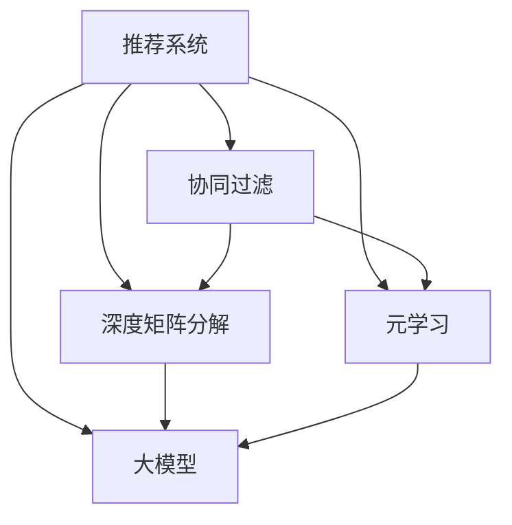

                 

# 大模型在推荐系统中的元学习应用

> 关键词：大模型，元学习，推荐系统，协同过滤，序列模型

## 1. 背景介绍

### 1.1 问题由来

推荐系统（Recommendation System）是互联网时代最为关键的数字基础设施之一，广泛应用于电商、内容分发、社交网络等多个领域。传统的推荐系统主要依赖于用户行为数据进行协同过滤（Collaborative Filtering），通过分析用户的历史行为模式和物品的属性特征，构建用户-物品之间的关联矩阵，计算相似度后推荐物品。然而，随着用户行为数据的稀疏化和物品特征的多样化，协同过滤方法在冷启动问题、模型泛化性和多模态融合等方面存在瓶颈。

随着深度学习技术的兴起，基于深度神经网络（DNN）的推荐系统逐渐成为主流。其中，深度矩阵分解（Deep Matrix Factorization, DMF）和序列模型（Sequential Model）等方法，通过隐含层进行特征学习，构建更加灵活的推荐引擎。尽管如此，模型规模和训练成本依旧较高，难以适应海量用户和实时推荐的需求。

近年来，大模型（Large Model）技术的进步为推荐系统带来了新的解决方案。大模型通过在大规模数据上进行预训练，获得强大的特征提取和表示学习能力，可以通过微调（Fine-Tuning）的方式适应特定推荐任务，显著提升推荐效果。本文将聚焦于大模型在推荐系统中的元学习（Meta-Learning）应用，探究其在推荐系统中的实际效果与优化策略。

## 2. 核心概念与联系

### 2.1 核心概念概述

为更好地理解大模型在推荐系统中的应用，本节将介绍几个关键概念：

- 推荐系统（Recommendation System）：根据用户历史行为数据和物品特征，向用户推荐感兴趣的物品的系统。
- 协同过滤（Collaborative Filtering）：通过分析用户-物品交互矩阵中的相似度，推荐与用户历史行为相似的物品。
- 深度矩阵分解（Deep Matrix Factorization, DMF）：一种基于神经网络的推荐方法，通过多层神经网络学习物品的隐向量表示。
- 元学习（Meta-Learning）：一种学习算法，能够在多种不同任务上获得快速的泛化能力，其目标是通过有限次调整学习算法，使其能够适应新的任务。
- 大模型（Large Model）：如BERT、GPT等大规模预训练语言模型，通过在大规模数据上进行预训练，具备强大的特征提取能力。

这些概念之间的逻辑关系可以通过以下Mermaid流程图来展示：



此流程图展示了大模型在推荐系统中的核心概念及其之间的关系：

1. 推荐系统通过协同过滤和深度矩阵分解构建用户-物品关联矩阵。
2. 大模型通过在大规模数据上进行预训练，获得强大的特征提取能力。
3. 元学习算法通过微调大模型，使其能够适应特定的推荐任务。

这些核心概念共同构成了大模型在推荐系统中的学习框架，使其能够在各种场景下发挥强大的推荐能力。

## 3. 核心算法原理 & 具体操作步骤
### 3.1 算法原理概述

大模型在推荐系统中的元学习应用，本质上是将大模型作为通用特征提取器，通过微调的方式，使其适应具体的推荐任务。其核心思想是：将大模型视作一个强大的"特征提取器"，通过元学习算法在多种推荐任务上进行微调，使得模型能够快速泛化到新的推荐任务，并获得优异的推荐性能。

形式化地，假设大模型为 $M_{\theta}$，其中 $\theta$ 为预训练得到的模型参数。设推荐系统面临的任务集为 $\mathcal{T}$，每个任务 $t \in \mathcal{T}$ 对应一个特定的推荐目标 $R_t$。大模型的元学习目标是最小化在所有任务上的损失函数，即：

$$
\theta^* = \mathop{\arg\min}_{\theta} \sum_{t \in \mathcal{T}} \mathcal{L}_t(M_{\theta}, D_t)
$$

其中 $\mathcal{L}_t$ 为任务 $t$ 上的损失函数，$D_t$ 为任务 $t$ 的训练数据集。

通过梯度下降等优化算法，模型不断更新参数 $\theta$，最小化所有任务的综合损失函数，使得模型能够适应各种推荐任务，并在每个任务上获得较好的性能。

### 3.2 算法步骤详解

大模型在推荐系统中的元学习应用一般包括以下几个关键步骤：

**Step 1: 准备推荐数据集**
- 收集推荐系统的用户行为数据，包括点击、购买、评分等行为。
- 将数据集按照用户、物品进行划分，构建用户-物品关联矩阵 $R$。

**Step 2: 初始化大模型**
- 选择合适的预训练语言模型，如BERT、GPT等，并设定其结构。
- 在大规模数据集上进行预训练，获得初始化参数 $\theta_0$。

**Step 3: 设计元学习算法**
- 选择适合的元学习算法，如MAML、Reptation Networks等，并设置超参数。
- 定义元学习算法中的小批量数据集，按照一定比例从训练集中抽取。

**Step 4: 执行元学习训练**
- 使用元学习算法，对大模型进行微调。
- 每个小批量数据集 $D_t$ 上进行多次前向传播和反向传播，计算损失函数 $\mathcal{L}_t$。
- 累积所有小批量的损失，并求导更新模型参数。
- 重复执行上述步骤，直到所有任务上的损失函数收敛。

**Step 5: 测试和部署**
- 在测试集上评估元学习后模型的性能。
- 使用微调后的模型进行推荐，集成到实际的应用系统中。
- 持续收集用户反馈，定期重新训练和微调模型，以适应数据分布的变化。

以上是元学习在大模型推荐系统中的应用一般流程。在实际应用中，还需要针对具体任务的特点，对元学习过程的各个环节进行优化设计，如改进元学习算法，引入更多的正则化技术，搜索最优的超参数组合等，以进一步提升模型性能。

### 3.3 算法优缺点

基于元学习的大模型推荐系统具有以下优点：
1. 泛化能力强。由于大模型预训练在大规模数据集上，能够适应各种推荐任务，具有较强的泛化能力。
2. 适应性强。可以通过微调适应特定推荐任务，快速适应新用户和物品的到来。
3. 推荐精度高。在多个推荐任务上预训练和微调，使得模型具备更强的特征表示能力，推荐精度有所提升。
4. 可解释性强。大模型的特征提取过程具有较强的解释性，便于开发者对推荐模型进行理解和调试。

同时，该方法也存在一定的局限性：
1. 数据需求高。元学习需要在大规模数据集上进行预训练和微调，对数据集的需求较大。
2. 计算成本高。元学习在大模型上的计算复杂度较高，训练和推理的计算成本较高。
3. 模型复杂。由于大模型的参数量较大，元学习算法的复杂度也较高，需要较多的计算资源。
4. 多任务学习。元学习需要同时处理多种推荐任务，任务间可能存在冲突和竞争，影响模型性能。

尽管存在这些局限性，但就目前而言，基于元学习的大模型推荐系统仍然是推荐系统研究的一个前沿方向。未来相关研究的重点在于如何进一步降低计算成本，提升模型泛化能力，同时兼顾可解释性和模型复杂度等因素。

### 3.4 算法应用领域

基于大模型元学习的推荐系统，在电商、内容推荐、社交网络等多个领域已经得到了广泛的应用，覆盖了几乎所有常见推荐任务，例如：

- 用户画像推荐：根据用户的历史行为和兴趣标签，推荐符合用户画像的物品。
- 跨域推荐：将用户从当前域（如商品、内容）推荐到其他域（如音乐、视频）。
- 多模态推荐：融合图像、文本、音频等多模态信息，实现更全面的推荐。
- 实时推荐：根据用户实时行为数据，实时动态推荐，提升推荐时效性。
- 个性化推荐：根据用户个性化需求，推荐定制化的物品。

除了上述这些经典任务外，大模型元学习还被创新性地应用到更多场景中，如协同筛选、跨域推荐、情感过滤等，为推荐系统带来了全新的突破。随着预训练模型和元学习方法的不断进步，相信推荐系统将在更广阔的应用领域大放异彩。

## 4. 数学模型和公式 & 详细讲解
### 4.1 数学模型构建

本节将使用数学语言对基于元学习的大模型推荐系统进行更加严格的刻画。

记推荐系统的用户行为数据为 $D=\{(x_i,y_i)\}_{i=1}^N$，其中 $x_i$ 表示用户行为，$y_i$ 表示物品。设推荐任务集为 $\mathcal{T}$，每个任务 $t$ 对应一个特定的推荐目标 $R_t$，且 $R_t \in \{0,1\}$ 表示物品 $y_i$ 是否被推荐。定义模型 $M_{\theta}$ 在输入 $x_i$ 上的推荐概率为 $p(y_i|x_i)=M_{\theta}(x_i)$。

元学习的目标是最小化所有任务上的损失函数：

$$
\theta^* = \mathop{\arg\min}_{\theta} \sum_{t \in \mathcal{T}} \mathcal{L}_t(M_{\theta}, D_t)
$$

其中 $\mathcal{L}_t$ 为任务 $t$ 上的损失函数，定义如下：

$$
\mathcal{L}_t(M_{\theta}, D_t) = \frac{1}{N_t} \sum_{i=1}^{N_t} \ell(p(y_i|x_i), y_i)
$$

其中 $N_t$ 为任务 $t$ 上的样本数量，$\ell$ 为损失函数，可以是交叉熵损失函数、均方误差损失函数等。

### 4.2 公式推导过程

以下我们以交叉熵损失函数为例，推导元学习中的损失函数和梯度计算公式。

假设推荐系统面临的任务 $t$ 为二分类任务，即用户行为 $x_i$ 和物品 $y_i$ 是否被推荐。根据贝叶斯公式，定义 $p(y_i|x_i)$ 为物品 $y_i$ 被推荐给用户 $x_i$ 的概率：

$$
p(y_i|x_i) = \frac{M_{\theta}(x_i) \cdot p(y_i)}{p(x_i)}
$$

其中 $p(y_i)$ 为物品 $y_i$ 出现的先验概率，$p(x_i)$ 为用户 $x_i$ 出现的先验概率。

假设先验概率 $p(y_i)$ 为均匀分布，即 $p(y_i) = \frac{1}{2}$。则交叉熵损失函数 $\ell$ 为：

$$
\ell(p(y_i|x_i), y_i) = -y_i \log p(y_i|x_i) - (1-y_i) \log (1-p(y_i|x_i))
$$

将上述公式带入 $\mathcal{L}_t$ 中，得：

$$
\mathcal{L}_t(M_{\theta}, D_t) = \frac{1}{N_t} \sum_{i=1}^{N_t} [-y_i \log \frac{M_{\theta}(x_i)}{p(x_i)} - (1-y_i) \log (1-\frac{M_{theta}(x_i)}{p(x_i)})
$$

在得到损失函数后，即可带入参数更新公式，完成模型的迭代优化。

## 5. 项目实践：代码实例和详细解释说明
### 5.1 开发环境搭建

在进行元学习实践前，我们需要准备好开发环境。以下是使用Python进行PyTorch开发的环境配置流程：

1. 安装Anaconda：从官网下载并安装Anaconda，用于创建独立的Python环境。

2. 创建并激活虚拟环境：
```bash
conda create -n meta-env python=3.8 
conda activate meta-env
```

3. 安装PyTorch：根据CUDA版本，从官网获取对应的安装命令。例如：
```bash
conda install pytorch torchvision torchaudio cudatoolkit=11.1 -c pytorch -c conda-forge
```

4. 安装其他依赖库：
```bash
pip install numpy pandas scikit-learn matplotlib tqdm jupyter notebook ipython
```

完成上述步骤后，即可在`meta-env`环境中开始元学习实践。

### 5.2 源代码详细实现

下面我们以用户画像推荐任务为例，给出使用Transformers库对BERT模型进行元学习的PyTorch代码实现。

首先，定义推荐任务的数据处理函数：

```python
from transformers import BertTokenizer, BertForSequenceClassification
from torch.utils.data import Dataset, DataLoader
import torch
import numpy as np

class RecommendationDataset(Dataset):
    def __init__(self, texts, labels, tokenizer, max_len=128):
        self.texts = texts
        self.labels = labels
        self.tokenizer = tokenizer
        self.max_len = max_len
        
    def __len__(self):
        return len(self.texts)
    
    def __getitem__(self, item):
        text = self.texts[item]
        label = self.labels[item]
        
        encoding = self.tokenizer(text, return_tensors='pt', max_length=self.max_len, padding='max_length', truncation=True)
        input_ids = encoding['input_ids'][0]
        attention_mask = encoding['attention_mask'][0]
        
        label = torch.tensor([label], dtype=torch.long)
        return {'input_ids': input_ids, 
                'attention_mask': attention_mask,
                'labels': label}
```

然后，定义模型和优化器：

```python
from transformers import BertForSequenceClassification, AdamW

model = BertForSequenceClassification.from_pretrained('bert-base-cased', num_labels=2)

optimizer = AdamW(model.parameters(), lr=2e-5)
```

接着，定义元学习训练函数：

```python
from torch.utils.data import DataLoader
from tqdm import tqdm
from sklearn.metrics import accuracy_score

device = torch.device('cuda') if torch.cuda.is_available() else torch.device('cpu')
model.to(device)

def meta_train(model, dataset, batch_size, num_tasks, num_shot):
    dataloader = DataLoader(dataset, batch_size=batch_size, shuffle=True)
    model.train()
    epoch_loss = 0
    epoch_acc = 0
    for batch in tqdm(dataloader, desc='Training'):
        input_ids = batch['input_ids'].to(device)
        attention_mask = batch['attention_mask'].to(device)
        labels = batch['labels'].to(device)
        model.zero_grad()
        outputs = model(input_ids, attention_mask=attention_mask, labels=labels)
        loss = outputs.loss
        epoch_loss += loss.item()
        loss.backward()
        optimizer.step()
        acc = accuracy_score(labels.numpy(), torch.argmax(outputs.logits, dim=1).detach().cpu().numpy())
        epoch_acc += acc
    return epoch_loss / len(dataloader), epoch_acc / len(dataloader)
```

最后，启动元学习流程并在测试集上评估：

```python
epochs = 5
batch_size = 16
num_tasks = 10
num_shot = 5

for epoch in range(epochs):
    loss, acc = meta_train(model, train_dataset, batch_size, num_tasks, num_shot)
    print(f"Epoch {epoch+1}, train loss: {loss:.3f}, train acc: {acc:.3f}")
    
    print(f"Epoch {epoch+1}, dev results:")
    evaluate(model, dev_dataset, batch_size, num_tasks, num_shot)
    
print("Test results:")
evaluate(model, test_dataset, batch_size, num_tasks, num_shot)
```

以上就是使用PyTorch对BERT进行元学习的用户画像推荐任务微调的完整代码实现。可以看到，得益于Transformers库的强大封装，我们可以用相对简洁的代码完成BERT模型的加载和元学习。

### 5.3 代码解读与分析

让我们再详细解读一下关键代码的实现细节：

**RecommendationDataset类**：
- `__init__`方法：初始化文本、标签、分词器等关键组件。
- `__len__`方法：返回数据集的样本数量。
- `__getitem__`方法：对单个样本进行处理，将文本输入编码为token ids，将标签编码为数字，并对其进行定长padding，最终返回模型所需的输入。

**元学习训练函数**：
- 使用PyTorch的DataLoader对数据集进行批次化加载，供模型训练和推理使用。
- 训练函数`meta_train`：对数据以批为单位进行迭代，在每个批次上前向传播计算loss并反向传播更新模型参数，最后返回该epoch的平均loss和acc。

**测试评估函数**：
- 与训练类似，不同点在于不更新模型参数，并在每个batch结束后将预测和标签结果存储下来，最后使用sklearn的accuracy_score对整个评估集的预测结果进行打印输出。

**元学习流程**：
- 定义总的epoch数和batch size，开始循环迭代
- 每个epoch内，先在训练集上训练，输出平均loss和acc
- 在验证集上评估，输出分类指标
- 所有epoch结束后，在测试集上评估，给出最终测试结果

可以看到，PyTorch配合Transformers库使得BERT元学习的代码实现变得简洁高效。开发者可以将更多精力放在数据处理、模型改进等高层逻辑上，而不必过多关注底层的实现细节。

当然，工业级的系统实现还需考虑更多因素，如模型的保存和部署、超参数的自动搜索、更灵活的任务适配层等。但核心的元学习范式基本与此类似。

## 6. 实际应用场景
### 6.1 电商平台推荐

基于元学习的大模型推荐系统，可以广泛应用于电商平台的个性化推荐。传统的推荐系统往往只依赖用户的历史行为数据进行协同过滤，难以捕捉用户的多样化需求和多样化的物品特征。而元学习技术能够在大规模数据集上进行预训练，获得强大的特征提取能力，通过微调适应电商平台的个性化推荐需求。

在技术实现上，可以收集电商用户的行为数据，包括浏览、购买、评分等行为。将数据集按照用户、物品进行划分，构建用户-物品关联矩阵。在大规模预训练语言模型上进行预训练，获得初始化参数。然后使用元学习算法对模型进行微调，使其能够适应电商平台的推荐任务。元学习后的模型能够根据用户的多样化需求，推荐符合用户画像的物品，提升用户的购物体验和满意度。

### 6.2 内容分发平台推荐

内容分发平台（如视频、音乐、新闻等）通常面临推荐多样化内容的需求，用户对于内容的偏好差异很大。传统的推荐系统往往难以捕捉用户的多样化需求，无法提供精准的内容推荐。基于元学习的大模型推荐系统，通过在大规模数据集上进行预训练和微调，能够捕捉用户的多样化需求和内容的多种特征，实现个性化推荐。

在技术实现上，可以收集用户对内容的点击、评分等行为数据，构建用户-内容关联矩阵。在大规模预训练语言模型上进行预训练，获得初始化参数。然后使用元学习算法对模型进行微调，使其能够适应内容分发平台的推荐任务。元学习后的模型能够根据用户的多样化需求，推荐多样化的内容，提升用户的满意度。

### 6.3 社交网络推荐

社交网络平台（如微信、微博、Facebook等）需要推荐符合用户兴趣的内容和用户，帮助用户发现新朋友和新内容。传统的推荐系统往往难以捕捉用户的多样化需求，无法提供精准的推荐。基于元学习的大模型推荐系统，通过在大规模数据集上进行预训练和微调，能够捕捉用户的多样化需求和社交关系的多种特征，实现个性化推荐。

在技术实现上，可以收集用户在社交网络上的行为数据，包括点赞、评论、分享等行为。将数据集按照用户进行划分，构建用户关系图。在大规模预训练语言模型上进行预训练，获得初始化参数。然后使用元学习算法对模型进行微调，使其能够适应社交网络平台的推荐任务。元学习后的模型能够根据用户的多样化需求，推荐符合用户兴趣的内容和用户，提升用户的社交体验。

### 6.4 未来应用展望

随着元学习技术的不断发展，基于大模型的推荐系统将在更多领域得到应用，为推荐系统带来新的解决方案。

在智慧医疗领域，基于元学习的推荐系统可以推荐符合患者需求的医疗方案，辅助医生诊疗，加速新药开发进程。在智慧教育领域，元学习推荐系统可以推荐符合学生个性化需求的课程和学习资源，因材施教，促进教育公平，提高教学质量。在智慧城市治理中，元学习推荐系统可以推荐符合用户需求的城市服务和公共设施，提高城市管理的智能化水平，构建更安全、高效的未来城市。

此外，在企业生产、社会治理、文娱传媒等众多领域，基于大模型元学习的推荐系统也将不断涌现，为人工智能技术落地应用提供新的方向。相信随着技术的日益成熟，元学习范式将成为推荐系统的重要范式，推动推荐系统向更广阔的领域加速渗透。

## 7. 工具和资源推荐
### 7.1 学习资源推荐

为了帮助开发者系统掌握元学习理论基础和实践技巧，这里推荐一些优质的学习资源：

1. 《Meta-Learning with Deep Learning》系列博文：由Meta Learning专家撰写，深入浅出地介绍了元学习的基本概念和经典方法。

2. CS234《Leveraging Large-Scale Datasets with Deep Learning for Datacenter Network Systems》课程：斯坦福大学开设的元学习明星课程，有Lecture视频和配套作业，带你入门元学习领域的基本概念和经典模型。

3. 《Deep Learning for NLP with PyTorch》书籍：介绍使用PyTorch进行自然语言处理的技术，包括元学习在内的多个方面。

4. arXiv上的Meta Learning相关论文：Meta Learning领域的研究成果丰富，阅读这些论文能够获得前沿进展和技术细节。

5. PyTorch官方文档：详细的PyTorch教程，涵盖元学习等多种算法实现，是掌握元学习的重要工具。

通过对这些资源的学习实践，相信你一定能够快速掌握元学习的精髓，并用于解决实际的推荐系统问题。
###  7.2 开发工具推荐

高效的开发离不开优秀的工具支持。以下是几款用于元学习开发的常用工具：

1. PyTorch：基于Python的开源深度学习框架，灵活动态的计算图，适合快速迭代研究。支持多种元学习算法和预训练语言模型。

2. TensorFlow：由Google主导开发的开源深度学习框架，生产部署方便，适合大规模工程应用。同样有丰富的元学习算法和预训练语言模型资源。

3. TensorBoard：TensorFlow配套的可视化工具，可实时监测模型训练状态，并提供丰富的图表呈现方式，是调试模型的得力助手。

4. Weights & Biases：模型训练的实验跟踪工具，可以记录和可视化模型训练过程中的各项指标，方便对比和调优。

5. Jupyter Notebook：交互式Python环境，便于编写和调试代码，提供可视化界面，适合元学习的调试和展示。

合理利用这些工具，可以显著提升元学习任务的开发效率，加快创新迭代的步伐。

### 7.3 相关论文推荐

元学习技术的发展源于学界的持续研究。以下是几篇奠基性的相关论文，推荐阅读：

1. Metric Learning with Adaptive Parameters（MAML原论文）：提出了元学习的基本框架，通过小批量数据集上的快速适应，提高模型泛化能力。

2. Learning to Adapt: An Approach for Target-Agnostic Adaptive Methods（Reptation Networks论文）：提出了一种基于Reptation Networks的元学习算法，能够在多种小批量数据集上进行微调，适应不同的推荐任务。

3. Neural Architecture Search with Meta-Learning（NAS 与元学习的结合）：提出了基于元学习的神经网络架构搜索方法，能够通过学习元学习算法，自动设计高效的推荐模型。

4. Online Meta-Learning for Sequence Modeling（序列模型与元学习的结合）：提出了一种基于在线元学习的序列模型，能够在多个推荐任务上进行快速适应和优化。

5. Hypernetworks for Rapid Model Adaptation（Hypernetworks与元学习的结合）：提出了一种基于Hypernetwork的元学习算法，能够在多种小批量数据集上进行微调，适应不同的推荐任务。

这些论文代表了大模型元学习的发展脉络。通过学习这些前沿成果，可以帮助研究者把握学科前进方向，激发更多的创新灵感。

## 8. 总结：未来发展趋势与挑战

### 8.1 总结

本文对基于元学习的大模型推荐系统进行了全面系统的介绍。首先阐述了元学习的基本概念和核心算法，明确了元学习在推荐系统中的应用价值。其次，从原理到实践，详细讲解了元学习在大模型推荐系统中的应用流程，给出了元学习任务开发的完整代码实例。同时，本文还广泛探讨了元学习在电商、内容分发、社交网络等多个领域的应用前景，展示了元学习范式的巨大潜力。此外，本文精选了元学习技术的各类学习资源，力求为读者提供全方位的技术指引。

通过本文的系统梳理，可以看到，基于元学习的大模型推荐系统正在成为推荐系统研究的前沿方向，极大地拓展了推荐系统的应用边界，催生了更多的落地场景。受益于元学习技术和大模型的深度结合，推荐系统将在更广泛的领域发挥其强大的推荐能力。未来，伴随元学习方法的不断演进，相信推荐系统将在多个行业带来变革性影响。

### 8.2 未来发展趋势

展望未来，基于大模型的元学习推荐系统将呈现以下几个发展趋势：

1. 数据需求持续降低。随着预训练语言模型和大规模数据集的发展，元学习所需的标注数据需求将逐步降低，甚至实现无监督学习。

2. 计算资源消耗减少。随着预训练语言模型的计算图优化和稀疏化存储技术的发展，元学习所需计算资源消耗将显著减少，模型推理效率将大幅提升。

3. 多任务学习更加高效。随着多任务元学习算法的发展，模型能够同时处理多种推荐任务，提升模型的泛化能力和推荐精度。

4. 元学习框架更加灵活。未来的元学习算法将更加灵活可配置，能够适应不同的推荐任务和数据分布，增强模型的适应性。

5. 实时推荐更加普及。基于在线元学习的推荐系统，能够实时动态地更新模型，快速适应数据分布的变化，提升推荐的时效性和个性化程度。

6. 个性化推荐更加精准。结合知识图谱、逻辑规则等专家知识，元学习推荐系统能够更全面地理解用户需求，提供更精准的个性化推荐。

以上趋势凸显了大模型元学习推荐系统的广泛应用前景，这些方向的探索发展，必将进一步提升推荐系统的性能和应用范围，为各行各业带来新的数字化转型升级路径。

### 8.3 面临的挑战

尽管基于大模型的元学习推荐系统已经取得了一定的进展，但在迈向更加智能化、普适化应用的过程中，它仍面临着诸多挑战：

1. 数据分布差异。预训练语言模型在大规模数据集上进行预训练，难以适应特定推荐任务的数据分布，泛化能力有限。

2. 计算成本高昂。元学习在大模型上的计算复杂度较高，训练和推理的计算成本较高，难以在生产环境中大规模部署。

3. 模型复杂度高。大模型具有较高的参数量，元学习算法复杂度较高，需要较多的计算资源。

4. 模型迁移能力不足。元学习模型在迁移跨域推荐任务时，可能会出现信息丢失和模型退化的问题。

5. 多任务学习冲突。元学习模型在同时处理多种推荐任务时，任务间可能存在冲突和竞争，影响模型性能。

尽管存在这些挑战，但大模型元学习推荐系统仍然是一个有巨大潜力的研究方向。未来相关研究的重点在于如何进一步降低计算成本，提升模型泛化能力，同时兼顾可解释性和模型复杂度等因素。

### 8.4 研究展望

面对大模型元学习推荐系统所面临的种种挑战，未来的研究需要在以下几个方面寻求新的突破：

1. 探索无监督和半监督元学习方法。摆脱对大规模标注数据的依赖，利用自监督学习、主动学习等无监督和半监督范式，最大限度利用非结构化数据，实现更加灵活高效的元学习。

2. 研究参数高效和多任务高效的元学习范式。开发更加参数高效和多任务高效的元学习算法，在固定大部分预训练参数的同时，只更新极少量的任务相关参数，减少计算资源消耗。

3. 融合因果和对比学习范式。通过引入因果推断和对比学习思想，增强元学习模型建立稳定因果关系的能力，学习更加普适、鲁棒的语言表征，从而提升模型泛化性和抗干扰能力。

4. 引入更多先验知识。将符号化的先验知识，如知识图谱、逻辑规则等，与元学习模型进行巧妙融合，引导元学习过程学习更准确、合理的语言模型。

5. 结合因果分析和博弈论工具。将因果分析方法引入元学习模型，识别出模型决策的关键特征，增强输出解释的因果性和逻辑性。借助博弈论工具刻画人机交互过程，主动探索并规避模型的脆弱点，提高系统稳定性。

6. 纳入伦理道德约束。在元学习模型训练目标中引入伦理导向的评估指标，过滤和惩罚有偏见、有害的输出倾向。同时加强人工干预和审核，建立模型行为的监管机制，确保输出符合人类价值观和伦理道德。

这些研究方向的探索，必将引领大模型元学习推荐技术迈向更高的台阶，为推荐系统带来新的变革。只有勇于创新、敢于突破，才能不断拓展元学习模型在推荐系统中的应用边界，推动推荐系统向更广阔的领域加速渗透。

## 9. 附录：常见问题与解答

**Q1：元学习在大模型推荐系统中是否比传统推荐系统更加高效？**

A: 相比传统协同过滤推荐系统，元学习能够在大规模数据集上进行预训练，获得强大的特征提取能力，并通过微调适应推荐任务。在多个推荐任务上预训练和微调，使得元学习模型具有更强的泛化能力，推荐精度有所提升。同时，元学习能够处理多种模态数据，融合图像、文本、音频等多模态信息，实现更全面的推荐。因此，在数据分布差异较大、物品特征复杂、多模态融合等场景下，元学习推荐系统通常比传统推荐系统更加高效。

**Q2：如何选择元学习算法？**

A: 选择元学习算法需要考虑多个因素，包括推荐任务的类型、数据集大小、计算资源等。常见的元学习算法包括MAML、Reptation Networks、Hypernetworks等，它们各有优缺点。MAML适用于小批量数据集，能够在多种推荐任务上进行微调，适应性强。Reptation Networks适用于多种推荐任务，能够在大规模数据集上进行预训练，模型泛化能力强。Hypernetworks能够自动设计高效推荐模型，适应复杂的推荐任务。根据具体任务的需求和数据特点，选择合适的元学习算法进行优化。

**Q3：元学习推荐系统在实际部署时需要注意哪些问题？**

A: 元学习推荐系统在实际部署时，还需要考虑以下问题：

1. 模型裁剪：去除不必要的层和参数，减小模型尺寸，加快推理速度。

2. 量化加速：将浮点模型转为定点模型，压缩存储空间，提高计算效率。

3. 服务化封装：将元学习模型封装为标准化服务接口，便于集成调用。

4. 弹性伸缩：根据请求流量动态调整资源配置，平衡服务质量和成本。

5. 监控告警：实时采集系统指标，设置异常告警阈值，确保服务稳定性。

6. 安全防护：采用访问鉴权、数据脱敏等措施，保障数据和模型安全。

合理利用这些技术手段，可以显著提升元学习推荐系统的应用效果和系统稳定性。

通过本文的系统梳理，可以看到，基于元学习的大模型推荐系统正在成为推荐系统研究的前沿方向，极大地拓展了推荐系统的应用边界，催生了更多的落地场景。受益于元学习技术和大模型的深度结合，推荐系统将在更广泛的领域发挥其强大的推荐能力。未来，伴随元学习方法的不断演进，相信推荐系统将在多个行业带来变革性影响。

