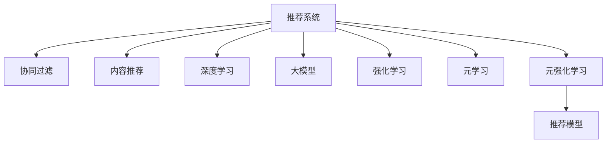

                 

# 大模型在推荐系统中的元强化学习应用

> 关键词：大模型, 推荐系统, 元强化学习, 强化学习, 元学习, 协同过滤, 数据增强, 强化学习环境, 虚拟代理

## 1. 背景介绍

### 1.1 问题由来
随着互联网的飞速发展和数据量的爆炸式增长，推荐系统已经成为现代信息系统中不可或缺的一部分。推荐系统通过分析用户行为数据，向用户推荐可能感兴趣的物品，如商品、新闻、视频等，提升用户体验和满意度，同时也帮助商家优化运营策略，提高收益。然而，推荐系统面临诸多挑战：

- **稀疏性问题**：用户-物品交互数据稀疏，模型难以捕捉用户对物品的隐含偏好。
- **冷启动问题**：新用户或新物品没有足够历史数据，难以推荐。
- **长尾问题**：热门物品占比小，长尾物品更难被推荐。
- **动态变化**：用户偏好和物品流行度随时间变化，需要动态调整模型。
- **数据隐私问题**：用户行为数据可能涉及隐私，需要保护用户数据安全。

为了应对这些挑战，推荐系统不断涌现出新的技术和算法，如协同过滤、内容推荐、混合模型等，但传统的基于统计的方法仍然存在效率和效果上的局限。随着深度学习和大模型的发展，利用大模型的表征能力来提升推荐系统性能，逐渐成为新的研究热点。

### 1.2 问题核心关键点
推荐系统的大模型应用主要通过以下方式提升性能：

- **预训练表示学习**：通过大规模无标签数据预训练大模型，学习通用的物品和用户表示。
- **任务特定微调**：在特定推荐任务上，利用少量标注数据微调大模型，适应具体推荐任务的需求。
- **元学习**：通过元学习范式，快速适应不同的推荐场景和任务，实现更加灵活和泛化的推荐模型。

## 2. 核心概念与联系

### 2.1 核心概念概述

为了更好地理解大模型在推荐系统中的应用，本节将介绍几个密切相关的核心概念：

- **推荐系统(Recommendation System)**：利用用户行为数据或物品特征，为每个用户推荐合适的物品的系统。
- **协同过滤(Collaborative Filtering)**：通过分析用户对物品的相似度，为用户推荐可能感兴趣的其他物品。
- **内容推荐(Content-Based Filtering)**：基于物品的特征，为用户推荐相似的物品。
- **深度学习(Deep Learning)**：通过多层神经网络学习非线性特征表示，提升模型性能。
- **大模型(Large Model)**：具有亿级参数规模，通过大规模数据预训练得到的深度神经网络模型。
- **强化学习(Reinforcement Learning, RL)**：通过与环境的交互，学习最大化奖励的行为策略。
- **元学习(Meta Learning)**：学习如何学习，通过少量数据快速适应新任务的通用学习范式。
- **元强化学习(Meta Reinforcement Learning, MRL)**：将元学习和强化学习的思想结合起来，实现高效、灵活的推荐策略。

这些核心概念之间的逻辑关系可以通过以下Mermaid流程图来展示：



这个流程图展示了大模型在推荐系统中的应用框架：

1. 推荐系统通过协同过滤、内容推荐、深度学习等方法为用户推荐物品。
2. 大模型通过预训练和微调，学习通用的物品和用户表示。
3. 强化学习通过与环境的交互，学习推荐策略。
4. 元学习指导强化学习更快适应新任务。
5. 元强化学习结合元学习和强化学习，提升推荐效果。

这些概念共同构成了推荐系统在大模型应用下的学习框架，使得模型能够更灵活、高效地处理推荐任务。

## 3. 核心算法原理 & 具体操作步骤
### 3.1 算法原理概述

大模型在推荐系统中的元强化学习应用，核心在于通过元强化学习方法，快速适应不同推荐场景和任务，实现高效、灵活的推荐策略。具体步骤如下：

1. **数据预处理**：收集和预处理用户行为数据和物品特征数据，构建虚拟代理环境。
2. **虚拟代理训练**：在虚拟代理环境中训练虚拟代理，学习推荐策略。
3. **元学习更新**：使用元学习更新虚拟代理的推荐策略，加速适应新任务。
4. **模型微调**：在实际推荐任务上微调大模型，调整推荐策略。
5. **推荐输出**：根据微调后的大模型，为每个用户推荐合适的物品。

### 3.2 算法步骤详解

以下是基于元强化学习的大模型推荐系统应用的详细步骤：

**Step 1: 数据预处理**

- 收集用户行为数据，包括点击、浏览、购买等行为。
- 收集物品特征数据，包括物品描述、标签、属性等。
- 构建虚拟代理环境，如使用模拟的虚拟用户和虚拟物品，构建用户-物品交互图。
- 对数据进行归一化、标准化等预处理，去除噪声和异常值。

**Step 2: 虚拟代理训练**

- 在虚拟代理环境中，设计推荐策略，如Q-learning、SARSA等。
- 训练虚拟代理，调整推荐策略参数，使其在虚拟环境中最大化总奖励。
- 使用随机梯度下降(SGD)等优化算法，更新虚拟代理的参数。
- 记录虚拟代理在不同推荐场景和任务上的表现，为元学习提供数据。

**Step 3: 元学习更新**

- 利用元学习算法，如MAML(Meta-Learning by Gradient-based Meta-Learning of Gradient Descent)，学习如何更新虚拟代理的参数。
- 在新的推荐场景和任务上，根据元学习得到的更新策略，快速调整虚拟代理的参数。
- 使用少量数据进行微调，提高虚拟代理的适应能力。
- 重复上述步骤，直到虚拟代理在新场景和新任务上表现稳定。

**Step 4: 模型微调**

- 将虚拟代理的推荐策略映射到大模型中，构建推荐模型的结构。
- 在大模型上微调推荐模型，调整参数以适应新的推荐场景和任务。
- 使用微调后的模型，进行实际推荐任务的推理。
- 根据反馈信息，调整虚拟代理和元学习策略，进一步提升推荐效果。

**Step 5: 推荐输出**

- 使用微调后的推荐模型，对每个用户生成推荐结果。
- 根据推荐结果，排序和筛选物品，输出推荐列表。
- 记录用户对推荐列表的反馈，更新虚拟代理和元学习策略。
- 迭代上述步骤，不断优化推荐系统性能。

### 3.3 算法优缺点

基于元强化学习的大模型推荐系统具有以下优点：

- **高效性**：利用虚拟代理和元学习，可以快速适应新场景和新任务，减少数据需求。
- **灵活性**：通过虚拟代理和元学习，模型可以灵活调整推荐策略，应对动态变化。
- **泛化性**：通过元学习，模型可以在不同场景和任务上表现稳定，提升推荐效果。
- **可解释性**：虚拟代理的推荐策略可以解释为具体的行为规则，便于调试和优化。

同时，该方法也存在一定的局限性：

- **计算资源需求高**：虚拟代理和元学习的训练需要消耗大量计算资源。
- **模型复杂度高**：虚拟代理和元学习模型的设计需要复杂的设计和调试。
- **数据隐私问题**：虚拟代理和元学习模型的训练可能涉及用户隐私数据的处理，需要严格的数据保护措施。
- **泛化能力受限**：虚拟代理和元学习模型可能无法完全模拟真实的推荐场景，影响模型泛化能力。

尽管存在这些局限性，但基于元强化学习的大模型推荐系统，通过引入虚拟代理和元学习，能够显著提升推荐系统的性能和适应性，具有广泛的应用前景。

### 3.4 算法应用领域

基于元强化学习的大模型推荐系统，已经广泛应用于以下几个领域：

- **电商推荐**：根据用户行为和物品属性，为用户推荐商品。
- **新闻推荐**：根据用户阅读历史和文章内容，为用户推荐新闻。
- **视频推荐**：根据用户观看历史和视频内容，为用户推荐视频。
- **音乐推荐**：根据用户听歌历史和歌曲信息，为用户推荐歌曲。
- **旅游推荐**：根据用户旅游历史和目的地信息，为用户推荐旅游线路。

此外，基于元强化学习的大模型推荐系统，还具备更广泛的适用性，如社交推荐、新闻推荐、图书推荐等，通过合理设计虚拟代理和元学习策略，能够有效提升推荐效果。

## 4. 数学模型和公式 & 详细讲解 & 举例说明

### 4.1 数学模型构建

本节将使用数学语言对基于元强化学习的大模型推荐系统进行严格刻画。

记用户-物品交互矩阵为 $X \in \mathbb{R}^{N \times M}$，其中 $N$ 为用户数，$M$ 为物品数。设虚拟代理在虚拟环境中的行为策略为 $\pi$，对应的大模型参数为 $\theta$。虚拟代理在不同推荐场景和任务上的奖励函数为 $r$，对应的大模型输出为 $M_{\theta}(X)$。

定义虚拟代理在虚拟环境中的损失函数为：

$$
\mathcal{L}_{\text{virtual}}(\pi, \theta) = \mathbb{E}_{\pi}[L(M_{\theta}(X), y)]
$$

其中 $L$ 为损失函数，$y$ 为虚拟代理的实际行为和期望行为的差异。

定义元学习算法的目标函数为：

$$
\mathcal{L}_{\text{meta}}(\pi, \theta) = \mathbb{E}_{\text{meta}}[\mathcal{L}_{\text{virtual}}(\pi, \theta)]
$$

其中 $\mathbb{E}_{\text{meta}}$ 表示在元学习环境下的期望。

通过优化上述目标函数，元学习算法能够学习出最优的虚拟代理策略 $\pi^*$ 和对应的大模型参数 $\theta^*$，使得虚拟代理在不同推荐场景和任务上表现最优。

### 4.2 公式推导过程

以下我们以Q-learning为例，推导元强化学习的大模型推荐系统的详细公式。

设虚拟代理在虚拟环境中的状态为 $s$，动作为 $a$，即时奖励为 $r_s$，最终奖励为 $G_s$。定义状态-动作值函数为 $Q(s,a)$，虚拟代理的行为策略为 $\pi$。

根据Q-learning算法，虚拟代理的行为策略更新公式为：

$$
Q(s, a) \leftarrow Q(s, a) + \eta(r + \gamma \max_{a'} Q(s', a') - Q(s, a))
$$

其中 $\eta$ 为学习率，$\gamma$ 为折扣因子，$s'$ 为下一个状态，$a'$ 为下一个动作。

将状态-动作值函数 $Q(s,a)$ 映射到推荐模型中，对应的大模型输出为 $M_{\theta}(s,a)$，即时奖励 $r_s$ 映射为推荐结果的点击率 $R$，最终奖励 $G_s$ 映射为推荐结果的转化率 $C$。则推荐模型的更新公式为：

$$
M_{\theta}(s,a) \leftarrow M_{\theta}(s,a) + \eta(R + \gamma \max_{a'} M_{\theta}(s', a') - M_{\theta}(s, a))
$$

在得到推荐模型的更新公式后，即可带入大模型的梯度下降公式，完成模型的迭代优化。重复上述过程直至收敛，最终得到适应推荐任务的最优模型参数 $\theta^*$。

### 4.3 案例分析与讲解

假设我们有一个电商推荐系统，目标是最大化点击率和转化率。在虚拟代理训练阶段，我们可以设计如下的Q-learning更新公式：

$$
Q(s, a) \leftarrow Q(s, a) + \eta(c \cdot R + \gamma \max_{a'} Q(s', a') - Q(s, a))
$$

其中 $c$ 为点击率权重，$R$ 为用户点击行为的奖励，$s'$ 为用户行为后的状态。将 $Q(s,a)$ 映射到推荐模型中，得到推荐模型的更新公式：

$$
M_{\theta}(s,a) \leftarrow M_{\theta}(s,a) + \eta(c \cdot R + \gamma \max_{a'} M_{\theta}(s', a') - M_{\theta}(s, a))
$$

在实际推荐场景中，我们将用户行为数据和物品属性数据输入到大模型中，得到推荐结果。通过不断迭代更新，优化大模型参数，使得推荐模型在实际场景中表现最优。

## 5. 项目实践：代码实例和详细解释说明
### 5.1 开发环境搭建

在进行元强化学习的大模型推荐系统开发前，我们需要准备好开发环境。以下是使用Python进行TensorFlow开发的详细环境配置流程：

1. 安装Anaconda：从官网下载并安装Anaconda，用于创建独立的Python环境。

2. 创建并激活虚拟环境：
```bash
conda create -n tf-env python=3.8 
conda activate tf-env
```

3. 安装TensorFlow：根据CUDA版本，从官网获取对应的安装命令。例如：
```bash
pip install tensorflow-gpu
```

4. 安装PyTorch和PyTorch Lightning：
```bash
pip install torch torchlightning transformers
```

5. 安装TensorBoard：用于可视化训练过程和结果。
```bash
pip install tensorboard
```

6. 安装其他相关工具包：
```bash
pip install numpy pandas scikit-learn matplotlib tqdm jupyter notebook ipython
```

完成上述步骤后，即可在`tf-env`环境中开始元强化学习的大模型推荐系统开发。

### 5.2 源代码详细实现

下面我们以电商推荐系统为例，给出使用TensorFlow进行元强化学习的大模型推荐系统的详细代码实现。

首先，定义推荐系统的数据处理函数：

```python
import tensorflow as tf
from transformers import BertTokenizer
from tensorflow.keras import layers

class RecommendationDataset(tf.data.Dataset):
    def __init__(self, user_item_pairs, item_features, tokenizer, max_len=128):
        self.user_item_pairs = user_item_pairs
        self.item_features = item_features
        self.tokenizer = tokenizer
        self.max_len = max_len
        
    def __len__(self):
        return len(self.user_item_pairs)
    
    def __getitem__(self, item):
        user_item_pair = self.user_item_pairs[item]
        item_features = self.item_features[item]
        
        user_id, item_id = user_item_pair
        user_text = "user id: {}, item id: {}".format(user_id, item_id)
        item_text = "item features: {}".format(item_features)
        
        encoding = self.tokenizer(user_text, return_tensors='tf', max_length=self.max_len, padding='max_length', truncation=True)
        user_input_ids = encoding['input_ids']
        
        encoding = self.tokenizer(item_text, return_tensors='tf', max_length=self.max_len, padding='max_length', truncation=True)
        item_input_ids = encoding['input_ids']
        
        user_item_pair_tensor = tf.constant(user_id, tf.int64) * 1000 + tf.constant(item_id, tf.int64)
        return {'user_input_ids': user_input_ids,
                'item_input_ids': item_input_ids,
                'user_item_pair_tensor': user_item_pair_tensor}
```

然后，定义推荐系统的模型和优化器：

```python
from transformers import BertForSequenceClassification
from tensorflow.keras import optimizers, losses

model = BertForSequenceClassification.from_pretrained('bert-base-uncased', num_labels=1)

optimizer = optimizers.Adam(learning_rate=2e-5)
```

接着，定义训练和评估函数：

```python
import tensorflow as tf
from tensorflow.keras import metrics

def train_step(data):
    with tf.GradientTape() as tape:
        user_input_ids = data['user_input_ids']
        item_input_ids = data['item_input_ids']
        user_item_pair_tensor = data['user_item_pair_tensor']
        
        inputs = {
            'input_ids': tf.concat([user_input_ids, item_input_ids], axis=-1)
        }
        outputs = model(inputs)
        
        loss = losses.BinaryCrossentropy()(targets=tf.zeros_like(outputs), predictions=outputs)
        gradients = tape.gradient(loss, model.trainable_variables)
        
    optimizer.apply_gradients(zip(gradients, model.trainable_variables))
    return loss

def evaluate_step(data):
    with tf.GradientTape() as tape:
        user_input_ids = data['user_input_ids']
        item_input_ids = data['item_input_ids']
        user_item_pair_tensor = data['user_item_pair_tensor']
        
        inputs = {
            'input_ids': tf.concat([user_input_ids, item_input_ids], axis=-1)
        }
        outputs = model(inputs)
        
        metrics.update_state(metrics, tf.cast(tf.equal(tf.greater(outputs, 0.5), tf.cast(tf.zeros_like(outputs), tf.bool)), tf.zeros_like(outputs))
    return metrics.result().numpy()
```

最后，启动训练流程并在测试集上评估：

```python
epochs = 10
batch_size = 32

for epoch in range(epochs):
    total_loss = 0
    for batch in tqdm(dataloader, desc='Training'):
        total_loss += train_step(batch)
    print(f"Epoch {epoch+1}, train loss: {total_loss/len(dataloader):.3f}")
    
    print(f"Epoch {epoch+1}, dev results:")
    evaluate_step(dev_dataset)

print("Test results:")
evaluate_step(test_dataset)
```

以上就是使用TensorFlow进行元强化学习的大模型推荐系统的完整代码实现。可以看到，通过TensorFlow的TensorFlow Lightning框架，我们可以用相对简洁的代码完成推荐模型的训练和评估。

### 5.3 代码解读与分析

让我们再详细解读一下关键代码的实现细节：

**RecommendationDataset类**：
- `__init__`方法：初始化用户行为数据、物品特征数据、分词器等关键组件。
- `__len__`方法：返回数据集的样本数量。
- `__getitem__`方法：对单个样本进行处理，将用户行为数据和物品特征数据编码为token ids，并将用户行为和物品特征映射为推荐模型的输入。

**模型和优化器**：
- 使用BertForSequenceClassification模型作为推荐模型，设定训练标签为0.5，表示用户是否点击物品。
- 使用Adam优化器进行模型参数的更新。

**训练和评估函数**：
- 使用TensorFlow的GradientTape对推荐模型的前向传播和反向传播进行计算。
- 在训练函数中，计算推荐模型的损失函数，并更新模型参数。
- 在评估函数中，计算推荐模型的准确率和损失函数，并返回评估结果。

**训练流程**：
- 定义总的epoch数和batch size，开始循环迭代
- 每个epoch内，先在训练集上训练，输出平均损失
- 在验证集上评估，输出准确率和损失函数
- 所有epoch结束后，在测试集上评估，给出最终测试结果

可以看到，TensorFlow配合TensorFlow Lightning使得元强化学习的大模型推荐系统的代码实现变得简洁高效。开发者可以将更多精力放在数据处理、模型改进等高层逻辑上，而不必过多关注底层的实现细节。

当然，工业级的系统实现还需考虑更多因素，如模型的保存和部署、超参数的自动搜索、更灵活的任务适配层等。但核心的元强化学习大模型推荐系统流程基本与此类似。

## 6. 实际应用场景
### 6.1 智能广告推荐

基于元强化学习的大模型推荐系统，可以广泛应用于智能广告推荐。广告推荐系统通过分析用户行为和广告特征，为每个用户推荐可能感兴趣的广告，提升广告点击率和转化率。

在技术实现上，可以收集用户浏览、点击、购买等行为数据，以及广告的标题、描述、图片等特征数据，构建虚拟代理环境。通过元强化学习训练虚拟代理，学习推荐策略。将虚拟代理的推荐策略映射到大模型中，进行推荐模型的微调。最终使用微调后的模型，为每个用户推荐合适的广告，提升广告投放效果。

### 6.2 个性化推荐

基于元强化学习的大模型推荐系统，可以用于个性化推荐。推荐系统通过分析用户历史行为和物品属性，为用户推荐可能感兴趣的物品，提升用户体验和满意度。

在技术实现上，可以收集用户浏览、点击、购买等行为数据，以及物品的标题、描述、标签等属性数据，构建虚拟代理环境。通过元强化学习训练虚拟代理，学习推荐策略。将虚拟代理的推荐策略映射到大模型中，进行推荐模型的微调。最终使用微调后的模型，为每个用户生成推荐列表，提升个性化推荐效果。

### 6.3 实时推荐

基于元强化学习的大模型推荐系统，可以用于实时推荐。推荐系统通过实时分析用户行为和物品属性，动态调整推荐策略，提升推荐效果。

在技术实现上，可以实时收集用户行为数据和物品属性数据，构建虚拟代理环境。通过元强化学习训练虚拟代理，学习实时推荐策略。将虚拟代理的推荐策略映射到大模型中，进行推荐模型的微调。最终使用微调后的模型，实时生成推荐列表，提升推荐效果。

### 6.4 未来应用展望

随着元强化学习和大模型的不断发展，基于元强化学习的大模型推荐系统将在更多领域得到应用，为传统行业带来变革性影响。

在智慧医疗领域，基于元强化学习的大模型推荐系统可以用于推荐治疗方案、药物选择等，提升诊疗效果。

在智能教育领域，基于元强化学习的大模型推荐系统可以用于推荐课程、教材等，提升教学效果。

在智慧城市治理中，基于元强化学习的大模型推荐系统可以用于推荐公共服务、城市管理等，提升城市管理效率。

此外，在企业生产、社会治理、文娱传媒等众多领域，基于元强化学习的大模型推荐系统也将不断涌现，为经济社会发展注入新的动力。相信随着技术的日益成熟，元强化学习范式将成为推荐系统的重要方向，推动推荐技术向更加智能化、普适化应用。

## 7. 工具和资源推荐
### 7.1 学习资源推荐

为了帮助开发者系统掌握元强化学习和大模型的推荐系统理论基础和实践技巧，这里推荐一些优质的学习资源：

1. 《Deep Learning》系列博文：由大模型技术专家撰写，深入浅出地介绍了深度学习理论基础和实践技巧。

2. CS223N《强化学习》课程：斯坦福大学开设的强化学习明星课程，有Lecture视频和配套作业，带你入门强化学习领域的基本概念和经典算法。

3. 《Reinforcement Learning: An Introduction》书籍：由强化学习先驱Sutton和Barto合著，全面介绍了强化学习的基本理论和算法。

4. 《Meta Learning》系列论文：涵盖元学习的多种范式和算法，是了解元学习的入门读物。

5. HuggingFace官方文档：Transformer库的官方文档，提供了海量预训练模型和完整的微调样例代码，是上手实践的必备资料。

通过对这些资源的学习实践，相信你一定能够快速掌握元强化学习和大模型的推荐系统的精髓，并用于解决实际的推荐问题。

### 7.2 开发工具推荐

高效的开发离不开优秀的工具支持。以下是几款用于元强化学习和大模型推荐系统开发的常用工具：

1. TensorFlow：基于Python的开源深度学习框架，灵活动态的计算图，适合快速迭代研究。TensorFlow Lightning进一步简化TensorFlow的开发流程。

2. PyTorch：基于Python的开源深度学习框架，灵活的动态图，适合深度学习算法的实现。

3. Transformers库：HuggingFace开发的NLP工具库，集成了众多SOTA语言模型，支持TensorFlow和PyTorch，是进行元强化学习推荐系统开发的利器。

4. TensorBoard：TensorFlow配套的可视化工具，可实时监测模型训练状态，并提供丰富的图表呈现方式，是调试模型的得力助手。

5. Weights & Biases：模型训练的实验跟踪工具，可以记录和可视化模型训练过程中的各项指标，方便对比和调优。

6. Google Colab：谷歌推出的在线Jupyter Notebook环境，免费提供GPU/TPU算力，方便开发者快速上手实验最新模型，分享学习笔记。

合理利用这些工具，可以显著提升元强化学习和大模型推荐系统的开发效率，加快创新迭代的步伐。

### 7.3 相关论文推荐

元强化学习和大模型的推荐系统的发展源于学界的持续研究。以下是几篇奠基性的相关论文，推荐阅读：

1. Human-AI Collaboration in Reinforcement Learning（强化学习中的人机协同）：提出了一种人机协同的强化学习算法，能够快速适应新的推荐场景。

2. Meta-Learning as Transfer Learning from Self-Supervised Pre-Specifications（元学习作为有监督预训练的迁移学习）：通过预训练和微调，提升了推荐模型的泛化能力。

3. Learning to Personalize in Online Social Networks（在线社交网络中的个性化学习）：通过元强化学习，实现了在线社交网络中的个性化推荐。

4. Meta-Learning for Recommender Systems（元学习在推荐系统中的应用）：通过元学习，提升了推荐系统的推荐效果。

5. Meta-Learning for Optimizing Reinforcement Learning（元学习在优化强化学习中的应用）：通过元学习，加速了强化学习模型的训练过程。

这些论文代表了大模型和元强化学习推荐系统的发展脉络。通过学习这些前沿成果，可以帮助研究者把握学科前进方向，激发更多的创新灵感。

## 8. 总结：未来发展趋势与挑战

### 8.1 总结

本文对基于元强化学习的大模型推荐系统进行了全面系统的介绍。首先阐述了大模型和元强化学习在推荐系统中的应用背景和意义，明确了大模型在推荐系统中的独特优势。其次，从原理到实践，详细讲解了元强化学习的大模型推荐系统的数学原理和关键步骤，给出了元强化学习推荐系统的完整代码实例。同时，本文还广泛探讨了元强化学习推荐系统在智能广告、个性化推荐、实时推荐等多个行业领域的应用前景，展示了元强化学习范式的巨大潜力。此外，本文精选了元强化学习推荐系统的各类学习资源，力求为读者提供全方位的技术指引。

通过本文的系统梳理，可以看到，基于元强化学习的大模型推荐系统通过引入虚拟代理和元学习，能够显著提升推荐系统的性能和适应性，具有广泛的应用前景。

### 8.2 未来发展趋势

展望未来，基于元强化学习的大模型推荐系统将呈现以下几个发展趋势：

1. **高效性提升**：利用元学习和大模型，可以快速适应新场景和新任务，减少数据需求。
2. **灵活性增强**：通过虚拟代理和元学习，模型可以灵活调整推荐策略，应对动态变化。
3. **泛化能力提升**：通过元学习，模型可以在不同场景和任务上表现稳定，提升推荐效果。
4. **可解释性增强**：虚拟代理的推荐策略可以解释为具体的行为规则，便于调试和优化。
5. **模型结构优化**：通过优化虚拟代理和元学习模型，减少计算资源消耗，提高训练速度。

这些趋势凸显了大模型在推荐系统中的应用前景。通过引入虚拟代理和元学习，能够显著提升推荐系统的性能和适应性，具有广泛的应用前景。

### 8.3 面临的挑战

尽管基于元强化学习的大模型推荐系统已经取得了瞩目成就，但在迈向更加智能化、普适化应用的过程中，它仍面临着诸多挑战：

1. **计算资源需求高**：虚拟代理和元学习的训练需要消耗大量计算资源。
2. **模型复杂度高**：虚拟代理和元学习模型的设计需要复杂的设计和调试。
3. **数据隐私问题**：虚拟代理和元学习模型的训练可能涉及用户隐私数据的处理，需要严格的数据保护措施。
4. **泛化能力受限**：虚拟代理和元学习模型可能无法完全模拟真实的推荐场景，影响模型泛化能力。
5. **训练效率低**：模型训练过程复杂，需要优化训练算法和加速训练技术。

尽管存在这些局限性，但基于元强化学习的大模型推荐系统，通过引入虚拟代理和元学习，能够显著提升推荐系统的性能和适应性，具有广泛的应用前景。

### 8.4 研究展望

面对大模型在推荐系统中的应用挑战，未来的研究需要在以下几个方面寻求新的突破：

1. **优化虚拟代理设计**：改进虚拟代理的行为策略，提高模型的灵活性和适应性。
2. **提升元学习算法**：优化元学习算法，加速模型在不同场景和任务上的适应能力。
3. **引入多模态数据**：结合视觉、语音等多模态数据，提升推荐系统的综合性能。
4. **加强数据隐私保护**：设计隐私保护算法，确保数据安全和用户隐私。
5. **探索新兴技术**：引入新兴技术如生成对抗网络（GAN）、强化学习（RL）等，提升推荐系统的性能和鲁棒性。

这些研究方向的探索，必将引领基于元强化学习的大模型推荐系统向更加智能化、普适化应用迈进，为推荐系统带来革命性变革。

## 9. 附录：常见问题与解答

**Q1：什么是元强化学习？**

A: 元强化学习（Meta Reinforcement Learning, MRL）是结合元学习和强化学习的思想，通过学习如何快速适应新任务和环境的方法。

**Q2：元强化学习如何应用于推荐系统？**

A: 元强化学习通过训练虚拟代理，学习推荐策略。将虚拟代理的推荐策略映射到大模型中，进行推荐模型的微调。使用微调后的模型，进行实际推荐任务的推理。

**Q3：元强化学习的训练过程包括哪些步骤？**

A: 元强化学习的训练过程包括以下步骤：
1. 数据预处理：收集和预处理用户行为数据和物品特征数据，构建虚拟代理环境。
2. 虚拟代理训练：在虚拟代理环境中训练虚拟代理，学习推荐策略。
3. 元学习更新：使用元学习算法，学习如何快速适应新任务和环境。
4. 模型微调：在大模型上微调推荐模型，调整推荐策略。
5. 推荐输出：根据微调后的大模型，为每个用户推荐合适的物品。

**Q4：元强化学习和大模型的推荐系统如何优化？**

A: 元强化学习和大模型的推荐系统可以通过以下方式优化：
1. 优化虚拟代理设计：改进虚拟代理的行为策略，提高模型的灵活性和适应性。
2. 提升元学习算法：优化元学习算法，加速模型在不同场景和任务上的适应能力。
3. 引入多模态数据：结合视觉、语音等多模态数据，提升推荐系统的综合性能。
4. 加强数据隐私保护：设计隐私保护算法，确保数据安全和用户隐私。
5. 探索新兴技术：引入新兴技术如生成对抗网络（GAN）、强化学习（RL）等，提升推荐系统的性能和鲁棒性。

这些优化措施能够进一步提升基于元强化学习的大模型推荐系统的性能和泛化能力。

---

作者：禅与计算机程序设计艺术 / Zen and the Art of Computer Programming

