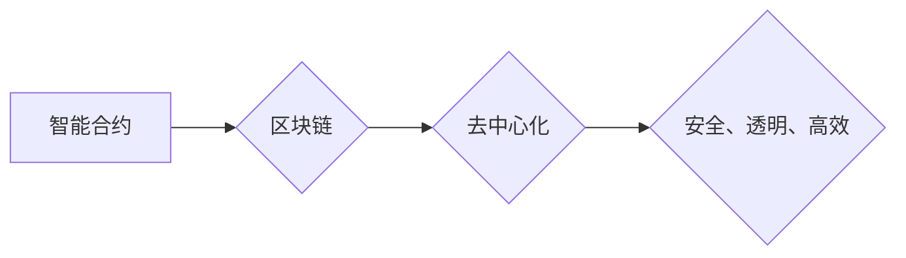

                 

## 利用技术优势进行智能合约开发

> 关键词：智能合约、区块链、去中心化、加密货币、Solidity、Ethereum、安全、可信、效率

## 1. 背景介绍

智能合约作为区块链技术的核心应用之一，正在深刻地改变着传统合约的运作模式。它是一种通过代码实现自动执行的协议，能够在满足预设条件时自动执行交易，无需第三方参与，从而提高了效率、透明度和安全性。

随着区块链技术的不断发展，智能合约的应用场景也日益广泛，涵盖金融、供应链、医疗、游戏等多个领域。然而，智能合约的开发也面临着诸多挑战，例如代码复杂性、安全性问题、可读性差等。

## 2. 核心概念与联系

### 2.1 智能合约

智能合约是一种自执行的、不可篡改的、分布式合约。它由一段预先编写的代码组成，该代码定义了合约的条款和执行逻辑。当合约中的条件被满足时，代码会自动执行，完成相应的交易。

### 2.2 区块链

区块链是一种分布式账本技术，它将交易记录存储在多个节点上，并通过加密算法进行安全保护。区块链的特点是透明、不可篡改、安全可靠，为智能合约提供了坚实的底层基础。

### 2.3  去中心化

去中心化是指没有单一实体控制或管理的系统。智能合约的去中心化特性意味着它不受任何单一机构的控制，交易过程更加公平、透明和安全。

**核心概念与联系流程图**



## 3. 核心算法原理 & 具体操作步骤

### 3.1 算法原理概述

智能合约的执行依赖于一系列算法，包括：

* **状态机算法:** 智能合约的状态会随着时间的推移而变化，状态机算法负责管理这些状态变化，并根据合约的逻辑执行相应的操作。
* **密码学算法:** 智能合约使用密码学算法来确保交易的安全性，例如哈希算法、公钥加密算法等。
* **数据结构算法:** 智能合约使用各种数据结构来存储和管理数据，例如数组、哈希表、链表等。

### 3.2 算法步骤详解

智能合约的执行步骤如下：

1. **部署合约:** 开发者将智能合约代码部署到区块链网络上，创建合约实例。
2. **触发合约:** 当合约中的条件被满足时，会触发合约执行。
3. **执行合约:** 智能合约的代码会自动执行，根据合约的逻辑进行数据处理和交易操作。
4. **记录交易:** 合约执行的结果会记录到区块链上，形成不可篡改的交易记录。

### 3.3 算法优缺点

**优点:**

* **自动化:** 智能合约可以自动执行交易，无需人工干预，提高效率。
* **透明度:** 合约的执行过程是公开透明的，任何人都可以查看交易记录。
* **安全性:** 智能合约使用密码学算法来确保交易的安全性，不易被篡改。

**缺点:**

* **代码复杂性:** 智能合约的代码编写较为复杂，需要专业的编程知识。
* **安全性问题:** 智能合约代码中的漏洞可能导致资金损失或数据泄露。
* **可读性差:** 智能合约代码的阅读和理解难度较高。

### 3.4 算法应用领域

智能合约的应用领域非常广泛，包括：

* **金融:** 支付、贷款、保险、证券交易等。
* **供应链:** 物流跟踪、产品溯源、合同管理等。
* **医疗:** 电子病历、药品管理、医疗保险等。
* **游戏:** 游戏道具、虚拟资产、游戏规则等。

## 4. 数学模型和公式 & 详细讲解 & 举例说明

### 4.1 数学模型构建

智能合约的执行逻辑可以抽象为一个状态机模型，其中每个状态代表合约的执行阶段，每个状态转换由特定的条件触发。

**状态机模型:**

```
状态1 --> 条件1 --> 状态2
状态2 --> 条件2 --> 状态3
...
```

### 4.2 公式推导过程

智能合约的执行过程可以利用数学公式进行描述，例如：

* **交易费用计算公式:**

$$
费用 = 交易量 * 交易费用率
$$

其中，交易量代表交易的金额或数量，交易费用率是预设的交易费用比例。

* **智能合约执行时间计算公式:**

$$
执行时间 = 代码复杂度 * 网络延迟
$$

其中，代码复杂度代表合约代码的执行量，网络延迟代表区块链网络的响应时间。

### 4.3 案例分析与讲解

**案例:** 

假设一个简单的智能合约用于 escrow 交易，其中甲方支付给乙方一定金额，但只有当乙方完成服务后，甲方才能获得资金。

**数学模型:**

* 状态1: 交易发起，甲方支付资金。
* 状态2: 乙方完成服务，发送完成通知。
* 状态3: 甲方确认服务完成，释放资金。

**公式推导:**

* 交易费用 = 交易金额 * 交易费用率
* 执行时间 = 代码复杂度 * 网络延迟

**分析:**

在这个案例中，智能合约的执行过程由状态机模型和数学公式描述。当乙方完成服务并发送完成通知时，智能合约会自动从状态2转移到状态3，释放资金给乙方。

## 5. 项目实践：代码实例和详细解释说明

### 5.1 开发环境搭建

开发智能合约需要使用 Solidity 语言和 Ethereum 开发环境。

* **Solidity:** Solidity 是用于编写智能合约的编程语言。
* **Ethereum 开发环境:**  例如 Truffle 或 Hardhat，用于部署和测试智能合约。

### 5.2 源代码详细实现

以下是一个简单的 Escrow 合约的 Solidity 代码示例：

```solidity
pragma solidity ^0.8.0;

contract Escrow {
    address public owner;
    address public buyer;
    address public seller;
    uint public amount;
    bool public isCompleted;

    constructor(address _buyer, address _seller, uint _amount) {
        owner = msg.sender;
        buyer = _buyer;
        seller = _seller;
        amount = _amount;
        isCompleted = false;
    }

    function releaseFunds() public {
        require(msg.sender == seller, "Only seller can release funds");
        require(!isCompleted, "Funds have already been released");
        isCompleted = true;
        payable(buyer).transfer(amount);
    }
}
```

### 5.3 代码解读与分析

* **pragma solidity ^0.8.0;:** 指定 Solidity 版本。
* **contract Escrow { ... }:** 定义一个名为 Escrow 的智能合约。
* **address public owner; ...:** 定义合约的成员变量，例如合约所有者、买方、卖方、金额等。
* **constructor(address _buyer, address _seller, uint _amount) { ... }:** 合约的构造函数，用于初始化合约成员变量。
* **function releaseFunds() public { ... }:** 定义一个名为 releaseFunds 的函数，用于释放资金给买方。

### 5.4 运行结果展示

部署合约后，可以通过测试工具发送交易，模拟 Escrow 合约的执行过程。例如，可以模拟买方支付资金、卖方完成服务、买方确认服务等操作，观察合约的状态变化和资金转移情况。

## 6. 实际应用场景

### 6.1 金融领域

* **去中心化金融 (DeFi):** 智能合约可以用于构建去中心化的金融应用，例如去中心化交易所、稳定币、借贷平台等。
* **供应链金融:** 智能合约可以用于简化供应链融资流程，提高资金流转效率。

### 6.2 供应链管理

* **产品溯源:** 智能合约可以记录产品的生产、运输、销售等信息，实现产品的可追溯性。
* **合同管理:** 智能合约可以自动执行合同条款，减少合同纠纷。

### 6.3 其他领域

* **医疗保健:** 智能合约可以用于管理电子病历、药品供应链、医疗保险等。
* **游戏:** 智能合约可以用于管理游戏道具、虚拟资产、游戏规则等。

### 6.4 未来应用展望

智能合约的应用场景还在不断扩展，未来将有更多创新应用出现。例如：

* **数字身份:** 智能合约可以用于创建和管理数字身份，提高身份认证的安全性。
* **数据共享:** 智能合约可以用于安全地共享数据，保护数据隐私。
* **自动驾驶:** 智能合约可以用于管理自动驾驶车辆之间的交互，提高交通安全。

## 7. 工具和资源推荐

### 7.1 学习资源推荐

* **Solidity 官方文档:** https://docs.soliditylang.org/
* **Ethereum 官方网站:** https://ethereum.org/
* **CryptoZombies:** https://cryptozombies.io/

### 7.2 开发工具推荐

* **Truffle:** https://trufflesuite.com/
* **Hardhat:** https://hardhat.org/
* **Remix IDE:** https://remix.ethereum.org/

### 7.3 相关论文推荐

* **A Survey of Smart Contract Security Vulnerabilities:** https://arxiv.org/abs/1909.03987
* **The Blockchain Trilemma: Scalability, Security, and Decentralization:** https://arxiv.org/abs/1706.03772

## 8. 总结：未来发展趋势与挑战

### 8.1 研究成果总结

智能合约技术已经取得了显著的进展，为区块链应用提供了强大的工具。

### 8.2 未来发展趋势

* **更强大的安全性:** 研究人员将继续致力于开发更安全的智能合约，减少代码漏洞和攻击风险。
* **更高的效率:** 提高智能合约的执行效率，降低交易成本和延迟。
* **更广泛的应用场景:** 智能合约将应用于更多领域，例如数字身份、数据共享、自动驾驶等。

### 8.3 面临的挑战

* **代码复杂性:** 智能合约的代码编写较为复杂，需要专业的编程知识。
* **可读性差:** 智能合约代码的阅读和理解难度较高。
* **监管问题:** 智能合约的法律法规尚不完善，需要政府和行业共同努力制定相关规范。

### 8.4 研究展望

未来，智能合约技术将继续发展，并与其他新兴技术融合，例如人工智能、物联网等，为我们带来更多创新应用。


## 9. 附录：常见问题与解答

**常见问题:**

* **智能合约可以修改吗？**

智能合约的代码在部署后是不可修改的，但可以通过部署新的合约版本来实现功能更新。

* **智能合约的安全可靠吗？**

智能合约的安全性取决于代码的编写质量和网络环境。

* **如何学习智能合约开发？**

可以通过学习 Solidity 语言、阅读相关文档和教程、参与开源项目等方式学习智能合约开发。


作者：禅与计算机程序设计艺术 / Zen and the Art of Computer Programming 
<end_of_turn>

