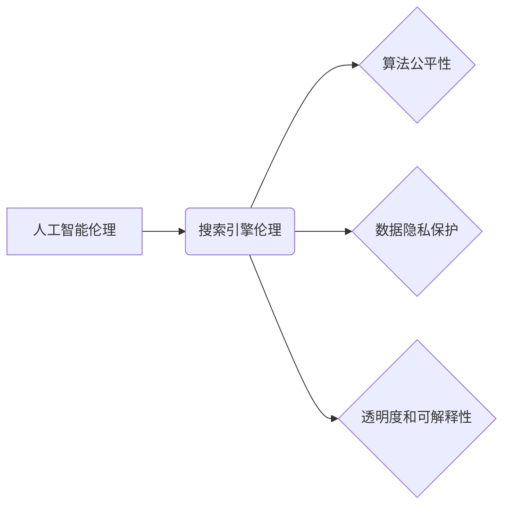

                 

## 制定AI伦理准则：搜索的道德底线

> 关键词：人工智能伦理、搜索引擎、算法偏见、数据隐私、透明度、可解释性、责任

## 1. 背景介绍

人工智能（AI）技术的飞速发展，特别是深度学习算法的突破，使得搜索引擎迎来了前所未有的变革。AI驱动的搜索引擎能够更精准地理解用户意图，提供更个性化、更相关的搜索结果。然而，这种强大的技术也带来了新的伦理挑战，需要我们认真思考和应对。

传统的搜索引擎主要依靠关键词匹配和网页排名算法来确定搜索结果。而AI驱动的搜索引擎则能够分析用户搜索历史、浏览行为、地理位置等多方面信息，并利用自然语言处理、机器学习等技术，更深入地理解用户的需求，提供更精准的搜索结果。

尽管AI驱动的搜索引擎带来了诸多便利，但其也存在一些潜在的风险和问题：

* **算法偏见:** 训练AI模型的数据往往存在偏差，这可能导致搜索结果也存在偏见，从而强化社会现有不平等和歧视。
* **数据隐私:** AI驱动的搜索引擎收集和分析用户的个人数据，这可能会侵犯用户的隐私权。
* **透明度和可解释性:** AI算法的决策过程往往是复杂的，难以理解，这使得用户难以了解搜索结果背后的逻辑，也难以对搜索结果提出质疑。
* **责任问题:** 当AI驱动的搜索引擎产生错误或有害的结果时，谁应该承担责任？

## 2. 核心概念与联系

**2.1 核心概念**

* **人工智能伦理:** 指的是在人工智能技术应用过程中，如何确保其符合人类的道德价值观和社会规范。
* **搜索引擎伦理:** 指的是在搜索引擎技术发展和应用过程中，如何确保其符合伦理原则，避免产生负面影响。
* **算法公平性:** 指的是算法在处理不同群体的数据时，能够做到公平公正，避免产生歧视。
* **数据隐私保护:** 指的是保护用户的个人数据不被非法获取、使用和泄露。
* **透明度和可解释性:** 指的是算法的决策过程能够被用户理解和解释。

**2.2 核心概念联系**



## 3. 核心算法原理 & 具体操作步骤

**3.1 算法原理概述**

AI驱动的搜索引擎的核心算法通常基于深度学习技术，例如Transformer模型。这些模型能够学习用户搜索行为和网页内容之间的复杂关系，从而更精准地理解用户的意图并提供相关的搜索结果。

**3.2 算法步骤详解**

1. **数据收集和预处理:** 收集海量用户搜索数据、网页内容、链接结构等信息，并进行清洗、格式化等预处理操作。
2. **特征提取:** 利用自然语言处理技术提取文本中的关键词、语义信息、情感倾向等特征。
3. **模型训练:** 使用深度学习算法训练模型，学习用户搜索行为和网页内容之间的关系。
4. **搜索结果排序:** 根据用户搜索词和模型预测结果，对搜索结果进行排序，并返回给用户。
5. **结果反馈和优化:** 收集用户点击、停留时间等反馈信息，并根据反馈信息不断优化模型参数和算法策略。

**3.3 算法优缺点**

**优点:**

* **更精准的搜索结果:** 深度学习算法能够学习用户搜索行为和网页内容之间的复杂关系，从而提供更精准、更相关的搜索结果。
* **个性化搜索体验:** AI驱动的搜索引擎能够根据用户的搜索历史、浏览行为等信息，提供个性化的搜索结果。
* **自然语言理解:** AI算法能够理解用户的自然语言查询，并提供更人性化的搜索体验。

**缺点:**

* **算法偏见:** 训练数据中的偏差可能导致搜索结果存在偏见，强化社会现有不平等和歧视。
* **数据隐私问题:** AI驱动的搜索引擎收集和分析用户的个人数据，这可能会侵犯用户的隐私权。
* **透明度和可解释性:** AI算法的决策过程往往是复杂的，难以理解，这使得用户难以了解搜索结果背后的逻辑，也难以对搜索结果提出质疑。

**3.4 算法应用领域**

* **搜索引擎:** 提供更精准、更个性化的搜索结果。
* **推荐系统:** 根据用户的兴趣和行为，推荐相关商品、服务或内容。
* **问答系统:** 利用自然语言处理技术，回答用户的提问。
* **聊天机器人:** 与用户进行自然语言对话，提供信息和服务。

## 4. 数学模型和公式 & 详细讲解 & 举例说明

**4.1 数学模型构建**

AI驱动的搜索引擎通常使用基于概率的数学模型来评估网页的 relevance 和用户查询的 relevance。

一个常用的模型是**BM25** (Best Matching 25)，它考虑了关键词的频率、文档长度和查询长度等因素，计算网页与查询的相似度。

**4.2 公式推导过程**

BM25 的核心公式如下：

$$
score(Q, D) = \sum_{t \in Q} \frac{tf_{t,D} \cdot (k_1 + 1) }{tf_{t,D} + k_1 \cdot (1 - b + b \cdot \frac{length(D)}{average\_length})} \cdot log_2(\frac{N}{df_t})
$$

其中：

* $Q$：用户查询
* $D$：网页文档
* $t$：查询中的关键词
* $tf_{t,D}$：关键词 $t$ 在文档 $D$ 中的词频
* $k_1$、$k_2$、$b$：BM25 模型的参数
* $N$：文档集合的大小
* $df_t$：关键词 $t$ 在文档集合中出现的文档数

**4.3 案例分析与讲解**

假设用户查询 "人工智能伦理"，而网页文档 $D$ 包含了 "人工智能" 和 "伦理" 两个关键词，并且这两个关键词在文档中分别出现了 3 次和 2 次。

根据 BM25 公式，我们可以计算出网页文档 $D$ 与用户查询的相似度。

## 5. 项目实践：代码实例和详细解释说明

**5.1 开发环境搭建**

* Python 3.x
* TensorFlow 或 PyTorch 深度学习框架
* NLTK 自然语言处理库
* Scikit-learn 机器学习库

**5.2 源代码详细实现**

```python
# 使用 TensorFlow 构建一个简单的 Transformer 模型
import tensorflow as tf

# 定义 Transformer 模型的架构
model = tf.keras.Sequential([
    # ... Transformer 模型的层结构 ...
])

# 训练模型
model.compile(optimizer='adam', loss='binary_crossentropy', metrics=['accuracy'])
model.fit(train_data, train_labels, epochs=10)

# 使用模型进行预测
predictions = model.predict(test_data)
```

**5.3 代码解读与分析**

* 代码首先导入必要的库。
* 然后定义了一个简单的 Transformer 模型，并使用 TensorFlow 的 Keras API 进行训练。
* 训练过程中，模型会学习用户搜索行为和网页内容之间的关系。
* 训练完成后，可以使用模型对新的用户查询进行预测，并返回相关的搜索结果。

**5.4 运行结果展示**

运行代码后，模型会输出训练过程中的损失值和准确率，以及对测试数据的预测结果。

## 6. 实际应用场景

AI驱动的搜索引擎已经广泛应用于各种场景，例如：

* **Google 搜索:** Google 使用深度学习算法来提高搜索结果的精准度和相关性。
* **电商平台搜索:** 淘宝、京东等电商平台使用 AI 算法来推荐商品，并根据用户的搜索历史和浏览行为提供个性化的搜索结果。
* **学术搜索:** Google Scholar 使用 AI 算法来搜索学术论文，并根据用户的研究领域和兴趣提供相关的论文推荐。

**6.4 未来应用展望**

未来，AI驱动的搜索引擎将更加智能化、个性化和交互式。

* **更精准的搜索结果:** AI 算法将能够更好地理解用户的意图，并提供更精准、更相关的搜索结果。
* **个性化搜索体验:** AI 算法将能够根据用户的兴趣、偏好和行为，提供个性化的搜索体验。
* **多模态搜索:** AI 算法将能够处理多种数据类型，例如文本、图像、音频等，提供更丰富的搜索体验。
* **对话式搜索:** 用户将能够与搜索引擎进行自然语言对话，并获得更精准、更人性化的搜索结果。

## 7. 工具和资源推荐

**7.1 学习资源推荐**

* **Stanford CS224N: Natural Language Processing with Deep Learning:** https://web.stanford.edu/class/cs224n/
* **Deep Learning Specialization by Andrew Ng:** https://www.deeplearning.ai/
* **The Illustrated Transformer:** https://jalammar.github.io/illustrated-transformer/

**7.2 开发工具推荐**

* **TensorFlow:** https://www.tensorflow.org/
* **PyTorch:** https://pytorch.org/
* **Hugging Face Transformers:** https://huggingface.co/transformers/

**7.3 相关论文推荐**

* **Attention Is All You Need:** https://arxiv.org/abs/1706.03762
* **BERT: Pre-training of Deep Bidirectional Transformers for Language Understanding:** https://arxiv.org/abs/1810.04805

## 8. 总结：未来发展趋势与挑战

**8.1 研究成果总结**

AI驱动的搜索引擎技术取得了显著的进展，能够提供更精准、更个性化的搜索体验。

**8.2 未来发展趋势**

未来，AI驱动的搜索引擎将更加智能化、个性化和交互式，并能够处理多种数据类型，提供更丰富的搜索体验。

**8.3 面临的挑战**

* **算法公平性:** 确保算法在处理不同群体的数据时，能够做到公平公正，避免产生歧视。
* **数据隐私保护:** 确保用户个人数据的安全和隐私。
* **透明度和可解释性:** 使得算法的决策过程更加透明和可解释，以便用户能够理解搜索结果背后的逻辑。
* **责任问题:** 明确AI驱动的搜索引擎的责任主体，并制定相应的法律法规。

**8.4 研究展望**

未来研究需要重点关注以下几个方面：

* 开发更公平、更透明、更可解释的 AI 算法。
* 建立完善的 AI 伦理规范和监管机制。
* 加强 AI 技术与社会伦理的融合，促进 AI 技术的健康发展。

## 9. 附录：常见问题与解答

**常见问题:**

* **AI驱动的搜索引擎会取代传统的搜索引擎吗？**

**解答:** AI驱动的搜索引擎将与传统的搜索引擎共同发展，并相互补充。AI技术可以提升搜索引擎的精准度和个性化程度，而传统的搜索引擎仍然能够提供更全面的信息和资源。

* **AI驱动的搜索引擎会带来哪些新的伦理挑战？**

**解答:** AI驱动的搜索引擎可能会带来新的伦理挑战，例如算法偏见、数据隐私问题、透明度和可解释性问题等。我们需要认真思考这些问题，并制定相应的解决方案。


作者：禅与计算机程序设计艺术 / Zen and the Art of Computer Programming 
<end_of_turn>

