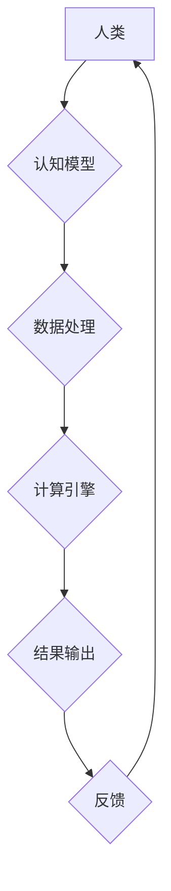

                 

## 回顾与展望：人类计算的发展历程

> 关键词：人类计算、计算模型、认知科学、人工智能、神经网络、机器学习、自然语言处理、未来趋势

### 1. 背景介绍

人类计算，顾名思义，是指人类参与计算过程的一种方式。它超越了传统计算机的局限性，将人类的智慧、创造力和洞察力与计算能力相结合，从而实现更复杂、更智能的计算任务。

从古老的算盘到现代的超级计算机，人类一直在探索更有效率、更强大的计算方式。然而，随着科技的飞速发展，我们逐渐意识到，单靠机器计算无法解决所有问题。许多领域，例如科学发现、艺术创作、决策制定等，都需要人类的参与和判断。

人类计算的概念逐渐兴起，并得到了越来越多的关注。它不仅是计算机科学领域的研究方向，也与认知科学、心理学、社会学等多学科交叉融合，成为一个充满活力和潜力的研究领域。

### 2. 核心概念与联系

**2.1  人类计算的本质**

人类计算的核心在于将人类的认知能力与计算机的计算能力相结合。它不仅仅是人类使用计算机工具进行计算，而是更深层次的交互和协作。

**2.2  人类计算的模式**

人类计算可以采用多种模式，例如：

* **人机协作:** 人类和计算机共同完成任务，发挥各自的优势。例如，在医学诊断中，医生利用计算机辅助诊断系统，结合自身经验进行判断。
* **人类增强:** 计算机辅助人类进行计算，提高效率和准确性。例如，使用语音识别软件，可以更快地记录和处理信息。
* **人类引导:** 人类设定目标和策略，计算机根据指令进行计算。例如，使用机器学习算法，根据人类提供的训练数据，自动识别图像。

**2.3  人类计算的架构**



**2.4  人类计算的挑战**

* **认知模型的构建:** 如何准确地模拟人类的认知过程，仍然是一个难题。
* **数据获取和处理:** 人类计算需要大量的数据进行训练和测试，数据获取和处理是一个重要的挑战。
* **伦理问题:** 人类计算可能会引发一些伦理问题，例如数据隐私、算法偏见等，需要谨慎对待。

### 3. 核心算法原理 & 具体操作步骤

**3.1  算法原理概述**

人类计算的核心算法原理是将人类的认知能力转化为计算机可执行的指令。这通常涉及以下几个步骤：

* **知识表示:** 将人类的知识和经验表示为计算机可理解的形式，例如符号、规则、网络等。
* **推理机制:** 设计算法模拟人类的推理过程，例如逻辑推理、概率推理等。
* **学习机制:** 允许计算机从数据中学习，不断改进其认知能力。

**3.2  算法步骤详解**

1. **数据收集和预处理:** 收集与任务相关的各种数据，并进行清洗、转换等预处理工作。
2. **特征提取:** 从数据中提取关键特征，用于训练和测试算法。
3. **模型训练:** 使用训练数据训练算法模型，例如神经网络、支持向量机等。
4. **模型评估:** 使用测试数据评估算法模型的性能，例如准确率、召回率等。
5. **模型部署:** 将训练好的模型部署到实际应用场景中。

**3.3  算法优缺点**

**优点:**

* 可以解决传统计算机难以处理的复杂问题。
* 可以提高计算效率和准确性。
* 可以模拟人类的创造力和洞察力。

**缺点:**

* 算法设计和实现难度高。
* 需要大量的数据进行训练和测试。
* 存在伦理和安全问题。

**3.4  算法应用领域**

* **医疗诊断:** 利用机器学习算法分析患者数据，辅助医生进行诊断。
* **科学研究:** 利用人类计算模型模拟复杂系统，加速科学发现。
* **艺术创作:** 利用人工智能算法生成艺术作品，拓展艺术创作的边界。
* **金融分析:** 利用机器学习算法分析市场数据，预测金融风险。

### 4. 数学模型和公式 & 详细讲解 & 举例说明

**4.1  数学模型构建**

人类计算的数学模型通常基于概率论、统计学和信息论等学科。例如，神经网络模型可以看作是一个复杂的概率图模型，其中每个节点代表一个神经元，每个边代表一个连接权重。

**4.2  公式推导过程**

神经网络模型的训练过程通常使用梯度下降算法，其核心公式如下：

$$
\theta = \theta - \alpha \frac{\partial L}{\partial \theta}
$$

其中：

* $\theta$ 代表模型参数。
* $\alpha$ 代表学习率。
* $L$ 代表损失函数，用于衡量模型预测结果与真实结果之间的差异。

**4.3  案例分析与讲解**

例如，在图像识别任务中，我们可以使用卷积神经网络模型进行训练。训练过程会不断调整模型参数，使得模型能够将输入图像映射到正确的类别标签。

### 5. 项目实践：代码实例和详细解释说明

**5.1  开发环境搭建**

人类计算项目通常需要使用 Python 语言和相关的库，例如 TensorFlow、PyTorch 等。

**5.2  源代码详细实现**

```python
import tensorflow as tf

# 定义模型结构
model = tf.keras.models.Sequential([
    tf.keras.layers.Conv2D(32, (3, 3), activation='relu', input_shape=(28, 28, 1)),
    tf.keras.layers.MaxPooling2D((2, 2)),
    tf.keras.layers.Conv2D(64, (3, 3), activation='relu'),
    tf.keras.layers.MaxPooling2D((2, 2)),
    tf.keras.layers.Flatten(),
    tf.keras.layers.Dense(10, activation='softmax')
])

# 编译模型
model.compile(optimizer='adam',
              loss='sparse_categorical_crossentropy',
              metrics=['accuracy'])

# 训练模型
model.fit(x_train, y_train, epochs=5)

# 评估模型
loss, accuracy = model.evaluate(x_test, y_test)
print('Test loss:', loss)
print('Test accuracy:', accuracy)
```

**5.3  代码解读与分析**

这段代码定义了一个简单的卷积神经网络模型，用于手写数字识别任务。

* `tf.keras.models.Sequential` 创建了一个顺序模型，将各个层依次连接。
* `tf.keras.layers.Conv2D` 定义了一个卷积层，用于提取图像特征。
* `tf.keras.layers.MaxPooling2D` 定义了一个最大池化层，用于降低特征图尺寸。
* `tf.keras.layers.Flatten` 将多维特征图转换为一维向量。
* `tf.keras.layers.Dense` 定义了一个全连接层，用于分类。
* `model.compile` 编译模型，指定优化器、损失函数和评价指标。
* `model.fit` 训练模型，使用训练数据进行迭代训练。
* `model.evaluate` 评估模型，使用测试数据计算损失和准确率。

**5.4  运行结果展示**

训练完成后，模型可以用于识别新的手写数字图像。

### 6. 实际应用场景

**6.1  医疗诊断辅助**

人类计算可以帮助医生更快、更准确地诊断疾病。例如，利用机器学习算法分析患者的影像数据，辅助医生识别肿瘤、骨折等病变。

**6.2  科学研究加速**

人类计算可以帮助科学家模拟复杂系统，加速科学发现。例如，利用人工智能算法模拟分子结构，预测药物作用机制。

**6.3  个性化教育**

人类计算可以提供个性化的教育体验。例如，利用机器学习算法分析学生的学习情况，定制个性化的学习计划。

**6.4  未来应用展望**

未来，人类计算将应用于更广泛的领域，例如：

* **自动驾驶:** 利用人类计算模型，提高自动驾驶系统的安全性、可靠性和智能性。
* **机器人交互:** 利用人类计算模型，使机器人能够更好地理解和响应人类的指令和情感。
* **虚拟现实:** 利用人类计算模型，创造更逼真的虚拟现实体验。

### 7. 工具和资源推荐

**7.1  学习资源推荐**

* **书籍:**
    * 《深度学习》
    * 《人工智能：现代方法》
    * 《人类计算》
* **在线课程:**
    * Coursera: 人工智能
    * edX: 深度学习
    * Udacity: 机器学习工程师

**7.2  开发工具推荐**

* **Python:** 人工智能开发的常用语言。
* **TensorFlow:** 开源深度学习框架。
* **PyTorch:** 开源深度学习框架。
* **Keras:** 高级深度学习API。

**7.3  相关论文推荐**

* **《ImageNet Classification with Deep Convolutional Neural Networks》**
* **《Attention Is All You Need》**
* **《BERT: Pre-training of Deep Bidirectional Transformers for Language Understanding》**

### 8. 总结：未来发展趋势与挑战

**8.1  研究成果总结**

近年来，人类计算领域取得了显著进展，例如：

* **深度学习算法的突破:** 深度学习算法在图像识别、自然语言处理等领域取得了突破性进展。
* **计算资源的提升:** 计算资源的不断提升，使得训练更复杂的模型成为可能。
* **数据量的增长:** 数据量的增长，为训练和测试人类计算模型提供了充足的数据支持。

**8.2  未来发展趋势**

* **更强大的计算模型:** 研究更强大的计算模型，例如通用人工智能模型。
* **更有效的学习算法:** 研究更有效的学习算法，例如迁移学习、自监督学习等。
* **更广泛的应用场景:** 将人类计算应用于更多领域，例如医疗、教育、金融等。

**8.3  面临的挑战**

* **算法可解释性:** 提高人类计算模型的透明度和可解释性，使其更容易被理解和信任。
* **数据隐私和安全:** 保护数据隐私和安全，防止数据被滥用。
* **伦理问题:** 应对人类计算带来的伦理问题，例如算法偏见、工作岗位替代等。

**8.4  研究展望**

未来，人类计算将继续朝着更智能、更安全、更可解释的方向发展。 

### 9. 附录：常见问题与解答

**9.1  什么是人类计算？**

人类计算是指人类参与计算过程的一种方式，将人类的智慧、创造力和洞察力与计算机的计算能力相结合。

**9.2  人类计算有哪些应用场景？**

人类计算的应用场景非常广泛，例如医疗诊断、科学研究、个性化教育、自动驾驶等。

**9.3  人类计算的未来发展趋势是什么？**

未来，人类计算将朝着更智能、更安全、更可解释的方向发展。


作者：禅与计算机程序设计艺术 / Zen and the Art of Computer Programming 
<end_of_turn>

