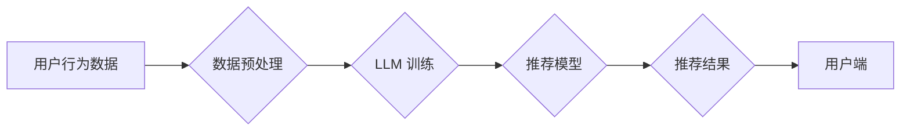

                 

## 基于LLM的推荐系统用户模拟

> 关键词：LLM,推荐系统,用户模拟,自然语言处理,深度学习,个性化推荐,人工智能

## 1. 背景介绍

推荐系统是现代互联网应用中不可或缺的一部分，它通过分析用户行为和偏好，为用户提供个性化的商品、内容或服务建议。传统的推荐系统主要依赖于协同过滤、内容过滤和基于知识的推荐算法，但这些方法在面对冷启动问题、数据稀疏性以及用户行为的多样性时，往往表现力不足。

近年来，大语言模型（LLM）的快速发展为推荐系统带来了新的机遇。LLM 拥有强大的文本理解和生成能力，能够从用户文本数据中挖掘更深层的意图和需求，从而提供更精准、更个性化的推荐。基于LLM的推荐系统能够更好地理解用户需求，生成更自然、更符合用户偏好的推荐内容，并通过与用户进行对话交互，不断学习和优化推荐策略。

## 2. 核心概念与联系

### 2.1  LLM的优势

LLM 作为一种强大的自然语言处理模型，在推荐系统中具有以下优势：

* **语义理解能力强:** LLM 可以理解用户文本输入的深层语义，例如用户对商品的评价、兴趣爱好、需求等，从而更准确地捕捉用户意图。
* **文本生成能力强:** LLM 可以生成自然流畅的推荐文本，例如商品描述、推荐理由、个性化问答等，提升用户体验。
* **个性化推荐:** LLM 可以根据用户的历史行为、文本偏好等信息，生成个性化的推荐内容，满足用户的独特需求。
* **对话交互:** LLM 可以与用户进行对话交互，通过不断学习用户的反馈，不断优化推荐策略，实现更精准的推荐。

### 2.2  推荐系统架构

基于LLM的推荐系统通常包含以下几个核心模块：

* **数据预处理模块:** 对用户行为数据、商品信息等进行清洗、转换和特征提取，为 LLM 提供训练数据。
* **LLM 训练模块:** 使用大量的文本数据训练 LLM 模型，使其具备强大的文本理解和生成能力。
* **推荐模型模块:** 基于 LLM 模型，构建推荐模型，例如基于文本的协同过滤、内容过滤、基于知识的推荐等。
* **推荐接口模块:** 提供 API 接口，将推荐结果返回给用户端。

**Mermaid 流程图**



## 3. 核心算法原理 & 具体操作步骤

### 3.1  算法原理概述

基于LLM的推荐系统通常采用以下几种核心算法：

* **文本嵌入:** 将用户和商品的文本信息转换为向量表示，以便 LLM 模型进行理解和比较。常用的文本嵌入方法包括 Word2Vec、GloVe 和 BERT 等。
* **文本相似度计算:** 计算用户和商品文本之间的相似度，例如余弦相似度、Jaccard 指数等，用于衡量用户对商品的兴趣程度。
* **LLM 驱动的推荐:** 利用 LLM 模型生成个性化的推荐文本，例如根据用户的兴趣爱好推荐商品、根据用户的评论生成商品描述等。

### 3.2  算法步骤详解

1. **数据预处理:** 收集用户行为数据、商品信息等，进行清洗、转换和特征提取。例如，将用户评论文本转换为向量表示，提取商品的类别、属性等信息。
2. **LLM 模型训练:** 使用预处理后的数据训练 LLM 模型，例如使用 BERT 模型进行文本分类、生成推荐理由等任务。
3. **文本嵌入:** 将用户和商品的文本信息转换为向量表示，可以使用预训练好的文本嵌入模型，也可以使用 LLM 模型进行自训练。
4. **相似度计算:** 计算用户和商品文本之间的相似度，例如使用余弦相似度计算用户评论和商品描述之间的相似度。
5. **推荐结果生成:** 根据相似度计算结果，以及 LLM 模型的输出结果，生成个性化的推荐列表。

### 3.3  算法优缺点

**优点:**

* 能够理解用户文本需求，提供更精准的推荐。
* 生成更自然、更符合用户偏好的推荐文本。
* 能够进行对话交互，不断学习和优化推荐策略。

**缺点:**

* 训练 LLM 模型需要大量的计算资源和数据。
* 对于冷启动问题，LLM 模型的推荐效果可能较差。
* 需要考虑模型的解释性和可解释性。

### 3.4  算法应用领域

基于LLM的推荐系统可以应用于以下领域：

* **电商推荐:** 为用户推荐商品、优惠券、促销活动等。
* **内容推荐:** 为用户推荐新闻、视频、音乐、书籍等内容。
* **社交推荐:** 为用户推荐好友、群组、活动等。
* **教育推荐:** 为学生推荐学习资源、课程、辅导等。

## 4. 数学模型和公式 & 详细讲解 & 举例说明

### 4.1  数学模型构建

基于LLM的推荐系统通常使用以下数学模型：

* **文本相似度计算:** 使用余弦相似度计算用户和商品文本之间的相似度。

$$
\text{相似度} = \frac{\mathbf{u} \cdot \mathbf{v}}{\|\mathbf{u}\| \|\mathbf{v}\|}
$$

其中，$\mathbf{u}$ 和 $\mathbf{v}$ 分别表示用户和商品的文本向量表示，$\cdot$ 表示点积，$\|\mathbf{u}\|$ 和 $\|\mathbf{v}\|$ 分别表示向量 $\mathbf{u}$ 和 $\mathbf{v}$ 的模长。

* **LLM 驱动的推荐:** 使用 LLM 模型生成推荐文本，例如使用 Transformer 模型进行文本生成。

### 4.2  公式推导过程

余弦相似度的推导过程如下：

1. 假设用户和商品的文本向量分别为 $\mathbf{u}$ 和 $\mathbf{v}$。
2. 计算用户和商品文本向量的点积 $\mathbf{u} \cdot \mathbf{v}$。
3. 计算用户和商品文本向量的模长 $\|\mathbf{u}\|$ 和 $\|\mathbf{v}\|$。
4. 将点积除以两个向量的模长乘积，得到余弦相似度。

### 4.3  案例分析与讲解

假设用户对商品 A 和商品 B 的评论分别为：

* 用户对商品 A 的评论: “这款商品质量很好，价格也很合理。”
* 用户对商品 B 的评论: “这款商品的功能很强大，性价比很高。”

可以使用预训练好的文本嵌入模型将这两个评论转换为向量表示，然后计算它们的余弦相似度。如果余弦相似度较高，则表明用户对这两个商品的兴趣程度相似，推荐系统可以将商品 B 推荐给用户。

## 5. 项目实践：代码实例和详细解释说明

### 5.1  开发环境搭建

* Python 3.7+
* PyTorch 或 TensorFlow
* Transformers 库

### 5.2  源代码详细实现

```python
from transformers import AutoModelForSequenceClassification, AutoTokenizer

# 加载预训练模型和分词器
model_name = "bert-base-uncased"
tokenizer = AutoTokenizer.from_pretrained(model_name)
model = AutoModelForSequenceClassification.from_pretrained(model_name)

# 用户评论文本
user_review = "这款商品质量很好，价格也很合理。"

# 商品描述文本
product_description = "这款商品功能强大，性价比很高。"

# 将文本转换为向量表示
user_embedding = model.encode(user_review)
product_embedding = model.encode(product_description)

# 计算余弦相似度
similarity = cosine_similarity(user_embedding, product_embedding)

# 打印相似度
print(similarity)
```

### 5.3  代码解读与分析

1. 使用 Transformers 库加载预训练的 BERT 模型和分词器。
2. 将用户评论文本和商品描述文本转换为向量表示。
3. 使用余弦相似度计算用户评论和商品描述之间的相似度。
4. 打印相似度结果。

### 5.4  运行结果展示

运行代码后，会输出用户评论和商品描述之间的余弦相似度值。

## 6. 实际应用场景

基于LLM的推荐系统已经在许多实际应用场景中得到应用，例如：

* **电商平台:** 为用户推荐商品、优惠券、促销活动等。
* **内容平台:** 为用户推荐新闻、视频、音乐、书籍等内容。
* **社交平台:** 为用户推荐好友、群组、活动等。

### 6.4  未来应用展望

未来，基于LLM的推荐系统将朝着以下方向发展：

* **更个性化的推荐:** 利用 LLM 模型更深入地理解用户的需求和偏好，提供更个性化的推荐。
* **更智能的交互:** 通过对话交互，让推荐系统更智能地学习用户的反馈，不断优化推荐策略。
* **跨模态推荐:** 将文本、图像、音频等多种模态信息融合，提供更丰富的推荐体验。

## 7. 工具和资源推荐

### 7.1  学习资源推荐

* **论文:**
    * Devlin, J., Chang, M. W., Lee, K., & Toutanova, K. (2018). Bert: Pre-training of deep bidirectional transformers for language understanding. arXiv preprint arXiv:1810.04805.
    * Vaswani, A., Shazeer, N., Parmar, N., Uszkoreit, J., Jones, L., Gomez, A. N., ... & Polosukhin, I. (2017). Attention is all you need. In Advances in neural information processing systems (pp. 5998-6008).
* **博客:**
    * https://huggingface.co/blog/
    * https://www.tensorflow.org/blog

### 7.2  开发工具推荐

* **Transformers 库:** https://huggingface.co/docs/transformers/index
* **PyTorch:** https://pytorch.org/
* **TensorFlow:** https://www.tensorflow.org/

### 7.3  相关论文推荐

* **基于Transformer的推荐系统:**
    * https://arxiv.org/abs/2001.08317
    * https://arxiv.org/abs/2101.04463
* **基于LLM的对话推荐系统:**
    * https://arxiv.org/abs/2203.07195
    * https://arxiv.org/abs/2206.09383

## 8. 总结：未来发展趋势与挑战

### 8.1  研究成果总结

基于LLM的推荐系统在推荐精度、个性化程度和用户体验方面取得了显著的进步。LLM 模型强大的文本理解和生成能力，为推荐系统带来了新的机遇，使其能够更好地理解用户的需求，提供更精准、更个性化的推荐。

### 8.2  未来发展趋势

未来，基于LLM的推荐系统将朝着以下方向发展：

* **更深层的理解:** 利用更强大的 LLMs，深入理解用户的需求和偏好，提供更精准的推荐。
* **更智能的交互:** 通过对话交互，让推荐系统更智能地学习用户的反馈，不断优化推荐策略。
* **跨模态融合:** 将文本、图像、音频等多种模态信息融合，提供更丰富的推荐体验。
* **可解释性增强:** 研究 LLMs 的推荐机制，提高推荐结果的可解释性，增强用户信任度。

### 8.3  面临的挑战

基于LLM的推荐系统也面临着一些挑战：

* **数据需求:** 训练 LLMs 需要大量的文本数据，数据获取和预处理成本较高。
* **计算资源:** 训练和部署 LLMs 需要大量的计算资源，成本较高。
* **模型解释性:** LLMs 的决策过程较为复杂，难以解释，这可能会影响用户的信任度。
* **公平性与偏见:** LLMs 可能存在公平性与偏见问题，需要进行相应的缓解措施。

### 8.4  研究展望

未来，研究者将继续探索基于LLM的推荐系统的潜力，解决其面临的挑战，并将其应用于更广泛的领域，为用户提供更智能、更个性化的体验。

## 9. 附录：常见问题与解答

**Q1: 基于LLM的推荐系统与传统的推荐系统相比有什么优势？**

**A1:** 基于LLM的推荐系统能够更好地理解用户的文本需求，提供更精准、更个性化的推荐。它可以生成更自然、更符合用户偏好的推荐文本，并通过对话交互，不断学习和优化推荐策略。

**Q2: 如何评估基于LLM的推荐系统的性能？**

**A2:** 可以使用传统的推荐系统评估指标，例如准确率、召回率、NDCG 等，也可以使用更针对 LLMs 的评估指标，例如 perplexity、BLEU 等。

**Q3: 如何解决基于LLM的推荐系统的数据稀疏性和冷启动问题？**

**A3:** 可以使用一些数据增强技术，例如文本生成、知识图谱补全等，来解决数据稀疏性问题。对于冷启动问题，可以利用用户的历史行为数据，或者使用一些迁移学习方法，来快速初始化模型。


作者：禅与计算机程序设计艺术 / Zen and the Art of Computer Programming 
<end_of_turn>

