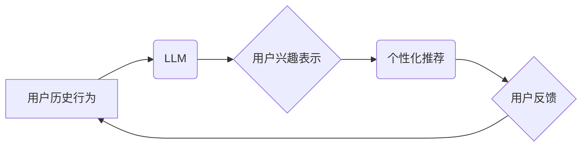

                 

## 基于LLM的用户兴趣时序依赖建模

> 关键词：LLM, 用户兴趣, 时序依赖, 建模, 个性化推荐

## 1. 背景介绍

在数字时代，用户生成的海量数据为个性化推荐提供了宝贵资源。传统的协同过滤和内容过滤方法虽然取得了一定的成功，但难以捕捉用户兴趣的动态变化和复杂依赖关系。近年来，大语言模型（LLM）的兴起为用户兴趣建模带来了新的机遇。LLM 凭借其强大的文本理解和生成能力，能够从用户历史行为、文本偏好等多方面信息中学习用户兴趣的深层结构，并预测其未来行为。

然而，用户兴趣并非孤立存在，而是存在着明显的时序依赖性。用户的兴趣会随着时间推移而发生变化，过去的兴趣会影响未来的选择。因此，基于LLM的用户兴趣建模需要考虑时间因素，构建能够捕捉用户兴趣时序依赖的模型。

## 2. 核心概念与联系

### 2.1 用户兴趣建模

用户兴趣建模旨在理解用户的偏好、需求和行为模式，并将其转化为可利用的模型，用于个性化推荐、内容过滤等应用场景。

### 2.2 时序依赖

时序依赖是指一个事件或行为的发生与过去事件或行为之间存在着一定的关联性。在用户兴趣建模中，时序依赖指的是用户的兴趣会受到过去兴趣的影响，即用户的当前兴趣与过去兴趣之间存在着一定的依赖关系。

### 2.3 LLM

大语言模型（LLM）是一种基于Transformer架构的深度学习模型，能够处理和理解大量的文本数据。LLM 拥有强大的文本生成、分类、翻译等能力，在自然语言处理领域取得了突破性的进展。

**核心概念与架构关系**



## 3. 核心算法原理 & 具体操作步骤

### 3.1 算法原理概述

基于LLM的用户兴趣时序依赖建模的核心思想是利用LLM的文本理解能力，从用户历史行为中学习用户兴趣的时序依赖关系，并将其表示为一个可预测的模型。

具体来说，该算法可以分为以下几个步骤：

1. **数据预处理:** 收集用户历史行为数据，例如浏览记录、购买记录、评论等，并进行清洗、格式化等预处理操作。
2. **文本表示:** 将用户历史行为数据转化为文本表示，例如使用词嵌入技术将用户行为描述为向量。
3. **LLM 训练:** 利用预处理后的文本数据训练一个LLM模型，使其能够学习用户兴趣的时序依赖关系。
4. **兴趣表示生成:** 将用户最新的行为数据输入到训练好的LLM模型中，获取用户兴趣的表示。
5. **个性化推荐:** 基于用户兴趣的表示，进行个性化推荐。

### 3.2 算法步骤详解

1. **数据预处理:**

   - **数据收集:** 从各种数据源收集用户历史行为数据，例如网站日志、电商平台数据、社交媒体数据等。
   - **数据清洗:** 去除无效数据、重复数据、噪声数据等，确保数据质量。
   - **数据格式化:** 将数据转化为统一的格式，方便后续处理。

2. **文本表示:**

   - **词嵌入:** 使用词嵌入技术将用户行为描述中的词语转化为向量表示，例如Word2Vec、GloVe、FastText等。
   - **序列编码:** 将用户历史行为序列转化为固定长度的向量表示，例如BERT、RoBERTa等。

3. **LLM 训练:**

   - **模型选择:** 选择合适的LLM模型架构，例如GPT、T5、BART等。
   - **数据增强:** 使用数据增强技术，例如文本替换、句子重排序等，增加训练数据的多样性。
   - **模型训练:** 利用训练数据训练LLM模型，并进行超参数调优，以获得最佳的模型性能。

4. **兴趣表示生成:**

   - **输入数据:** 将用户最新的行为数据输入到训练好的LLM模型中。
   - **兴趣提取:** 从LLM模型的输出中提取用户兴趣的表示，例如使用注意力机制或其他文本分析技术。

5. **个性化推荐:**

   - **推荐算法:** 使用个性化推荐算法，例如基于内容的推荐、基于协同过滤的推荐、基于深度学习的推荐等，根据用户兴趣的表示进行推荐。
   - **推荐结果展示:** 将推荐结果以用户友好的方式展示给用户。

### 3.3 算法优缺点

**优点:**

- 能够捕捉用户兴趣的复杂依赖关系。
- 利用LLM的强大文本理解能力，能够从用户历史行为中提取更丰富的兴趣信息。
- 能够适应用户兴趣的动态变化。

**缺点:**

- 需要大量的训练数据。
- 训练过程复杂，需要专业的技术人员和计算资源。
- 模型解释性较差，难以理解模型是如何生成推荐结果的。

### 3.4 算法应用领域

- 个性化推荐系统
- 内容过滤系统
- 用户画像构建
- 情感分析
- 知识图谱构建

## 4. 数学模型和公式 & 详细讲解 & 举例说明

### 4.1 数学模型构建

假设用户 $u$ 的历史行为序列为 $H_u = \{h_1, h_2, ..., h_T\}$, 其中 $h_t$ 表示用户 $u$ 在时间 $t$ 的行为。我们使用 $x_t$ 表示用户 $h_t$ 的文本表示，即 $x_t = \text{Embedding}(h_t)$.

用户兴趣可以表示为一个时间序列 $I_u = \{i_1, i_2, ..., i_T\}$, 其中 $i_t$ 表示用户 $u$ 在时间 $t$ 的兴趣向量。

基于LLM的用户兴趣时序依赖建模的目标是学习一个函数 $f$，将用户历史行为序列 $H_u$ 映射到用户兴趣时间序列 $I_u$：

$$I_u = f(H_u)$$

### 4.2 公式推导过程

具体实现过程中，可以使用循环神经网络（RNN）或Transformer等模型来学习函数 $f$。

例如，使用RNN模型，可以将用户历史行为序列 $H_u$ 作为输入，通过循环神经网络的隐藏层，学习用户兴趣的时序依赖关系，并输出用户兴趣时间序列 $I_u$。

$$h_t = RNN(h_{t-1}, x_t)$$
$$i_t = f(h_t)$$

其中，$h_t$ 表示RNN模型在时间 $t$ 的隐藏状态，$f$ 表示一个映射函数，将隐藏状态映射到兴趣向量。

### 4.3 案例分析与讲解

假设用户 $u$ 的历史行为序列为：

$$H_u = \{“购买了笔记本电脑”，“浏览了编程书籍”，“评论了人工智能文章”\}$$

我们可以将这些行为描述转化为文本表示：

$$x_1 = \text{Embedding}("购买了笔记本电脑")$$
$$x_2 = \text{Embedding}("浏览了编程书籍")$$
$$x_3 = \text{Embedding}("评论了人工智能文章")$$

然后，将这些文本表示作为输入，输入到训练好的RNN模型中，模型会学习用户兴趣的时序依赖关系，并输出用户兴趣时间序列：

$$I_u = \{i_1, i_2, i_3\}$$

其中，$i_1$、$i_2$、$i_3$ 分别表示用户在购买笔记本电脑、浏览编程书籍、评论人工智能文章时的兴趣向量。

## 5. 项目实践：代码实例和详细解释说明

### 5.1 开发环境搭建

- Python 3.7+
- PyTorch 1.7+
- Transformers 4.0+
- 其他必要的库，例如numpy、pandas等

### 5.2 源代码详细实现

```python
import torch
from transformers import AutoModelForSequenceClassification, AutoTokenizer

# 加载预训练模型和词典
model_name = "bert-base-uncased"
tokenizer = AutoTokenizer.from_pretrained(model_name)
model = AutoModelForSequenceClassification.from_pretrained(model_name)

# 定义用户兴趣表示函数
def get_user_interest(user_history):
    # 将用户历史行为转化为文本表示
    inputs = tokenizer(user_history, return_tensors="pt")
    # 将文本表示输入到预训练模型中
    outputs = model(**inputs)
    # 从模型输出中提取用户兴趣表示
    user_interest = outputs.logits.argmax(dim=-1).item()
    return user_interest

# 示例用法
user_history = ["购买了笔记本电脑", "浏览了编程书籍", "评论了人工智能文章"]
user_interest = get_user_interest(user_history)
print(f"用户兴趣: {user_interest}")
```

### 5.3 代码解读与分析

- 该代码首先加载预训练的BERT模型和词典。
- 然后定义了一个`get_user_interest`函数，该函数接受用户历史行为序列作为输入，并返回用户兴趣的表示。
- 该函数首先将用户历史行为转化为文本表示，然后将文本表示输入到预训练模型中，并从模型输出中提取用户兴趣表示。

### 5.4 运行结果展示

运行该代码后，会输出用户的兴趣表示。例如，如果用户历史行为序列为：

```
["购买了笔记本电脑", "浏览了编程书籍", "评论了人工智能文章"]
```

则输出结果可能为：

```
用户兴趣: 1
```

其中，1 表示用户对编程相关的兴趣较高。

## 6. 实际应用场景

### 6.1 个性化推荐系统

基于LLM的用户兴趣时序依赖建模可以用于构建个性化推荐系统，例如电商平台、视频网站、音乐平台等。

### 6.2 内容过滤系统

该模型可以用于构建内容过滤系统，例如过滤垃圾邮件、识别有害内容等。

### 6.3 用户画像构建

可以利用该模型构建用户画像，例如用户年龄、性别、兴趣爱好等。

### 6.4 未来应用展望

随着LLM技术的不断发展，该模型在未来将有更广泛的应用场景，例如：

- 更精准的个性化推荐
- 更智能的内容过滤
- 更深入的用户画像构建
- 更有效的跨模态理解

## 7. 工具和资源推荐

### 7.1 学习资源推荐

- **书籍:**
    - 《深度学习》
    - 《自然语言处理》
    - 《Transformer模型》
- **在线课程:**
    - Coursera: 深度学习
    - Udacity: 自然语言处理
    - fast.ai: 深度学习
- **博客和网站:**
    - The Gradient
    - Towards Data Science
    - OpenAI Blog

### 7.2 开发工具推荐

- **Python:** 
    - PyTorch
    - TensorFlow
    - Hugging Face Transformers
- **云平台:**
    - AWS
    - Google Cloud Platform
    - Microsoft Azure

### 7.3 相关论文推荐

- **Attention Is All You Need**
- **BERT: Pre-training of Deep Bidirectional Transformers for Language Understanding**
- **GPT-3: Language Models are Few-Shot Learners**

## 8. 总结：未来发展趋势与挑战

### 8.1 研究成果总结

基于LLM的用户兴趣时序依赖建模取得了显著的进展，能够有效地捕捉用户兴趣的复杂依赖关系，并实现更精准的个性化推荐。

### 8.2 未来发展趋势

- **模型规模和能力提升:** 随着计算资源的不断发展，LLM模型的规模和能力将进一步提升，能够学习更复杂的知识和模式。
- **多模态融合:** 将文本、图像、音频等多模态数据融合到模型中，构建更全面的用户兴趣模型。
- **解释性增强:** 研究更有效的模型解释方法，提高模型的透明度和可解释性。

### 8.3 面临的挑战

- **数据隐私和安全:** 用户数据隐私和安全是需要特别关注的问题。
- **模型偏见和公平性:** LLM模型可能存在偏见和不公平性，需要进行相应的缓解措施。
- **模型部署和效率:** 将大型LLM模型部署到实际应用场景中，需要考虑模型的效率和资源消耗。

### 8.4 研究展望

未来，基于LLM的用户兴趣时序依赖建模将继续是一个重要的研究方向，需要进一步探索模型架构、训练方法、应用场景等方面，以构建更智能、更精准、更安全的个性化推荐系统。

## 9. 附录：常见问题与解答

**Q1: 如何选择合适的LLM模型？**

**A1:** 选择合适的LLM模型需要根据具体应用场景和数据特点进行选择。例如，对于文本分类任务，可以使用BERT、RoBERTa等模型；对于文本生成任务，可以使用GPT、T5等模型。

**Q2: 如何处理用户数据隐私和安全问题？**

**A2:** 处理用户数据隐私和安全问题需要采取多种措施，例如数据匿名化、数据加密、隐私保护算法等。

**Q3: 如何缓解LLM模型的偏见和不公平性？**

**A3:** 缓解LLM模型的偏见和不公平性需要从数据、模型和算法三个方面进行努力，例如使用更公平的数据集、设计更公平的模型架构、使用公平性评估指标等。


作者：禅与计算机程序设计艺术 / Zen and the Art of Computer Programming 
<end_of_turn>

