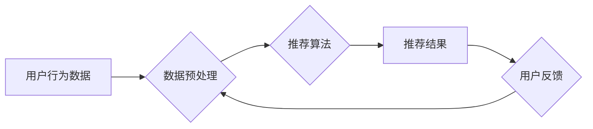

                 

## 大数据驱动的电商搜索推荐系统：AI 模型融合技术是核心竞争力

> 关键词：电商搜索推荐、大数据、AI模型融合、协同过滤、内容过滤、深度学习、推荐算法、个性化推荐

## 1. 背景介绍

在当今数据爆炸的时代，电商平台面临着巨大的用户规模和商品种类，传统的搜索引擎已经难以满足用户对个性化商品推荐的需求。大数据技术的兴起为电商搜索推荐系统提供了强大的数据支撑，而人工智能（AI）技术的不断发展则为推荐算法带来了新的突破。

电商搜索推荐系统旨在根据用户的历史行为、偏好、上下文信息等，精准推荐符合用户需求的商品，从而提升用户体验、提高转化率，最终促进电商平台的商业目标。

## 2. 核心概念与联系

### 2.1  电商搜索推荐系统

电商搜索推荐系统是一个复杂的系统，它通常由以下几个核心模块组成：

* **数据采集模块:** 收集用户行为数据、商品信息、平台运营数据等。
* **数据预处理模块:** 对采集到的数据进行清洗、转换、特征提取等处理，使其能够被推荐算法使用。
* **推荐算法模块:** 基于大数据和AI技术，对用户和商品进行分析，并预测用户对商品的兴趣，从而生成推荐结果。
* **推荐展示模块:** 将推荐结果以用户友好的方式展示给用户，例如搜索结果页、商品详情页、首页推荐等。
* **反馈机制模块:** 收集用户对推荐结果的反馈，例如点击、购买、收藏等，并将其反馈到推荐算法模块，用于模型的不断优化。

### 2.2  AI 模型融合技术

AI模型融合技术是指将多个不同的AI模型组合在一起，以达到比单个模型更好的推荐效果。

常见的AI模型融合技术包括：

* **级联融合:** 将多个模型按顺序串联起来，每个模型的输出作为下一个模型的输入。
* **并行融合:** 将多个模型并行运行，并将多个模型的输出进行融合。
* **投票融合:** 将多个模型的预测结果进行投票，选择预测结果最多的模型作为最终结果。
* **加权融合:** 根据每个模型的性能，对每个模型的预测结果进行加权平均，得到最终结果。

### 2.3  推荐算法

推荐算法是电商搜索推荐系统的核心，它根据用户的历史行为、偏好、上下文信息等，预测用户对商品的兴趣。常见的推荐算法包括：

* **协同过滤:** 基于用户的相似度或商品的相似度进行推荐。
* **内容过滤:** 基于商品的特征和用户的兴趣进行推荐。
* **深度学习:** 使用深度神经网络对用户和商品进行特征提取和学习，进行推荐。

**Mermaid 流程图**



## 3. 核心算法原理 & 具体操作步骤

### 3.1  算法原理概述

协同过滤算法是一种基于用户相似度或商品相似度的推荐算法。它假设，如果用户A喜欢商品X，那么用户B也可能喜欢商品X，前提是用户A和用户B的兴趣相近。

### 3.2  算法步骤详解

1. **数据收集:** 收集用户对商品的评分或购买记录等数据。
2. **用户相似度计算:** 使用余弦相似度、皮尔逊相关系数等方法计算用户之间的相似度。
3. **商品相似度计算:** 使用余弦相似度、皮尔逊相关系数等方法计算商品之间的相似度。
4. **推荐生成:** 对于用户U，找到与U兴趣相似的用户V，并推荐V喜欢的商品，但用户U还没有购买过的商品。

### 3.3  算法优缺点

**优点:**

* 能够推荐用户可能感兴趣但从未接触过的商品。
* 不需要商品的特征信息，只需要用户行为数据即可。

**缺点:**

* 数据稀疏性问题: 当用户对商品的评分或购买记录较少时，难以计算出准确的用户相似度或商品相似度。
* 冷启动问题: 新用户或新商品难以获得推荐。

### 3.4  算法应用领域

协同过滤算法广泛应用于电商推荐、电影推荐、音乐推荐等领域。

## 4. 数学模型和公式 & 详细讲解 & 举例说明

### 4.1  数学模型构建

协同过滤算法的数学模型可以表示为用户-商品评分矩阵，其中每个元素代表用户对商品的评分。

**用户-商品评分矩阵:**

```
| 用户 | 商品1 | 商品2 | 商品3 |
|---|---|---|---|
| 用户1 | 5 | 3 | 4 |
| 用户2 | 4 | 5 | 2 |
| 用户3 | 3 | 4 | 5 |
```

### 4.2  公式推导过程

**余弦相似度:**

$$
\text{相似度}(u,v) = \frac{u \cdot v}{||u|| ||v||}
$$

其中:

* $u$ 和 $v$ 是两个用户的评分向量。
* $u \cdot v$ 是两个向量之间的点积。
* $||u||$ 和 $||v||$ 是两个向量的模长。

### 4.3  案例分析与讲解

假设有两个用户，用户1的评分向量为 [5, 3, 4], 用户2的评分向量为 [4, 5, 2]。

则用户1和用户2的余弦相似度为:

$$
\text{相似度}(u1,u2) = \frac{(5*4)+(3*5)+(4*2)}{\sqrt{5^2+3^2+4^2} \sqrt{4^2+5^2+2^2}} = 0.78
$$

说明用户1和用户2的兴趣相近。

## 5. 项目实践：代码实例和详细解释说明

### 5.1  开发环境搭建

* Python 3.x
* scikit-learn
* pandas
* numpy

### 5.2  源代码详细实现

```python
import pandas as pd
from sklearn.metrics.pairwise import cosine_similarity

# 加载用户-商品评分数据
data = pd.read_csv('ratings.csv')

# 计算用户之间的余弦相似度
user_similarity = cosine_similarity(data.T)

# 找到与用户1兴趣相似的用户
similar_users = user_similarity[0].argsort()[:-6:-1]

# 推荐用户1可能感兴趣的商品
recommended_items = data.iloc[similar_users, :].mean().sort_values(ascending=False)

# 打印推荐结果
print(recommended_items)
```

### 5.3  代码解读与分析

* 首先，加载用户-商品评分数据。
* 然后，使用scikit-learn库中的cosine_similarity函数计算用户之间的余弦相似度。
* 找到与用户1兴趣相似的用户，并根据这些用户的评分，计算出用户1可能感兴趣的商品。
* 最后，打印推荐结果。

### 5.4  运行结果展示

运行代码后，将输出用户1可能感兴趣的商品列表，以及每个商品的评分。

## 6. 实际应用场景

电商搜索推荐系统广泛应用于以下场景:

* **商品搜索结果推荐:** 在用户搜索商品时，推荐与搜索关键词相关的商品。
* **商品详情页推荐:** 在用户浏览商品详情页时，推荐用户可能感兴趣的其他商品。
* **首页推荐:** 在用户进入电商平台首页时，推荐平台精选的商品或用户可能感兴趣的商品。
* **个性化推荐:** 根据用户的历史行为、偏好、上下文信息等，为用户提供个性化的商品推荐。

### 6.4  未来应用展望

随着大数据和AI技术的不断发展，电商搜索推荐系统将更加智能化、个性化、精准化。

* **多模态推荐:** 将文本、图像、视频等多模态数据融合到推荐系统中，提供更丰富的推荐结果。
* **实时推荐:** 基于用户的实时行为，提供更及时、更精准的推荐。
* **跨平台推荐:** 将用户在不同平台的活动数据整合到推荐系统中，提供更全面的用户画像和推荐。

## 7. 工具和资源推荐

### 7.1  学习资源推荐

* **书籍:**
    * 《推荐系统》
    * 《深度学习》
* **在线课程:**
    * Coursera: Recommender Systems
    * Udacity: Deep Learning Nanodegree

### 7.2  开发工具推荐

* **Python:** 
    * scikit-learn
    * pandas
    * numpy
* **Spark:** 
    * Apache Spark MLlib

### 7.3  相关论文推荐

* **Collaborative Filtering for Implicit Feedback Datasets**
* **Deep Learning for Recommender Systems**

## 8. 总结：未来发展趋势与挑战

### 8.1  研究成果总结

大数据驱动的电商搜索推荐系统已经取得了显著的成果，为电商平台带来了巨大的商业价值。AI模型融合技术是电商搜索推荐系统核心竞争力之一，它能够提升推荐效果，提供更个性化的用户体验。

### 8.2  未来发展趋势

未来，电商搜索推荐系统将朝着更加智能化、个性化、精准化的方向发展。多模态数据融合、实时推荐、跨平台推荐等技术将成为未来发展趋势。

### 8.3  面临的挑战

* **数据稀疏性问题:** 随着用户和商品数量的增加，数据稀疏性问题将更加突出。
* **冷启动问题:** 新用户和新商品难以获得推荐。
* **模型解释性问题:** 深度学习模型的复杂性使得模型解释性问题更加突出。

### 8.4  研究展望

未来，需要进一步研究解决数据稀疏性问题、冷启动问题、模型解释性问题等挑战，并探索新的推荐算法和技术，以推动电商搜索推荐系统的进一步发展。

## 9. 附录：常见问题与解答

* **Q1: 协同过滤算法的缺点是什么？**

* **A1:** 协同过滤算法存在数据稀疏性问题和冷启动问题。

* **Q2: 如何解决数据稀疏性问题？**

* **A2:** 可以使用矩阵分解、隐语义模型等方法来解决数据稀疏性问题。

* **Q3: 如何解决冷启动问题？**

* **A3:** 可以使用内容过滤、基于用户的行为特征推荐等方法来解决冷启动问题。


作者：禅与计算机程序设计艺术 / Zen and the Art of Computer Programming 
<end_of_turn>

