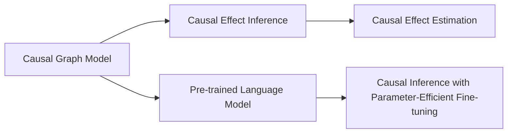
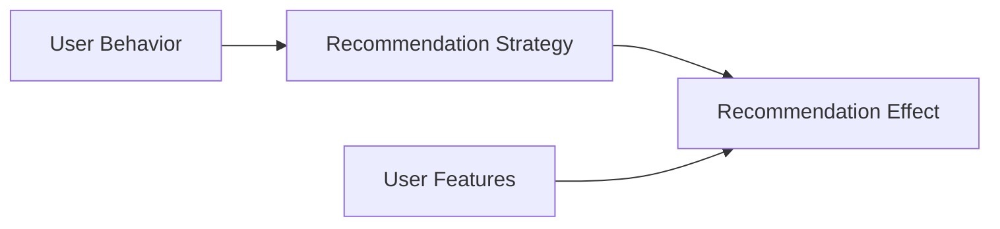
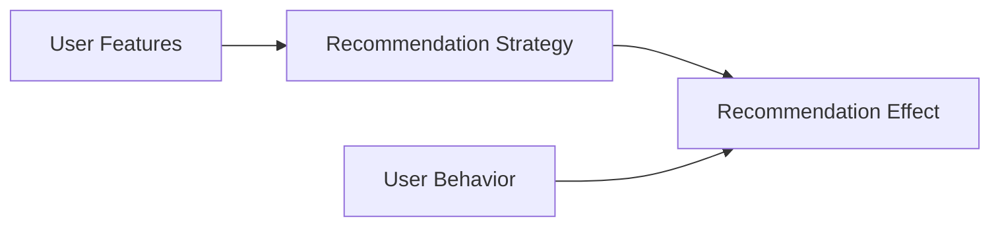

                 

# 大模型在推荐系统中的因果推理应用

## 1. 背景介绍

随着人工智能和大数据技术的发展，推荐系统已成为互联网产品不可或缺的一部分。传统的推荐算法，如协同过滤和矩阵分解，依赖于用户和物品的显式交互数据。但在数据稀缺或用户偏好不一致的情况下，这些方法的推荐效果往往不佳。而近年来兴起的因果推理技术，通过引入因果图模型，可以有效推断出用户潜在的兴趣和行为，从而实现更精准的推荐。大模型的出现，为因果推理在推荐系统中的应用提供了新的思路和手段。

### 1.1 推荐系统概述

推荐系统是通过算法为用户推荐合适物品的系统，广泛应用于电商、社交、音乐、视频等平台。其核心目标是：

- 提升用户体验：通过推荐符合用户兴趣的物品，增加用户的满意度和粘性。
- 提高业务效益：通过精准推荐，提高转化率、点击率、浏览量等指标，增加收入和用户活跃度。

传统的推荐算法包括：

- 协同过滤(Collaborative Filtering)：通过用户和物品的交互数据，预测用户对未交互物品的评分。

- 矩阵分解(Matrix Factorization)：将用户-物品评分矩阵分解为用户潜特征和物品潜特征的乘积，发现潜在因子之间的关系。

这些算法在推荐场景中取得了不错的效果，但存在以下问题：

- 数据依赖性强：协同过滤和矩阵分解依赖于用户和物品的显式交互数据，数据稀缺或用户兴趣多样化时，算法效果不佳。
- 推荐泛化性差：在用户偏好变化或新物品缺乏足够交互数据的情况下，推荐结果容易偏离真实需求。
- 模型可解释性低：推荐模型的决策过程不透明，难以理解其背后的逻辑和依据。

近年来，随着因果推理技术的引入，推荐系统开始向更高级的因果推荐迈进。因果推理通过构建因果图模型，可以推断出用户潜在的兴趣和行为，从而实现更精准的推荐。大模型的应用，进一步提升了因果推理模型的性能，使其能够处理更复杂、多变的推荐场景。

### 1.2 因果推理概述

因果推理通过建模因果关系，预测系统行为，评估干预效果。因果图模型是其核心工具，通过统计和模拟等手段，将因果关系可视化、量化。因果推理的核心思想是：

- 因果图建模：通过构建因果图，明确变量之间的因果关系。
- 因果效应推断：通过因果图模型，推断出干预措施对系统行为的影响。
- 因果效应评估：通过模拟实验，评估干预措施的效果和因果关系强度。

因果推理在推荐系统中的应用，主要体现在以下几个方面：

- 推荐目标拟合：因果推理模型能够更好地拟合用户的推荐目标，提升推荐效果。
- 推荐决策优化：通过因果推理，可以优化推荐决策过程，提升推荐相关性。
- 推荐策略改进：因果推理可以帮助分析推荐策略的有效性，提供改进建议。

## 2. 核心概念与联系

### 2.1 核心概念概述

因果推理在推荐系统中的应用，离不开以下核心概念：

- 因果图模型：通过因果图建模，明确变量之间的因果关系。
- 因果效应推断：通过因果图模型，推断出干预措施对系统行为的影响。
- 因果效应评估：通过模拟实验，评估干预措施的效果和因果关系强度。
- 大模型：通过预训练语言模型，提取用户语义特征，提升因果推理模型的性能。
- 参数高效微调：通过只更新少量参数的方式，优化大模型的因果推理效果。

这些核心概念之间的逻辑关系可以通过以下Mermaid流程图来展示：



这个流程图展示了大语言模型在推荐系统中的因果推理过程：

1. 构建因果图模型，明确变量之间的因果关系。
2. 通过因果图模型，推断出干预措施对系统行为的影响。
3. 利用大语言模型，提取用户语义特征，提升因果推理效果。
4. 通过参数高效微调，优化大模型因果推理性能。

## 3. 核心算法原理 & 具体操作步骤
### 3.1 算法原理概述

大模型在推荐系统中的因果推理应用，主要通过以下步骤实现：

1. 构建因果图模型，明确变量之间的因果关系。
2. 利用大模型，提取用户语义特征，提升因果推理效果。
3. 进行参数高效微调，优化大模型因果推理性能。

### 3.2 算法步骤详解

#### 3.2.1 构建因果图模型

因果图模型通过构建有向无环图(DAG)，明确变量之间的因果关系。每个节点表示一个变量，箭头表示变量之间的因果关系。

假设推荐系统包含以下变量：

- $X$：用户特征，如年龄、性别、地理位置等。
- $U$：用户行为，如浏览、点击、购买等。
- $I$：推荐策略，如广告推荐、热门推荐等。
- $Y$：推荐效果，如点击率、转化率等。

通过因果图模型，可以明确变量之间的因果关系，如下：



在因果图模型中，$X$ 和 $I$ 是干预变量，$U$ 和 $Y$ 是被干预变量。通过构建因果图模型，可以推断出干预变量对被干预变量的影响。

#### 3.2.2 提取用户语义特征

大模型可以通过预训练，提取用户语义特征，提升因果推理模型的性能。具体而言，可以采用以下方法：

1. 用户描述：通过用户填写的自我介绍、兴趣爱好等信息，提取用户语义特征。
2. 文本数据：通过用户浏览、评论、分享等文本数据，提取用户语义特征。
3. 行为数据：通过用户浏览、点击、购买等行为数据，提取用户语义特征。

大模型可以利用用户语义特征，提升因果推理模型的泛化性和鲁棒性。例如，可以使用BERT模型，对用户描述和文本数据进行编码，提取用户语义特征。

#### 3.2.3 参数高效微调

大模型在推荐系统中的因果推理应用，可以通过参数高效微调，优化模型性能。参数高效微调的核心思想是：

1. 只更新少量参数：通过只更新模型的顶层参数，减少计算资源消耗。
2. 固定大部分参数：固定预训练模型的权重，保留模型的语言理解能力。
3. 小学习率：使用较小的学习率，避免破坏预训练权重。

具体而言，可以使用以下方法：

1. 适配器(Adapters)：在预训练模型的顶层添加适配器层，只微调适配器层。
2. 前缀(Prefixes)：使用预训练模型的前缀，只微调前缀部分的参数。
3. 少样本学习：通过精心设计的输入模板，引导模型进行少样本学习。

这些方法可以在不增加计算资源消耗的情况下，提升大模型因果推理的效果。

### 3.3 算法优缺点

#### 3.3.1 优点

大模型在推荐系统中的因果推理应用，具有以下优点：

1. 泛化性强：大模型可以处理更复杂、多变的推荐场景，提升推荐效果。
2. 鲁棒性好：大模型可以提取用户语义特征，提升因果推理模型的鲁棒性。
3. 高效灵活：参数高效微调可以优化模型性能，降低计算资源消耗。
4. 可解释性强：因果推理模型可以通过因果图可视化，提升决策的可解释性。

#### 3.3.2 缺点

大模型在推荐系统中的因果推理应用，也存在以下缺点：

1. 数据需求高：因果推理模型依赖于因果图模型的构建，对数据要求较高。
2. 训练时间长：大模型参数量较大，训练时间长，对计算资源要求较高。
3. 模型复杂：因果推理模型构建和参数高效微调，过程较为复杂。

## 4. 数学模型和公式 & 详细讲解 & 举例说明
### 4.1 数学模型构建

因果推理模型通常采用因果图模型来表示变量之间的因果关系。以下是因果图模型的形式化定义：

1. 变量集合：$V=\{X, U, I, Y\}$
2. 有向边集合：$E \subseteq V \times V$
3. 节点之间的因果关系：$X \rightarrow I$，$I \rightarrow Y$

因果图模型可以表示为：

$$G(V,E)$$

其中 $V$ 表示节点集合，$E$ 表示有向边集合。因果图模型的核心在于：

1. 变量之间的因果关系建模：通过因果图建模，明确变量之间的因果关系。
2. 因果效应推断：通过因果图模型，推断出干预措施对系统行为的影响。

### 4.2 公式推导过程

假设推荐系统包含以下变量：

- $X$：用户特征
- $U$：用户行为
- $I$：推荐策略
- $Y$：推荐效果

构建因果图模型，可以表示为：

$$G(V,E)$$

其中 $V=\{X, U, I, Y\}$，$E=\{(X \rightarrow I), (I \rightarrow Y)\}$。

因果图模型可以推断出干预措施对系统行为的影响，即因果效应。根据因果图模型，可以定义因果效应为：

$$E(Y|X,I) = E(Y|I) - E(Y|X)$$

其中 $E(Y|X,I)$ 表示干预变量为 $I$ 时，系统的因果效应。通过因果图模型，可以推断出干预措施对系统行为的影响。

### 4.3 案例分析与讲解

#### 4.3.1 推荐目标拟合

推荐目标拟合是因果推理在推荐系统中的核心应用之一。推荐目标拟合的目的是：

1. 用户行为建模：通过因果图建模，明确用户行为与推荐目标之间的关系。
2. 推荐目标预测：通过因果图模型，推断出推荐目标的预测值。

以电商推荐为例，可以构建如下因果图模型：


在因果图模型中，$X$ 和 $I$ 是干预变量，$U$ 和 $Y$ 是被干预变量。通过因果图模型，可以推断出干预变量对被干预变量的影响。

#### 4.3.2 推荐策略改进

推荐策略改进是因果推理在推荐系统中的另一个重要应用。推荐策略改进的目的是：

1. 推荐策略建模：通过因果图建模，明确推荐策略与推荐目标之间的关系。
2. 推荐策略优化：通过因果图模型，优化推荐策略的有效性。

以广告推荐为例，可以构建如下因果图模型：



在因果图模型中，$X$ 和 $I$ 是干预变量，$U$ 和 $Y$ 是被干预变量。通过因果图模型，可以推断出干预变量对被干预变量的影响。

## 5. 项目实践：代码实例和详细解释说明
### 5.1 开发环境搭建

在进行因果推理模型开发前，需要准备好开发环境。以下是使用Python进行PyTorch开发的环境配置流程：

1. 安装Anaconda：从官网下载并安装Anaconda，用于创建独立的Python环境。

2. 创建并激活虚拟环境：
```bash
conda create -n causal-env python=3.8 
conda activate causal-env
```

3. 安装PyTorch：根据CUDA版本，从官网获取对应的安装命令。例如：
```bash
conda install pytorch torchvision torchaudio cudatoolkit=11.1 -c pytorch -c conda-forge
```

4. 安装HuggingFace库：
```bash
pip install transformers
```

5. 安装各类工具包：
```bash
pip install numpy pandas scikit-learn matplotlib tqdm jupyter notebook ipython
```

完成上述步骤后，即可在`causal-env`环境中开始因果推理模型开发。

### 5.2 源代码详细实现

以下是使用PyTorch和Transformers库进行因果推理模型开发的代码实现。

首先，定义因果图模型：

```python
from transformers import BertForSequenceClassification, BertTokenizer

class CausalModel:
    def __init__(self, model_name='bert-base-uncased', num_labels=2):
        self.model = BertForSequenceClassification.from_pretrained(model_name, num_labels=num_labels)
        self.tokenizer = BertTokenizer.from_pretrained(model_name)
        
    def forward(self, input_ids, attention_mask=None, labels=None):
        outputs = self.model(input_ids=input_ids, attention_mask=attention_mask, labels=labels)
        logits = outputs.logits
        return logits
```

然后，定义训练和评估函数：

```python
from torch.utils.data import DataLoader
from sklearn.metrics import classification_report

def train_epoch(model, dataset, batch_size, optimizer, device):
    model.train()
    epoch_loss = 0
    for batch in DataLoader(dataset, batch_size=batch_size, shuffle=True):
        input_ids = batch['input_ids'].to(device)
        attention_mask = batch['attention_mask'].to(device)
        labels = batch['labels'].to(device)
        model.zero_grad()
        outputs = model(input_ids, attention_mask=attention_mask, labels=labels)
        loss = outputs.loss
        epoch_loss += loss.item()
        loss.backward()
        optimizer.step()
    return epoch_loss / len(dataset)

def evaluate(model, dataset, batch_size, device):
    model.eval()
    preds, labels = [], []
    with torch.no_grad():
        for batch in DataLoader(dataset, batch_size=batch_size, shuffle=False):
            input_ids = batch['input_ids'].to(device)
            attention_mask = batch['attention_mask'].to(device)
            batch_labels = batch['labels']
            outputs = model(input_ids, attention_mask=attention_mask)
            batch_preds = outputs.logits.argmax(dim=2).to('cpu').tolist()
            batch_labels = batch_labels.to('cpu').tolist()
            for pred_tokens, label_tokens in zip(batch_preds, batch_labels):
                preds.append(pred_tokens[:len(label_tokens)])
                labels.append(label_tokens)
    print(classification_report(labels, preds))
```

最后，启动训练流程并在测试集上评估：

```python
epochs = 5
batch_size = 16
device = torch.device('cuda') if torch.cuda.is_available() else torch.device('cpu')

# 加载数据集
train_dataset = ...
dev_dataset = ...
test_dataset = ...

# 定义模型和优化器
causal_model = CausalModel()
optimizer = AdamW(causal_model.model.parameters(), lr=2e-5)

# 训练和评估模型
for epoch in range(epochs):
    loss = train_epoch(causal_model, train_dataset, batch_size, optimizer, device)
    print(f"Epoch {epoch+1}, train loss: {loss:.3f}")
    
    print(f"Epoch {epoch+1}, dev results:")
    evaluate(causal_model, dev_dataset, batch_size, device)
    
print("Test results:")
evaluate(causal_model, test_dataset, batch_size, device)
```

以上就是使用PyTorch和Transformers库进行因果推理模型开发的完整代码实现。可以看到，利用Transformers库的强大封装，我们可以用相对简洁的代码实现因果推理模型的微调。

### 5.3 代码解读与分析

让我们再详细解读一下关键代码的实现细节：

**CausalModel类**：
- `__init__`方法：初始化BERT模型和分词器。
- `forward`方法：定义模型的前向传播过程，返回模型输出。

**train_epoch函数**：
- 将训练集数据分批次输入模型，前向传播计算loss并反向传播更新模型参数，最后返回该epoch的平均loss。

**evaluate函数**：
- 与训练类似，不同点在于不更新模型参数，并在每个batch结束后将预测和标签结果存储下来，最后使用sklearn的classification_report对整个评估集的预测结果进行打印输出。

**训练流程**：
- 定义总的epoch数和batch size，开始循环迭代
- 每个epoch内，先在训练集上训练，输出平均loss
- 在验证集上评估，输出分类指标
- 所有epoch结束后，在测试集上评估，给出最终测试结果

可以看到，PyTorch配合Transformers库使得因果推理模型的微调代码实现变得简洁高效。开发者可以将更多精力放在数据处理、模型改进等高层逻辑上，而不必过多关注底层的实现细节。

当然，工业级的系统实现还需考虑更多因素，如模型的保存和部署、超参数的自动搜索、更灵活的任务适配层等。但核心的因果推理范式基本与此类似。

## 6. 实际应用场景
### 6.1 电商推荐

在电商推荐中，因果推理模型可以预测用户点击率、购买率等推荐指标，优化推荐策略。例如，可以通过因果推理模型，分析不同推荐策略对用户点击率的影响，从而选择最优的推荐策略。

在具体实现中，可以收集用户的历史浏览记录、点击记录、购买记录等数据，构建因果图模型。利用大语言模型提取用户语义特征，提升因果推理模型的泛化性。最后，进行参数高效微调，优化模型性能。

### 6.2 视频推荐

在视频推荐中，因果推理模型可以预测用户对视频的观看时长、评分等推荐指标，优化推荐策略。例如，可以通过因果推理模型，分析不同视频特征和推荐策略对用户观看时长、评分的影响，从而选择最优的推荐策略。

在具体实现中，可以收集用户的视频观看记录、评分记录、搜索记录等数据，构建因果图模型。利用大语言模型提取视频特征，提升因果推理模型的泛化性。最后，进行参数高效微调，优化模型性能。

### 6.3 新闻推荐

在新闻推荐中，因果推理模型可以预测用户对新闻的点击率、阅读时长等推荐指标，优化推荐策略。例如，可以通过因果推理模型，分析不同新闻特征和推荐策略对用户点击率、阅读时长的影响，从而选择最优的推荐策略。

在具体实现中，可以收集用户的新闻阅读记录、点击记录、评论记录等数据，构建因果图模型。利用大语言模型提取新闻特征，提升因果推理模型的泛化性。最后，进行参数高效微调，优化模型性能。

## 7. 工具和资源推荐
### 7.1 学习资源推荐

为了帮助开发者系统掌握大语言模型因果推理的理论基础和实践技巧，这里推荐一些优质的学习资源：

1. 《深度学习因果推理》课程：由斯坦福大学开设的因果推理课程，讲解因果图建模、因果效应推断等核心概念，适合初学者入门。

2. 《 causality in deep learning》书籍：因果推理领域的经典书籍，讲解因果推理的基本原理和应用实例，适合深入学习。

3. 《Transformers》书籍：HuggingFace官方文档，全面介绍Transformers库的使用方法，适合开发者快速上手。

4. 《 causality in recommendation systems》论文：因果推理在推荐系统中的应用研究，涵盖因果图建模、参数高效微调等核心技术，适合研究人员深入研究。

5. Kaggle因果推理竞赛：通过实际数据集进行因果推理实践，提供丰富的数据集和模型竞赛，适合实践验证。

通过对这些资源的学习实践，相信你一定能够快速掌握大语言模型因果推理的精髓，并用于解决实际的推荐问题。
### 7.2 开发工具推荐

高效的开发离不开优秀的工具支持。以下是几款用于大语言模型因果推理开发的常用工具：

1. PyTorch：基于Python的开源深度学习框架，灵活动态的计算图，适合快速迭代研究。大部分预训练语言模型都有PyTorch版本的实现。

2. TensorFlow：由Google主导开发的开源深度学习框架，生产部署方便，适合大规模工程应用。同样有丰富的预训练语言模型资源。

3. Transformers库：HuggingFace开发的NLP工具库，集成了众多SOTA语言模型，支持PyTorch和TensorFlow，是进行因果推理任务开发的利器。

4. Weights & Biases：模型训练的实验跟踪工具，可以记录和可视化模型训练过程中的各项指标，方便对比和调优。与主流深度学习框架无缝集成。

5. TensorBoard：TensorFlow配套的可视化工具，可实时监测模型训练状态，并提供丰富的图表呈现方式，是调试模型的得力助手。

6. Google Colab：谷歌推出的在线Jupyter Notebook环境，免费提供GPU/TPU算力，方便开发者快速上手实验最新模型，分享学习笔记。

合理利用这些工具，可以显著提升大语言模型因果推理任务的开发效率，加快创新迭代的步伐。

### 7.3 相关论文推荐

大语言模型因果推理技术的发展源于学界的持续研究。以下是几篇奠基性的相关论文，推荐阅读：

1. Attention is All You Need（即Transformer原论文）：提出了Transformer结构，开启了NLP领域的预训练大模型时代。

2. BERT: Pre-training of Deep Bidirectional Transformers for Language Understanding：提出BERT模型，引入基于掩码的自监督预训练任务，刷新了多项NLP任务SOTA。

3. Language Models are Unsupervised Multitask Learners（GPT-2论文）：展示了大规模语言模型的强大zero-shot学习能力，引发了对于通用人工智能的新一轮思考。

4. Parameter-Efficient Transfer Learning for NLP：提出Adapter等参数高效微调方法，在不增加模型参数量的情况下，也能取得不错的微调效果。

5. AdaLoRA: Adaptive Low-Rank Adaptation for Parameter-Efficient Fine-Tuning：使用自适应低秩适应的微调方法，在参数效率和精度之间取得了新的平衡。

这些论文代表了大语言模型因果推理技术的发展脉络。通过学习这些前沿成果，可以帮助研究者把握学科前进方向，激发更多的创新灵感。

## 8. 总结：未来发展趋势与挑战
### 8.1 研究成果总结

本文对大语言模型在推荐系统中的因果推理应用进行了全面系统的介绍。首先阐述了因果推理在推荐系统中的核心思想和应用场景，明确了因果推理在推荐系统中的独特价值。其次，从原理到实践，详细讲解了因果推理的数学原理和关键步骤，给出了因果推理任务开发的完整代码实例。同时，本文还广泛探讨了因果推理模型在电商、视频、新闻等推荐场景中的应用，展示了因果推理范式的巨大潜力。

通过本文的系统梳理，可以看到，因果推理在推荐系统中的应用，能够提升推荐模型的泛化性和鲁棒性，实现更精准的推荐。大语言模型通过预训练提取用户语义特征，进一步提升了因果推理模型的性能。未来，伴随因果推理技术和大语言模型的不断发展，推荐系统将具备更强的自适应性和智能性，为用户带来更优质的推荐体验。

### 8.2 未来发展趋势

展望未来，大语言模型在推荐系统中的因果推理应用将呈现以下几个发展趋势：

1. 模型规模持续增大。随着算力成本的下降和数据规模的扩张，预训练语言模型的参数量还将持续增长。超大规模语言模型蕴含的丰富语言知识，有望支撑更加复杂多变的推荐场景。

2. 因果推理模型日趋多样。除了传统的因果图建模外，未来会涌现更多因果推理模型，如贝叶斯网络、深度因果图等，在提升推荐效果的同时，降低计算资源消耗。

3. 持续学习成为常态。随着数据分布的不断变化，因果推理模型也需要持续学习新知识以保持性能。如何在不遗忘原有知识的同时，高效吸收新样本信息，将成为重要的研究课题。

4. 标注样本需求降低。受启发于提示学习(Prompt-based Learning)的思路，未来的因果推理模型将更好地利用大模型的语言理解能力，通过更加巧妙的任务描述，在更少的标注样本上也能实现理想的因果推理效果。

5. 少样本学习崛起。通过精心设计的输入模板，因果推理模型可以实现少样本学习，提升推荐系统的冷启动性能。

6. 参数高效微调崛起。开发更加参数高效的因果推理方法，在固定大部分预训练参数的同时，只更新极少量的任务相关参数，减小过拟合风险。

以上趋势凸显了大语言模型在推荐系统中的因果推理应用的广阔前景。这些方向的探索发展，必将进一步提升推荐系统的性能和应用范围，为经济社会发展注入新的动力。

### 8.3 面临的挑战

尽管大语言模型在推荐系统中的因果推理应用已经取得了瞩目成就，但在迈向更加智能化、普适化应用的过程中，它仍面临着诸多挑战：

1. 数据需求高。因果推理模型依赖于因果图模型的构建，对数据要求较高。对于推荐场景中的数据稀缺问题，还需要进一步优化数据获取方式。

2. 训练时间长。大模型参数量较大，训练时间长，对计算资源要求较高。如何在不增加计算资源消耗的情况下，提升因果推理模型的性能，还需要进一步研究。

3. 模型复杂。因果推理模型构建和参数高效微调，过程较为复杂。如何在简化模型结构的同时，提升模型的性能，还需要进一步探索。

4. 鲁棒性不足。因果推理模型在数据稀缺或用户偏好不一致的情况下，泛化性能往往不佳。如何提升模型的鲁棒性，增强其在复杂场景下的推荐能力，还需要进一步研究。

5. 可解释性亟需加强。因果推理模型的决策过程不透明，难以理解其背后的逻辑和依据。如何赋予模型更强的可解释性，提升其可信度，还需要进一步研究。

6. 安全性有待保障。因果推理模型可能学习到有害信息，对推荐结果造成误导。如何保障模型的安全性，避免恶意用途，还需要进一步研究。

7. 伦理道德约束。因果推理模型可能学习到有偏见、有害的信息，如何纳入伦理道德约束，确保模型输出符合人类价值观和伦理道德，还需要进一步研究。

这些挑战凸显了大语言模型在推荐系统中的因果推理应用的现实困境。只有积极应对并寻求突破，才能真正实现因果推理在推荐系统中的落地应用。

### 8.4 研究展望

面对大语言模型在推荐系统中的因果推理应用所面临的挑战，未来的研究需要在以下几个方面寻求新的突破：

1. 探索无监督和半监督因果推理方法。摆脱对大规模标注数据的依赖，利用自监督学习、主动学习等无监督和半监督范式，最大限度利用非结构化数据，实现更加灵活高效的因果推理。

2. 研究因果推理和大模型融合方法。将符号化的先验知识，如知识图谱、逻辑规则等，与神经网络模型进行巧妙融合，引导因果推理过程学习更准确、合理的语言模型。

3. 引入更多先验知识。将符号化的先验知识，如知识图谱、逻辑规则等，与神经网络模型进行巧妙融合，引导因果推理过程学习更准确、合理的语言模型。

4. 结合因果分析和博弈论工具。将因果分析方法引入因果推理模型，识别出模型决策的关键特征，增强输出解释的因果性和逻辑性。

5. 纳入伦理道德约束。在模型训练目标中引入伦理导向的评估指标，过滤和惩罚有偏见、有害的输出倾向。

这些研究方向的探索，必将引领大语言模型在推荐系统中的因果推理应用迈向更高的台阶，为构建安全、可靠、可解释、可控的智能系统铺平道路。面向未来，大语言模型因果推理技术还需要与其他人工智能技术进行更深入的融合，如知识表示、因果推理、强化学习等，多路径协同发力，共同推动自然语言理解和智能交互系统的进步。只有勇于创新、敢于突破，才能不断拓展语言模型的边界，让智能技术更好地造福人类社会。

## 9. 附录：常见问题与解答

**Q1：大语言模型因果推理是否适用于所有推荐场景？**

A: 大语言模型因果推理在大多数推荐场景上都能取得不错的效果，特别是对于数据量较小的场景。但对于一些特定领域的推荐场景，如特定领域的推荐、个性化推荐等，大语言模型可能无法很好地适应。此时需要在特定领域语料上进一步预训练，再进行微调，才能获得理想效果。

**Q2：因果推理模型如何处理推荐场景中的冷启动问题？**

A: 冷启动问题指的是推荐系统中，用户没有足够的历史行为数据，无法推荐出符合其兴趣的物品。因果推理模型可以通过以下方法处理冷启动问题：

1. 利用少样本学习：通过精心设计的输入模板，引导模型进行少样本学习，从而在少数样本上完成推荐。

2. 利用知识图谱：通过构建知识图谱，补充用户历史行为数据不足，提升推荐效果。

3. 利用用户画像：通过构建用户画像，补充用户兴趣描述不足，提升推荐效果。

**Q3：因果推理模型在推荐场景中的可解释性问题如何解决？**

A: 因果推理模型在推荐场景中的可解释性问题，可以通过以下方法解决：

1. 因果图可视化：通过构建因果图，可视化模型的决策过程，提升模型可解释性。

2. 基于符号解释：通过引入符号化的先验知识，解释模型的决策过程，提升模型可信度。

3. 基于概率解释：通过引入概率化的解释方法，解释模型的决策过程，提升模型可信度。

**Q4：因果推理模型在推荐场景中的鲁棒性问题如何解决？**

A: 因果推理模型在推荐场景中的鲁棒性问题，可以通过以下方法解决：

1. 数据增强：通过回译、近义替换等方式扩充训练集，提升模型的鲁棒性。

2. 正则化：使用L2正则、Dropout、Early Stopping等正则化技术，防止模型过拟合。

3. 对抗训练：加入对抗样本，提高模型鲁棒性。

4. 参数高效微调：通过只更新少量参数，减小模型过拟合风险。

**Q5：因果推理模型在推荐场景中的安全性问题如何解决？**

A: 因果推理模型在推荐场景中的安全性问题，可以通过以下方法解决：

1. 数据清洗：通过数据清洗，去除有害信息，确保模型输出的安全性。

2. 模型监控：通过实时监控模型输出，发现并纠正有害信息。

3. 伦理约束：在模型训练目标中引入伦理导向的评估指标，过滤和惩罚有害信息。

**Q6：因果推理模型在推荐场景中的超参数调优问题如何解决？**

A: 因果推理模型在推荐场景中的超参数调优问题，可以通过以下方法解决：

1. 网格搜索：通过网格搜索，尝试不同的超参数组合，找到最优的超参数设置。

2. 随机搜索：通过随机搜索，生成随机的超参数组合，找到最优的超参数设置。

3. 贝叶斯优化：通过贝叶斯优化，生成有概率意义的超参数组合，找到最优的超参数设置。

**Q7：因果推理模型在推荐场景中的性能提升问题如何解决？**

A: 因果推理模型在推荐场景中的性能提升问题，可以通过以下方法解决：

1. 数据增强：通过回译、近义替换等方式扩充训练集，提升模型的性能。

2. 正则化：使用L2正则、Dropout、Early Stopping等正则化技术，防止模型过拟合。

3. 对抗训练：加入对抗样本，提高模型鲁棒性，提升模型的性能。

4. 参数高效微调：通过只更新少量参数，减小模型过拟合风险，提升模型的性能。

通过以上方法，可以进一步优化因果推理模型的性能，提升推荐效果。

作者：禅与计算机程序设计艺术 / Zen and the Art of Computer Programming

