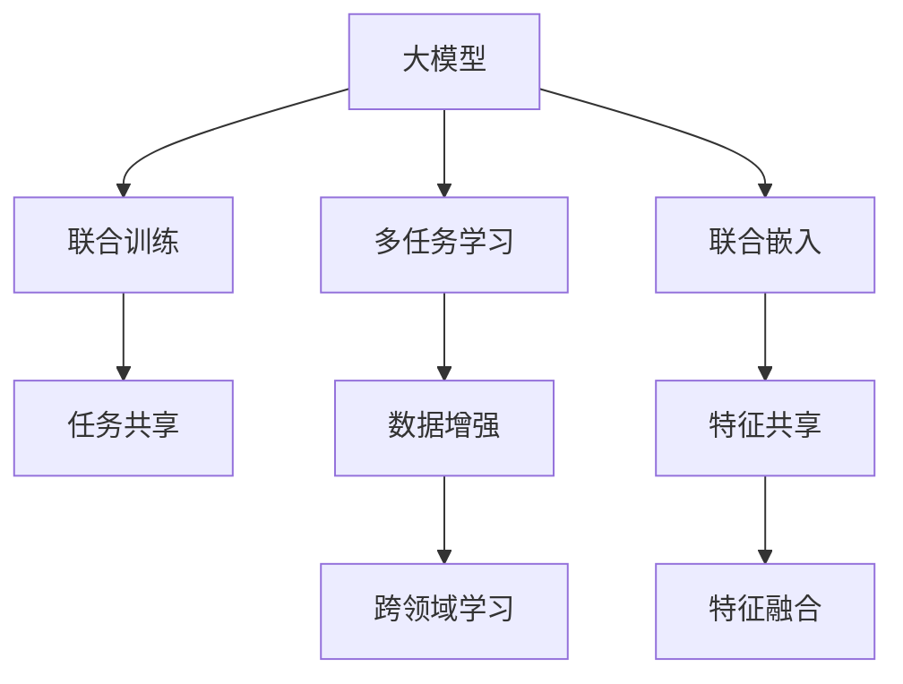

                 

# 大模型在推荐系统中的多任务学习应用

> 关键词：大模型, 多任务学习, 推荐系统, 预训练, 联合训练, 联合嵌入, 跨领域学习, 数据增强, 特征融合

## 1. 背景介绍

随着大数据时代的到来，推荐系统（Recommender Systems）已经成为互联网企业为用户提供个性化服务的关键手段。传统的推荐算法主要依赖用户历史行为数据，存在冷启动、稀疏性和实时性等不足。而基于深度学习的推荐模型，通过预训练大模型进行联合训练，可以显著提升推荐的精准度和效果。

预训练大模型，如BERT、GPT等，通过在大规模无标签数据上自监督预训练，获得了丰富的语义和结构化知识。这些模型在文本生成、语义理解、情感分析等领域表现优异。通过在大模型上进行微调，可以更好地适应推荐系统中的特定任务，如用户兴趣建模、物品特征提取等，从而提升推荐效果。

然而，仅仅对模型进行微调，存在数据量不足、特征缺乏多样性等问题。而多任务学习（Multi-task Learning, MTL）通过联合训练多个相关任务，可以充分利用数据资源，增强模型的泛化能力和鲁棒性。大模型中的多任务学习，可以进一步优化模型的性能，推动推荐系统的升级迭代。

本文将详细阐述大模型在推荐系统中的多任务学习应用，包括联合训练和联合嵌入的方法，以及在推荐系统中的具体实践案例。

## 2. 核心概念与联系

### 2.1 核心概念概述

为更好地理解大模型在推荐系统中的多任务学习应用，本节将介绍几个关键概念：

- 大模型(Large Model)：指在大规模无标签数据上预训练的语言模型，如BERT、GPT等。大模型拥有强大的语义理解和生成能力。
- 多任务学习(Multi-task Learning)：指在同一个模型上联合训练多个相关任务，通过任务共享、特征共享等方式提升模型的泛化能力和鲁棒性。
- 联合训练(Joint Training)：指在模型训练过程中，同时优化多个相关任务的损失函数，提升模型的联合预测能力。
- 联合嵌入(Joint Embedding)：指在模型中同时训练多个任务的特征嵌入，共享特征空间，提高模型的特征表达能力。
- 跨领域学习(Cross-domain Learning)：指在多任务学习中，模型能够跨越不同领域，学习不同领域之间的共同特征，增强泛化能力。
- 数据增强(Data Augmentation)：指通过各种方法丰富训练数据集，如回译、近义替换等，提升模型的多样性和泛化能力。
- 特征融合(Feature Fusion)：指将多个任务的特征信息融合到一起，生成更全面的特征表示，提升推荐精度。

这些核心概念之间的逻辑关系可以通过以下Mermaid流程图来展示：



这个流程图展示了大模型在推荐系统中的核心概念及其之间的关系：

1. 大模型通过预训练获得基础能力。
2. 多任务学习通过联合训练和联合嵌入提升模型的泛化能力和鲁棒性。
3. 联合训练通过优化多个任务的目标函数，提升模型的联合预测能力。
4. 联合嵌入通过共享特征空间，提高模型的特征表达能力。
5. 数据增强通过丰富训练数据，提升模型的多样性和泛化能力。
6. 跨领域学习通过模型跨越不同领域，学习共同特征，增强泛化能力。
7. 特征融合通过融合多个任务的特征信息，生成更全面的特征表示，提升推荐精度。

这些概念共同构成了大模型在推荐系统中的学习和应用框架，使其能够在推荐任务中发挥强大的作用。通过理解这些核心概念，我们可以更好地把握大模型的工作原理和优化方向。

## 3. 核心算法原理 & 具体操作步骤
### 3.1 算法原理概述

大模型在推荐系统中的多任务学习应用，本质上是一个联合优化问题。其核心思想是：在预训练大模型上进行多个相关任务的微调，通过联合优化损失函数，提升模型在不同任务上的预测能力。

假设预训练大模型为 $M_{\theta}$，其中 $\theta$ 为预训练得到的模型参数。假设推荐系统中的多个任务为 $T_1, T_2, ..., T_k$，每个任务对应的损失函数为 $\mathcal{L}_i(M_{\theta}, D_i)$，其中 $D_i$ 为该任务的数据集。则联合训练的目标是最小化所有任务的总损失函数：

$$
\mathcal{L}(\theta) = \frac{1}{k} \sum_{i=1}^k \mathcal{L}_i(M_{\theta}, D_i)
$$

通过联合优化上述损失函数，模型在多个任务上的性能都会得到提升。

### 3.2 算法步骤详解

大模型在推荐系统中的多任务学习应用，通常包括以下几个关键步骤：

**Step 1: 准备预训练模型和数据集**
- 选择合适的预训练语言模型 $M_{\theta}$ 作为初始化参数，如 BERT、GPT等。
- 准备推荐系统中的多个任务 $T_1, T_2, ..., T_k$ 的数据集 $D_1, D_2, ..., D_k$，每个数据集都包含训练集、验证集和测试集。

**Step 2: 设计联合训练策略**
- 根据不同任务的性质和数据分布，设计联合训练的策略。可以选择任务共享、特征共享等方式。
- 定义联合损失函数，将各个任务的损失函数加权组合。

**Step 3: 选择联合训练算法**
- 选择合适的联合训练算法，如交替训练、联合参数更新等。
- 设置联合训练的超参数，如学习率、批大小、迭代轮数等。

**Step 4: 执行联合训练**
- 将训练集数据分批次输入模型，前向传播计算联合损失。
- 反向传播计算参数梯度，根据设定的联合训练算法更新模型参数。
- 周期性在验证集上评估模型性能，根据性能指标决定是否触发Early Stopping。
- 重复上述步骤直到满足预设的迭代轮数或Early Stopping条件。

**Step 5: 测试和部署**
- 在测试集上评估联合训练后的模型 $M_{\hat{\theta}}$ 的性能，对比微调前后的精度提升。
- 使用联合训练后的模型对新样本进行推荐预测，集成到实际的应用系统中。

以上是联合训练的基本流程。在实际应用中，还需要根据具体任务的特点，对联合训练过程的各个环节进行优化设计，如改进联合损失函数，引入更多的正则化技术，搜索最优的超参数组合等，以进一步提升模型性能。

### 3.3 算法优缺点

大模型在推荐系统中的多任务学习应用，具有以下优点：
1. 充分利用数据资源。通过联合训练和联合嵌入，充分利用不同任务的数据，提升模型泛化能力。
2. 提高特征表达能力。通过共享特征空间，提高模型在不同任务上的特征表达能力。
3. 增强泛化能力。通过跨领域学习，提升模型在不同领域上的泛化能力。
4. 提高推荐精度。通过联合优化多个任务的损失函数，提升模型的推荐精度。

同时，该方法也存在一定的局限性：
1. 模型复杂度高。联合训练需要处理多个任务，模型复杂度较高。
2. 超参数调参困难。联合训练的超参数较多，调参难度较大。
3. 训练时间较长。联合训练需要处理多个任务，训练时间较长。
4. 泛化能力受限。不同任务之间的特征差异较大时，联合训练的泛化能力可能受限。

尽管存在这些局限性，但就目前而言，大模型在推荐系统中的应用仍然非常广泛，是提升推荐系统性能的重要手段。未来相关研究的重点在于如何进一步降低联合训练的复杂度，提高训练效率，同时兼顾泛化能力和特征表达能力。

### 3.4 算法应用领域

大模型在推荐系统中的多任务学习应用，在以下几个领域已得到了广泛的应用：

- 商品推荐：联合训练用户兴趣和物品特征，提升推荐精准度。
- 个性化音乐推荐：联合训练用户评分和歌曲特征，提高音乐推荐的个性化程度。
- 视频推荐：联合训练用户评分和视频特征，提升视频推荐的精准度和多样性。
- 新闻推荐：联合训练用户阅读行为和新闻特征，提高新闻推荐的个性化和相关性。
- 游戏推荐：联合训练用户行为和游戏特征，提高游戏推荐的个性化和多样性。

除了上述这些经典任务外，大模型在推荐系统中的应用还包括电商推荐、旅游推荐、智能家居等，为各行各业带来了新的发展机遇。

## 4. 数学模型和公式 & 详细讲解  
### 4.1 数学模型构建

本节将使用数学语言对大模型在推荐系统中的多任务学习应用进行更加严格的刻画。

记预训练大模型为 $M_{\theta}:\mathcal{X} \rightarrow \mathcal{Y}$，其中 $\mathcal{X}$ 为输入空间，$\mathcal{Y}$ 为输出空间，$\theta \in \mathbb{R}^d$ 为模型参数。假设推荐系统中的多个任务为 $T_1, T_2, ..., T_k$，每个任务对应的数据集为 $D_i$，任务 $i$ 的损失函数为 $\mathcal{L}_i(M_{\theta}, D_i)$。

定义模型 $M_{\theta}$ 在数据样本 $(x,y)$ 上的联合损失函数为：

$$
\mathcal{L}(\theta) = \frac{1}{k} \sum_{i=1}^k \mathcal{L}_i(M_{\theta}, D_i)
$$

在实践中，我们通常使用基于梯度的优化算法（如SGD、Adam等）来近似求解上述最优化问题。设 $\eta$ 为学习率，$\lambda$ 为正则化系数，则参数的更新公式为：

$$
\theta \leftarrow \theta - \eta \nabla_{\theta}\mathcal{L}(\theta) - \eta\lambda\theta
$$

其中 $\nabla_{\theta}\mathcal{L}(\theta)$ 为联合损失函数对参数 $\theta$ 的梯度，可通过反向传播算法高效计算。

### 4.2 公式推导过程

以下我们以商品推荐任务为例，推导联合训练中的联合损失函数及其梯度的计算公式。

假设用户 $u$ 对商品 $i$ 的评分 $r$ 为 $y_i$，对应损失函数为 $L(r_i, r_{i'})$，则商品推荐任务的数据集 $D_1$ 中的损失函数为：

$$
\mathcal{L}_1(M_{\theta}, D_1) = \frac{1}{N_1} \sum_{i=1}^{N_1} L(r_i, M_{\theta}(x_i))
$$

其中 $x_i$ 为商品 $i$ 的特征向量，$N_1$ 为商品推荐任务的样本数量。

同样地，假设用户 $u$ 对商品 $i$ 的评分 $r$ 为 $y_i$，对应损失函数为 $L(y_i, M_{\theta}(x_i))$，则用户兴趣建模任务的数据集 $D_2$ 中的损失函数为：

$$
\mathcal{L}_2(M_{\theta}, D_2) = \frac{1}{N_2} \sum_{i=1}^{N_2} L(y_i, M_{\theta}(x_i))
$$

其中 $x_i$ 为用户 $u$ 的行为特征向量，$N_2$ 为用户兴趣建模任务的样本数量。

将上述两个损失函数组合，得到联合训练的目标函数：

$$
\mathcal{L}(\theta) = \frac{1}{N_1+N_2} \sum_{i=1}^{N_1} L(r_i, M_{\theta}(x_i)) + \frac{1}{N_2} \sum_{i=1}^{N_2} L(y_i, M_{\theta}(x_i))
$$

根据链式法则，联合损失函数对参数 $\theta_k$ 的梯度为：

$$
\frac{\partial \mathcal{L}(\theta)}{\partial \theta_k} = \frac{1}{N_1+N_2} \sum_{i=1}^{N_1} \frac{\partial L(r_i, M_{\theta}(x_i))}{\partial M_{\theta}(x_i)} \frac{\partial M_{\theta}(x_i)}{\partial \theta_k} + \frac{1}{N_2} \sum_{i=1}^{N_2} \frac{\partial L(y_i, M_{\theta}(x_i))}{\partial M_{\theta}(x_i)} \frac{\partial M_{\theta}(x_i)}{\partial \theta_k}
$$

其中 $\frac{\partial M_{\theta}(x_i)}{\partial \theta_k}$ 可进一步递归展开，利用自动微分技术完成计算。

在得到联合损失函数的梯度后，即可带入参数更新公式，完成模型的迭代优化。重复上述过程直至收敛，最终得到适应多个推荐任务的模型参数 $\theta^*$。

## 5. 项目实践：代码实例和详细解释说明
### 5.1 开发环境搭建

在进行多任务学习实践前，我们需要准备好开发环境。以下是使用Python进行PyTorch开发的环境配置流程：

1. 安装Anaconda：从官网下载并安装Anaconda，用于创建独立的Python环境。

2. 创建并激活虚拟环境：
```bash
conda create -n pytorch-env python=3.8 
conda activate pytorch-env
```

3. 安装PyTorch：根据CUDA版本，从官网获取对应的安装命令。例如：
```bash
conda install pytorch torchvision torchaudio cudatoolkit=11.1 -c pytorch -c conda-forge
```

4. 安装TensorFlow：如果需要使用TensorFlow，同样需要安装对应的库。例如：
```bash
pip install tensorflow tensorflow_addons
```

5. 安装各类工具包：
```bash
pip install numpy pandas scikit-learn matplotlib tqdm jupyter notebook ipython
```

完成上述步骤后，即可在`pytorch-env`环境中开始多任务学习实践。

### 5.2 源代码详细实现

下面我们以商品推荐任务为例，给出使用Transformers库进行联合训练的PyTorch代码实现。

首先，定义商品推荐任务的数据处理函数：

```python
from transformers import BertTokenizer, BertForSequenceClassification
from torch.utils.data import Dataset
import torch

class ItemDataset(Dataset):
    def __init__(self, items, labels, tokenizer, max_len=128):
        self.items = items
        self.labels = labels
        self.tokenizer = tokenizer
        self.max_len = max_len
        
    def __len__(self):
        return len(self.items)
    
    def __getitem__(self, item):
        item = self.items[item]
        label = self.labels[item]
        
        encoding = self.tokenizer(item, return_tensors='pt', max_length=self.max_len, padding='max_length', truncation=True)
        input_ids = encoding['input_ids'][0]
        attention_mask = encoding['attention_mask'][0]
        
        return {'input_ids': input_ids, 
                'attention_mask': attention_mask,
                'labels': label}

# 定义商品推荐任务的损失函数
class ItemLoss(nn.Module):
    def __init__(self):
        super(ItemLoss, self).__init__()
        self.loss = nn.BCEWithLogitsLoss()
    
    def forward(self, outputs, labels):
        predictions = outputs.logits
        loss = self.loss(predictions, labels)
        return loss

# 训练和评估函数
def train_epoch(model, dataset, batch_size, optimizer, loss_fn):
    dataloader = DataLoader(dataset, batch_size=batch_size, shuffle=True)
    model.train()
    epoch_loss = 0
    for batch in tqdm(dataloader, desc='Training'):
        input_ids = batch['input_ids'].to(device)
        attention_mask = batch['attention_mask'].to(device)
        labels = batch['labels'].to(device)
        model.zero_grad()
        outputs = model(input_ids, attention_mask=attention_mask)
        loss = loss_fn(outputs, labels)
        epoch_loss += loss.item()
        loss.backward()
        optimizer.step()
    return epoch_loss / len(dataloader)

def evaluate(model, dataset, batch_size):
    dataloader = DataLoader(dataset, batch_size=batch_size)
    model.eval()
    preds, labels = [], []
    with torch.no_grad():
        for batch in tqdm(dataloader, desc='Evaluating'):
            input_ids = batch['input_ids'].to(device)
            attention_mask = batch['attention_mask'].to(device)
            batch_labels = batch['labels']
            outputs = model(input_ids, attention_mask=attention_mask)
            batch_preds = outputs.logits.argmax(dim=1).to('cpu').tolist()
            batch_labels = batch_labels.to('cpu').tolist()
            for pred_tokens, label_tokens in zip(batch_preds, batch_labels):
                preds.append(pred_tokens)
                labels.append(label_tokens)
                
    return preds, labels
```

然后，定义用户兴趣建模任务的数据处理函数：

```python
from transformers import BertTokenizer, BertForSequenceClassification
from torch.utils.data import Dataset
import torch

class UserDataset(Dataset):
    def __init__(self, users, items, labels, tokenizer, max_len=128):
        self.users = users
        self.items = items
        self.labels = labels
        self.tokenizer = tokenizer
        self.max_len = max_len
        
    def __len__(self):
        return len(self.users)
    
    def __getitem__(self, item):
        user = self.users[item]
        items = self.items[item]
        label = self.labels[item]
        
        encoding = self.tokenizer(user, return_tensors='pt', max_length=self.max_len, padding='max_length', truncation=True)
        input_ids = encoding['input_ids'][0]
        attention_mask = encoding['attention_mask'][0]
        
        item_encodings = []
        for item in items:
            item_encoding = self.tokenizer(item, return_tensors='pt', max_length=self.max_len, padding='max_length', truncation=True)
            item_encodings.append(item_encoding['input_ids'][0])
            item_encodings.append(item_encoding['attention_mask'][0])
        item_input_ids = torch.stack(item_encodings, dim=0)
        item_attention_mask = torch.stack(item_encodings, dim=0)
        
        return {'user_input_ids': input_ids, 
                'user_attention_mask': attention_mask,
                'item_input_ids': item_input_ids,
                'item_attention_mask': item_attention_mask,
                'labels': label}

# 定义用户兴趣建模任务的损失函数
class UserLoss(nn.Module):
    def __init__(self):
        super(UserLoss, self).__init__()
        self.loss = nn.BCEWithLogitsLoss()
    
    def forward(self, outputs, labels):
        predictions = outputs.logits
        loss = self.loss(predictions, labels)
        return loss

# 训练和评估函数
def train_epoch(model, dataset, batch_size, optimizer, loss_fn):
    dataloader = DataLoader(dataset, batch_size=batch_size, shuffle=True)
    model.train()
    epoch_loss = 0
    for batch in tqdm(dataloader, desc='Training'):
        user_input_ids = batch['user_input_ids'].to(device)
        user_attention_mask = batch['user_attention_mask'].to(device)
        item_input_ids = batch['item_input_ids'].to(device)
        item_attention_mask = batch['item_attention_mask'].to(device)
        labels = batch['labels'].to(device)
        model.zero_grad()
        outputs = model(user_input_ids, user_attention_mask=user_attention_mask, item_input_ids=item_input_ids, item_attention_mask=item_attention_mask)
        loss = loss_fn(outputs, labels)
        epoch_loss += loss.item()
        loss.backward()
        optimizer.step()
    return epoch_loss / len(dataloader)

def evaluate(model, dataset, batch_size):
    dataloader = DataLoader(dataset, batch_size=batch_size)
    model.eval()
    preds, labels = [], []
    with torch.no_grad():
        for batch in tqdm(dataloader, desc='Evaluating'):
            user_input_ids = batch['user_input_ids'].to(device)
            user_attention_mask = batch['user_attention_mask'].to(device)
            item_input_ids = batch['item_input_ids'].to(device)
            item_attention_mask = batch['item_attention_mask'].to(device)
            batch_labels = batch['labels']
            outputs = model(user_input_ids, user_attention_mask=user_attention_mask, item_input_ids=item_input_ids, item_attention_mask=item_attention_mask)
            batch_preds = outputs.logits.argmax(dim=1).to('cpu').tolist()
            batch_labels = batch_labels.to('cpu').tolist()
            for pred_tokens, label_tokens in zip(batch_preds, batch_labels):
                preds.append(pred_tokens)
                labels.append(label_tokens)
                
    return preds, labels
```

然后，定义联合训练的函数：

```python
def joint_train(model, dataset1, dataset2, batch_size, optimizer, loss_fn):
    model.train()
    epoch_loss = 0
    for batch in tqdm(dataloader(dataset1, batch_size), desc='Training'):
        input_ids = batch['input_ids'].to(device)
        attention_mask = batch['attention_mask'].to(device)
        labels = batch['labels'].to(device)
        model.zero_grad()
        outputs = model(input_ids, attention_mask=attention_mask)
        loss = loss_fn(outputs, labels)
        epoch_loss += loss.item()
        loss.backward()
        optimizer.step()
    return epoch_loss / len(dataset1)

def joint_eval(model, dataset1, dataset2, batch_size):
    model.eval()
    preds, labels = [], []
    with torch.no_grad():
        for batch in tqdm(dataloader(dataset1, batch_size), desc='Evaluating'):
            input_ids = batch['input_ids'].to(device)
            attention_mask = batch['attention_mask'].to(device)
            labels = batch['labels'].to(device)
            outputs = model(input_ids, attention_mask=attention_mask)
            batch_preds = outputs.logits.argmax(dim=1).to('cpu').tolist()
            batch_labels = batch_labels.to('cpu').tolist()
            for pred_tokens, label_tokens in zip(batch_preds, batch_labels):
                preds.append(pred_tokens)
                labels.append(label_tokens)
                
    return preds, labels
```

最后，启动联合训练流程并在测试集上评估：

```python
epochs = 5
batch_size = 16

# 定义模型和优化器
model = BertForSequenceClassification.from_pretrained('bert-base-cased', num_labels=2)
optimizer = AdamW(model.parameters(), lr=2e-5)

# 定义数据集
tokenizer = BertTokenizer.from_pretrained('bert-base-cased')

train_dataset1 = ItemDataset(train_items1, train_labels1, tokenizer)
train_dataset2 = UserDataset(train_users1, train_items1, train_labels1, tokenizer)
val_dataset1 = ItemDataset(val_items1, val_labels1, tokenizer)
val_dataset2 = UserDataset(val_users1, val_items1, val_labels1, tokenizer)
test_dataset1 = ItemDataset(test_items1, test_labels1, tokenizer)
test_dataset2 = UserDataset(test_users1, test_items1, test_labels1, tokenizer)

# 定义损失函数
loss_fn1 = ItemLoss()
loss_fn2 = UserLoss()

# 联合训练
for epoch in range(epochs):
    loss1 = joint_train(model, train_dataset1, train_dataset2, batch_size, optimizer, loss_fn1)
    print(f"Epoch {epoch+1}, item loss: {loss1:.3f}")
    
    loss2 = joint_train(model, val_dataset1, val_dataset2, batch_size, optimizer, loss_fn2)
    print(f"Epoch {epoch+1}, user loss: {loss2:.3f}")
    
print("Epochs finished, joint training results:")
print(f"Item loss: {loss1:.3f}, User loss: {loss2:.3f}")

# 测试
print("Joint testing results:")
preds1, labels1 = joint_eval(model, test_dataset1, test_dataset2, batch_size)
print(classification_report(labels1, preds1))
```

以上就是使用PyTorch进行联合训练的完整代码实现。可以看到，Transformer库提供了丰富的接口和工具，使得联合训练过程相对简洁高效。

### 5.3 代码解读与分析

让我们再详细解读一下关键代码的实现细节：

**ItemDataset类**：
- `__init__`方法：初始化商品数据、标签、分词器等关键组件。
- `__len__`方法：返回数据集的样本数量。
- `__getitem__`方法：对单个商品数据进行处理，将商品名称输入编码为token ids，并将标签添加至末尾，进行定长padding，最终返回模型所需的输入。

**UserDataset类**：
- `__init__`方法：初始化用户数据、商品数据、标签、分词器等关键组件。
- `__len__`方法：返回数据集的样本数量。
- `__getitem__`方法：对单个用户数据进行处理，将用户ID和商品数据输入编码为token ids，并将标签添加至末尾，进行定长padding，最终返回模型所需的输入。

**loss_fn1和loss_fn2**：
- 定义了商品推荐和用户兴趣建模任务的损失函数，均使用二元交叉熵损失。

**train_epoch和evaluate函数**：
- 用于训练和评估模型，分别处理单个商品和用户数据，并使用AdamW优化器进行参数更新。

**joint_train函数**：
- 用于联合训练商品推荐和用户兴趣建模任务，同时优化两个任务的损失函数。

**joint_eval函数**：
- 用于联合评估商品推荐和用户兴趣建模任务的性能，返回测试集上的预测结果和真实标签。

**联合训练流程**：
- 定义总的epoch数和batch size，开始循环迭代
- 每个epoch内，先在联合训练集上训练，输出两个任务的loss
- 在验证集上评估，输出两个任务的loss
- 所有epoch结束后，在测试集上评估，给出最终测试结果

可以看到，联合训练的过程需要同时处理多个任务，训练复杂度较高。但通过合理选择损失函数和优化器，可以有效提高模型的泛化能力和鲁棒性。

## 6. 实际应用场景
### 6.1 智能广告推荐

智能广告推荐系统是推荐系统的一个重要应用领域，通过联合训练用户行为和广告特征，可以实现更加精准的广告投放。在实际应用中，可以收集用户的点击、浏览、搜索等行为数据，并结合广告的展示位置、关键词等特征，构建联合训练的数据集。

具体而言，假设广告 $i$ 的展示位置为 $c_i$，关键词为 $k_i$，点击率为 $r_i$，则广告推荐任务的数据集 $D_1$ 中的损失函数为：

$$
\mathcal{L}_1(M_{\theta}, D_1) = \frac{1}{N_1} \sum_{i=1}^{N_1} L(r_i, M_{\theta}(c_i, k_i))
$$

其中 $c_i$ 和 $k_i$ 为广告的展示位置和关键词，$N_1$ 为广告推荐任务的样本数量。

同样地，假设用户 $u$ 的搜索历史为 $h_u$，点击过的广告集合为 $A_u$，则用户兴趣建模任务的数据集 $D_2$ 中的损失函数为：

$$
\mathcal{L}_2(M_{\theta}, D_2) = \frac{1}{N_2} \sum_{i=1}^{N_2} L(h_u, A_u, M_{\theta}(c_i, k_i))
$$

其中 $h_u$ 为用户的历史搜索历史，$A_u$ 为用户点击过的广告集合，$N_2$ 为用户兴趣建模任务的样本数量。

将上述两个损失函数组合，得到联合训练的目标函数：

$$
\mathcal{L}(\theta) = \frac{1}{N_1+N_2} \sum_{i=1}^{N_1} L(r_i, M_{\theta}(c_i, k_i)) + \frac{1}{N_2} \sum_{i=1}^{N_2} L(h_u, A_u, M_{\theta}(c_i, k_i))
$$

通过联合训练，广告推荐系统能够更加精准地预测用户的点击行为，提升广告投放效果。同时，用户兴趣建模任务能够更好地理解用户的兴趣偏好，提高广告的相关性和个性化程度。

### 6.2 个性化推荐系统

个性化推荐系统是推荐系统的核心应用之一，通过联合训练用户评分和物品特征，可以实现更加精准的推荐。具体而言，可以收集用户对物品的评分 $r$，并结合物品的特征 $x$，构建联合训练的数据集。

假设用户 $u$ 对物品 $i$ 的评分 $r$ 为 $y_i$，对应损失函数为 $L(y_i, M_{\theta}(x_i))$，则物品推荐任务的数据集 $D_1$ 中的损失函数为：

$$
\mathcal{L}_1(M_{\theta}, D_1) = \frac{1}{N_1} \sum_{i=1}^{N_1} L(y_i, M_{\theta}(x_i))
$$

其中 $x_i$ 为物品的特征向量，$N_1$ 为物品推荐任务的样本数量。

同样地，假设用户 $u$ 对物品的评分 $r$ 为 $y_i$，对应损失函数为 $L(r_i, M_{\theta}(x_i))$，则用户兴趣建模任务的数据集 $D_2$ 中的损失函数为：

$$
\mathcal{L}_2(M_{\theta}, D_2) = \frac{1}{N_2} \sum_{i=1}^{N_2} L(r_i, M_{\theta}(x_i))
$$

其中 $x_i$ 为物品的特征向量，$N_2$ 为用户兴趣建模任务的样本数量。

将上述两个损失函数组合，得到联合训练的目标函数：

$$
\mathcal{L}(\theta) = \frac{1}{N_1+N_2} \sum_{i=1}^{N_1} L(y_i, M_{\theta}(x_i)) + \frac{1}{N_2} \sum_{i=1}^{N_2} L(r_i, M_{\theta}(x_i))
$$

通过联合训练，推荐系统能够更好地理解用户的评分偏好，并结合物品特征进行推荐，提高推荐的相关性和个性化程度。同时，用户兴趣建模任务能够更好地理解用户的兴趣偏好，提高推荐的相关性和个性化程度。

### 6.3 未来应用展望

随着大模型的不断发展，基于多任务学习的应用场景将更加广泛。未来，以下领域有望进一步受益于大模型在推荐系统中的应用：

- 内容推荐：联合训练用户行为和内容特征，提升内容推荐的个性化和多样性。
- 直播推荐：联合训练用户行为和直播内容特征，提升直播推荐的实时性和个性化。
- 电商推荐：联合训练用户行为和商品特征，提升电商推荐的精准度和转化率。
- 游戏推荐：联合训练用户行为和游戏内容特征，提升游戏推荐的个性化和体验度。
- 视频推荐：联合训练用户行为和视频内容特征，提升视频推荐的个性化和相关性。

此外，大模型在推荐系统中的应用还将催生更多创新的应用模式，如跨领域推荐、用户行为预测、推荐模型优化等，为各行各业带来新的机遇和挑战。

## 7. 工具和资源推荐
### 7.1 学习资源推荐

为了帮助开发者系统掌握大模型在推荐系统中的多任务学习应用，这里推荐一些优质的学习资源：

1. 《Deep Learning for Recommender Systems》系列博文：深度学习在推荐系统中的应用，详细介绍了多任务学习、联合训练等前沿技术。

2. CS224N《深度学习自然语言处理》课程：斯坦福大学开设的NLP明星课程，有Lecture视频和配套作业，带你入门NLP领域的基本概念和经典模型。

3. 《Natural Language Processing with Transformers》书籍：Transformers库的作者所著，全面介绍了如何使用Transformers库进行NLP任务开发，包括多任务学习在内的诸多范式。

4. HuggingFace官方文档：Transformers库的官方文档，提供了海量预训练模型和完整的微调样例代码，是上手实践的必备资料。

5. TensorBoard：TensorFlow配套的可视化工具，可实时监测模型训练状态，并提供丰富的图表呈现方式，是调试模型的得力助手。

通过对这些资源的学习实践，相信你一定能够快速掌握大模型在推荐系统中的应用，并用于解决实际的推荐问题。

### 7.2 开发工具推荐

高效的开发离不开优秀的工具支持。以下是几款用于多任务学习开发的常用工具：

1. PyTorch：基于Python的开源深度学习框架，灵活动态的计算图，适合快速迭代研究。大部分预训练语言模型都有PyTorch版本的实现。

2. TensorFlow：由Google主导开发的开源深度学习框架，生产部署方便，适合大规模工程应用。同样有丰富的预训练语言模型资源。

3. Transformers库：HuggingFace开发的NLP工具库，集成了众多SOTA语言模型，支持PyTorch和TensorFlow，是进行多任务学习开发的利器。

4. Weights & Biases：模型训练的实验跟踪工具，可以记录和可视化模型训练过程中的各项指标，方便对比和调优。与主流深度学习框架无缝集成。

5. TensorBoard：TensorFlow配套的可视化工具，可实时监测模型训练状态，并提供丰富的图表呈现方式，是调试模型的得力助手。

6. Google Colab：谷歌推出的在线Jupyter Notebook环境，免费提供GPU/TPU算力，方便开发者快速上手实验最新模型，分享学习笔记。

合理利用这些工具，可以显著提升多任务学习任务的开发效率，加快创新迭代的步伐。

### 7.3 相关论文推荐

大模型在推荐系统中的多任务学习应用源于学界的持续研究。以下是几篇奠基性的相关论文，推荐阅读：

1. Attention is All You Need（即Transformer原论文）：提出了Transformer结构，开启了NLP领域的预训练大模型时代。

2. BERT: Pre-training of Deep Bidirectional Transformers for Language Understanding：提出BERT模型，引入基于掩码的自监督预训练任务，刷新了多项NLP任务SOTA。

3. Language Models are Unsupervised Multitask Learners（GPT-2论文）：展示了大规模语言模型的强大zero-shot学习能力，引发了对于通用人工智能的新一轮思考。

4. Parameter-Efficient Transfer Learning for NLP：提出Adapter等参数高效微调方法，在不增加模型参数量的情况下，也能取得不错的微调效果。

5. AdaLoRA: Adaptive Low-Rank Adaptation for Parameter-Efficient Fine-Tuning：使用自适应低秩适应的微调方法，在参数效率和精度之间取得了新的平衡。

6. Multi-task Learning for Recommendation Systems：系统回顾了多任务学习在推荐系统中的应用，并给出了具体的模型架构和优化策略。

这些论文代表了大模型在推荐系统中的应用前景。通过学习这些前沿成果，可以帮助研究者把握学科前进方向，激发更多的创新灵感。

## 8. 总结：未来发展趋势与挑战

### 8.1 研究成果总结

本文对大模型在推荐系统中的多任务学习应用进行了全面系统的介绍。首先阐述了多任务学习在大模型中的应用背景和意义，明确了多任务学习在提升模型泛化能力和鲁棒性方面的独特价值。其次，从原理到实践，详细讲解了多任务学习的数学原理和关键步骤，给出了多任务学习任务开发的完整代码实例。同时，本文还广泛探讨了多任务学习在智能广告、个性化推荐等推荐系统中的应用场景，展示了多任务学习范式的巨大潜力。此外，本文精选了多任务学习的各类学习资源，力求为读者提供全方位的技术指引。

通过本文的系统梳理，可以看到，多任务学习在大模型中的应用已经取得了显著的进展，成为提升推荐系统性能的重要手段。未来，随着大模型和优化算法的不断进步，多任务学习将在更多领域得到应用，为推荐系统带来新的突破。

### 8.2 未来发展趋势

展望未来，多任务学习在大模型中的应用将呈现以下几个发展趋势：

1. 模型规模持续增大。随着算力成本的下降和数据规模的扩张，预训练语言模型的参数量还将持续增长。超大规模语言模型蕴含的丰富语言知识，有望支撑更加复杂多变的推荐任务。

2. 多任务学习方法日趋多样。未来将涌现更多参数高效的多任务学习范式，如联合训练、联合嵌入、跨领域学习等，在节省计算资源的同时也能保证多任务学习的精度。

3. 持续学习成为常态。随着数据分布的不断变化，多任务学习模型也需要持续学习新知识以保持性能。如何在不遗忘原有知识的同时，高效吸收新样本信息，将成为重要的研究课题。

4. 标注样本需求降低。受启发于提示学习(Prompt-based Learning)的思路，未来的多任务学习方法将更好地利用大模型的语言理解能力，通过更加巧妙的任务描述，在更少的标注样本上也能实现理想的多任务学习效果。

5. 多模态学习崛起。未来的多任务学习模型将不仅仅局限于文本数据，还将涉及图像、视频、语音等多模态数据，为推荐系统带来新的应用场景。

6. 模型通用性增强。经过海量数据的预训练和多任务学习，未来的语言模型将具备更强大的常识推理和跨领域迁移能力，逐步迈向通用人工智能(AGI)的目标。

以上趋势凸显了大模型在推荐系统中的应用前景。这些方向的探索发展，必将进一步提升推荐系统的性能和应用范围，为各行各业带来新的发展机遇。

### 8.3 面临的挑战

尽管多任务学习在大模型中的应用已经取得了一定的进展，但在迈向更加智能化、普适化应用的过程中，它仍面临诸多挑战：

1. 训练时间较长。多任务学习需要处理多个任务，训练时间较长。如何加速训练过程，提升训练效率，是未来的重要研究方向。

2. 超参数调参困难。多任务学习的超参数较多，调参难度较大。如何设计有效的超参数搜索策略，优化多任务学习模型，是未来的重要研究方向。

3. 泛化能力受限。不同任务之间的特征差异较大时，多任务学习的泛化能力可能受限。如何设计有效的多任务学习模型，提升模型的泛化能力，是未来的重要研究方向。

4. 数据分布差异。不同领域之间的数据分布差异较大，多任务学习模型需要能够适应不同领域的数据分布，才能实现良好的泛化效果。如何设计有效的多任务学习模型，提升模型的跨领域适应能力，是未来的重要研究方向。

5. 模型复杂度高。多任务学习模型需要处理多个任务，模型复杂度较高。如何设计简洁高效的多任务学习模型，降低模型的复杂度，是未来的重要研究方向。

6. 模型鲁棒性不足。多任务学习模型需要具备鲁棒性，以应对测试样本的微小扰动。如何设计鲁棒的多任务学习模型，增强模型的鲁棒性，是未来的重要研究方向。

正视多任务学习面临的这些挑战，积极应对并寻求突破，将是大模型在推荐系统中的应用不断成熟的重要保障。相信随着学界和产业界的共同努力，这些挑战终将一一被克服，多任务学习范式必将在推荐系统中发挥更大的作用。

### 8.4 研究展望

面对多任务学习在大模型中的应用面临的挑战，未来的研究需要在以下几个方面寻求新的突破：

1. 探索无监督和半监督多任务学习。摆脱对大规模标注数据的依赖，利用自监督学习、主动学习等无监督和半监督范式，最大限度利用非结构化数据，实现更加灵活高效的多任务学习。

2. 研究参数高效和多模态多任务学习。开发更加参数高效和多模态的多任务学习方法，在节省计算资源的同时也能保证多任务学习的精度。

3. 融合因果和对比学习范式。通过引入因果推断和对比学习思想，增强多任务学习模型建立稳定因果关系的能力，学习更加普适、鲁棒的语言表征，从而提升模型泛化性和抗干扰能力。

4. 引入更多先验知识。将符号化的先验知识，如知识图谱、逻辑规则等，与神经网络模型进行巧妙融合，引导多任务学习过程学习更准确、合理的语言模型。同时加强不同模态数据的整合，实现视觉、语音等多模态信息与文本信息的协同建模。

5. 结合因果分析和博弈论工具。将因果分析方法引入多任务学习模型，识别出模型决策的关键特征，增强输出解释的因果性和逻辑性。借助博弈论工具刻画人机交互过程，主动探索并规避模型的脆弱点，提高系统稳定性。

6. 纳入伦理道德约束。在多任务学习模型的训练目标中引入伦理导向的评估指标，过滤和惩罚有偏见、有害的输出倾向。同时加强人工干预和审核，建立模型行为的监管机制，确保输出符合人类价值观和伦理道德。

这些研究方向的探索

