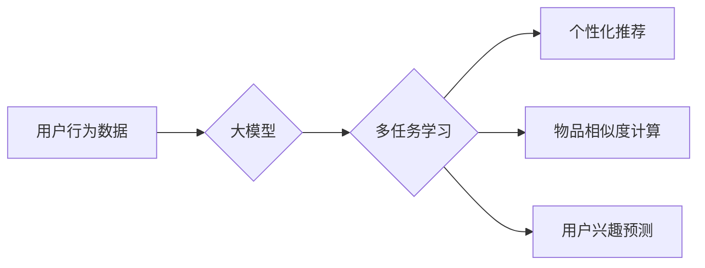

                 

## 大模型在推荐系统中的多任务学习方法

> 关键词：大模型、推荐系统、多任务学习、深度学习、个性化推荐、协同过滤、内容过滤

## 1. 背景介绍

推荐系统作为信息过滤和个性化内容呈现的重要工具，在电商、社交媒体、视频平台等领域发挥着越来越重要的作用。传统的推荐系统主要依赖于协同过滤和内容过滤等方法，但这些方法存在一定的局限性，例如数据稀疏性、冷启动问题和推荐结果单一性等。

近年来，随着深度学习技术的快速发展，大模型在推荐系统领域展现出巨大的潜力。大模型拥有海量参数和强大的学习能力，能够从海量数据中学习到更丰富的用户和物品特征，从而提升推荐系统的准确性和个性化程度。

多任务学习 (Multi-Task Learning, MTL) 作为一种机器学习范式，可以有效地利用不同任务之间的共享知识，从而提升模型的泛化能力和性能。将多任务学习应用于推荐系统，可以有效地解决传统推荐系统面临的挑战，例如数据稀疏性、冷启动问题和推荐结果单一性等。

## 2. 核心概念与联系

### 2.1 多任务学习 (MTL)

多任务学习 (MTL) 是一种机器学习范式，它训练一个共享参数的模型来同时学习多个相关任务。通过共享参数，MTL 可以有效地利用不同任务之间的相关性，从而提升模型的泛化能力和性能。

### 2.2 推荐系统

推荐系统旨在根据用户的历史行为、偏好和上下文信息，预测用户对物品的兴趣，并推荐用户可能感兴趣的物品。推荐系统可以分为以下几种类型：

* **协同过滤:** 基于用户的相似性或物品的相似性进行推荐。
* **内容过滤:** 基于物品的特征和用户偏好进行推荐。
* **混合推荐:** 结合协同过滤和内容过滤进行推荐。

### 2.3 大模型

大模型是指参数量巨大、训练数据量庞大的深度学习模型。大模型通常具有强大的学习能力和泛化能力，能够从海量数据中学习到更丰富的知识和模式。

**Mermaid 流程图**



## 3. 核心算法原理 & 具体操作步骤

### 3.1 算法原理概述

大模型在推荐系统中的多任务学习方法通常采用共享参数的深度学习模型，将多个相关任务联合训练。例如，可以将用户点击预测、用户评分预测、物品相似度计算等任务作为多个子任务，并共享模型的底层特征提取层。通过共享参数，模型可以学习到更丰富的用户和物品特征，从而提升推荐系统的性能。

### 3.2 算法步骤详解

1. **数据预处理:** 收集用户行为数据、物品信息等数据，并进行清洗、转换和特征工程等预处理操作。
2. **模型构建:** 设计一个共享参数的深度学习模型，将多个子任务作为输出层，并共享模型的底层特征提取层。
3. **任务权重设置:** 为每个子任务设置不同的权重，以平衡不同任务的重要性。
4. **模型训练:** 使用梯度下降等优化算法，训练模型，并根据任务权重进行损失函数的加权求和。
5. **模型评估:** 使用测试数据评估模型的性能，并根据评估结果进行模型调优。
6. **推荐系统部署:** 将训练好的模型部署到推荐系统中，并进行线上推荐。

### 3.3 算法优缺点

**优点:**

* **提升泛化能力:** 通过共享参数，模型可以学习到更丰富的用户和物品特征，从而提升模型的泛化能力。
* **解决数据稀疏性:** 多任务学习可以利用不同任务之间的相关性，缓解数据稀疏性问题。
* **提升推荐结果多样性:** 多任务学习可以学习到不同类型的用户偏好，从而提升推荐结果的多样性。

**缺点:**

* **模型复杂度增加:** 多任务学习模型的复杂度比单任务学习模型更高，需要更多的计算资源和训练时间。
* **任务相关性:** 多任务学习的效果依赖于任务之间的相关性，如果任务之间不相关，则效果可能不佳。
* **任务权重设置:** 任务权重的设置需要根据实际情况进行调整，否则可能会影响模型的性能。

### 3.4 算法应用领域

大模型在推荐系统中的多任务学习方法可以应用于以下领域:

* **电商推荐:** 推荐商品、优惠券、促销活动等。
* **社交媒体推荐:** 推荐好友、话题、文章等。
* **视频平台推荐:** 推荐视频、用户、频道等。
* **音乐平台推荐:** 推荐歌曲、艺术家、专辑等。

## 4. 数学模型和公式 & 详细讲解 & 举例说明

### 4.1 数学模型构建

假设我们有 $N$ 个用户和 $M$ 个物品，每个用户 $u$ 对每个物品 $i$ 的评分为 $r_{ui}$。我们的目标是预测用户 $u$ 对物品 $i$ 的评分。

我们可以使用一个多任务学习模型来同时学习用户和物品的特征，并预测用户对物品的评分。模型的结构可以如下所示:

* **输入层:** 用户 $u$ 和物品 $i$ 的特征向量 $x_u$ 和 $x_i$。
* **隐藏层:** 多层神经网络，用于提取用户和物品的特征。
* **输出层:** 两个子任务的输出层:

    * **评分预测层:** 预测用户 $u$ 对物品 $i$ 的评分 $r_{ui}$。
    * **相似度计算层:** 预测用户 $u$ 和物品 $i$ 的相似度 $s_{ui}$。

### 4.2 公式推导过程

* **评分预测层:** 使用线性回归模型预测用户 $u$ 对物品 $i$ 的评分 $r_{ui}$:

$$
r_{ui} = w_1 x_u + w_2 x_i + b
$$

其中，$w_1$ 和 $w_2$ 是权重向量，$b$ 是偏置项。

* **相似度计算层:** 使用余弦相似度计算用户 $u$ 和物品 $i$ 的相似度 $s_{ui}$:

$$
s_{ui} = \frac{x_u \cdot x_i}{||x_u|| ||x_i||}
$$

其中，$x_u \cdot x_i$ 是用户 $u$ 和物品 $i$ 的特征向量的点积，$||x_u||$ 和 $||x_i||$ 是用户 $u$ 和物品 $i$ 的特征向量的模长。

### 4.3 案例分析与讲解

假设我们有一个电商平台，需要推荐商品给用户。我们可以使用大模型在推荐系统中的多任务学习方法，将以下任务作为子任务:

* **商品点击预测:** 预测用户是否会点击某个商品。
* **商品评分预测:** 预测用户对某个商品的评分。
* **商品相似度计算:** 计算两个商品之间的相似度。

通过共享参数，模型可以学习到更丰富的用户和商品特征，从而提升推荐系统的性能。例如，模型可以学习到用户喜欢购买哪些类型的商品，以及哪些商品具有相似的特征。

## 5. 项目实践：代码实例和详细解释说明

### 5.1 开发环境搭建

* **操作系统:** Ubuntu 20.04
* **Python 版本:** 3.8
* **深度学习框架:** PyTorch 1.8
* **其他依赖库:** numpy, pandas, scikit-learn

### 5.2 源代码详细实现

```python
import torch
import torch.nn as nn

class MultiTaskRecommender(nn.Module):
    def __init__(self, user_dim, item_dim, hidden_dim):
        super(MultiTaskRecommender, self).__init__()
        self.user_embedding = nn.Embedding(user_dim, hidden_dim)
        self.item_embedding = nn.Embedding(item_dim, hidden_dim)
        self.fc = nn.Linear(hidden_dim * 2, hidden_dim)
        self.rating_head = nn.Linear(hidden_dim, 1)
        self.similarity_head = nn.Linear(hidden_dim, 1)

    def forward(self, user_ids, item_ids):
        user_embeddings = self.user_embedding(user_ids)
        item_embeddings = self.item_embedding(item_ids)
        
        concat_embeddings = torch.cat((user_embeddings, item_embeddings), dim=1)
        hidden = self.fc(concat_embeddings)
        
        rating = self.rating_head(hidden)
        similarity = self.similarity_head(hidden)
        
        return rating, similarity

# 实例化模型
model = MultiTaskRecommender(user_dim=1000, item_dim=10000, hidden_dim=64)

# 定义损失函数
criterion = nn.MSELoss()

# 定义优化器
optimizer = torch.optim.Adam(model.parameters(), lr=0.001)

# 训练模型
for epoch in range(10):
    # ... 训练代码 ...
```

### 5.3 代码解读与分析

* **模型结构:** 代码中定义了一个多任务学习模型 `MultiTaskRecommender`，该模型包含用户嵌入层、物品嵌入层、全连接层、评分预测头和相似度计算头。
* **前向传播:** 模型的 `forward` 方法实现前向传播过程，将用户 ID 和物品 ID 转换为嵌入向量，并通过全连接层进行特征提取，最后输出评分预测和相似度计算结果。
* **损失函数:** 使用均方误差损失函数 `MSELoss` 来计算模型的损失。
* **优化器:** 使用 Adam 优化器来更新模型参数。
* **训练过程:** 训练模型需要迭代训练数据，并根据损失函数值更新模型参数。

### 5.4 运行结果展示

训练完成后，可以使用测试数据评估模型的性能，例如计算平均绝对误差 (MAE) 和均方根误差 (RMSE)。

## 6. 实际应用场景

### 6.1 电商推荐

大模型在推荐系统中的多任务学习方法可以用于电商平台的商品推荐，例如推荐用户可能感兴趣的商品、优惠券、促销活动等。

### 6.2 社交媒体推荐

大模型可以用于社交媒体平台的推荐，例如推荐用户可能感兴趣的朋友、话题、文章等。

### 6.3 视频平台推荐

大模型可以用于视频平台的推荐，例如推荐用户可能感兴趣的视频、用户、频道等。

### 6.4 未来应用展望

随着大模型技术的不断发展，大模型在推荐系统中的多任务学习方法将有更广泛的应用场景，例如:

* **个性化内容生成:** 利用大模型生成个性化的内容，例如新闻推荐、视频剪辑等。
* **跨模态推荐:** 将文本、图像、音频等多种模态信息融合，进行更精准的推荐。
* **实时推荐:** 利用大模型进行实时推荐，例如在线游戏中的物品推荐、在线购物中的商品推荐等。

## 7. 工具和资源推荐

### 7.1 学习资源推荐

* **书籍:**
    * Deep Learning by Ian Goodfellow, Yoshua Bengio, and Aaron Courville
    * Hands-On Machine Learning with Scikit-Learn, Keras & TensorFlow by Aurélien Géron
* **在线课程:**
    * Deep Learning Specialization by Andrew Ng (Coursera)
    * Fast.ai Practical Deep Learning for Coders
* **博客和网站:**
    * Towards Data Science
    * Machine Learning Mastery

### 7.2 开发工具推荐

* **深度学习框架:** PyTorch, TensorFlow, Keras
* **数据处理库:** Pandas, NumPy
* **机器学习库:** Scikit-learn
* **云计算平台:** AWS, Google Cloud, Azure

### 7.3 相关论文推荐

* **Multi-Task Learning**
    * Multi-Task Learning by Richard S. Sutton
    * A Survey on Multi-Task Learning by Zhiyuan Liu et al.
* **大模型在推荐系统中的应用**
    * BERT for Recommender Systems by Jianfeng Gao et al.
    * Transformer-based Recommendation Models by Xiangnan He et al.

## 8. 总结：未来发展趋势与挑战

### 8.1 研究成果总结

大模型在推荐系统中的多任务学习方法取得了显著的成果，能够有效地提升推荐系统的性能，并解决传统推荐系统面临的挑战。

### 8.2 未来发展趋势

* **更强大的模型架构:** 研究更强大的模型架构，例如 Transformer、Graph Neural Networks 等，以提升模型的学习能力和泛化能力。
* **更丰富的任务融合:** 将更多类型的任务融合到多任务学习框架中，例如用户画像、物品分类、内容生成等，以构建更全面的推荐系统。
* **更有效的训练方法:** 研究更有效的训练方法，例如联邦学习、知识蒸馏等，以降低模型训练的成本和时间。

### 8.3 面临的挑战

* **数据稀疏性:** 大模型需要海量数据进行训练，而现实世界中的数据往往是稀疏的，这会影响模型的性能。
* **模型复杂度:** 大模型的复杂度很高，需要大量的计算资源和训练时间。
* **可解释性:** 大模型的决策过程往往难以解释，这会影响用户对推荐结果的信任度。

### 8.4 研究展望

未来，大模型在推荐系统中的多任务学习方法将继续发展，并应用于更多领域。研究者将致力于解决上述挑战，并探索更先进的模型架构、训练方法和应用场景。


## 9. 附录：常见问题与解答

**Q1: 多任务学习与单任务学习相比有什么优势？**

**A1:** 多任务学习可以利用不同任务之间的共享知识，从而提升模型的泛化能力和性能。

**Q2: 如何选择合适的任务进行多任务学习？**

**A2:** 选择合适的任务需要根据实际情况进行分析，任务之间应该存在一定的相关性。

**Q3: 如何设置任务权重？**

**A3:** 任务权重的设置需要根据任务的重要性进行调整，可以使用交叉验证等方法进行调优。


作者：禅与计算机程序设计艺术 / Zen and the Art of Computer Programming<end_of_turn>

