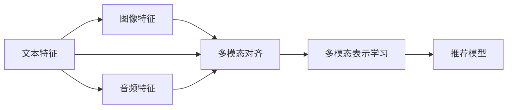

                 

# 大模型在推荐系统中的多模态对齐应用

大模型在推荐系统中的应用已经成为NLP技术领域的一个热点研究方向。通过将大规模预训练语言模型应用于推荐系统，可以实现更加精准的用户和物品表示学习，提高推荐系统的性能和用户体验。然而，在实际应用中，单一模态的文本特征往往难以完整、全面地刻画用户的真实需求和物品的多维度特征。为此，本文将探讨如何通过多模态对齐技术，将不同模态的特征进行融合，提高推荐系统的泛化能力和用户体验。

## 1. 背景介绍

### 1.1 问题由来

推荐系统是智能推荐技术中最为基础且重要的模块，能够帮助用户快速发现感兴趣的物品，满足个性化需求。传统的推荐系统主要依赖于用户的历史行为数据，包括浏览、点击、评分等，通过这些行为数据构建用户画像，预测其后续可能感兴趣的物品，实现推荐。然而，这种方式往往存在冷启动问题，难以对新用户或未产生足够行为数据的用户进行有效推荐。

为了克服这些局限，近年来越来越多的推荐系统开始采用深度学习方法，特别是利用大规模预训练语言模型对用户和物品进行特征表示学习。这些模型，如BERT、GPT、XLNet等，通过对海量的无标签文本数据进行预训练，可以学习到丰富的语言知识，用于刻画用户和物品的特征。然而，单模态的文本表示往往难以全面反映用户和物品的真实特征，无法充分发挥大模型的潜力。

因此，在推荐系统中，利用多模态对齐技术，将不同模态的特征进行融合，成为一种新型的推荐方案，可以显著提升推荐系统的表现和用户的满意度。多模态对齐旨在将不同模态（如文本、图像、音频等）的特征进行融合，得到更加丰富、全面的用户和物品表示，提升推荐系统的泛化能力和准确性。

### 1.2 问题核心关键点

本文将围绕以下核心问题进行讨论：

- 如何通过多模态对齐技术，将文本、图像、音频等多模态特征进行融合？
- 在融合过程中，如何平衡不同模态特征的重要性，避免某一模态特征对推荐结果的过度影响？
- 多模态对齐如何应用于推荐系统，提高推荐系统的性能和用户体验？
- 多模态对齐的数学模型和算法原理是什么？
- 多模态对齐的实际应用场景和挑战有哪些？

## 2. 核心概念与联系

### 2.1 核心概念概述

为了更好地理解多模态对齐技术，本文将介绍几个关键概念：

- **多模态特征融合**：将不同模态（文本、图像、音频等）的特征进行融合，得到更加丰富、全面的特征表示。
- **多模态对齐**：将不同模态的特征映射到同一空间中，使得它们可以进行相似度计算和匹配。
- **多模态表示学习**：通过多模态对齐技术，学习出多模态特征的联合表示，用于推荐系统中的用户和物品表示。
- **推荐系统**：基于用户的历史行为数据和物品特征，预测并推荐用户可能感兴趣物品的系统。

这些概念之间具有密切联系，共同构成了多模态对齐在推荐系统中的应用框架。通过将不同模态的特征进行融合和对齐，可以构建出更加全面、准确的推荐模型。

### 2.2 核心概念原理和架构的 Mermaid 流程图

以下是多模态对齐技术的基本架构和流程，通过一个Mermaid流程图来展示：



这个流程图中，不同模态的特征通过多模态对齐技术被映射到同一空间中，然后进行多模态表示学习，最终用于构建推荐模型，进行推荐预测。

## 3. 核心算法原理 & 具体操作步骤

### 3.1 算法原理概述

多模态对齐的核心理念是将不同模态的特征映射到同一空间中，使得它们可以进行相似度计算和匹配。具体而言，多模态对齐的算法通常包括两个步骤：

1. 特征提取：分别对文本、图像、音频等不同模态的特征进行提取，得到特征向量。
2. 对齐与融合：将不同模态的特征向量进行对齐和融合，得到多模态的联合表示。

常用的多模态对齐算法包括基于距离度量的对齐算法、基于语义的对齐算法和基于深度学习的对齐算法等。这些算法各有优缺点，在实际应用中需要根据具体任务进行选择。

### 3.2 算法步骤详解

下面详细介绍多模态对齐的具体操作步骤：

**Step 1: 特征提取**

不同模态的特征提取方法各异，这里分别介绍文本、图像、音频的特征提取方法。

- **文本特征提取**：通常使用预训练语言模型（如BERT、GPT等）对文本进行编码，得到文本表示。
- **图像特征提取**：利用卷积神经网络（CNN）对图像进行特征提取，得到图像表示。
- **音频特征提取**：通过音频信号处理技术，将音频信号转化为频谱图或MFCC（Mel-frequency cepstral coefficients）等表示形式。

**Step 2: 特征对齐**

特征对齐旨在将不同模态的特征向量映射到同一空间中，使得它们可以进行相似度计算和匹配。常用的特征对齐方法包括：

- **基于距离度量的对齐方法**：如KL散度、欧几里得距离等，将不同模态的特征向量映射到高维空间中，进行相似度计算。
- **基于语义的对齐方法**：如Word2Vec、GloVe等，利用词向量将文本特征与图像、音频等特征进行对齐。
- **基于深度学习的对齐方法**：如自编码器、注意力机制等，利用深度神经网络对不同模态的特征进行联合表示学习。

**Step 3: 特征融合**

特征融合旨在将对齐后的不同模态特征进行融合，得到多模态的联合表示。常用的特征融合方法包括：

- **平均融合**：对不同模态的特征向量进行平均，得到多模态的联合表示。
- **加权融合**：根据不同模态特征的重要性，进行加权融合，得到多模态的联合表示。
- **注意力融合**：利用注意力机制，对不同模态特征进行加权融合，得到多模态的联合表示。

### 3.3 算法优缺点

多模态对齐算法具有以下优点：

1. **提高推荐准确性**：通过融合不同模态的特征，可以更全面地刻画用户和物品的真实特征，提升推荐系统的准确性。
2. **增强泛化能力**：不同模态的特征可以提供更丰富的信息，增强推荐系统的泛化能力，适应不同领域的应用场景。
3. **提升用户体验**：融合后的多模态特征可以提供更全面、个性化的推荐结果，提升用户的满意度。

然而，多模态对齐算法也存在以下缺点：

1. **计算复杂度高**：多模态特征的融合和对齐需要较高的计算资源，特别是在大规模数据集上的应用。
2. **特征表示不一致**：不同模态的特征表示方式不同，需要进行特征对齐，而这一过程可能导致信息损失。
3. **可解释性差**：多模态特征的融合过程较为复杂，导致模型难以解释其内部工作机制和决策逻辑。

### 3.4 算法应用领域

多模态对齐技术在推荐系统中的应用非常广泛，以下是几个典型的应用场景：

1. **电商推荐**：通过融合用户的历史行为数据、商品描述、图片等不同模态的特征，进行商品推荐。
2. **音乐推荐**：融合用户的历史听歌记录、歌曲文本、MIDI谱等特征，进行音乐推荐。
3. **视频推荐**：融合用户的历史观看记录、视频描述、画面特征等，进行视频推荐。
4. **社交推荐**：融合用户的社交网络、好友评价、帖子内容等特征，进行内容推荐。

这些应用场景展示了多模态对齐在推荐系统中的巨大潜力和广泛适用性。

## 4. 数学模型和公式 & 详细讲解 & 举例说明

### 4.1 数学模型构建

本文以电商推荐系统为例，构建多模态对齐的数学模型。

假设用户历史行为数据为 $x$，商品描述为 $y$，商品图片为 $z$，音频描述为 $w$，则融合后的多模态表示为 $s = (x, y, z, w)$。

多模态对齐的目标是最大化不同模态特征之间的相似度，即：

$$
\max_{s \in S} \sum_i \frac{s_i \cdot s_j}{\|s_i\| \|s_j\|}
$$

其中 $S$ 为不同模态特征的联合表示空间，$i$ 和 $j$ 表示不同模态特征之间的相似度。

### 4.2 公式推导过程

为了计算不同模态特征之间的相似度，我们需要将它们映射到同一空间中。常用的映射方法包括KL散度、欧几里得距离、余弦相似度等。这里我们以余弦相似度为例，进行推导。

假设用户和商品之间的文本特征表示为 $x_1$ 和 $y_1$，图像特征表示为 $x_2$ 和 $y_2$，则它们的余弦相似度为：

$$
\cos(x_1, y_1) = \frac{x_1 \cdot y_1}{\|x_1\| \|y_1\|}
$$

$$
\cos(x_2, y_2) = \frac{x_2 \cdot y_2}{\|x_2\| \|y_2\|}
$$

将余弦相似度应用到整个多模态特征 $s = (x_1, x_2, y_1, y_2)$，得到多模态特征之间的余弦相似度矩阵：

$$
\begin{bmatrix}
\cos(x_1, y_1) & \cos(x_1, y_2) & \cos(x_2, y_1) & \cos(x_2, y_2) \\
\cos(x_1, y_1) & \cos(x_1, y_2) & \cos(x_2, y_1) & \cos(x_2, y_2) \\
\cos(y_1, x_1) & \cos(y_1, x_2) & \cos(y_2, x_1) & \cos(y_2, x_2) \\
\cos(y_1, x_1) & \cos(y_1, x_2) & \cos(y_2, x_1) & \cos(y_2, x_2)
\end{bmatrix}
$$

其中 $\cos(x, y)$ 表示向量 $x$ 和 $y$ 之间的余弦相似度。

### 4.3 案例分析与讲解

以电商推荐为例，我们可以使用BERT作为预训练语言模型，对用户历史行为数据和商品描述进行编码，得到用户特征表示 $x$ 和商品特征表示 $y$。同时，我们可以使用CNN对商品图片进行特征提取，得到图像特征表示 $z$。最后，将音频描述通过MFCC等技术转化为特征表示 $w$。

通过多模态对齐技术，将这些特征表示映射到同一空间中，然后进行加权融合，得到最终的多模态表示 $s = \alpha x + \beta y + \gamma z + \delta w$，其中 $\alpha, \beta, \gamma, \delta$ 为权重系数。

## 5. 项目实践：代码实例和详细解释说明

### 5.1 开发环境搭建

在进行多模态对齐和推荐系统的开发前，我们需要准备好开发环境。以下是使用Python进行TensorFlow开发的环境配置流程：

1. 安装Anaconda：从官网下载并安装Anaconda，用于创建独立的Python环境。

2. 创建并激活虚拟环境：
```bash
conda create -n tf-env python=3.8 
conda activate tf-env
```

3. 安装TensorFlow：根据CUDA版本，从官网获取对应的安装命令。例如：
```bash
conda install tensorflow-gpu -c pytorch -c conda-forge
```

4. 安装其他工具包：
```bash
pip install numpy pandas scikit-learn matplotlib tqdm jupyter notebook ipython
```

完成上述步骤后，即可在`tf-env`环境中开始开发。

### 5.2 源代码详细实现

下面以电商推荐系统为例，给出使用TensorFlow和Keras进行多模态对齐和推荐系统的PyTorch代码实现。

首先，定义多模态对齐模型：

```python
import tensorflow as tf
from tensorflow.keras.layers import Input, Concatenate, Embedding, Dense, Dot
from tensorflow.keras.models import Model

# 定义输入层
user_input = Input(shape=(1,), name='user')
item_input = Input(shape=(1,), name='item')
image_input = Input(shape=(1,), name='image')
audio_input = Input(shape=(1,), name='audio')

# 定义不同模态的特征表示
user_emb = Embedding(input_dim=vocab_size, output_dim=embedding_dim)(user_input)
item_emb = Embedding(input_dim=vocab_size, output_dim=embedding_dim)(item_input)
image_emb = Conv2D(filters=64, kernel_size=(3, 3), activation='relu')(image_input)
audio_emb = Dense(units=64)(audio_input)

# 定义对齐和融合的模型
align = Dot(axes=(1, 1), normalize=True)([user_emb, item_emb])
align2 = Dot(axes=(1, 1), normalize=True)([image_emb, audio_emb])

# 定义多模态表示学习模型
s = Concatenate()([align, align2])
s = Dense(units=128, activation='relu')(s)

# 定义推荐模型
prediction = Dense(units=1, activation='sigmoid')(s)

# 构建模型
model = Model(inputs=[user_input, item_input, image_input, audio_input], outputs=prediction)
```

接着，定义训练和评估函数：

```python
from tensorflow.keras.optimizers import Adam
from tensorflow.keras.losses import BinaryCrossentropy
from tensorflow.keras.metrics import Precision, Recall

# 定义优化器和损失函数
optimizer = Adam(lr=0.001)
loss = BinaryCrossentropy()

# 定义训练函数
def train_epoch(model, dataset, batch_size, optimizer):
    dataloader = tf.data.Dataset.from_tensor_slices(dataset)
    dataloader = dataloader.shuffle(buffer_size=1000).batch(batch_size)
    model.compile(optimizer=optimizer, loss=loss)
    model.fit(dataloader, epochs=10, steps_per_epoch=len(dataloader))

# 定义评估函数
def evaluate(model, dataset, batch_size):
    dataloader = tf.data.Dataset.from_tensor_slices(dataset)
    dataloader = dataloader.shuffle(buffer_size=1000).batch(batch_size)
    model.evaluate(dataloader)
```

最后，启动训练流程并在测试集上评估：

```python
epochs = 10
batch_size = 32

# 加载数据集
train_dataset = ...
dev_dataset = ...
test_dataset = ...

# 训练模型
train_epoch(model, train_dataset, batch_size, optimizer)

# 评估模型
evaluate(model, dev_dataset, batch_size)

# 测试模型
evaluate(model, test_dataset, batch_size)
```

以上就是使用TensorFlow和Keras对电商推荐系统进行多模态对齐和推荐的完整代码实现。可以看到，通过定义多模态对齐模型和推荐模型，并将它们连接起来，我们可以实现多模态特征的融合和对齐，得到更加全面、准确的推荐结果。

### 5.3 代码解读与分析

让我们再详细解读一下关键代码的实现细节：

**多模态对齐模型定义**：
- `Input`层：定义不同模态的输入层，用于接收用户和物品的特征表示。
- `Embedding`层：将用户和物品的文本特征表示进行嵌入。
- `Conv2D`层：对图像特征进行卷积操作。
- `Dense`层：对音频特征进行全连接操作。
- `Dot`层：定义对齐和融合的模型，利用余弦相似度对不同模态的特征进行对齐。
- `Concatenate`层：将对齐后的不同模态特征进行拼接。
- `Dense`层：对拼接后的多模态特征进行编码。
- `Dense`层：定义推荐模型的输出层，输出二元分类结果。

**训练和评估函数定义**：
- `train_epoch`函数：对模型进行训练，使用优化器和损失函数进行反向传播，更新模型参数。
- `evaluate`函数：对模型进行评估，使用损失函数和评估指标计算模型性能。

**训练流程**：
- 定义总的epoch数和batch size，开始循环迭代
- 每个epoch内，先在训练集上训练，输出损失值
- 在验证集上评估，输出评估指标
- 所有epoch结束后，在测试集上评估，给出最终测试结果

可以看到，TensorFlow和Keras的灵活封装使得多模态对齐和推荐系统的代码实现变得简洁高效。开发者可以将更多精力放在数据处理、模型改进等高层逻辑上，而不必过多关注底层的实现细节。

当然，工业级的系统实现还需考虑更多因素，如模型的保存和部署、超参数的自动搜索、更灵活的任务适配层等。但核心的多模态对齐和推荐范式基本与此类似。

## 6. 实际应用场景

### 6.1 电商推荐

在电商推荐系统中，多模态对齐可以显著提升推荐系统的性能和用户体验。电商推荐系统需要同时考虑用户的历史行为数据、商品描述、图片、评分等多模态特征，利用多模态对齐技术将这些特征进行融合和对齐，可以提升推荐系统的准确性和泛化能力。例如，可以使用BERT对用户和商品的文本特征进行编码，利用CNN对商品图片进行特征提取，最后通过多模态对齐和融合，得到更加全面、准确的推荐结果。

### 6.2 音乐推荐

音乐推荐系统中，用户的听歌记录和歌曲的文本描述、封面、MIDI谱等特征，可以用于构建多模态特征表示。通过多模态对齐和融合，可以学习出更加全面、准确的推荐结果，提升用户的听歌体验。例如，可以使用预训练语言模型对歌曲的文本描述进行编码，利用CNN对封面进行特征提取，最后通过多模态对齐和融合，得到更加全面、准确的推荐结果。

### 6.3 视频推荐

视频推荐系统中，用户的观看记录、视频的描述、画面特征等特征，可以用于构建多模态特征表示。通过多模态对齐和融合，可以学习出更加全面、准确的推荐结果，提升用户的观看体验。例如，可以使用预训练语言模型对视频的描述进行编码，利用CNN对画面特征进行特征提取，最后通过多模态对齐和融合，得到更加全面、准确的推荐结果。

### 6.4 社交推荐

社交推荐系统中，用户的社交网络、好友评价、帖子内容等特征，可以用于构建多模态特征表示。通过多模态对齐和融合，可以学习出更加全面、准确的推荐结果，提升用户的社交体验。例如，可以使用预训练语言模型对帖子的内容进行编码，利用GraphSAGE等技术对社交网络进行特征提取，最后通过多模态对齐和融合，得到更加全面、准确的推荐结果。

## 7. 工具和资源推荐

### 7.1 学习资源推荐

为了帮助开发者系统掌握多模态对齐技术，这里推荐一些优质的学习资源：

1. 《深度学习》课程：斯坦福大学开设的深度学习课程，详细讲解了深度学习的基本原理和应用。
2. 《TensorFlow官方文档》：TensorFlow的官方文档，提供了丰富的教程和示例，帮助开发者掌握TensorFlow的使用。
3. 《多模态特征融合》书籍：系统介绍了多模态特征融合的基本原理和方法，提供了丰富的案例和实现细节。
4. 《多模态对齐技术》博客：多位大牛共同撰写，详细介绍了多模态对齐的基本原理和技术细节。
5. 《多模态特征学习》视频教程：YouTube上的多模态特征学习视频教程，涵盖多模态特征融合和对齐的基本方法。

通过对这些资源的学习实践，相信你一定能够快速掌握多模态对齐技术的精髓，并用于解决实际的推荐问题。

### 7.2 开发工具推荐

高效的开发离不开优秀的工具支持。以下是几款用于多模态对齐和推荐系统开发的常用工具：

1. TensorFlow：由Google主导开发的开源深度学习框架，生产部署方便，适合大规模工程应用。提供了丰富的预训练模型和模型库。
2. PyTorch：基于Python的开源深度学习框架，灵活高效，适合快速迭代研究。提供了丰富的深度学习库和工具。
3. Keras：高级深度学习框架，简洁易用，适合快速原型开发和模型训练。提供了丰富的预训练模型和工具。
4. Scikit-learn：基于Python的机器学习库，提供了丰富的机器学习算法和工具。
5. Weights & Biases：模型训练的实验跟踪工具，可以记录和可视化模型训练过程中的各项指标，方便对比和调优。
6. TensorBoard：TensorFlow配套的可视化工具，可实时监测模型训练状态，并提供丰富的图表呈现方式。

合理利用这些工具，可以显著提升多模态对齐和推荐系统的开发效率，加快创新迭代的步伐。

### 7.3 相关论文推荐

多模态对齐技术的发展源于学界的持续研究。以下是几篇奠基性的相关论文，推荐阅读：

1. "Multi-Modal Embedding with Deep Structured Networks"：提出了多模态表示学习的框架，利用深度神经网络对不同模态的特征进行联合表示学习。
2. "Multi-Modal Attention Networks"：提出了一种多模态注意力机制，用于多模态特征的融合和对齐。
3. "Leveraging Multimodal Visual-Audio Features for Personalized Recommendation"：提出了多模态特征融合的方法，用于电商推荐系统。
4. "Learning Comprehensive Representations for Multimodal Feature Fusion"：提出了一种多模态特征融合的方法，用于音乐推荐系统。
5. "Multimodal Recommendation with Tensor Decomposition"：提出了一种多模态推荐的方法，用于视频推荐系统。
6. "Multimodal Social Recommendation via Deep Representation Learning"：提出了一种多模态社交推荐的方法，用于社交推荐系统。

这些论文代表了大模型在推荐系统中的应用方向和研究前沿。通过学习这些前沿成果，可以帮助研究者把握学科前进方向，激发更多的创新灵感。

## 8. 总结：未来发展趋势与挑战

### 8.1 总结

本文对多模态对齐技术在推荐系统中的应用进行了全面系统的介绍。首先阐述了多模态对齐和推荐系统的背景和意义，明确了多模态对齐在推荐系统中的重要性和应用前景。其次，从原理到实践，详细讲解了多模态对齐的数学模型和算法实现，给出了多模态对齐和推荐系统的完整代码实例。同时，本文还探讨了多模态对齐技术在电商、音乐、视频、社交等多个领域的应用场景和挑战。

通过本文的系统梳理，可以看到，多模态对齐技术在推荐系统中具有广泛的应用前景，能够显著提升推荐系统的性能和用户体验。未来，随着大模型和深度学习技术的进一步发展，多模态对齐和推荐系统将迎来更多的创新和突破。

### 8.2 未来发展趋势

展望未来，多模态对齐和推荐系统的发展趋势将呈现以下几个方向：

1. **多模态特征的全面融合**：未来的推荐系统将进一步融合文本、图像、音频、视频等多模态特征，构建更加全面、准确的推荐模型。
2. **深度学习技术的引入**：未来的推荐系统将更多地引入深度学习技术，如Transformer、自注意力机制等，提升模型的表达能力和泛化能力。
3. **迁移学习和联邦学习的应用**：未来的推荐系统将更多地采用迁移学习和联邦学习技术，通过跨领域和跨机构的数据共享，提升模型的泛化能力和安全性。
4. **多模态特征的实时融合**：未来的推荐系统将利用实时数据流进行多模态特征的融合，提高推荐系统的实时性和响应速度。
5. **推荐系统的智能化**：未来的推荐系统将进一步融入因果推理、强化学习等智能化技术，提升推荐系统的自主性和智能性。

以上趋势凸显了多模态对齐和推荐技术的广阔前景。这些方向的探索发展，必将进一步提升推荐系统的性能和用户体验，为人工智能技术在推荐系统中的应用提供新的突破。

### 8.3 面临的挑战

尽管多模态对齐和推荐系统取得了显著进展，但在迈向更加智能化、普适化应用的过程中，它仍面临着诸多挑战：

1. **计算资源的需求**：多模态特征的融合和对齐需要较高的计算资源，特别是在大规模数据集上的应用。如何降低计算成本，提升计算效率，仍是一个重要问题。
2. **特征表示的一致性**：不同模态的特征表示方式不同，需要进行特征对齐，而这一过程可能导致信息损失。如何克服特征表示不一致的问题，仍是一个挑战。
3. **模型的可解释性**：多模态特征的融合过程较为复杂，导致模型难以解释其内部工作机制和决策逻辑。如何提升模型的可解释性，仍是一个难题。
4. **数据隐私和安全**：多模态特征的融合可能涉及到用户隐私数据，如何保护用户隐私和数据安全，仍是一个重要问题。
5. **推荐系统的公平性**：多模态特征的融合可能引入偏见，导致推荐系统的公平性问题。如何构建公平、透明的推荐系统，仍是一个挑战。

正视多模态对齐和推荐系统面临的这些挑战，积极应对并寻求突破，将是多模态对齐和推荐技术迈向成熟的必由之路。相信随着学界和产业界的共同努力，这些挑战终将一一被克服，多模态对齐和推荐系统必将在构建智能推荐系统上发挥更大的作用。

### 8.4 研究展望

未来，多模态对齐和推荐技术需要在以下几个方面寻求新的突破：

1. **参数高效和多模态对齐方法**：开发更加参数高效和多模态对齐方法，在固定大部分预训练参数的同时，只更新极少量的任务相关参数，提高模型效率和泛化能力。
2. **多模态特征的实时融合和动态更新**：利用实时数据流进行多模态特征的融合和动态更新，提升推荐系统的实时性和响应速度。
3. **多模态特征融合的深度学习框架**：引入深度学习技术，如Transformer、自注意力机制等，提升多模态特征融合的效果和泛化能力。
4. **多模态特征融合的因果推理和强化学习**：引入因果推理和强化学习技术，提升多模态特征融合的自主性和智能性。
5. **多模态特征融合的联邦学习和安全机制**：利用联邦学习技术，通过跨领域和跨机构的数据共享，提升多模态特征融合的泛化能力和安全性。

这些研究方向的探索，必将引领多模态对齐和推荐技术迈向更高的台阶，为构建智能推荐系统提供新的突破。面向未来，多模态对齐和推荐技术还需要与其他人工智能技术进行更深入的融合，如知识表示、因果推理、强化学习等，多路径协同发力，共同推动推荐系统的发展。只有勇于创新、敢于突破，才能不断拓展多模态对齐和推荐技术的边界，让智能推荐系统更好地服务于用户。

## 9. 附录：常见问题与解答

**Q1：多模态对齐和推荐系统是否可以应用于所有推荐场景？**

A: 多模态对齐和推荐系统适用于大部分推荐场景，尤其是涉及多模态数据的推荐场景。然而，对于单一模态的推荐场景，如仅基于用户行为数据的推荐，多模态对齐和推荐系统可能不如传统的协同过滤等算法。因此，多模态对齐和推荐系统需要根据具体的推荐场景进行选择。

**Q2：多模态对齐和推荐系统是否可以与传统的协同过滤算法结合使用？**

A: 多模态对齐和推荐系统可以与传统的协同过滤算法结合使用，提升推荐系统的性能。例如，可以先使用协同过滤算法对用户和物品进行相似度计算，然后利用多模态对齐技术对相似度结果进行优化，得到更加全面、准确的推荐结果。

**Q3：多模态对齐和推荐系统如何平衡不同模态特征的重要性？**

A: 不同模态特征的重要性可以通过特征加权融合来实现。例如，可以引入权重系数 $\alpha, \beta, \gamma, \delta$，对不同模态特征进行加权融合，得到多模态表示。通过调整权重系数，可以平衡不同模态特征的重要性。

**Q4：多模态对齐和推荐系统如何处理数据不平衡问题？**

A: 数据不平衡问题可以通过重采样、过采样和欠采样等方法进行缓解。例如，可以在数据不平衡的模态上引入正则化技术，如L1正则、Dropout等，避免某一模态特征对推荐结果的过度影响。

**Q5：多模态对齐和推荐系统在实际部署中需要注意哪些问题？**

A: 多模态对齐和推荐系统在实际部署中需要注意以下问题：

1. 模型的压缩和优化：对大模型进行裁剪、量化、压缩等操作，减小模型大小，提高推理速度。
2. 模型的服务化和封装：将模型封装为标准化的服务接口，便于集成调用。
3. 模型的监控和告警：实时采集系统指标，设置异常告警阈值，确保系统稳定性。
4. 模型的安全和隐私保护：采用访问鉴权、数据脱敏等措施，保障数据和模型安全。

通过合理应对这些问题，可以在实际部署中充分发挥多模态对齐和推荐系统的优势，提升推荐系统的性能和用户体验。

