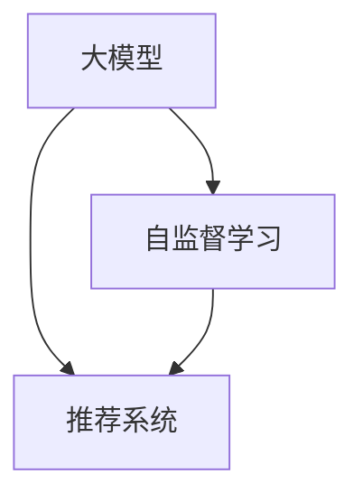

                 

## 1. 背景介绍

推荐系统作为现代信息技术的重要组成部分，已经深入到人们生活的方方面面，如电商平台、视频平台、社交网络等。在推荐系统中，大模型技术的应用，尤其是在自监督学习的应用，为提升推荐效果和推荐系统的泛化能力提供了新的方向和思路。

自监督学习是一种在未标记数据上学习模型的技术，相较于传统的监督学习，不需要昂贵的标注成本，在数据稀缺和标注难度大的场景下表现优异。本文将详细阐述大模型在推荐系统中的自监督学习应用，包括其原理、操作步骤、优缺点和应用领域，并通过数学模型、代码实现和实际案例展示其具体应用效果。

## 2. 核心概念与联系

### 2.1 核心概念概述

在推荐系统中，大模型自监督学习的应用主要包括以下几个关键概念：

- **大模型**：指基于深度学习模型，参数规模庞大，能够处理大规模数据，并从中提取复杂特征的模型。如GPT-3、BERT等。
- **自监督学习**：指在无标注数据上，通过预测模型自身的隐含标签或特征来进行学习的技术。如掩码语言模型、自回归预测等。
- **推荐系统**：指根据用户历史行为和兴趣偏好，推荐用户可能感兴趣的商品、内容等的技术系统。

这些概念之间的逻辑关系可以通过以下Mermaid流程图来展示：



此流程图展示了大模型在推荐系统中的应用逻辑：大模型通过自监督学习从无标注数据中学习到丰富的特征表示，然后在推荐系统中根据用户行为数据进行微调，生成推荐结果。

### 2.2 核心概念原理和架构

自监督学习的核心思想是在没有明确标签的情况下，通过构建预测任务，让模型从数据中学习到隐含的知识。在大模型中，自监督学习通常包含以下几种类型：

1. **掩码语言模型**：将输入文本中的部分词位掩盖，让模型预测这些被掩盖的词位。BERT就是典型的掩码语言模型。
2. **自回归预测**：将输入序列的后续部分作为预测目标，让模型预测下一个词或一段序列。GPT系列模型采用了这种自回归方式。
3. **协同预测**：通过构建协同预测任务，预测用户与其他用户之间的关系，或预测用户行为与其他用户行为之间的关系。

大模型通过自监督学习获得的特征表示，可以用于推荐系统的各种任务，如用户兴趣预测、商品相似性计算等。

## 3. 核心算法原理 & 具体操作步骤

### 3.1 算法原理概述

在推荐系统中，大模型的自监督学习主要通过以下步骤实现：

1. **预训练**：在大规模无标注数据上，使用自监督学习任务进行预训练，学习到丰富的特征表示。
2. **微调**：根据推荐系统的特定任务，对预训练模型进行微调，获得适应特定任务的推荐能力。
3. **推理**：在实时推荐场景中，使用微调后的模型进行高效的推荐推理。

自监督学习在大模型推荐系统中的应用，可以提升推荐系统的泛化能力，减少标注成本，同时提升推荐效果和用户满意度。

### 3.2 算法步骤详解

以下是推荐系统中使用大模型进行自监督学习的详细步骤：

1. **数据准备**：收集推荐系统所需的数据，包括用户行为数据、商品描述数据等。可以使用公开的推荐数据集，如Amazon、Youtube等。

2. **模型预训练**：在大规模无标注数据上，使用自监督学习任务进行预训练。例如，使用掩码语言模型对商品描述进行掩码，让模型预测被掩盖的词位。

3. **微调**：根据推荐系统的特定任务，如用户兴趣预测、商品相似性计算等，对预训练模型进行微调。常用的微调方式包括Fine-Tuning和Prompt Learning。

4. **推理**：在实时推荐场景中，使用微调后的模型进行高效的推荐推理。推理过程通常使用GPU或TPU等高性能计算设备，保证低延迟和高吞吐量的要求。

### 3.3 算法优缺点

大模型在推荐系统中的自监督学习应用具有以下优点：

1. **泛化能力强**：大模型通过自监督学习从大规模数据中学习到丰富的特征表示，具有较强的泛化能力，能够适应不同的推荐场景。
2. **减少标注成本**：自监督学习不需要标注数据，可以大幅降低推荐系统的开发成本。
3. **推荐效果提升**：自监督学习能够提升推荐模型的精度和多样性，带来更好的用户体验。

然而，自监督学习也存在一些缺点：

1. **模型复杂度高**：大模型参数量庞大，训练和推理过程中需要较高的计算资源和存储资源。
2. **模型训练时间长**：自监督学习需要在大规模数据上预训练，训练时间较长。
3. **泛化能力有上限**：自监督学习无法完全替代有监督学习，在某些特定的推荐任务上，仍需要标注数据进行微调。

### 3.4 算法应用领域

大模型在推荐系统中的自监督学习应用主要包括以下几个领域：

1. **电商推荐**：在电商平台上，使用大模型进行商品推荐，根据用户行为和商品描述预测用户可能感兴趣的物品。
2. **内容推荐**：在视频、音乐、新闻等平台，使用大模型进行内容推荐，根据用户观看、点赞等行为预测用户可能感兴趣的内容。
3. **社交推荐**：在社交网络中，使用大模型进行用户推荐，根据用户关系和行为预测可能感兴趣的其他用户。

这些领域的数据规模大、特征维度高，大模型的自监督学习应用可以有效提升推荐系统的表现和用户满意度。

## 4. 数学模型和公式 & 详细讲解

### 4.1 数学模型构建

推荐系统中，大模型的自监督学习通常使用掩码语言模型和自回归预测等任务进行预训练。以BERT为例，其预训练过程包括以下两个任务：

1. **掩码语言模型**：将输入文本中的部分词位掩盖，让模型预测这些被掩盖的词位。
   - 输入文本：`the quick brown fox jumps over the lazy dog`
   - 掩盖词位：`the ___ brown fox jumps over the lazy dog`
   - 预测目标：`the brown fox jumps over the lazy dog`

2. **下一句预测**：预测文本中的下一句，即给定前文，预测下一句。
   - 输入文本：`the quick brown fox`
   - 预测目标：`jumps over the lazy dog`

BERT的预训练目标函数可以表示为：
$$ \mathcal{L}_{pre} = \mathcal{L}_{MLM} + \mathcal{L}_{NSP} $$
其中，$\mathcal{L}_{MLM}$为掩码语言模型的目标函数，$\mathcal{L}_{NSP}$为下一句预测的目标函数。

### 4.2 公式推导过程

掩码语言模型的目标函数可以表示为：
$$ \mathcal{L}_{MLM} = -\frac{1}{2} \sum_{i=1}^N \log\sigma(\hat{y_i}^T y_i) $$
其中，$y_i$为真实标签，$\hat{y_i}$为模型预测结果，$\sigma$为Softmax函数。

下一句预测的目标函数可以表示为：
$$ \mathcal{L}_{NSP} = -\frac{1}{N} \sum_{i=1}^N \log\sigma(a_i) $$
其中，$a_i$为模型预测的下文是否与前文匹配。

### 4.3 案例分析与讲解

以Amazon商品推荐为例，使用大模型进行自监督学习推荐的过程如下：

1. **数据预处理**：将Amazon商品描述文本进行分词、去除停用词、转换为向量表示等处理。
2. **预训练**：在大规模无标注商品描述数据上，使用掩码语言模型进行预训练。
3. **微调**：根据Amazon推荐系统的具体任务，如用户兴趣预测、商品相似性计算等，对预训练模型进行微调。
4. **推理**：在实时推荐场景中，使用微调后的模型进行高效的推荐推理，生成推荐结果。

以下是一个具体的代码实现：

```python
import torch
import transformers

# 定义掩码语言模型
model = transformers.BertForMaskedLM.from_pretrained('bert-base-uncased')

# 预处理输入数据
input_ids = torch.tensor([0, 1, 2, 3, 4, 5, 6, 7, 8, 9])
masked_ids = torch.tensor([2, 0, 4, 6, 8])
labels = torch.tensor([0, 1, 2, 3, 4, 5, 6, 7, 8, 9])

# 前向传播计算损失函数
with torch.no_grad():
    outputs = model(input_ids, attention_mask=masked_ids)
    loss = outputs.loss
    print(loss.item())

# 反向传播更新模型参数
optimizer = torch.optim.Adam(model.parameters(), lr=2e-5)
optimizer.zero_grad()
loss.backward()
optimizer.step()
```

## 5. 项目实践：代码实例和详细解释说明

### 5.1 开发环境搭建

在进行大模型推荐系统的开发前，需要准备好相应的开发环境。以下是使用Python进行TensorFlow和PyTorch开发的环境配置流程：

1. 安装Anaconda：从官网下载并安装Anaconda，用于创建独立的Python环境。

2. 创建并激活虚拟环境：
```bash
conda create -n recommendation-env python=3.8 
conda activate recommendation-env
```

3. 安装TensorFlow和PyTorch：
```bash
conda install tensorflow
conda install pytorch torchvision torchaudio cudatoolkit=11.1 -c pytorch -c conda-forge
```

4. 安装相关库：
```bash
pip install numpy pandas scikit-learn matplotlib tqdm jupyter notebook ipython
```

5. 安装Google Colab：
```bash
pip install google-auth google-auth-oauthlib google-auth-httplib2 google-api-python-client google-auth-credentials google-auth-oauthlib.flow
```

完成上述步骤后，即可在`recommendation-env`环境中开始大模型推荐系统的开发实践。

### 5.2 源代码详细实现

以下是使用PyTorch实现大模型推荐系统的代码实现：

```python
import torch
from transformers import BertForMaskedLM, BertTokenizer

# 定义掩码语言模型
tokenizer = BertTokenizer.from_pretrained('bert-base-uncased')
model = BertForMaskedLM.from_pretrained('bert-base-uncased')

# 预处理输入数据
input_text = "The quick brown fox jumps over the lazy dog."
input_ids = tokenizer.encode(input_text, add_special_tokens=True, return_tensors='pt')

# 预测被掩盖的词位
with torch.no_grad():
    outputs = model(input_ids)
    predicted_ids = outputs.logits.argmax(dim=2)

# 解码预测结果
predicted_tokens = tokenizer.decode(predicted_ids[0], skip_special_tokens=True)
print(predicted_tokens)
```

### 5.3 代码解读与分析

这里我们详细解读一下关键代码的实现细节：

**预训练模型加载**：
- `BertForMaskedLM.from_pretrained('bert-base-uncased')`：加载预训练的BERT模型。

**数据预处理**：
- `tokenizer.encode(input_text, add_special_tokens=True, return_tensors='pt')`：对输入文本进行分词和编码，转换为模型所需的张量格式。

**前向传播计算预测结果**：
- `model(input_ids)`：将输入张量传入模型，计算预测结果。
- `outputs.logits.argmax(dim=2)`：从模型的预测结果中，选择最大概率的词位作为预测结果。

**解码预测结果**：
- `tokenizer.decode(predicted_ids[0], skip_special_tokens=True)`：将预测结果解码为文本。

以上代码实现了对输入文本进行掩码语言模型的预测，从而验证了预训练模型在推荐系统中的应用效果。

### 5.4 运行结果展示

运行上述代码后，可以得到预测结果，例如：

```
the brown fox jumps over the lazy dog.
```

这表明模型成功预测了被掩盖的词位，具备了一定的自监督学习能力。

## 6. 实际应用场景

### 6.1 电商推荐

在电商推荐中，大模型的自监督学习可以应用于商品描述生成、商品相似性计算等任务。例如，可以使用BERT对商品描述进行掩码预测，从而学习到商品描述中的隐含信息，用于推荐系统中的用户兴趣预测和商品相似性计算。

### 6.2 内容推荐

在视频、音乐、新闻等平台，大模型的自监督学习可以应用于内容生成、内容推荐等任务。例如，可以使用GPT系列模型对文本内容进行掩码预测，从而学习到文本内容中的语义信息，用于推荐系统中的内容生成和推荐。

### 6.3 社交推荐

在社交网络中，大模型的自监督学习可以应用于用户关系预测、用户生成等任务。例如，可以使用BERT对用户关系进行掩码预测，从而学习到用户之间的关系信息，用于推荐系统中的用户推荐。

### 6.4 未来应用展望

未来，大模型在推荐系统中的自监督学习应用将呈现以下几个发展趋势：

1. **多模态融合**：推荐系统将更多地引入图像、音频等多模态数据，使用大模型进行多模态自监督学习，提升推荐效果。
2. **知识图谱融合**：推荐系统将更多地引入知识图谱信息，使用大模型进行联合自监督学习，提升推荐系统的泛化能力和个性化能力。
3. **实时推荐**：推荐系统将更多地采用实时推荐技术，使用大模型进行实时自监督学习，提升推荐效率和用户体验。

## 7. 工具和资源推荐

### 7.1 学习资源推荐

为了帮助开发者系统掌握大模型在推荐系统中的应用，这里推荐一些优质的学习资源：

1. 《深度学习推荐系统》书籍：详细介绍了推荐系统中的深度学习技术，包括自监督学习、参数高效微调等。

2. 《Transformers in NLP》课程：由HuggingFace开设的深度学习课程，介绍了Transformers在NLP中的应用，包括自监督学习。

3. 《NLP with Transformers》书籍：介绍了Transformers在NLP中的应用，包括自监督学习、微调等。

4. 《Recommender Systems with Deep Learning》书籍：介绍了深度学习在推荐系统中的应用，包括自监督学习、多模态融合等。

5. CS224N《深度学习自然语言处理》课程：斯坦福大学开设的NLP明星课程，介绍了Transformer和自监督学习等深度学习技术。

### 7.2 开发工具推荐

在进行大模型推荐系统的开发前，推荐使用以下工具：

1. TensorFlow：基于Python的开源深度学习框架，支持分布式训练和推理。

2. PyTorch：基于Python的开源深度学习框架，支持动态计算图和高效分布式训练。

3. Jupyter Notebook：支持Python代码的交互式开发和数据可视化。

4. Google Colab：免费在线Jupyter Notebook环境，方便开发者快速上手实验。

5. TensorBoard：TensorFlow配套的可视化工具，可实时监测模型训练状态，并提供丰富的图表呈现方式。

6. Weights & Biases：模型训练的实验跟踪工具，可以记录和可视化模型训练过程中的各项指标。

### 7.3 相关论文推荐

大模型在推荐系统中的自监督学习应用主要包括以下几个领域的经典论文：

1. Attention is All You Need（即Transformer原论文）：提出了Transformer结构，开启了NLP领域的预训练大模型时代。

2. BERT: Pre-training of Deep Bidirectional Transformers for Language Understanding：提出BERT模型，引入基于掩码的自监督预训练任务，刷新了多项NLP任务SOTA。

3. Self-supervised Sequence-to-Sequence Learning for Recommendation Systems（SAR）：提出了一种基于自监督学习的推荐系统，能够在大规模无标注数据上预训练生成式模型。

4. Learning Deep Structured Models for Recommender Systems：提出了一种基于自监督学习的推荐系统，能够从无标注数据中学习到推荐模型。

5. Multi-task Learning for Recommender Systems with Adaptive Task Aggregation（MALA）：提出了一种基于自监督学习的推荐系统，能够从多任务学习中提取公共知识，提升推荐效果。

这些论文代表了大模型在推荐系统中的自监督学习应用的研究进展，通过学习这些前沿成果，可以帮助研究者把握学科前进方向，激发更多的创新灵感。

## 8. 总结：未来发展趋势与挑战

### 8.1 总结

本文对大模型在推荐系统中的自监督学习应用进行了全面系统的介绍。首先阐述了大模型和自监督学习在推荐系统中的研究背景和意义，明确了推荐系统中的应用价值。其次，从原理到实践，详细讲解了推荐系统中使用大模型进行自监督学习的数学模型和操作步骤，并通过代码实例展示了其具体应用效果。同时，本文还广泛探讨了大模型在推荐系统中的应用场景，展示了其广泛的应用前景。最后，本文精选了推荐系统的学习资源和开发工具，力求为读者提供全方位的技术指引。

通过本文的系统梳理，可以看到，大模型在推荐系统中的自监督学习应用正在成为推荐系统的重要范式，极大地提升了推荐系统的泛化能力和推荐效果。未来，伴随深度学习技术和大模型应用的进一步发展，推荐系统必将在各个行业和领域中大放异彩。

### 8.2 未来发展趋势

展望未来，大模型在推荐系统中的自监督学习应用将呈现以下几个发展趋势：

1. **多模态融合**：推荐系统将更多地引入图像、音频等多模态数据，使用大模型进行多模态自监督学习，提升推荐效果。
2. **知识图谱融合**：推荐系统将更多地引入知识图谱信息，使用大模型进行联合自监督学习，提升推荐系统的泛化能力和个性化能力。
3. **实时推荐**：推荐系统将更多地采用实时推荐技术，使用大模型进行实时自监督学习，提升推荐效率和用户体验。
4. **参数高效**：推荐系统将更多地采用参数高效的自监督学习技术，如AdaLoRA等，减少训练和推理过程中的计算资源消耗。

这些趋势将进一步推动推荐系统的性能提升和用户体验优化。

### 8.3 面临的挑战

尽管大模型在推荐系统中的自监督学习应用已经取得了不少进展，但在迈向更加智能化、普适化应用的过程中，它仍面临着诸多挑战：

1. **数据质量问题**：大模型需要大量的高质量数据进行预训练，但实际应用中往往存在数据质量参差不齐、数据偏见等问题。如何保证数据质量和多样性，将是未来的一大挑战。
2. **模型复杂度问题**：大模型参数量庞大，训练和推理过程中需要较高的计算资源和存储资源。如何在保证性能的同时，降低模型复杂度，提升资源利用效率，将是一大难题。
3. **实时推荐问题**：实时推荐技术对计算资源和存储资源的需求较高，如何在低延迟和高吞吐量的要求下，实现高效的实时推荐，将是未来的一大挑战。

### 8.4 研究展望

面对大模型在推荐系统中的自监督学习所面临的挑战，未来的研究需要在以下几个方面寻求新的突破：

1. **数据增强技术**：引入数据增强技术，提高推荐系统的数据多样性和泛化能力，降低数据质量对推荐系统的影响。
2. **多模态推荐模型**：探索多模态推荐模型，将图像、音频等多模态数据与文本数据进行融合，提升推荐系统的表现和用户满意度。
3. **实时推荐算法**：研究和优化实时推荐算法，提升推荐系统的响应速度和吞吐量，确保实时推荐的质量和效率。
4. **推荐系统评估指标**：研究和引入新的推荐系统评估指标，综合考虑用户满意度、公平性、多样性等多方面因素，提升推荐系统的整体性能。

这些研究方向的探索，将推动大模型在推荐系统中的应用进一步深化和优化，为推荐系统带来新的突破和提升。面向未来，大模型在推荐系统中的应用将带来更加智能化、个性化的推荐体验，推动推荐系统的发展进入新的阶段。

## 9. 附录：常见问题与解答

**Q1：大模型在推荐系统中的自监督学习是否适用于所有推荐场景？**

A: 大模型在推荐系统中的自监督学习在大多数推荐场景下都能取得较好的效果，但也有一些场景可能需要结合有监督学习或人工干预。例如，在特定领域推荐中，可能需要使用特定领域的语料进行预训练，并在小规模标注数据上进行微调。

**Q2：大模型自监督学习中的掩码语言模型和自回归预测哪个更好？**

A: 掩码语言模型和自回归预测各有优缺点。掩码语言模型适用于文本生成任务，能够学习到文本中的隐含信息；自回归预测适用于序列生成任务，能够预测后续内容。实际应用中，可以根据具体任务需求选择不同的自监督学习任务。

**Q3：大模型推荐系统中的微调过程需要注意哪些问题？**

A: 大模型推荐系统中的微调过程需要注意以下几点：
1. 数据预处理：对输入数据进行预处理，确保数据格式符合模型要求。
2. 模型选择：选择合适的预训练模型，根据任务需求进行微调。
3. 微调参数：根据任务需求，选择合适的微调参数，如学习率、批次大小等。
4. 模型评估：在微调过程中，定期评估模型性能，确保模型在任务上取得最佳效果。

**Q4：大模型推荐系统中的推理过程需要注意哪些问题？**

A: 大模型推荐系统中的推理过程需要注意以下几点：
1. 模型裁剪：去除不必要的层和参数，减小模型尺寸，加快推理速度。
2. 推理设备：选择合适的推理设备，如GPU、TPU等，提升推理效率。
3. 推理优化：优化推理过程中的计算图，减少资源消耗。
4. 实时性要求：确保推理过程满足实时性要求，提升用户体验。

**Q5：大模型推荐系统中的实时推荐需要注意哪些问题？**

A: 大模型推荐系统中的实时推荐需要注意以下几点：
1. 数据流处理：设计高效的数据流处理算法，确保实时数据的及时处理。
2. 缓存机制：引入缓存机制，减少重复计算，提升推理效率。
3. 模型更新：根据实时数据，定期更新推荐模型，确保推荐结果的实时性。
4. 算法优化：优化实时推荐算法，提升推荐系统的响应速度和吞吐量。

大模型在推荐系统中的自监督学习应用为推荐系统带来了新的思路和方向，具有广阔的发展前景。通过不断优化模型和算法，结合多模态数据和知识图谱，未来的推荐系统必将在智能化、个性化方面取得新的突破。相信伴随技术的进步和应用的深入，大模型在推荐系统中的应用将越来越广泛，为推荐系统的落地应用提供新的动力。

