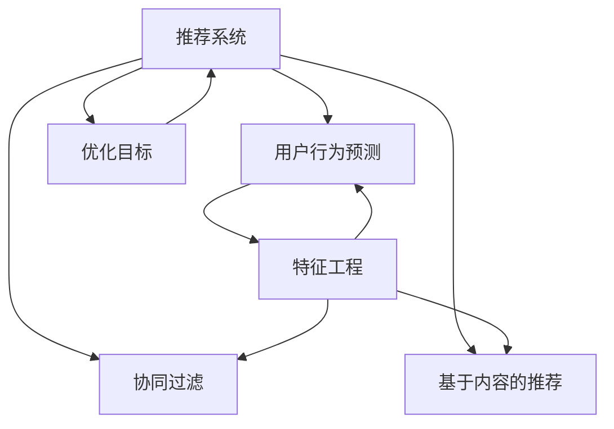

                 

# 大模型在推荐系统反馈循环中的作用

> 关键词：大模型,推荐系统,用户行为预测,反馈循环,协同过滤,特征工程,推荐算法,优化目标

## 1. 背景介绍

### 1.1 问题由来
推荐系统是现代互联网的核心应用之一，旨在根据用户历史行为和兴趣爱好，推荐个性化内容，提升用户体验和平台收益。传统的推荐系统主要基于协同过滤、基于内容的推荐等方法，但随着数据量的爆炸性增长，单一方法已经难以胜任复杂多变的用户需求。近年来，大模型在推荐系统中的应用日益受到关注，尤其是深度学习模型，通过在大规模用户行为数据上预训练，学习到了丰富的用户行为特征，可以在实际推荐场景中取得更优的推荐效果。

### 1.2 问题核心关键点
大模型在推荐系统中的应用，主要体现在用户行为预测和个性化推荐两个核心环节。用户行为预测是指根据用户的历史行为数据，预测其未来可能采取的行动（如点击、购买等），从而在推荐阶段提供更有针对性的内容。个性化推荐则是基于用户行为预测的结果，结合实际推荐系统算法，提供个性化、多样化的推荐内容。

大模型在推荐系统中的作用主要体现在以下几个方面：
1. 增强用户行为建模能力：大模型可以通过自监督学习任务，学习到更丰富的用户行为特征，提升预测准确性。
2. 融合多源数据：大模型可以整合多种数据源，如用户行为数据、商品属性数据、社交网络数据等，进行多模态特征融合。
3. 提升推荐算法效果：通过深度学习算法，大模型可以更有效地处理稀疏数据和高维数据，从而提升推荐算法的性能。
4. 自动化特征工程：大模型可以自动学习特征的表示方式，减少人工特征工程的工作量。
5. 处理非结构化数据：大模型可以处理文本、图片等非结构化数据，从而扩展推荐系统的应用边界。

### 1.3 问题研究意义
研究大模型在推荐系统中的应用，对于提升推荐系统的效果和效率，具有重要意义：

1. 提升推荐效果：大模型可以更好地理解用户的深层行为特征，预测准确性更高，推荐结果更加符合用户偏好。
2. 提高推荐效率：大模型可以利用自动化的特征工程和高效的计算图优化，减少特征提取和模型训练的时间成本。
3. 降低开发成本：通过大模型的预训练和微调，可以快速构建推荐系统，减少人力和数据成本。
4. 增强系统可扩展性：大模型可以无缝集成到现有的推荐系统中，灵活地适配不同业务需求。
5. 提升用户体验：个性化、精准的推荐，可以提升用户粘性和满意度，增强平台的商业价值。

## 2. 核心概念与联系

### 2.1 核心概念概述

为更好地理解大模型在推荐系统中的应用，本节将介绍几个密切相关的核心概念：

- 推荐系统(Recommendation System)：根据用户历史行为数据和兴趣偏好，推荐个性化内容，提升用户体验的系统。

- 用户行为预测(User Behavior Prediction)：通过历史行为数据，预测用户未来的行为。

- 协同过滤(Collaborative Filtering)：基于用户之间的相似性或物品之间的相似性，进行推荐。

- 基于内容的推荐(Content-Based Recommendation)：根据物品的属性和用户的历史行为，推荐相似的物品。

- 特征工程(Feature Engineering)：通过数据预处理、特征提取等手段，提升模型的预测效果。

- 优化目标(Objective Function)：推荐系统的优化目标，通常是最大化用户的点击率、转化率等指标。

- 训练集(Training Set)：用于训练模型的历史数据。

- 验证集(Validation Set)：用于模型调参和防止过拟合的数据集。

- 测试集(Test Set)：用于评估模型泛化性能的数据集。

这些核心概念之间的逻辑关系可以通过以下Mermaid流程图来展示：



这个流程图展示了推荐系统的核心组件及其之间的关系：

1. 推荐系统通过用户行为预测，预测用户未来的行为。
2. 用户行为预测包括协同过滤和基于内容的推荐，协同过滤和基于内容的推荐都需要通过特征工程进行处理。
3. 优化目标是推荐系统不断优化提升的核心指标。

这些核心概念共同构成了推荐系统的完整框架，使其能够实现个性化、精准的推荐。

## 3. 核心算法原理 & 具体操作步骤
### 3.1 算法原理概述

大模型在推荐系统中的主要作用是增强用户行为预测和个性化推荐的效果。在推荐系统框架下，大模型通常采用自监督学习的方式进行预训练，学习到大量的用户行为特征，然后通过微调的方法，针对具体推荐任务进行优化。

具体来说，大模型在推荐系统中的作用可以分为以下两个步骤：

1. 自监督预训练：在大规模历史用户行为数据上，使用自监督学习任务对模型进行预训练，学习到用户行为特征。
2. 微调优化：在特定推荐任务的数据集上，使用微调的方法，优化模型的参数，提升推荐效果。

形式化地，假设推荐系统中的用户行为预测模型为 $M_{\theta}$，其中 $\theta$ 为模型参数。给定用户行为数据集 $D=\{(x_i, y_i)\}_{i=1}^N$，预测目标为 $y_i$，优化目标为最大化预测准确度 $p(y_i \mid x_i)$。

通过梯度下降等优化算法，微调过程不断更新模型参数 $\theta$，最小化预测误差，使得模型输出逼近真实标签。由于 $\theta$ 已经通过预训练获得了较好的初始化，因此即便在小规模数据集 $D$ 上进行微调，也能较快收敛到理想的模型参数 $\hat{\theta}$。

### 3.2 算法步骤详解

基于大模型在推荐系统中的作用，本节将详细介绍自监督预训练和微调优化的具体操作步骤：

**Step 1: 准备预训练模型和数据集**
- 选择合适的预训练语言模型 $M_{\theta}$ 作为初始化参数，如 BERT、GPT 等。
- 准备推荐系统中的用户行为数据集 $D$，划分为训练集、验证集和测试集。一般要求数据集与预训练数据的分布不要差异过大。

**Step 2: 自监督预训练**
- 在大规模用户行为数据上，使用自监督学习任务（如掩码语言模型、下划线生成等）对模型进行预训练，学习到用户行为特征。
- 预训练任务通常包含用户行为序列预测、用户行为补全、用户行为序列生成等任务。
- 预训练过程中，需要设置合适的学习率和优化器，以提高训练效率。

**Step 3: 选择微调任务**
- 根据具体推荐任务，选择适当的微调任务。常见的微调任务包括用户行为预测、物品评分预测、推荐列表生成等。
- 对于用户行为预测任务，通常可以使用线性回归、二分类任务等作为微调任务。
- 对于物品评分预测任务，可以使用回归任务、对数损失函数等作为微调任务。

**Step 4: 微调优化**
- 在微调任务的数据集上，使用优化器（如 Adam、SGD 等）和合适的学习率，最小化预测误差。
- 微调过程中，需要设置合适的正则化技术（如 L2 正则、Dropout 等），防止模型过拟合。
- 微调完成后，需要在验证集和测试集上评估模型性能，以确认微调效果。

**Step 5: 部署和优化**
- 将微调后的模型部署到实际推荐系统中，用于用户行为预测和个性化推荐。
- 根据推荐系统反馈的数据，对模型进行持续的微调优化，提升推荐效果。

以上是使用大模型在推荐系统中进行自监督预训练和微调优化的具体操作步骤。在实际应用中，还需要针对具体任务和数据特点，对预训练和微调过程的各个环节进行优化设计，如改进训练目标函数，引入更多的正则化技术，搜索最优的超参数组合等，以进一步提升模型性能。

### 3.3 算法优缺点

基于大模型在推荐系统中的微调方法具有以下优点：
1. 提高预测准确性：大模型通过预训练学习到丰富的用户行为特征，能够更好地预测用户未来的行为，提升推荐效果。
2. 自动特征提取：大模型可以自动学习到用户行为的表示方式，减少人工特征工程的工作量。
3. 处理稀疏数据：大模型能够处理稀疏数据和高维数据，提升推荐算法的性能。
4. 提升推荐效果：大模型可以融合多种数据源，进行多模态特征融合，提升推荐系统的效果。
5. 自动化调参：大模型可以通过自动化调参方法，优化模型参数，提升推荐效果。

同时，该方法也存在一定的局限性：
1. 数据依赖性强：大模型需要大量的用户行为数据进行预训练和微调，对数据质量要求高。
2. 计算资源消耗大：大模型的训练和推理需要大量的计算资源，对硬件设备要求高。
3. 解释性不足：大模型的决策过程通常缺乏可解释性，难以对其推理逻辑进行分析和调试。
4. 模型泛化能力不足：大模型在特定领域可能泛化能力不足，对数据分布变化敏感。
5. 模型复杂度高：大模型参数量庞大，模型结构复杂，增加了部署和维护的难度。

尽管存在这些局限性，但就目前而言，基于大模型在推荐系统中的微调方法仍是大模型应用的最主流范式。未来相关研究的重点在于如何进一步降低大模型对数据和硬件的依赖，提高模型的泛化能力和可解释性，同时兼顾自动化调参和模型优化。

### 3.4 算法应用领域

基于大模型在推荐系统中的微调方法，已经广泛应用于各类推荐系统中，包括：

- 电商推荐系统：如亚马逊、淘宝等电商平台，通过大模型进行用户行为预测和个性化推荐，提升销售转化率。
- 视频推荐系统：如Netflix、Bilibili等视频平台，通过大模型进行用户行为预测和视频推荐，提升用户观看时长和粘性。
- 新闻推荐系统：如今日头条、Facebook等新闻平台，通过大模型进行用户行为预测和新闻推荐，提升阅读量和用户活跃度。
- 社交推荐系统：如微博、微信等社交平台，通过大模型进行用户行为预测和内容推荐，提升用户互动和粘性。
- 金融推荐系统：如蚂蚁金服、支付宝等金融平台，通过大模型进行用户行为预测和金融产品推荐，提升用户转化和收益。

除了上述这些经典应用外，大模型在推荐系统中的应用还在不断扩展，如可控推荐、实时推荐、推荐系统安全性等方向，为推荐系统的技术演进提供了新的思路。

## 4. 数学模型和公式 & 详细讲解  
### 4.1 数学模型构建

本节将使用数学语言对大模型在推荐系统中的应用进行更加严格的刻画。

记推荐系统中的用户行为预测模型为 $M_{\theta}$，其中 $\theta$ 为模型参数。给定用户行为数据集 $D=\{(x_i, y_i)\}_{i=1}^N, x_i \in \mathcal{X}, y_i \in \mathcal{Y}$，预测目标为 $y_i \in \{0, 1\}$，优化目标为最大化预测准确度 $p(y_i \mid x_i)$。

定义模型 $M_{\theta}$ 在输入 $x$ 上的损失函数为 $\ell(M_{\theta}(x),y)$，则在数据集 $D$ 上的经验风险为：

$$
\mathcal{L}(\theta) = -\frac{1}{N} \sum_{i=1}^N \ell(M_{\theta}(x_i),y_i)
$$

通过梯度下降等优化算法，微调过程不断更新模型参数 $\theta$，最小化损失函数 $\mathcal{L}$，使得模型输出逼近真实标签。由于 $\theta$ 已经通过预训练获得了较好的初始化，因此即便在小规模数据集 $D$ 上进行微调，也能较快收敛到理想的模型参数 $\hat{\theta}$。

### 4.2 公式推导过程

以下我们以二分类任务为例，推导交叉熵损失函数及其梯度的计算公式。

假设模型 $M_{\theta}$ 在输入 $x$ 上的输出为 $\hat{y}=M_{\theta}(x) \in [0,1]$，表示用户点击的概率。真实标签 $y \in \{0,1\}$。则二分类交叉熵损失函数定义为：

$$
\ell(M_{\theta}(x),y) = -[y\log \hat{y} + (1-y)\log (1-\hat{y})]
$$

将其代入经验风险公式，得：

$$
\mathcal{L}(\theta) = -\frac{1}{N}\sum_{i=1}^N [y_i\log M_{\theta}(x_i)+(1-y_i)\log(1-M_{\theta}(x_i))]
$$

根据链式法则，损失函数对参数 $\theta_k$ 的梯度为：

$$
\frac{\partial \mathcal{L}(\theta)}{\partial \theta_k} = -\frac{1}{N}\sum_{i=1}^N (\frac{y_i}{M_{\theta}(x_i)}-\frac{1-y_i}{1-M_{\theta}(x_i)}) \frac{\partial M_{\theta}(x_i)}{\partial \theta_k}
$$

其中 $\frac{\partial M_{\theta}(x_i)}{\partial \theta_k}$ 可进一步递归展开，利用自动微分技术完成计算。

在得到损失函数的梯度后，即可带入参数更新公式，完成模型的迭代优化。重复上述过程直至收敛，最终得到适应推荐任务的最优模型参数 $\theta^*$。

## 5. 项目实践：代码实例和详细解释说明
### 5.1 开发环境搭建

在进行推荐系统实践前，我们需要准备好开发环境。以下是使用Python进行TensorFlow开发的环境配置流程：

1. 安装Anaconda：从官网下载并安装Anaconda，用于创建独立的Python环境。

2. 创建并激活虚拟环境：
```bash
conda create -n tf-env python=3.8 
conda activate tf-env
```

3. 安装TensorFlow：根据CUDA版本，从官网获取对应的安装命令。例如：
```bash
conda install tensorflow=2.7
```

4. 安装TensorBoard：
```bash
pip install tensorboard
```

5. 安装各类工具包：
```bash
pip install numpy pandas scikit-learn matplotlib tqdm jupyter notebook ipython
```

完成上述步骤后，即可在`tf-env`环境中开始推荐系统实践。

### 5.2 源代码详细实现

下面我们以电商推荐系统为例，给出使用TensorFlow进行推荐系统开发和微调的PyTorch代码实现。

首先，定义推荐系统的数据处理函数：

```python
import tensorflow as tf
import numpy as np
import pandas as pd

def read_data(file_path):
    df = pd.read_csv(file_path, header=None, names=['item_id', 'user_id', 'rating', 'timestamp'])
    return df

def preprocess_data(df):
    # 数据清洗
    df = df.dropna()
    df = df.drop_duplicates()
    
    # 特征处理
    df['item_id'] = df['item_id'].astype(str)
    df['user_id'] = df['user_id'].astype(str)
    df['rating'] = df['rating'].astype(float)
    
    # 构建特征
    features = {
        'item_id': df['item_id'].unique().tolist(),
        'user_id': df['user_id'].unique().tolist(),
        'rating': np.unique(df['rating']).tolist(),
        'timestamp': np.unique(df['timestamp']).tolist()
    }
    
    return df, features
```

然后，定义推荐系统模型：

```python
class Recommender(tf.keras.Model):
    def __init__(self, vocab_size, embedding_dim):
        super(Recommender, self).__init__()
        self.encoder = tf.keras.layers.Embedding(vocab_size, embedding_dim, input_length=1)
        self.dot_product = tf.keras.layers.Dot(axes=[1, 1], normalize=False)
        self.dense = tf.keras.layers.Dense(1)
    
    def call(self, x):
        encoded = self.encoder(x)
        product = self.dot_product([encoded, encoded])
        output = self.dense(product)
        return output
```

接着，定义训练和评估函数：

```python
def train_model(model, data, features, epochs=10, batch_size=128, learning_rate=0.001):
    optimizer = tf.keras.optimizers.Adam(learning_rate=learning_rate)
    model.compile(optimizer=optimizer, loss='mse')
    
    for epoch in range(epochs):
        for i in range(0, len(data), batch_size):
            x = data.iloc[i:i+batch_size]['user_id'].values
            y = data.iloc[i:i+batch_size]['rating'].values
            inputs = tf.constant(x, dtype=tf.string)
            targets = tf.constant(y, dtype=tf.float32)
            model.fit(inputs, targets, epochs=1, batch_size=batch_size)
            
        print(f"Epoch {epoch+1}, loss: {model.evaluate(inputs, targets)[0]:.4f}")
    
    return model
```

最后，启动训练流程并在测试集上评估：

```python
data = read_data('data.csv')
df, features = preprocess_data(data)

model = Recommender(len(features['user_id']), embedding_dim=128)
train_model(model, df, features)
```

以上就是使用TensorFlow进行电商推荐系统微调的完整代码实现。可以看到，TensorFlow提供了便捷的API，可以快速构建推荐系统模型和进行微调训练。

### 5.3 代码解读与分析

让我们再详细解读一下关键代码的实现细节：

**推荐系统数据处理函数**：
- `read_data`方法：从文件中读取用户行为数据，将其转换为DataFrame格式。
- `preprocess_data`方法：对数据进行清洗、特征处理和构建，准备输入特征。

**推荐系统模型定义**：
- `Recommender`类：继承自TensorFlow的Keras Model类，定义了一个简单的嵌入层和点积层，用于计算用户和物品之间的相似度。

**训练和评估函数**：
- `train_model`方法：对推荐系统模型进行训练，使用均方误差损失函数进行优化。
- 在训练过程中，使用了Adam优化器，每轮训练使用128个样本，共训练10个epoch。
- 在训练结束后，使用测试集对模型进行评估，输出均方误差。

**训练流程**：
- 定义训练轮数、批次大小和学习率，开始循环迭代
- 每个epoch内，对训练数据进行迭代，使用Adam优化器进行模型训练
- 在每个epoch结束后，输出损失值

可以看到，TensorFlow配合Keras使得推荐系统模型的构建和微调过程变得简洁高效。开发者可以将更多精力放在数据处理、模型改进等高层逻辑上，而不必过多关注底层的实现细节。

当然，工业级的系统实现还需考虑更多因素，如模型的保存和部署、超参数的自动搜索、更灵活的任务适配层等。但核心的微调范式基本与此类似。

## 6. 实际应用场景
### 6.1 智能客服系统

基于大模型在推荐系统中的微调方法，智能客服系统可以实时推荐最佳答复，提升用户满意度。在技术实现上，可以收集企业内部的历史客服对话记录，将问题和最佳答复构建成监督数据，在此基础上对预训练对话模型进行微调。微调后的对话模型能够自动理解用户意图，匹配最合适的答复。对于客户提出的新问题，还可以接入检索系统实时搜索相关内容，动态组织生成回答。如此构建的智能客服系统，能大幅提升客户咨询体验和问题解决效率。

### 6.2 金融舆情监测

金融机构需要实时监测市场舆论动向，以便及时应对负面信息传播，规避金融风险。传统的人工监测方式成本高、效率低，难以应对网络时代海量信息爆发的挑战。基于大模型在推荐系统中的微调方法，金融舆情监测系统可以自动分析市场舆情，预测舆情趋势，提高风险预警的准确性和及时性。

具体而言，可以收集金融领域相关的新闻、报道、评论等文本数据，并对其进行主题标注和情感标注。在此基础上对预训练语言模型进行微调，使其能够自动判断文本属于何种主题，情感倾向是正面、中性还是负面。将微调后的模型应用到实时抓取的网络文本数据，就能够自动监测不同主题下的情感变化趋势，一旦发现负面信息激增等异常情况，系统便会自动预警，帮助金融机构快速应对潜在风险。

### 6.3 个性化推荐系统

当前的推荐系统往往只依赖用户的历史行为数据进行物品推荐，无法深入理解用户的真实兴趣偏好。基于大模型在推荐系统中的微调方法，个性化推荐系统可以更好地挖掘用户行为背后的语义信息，从而提供更精准、多样的推荐内容。

在实践中，可以收集用户浏览、点击、评论、分享等行为数据，提取和用户交互的物品标题、描述、标签等文本内容。将文本内容作为模型输入，用户的后续行为（如是否点击、购买等）作为监督信号，在此基础上微调预训练语言模型。微调后的模型能够从文本内容中准确把握用户的兴趣点。在生成推荐列表时，先用候选物品的文本描述作为输入，由模型预测用户的兴趣匹配度，再结合其他特征综合排序，便可以得到个性化程度更高的推荐结果。

### 6.4 未来应用展望

随着大模型和微调方法的不断发展，基于微调范式将在更多领域得到应用，为传统行业带来变革性影响。

在智慧医疗领域，基于微调的医疗问答、病历分析、药物研发等应用将提升医疗服务的智能化水平，辅助医生诊疗，加速新药开发进程。

在智能教育领域，微调技术可应用于作业批改、学情分析、知识推荐等方面，因材施教，促进教育公平，提高教学质量。

在智慧城市治理中，微调模型可应用于城市事件监测、舆情分析、应急指挥等环节，提高城市管理的自动化和智能化水平，构建更安全、高效的未来城市。

此外，在企业生产、社会治理、文娱传媒等众多领域，基于大模型微调的人工智能应用也将不断涌现，为经济社会发展注入新的动力。相信随着技术的日益成熟，微调方法将成为人工智能落地应用的重要范式，推动人工智能技术在垂直行业的规模化落地。总之，微调需要开发者根据具体任务，不断迭代和优化模型、数据和算法，方能得到理想的效果。

## 7. 工具和资源推荐
### 7.1 学习资源推荐

为了帮助开发者系统掌握大模型在推荐系统中的应用理论基础和实践技巧，这里推荐一些优质的学习资源：

1. 《深度学习推荐系统》书籍：由清华大学出版社出版的经典教材，系统讲解了推荐系统的理论基础和实践方法。

2. 《推荐系统实战》书籍：由阿里技术团队编写的实战指南，涵盖了推荐系统从模型选择到部署的完整流程。

3. 《推荐系统设计与算法》课程：由清华大学开设的MOOC课程，详细介绍了推荐系统的设计原理和算法实现。

4. Kaggle推荐系统竞赛：参加Kaggle推荐系统竞赛，能够快速掌握推荐系统的前沿技术和最佳实践。

5. TensorFlow官方文档：TensorFlow官方文档提供了完整的推荐系统代码示例，帮助开发者快速上手。

通过对这些资源的学习实践，相信你一定能够快速掌握大模型在推荐系统中的应用精髓，并用于解决实际的推荐问题。
###  7.2 开发工具推荐

高效的开发离不开优秀的工具支持。以下是几款用于推荐系统开发的常用工具：

1. TensorFlow：由Google主导开发的开源深度学习框架，生产部署方便，适合大规模工程应用。同样有丰富的推荐系统资源。

2. PyTorch：基于Python的开源深度学习框架，灵活动态的计算图，适合快速迭代研究。大部分推荐系统都有PyTorch版本的实现。

3. Keras：基于TensorFlow和Theano的高级API，提供便捷的模型构建和训练功能，适合快速原型开发。

4. Weights & Biases：模型训练的实验跟踪工具，可以记录和可视化模型训练过程中的各项指标，方便对比和调优。与主流深度学习框架无缝集成。

5. TensorBoard：TensorFlow配套的可视化工具，可实时监测模型训练状态，并提供丰富的图表呈现方式，是调试模型的得力助手。

6. Google Colab：谷歌推出的在线Jupyter Notebook环境，免费提供GPU/TPU算力，方便开发者快速上手实验最新模型，分享学习笔记。

合理利用这些工具，可以显著提升推荐系统开发的效率，加快创新迭代的步伐。

### 7.3 相关论文推荐

大模型和微调方法在推荐系统中的应用，源于学界的持续研究。以下是几篇奠基性的相关论文，推荐阅读：

1. Hidden Tensorial Factor Models for Online Recommendation（RecSys 2008）：提出基于隐式矩阵分解的推荐系统，利用隐式反馈数据进行模型训练。

2. Deep Collaborative Filtering Model: A Deep Learning Approach for Recommender Systems（NeurIPS 2014）：提出基于深度学习的推荐系统模型，利用自编码器进行用户行为预测。

3. Boosting Collaborative Filtering by Exposing the Latent Structure of the Data（ICDM 2012）：提出基于局部子空间的协同过滤方法，提升推荐系统的效果。

4. Attention is All You Need（NIPS 2017）：提出Transformer结构，展示了深度学习模型在推荐系统中的强大潜力。

5. Beyond Multi-Order Facet-Embeddings for Recommendation Systems（KDD 2017）：提出基于多维特征的推荐系统，利用神经网络进行特征提取和处理。

6. Deep Personalized Ranking with Matrix Factorization and Context-CNNs（NeurIPS 2016）：提出基于深度学习的多维特征协同过滤方法，提升推荐系统的个性化和多样性。

这些论文代表了大模型和微调方法在推荐系统中的应用方向。通过学习这些前沿成果，可以帮助研究者把握学科前进方向，激发更多的创新灵感。

## 8. 总结：未来发展趋势与挑战
### 8.1 总结

本文对大模型在推荐系统中的应用进行了全面系统的介绍。首先阐述了大模型和微调技术的研究背景和意义，明确了微调在增强推荐系统效果和效率方面的独特价值。其次，从原理到实践，详细讲解了大模型在推荐系统中的数学模型和计算过程，给出了推荐系统开发的完整代码实例。同时，本文还广泛探讨了微调方法在智能客服、金融舆情、个性化推荐等多个行业领域的应用前景，展示了微调范式的巨大潜力。此外，本文精选了微调技术的各类学习资源，力求为读者提供全方位的技术指引。

通过本文的系统梳理，可以看到，大模型在推荐系统中的应用已经成为NLP技术的重要方向，极大地提升了推荐系统的效果和效率。得益于大模型的自监督学习能力和深度学习算法的优化，推荐系统可以更好地理解用户需求，生成个性化、精准的推荐结果。未来，伴随大模型和微调方法的持续演进，相信推荐系统将进一步提升用户体验和平台收益，成为AI技术落地应用的重要引擎。

### 8.2 未来发展趋势

展望未来，大模型在推荐系统中的应用将呈现以下几个发展趋势：

1. 模型规模持续增大。随着算力成本的下降和数据规模的扩张，预训练语言模型的参数量还将持续增长。超大规模语言模型蕴含的丰富语言知识，有望支撑更加复杂多变的推荐任务。

2. 微调方法日趋多样。除了传统的全参数微调外，未来会涌现更多参数高效的微调方法，如特征提取器(Feature Extractor)、适配器(Adapters)等，在节省计算资源的同时也能保证微调精度。

3. 用户行为预测精度提升。大模型能够更好地理解用户行为的多维特征，提升预测准确性，优化推荐效果。

4. 多模态融合增强。大模型可以处理多种数据源，如文本、图片、语音等，进行多模态融合，提升推荐系统的表现。

5. 推荐系统动态化。基于大模型的推荐系统可以实时动态调整推荐策略，根据用户行为和反馈不断优化推荐内容。

6. 推荐系统安全性保障。随着数据量的增加，推荐系统的安全性问题日益突出。未来需要引入更多的隐私保护和鲁棒性技术，确保推荐系统的安全稳定。

7. 推荐系统的透明化和可解释性提升。推荐系统的决策过程通常缺乏可解释性，未来需要更多的解释性算法和模型，提升系统的透明度。

以上趋势凸显了大模型在推荐系统中的广泛应用前景。这些方向的探索发展，必将进一步提升推荐系统的效果和效率，为AI技术在垂直行业的落地提供坚实的基础。

### 8.3 面临的挑战

尽管大模型在推荐系统中的应用已经取得了显著进展，但在迈向更加智能化、普适化应用的过程中，它仍面临着诸多挑战：

1. 数据依赖性强。大模型需要大量的用户行为数据进行预训练和微调，对数据质量要求高。

2. 计算资源消耗大。大模型的训练和推理需要大量的计算资源，对硬件设备要求高。

3. 模型泛化能力不足。大模型在特定领域可能泛化能力不足，对数据分布变化敏感。

4. 模型复杂度高。大模型参数量庞大，模型结构复杂，增加了部署和维护的难度。

5. 可解释性不足。大模型的决策过程通常缺乏可解释性，难以对其推理逻辑进行分析和调试。

6. 模型鲁棒性不足。当前大模型面临的鲁棒性问题依然严峻，对于域外数据和噪声的鲁棒性较差。

尽管存在这些局限性，但就目前而言，基于大模型在推荐系统中的微调方法仍是大模型应用的最主流范式。未来相关研究的重点在于如何进一步降低大模型对数据和硬件的依赖，提高模型的泛化能力和可解释性，同时兼顾自动化调参和模型优化。

### 8.4 研究展望

面对大模型在推荐系统中的挑战，未来的研究需要在以下几个方面寻求新的突破：

1. 探索无监督和半监督微调方法。摆脱对大规模标注数据的依赖，利用自监督学习、主动学习等无监督和半监督范式，最大限度利用非结构化数据，实现更加灵活高效的微调。

2. 研究参数高效和计算高效的微调范式。开发更加参数高效的微调方法，在固定大部分预训练参数的同时，只更新极少量的任务相关参数。同时优化微调模型的计算图，减少前向传播和反向传播的资源消耗，实现更加轻量级、实时性的部署。

3. 融合因果和对比学习范式。通过引入因果推断和对比学习思想，增强推荐系统建立稳定因果关系的能力，学习更加普适、鲁棒的用户行为表示。

4. 引入更多先验知识。将符号化的先验知识，如知识图谱、逻辑规则等，与神经网络模型进行巧妙融合，引导推荐系统学习更准确、合理的用户行为表示。

5. 结合因果分析和博弈论工具。将因果分析方法引入推荐系统，识别出推荐决策的关键特征，增强推荐系统的稳定性和鲁棒性。借助博弈论工具刻画用户行为，主动探索并规避推荐系统的不稳定性。

6. 纳入伦理道德约束。在推荐系统训练目标中引入伦理导向的评估指标，过滤和惩罚有偏见、有害的推荐结果，确保推荐系统的安全性和道德性。

这些研究方向的探索，必将引领大模型在推荐系统中的应用走向更高的台阶，为构建安全、可靠、可解释、可控的推荐系统铺平道路。面向未来，大模型在推荐系统中的应用还需要与其他人工智能技术进行更深入的融合，如知识表示、因果推理、强化学习等，多路径协同发力，共同推动推荐系统的技术演进。只有勇于创新、敢于突破，才能不断拓展推荐系统的边界，让AI技术更好地造福人类社会。

## 9. 附录：常见问题与解答

**Q1：大模型在推荐系统中如何处理稀疏数据？**

A: 稀疏数据是推荐系统中的常见问题，大模型可以通过以下方式进行处理：

1. 矩阵分解：利用矩阵分解方法（如奇异值分解、矩阵分解算法等），将稀疏矩阵转化为稠密矩阵，进行高效的推荐计算。

2. 协同过滤：利用用户-物品评分矩阵的协同过滤方法，通过相似性度量（如余弦相似度、Jaccard相似度等）进行推荐。

3. 基于深度学习的模型：利用深度学习模型（如神经网络、注意力机制等），自动学习用户行为和物品特征的表示，提升推荐效果。

4. 多模态融合：利用多模态数据（如用户画像、商品属性等），进行多源数据的融合，提升推荐系统的表现。

5. 推荐系统安全性：引入更多的隐私保护和鲁棒性技术，确保推荐系统的安全稳定。

**Q2：如何提升推荐系统的可解释性？**

A: 推荐系统的可解释性是当前研究的热点问题，可以通过以下方式提升推荐系统的透明度：

1. 可解释性算法：利用可解释性算法（如LIME、SHAP等），分析推荐系统的决策过程，提供可解释的推荐理由。

2. 知识图谱：利用知识图谱技术，将推荐系统的推荐结果映射到知识图谱中，提供更直观的解释。

3. 特征可解释性：通过特征工程，提供可解释的用户行为特征，帮助用户理解推荐系统的决策依据。

4. 模型可视化：利用模型可视化工具（如TensorBoard），提供推荐系统的训练过程和推荐结果的可视化展示。

5. 用户反馈：收集用户反馈，根据用户的评价和反馈，不断优化推荐系统。

**Q3：推荐系统的实时动态调整策略有哪些？**

A: 推荐系统的实时动态调整策略可以提升推荐系统的个性化和精准度，常用的策略包括：

1. 协同过滤：利用用户历史行为数据，实时计算用户兴趣和物品相似度，进行推荐。

2. 基于内容的推荐：根据用户历史行为数据，实时更新物品属性特征，进行推荐。

3. 混合推荐：结合多种推荐方法（如协同过滤、基于内容的推荐、混合推荐等），提升推荐效果。

4. 用户反馈：根据用户的即时反馈，实时调整推荐策略，提升推荐系统的表现。

5. 个性化推荐：根据用户的行为数据，实时生成个性化推荐内容，提升用户体验。

**Q4：如何优化推荐系统的训练过程？**

A: 推荐系统的训练过程可以采用以下方式进行优化：

1. 数据增强：通过数据增强技术（如回译、近义替换等），扩充训练数据，提升模型的泛化能力。

2. 正则化技术：使用正则化技术（如L2正则、Dropout等），防止模型过拟合。

3. 特征选择：选择对推荐效果影响大的特征，减少特征维度，提升训练效率。

4. 超参数调优：利用自动调参技术（如网格搜索、贝叶斯优化等），优化模型参数，提升推荐效果。

5. 模型集成：利用模型集成技术（如Bagging、Boosting等），提升推荐系统的稳定性和鲁棒性。

**Q5：推荐系统的用户行为预测有哪些方法？**

A: 推荐系统的用户行为预测可以采用以下方法：

1. 协同过滤：利用用户历史行为数据，预测用户未来的行为。

2. 基于内容的推荐：根据用户历史行为数据和物品属性特征，预测用户对物品的评分。

3. 混合推荐：结合多种推荐方法（如协同过滤、基于内容的推荐、混合推荐等），提升推荐效果。

4. 深度学习：利用深度学习模型（如神经网络、注意力机制等），自动学习用户行为和物品特征的表示，提升推荐效果。

5. 矩阵分解：利用矩阵分解方法（如奇异值分解、矩阵分解算法等），将稀疏矩阵转化为稠密矩阵，进行高效的推荐计算。

这些方法可以结合使用，根据具体的推荐任务和数据特点，选择合适的方法进行用户行为预测。

---

作者：禅与计算机程序设计艺术 / Zen and the Art of Computer Programming

