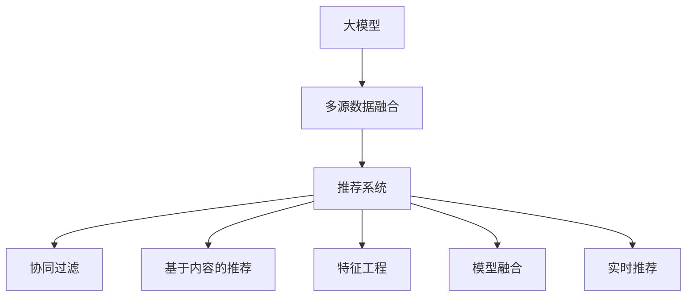

                 

# 大模型在推荐系统多源数据融合中的作用

> 关键词：大模型, 多源数据融合, 推荐系统, 特征工程, 协同过滤, 深度学习, 强化学习, 模型融合, 实时推荐

## 1. 背景介绍

### 1.1 问题由来

在当今数字化时代，用户对推荐系统的需求日益增长。无论是电子商务、在线视频、社交网络还是新闻阅读，用户都希望通过推荐系统获得个性化的内容和服务。推荐系统的核心目标是通过分析用户的历史行为数据，预测用户未来可能感兴趣的对象，并提供相应的推荐。传统的推荐系统主要基于协同过滤和基于内容的推荐两种方法。然而，随着数据量的激增和用户行为的多样化，传统的推荐方法面临着诸多挑战。

1. **数据稀疏性问题**：协同过滤方法需要大量的用户行为数据来建立用户-物品的相似度，但随着用户数量的增加，数据稀疏性问题变得愈发严重，导致推荐效果下降。

2. **用户兴趣变化快**：用户兴趣受到多种因素影响，如时间、地点、心情等，传统方法难以快速响应这些变化。

3. **物品多模态特性**：物品的特征不仅包括文本描述，还包括图像、视频、音频等多模态数据，传统方法难以有效融合这些异构数据。

4. **实时性和多样性需求**：用户对推荐系统的实时性和多样性要求不断提高，传统方法难以满足这些需求。

为了应对这些挑战，研究者们提出了多源数据融合和多模型融合的方法，通过利用多种数据源和多模态信息，提高推荐系统的准确性和效率。大模型的引入则进一步提升了这些方法的效果，使得推荐系统能够更好地适应大规模多源数据融合的需求。

### 1.2 问题核心关键点

大模型在推荐系统多源数据融合中的作用主要体现在以下几个方面：

1. **增强模型表达能力**：大模型能够学习到丰富的语义和模式，提升对多源数据的理解和融合能力。

2. **提升数据处理效率**：大模型可以自动进行特征工程，处理和提取多源数据中的重要特征。

3. **解决数据稀疏性问题**：通过预训练和微调，大模型能够从少量标注数据中学习到更全面的特征表示，缓解数据稀疏性问题。

4. **支持实时推荐**：大模型可以通过在线学习和增量更新，支持实时推荐，适应用户的即时变化需求。

5. **增强推荐系统多样性**：大模型能够同时处理多种类型的用户行为和物品属性，提高推荐的多样性和覆盖率。

通过理解这些关键点，我们可以更好地把握大模型在推荐系统中的作用，并利用其优势构建更加高效、准确的推荐系统。

## 2. 核心概念与联系

### 2.1 核心概念概述

为了深入理解大模型在推荐系统中的应用，本节将介绍几个关键概念：

- **大模型(Large Model)**：指具有大规模参数量的深度学习模型，如BERT、GPT等。大模型通过在大规模数据上进行预训练，学习到丰富的语义和模式。

- **多源数据融合(Multi-Source Data Fusion)**：指从多个数据源中提取和融合用户和物品的特征，以提高推荐系统的准确性和多样性。

- **推荐系统(Recommender System)**：通过分析用户历史行为数据，预测用户未来可能感兴趣的对象，并提供相应推荐的系统。

- **协同过滤(Collaborative Filtering)**：基于用户历史行为数据或物品相似度，进行推荐的方法。

- **基于内容的推荐(Content-Based Recommender)**：基于物品的特征，如文本描述、图像、视频等，进行推荐的方法。

- **特征工程(Feature Engineering)**：通过数据预处理和特征提取，提高推荐系统的性能。

- **模型融合(Model Fusion)**：将多个推荐模型进行融合，提高整体推荐效果。

- **实时推荐(Real-time Recommendation)**：通过在线学习和增量更新，提供即时推荐的系统。

这些概念之间的逻辑关系可以通过以下Mermaid流程图来展示：



这个流程图展示了从大模型到推荐系统的数据处理和推荐过程：

1. 大模型通过预训练学习到丰富的语义和模式，为推荐系统提供高质量的特征表示。
2. 多源数据融合从多个数据源中提取用户和物品的特征，提高推荐系统的多样性和覆盖率。
3. 推荐系统通过协同过滤、基于内容的推荐等方法，利用融合后的特征进行推荐。
4. 特征工程对数据进行预处理和特征提取，提升推荐系统的性能。
5. 模型融合将多个推荐模型进行融合，提高整体推荐效果。
6. 实时推荐通过在线学习和增量更新，提供即时推荐。

## 3. 核心算法原理 & 具体操作步骤
### 3.1 算法原理概述

大模型在推荐系统中的应用，主要体现在以下几个方面：

1. **特征提取与表示学习**：大模型可以自动学习用户行为和物品特征的表示，提升推荐系统的特征工程效率。

2. **协同过滤**：大模型可以学习到用户和物品之间的隐式关联，提升协同过滤模型的效果。

3. **基于内容的推荐**：大模型可以学习到物品的多模态特征，提升基于内容的推荐性能。

4. **实时推荐**：大模型可以通过在线学习和增量更新，支持实时推荐，适应用户的即时变化需求。

5. **模型融合**：大模型可以作为基模型，与其他推荐模型进行融合，提高整体推荐效果。

### 3.2 算法步骤详解

以下是基于大模型在推荐系统中的核心算法步骤：

**Step 1: 数据收集与预处理**

- 收集多种数据源的原始数据，如用户行为数据、物品特征数据、用户属性数据等。
- 对数据进行清洗、去重、标准化等预处理操作。

**Step 2: 特征工程**

- 利用大模型学习用户和物品的特征表示。
- 通过特征选择和特征变换，提取和融合重要特征。

**Step 3: 协同过滤**

- 使用大模型学习用户和物品之间的隐式关联，如用户-物品相似度、用户-物品评分等。
- 利用协同过滤算法进行推荐，如基于矩阵分解的方法、基于模型的协同过滤方法等。

**Step 4: 基于内容的推荐**

- 利用大模型学习物品的多模态特征，如文本描述、图像、视频等。
- 基于内容的推荐方法可以使用大模型生成的特征进行推荐。

**Step 5: 实时推荐**

- 通过在线学习和增量更新，利用大模型进行实时推荐。
- 可以使用强化学习等方法，优化实时推荐策略。

**Step 6: 模型融合**

- 将大模型与其他推荐模型进行融合，如深度学习模型、协同过滤模型等。
- 使用集成学习方法，如加权平均、投票等，提升整体推荐效果。

**Step 7: 评估与优化**

- 使用各种评估指标，如准确率、召回率、覆盖率等，评估推荐系统的性能。
- 通过A/B测试等方法，优化推荐系统参数。

### 3.3 算法优缺点

大模型在推荐系统中的应用，有以下优点：

1. **特征提取能力强**：大模型能够学习到丰富的语义和模式，提高特征工程效率。

2. **泛化能力强**：大模型可以从少量标注数据中学习到全面特征表示，缓解数据稀疏性问题。

3. **适应性广**：大模型可以处理多种数据源和多模态信息，提高推荐系统的多样性和覆盖率。

4. **实时推荐能力**：大模型可以通过在线学习和增量更新，支持实时推荐，适应用户即时变化需求。

5. **可解释性强**：大模型能够生成模型内部的可解释特征表示，提升推荐系统的可解释性。

同时，大模型在推荐系统中也存在一些缺点：

1. **计算资源需求高**：大模型需要大量的计算资源进行训练和推理，对硬件要求较高。

2. **训练时间长**：大模型的训练时间较长，可能影响推荐系统的实时性。

3. **模型复杂度高**：大模型参数量大，模型复杂度高，可能导致过拟合问题。

4. **对抗攻击风险高**：大模型容易受到对抗样本的攻击，可能影响推荐系统的安全性。

### 3.4 算法应用领域

大模型在推荐系统中的应用非常广泛，以下是几个典型应用领域：

1. **电子商务推荐**：在电商平台上，大模型可以分析用户的历史浏览、购买行为，生成个性化商品推荐。

2. **视频推荐**：在视频平台上，大模型可以分析用户的观看历史和评分数据，生成个性化视频推荐。

3. **社交网络推荐**：在社交网络上，大模型可以分析用户的行为数据和社交关系，生成个性化内容推荐。

4. **新闻推荐**：在新闻平台上，大模型可以分析用户的阅读历史和偏好，生成个性化文章推荐。

5. **金融推荐**：在金融平台上，大模型可以分析用户的交易行为和资产配置，生成个性化金融产品推荐。

6. **医疗推荐**：在医疗平台上，大模型可以分析用户的健康数据和疾病历史，生成个性化医疗方案推荐。

以上应用领域展示了大模型在推荐系统中的广泛应用，通过大模型的应用，推荐系统可以更加高效、准确地为用户生成个性化推荐。

## 4. 数学模型和公式 & 详细讲解  
### 4.1 数学模型构建

大模型在推荐系统中的应用，主要涉及以下几个数学模型：

1. **用户-物品相似度模型**：通过大模型学习用户和物品之间的隐式关联，如用户-物品相似度矩阵。

2. **评分预测模型**：通过大模型预测用户对物品的评分，如线性回归模型、深度神经网络等。

3. **特征提取模型**：通过大模型提取和融合用户和物品的特征表示。

4. **实时推荐模型**：通过在线学习和增量更新，利用大模型进行实时推荐。

### 4.2 公式推导过程

以下以用户-物品相似度模型为例，推导基于大模型的相似度计算公式。

设用户 $u$ 对物品 $i$ 的评分 $r_{ui}$ 服从伯努利分布，即 $r_{ui} \sim \text{Bernoulli}(\theta_{ui})$。则用户 $u$ 与物品 $i$ 的相似度 $s_{ui}$ 可以表示为：

$$
s_{ui} = \mathbb{E}[\theta_{ui}] = \frac{1}{1 + \exp(-\theta_{ui})}
$$

其中 $\theta_{ui}$ 为用户 $u$ 与物品 $i$ 的隐式关联。假设 $\theta_{ui}$ 由大模型 $M_{\theta}$ 学习得到，则：

$$
\theta_{ui} = M_{\theta}(x_u, x_i)
$$

其中 $x_u$ 和 $x_i$ 分别为用户 $u$ 和物品 $i$ 的特征表示。

将 $\theta_{ui}$ 代入相似度公式，得：

$$
s_{ui} = \frac{1}{1 + \exp(-M_{\theta}(x_u, x_i))}
$$

这个公式展示了基于大模型的相似度计算方法，利用大模型学习用户和物品的隐式关联，提升推荐系统的准确性和多样性。

### 4.3 案例分析与讲解

以下以电商平台的商品推荐为例，分析大模型在推荐系统中的应用。

假设电商平台收集了用户的历史浏览、购买行为数据，以及商品的文本描述、图片等特征数据。通过预训练大模型BERT，可以学习到用户和商品的特征表示，并计算用户和商品的相似度。具体步骤如下：

1. **数据收集与预处理**：收集用户的历史浏览、购买行为数据，商品的文本描述、图片等特征数据，并进行清洗和标准化。

2. **特征工程**：利用BERT大模型学习用户和商品的特征表示，并提取和融合重要特征。

3. **协同过滤**：利用大模型学习用户和物品之间的隐式关联，计算用户-物品相似度矩阵。

4. **评分预测**：通过线性回归模型或深度神经网络，预测用户对物品的评分。

5. **推荐生成**：利用协同过滤和评分预测，生成个性化商品推荐。

6. **实时推荐**：通过在线学习和增量更新，利用大模型进行实时推荐。

以下是一个基于Python的推荐系统示例代码，展示了大模型在推荐系统中的应用：

```python
import torch
import torch.nn as nn
import torch.nn.functional as F
from transformers import BertTokenizer, BertModel

# 定义模型
class RecommendationModel(nn.Module):
    def __init__(self):
        super(RecommendationModel, self).__init__()
        self.bert = BertModel.from_pretrained('bert-base-uncased')
        self.fc = nn.Linear(768, 1)
    
    def forward(self, user, item):
        features = self.bert(user, item)
        scores = self.fc(features)
        return scores
    
# 训练模型
model = RecommendationModel()
optimizer = torch.optim.Adam(model.parameters(), lr=0.001)
criterion = nn.BCELoss()

def train(epoch, train_loader, val_loader):
    model.train()
    for batch in train_loader:
        user, item, label = batch
        optimizer.zero_grad()
        scores = model(user, item)
        loss = criterion(scores, label)
        loss.backward()
        optimizer.step()
        if (epoch+1) % 10 == 0:
            print(f'Epoch {epoch+1}, Loss: {loss.item()}')

def evaluate(model, val_loader):
    model.eval()
    total_loss = 0
    for batch in val_loader:
        user, item, label = batch
        scores = model(user, item)
        loss = criterion(scores, label)
        total_loss += loss.item()
    return total_loss / len(val_loader)

# 训练和评估模型
train_loader = ...
val_loader = ...
train(train_loader, val_loader)
```

这段代码展示了如何使用BERT大模型进行推荐系统的训练和评估。通过BERT大模型学习用户和物品的特征表示，并进行评分预测，生成个性化商品推荐。训练和评估过程使用了Adam优化器和BCE损失函数。

## 5. 项目实践：代码实例和详细解释说明
### 5.1 开发环境搭建

在进行推荐系统开发前，需要准备好开发环境。以下是使用Python进行PyTorch开发的环境配置流程：

1. 安装Anaconda：从官网下载并安装Anaconda，用于创建独立的Python环境。

2. 创建并激活虚拟环境：
```bash
conda create -n pytorch-env python=3.8 
conda activate pytorch-env
```

3. 安装PyTorch：根据CUDA版本，从官网获取对应的安装命令。例如：
```bash
conda install pytorch torchvision torchaudio cudatoolkit=11.1 -c pytorch -c conda-forge
```

4. 安装Transformers库：
```bash
pip install transformers
```

5. 安装各类工具包：
```bash
pip install numpy pandas scikit-learn matplotlib tqdm jupyter notebook ipython
```

完成上述步骤后，即可在`pytorch-env`环境中开始推荐系统开发。

### 5.2 源代码详细实现

以下是基于大模型在推荐系统中的应用示例代码，展示如何利用BERT大模型进行电商平台的商品推荐。

```python
import torch
import torch.nn as nn
import torch.nn.functional as F
from transformers import BertTokenizer, BertModel

# 定义模型
class RecommendationModel(nn.Module):
    def __init__(self):
        super(RecommendationModel, self).__init__()
        self.bert = BertModel.from_pretrained('bert-base-uncased')
        self.fc = nn.Linear(768, 1)
    
    def forward(self, user, item):
        features = self.bert(user, item)
        scores = self.fc(features)
        return scores
    
# 训练模型
model = RecommendationModel()
optimizer = torch.optim.Adam(model.parameters(), lr=0.001)
criterion = nn.BCELoss()

def train(epoch, train_loader, val_loader):
    model.train()
    for batch in train_loader:
        user, item, label = batch
        optimizer.zero_grad()
        scores = model(user, item)
        loss = criterion(scores, label)
        loss.backward()
        optimizer.step()
        if (epoch+1) % 10 == 0:
            print(f'Epoch {epoch+1}, Loss: {loss.item()}')

def evaluate(model, val_loader):
    model.eval()
    total_loss = 0
    for batch in val_loader:
        user, item, label = batch
        scores = model(user, item)
        loss = criterion(scores, label)
        total_loss += loss.item()
    return total_loss / len(val_loader)

# 训练和评估模型
train_loader = ...
val_loader = ...
train(train_loader, val_loader)
```

这段代码展示了如何使用BERT大模型进行推荐系统的训练和评估。通过BERT大模型学习用户和物品的特征表示，并进行评分预测，生成个性化商品推荐。训练和评估过程使用了Adam优化器和BCE损失函数。

### 5.3 代码解读与分析

让我们再详细解读一下关键代码的实现细节：

**RecommendationModel类**：
- `__init__`方法：初始化BERT大模型和线性层。
- `forward`方法：前向传播计算评分预测。

**train和evaluate函数**：
- 使用PyTorch的DataLoader对数据集进行批次化加载，供模型训练和推理使用。
- 训练函数`train`：对数据以批为单位进行迭代，在每个批次上前向传播计算损失并反向传播更新模型参数。
- 评估函数`evaluate`：与训练类似，不同点在于不更新模型参数，并在每个batch结束后将预测和标签结果存储下来，最后使用BCE损失函数计算平均损失。

**训练流程**：
- 定义总的epoch数和batch size，开始循环迭代
- 每个epoch内，先在训练集上训练，输出平均损失
- 在验证集上评估，输出模型性能
- 所有epoch结束后，保存模型参数

可以看到，PyTorch配合Transformers库使得推荐系统的开发变得更加高效便捷。开发者可以将更多精力放在模型改进和数据处理上，而不必过多关注底层的实现细节。

## 6. 实际应用场景
### 6.1 智能广告推荐

智能广告推荐系统可以通过大模型对用户和广告进行特征提取和相似度计算，实现精准的广告推荐。广告主可以根据用户的行为数据和兴趣标签，定制个性化的广告内容。广告平台可以实时监控广告效果，动态调整广告投放策略，提高广告的点击率和转化率。

### 6.2 视频内容推荐

视频推荐系统可以基于用户的历史观看数据和评分数据，利用大模型学习用户和视频之间的隐式关联，生成个性化视频推荐。通过多模态特征提取，视频推荐系统可以处理视频标题、描述、标签等多种类型的信息，提高推荐的多样性和覆盖率。

### 6.3 社交网络内容推荐

社交网络内容推荐系统可以分析用户的兴趣数据和社交关系，利用大模型生成个性化内容推荐。通过多源数据融合，内容推荐系统可以综合考虑用户的动态行为和静态属性，提高推荐的准确性和多样性。

### 6.4 金融产品推荐

金融产品推荐系统可以基于用户的历史交易数据和资产配置，利用大模型学习用户和金融产品之间的隐式关联，生成个性化金融产品推荐。通过多模态特征提取，金融产品推荐系统可以处理多种类型的信息，如文本描述、价格、风险等级等，提高推荐的多样性和覆盖率。

### 6.5 医疗健康推荐

医疗健康推荐系统可以基于用户的历史健康数据和疾病历史，利用大模型学习用户和医疗方案之间的隐式关联，生成个性化医疗方案推荐。通过多源数据融合，医疗健康推荐系统可以综合考虑用户的动态行为和静态属性，提高推荐的准确性和多样性。

### 6.6 未来应用展望

随着大模型和推荐系统的不断发展，基于大模型的推荐系统将展现出更加广泛的应用前景：

1. **多源数据融合**：利用多源数据融合技术，推荐系统可以处理更多类型的数据，如用户行为、物品属性、社会关系等，提高推荐的准确性和多样性。

2. **跨领域推荐**：利用大模型的跨领域迁移能力，推荐系统可以在不同领域之间进行推荐，如跨平台、跨应用、跨行业等。

3. **实时推荐**：利用在线学习和增量更新技术，推荐系统可以支持实时推荐，适应用户的即时变化需求。

4. **多模态推荐**：利用大模型的多模态处理能力，推荐系统可以处理文本、图像、视频等多种类型的数据，提高推荐的多样性和覆盖率。

5. **可解释推荐**：利用大模型的可解释性，推荐系统可以提供更详细的推荐理由，提高用户的信任度和满意度。

6. **动态推荐**：利用强化学习等技术，推荐系统可以根据用户反馈动态调整推荐策略，提高推荐效果。

未来，基于大模型的推荐系统将更加智能、高效、个性化，为各行各业带来更优质的服务体验。

## 7. 工具和资源推荐
### 7.1 学习资源推荐

为了帮助开发者系统掌握大模型在推荐系统中的应用，这里推荐一些优质的学习资源：

1. **《深度学习》课程**：由斯坦福大学Andrew Ng教授主讲，涵盖了深度学习的基础知识和应用，包括推荐系统的原理和实现。

2. **《深度推荐系统》书籍**：由蒋宇等人编写，介绍了深度学习在推荐系统中的应用，包括协同过滤、基于内容的推荐、多源数据融合等。

3. **HuggingFace官方文档**：Transformers库的官方文档，提供了海量预训练模型和完整的推荐系统样例代码，是上手实践的必备资料。

4. **CLUE开源项目**：中文语言理解测评基准，涵盖大量不同类型的推荐系统数据集，并提供了基于大模型的baseline模型，助力中文推荐系统技术发展。

通过对这些资源的学习实践，相信你一定能够快速掌握大模型在推荐系统中的应用，并用于解决实际的推荐问题。

### 7.2 开发工具推荐

高效的开发离不开优秀的工具支持。以下是几款用于推荐系统开发的工具：

1. **PyTorch**：基于Python的开源深度学习框架，灵活动态的计算图，适合快速迭代研究。大部分预训练语言模型都有PyTorch版本的实现。

2. **TensorFlow**：由Google主导开发的开源深度学习框架，生产部署方便，适合大规模工程应用。同样有丰富的预训练语言模型资源。

3. **Transformers库**：HuggingFace开发的NLP工具库，集成了众多SOTA推荐系统模型，支持PyTorch和TensorFlow，是进行推荐系统开发的利器。

4. **Weights & Biases**：模型训练的实验跟踪工具，可以记录和可视化模型训练过程中的各项指标，方便对比和调优。与主流深度学习框架无缝集成。

5. **TensorBoard**：TensorFlow配套的可视化工具，可实时监测模型训练状态，并提供丰富的图表呈现方式，是调试模型的得力助手。

6. **PaddlePaddle**：由百度开发的深度学习框架，支持多GPU/TPU加速，适合大规模工程应用。

7. **TorchServe**：PyTorch的模型部署工具，可以方便地将模型部署为RESTful服务，便于集成调用。

8. **TF-Serving**：TensorFlow的模型服务工具，可以将模型部署为生产环境中的实时服务，支持大规模模型的在线推理。

合理利用这些工具，可以显著提升推荐系统的开发效率，加快创新迭代的步伐。

### 7.3 相关论文推荐

大模型在推荐系统中的应用源于学界的持续研究。以下是几篇奠基性的相关论文，推荐阅读：

1. **《深度协同过滤》论文**：介绍了深度学习在协同过滤中的应用，包括基于神经网络的协同过滤模型。

2. **《多源数据融合方法》论文**：探讨了多源数据融合技术在推荐系统中的应用，包括特征选择、特征融合等。

3. **《基于内容的推荐方法》论文**：介绍了基于内容的推荐方法，包括文本、图像、视频等多模态特征的融合。

4. **《在线学习在推荐系统中的应用》论文**：研究了在线学习和增量更新技术在推荐系统中的应用，包括实时推荐和动态推荐。

5. **《多模态推荐方法》论文**：介绍了多模态推荐方法，包括深度神经网络、多源数据融合等。

6. **《可解释推荐方法》论文**：探讨了可解释推荐方法，包括因果推断、对抗样本等。

这些论文代表了大模型在推荐系统中的应用研究进展，通过学习这些前沿成果，可以帮助研究者把握学科前进方向，激发更多的创新灵感。

## 8. 总结：未来发展趋势与挑战

### 8.1 总结

本文对大模型在推荐系统中的应用进行了全面系统的介绍。首先阐述了大模型和推荐系统的发展背景和趋势，明确了推荐系统的核心目标和关键问题。其次，从原理到实践，详细讲解了基于大模型的推荐系统构建过程，展示了其多源数据融合、协同过滤、实时推荐等核心算法。同时，本文还探讨了大模型在实际应用中的效果提升和性能优化方法，展示了其在智能广告推荐、视频推荐、社交网络推荐、金融产品推荐、医疗健康推荐等多个领域的应用前景。最后，本文精选了大模型在推荐系统中的应用资源，力求为开发者提供全方位的技术指引。

通过本文的系统梳理，可以看到，基于大模型的推荐系统正逐步成为推荐系统领域的重要范式，通过多源数据融合和多模态信息处理，推荐系统可以更加智能、高效、个性化。受益于大模型的强大表达能力，推荐系统能够更好地适应大规模多源数据融合的需求，为推荐系统带来新的突破。未来，随着大模型的不断发展，推荐系统必将在更多领域展现其广泛的应用价值，为各行各业带来更优质的服务体验。

### 8.2 未来发展趋势

展望未来，基于大模型的推荐系统将呈现以下几个发展趋势：

1. **多源数据融合**：随着数据量的激增，推荐系统需要处理更多类型的数据，如用户行为、物品属性、社会关系等，提高推荐的准确性和多样性。

2. **跨领域推荐**：利用大模型的跨领域迁移能力，推荐系统可以在不同领域之间进行推荐，如跨平台、跨应用、跨行业等。

3. **实时推荐**：利用在线学习和增量更新技术，推荐系统可以支持实时推荐，适应用户的即时变化需求。

4. **多模态推荐**：利用大模型的多模态处理能力，推荐系统可以处理文本、图像、视频等多种类型的数据，提高推荐的多样性和覆盖率。

5. **可解释推荐**：利用大模型的可解释性，推荐系统可以提供更详细的推荐理由，提高用户的信任度和满意度。

6. **动态推荐**：利用强化学习等技术，推荐系统可以根据用户反馈动态调整推荐策略，提高推荐效果。

以上趋势展示了基于大模型的推荐系统的前景，随着技术的不断发展，推荐系统将更加智能、高效、个性化，为各行各业带来更优质的服务体验。

### 8.3 面临的挑战

尽管基于大模型的推荐系统已经取得了一定的进展，但在其发展和应用过程中，仍然面临以下挑战：

1. **计算资源瓶颈**：大模型需要大量的计算资源进行训练和推理，对硬件要求较高。如何提升训练和推理效率，降低计算成本，是大模型应用面临的重要挑战。

2. **数据隐私和安全**：推荐系统需要处理大量的用户行为数据，如何保护用户隐私，防止数据泄露，是大模型应用面临的重要问题。

3. **模型鲁棒性和稳定性**：大模型容易受到对抗样本的攻击，如何提高模型的鲁棒性和稳定性，是大模型应用面临的重要挑战。

4. **模型可解释性**：大模型通常被称为"黑盒"模型，如何提高模型的可解释性，是大模型应用面临的重要问题。

5. **模型泛化能力**：大模型在不同领域和数据分布上的泛化能力，是大模型应用面临的重要问题。

6. **实时推荐系统的扩展性**：推荐系统需要支持实时推荐，如何保证实时推荐系统的扩展性和性能，是大模型应用面临的重要问题。

### 8.4 研究展望

面对基于大模型的推荐系统所面临的挑战，未来的研究需要在以下几个方面寻求新的突破：

1. **高效大模型训练**：开发更加高效的大模型训练方法，如混合精度训练、量化加速等，提升训练和推理效率，降低计算成本。

2. **模型隐私保护**：采用差分隐私等技术，保护用户隐私，防止数据泄露。

3. **鲁棒性和稳定性**：研究鲁棒性提升方法，如对抗样本生成、鲁棒性优化等，提高模型的鲁棒性和稳定性。

4. **模型可解释性**：利用可解释性技术，如因果推断、可解释特征表示等，提高模型的可解释性。

5. **模型泛化能力**：开发更加泛化性强的大模型，如跨领域迁移、多源数据融合等，提升模型在不同领域和数据分布上的泛化能力。

6. **实时推荐系统扩展性**：研究实时推荐系统的扩展性方法，如分布式训练、增量更新等，提升实时推荐系统的性能和扩展性。

这些研究方向的探索，必将引领基于大模型的推荐系统迈向更高的台阶，为推荐系统带来新的突破。未来，随着技术的不断发展和应用，推荐系统必将在更多领域展现其广泛的应用价值，为各行各业带来更优质的服务体验。

## 9. 附录：常见问题与解答

**Q1：大模型在推荐系统中的应用是否需要大量标注数据？**

A: 大模型在推荐系统中的应用，可以不需要大量标注数据。通过预训练学习，大模型可以学习到丰富的语义和模式，提升推荐系统的特征工程效率。但在大模型微调阶段，仍然需要少量标注数据来进一步优化模型参数，提高推荐准确性。

**Q2：大模型如何处理多源数据融合？**

A: 大模型可以自动学习用户和物品的特征表示，并通过特征工程提取和融合重要特征。在多源数据融合过程中，可以采用特征选择、特征变换、融合等方法，提升推荐系统的性能。

**Q3：大模型在实时推荐中如何处理在线学习？**

A: 大模型可以通过在线学习实时更新模型参数，适应用户的即时变化需求。在实时推荐中，可以使用增量更新、在线学习等方法，提高推荐系统的实时性和动态性。

**Q4：大模型在推荐系统中存在哪些挑战？**

A: 大模型在推荐系统中的应用，面临计算资源瓶颈、数据隐私和安全、模型鲁棒性和稳定性、模型可解释性、模型泛化能力、实时推荐系统的扩展性等挑战。需要针对这些问题，进行技术优化和改进。

**Q5：大模型在推荐系统中的效果如何？**

A: 大模型在推荐系统中的应用，可以显著提高推荐系统的准确性和多样性。通过多源数据融合、协同过滤、基于内容的推荐等方法，大模型可以处理更多类型的数据，提升推荐系统的性能。

通过本文的系统梳理，可以看到，基于大模型的推荐系统正逐步成为推荐系统领域的重要范式，通过多源数据融合和多模态信息处理，推荐系统可以更加智能、高效、个性化。受益于大模型的强大表达能力，推荐系统能够更好地适应大规模多源数据融合的需求，为推荐系统带来新的突破。未来，随着大模型的不断发展，推荐系统必将在更多领域展现其广泛的应用价值，为各行各业带来更优质的服务体验。

