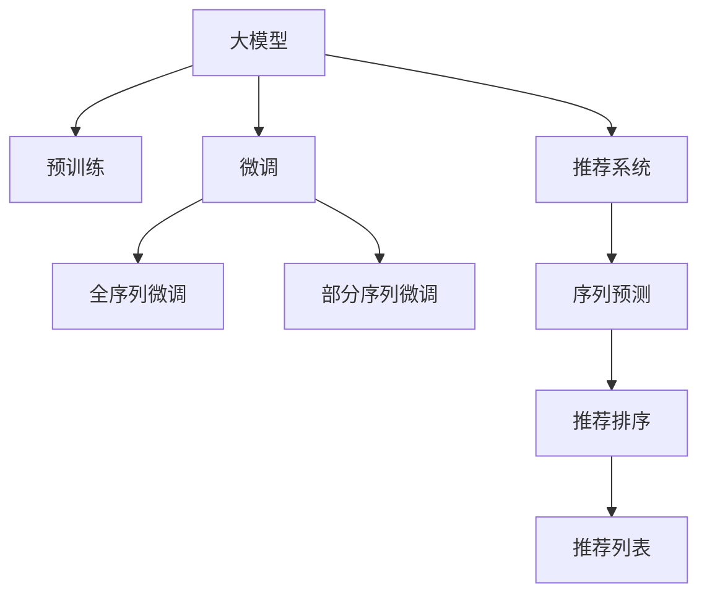

                 

## 1. 背景介绍

推荐系统（Recommendation System）在互联网时代大放异彩，服务于电商、社交、媒体、金融等多个领域，极大地提升了用户体验。然而，传统的协同过滤、基于内容的推荐方法，难以有效挖掘用户的深度兴趣和行为模式，无法实现精准推荐。

近年来，基于深度学习的推荐模型逐渐崭露头角。通过学习用户行为序列（如浏览历史、点击记录、评分数据等），这些模型能够从更高层次上理解用户的潜在需求，为用户提供个性化的推荐服务。这些模型通常以用户-物品评分矩阵为输入，预测每个用户对每个物品的评分，以推荐系统排序算法为输出，产生最终推荐列表。

大模型（Large Model）的崛起为推荐系统带来了新的机遇与挑战。以自回归Transformer为代表的大模型，凭借其强大的表征能力和泛化能力，能够有效捕捉用户序列数据中的模式，产生更为精准的推荐。然而，大模型往往以数十亿参数的庞大体积出现，难以在大规模数据集上直接应用。

本文聚焦于大模型在推荐系统序列模式挖掘中的应用，探索了如何通过序列微调（Sequential Fine-tuning），提升大模型对序列数据的处理能力，以及如何在大规模数据上高效利用大模型进行推荐系统建模。

## 2. 核心概念与联系

### 2.1 核心概念概述

为更好地理解序列微调技术，本节将介绍几个关键概念：

- **大模型（Large Model）**：指基于Transformer结构预训练的语言模型，如BERT、GPT等。这类模型通过大规模无标签数据进行预训练，学习到通用的语言表征，具备强大的自然语言处理能力。

- **推荐系统（Recommendation System）**：基于用户行为数据（如浏览历史、评分记录等），预测用户对物品的偏好，从而生成个性化推荐列表的系统。

- **序列微调（Sequential Fine-tuning）**：指在大模型预训练的基础上，进一步在小规模序列数据上进行有监督学习，优化模型对序列数据的处理能力，提高序列预测和推荐性能。

- **自回归Transformer（Autoregressive Transformer）**：一种常用的大模型结构，通过条件预测模型输入序列，实现自然语言理解和生成。例如，GPT、BERT等模型均采用自回归结构。

- **数据增强（Data Augmentation）**：指通过对原始数据进行扩充，提高训练数据的多样性，增强模型泛化能力。在推荐系统中，常见的数据增强方法包括序列回文、负样本生成等。

- **归一化（Normalization）**：指在处理序列数据时，对不同长度的序列进行归一化，以便于模型处理。

这些核心概念之间的逻辑关系可以通过以下Mermaid流程图来展示：



该流程图展示了大模型在推荐系统序列模式挖掘中的核心概念及其之间的关系：

1. 大模型通过预训练获得基础能力。
2. 微调通过序列数据进一步优化模型。
3. 推荐系统利用微调后的模型进行个性化推荐。
4. 序列预测和推荐排序算法输出推荐列表。

## 3. 核心算法原理 & 具体操作步骤
### 3.1 算法原理概述

序列微调技术基于大模型的自回归结构，通过在微调过程中引入序列数据，优化模型对序列的理解和预测能力。序列微调的主要思想是：将用户行为序列作为输入，通过有监督地训练，调整模型参数，使其能够准确预测序列的下一个元素。

形式化地，假设大模型为 $M_{\theta}$，用户行为序列为 $S=(s_1,s_2,\dots,s_t)$，序列预测模型为 $f_{\theta}(S)$，推荐排序算法为 $r_{\theta}(S)$，则序列微调的目标为：

$$
\min_{\theta} \sum_{i=1}^{t} \ell(f_{\theta}(S[i:]), s_{i+1})
$$

其中，$\ell$ 为预测误差损失函数，$f_{\theta}(S[i:])$ 表示模型对序列 $S[i:]$ 的预测，$s_{i+1}$ 为真实下一个元素。

微调过程中的损失函数一般采用交叉熵损失、均方误差损失等，结合序列预测和推荐排序的输出结果，构成最终的序列微调损失函数。

### 3.2 算法步骤详解

基于序列微调的大模型推荐系统建模，通常包括以下关键步骤：

**Step 1: 准备预训练模型和序列数据**
- 选择合适的预训练语言模型 $M_{\theta}$，如BERT、GPT等。
- 收集用户行为序列数据，包含用户的浏览历史、点击记录、评分记录等。

**Step 2: 添加任务适配层**
- 根据任务需求，设计序列预测和推荐排序的适配层。例如，对于商品推荐，可以将点击序列映射到用户偏好概率分布上。
- 定义损失函数，通常采用交叉熵损失、均方误差损失等。

**Step 3: 设置微调超参数**
- 选择合适的优化算法及其参数，如 AdamW、SGD 等，设置学习率、批大小、迭代轮数等。
- 设置正则化技术及强度，包括权重衰减、Dropout、Early Stopping 等。
- 确定冻结预训练参数的策略，如仅微调顶层，或全部参数都参与微调。

**Step 4: 执行梯度训练**
- 将用户行为序列数据分批次输入模型，前向传播计算预测值。
- 反向传播计算参数梯度，根据设定的优化算法和学习率更新模型参数。
- 周期性在验证集上评估模型性能，根据性能指标决定是否触发 Early Stopping。
- 重复上述步骤直到满足预设的迭代轮数或 Early Stopping 条件。

**Step 5: 测试和部署**
- 在测试集上评估微调后模型 $M_{\hat{\theta}}$ 的序列预测和推荐排序性能，对比微调前后的精度提升。
- 使用微调后的模型对新样本进行推理预测，集成到实际的应用系统中。
- 持续收集新的数据，定期重新微调模型，以适应数据分布的变化。

以上是序列微调技术在大模型推荐系统中的应用流程。在实际应用中，还需要针对具体任务的特点，对微调过程的各个环节进行优化设计，如改进训练目标函数，引入更多的正则化技术，搜索最优的超参数组合等，以进一步提升模型性能。

### 3.3 算法优缺点

序列微调技术在大模型推荐系统中具有以下优点：
1. 通用适用。适用于各种推荐系统序列预测和推荐排序任务，只需要调整适配层即可实现微调。
2. 性能提升。通过序列微调，可以显著提升模型对用户序列数据的理解能力，提高推荐精度。
3. 参数高效。利用部分序列微调技术，在固定大部分预训练参数的情况下，仍可取得不错的微调效果。
4. 模型可解释性。部分序列微调技术使得模型对序列的预测更加透明，便于理解和调试。

同时，该方法也存在一定的局限性：
1. 依赖序列数据。微调的效果很大程度上取决于序列数据的数量和质量，获取高质量序列数据的成本较高。
2. 序列模式泛化能力有限。当序列模式与预训练数据的分布差异较大时，序列微调的性能提升有限。
3. 可解释性不足。部分序列微调技术仍难以完全解释模型在序列预测中的内部工作机制。
4. 过拟合风险。序列微调模型在过长的序列数据上可能出现过拟合，影响泛化性能。

尽管存在这些局限性，但就目前而言，序列微调技术仍是大模型推荐系统应用的重要手段。未来相关研究的重点在于如何进一步降低微调对序列数据的依赖，提高模型的少样本学习和跨领域迁移能力，同时兼顾可解释性和伦理安全性等因素。

### 3.4 算法应用领域

序列微调技术在大模型推荐系统中已经得到了广泛的应用，覆盖了几乎所有常见的推荐系统序列预测和推荐排序任务，例如：

- 用户点击序列预测：如电商网站推荐商品。将用户点击历史作为输入，通过序列微调，预测下一个点击元素。
- 用户行为序列生成：如社交媒体内容推荐。将用户历史浏览、点赞、评论等行为序列作为输入，通过序列微调，生成可能感兴趣的内容。
- 商品评分序列预测：如电商网站推荐评分。将用户评分历史作为输入，通过序列微调，预测下一个评分元素。
- 多序列协同推荐：如电商平台商品推荐。将用户点击、评分、搜索等序列数据作为输入，通过序列微调，生成多种类型的推荐列表。
- 序列异常检测：如金融风险预警。将用户交易行为序列作为输入，通过序列微调，检测异常交易模式。

除了上述这些经典任务外，序列微调技术还被创新性地应用到更多场景中，如商品归档、广告投放、知识图谱推荐等，为推荐系统带来了全新的突破。随着预训练模型和微调方法的不断进步，相信推荐系统技术将在更广阔的应用领域大放异彩。

## 4. 数学模型和公式 & 详细讲解  
### 4.1 数学模型构建

本节将使用数学语言对基于序列微调的大模型推荐系统进行更加严格的刻画。

记预训练语言模型为 $M_{\theta}:\mathcal{X} \rightarrow \mathcal{Y}$，其中 $\mathcal{X}$ 为用户行为序列，$\mathcal{Y}$ 为推荐结果。假设序列微调任务的训练集为 $D=\{(S_i, y_i)\}_{i=1}^N, S_i=(s_{i1}, s_{i2}, \dots, s_{it}), y_i \in \{0,1\}$，其中 $S_i$ 为用户的 $t$ 次行为序列，$y_i$ 为是否产生推荐点击或评分。

定义模型 $M_{\theta}$ 在输入 $S$ 上的预测结果为 $f_{\theta}(S)=(p_1, p_2, \dots, p_t)$，其中 $p_i$ 为 $s_{i+1}$ 被推荐点击或评分的概率。推荐排序算法的输出结果为 $r_{\theta}(S) \in [0,1]$，表示 $S$ 的整体推荐概率。

序列微调的目标是最小化预测误差，即：

$$
\min_{\theta} \sum_{i=1}^{t} \ell(f_{\theta}(S[i:]), y_{i+1})
$$

其中，$\ell$ 为预测误差损失函数，如交叉熵损失。

### 4.2 公式推导过程

以下我们以电商网站商品推荐为例，推导序列微调的目标函数及其梯度计算。

假设模型 $M_{\theta}$ 在输入 $S$ 上的预测结果为 $f_{\theta}(S)=(p_1, p_2, \dots, p_t)$，推荐排序算法的输出结果为 $r_{\theta}(S)$。则目标函数为：

$$
\mathcal{L}(\theta) = -\frac{1}{N} \sum_{i=1}^{N} \left[ \sum_{j=1}^{t} y_{i,j} \log p_{i,j} + (1-y_{i,j}) \log (1-p_{i,j}) + \lambda r_{\theta}(S_i) \right]
$$

其中，$y_{i,j}$ 为 $S_i$ 中第 $j$ 个元素是否点击，$\lambda$ 为正则化系数，$M_{\theta}(S_i)$ 表示模型的输出概率。

根据链式法则，目标函数对参数 $\theta_k$ 的梯度为：

$$
\frac{\partial \mathcal{L}(\theta)}{\partial \theta_k} = -\frac{1}{N} \sum_{i=1}^{N} \left[ \sum_{j=1}^{t} \frac{y_{i,j}}{p_{i,j}} - \frac{1-y_{i,j}}{1-p_{i,j}} \right] \frac{\partial p_{i,j}}{\partial \theta_k} + \frac{\partial \lambda r_{\theta}(S_i)}{\partial \theta_k}
$$

其中，$\frac{\partial p_{i,j}}{\partial \theta_k}$ 可进一步递归展开，利用自动微分技术完成计算。

在得到目标函数的梯度后，即可带入参数更新公式，完成模型的迭代优化。重复上述过程直至收敛，最终得到适应推荐系统序列模式微调的最优模型参数 $\theta^*$。

## 5. 项目实践：代码实例和详细解释说明
### 5.1 开发环境搭建

在进行序列微调实践前，我们需要准备好开发环境。以下是使用Python进行PyTorch开发的环境配置流程：

1. 安装Anaconda：从官网下载并安装Anaconda，用于创建独立的Python环境。

2. 创建并激活虚拟环境：
```bash
conda create -n pytorch-env python=3.8 
conda activate pytorch-env
```

3. 安装PyTorch：根据CUDA版本，从官网获取对应的安装命令。例如：
```bash
conda install pytorch torchvision torchaudio cudatoolkit=11.1 -c pytorch -c conda-forge
```

4. 安装Transformers库：
```bash
pip install transformers
```

5. 安装各类工具包：
```bash
pip install numpy pandas scikit-learn matplotlib tqdm jupyter notebook ipython
```

完成上述步骤后，即可在`pytorch-env`环境中开始序列微调实践。

### 5.2 源代码详细实现

下面我们以电商网站商品推荐为例，给出使用Transformers库对GPT模型进行序列微调的PyTorch代码实现。

首先，定义推荐任务的数据处理函数：

```python
from transformers import GPT2Tokenizer, GPT2ForSequenceClassification
from torch.utils.data import Dataset
import torch

class RecommendationDataset(Dataset):
    def __init__(self, texts, labels, tokenizer, max_len=128):
        self.texts = texts
        self.labels = labels
        self.tokenizer = tokenizer
        self.max_len = max_len
        
    def __len__(self):
        return len(self.texts)
    
    def __getitem__(self, item):
        text = self.texts[item]
        label = self.labels[item]
        
        encoding = self.tokenizer(text, return_tensors='pt', max_length=self.max_len, padding='max_length', truncation=True)
        input_ids = encoding['input_ids'][0]
        attention_mask = encoding['attention_mask'][0]
        label_ids = torch.tensor(label, dtype=torch.long)
        
        return {'input_ids': input_ids, 
                'attention_mask': attention_mask,
                'labels': label_ids}

# 标签与id的映射
label2id = {'click': 0, 'no_click': 1}

# 创建dataset
tokenizer = GPT2Tokenizer.from_pretrained('gpt2')

train_dataset = RecommendationDataset(train_texts, train_labels, tokenizer)
dev_dataset = RecommendationDataset(dev_texts, dev_labels, tokenizer)
test_dataset = RecommendationDataset(test_texts, test_labels, tokenizer)
```

然后，定义模型和优化器：

```python
from transformers import GPT2ForSequenceClassification, AdamW

model = GPT2ForSequenceClassification.from_pretrained('gpt2', num_labels=2)

optimizer = AdamW(model.parameters(), lr=2e-5)
```

接着，定义训练和评估函数：

```python
from torch.utils.data import DataLoader
from tqdm import tqdm
from sklearn.metrics import classification_report

device = torch.device('cuda') if torch.cuda.is_available() else torch.device('cpu')
model.to(device)

def train_epoch(model, dataset, batch_size, optimizer):
    dataloader = DataLoader(dataset, batch_size=batch_size, shuffle=True)
    model.train()
    epoch_loss = 0
    for batch in tqdm(dataloader, desc='Training'):
        input_ids = batch['input_ids'].to(device)
        attention_mask = batch['attention_mask'].to(device)
        labels = batch['labels'].to(device)
        model.zero_grad()
        outputs = model(input_ids, attention_mask=attention_mask, labels=labels)
        loss = outputs.loss
        epoch_loss += loss.item()
        loss.backward()
        optimizer.step()
    return epoch_loss / len(dataloader)

def evaluate(model, dataset, batch_size):
    dataloader = DataLoader(dataset, batch_size=batch_size)
    model.eval()
    preds, labels = [], []
    with torch.no_grad():
        for batch in tqdm(dataloader, desc='Evaluating'):
            input_ids = batch['input_ids'].to(device)
            attention_mask = batch['attention_mask'].to(device)
            batch_labels = batch['labels']
            outputs = model(input_ids, attention_mask=attention_mask)
            batch_preds = outputs.logits.argmax(dim=2).to('cpu').tolist()
            batch_labels = batch_labels.to('cpu').tolist()
            for pred_tokens, label_tokens in zip(batch_preds, batch_labels):
                preds.append(pred_tokens)
                labels.append(label_tokens)
                
    print(classification_report(labels, preds))
```

最后，启动训练流程并在测试集上评估：

```python
epochs = 5
batch_size = 16

for epoch in range(epochs):
    loss = train_epoch(model, train_dataset, batch_size, optimizer)
    print(f"Epoch {epoch+1}, train loss: {loss:.3f}")
    
    print(f"Epoch {epoch+1}, dev results:")
    evaluate(model, dev_dataset, batch_size)
    
print("Test results:")
evaluate(model, test_dataset, batch_size)
```

以上就是使用PyTorch对GPT进行电商网站商品推荐任务序列微调的完整代码实现。可以看到，得益于Transformers库的强大封装，我们可以用相对简洁的代码完成GPT模型的加载和序列微调。

### 5.3 代码解读与分析

让我们再详细解读一下关键代码的实现细节：

**RecommendationDataset类**：
- `__init__`方法：初始化文本、标签、分词器等关键组件。
- `__len__`方法：返回数据集的样本数量。
- `__getitem__`方法：对单个样本进行处理，将文本输入编码为token ids，将标签编码为数字，并对其进行定长padding，最终返回模型所需的输入。

**label2id字典**：
- 定义了标签与数字id之间的映射关系，用于将标签转换成模型可以接受的格式。

**训练和评估函数**：
- 使用PyTorch的DataLoader对数据集进行批次化加载，供模型训练和推理使用。
- 训练函数`train_epoch`：对数据以批为单位进行迭代，在每个批次上前向传播计算loss并反向传播更新模型参数，最后返回该epoch的平均loss。
- 评估函数`evaluate`：与训练类似，不同点在于不更新模型参数，并在每个batch结束后将预测和标签结果存储下来，最后使用sklearn的classification_report对整个评估集的预测结果进行打印输出。

**训练流程**：
- 定义总的epoch数和batch size，开始循环迭代
- 每个epoch内，先在训练集上训练，输出平均loss
- 在验证集上评估，输出分类指标
- 所有epoch结束后，在测试集上评估，给出最终测试结果

可以看到，PyTorch配合Transformers库使得GPT微调的代码实现变得简洁高效。开发者可以将更多精力放在数据处理、模型改进等高层逻辑上，而不必过多关注底层的实现细节。

当然，工业级的系统实现还需考虑更多因素，如模型的保存和部署、超参数的自动搜索、更灵活的任务适配层等。但核心的序列微调范式基本与此类似。

## 6. 实际应用场景
### 6.1 智能推荐系统

序列微调技术在大模型推荐系统中，尤其是在智能推荐系统中的应用，取得了显著成效。传统的推荐系统往往只依赖用户的评分数据，难以深入理解用户的深度兴趣和行为模式。序列微调技术通过学习用户行为序列，能够从更高层次上把握用户需求，产生更精准的推荐。

在技术实现上，可以收集用户浏览、点击、评分等行为数据，将其作为输入序列，通过微调优化推荐模型。微调后的模型能够更好地捕捉用户兴趣的动态变化，产生更加个性化、多样化的推荐内容。智能推荐系统已经广泛应用于电商、视频、社交网络等众多领域，显著提升了用户体验和平台活跃度。

### 6.2 金融风险预警

金融行业对风险预警的及时性和准确性有着极高的要求。传统的规则引擎、人工审核方式成本高、效率低，难以应对网络时代海量交易数据的挑战。序列微调技术为金融风险预警提供了新的解决方案。

具体而言，可以收集用户的交易行为序列数据，并对其进行序列微调，生成用户风险评分。当用户风险评分达到预设阈值时，系统自动触发预警，及时采取防范措施，降低金融风险。序列微调技术使得金融风险预警更加精准高效，提高了金融机构的竞争力。

### 6.3 医疗健康服务

医疗行业数据复杂，难以直接用于机器学习建模。序列微调技术通过学习用户的健康记录、医疗咨询等行为序列，能够产生个性化的健康推荐和治疗建议。例如，智能诊疗系统可以根据用户的健康记录，推荐适合的检查项目、药品和治疗方案。序列微调技术使得医疗服务更加个性化、智能化，提高了医疗服务的质量和效率。

### 6.4 未来应用展望

随着序列微调技术的不断发展，其在推荐系统中的应用前景广阔，未来可能进一步拓展到更多领域：

1. **智能客服系统**：通过学习用户与客服的对话序列，生成推荐回复，提升客服系统的智能化水平。

2. **教育平台**：根据学生的学习行为序列，生成个性化学习路径和推荐资源，提升教育效果和效率。

3. **智能家居系统**：通过学习用户的生活习惯和设备使用序列，生成智能推荐，提升家居系统的智能化程度。

4. **智慧城市管理**：学习用户的城市使用行为序列，生成智能推荐，提升城市管理的智能化水平。

5. **社交网络分析**：通过学习用户与社交网络的互动序列，生成推荐好友和内容，提升社交网络的活跃度和用户粘性。

6. **金融交易预测**：学习用户的交易行为序列，预测交易结果，辅助金融交易决策。

7. **物联网设备管理**：学习用户与物联网设备的互动序列，生成智能推荐，提升设备的使用效率和服务质量。

## 7. 工具和资源推荐
### 7.1 学习资源推荐

为了帮助开发者系统掌握序列微调的理论基础和实践技巧，这里推荐一些优质的学习资源：

1. **《Transformers from the Inside Out》**：这本书系统地介绍了Transformer结构和自回归Transformer的工作原理，适合初学者入门。

2. **《Deep Learning for NLP》**：斯坦福大学开设的NLP深度学习课程，讲解了深度学习在NLP中的应用，包括序列微调技术。

3. **《Sequence to Sequence Learning with Neural Networks》**：Ian Goodfellow的论文，详细介绍了序列模型在机器翻译等任务中的应用。

4. **《Reinforcement Learning for Sequence Models》**：Ian Goodfellow的论文，介绍了强化学习在序列模型中的应用，例如序列微调。

5. **HuggingFace官方文档**：Transformers库的官方文档，提供了海量预训练模型和完整的序列微调样例代码，是上手实践的必备资料。

通过对这些资源的学习实践，相信你一定能够快速掌握序列微调的精髓，并用于解决实际的NLP问题。

### 7.2 开发工具推荐

高效的开发离不开优秀的工具支持。以下是几款用于序列微调开发的常用工具：

1. **PyTorch**：基于Python的开源深度学习框架，灵活动态的计算图，适合快速迭代研究。大部分预训练语言模型都有PyTorch版本的实现。

2. **TensorFlow**：由Google主导开发的开源深度学习框架，生产部署方便，适合大规模工程应用。同样有丰富的预训练语言模型资源。

3. **Transformers库**：HuggingFace开发的NLP工具库，集成了众多SOTA语言模型，支持PyTorch和TensorFlow，是进行序列微调任务开发的利器。

4. **Weights & Biases**：模型训练的实验跟踪工具，可以记录和可视化模型训练过程中的各项指标，方便对比和调优。与主流深度学习框架无缝集成。

5. **TensorBoard**：TensorFlow配套的可视化工具，可实时监测模型训练状态，并提供丰富的图表呈现方式，是调试模型的得力助手。

6. **Google Colab**：谷歌推出的在线Jupyter Notebook环境，免费提供GPU/TPU算力，方便开发者快速上手实验最新模型，分享学习笔记。

合理利用这些工具，可以显著提升序列微调任务的开发效率，加快创新迭代的步伐。

### 7.3 相关论文推荐

序列微调技术在大模型推荐系统中已经得到了广泛的应用，研究者们也在不断探索新的方向。以下是几篇奠基性的相关论文，推荐阅读：

1. **Attention is All You Need**：提出了Transformer结构，开启了NLP领域的预训练大模型时代。

2. **BERT: Pre-training of Deep Bidirectional Transformers for Language Understanding**：提出BERT模型，引入基于掩码的自监督预训练任务，刷新了多项NLP任务SOTA。

3. **GPT-2**：展示了大规模语言模型的强大zero-shot学习能力，引发了对于通用人工智能的新一轮思考。

4. **Self-Attentive Sentence Encoder**：提出SASE模型，进一步提升了序列微调的效果。

5. **Evaluating and Enhancing the Nearest Neighbor Sentence Encoder**：提出EEN模型，通过改进自回归Transformer，提升了序列微调的性能。

6. **Attentive Multi-Text Classification for Recommender Systems**：提出AMC模型，通过引入多文本注意力机制，提升了推荐系统的性能。

这些论文代表了大模型序列微调技术的发展脉络。通过学习这些前沿成果，可以帮助研究者把握学科前进方向，激发更多的创新灵感。

## 8. 总结：未来发展趋势与挑战

### 8.1 总结

本文对基于序列微调的大模型推荐系统进行了全面系统的介绍。首先阐述了序列微调技术的研究背景和意义，明确了序列微调在提升推荐系统性能、拓展推荐系统应用场景方面的独特价值。其次，从原理到实践，详细讲解了序列微调的数学原理和关键步骤，给出了序列微调任务开发的完整代码实例。同时，本文还广泛探讨了序列微调技术在智能推荐系统、金融风险预警、医疗健康服务等多个行业领域的应用前景，展示了序列微调技术的巨大潜力。此外，本文精选了序列微调技术的各类学习资源，力求为读者提供全方位的技术指引。

通过本文的系统梳理，可以看到，序列微调技术在大模型推荐系统中扮演了至关重要的角色，极大地拓展了推荐系统的应用边界，催生了更多的落地场景。得益于大规模语料的预训练，序列微调模型在序列预测和推荐排序任务上取得了显著的性能提升，显著提高了用户满意度和平台活跃度。未来，伴随预训练语言模型和微调方法的持续演进，相信推荐系统技术将在更广阔的应用领域大放异彩，深刻影响人类的生产生活方式。

### 8.2 未来发展趋势

展望未来，序列微调技术在大模型推荐系统中将呈现以下几个发展趋势：

1. **模型规模持续增大**：随着算力成本的下降和数据规模的扩张，预训练语言模型的参数量还将持续增长。超大规模语言模型蕴含的丰富语言知识，有望支撑更加复杂多变的推荐系统序列预测和推荐排序。

2. **微调方法日趋多样**：除了传统的全序列微调外，未来会涌现更多参数高效的微调方法，如部分序列微调、Adapter等，在节省计算资源的同时也能保证微调精度。

3. **序列模式泛化能力增强**：未来的微调技术将更注重跨领域泛化能力的提升，使模型能够更好地处理不同领域和不同长度的序列数据。

4. **序列异常检测和生成**：未来的微调技术将更好地处理序列中的异常模式，如缺失值、噪声等，同时能够生成更加丰富多样的序列数据，用于训练和测试模型。

5. **多模态序列微调**：未来的微调技术将更多地融合多模态信息，如文本、图像、语音等，提升推荐系统的智能程度和应用范围。

6. **联合训练和迁移学习**：未来的微调技术将结合联合训练和迁移学习的思想，优化模型在多个任务上的性能，提升推荐系统的泛化能力和鲁棒性。

7. **推荐系统性能评估**：未来的微调技术将更加注重推荐系统的性能评估，引入更多的评估指标和评估方法，提升推荐系统的用户满意度。

以上趋势凸显了大模型序列微调技术的广阔前景。这些方向的探索发展，必将进一步提升推荐系统的性能和应用范围，为人类认知智能的进化带来深远影响。

### 8.3 面临的挑战

尽管序列微调技术已经取得了瞩目成就，但在迈向更加智能化、普适化应用的过程中，它仍面临着诸多挑战：

1. **依赖序列数据**：微调的效果很大程度上取决于序列数据的数量和质量，获取高质量序列数据的成本较高。如何进一步降低微调对序列数据的依赖，将是一大难题。

2. **序列模式泛化能力有限**：当序列模式与预训练数据的分布差异较大时，序列微调的性能提升有限。对于测试样本的微小扰动，微调模型的预测也容易发生波动。如何提高微调模型的鲁棒性，避免灾难性遗忘，还需要更多理论和实践的积累。

3. **序列预测可解释性不足**：部分序列微调技术仍难以完全解释模型在序列预测中的内部工作机制。如何赋予微调模型更强的可解释性，将是亟待攻克的难题。

4. **序列微调模型在长序列上的性能**：序列微调模型在过长的序列数据上可能出现过拟合，影响泛化性能。如何提高模型在长序列上的性能，是未来的研究方向。

5. **模型计算资源消耗**：大规模语言模型虽然精度高，但在实际部署时往往面临推理速度慢、内存占用大等效率问题。如何在保证性能的同时，简化模型结构，提升推理速度，优化资源占用，将是重要的优化方向。

6. **序列微调模型的公平性**：预训练语言模型可能包含有偏见的信息，通过微调传递到推荐系统中，产生歧视性的推荐结果。如何构建公平性更好的序列微调模型，将是重要的研究方向。

正视序列微调面临的这些挑战，积极应对并寻求突破，将是大模型序列微调走向成熟的必由之路。相信随着学界和产业界的共同努力，这些挑战终将一一被克服，序列微调技术必将在构建安全、可靠、可解释、可控的智能推荐系统中扮演越来越重要的角色。

### 8.4 未来突破

面对大模型序列微调所面临的种种挑战，未来的研究需要在以下几个方面寻求新的突破：

1. **探索无监督和半监督序列微调方法**：摆脱对大规模序列数据的依赖，利用自监督学习、主动学习等无监督和半监督范式，最大限度利用非结构化数据，实现更加灵活高效的序列微调。

2. **研究参数高效和计算高效的序列微调范式**：开发更加参数高效的序列微调方法，在固定大部分预训练参数的情况下，只更新极少量的任务相关参数。同时优化序列微调模型的计算图，减少前向传播和反向传播的资源消耗，实现更加轻量级、实时性的部署。

3. **融合因果和对比学习范式**：通过引入因果推断和对比学习思想，增强序列微调模型建立稳定因果关系的能力，学习更加普适、鲁棒的语言表征，从而提升模型泛化性和抗干扰能力。

4. **引入更多先验知识**：将符号化的先验知识，如知识图谱、逻辑规则等，与神经网络模型进行巧妙融合，引导序列微调过程学习更准确、合理的语言模型。同时加强不同模态数据的整合，实现视觉、语音等多模态信息与文本信息的协同建模。

5. **结合因果分析和博弈论工具**：将因果分析方法引入序列微调模型，识别出模型决策的关键特征，增强输出解释的因果性和逻辑性。借助博弈论工具刻画人机交互过程，主动探索并规避模型的脆弱点，提高系统稳定性。

6. **纳入伦理道德约束**：在模型训练目标中引入伦理导向的评估指标，过滤和惩罚有偏见、有害的输出倾向。同时加强人工干预和审核，建立模型行为的监管机制，确保输出符合人类价值观和伦理道德。

这些研究方向的探索，必将引领序列微调技术迈向更高的台阶，为构建安全、可靠、可解释、可控的智能推荐系统铺平道路。面向未来，序列微调技术还需要与其他人工智能技术进行更深入的融合，如知识表示、因果推理、强化学习等，多路径协同发力，共同推动自然语言理解和智能交互系统的进步。只有勇于创新、敢于突破，才能不断拓展语言模型的边界，让智能技术更好地造福人类社会。

## 9. 附录：常见问题与解答

**Q1：序列微调是否适用于所有推荐系统任务？**

A: 序列微调在大多数推荐系统任务上都能取得不错的效果，特别是对于数据量较小的任务。但对于一些特定领域的任务，如医学、法律等，仅仅依靠通用语料预训练的模型可能难以很好地适应。此时需要在特定领域语料上进一步预训练，再进行微调，才能获得理想效果。此外，对于一些需要时效性、个性化很强的任务，如对话、推荐等，微调方法也需要针对性的改进优化。

**Q2：微调过程中如何选择合适的学习率？**

A: 微调的学习率一般要比预训练时小1-2个数量级，如果使用过大的学习率，容易破坏预训练权重，导致过拟合。一般建议从1e-5开始调参，逐步减小学习率，直至收敛。也可以使用warmup策略，在开始阶段使用较小的学习率，再逐渐过渡到预设值。需要注意的是，不同的优化器(如AdamW、Adafactor等)以及不同的学习率调度策略，可能需要设置不同的学习率阈值。

**Q3：采用大模型微调时会面临哪些资源瓶颈？**

A: 目前主流的预训练大模型动辄以亿计的参数规模，对算力、内存、存储都提出了很高的要求。GPU/TPU等高性能设备是必不可少的，但即便如此，超大批次的训练和推理也可能遇到显存不足的问题。因此需要采用一些资源优化技术，如梯度积累、混合精度训练、模型并行等，来突破硬件瓶颈。同时，模型的存储和读取也可能占用大量时间和空间，需要采用模型压缩、稀疏化存储等方法进行优化。

**Q4：如何缓解微调过程中的过拟合问题？**

A: 过拟合是微调面临的主要挑战，尤其是在标注数据不足的情况下。常见的缓解策略包括：

1. **数据增强**：通过回译、近义替换等方式扩充训练集。

2. **正则化**：使用L2正则、Dropout、Early Stopping等避免过拟合。

3. **对抗训练**：引入对抗样本，提高模型鲁棒性。

4. **部分序列微调**：只调整少量参数(如Adapter、Prefix等)，减小过拟合风险。

5. **多模型集成**：训练多个微调模型，取平均输出，抑制过拟合。

这些策略往往需要根据具体任务和数据特点进行灵活组合。只有在数据、模型、训练、推理等各环节进行全面优化，才能最大限度地发挥大模型微调的威力。

**Q5：微调模型在落地部署时需要注意哪些问题？**

A: 将微调模型转化为实际应用，还需要考虑以下因素：

1. **模型裁剪**：去除不必要的层和参数，减小模型尺寸，加快推理速度。

2. **量化加速**：将浮点模型转为定点模型，压缩存储空间，提高计算效率。

3. **服务化封装**：将模型封装为标准化服务接口，便于集成调用。

4. **弹性伸缩**：根据请求流量动态调整资源配置，平衡服务质量和成本。

5. **监控告警**：实时采集系统指标，设置异常告警阈值，确保服务稳定性。

6. **安全防护**：采用访问鉴权、数据脱敏等措施，保障数据和模型安全。

大模型微调为推荐系统带来了新的机遇与挑战，如何在确保性能的同时，提升服务效率和稳定性，是未来的重要研究方向。

---

作者：禅与计算机程序设计艺术 / Zen and the Art of Computer Programming

