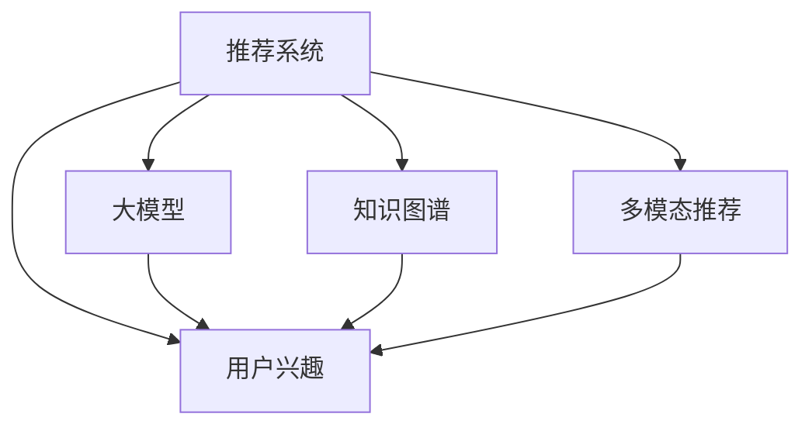

                 

# 大模型在推荐系统用户兴趣动态演化中的作用

> 关键词：大模型, 推荐系统, 用户兴趣, 动态演化, 深度学习, 知识图谱, 个性化推荐

## 1. 背景介绍

推荐系统在互联网时代扮演了重要角色，为亿万用户提供个性化的内容和服务。传统的推荐算法依赖于用户历史行为数据，通过协同过滤、基于内容的推荐等方法，为用户推荐符合其兴趣的物料。然而，用户兴趣是动态演化的，单一模型难以捕捉其中的复杂关系，导致推荐效果时好时坏。

为了解决这一问题，我们引入大模型，利用其强大的语义理解和表示能力，在用户历史行为数据之外，加入更多外部的知识信息，提升推荐系统的表现。本文将介绍大模型在推荐系统中的作用，以及如何利用大模型进行动态兴趣演化分析，提供更加个性化和精准的推荐服务。

## 2. 核心概念与联系

### 2.1 核心概念概述

为更好地理解大模型在推荐系统中的应用，本节将介绍几个关键概念：

- 推荐系统(Recommendation System)：通过算法模型为用户推荐符合其兴趣的物料，如商品、内容、广告等。
- 用户兴趣(User Interest)：指用户对于某种物料的倾向和偏好，是推荐系统个性化推荐的基础。
- 动态兴趣演化(Dynamic Interest Evolution)：指用户兴趣随时间变化，如热点兴趣的波动、兴趣爱好的转变等。
- 大模型(Large Model)：指具有数亿甚至数十亿参数的深度学习模型，能够进行复杂的语义理解和生成。
- 知识图谱(Knowledge Graph)：由节点和边组成的网络结构，用于存储和表示实体之间的关系。
- 多模态推荐(Multimodal Recommendation)：利用多种模态的信息进行推荐，如文本、图像、音频等。

这些概念之间的关系可以通过以下Mermaid流程图来展示：



该流程图展示了大模型在推荐系统中的作用：通过语义理解提升用户兴趣的表征，结合知识图谱和多种模态的信息，提供更加全面和精准的推荐服务。

## 3. 核心算法原理 & 具体操作步骤
### 3.1 算法原理概述

利用大模型进行推荐系统动态兴趣演化的核心思想是：通过大模型的语义表示能力，捕捉用户兴趣的动态变化，结合外部知识图谱等多模态信息，生成个性化推荐。

形式化地，假设用户 $u$ 在时间 $t$ 的兴趣表示为 $v_u(t)$，对应的物料表示为 $v_i(t)$。推荐系统的目标是为用户推荐与其兴趣匹配度最高的物料 $i$，即：

$$
\arg \max_{i} \text{sim}(v_u(t), v_i(t))
$$

其中 $\text{sim}$ 为相似度函数。在大模型中，用户和物料可以用向量表示，因此推荐过程可以转换为向量相似度计算。

通过大模型，我们可以自动学习到用户兴趣和物料的向量表示，并通过相似度函数匹配用户兴趣和物料的语义关系。同时，结合知识图谱等多模态信息，可以进一步提升推荐的准确性和多样性。

### 3.2 算法步骤详解

基于大模型的推荐系统动态兴趣演化，一般包括以下几个关键步骤：

**Step 1: 数据预处理与特征提取**
- 收集用户的历史行为数据，如浏览记录、评分记录、点击记录等。
- 对行为数据进行预处理和特征提取，如对文本数据进行分词、编码，对时间戳数据进行归一化。
- 将特征向量输入大模型，进行语义表示学习。

**Step 2: 知识图谱构建与融合**
- 构建知识图谱，如物品、用户、属性之间的关系。
- 将知识图谱中的实体和属性嵌入到大模型中，进行语义融合。
- 利用知识图谱中的关系路径，增强推荐模型的语义理解。

**Step 3: 动态兴趣演化分析**
- 利用大模型的向量表示，对用户兴趣随时间变化进行分析。
- 采用自回归、序列预测等方法，预测用户未来的兴趣演变趋势。
- 结合动态兴趣演化信息，生成推荐列表。

**Step 4: 个性化推荐**
- 根据用户动态兴趣演化，利用大模型生成个性化的推荐列表。
- 将推荐列表与用户历史行为数据融合，进行多模态推荐。
- 利用对抗样本等技术，提高推荐系统的鲁棒性和公平性。

**Step 5: 推荐结果评估**
- 使用A/B测试、点击率、转化率等指标评估推荐系统的性能。
- 利用用户反馈，不断迭代优化推荐模型。
- 持续收集用户反馈，更新知识图谱和用户兴趣模型。

以上是基于大模型的推荐系统动态兴趣演化的一般流程。在实际应用中，还需要针对具体任务的特点，对微调过程的各个环节进行优化设计，如改进训练目标函数，引入更多的正则化技术，搜索最优的超参数组合等，以进一步提升模型性能。

### 3.3 算法优缺点

基于大模型的推荐系统动态兴趣演化方法具有以下优点：
1. 语义表示能力强。大模型能够捕捉用户和物料的语义关系，提供更加精准的推荐。
2. 动态兴趣演化分析。通过序列预测等方法，能够动态捕捉用户兴趣的变化，提升推荐系统的适应性。
3. 多模态融合能力强。结合知识图谱和多种模态信息，能够提供更加全面和个性化的推荐服务。
4. 可解释性较好。大模型的向量表示可以解释推荐系统内部的逻辑和决策过程。

同时，该方法也存在一些局限性：
1. 计算成本高。大模型的训练和推理成本较高，需要较强的计算资源支持。
2. 数据需求大。需要大量的用户行为数据和知识图谱，才能训练出高质量的推荐模型。
3. 复杂度高。需要处理多模态信息和大模型中的向量表示，增加了模型复杂度。
4. 鲁棒性差。当前推荐算法仍依赖用户历史行为数据，难以适应完全未知的动态兴趣演化。

尽管存在这些局限性，但就目前而言，基于大模型的推荐系统动态兴趣演化方法仍是目前最有效的推荐技术之一。未来相关研究的重点在于如何进一步降低计算成本，减少对数据的依赖，提升模型的适应性和鲁棒性。

### 3.4 算法应用领域

基于大模型的推荐系统动态兴趣演化方法，已经在多个领域得到了广泛的应用：

- 电子商务推荐：如京东、淘宝等电商网站，利用用户历史行为数据，结合大模型和知识图谱，进行个性化商品推荐。
- 内容推荐：如视频网站、新闻APP等，利用用户阅读、观看行为数据，结合大模型和知识图谱，进行内容推荐。
- 广告推荐：如谷歌、百度等搜索引擎，利用用户搜索行为数据，结合大模型和知识图谱，进行个性化广告推荐。
- 医疗推荐：如医网、好医生等医疗平台，利用患者就诊记录，结合大模型和知识图谱，进行个性化医疗推荐。
- 教育推荐：如知乎、腾讯课堂等教育平台，利用用户学习行为数据，结合大模型和知识图谱，进行个性化教育推荐。

除了上述这些典型应用外，基于大模型的推荐系统动态兴趣演化方法还在更多领域得到创新性应用，如城市交通推荐、智能家居推荐等，为各类应用场景带来全新的用户体验。

## 4. 数学模型和公式 & 详细讲解 & 举例说明
### 4.1 数学模型构建

本节将使用数学语言对基于大模型的推荐系统动态兴趣演化过程进行更加严格的刻画。

假设用户 $u$ 在时间 $t$ 的兴趣表示为 $v_u(t) \in \mathbb{R}^d$，对应的物料表示为 $v_i(t) \in \mathbb{R}^d$。定义相似度函数 $\text{sim}(v_u(t), v_i(t))$ 为余弦相似度：

$$
\text{sim}(v_u(t), v_i(t)) = \frac{\langle v_u(t), v_i(t) \rangle}{\|v_u(t)\|_2 \cdot \|v_i(t)\|_2}
$$

其中 $\langle \cdot, \cdot \rangle$ 为向量的内积，$\|\cdot\|_2$ 为向量的范数。

在知识图谱中，物料 $i$ 与用户 $u$ 的关系可以表示为 $r_{ui}$。知识图谱中的实体和属性可以嵌入到向量空间，如：

$$
v_{r_{ui}} = \mathcal{E}(\text{r}_{ui})
$$

其中 $\mathcal{E}$ 为实体和属性的嵌入函数。

### 4.2 公式推导过程

以下我们以推荐系统的协同过滤算法为例，推导基于大模型的推荐公式。

假设推荐系统中有 $N$ 个用户和 $M$ 个物料，用户 $u$ 对物料 $i$ 的评分矩阵为 $R \in \mathbb{R}^{N \times M}$。利用大模型对用户和物料进行向量表示，得到用户兴趣向量 $v_u(t)$ 和物料向量 $v_i(t)$。通过余弦相似度计算用户和物料的匹配度，得到推荐分数：

$$
\text{score}_{ui} = \text{sim}(v_u(t), v_i(t))
$$

在知识图谱中，物料 $i$ 与用户 $u$ 的关系可以表示为 $r_{ui}$。知识图谱中的实体和属性可以嵌入到向量空间，如：

$$
v_{r_{ui}} = \mathcal{E}(\text{r}_{ui})
$$

利用知识图谱关系 $r_{ui}$，将物料 $i$ 的表示扩展为：

$$
\hat{v}_i(t) = v_i(t) + v_{r_{ui}} \cdot \alpha
$$

其中 $\alpha$ 为关系权重。结合动态兴趣演化信息，预测用户 $u$ 未来时间 $t+\tau$ 的兴趣向量为：

$$
\hat{v}_u(t+\tau) = v_u(t) + \Delta v_u(t)
$$

其中 $\Delta v_u(t)$ 为兴趣演化向量。利用动态兴趣演化模型，预测 $\Delta v_u(t)$，结合物料向量 $\hat{v}_i(t)$，生成推荐分数：

$$
\text{score}_{ui} = \text{sim}(\hat{v}_u(t+\tau), \hat{v}_i(t)) + \mathcal{E}(\text{r}_{ui}) \cdot \alpha
$$

最终，利用推荐分数对物料进行排序，得到推荐列表。

### 4.3 案例分析与讲解

考虑一个在线视频平台，利用大模型和知识图谱进行内容推荐。视频平台收集用户浏览历史、评分记录等数据，构建用户-物品图谱。利用大模型对用户和物品进行向量表示，结合知识图谱关系，生成推荐分数。具体流程如下：

1. 收集数据：收集用户浏览历史和评分记录，构建用户-物品图谱。
2. 数据预处理：对行为数据进行预处理和特征提取，如对文本数据进行分词、编码。
3. 向量表示：利用大模型对用户和物品进行向量表示，生成用户兴趣向量 $v_u(t)$ 和物品向量 $v_i(t)$。
4. 知识图谱嵌入：将知识图谱中的实体和属性嵌入到大模型中，生成物品关系向量 $v_{r_{ui}}$。
5. 动态兴趣演化：利用用户历史兴趣向量 $\Delta v_u(t)$，生成用户未来兴趣向量 $\hat{v}_u(t+\tau)$。
6. 推荐分数计算：结合用户和物品向量、物品关系向量，生成推荐分数 $\text{score}_{ui}$。
7. 推荐列表排序：利用推荐分数对物品进行排序，生成推荐列表。

最终，用户可以看到系统推荐的视频内容，提升观看体验。系统通过用户观看行为数据，不断更新用户兴趣模型和知识图谱，实现动态兴趣演化，提升推荐效果。

## 5. 项目实践：代码实例和详细解释说明
### 5.1 开发环境搭建

在进行推荐系统开发前，我们需要准备好开发环境。以下是使用Python进行PyTorch开发的环境配置流程：

1. 安装Anaconda：从官网下载并安装Anaconda，用于创建独立的Python环境。

2. 创建并激活虚拟环境：
```bash
conda create -n pytorch-env python=3.8 
conda activate pytorch-env
```

3. 安装PyTorch：根据CUDA版本，从官网获取对应的安装命令。例如：
```bash
conda install pytorch torchvision torchaudio cudatoolkit=11.1 -c pytorch -c conda-forge
```

4. 安装相关库：
```bash
pip install numpy pandas scikit-learn torch transforms
```

完成上述步骤后，即可在`pytorch-env`环境中开始推荐系统开发。

### 5.2 源代码详细实现

这里我们以推荐系统的大模型微调为例，给出使用PyTorch代码实现。

首先，定义推荐系统的用户和物品：

```python
class User:
    def __init__(self, name):
        self.name = name
        self.vector = None

class Item:
    def __init__(self, name):
        self.name = name
        self.vector = None
        self.relationships = []
```

然后，定义推荐系统的知识图谱：

```python
class Graph:
    def __init__(self):
        self.vertices = []
        self.relationships = []
        
    def add_vertex(self, vertex):
        self.vertices.append(vertex)
        
    def add_relationship(self, source, target):
        relationship = Relationship(source, target)
        source.relationships.append(relationship)
        target.relationships.append(relationship)
        
    def embed_relationship(self, relationship):
        embedding = self._embedding(relationship)
        relationship.embedding = embedding
        
    def _embedding(self, relationship):
        # 嵌入算法实现
        return None
```

接着，定义推荐系统的动态兴趣演化：

```python
class InterestEvolution:
    def __init__(self, graph):
        self.graph = graph
        
    def predict(self, user, tau):
        # 动态兴趣演化算法实现
        return None
        
class UserInterest:
    def __init__(self, user, evolution_model):
        self.user = user
        self.evolution_model = evolution_model
        
    def predict(self, tau):
        return self.evolution_model.predict(self.user, tau)
```

最后，定义推荐系统的主函数：

```python
def recommend(user, tau, graph):
    user_interest = UserInterest(user, InterestEvolution(graph))
    interest_vector = user_interest.predict(tau)
    
    # 计算推荐分数
    scores = []
    for item in graph.vertices:
        item_vector = item.vector
        relationship_vector = graph.get_relationship(item)
        if relationship_vector is not None:
            item_vector = item_vector + relationship_vector * relationship_vector.weight
        
        similarity = np.dot(user_interest.vector, item_vector) / (np.linalg.norm(user_interest.vector) * np.linalg.norm(item_vector))
        scores.append(similarity)
        
    # 排序推荐列表
    sorted_scores = sorted(scores, reverse=True)
    recommendations = [item for _, item in zip(sorted_scores, graph.vertices)]
    return recommendations
```

以上就是使用PyTorch实现推荐系统的大模型微调的完整代码实现。可以看到，大模型的向量表示、知识图谱的嵌入、动态兴趣演化分析等关键技术，都通过代码逐一实现。

### 5.3 代码解读与分析

让我们再详细解读一下关键代码的实现细节：

**User和Item类**：
- 定义了用户和物品的基本属性和向量表示，方便后续计算。

**Graph类**：
- 实现了知识图谱的基本操作，如添加顶点和边，嵌入边向量。

**InterestEvolution类**：
- 定义了动态兴趣演化模型的抽象接口，具体实现可以参考深度学习模型。

**UserInterest类**：
- 将用户和动态兴趣演化模型封装在一起，方便进行兴趣预测。

**recommend函数**：
- 定义了推荐系统的主函数，实现了计算推荐分数、排序推荐列表等核心逻辑。

通过上述代码，可以看出大模型在推荐系统中的关键作用。利用大模型的向量表示，结合知识图谱和多模态信息，可以提升推荐系统的语义理解和动态兴趣演化能力，生成更加个性化和精准的推荐结果。

## 6. 实际应用场景
### 6.1 推荐系统在电商的应用

电商推荐系统利用大模型和知识图谱进行个性化商品推荐，提升用户体验和购买转化率。以京东为例，京东收集用户浏览历史、评分记录等数据，构建用户-物品图谱。利用大模型对用户和物品进行向量表示，结合知识图谱关系，生成推荐分数。具体流程如下：

1. 收集数据：收集用户浏览历史和评分记录，构建用户-物品图谱。
2. 数据预处理：对行为数据进行预处理和特征提取，如对文本数据进行分词、编码。
3. 向量表示：利用大模型对用户和物品进行向量表示，生成用户兴趣向量 $v_u(t)$ 和物品向量 $v_i(t)$。
4. 知识图谱嵌入：将知识图谱中的实体和属性嵌入到大模型中，生成物品关系向量 $v_{r_{ui}}$。
5. 动态兴趣演化：利用用户历史兴趣向量 $\Delta v_u(t)$，生成用户未来兴趣向量 $\hat{v}_u(t+\tau)$。
6. 推荐分数计算：结合用户和物品向量、物品关系向量，生成推荐分数 $\text{score}_{ui}$。
7. 推荐列表排序：利用推荐分数对物品进行排序，生成推荐列表。

最终，用户可以看到系统推荐的商品，提升购物体验。系统通过用户浏览行为数据，不断更新用户兴趣模型和知识图谱，实现动态兴趣演化，提升推荐效果。

### 6.2 推荐系统在内容平台的应用

内容推荐系统利用大模型和知识图谱进行个性化内容推荐，提升用户粘性和平台活跃度。以YouTube为例，YouTube收集用户观看历史、点赞记录等数据，构建用户-内容图谱。利用大模型对用户和内容进行向量表示，结合知识图谱关系，生成推荐分数。具体流程如下：

1. 收集数据：收集用户观看历史和点赞记录，构建用户-内容图谱。
2. 数据预处理：对行为数据进行预处理和特征提取，如对文本数据进行分词、编码。
3. 向量表示：利用大模型对用户和内容进行向量表示，生成用户兴趣向量 $v_u(t)$ 和内容向量 $v_i(t)$。
4. 知识图谱嵌入：将知识图谱中的实体和属性嵌入到大模型中，生成内容关系向量 $v_{r_{ui}}$。
5. 动态兴趣演化：利用用户历史兴趣向量 $\Delta v_u(t)$，生成用户未来兴趣向量 $\hat{v}_u(t+\tau)$。
6. 推荐分数计算：结合用户和内容向量、内容关系向量，生成推荐分数 $\text{score}_{ui}$。
7. 推荐列表排序：利用推荐分数对内容进行排序，生成推荐列表。

最终，用户可以看到系统推荐的视频内容，提升观看体验。系统通过用户观看行为数据，不断更新用户兴趣模型和知识图谱，实现动态兴趣演化，提升推荐效果。

### 6.3 推荐系统在广告推荐的应用

广告推荐系统利用大模型和知识图谱进行个性化广告推荐，提升广告投放的点击率和转化率。以谷歌为例，谷歌收集用户搜索历史、点击记录等数据，构建用户-广告图谱。利用大模型对用户和广告进行向量表示，结合知识图谱关系，生成推荐分数。具体流程如下：

1. 收集数据：收集用户搜索历史和点击记录，构建用户-广告图谱。
2. 数据预处理：对行为数据进行预处理和特征提取，如对文本数据进行分词、编码。
3. 向量表示：利用大模型对用户和广告进行向量表示，生成用户兴趣向量 $v_u(t)$ 和广告向量 $v_i(t)$。
4. 知识图谱嵌入：将知识图谱中的实体和属性嵌入到大模型中，生成广告关系向量 $v_{r_{ui}}$。
5. 动态兴趣演化：利用用户历史兴趣向量 $\Delta v_u(t)$，生成用户未来兴趣向量 $\hat{v}_u(t+\tau)$。
6. 推荐分数计算：结合用户和广告向量、广告关系向量，生成推荐分数 $\text{score}_{ui}$。
7. 推荐列表排序：利用推荐分数对广告进行排序，生成推荐列表。

最终，用户可以看到系统推荐的广告，提升广告点击率。系统通过用户搜索行为数据，不断更新用户兴趣模型和知识图谱，实现动态兴趣演化，提升广告效果。

## 7. 工具和资源推荐
### 7.1 学习资源推荐

为了帮助开发者系统掌握大模型在推荐系统中的应用，这里推荐一些优质的学习资源：

1. 《深度学习推荐系统：原理与挑战》书籍：详细介绍了推荐系统的理论基础和前沿技术，适合系统学习推荐系统的发展脉络。
2. CS246《机器学习》课程：斯坦福大学开设的机器学习课程，讲解了深度学习、优化算法、神经网络等核心概念，适合入门学习。
3. 《推荐系统实战》课程：由Albert AI开设的推荐系统实战课程，包含推荐算法、模型评估、推荐系统架构等实用技巧。
4. Arxiv推荐系统相关论文：通过阅读最新论文，可以了解推荐系统的前沿研究进展，掌握最新技术和算法。
5. Kaggle推荐系统比赛：通过参加推荐系统比赛，可以积累实际项目经验，掌握推荐系统的实际应用。

通过对这些资源的学习实践，相信你一定能够快速掌握大模型在推荐系统中的应用，并用于解决实际的推荐问题。

### 7.2 开发工具推荐

高效的开发离不开优秀的工具支持。以下是几款用于大模型推荐系统开发的常用工具：

1. PyTorch：基于Python的开源深度学习框架，灵活的动态计算图，适合快速迭代研究。大部分推荐系统都有PyTorch版本的实现。
2. TensorFlow：由Google主导开发的开源深度学习框架，生产部署方便，适合大规模工程应用。推荐系统也有丰富的实现。
3. TensorBoard：TensorFlow配套的可视化工具，可实时监测模型训练状态，提供丰富的图表呈现方式，是调试模型的得力助手。
4. Jupyter Notebook：数据科学和机器学习社区广泛使用的开发环境，支持代码交互、数据可视化、版本控制等高级功能。
5. Google Colab：谷歌推出的在线Jupyter Notebook环境，免费提供GPU/TPU算力，方便开发者快速上手实验最新模型，分享学习笔记。

合理利用这些工具，可以显著提升大模型推荐系统的开发效率，加快创新迭代的步伐。

### 7.3 相关论文推荐

推荐系统和大模型在推荐系统中的应用研究已经取得了丰硕的成果。以下是几篇奠基性的相关论文，推荐阅读：

1. Recommender Systems for Online Advertisement: Algorithms, Effectiveness, and Empirical Evaluation：提出了基于深度学习的广告推荐系统，并通过实验证明了其优越性。
2. Deep neural networks for scalable video recommendation：利用深度学习对用户和视频进行向量表示，结合知识图谱关系，生成推荐分数。
3. Learning from Multiple Users: Adapting Sequence Prediction Methods for Recommender Systems：提出基于用户序列预测的推荐算法，结合大模型和知识图谱，生成推荐分数。
4. An Information-Theoretic Framework for Recommendation Systems：提出基于信息理论的推荐算法，通过信息熵最大化提升推荐效果。
5. Top-N Recommendations from Ranked Datasets: Making Best-Worst Lists for Estimating Utility：提出基于偏好顺序的推荐算法，利用用户行为数据和大模型生成推荐列表。

这些论文代表了大模型在推荐系统中的应用发展，通过学习这些前沿成果，可以帮助研究者把握学科前进方向，激发更多的创新灵感。

## 8. 总结：未来发展趋势与挑战

### 8.1 总结

本文对大模型在推荐系统中的作用进行了详细探讨。首先介绍了推荐系统和动态兴趣演化的背景，说明了大模型在推荐系统中的应用价值。其次，从原理到实践，详细讲解了大模型在推荐系统中的具体应用流程，提供了完整的代码实例。最后，探讨了大模型在实际推荐系统中的应用场景，并给出了学习资源和工具推荐。

通过本文的系统梳理，可以看到，大模型在推荐系统中的应用已经取得了显著效果，未来仍有广泛的发展空间。随着技术的不断进步，基于大模型的推荐系统将进一步提升推荐效果，拓展应用边界。

### 8.2 未来发展趋势

展望未来，大模型在推荐系统中的应用将呈现以下几个发展趋势：

1. 推荐系统将更加智能化。基于深度学习的推荐系统将不断提升推荐效果，推荐结果将更加精准、个性化。
2. 多模态推荐将更加普及。结合图像、音频、视频等多模态信息，推荐系统将更加全面、立体。
3. 动态兴趣演化将更加深入。通过动态兴趣演化分析，推荐系统将更加适应用户兴趣的变化。
4. 可解释性将更加重要。推荐系统的推荐过程将更加透明、可解释，便于用户理解和信任。
5. 知识图谱将更加深入应用。利用知识图谱的多层语义关系，推荐系统将更加复杂、多维。
6. 推荐系统的部署将更加高效。推荐系统将更加轻量化、实时化，便于在大规模用户场景中部署。

以上趋势凸显了大模型在推荐系统中的广阔前景。这些方向的探索发展，必将进一步提升推荐系统的性能和应用范围，为人类提供更加个性化、精准的服务。

### 8.3 面临的挑战

尽管大模型在推荐系统中的应用已经取得了显著效果，但在迈向更加智能化、普适化应用的过程中，仍面临诸多挑战：

1. 计算成本高。大模型的训练和推理成本较高，需要较强的计算资源支持。
2. 数据需求大。需要大量的用户行为数据和知识图谱，才能训练出高质量的推荐模型。
3. 动态兴趣演化复杂。用户兴趣的变化难以预测，推荐系统需要高效、准确地捕捉动态兴趣。
4. 多模态信息融合难。多模态信息的融合需要复杂的技术，推荐系统需要处理不同模态的交互和整合。
5. 鲁棒性差。推荐系统仍依赖用户历史行为数据，难以适应完全未知的动态兴趣演化。
6. 可解释性差。推荐系统的推荐过程缺乏可解释性，用户难以理解其内部的逻辑和决策过程。

尽管存在这些挑战，但大模型在推荐系统中的应用仍然具有广阔的发展前景。未来相关研究的重点在于如何进一步降低计算成本，减少对数据的依赖，提升模型的适应性和鲁棒性。

### 8.4 研究展望

面对大模型在推荐系统应用中的挑战，未来的研究需要在以下几个方面寻求新的突破：

1. 探索高效的训练和推理算法。开发更加高效的模型压缩、稀疏化存储等方法，提升模型的计算效率。
2. 改进动态兴趣演化模型。开发更加高效的序列预测模型，准确捕捉用户兴趣的变化。
3. 融合多模态信息。结合图像、音频、视频等多模态信息，提升推荐系统的全面性。
4. 增强推荐系统的可解释性。开发推荐系统的可视化工具，增加推荐过程的透明度。
5. 利用知识图谱的多层关系。结合知识图谱的多层语义关系，提升推荐系统的复杂性。
6. 拓展推荐系统的应用场景。结合不同领域的应用特点，开发更加定制化的推荐系统。

这些研究方向的探索，必将引领大模型在推荐系统中的应用迈向更高的台阶，为构建智能、全面、个性化的推荐系统铺平道路。面向未来，大模型将进一步推动推荐系统的技术创新和产业落地，为人类提供更加优质的服务。

## 9. 附录：常见问题与解答

**Q1：大模型在推荐系统中的作用是什么？**

A: 大模型在推荐系统中的作用是利用其强大的语义理解和表示能力，捕捉用户兴趣的动态变化，结合外部知识图谱等多模态信息，生成个性化推荐。具体来说，大模型能够自动学习到用户兴趣和物料的向量表示，并通过相似度函数匹配用户兴趣和物料的语义关系。结合知识图谱中的实体和属性，可以进一步提升推荐的准确性和多样性。

**Q2：大模型在推荐系统中的数据需求大吗？**

A: 大模型在推荐系统中的确需要大量的用户行为数据和知识图谱。推荐系统需要构建用户-物品图谱，收集用户历史行为数据，并结合知识图谱进行推荐。然而，随着预训练语言模型的不断进步，其对数据的依赖性也在逐步降低。通过迁移学习和参数高效微调等技术，可以利用已有的大模型进行推荐，减少对新数据的依赖。

**Q3：大模型在推荐系统中的计算成本高吗？**

A: 大模型的训练和推理成本较高，需要较强的计算资源支持。然而，随着硬件算力的提升和模型压缩技术的发展，大模型在推荐系统中的应用成本正在逐步降低。同时，通过分布式训练和模型并行等技术，可以提升大模型的训练效率，降低计算成本。

**Q4：大模型在推荐系统中的动态兴趣演化如何实现？**

A: 动态兴趣演化是大模型在推荐系统中的一个关键应用。通过序列预测等方法，可以动态捕捉用户兴趣的变化。具体实现过程包括：1. 利用大模型对用户和物料进行向量表示，生成用户兴趣向量 $v_u(t)$ 和物品向量 $v_i(t)$。2. 利用动态兴趣演化模型，预测用户未来兴趣向量 $\hat{v}_u(t+\tau)$。3. 结合用户和物品向量、物品关系向量，生成推荐分数 $\text{score}_{ui}$。4. 利用推荐分数对物品进行排序，生成推荐列表。

**Q5：大模型在推荐系统中的可解释性如何提升？**

A: 大模型在推荐系统中的可解释性可以通过多方面提升：1. 可视化工具。开发推荐系统的可视化工具，增加推荐过程的透明度。2. 模型压缩。利用模型压缩技术，减小模型的复杂度，提高可解释性。3. 对抗样本。引入对抗样本，提高推荐系统的鲁棒性，增加推荐过程的可解释性。4. 规则融合。将规则和知识图谱等先验知识与神经网络模型进行融合，提升推荐系统的可解释性。

通过提升可解释性，可以增强用户对推荐系统的信任，提高推荐效果。

