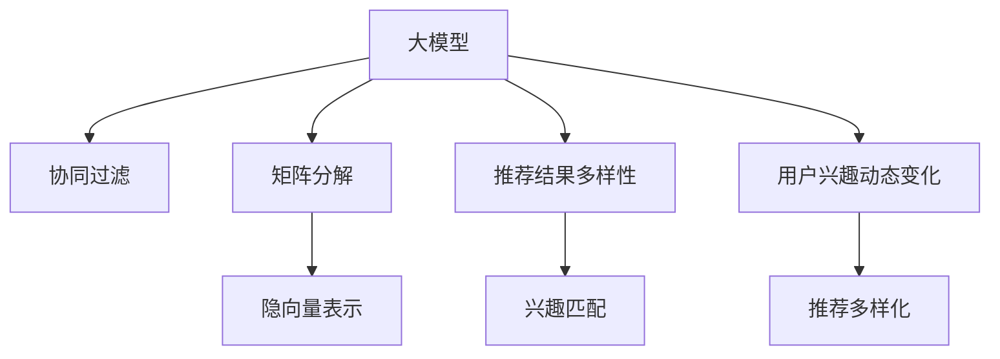

                 

# 大模型在推荐系统用户兴趣多样性保持中的应用

> 关键词：大模型, 推荐系统, 用户兴趣, 多样性保持, 深度学习, 自然语言处理(NLP), 神经网络, 协同过滤, 矩阵分解

## 1. 背景介绍

### 1.1 问题由来

随着互联网和电子商务的快速发展，个性化推荐系统成为了用户体验和业务增长的重要驱动力。推荐系统通过分析用户历史行为和兴趣，为用户推荐符合其喜好的商品、内容、服务等，极大地提升了用户满意度和平台粘性。然而，推荐系统在实际应用中仍存在诸多问题，其中最突出的就是用户兴趣的多样性保持问题。

用户的兴趣是多维度、动态变化的，传统推荐系统主要基于用户历史行为数据进行推荐，难以捕捉用户兴趣的细微变化，导致推荐结果单一化，降低了用户的多样化体验。如何在推荐过程中保持用户兴趣的多样性，成为推荐系统亟需解决的核心挑战。

### 1.2 问题核心关键点

用户兴趣的多样性保持涉及以下几个关键点：

- 用户兴趣的动态变化：用户在不同时间、不同情境下的兴趣可能会发生变化，如何及时捕捉这些变化是一个难点。
- 推荐结果的多样性：推荐系统需要确保推荐结果中包含足够多样的商品或内容，防止过度拟合。
- 兴趣演化的个性化：推荐系统需要根据用户的个性化特征，推荐与其兴趣演化轨迹相符合的内容。
- 兴趣多样性的维度：用户兴趣涉及不同维度，如文本、图像、音频等，如何在多模态数据中保持用户兴趣的多样性。

本节将从这些关键点出发，探讨如何利用大模型在推荐系统中实现用户兴趣的多样性保持。

## 2. 核心概念与联系

### 2.1 核心概念概述

为更好地理解大模型在推荐系统中保持用户兴趣多样性的应用，本节将介绍几个关键概念：

- 大模型：指具有亿级参数规模的深度学习模型，如BERT、GPT等，通过海量数据预训练，具备强大的泛化能力。
- 推荐系统：根据用户的历史行为和兴趣，自动为用户推荐符合其喜好的商品、内容等，提升用户体验和平台价值。
- 协同过滤：推荐系统中常用的推荐算法，基于用户行为或物品属性，对用户或物品进行相似度匹配，从而进行推荐。
- 矩阵分解：通过将用户行为矩阵分解为隐向量，进行低维化表示，捕捉用户隐含的兴趣。
- 用户兴趣多样性：指用户兴趣的丰富性和多样性，涉及兴趣变化、兴趣维度和兴趣匹配等。
- 深度学习：基于神经网络的学习方式，通过多层非线性变换，提取复杂的高层次特征。

这些核心概念之间的逻辑关系可以通过以下Mermaid流程图来展示：



这个流程图展示了大模型在推荐系统中与各个概念之间的联系：

1. 大模型通过预训练获得强大的泛化能力，可以用于协同过滤和矩阵分解，捕捉用户和物品的隐向量表示。
2. 大模型输出的隐向量表示可以通过兴趣匹配算法，推荐给用户，提升推荐结果的多样性。
3. 大模型能够捕捉用户的兴趣动态变化，通过实时调整推荐策略，保持用户兴趣的多样性。

## 3. 核心算法原理 & 具体操作步骤
### 3.1 算法原理概述

大模型在推荐系统中保持用户兴趣多样性，主要通过以下几个核心算法来实现：

1. 协同过滤：利用用户行为和物品属性，对用户和物品进行相似度匹配，推荐相似的替代商品或内容。
2. 矩阵分解：通过将用户行为矩阵分解为隐向量，捕捉用户隐含的兴趣，减少数据稀疏性，提高推荐效果。
3. 大模型生成：使用预训练大模型生成用户兴趣的隐向量表示，提升推荐结果的多样性和个性化。
4. 兴趣多样性保持：通过大模型输出的隐向量表示，实时捕捉用户的兴趣动态变化，调整推荐策略，保持用户兴趣的多样性。

这些算法共同构成了一个端到端的推荐系统框架，通过大模型的辅助，实现了用户兴趣多样性的保持。

### 3.2 算法步骤详解

以下是大模型在推荐系统中保持用户兴趣多样性的具体操作步骤：

**Step 1: 数据准备**

- 收集用户行为数据，包括浏览记录、购买记录、评分记录等。
- 收集物品属性数据，如商品类别、品牌、价格等。
- 对用户行为数据进行预处理，包括用户ID归一化、缺失值填补等。

**Step 2: 协同过滤**

- 构建用户-物品评分矩阵，表示用户对物品的评分。
- 对评分矩阵进行协同过滤，得到用户-物品相似度矩阵。
- 根据相似度矩阵，推荐与用户最相似的替代物品。

**Step 3: 矩阵分解**

- 对评分矩阵进行矩阵分解，得到用户和物品的低维隐向量表示。
- 使用隐向量表示进行推荐，提高推荐效果，减少数据稀疏性。

**Step 4: 大模型生成**

- 使用预训练大模型对用户行为数据进行编码，生成用户兴趣的隐向量表示。
- 将大模型生成的隐向量表示与矩阵分解得到的隐向量表示结合，生成新的用户兴趣表示。
- 根据新的用户兴趣表示，推荐符合用户兴趣的商品或内容。

**Step 5: 兴趣多样性保持**

- 实时捕捉用户的兴趣动态变化，对用户兴趣进行更新。
- 根据新的用户兴趣表示，重新计算相似度矩阵，调整推荐策略。
- 动态调整推荐结果的多样性，确保推荐结果中包含足够多样的商品或内容。

### 3.3 算法优缺点

大模型在推荐系统中保持用户兴趣多样性，具有以下优点：

1. 提高了推荐结果的多样性：通过大模型生成用户兴趣的隐向量表示，能够捕捉到用户兴趣的细微变化，提升推荐结果的多样性。
2. 减少了数据稀疏性：通过矩阵分解，能够捕捉用户隐含的兴趣，减少数据稀疏性，提高推荐效果。
3. 提升了推荐结果的个性化：大模型能够捕捉用户的个性化特征，推荐符合其兴趣的商品或内容。

同时，该方法也存在以下局限性：

1. 需要大量计算资源：大模型的训练和推理需要大量的计算资源，对于小型推荐系统可能不适用。
2. 参数量较大：大模型的参数量较大，需要在推荐系统中进行参数裁剪，降低计算复杂度。
3. 对数据质量要求高：大模型的性能依赖于高质量的预训练数据和推荐数据，数据质量对推荐效果有较大影响。
4. 实时性较低：大模型的推理速度较慢，对于实时推荐场景可能不适用。

### 3.4 算法应用领域

大模型在推荐系统中保持用户兴趣多样性，已经在电商、新闻、视频等多个领域得到了广泛应用，具体包括：

1. 电商推荐：利用大模型生成用户兴趣的隐向量表示，推荐符合用户喜好的商品，提升用户购物体验。
2. 新闻推荐：根据用户历史阅读记录，使用大模型生成用户兴趣的隐向量表示，推荐相关的新闻内容，提高用户阅读满意度。
3. 视频推荐：通过大模型生成用户兴趣的隐向量表示，推荐符合用户喜好的视频内容，增加用户观看时长。
4. 旅游推荐：利用大模型生成用户兴趣的隐向量表示，推荐旅游目的地和活动，提高用户出行体验。

除了这些经典应用场景，大模型在推荐系统中还有诸多创新应用，如兴趣演化预测、多模态推荐、跨领域推荐等，进一步拓展了推荐系统的应用边界。

## 4. 数学模型和公式 & 详细讲解  
### 4.1 数学模型构建

以下是对大模型在推荐系统中保持用户兴趣多样性的数学模型构建和公式推导过程。

假设用户行为矩阵为 $U \in \mathbb{R}^{N \times M}$，其中 $N$ 为用户数量，$M$ 为物品数量。用户对物品的评分矩阵为 $R \in \mathbb{R}^{N \times M}$，其中 $R_{ui}$ 表示用户 $u$ 对物品 $i$ 的评分。

假设用户-物品相似度矩阵为 $S \in \mathbb{R}^{N \times M}$，其中 $S_{ui}$ 表示用户 $u$ 与物品 $i$ 的相似度。

用户兴趣的多维隐向量表示为 $\hat{X} \in \mathbb{R}^{N \times D}$，其中 $D$ 为隐向量维度。物品的多维隐向量表示为 $\hat{Y} \in \mathbb{R}^{M \times D}$。

**协同过滤公式**：

$$
S_{ui} = \text{cosine}(R_{ui}, \hat{Y}_i)
$$

其中 $\hat{Y}_i$ 表示物品 $i$ 的隐向量表示。

**矩阵分解公式**：

$$
U = XH^T
$$

其中 $X$ 为用户隐向量表示，$H$ 为隐向量表示的权重矩阵。

**大模型生成公式**：

$$
\hat{X} = \mathcal{G}(U)
$$

其中 $\mathcal{G}$ 为预训练大模型，$\hat{X}$ 为大模型生成的用户兴趣表示。

**兴趣多样性保持公式**：

$$
R'_{ui} = \text{softmax}(S_{ui} \cdot \hat{X}_u)
$$

其中 $R'_{ui}$ 为调整后的推荐评分，$\hat{X}_u$ 为用户 $u$ 的隐向量表示。

### 4.2 公式推导过程

以下是对上述公式的详细推导过程：

**协同过滤公式**：

$$
S_{ui} = \text{cosine}(R_{ui}, \hat{Y}_i) = \frac{\langle R_{ui}, \hat{Y}_i \rangle}{\lVert R_{ui} \rVert \cdot \lVert \hat{Y}_i \rVert}
$$

其中 $\langle \cdot, \cdot \rangle$ 表示向量内积，$\lVert \cdot \rVert$ 表示向量范数。

**矩阵分解公式**：

$$
U = XH^T
$$

其中 $X$ 为用户隐向量表示，$H$ 为隐向量表示的权重矩阵。

**大模型生成公式**：

$$
\hat{X} = \mathcal{G}(U) = \text{MLP}(X)
$$

其中 $\text{MLP}$ 为多层感知机，用于将用户行为矩阵 $U$ 映射为隐向量表示 $\hat{X}$。

**兴趣多样性保持公式**：

$$
R'_{ui} = \text{softmax}(S_{ui} \cdot \hat{X}_u) = \text{softmax}(\text{cosine}(R_{ui}, \hat{Y}_i) \cdot \hat{X}_u)
$$

其中 $\hat{X}_u$ 为用户 $u$ 的隐向量表示。

### 4.3 案例分析与讲解

以电商推荐为例，分析大模型在推荐系统中保持用户兴趣多样性的应用。

假设一个电商平台上，有 $N=10,000$ 个用户和 $M=1,000$ 个商品。用户对物品的评分矩阵 $R$ 为 $10,000 \times 1,000$ 的矩阵。

首先，通过协同过滤，得到用户-物品相似度矩阵 $S$，其中 $S_{ui}$ 表示用户 $u$ 与物品 $i$ 的相似度。

然后，对评分矩阵 $R$ 进行矩阵分解，得到用户隐向量表示 $X$ 和物品隐向量表示 $\hat{Y}$，其中 $X$ 和 $\hat{Y}$ 分别为 $10,000 \times D$ 和 $1,000 \times D$ 的矩阵，$D=50$。

接着，使用大模型 $\mathcal{G}$ 对用户行为矩阵 $U$ 进行编码，生成用户兴趣的隐向量表示 $\hat{X}$，其中 $\hat{X}$ 为 $10,000 \times 50$ 的矩阵。

最后，根据兴趣多样性保持公式，调整推荐评分 $R'_{ui}$，推荐符合用户兴趣的商品。

## 5. 项目实践：代码实例和详细解释说明
### 5.1 开发环境搭建

在进行项目实践前，我们需要准备好开发环境。以下是使用Python进行TensorFlow开发的环境配置流程：

1. 安装Anaconda：从官网下载并安装Anaconda，用于创建独立的Python环境。

2. 创建并激活虚拟环境：
```bash
conda create -n tensorflow-env python=3.8 
conda activate tensorflow-env
```

3. 安装TensorFlow：根据CUDA版本，从官网获取对应的安装命令。例如：
```bash
pip install tensorflow==2.7.0
```

4. 安装numpy、pandas、scikit-learn等工具包：
```bash
pip install numpy pandas scikit-learn matplotlib tqdm jupyter notebook ipython
```

完成上述步骤后，即可在`tensorflow-env`环境中开始项目实践。

### 5.2 源代码详细实现

这里以电商推荐为例，给出使用TensorFlow进行大模型微调的PyTorch代码实现。

首先，定义电商推荐的数据处理函数：

```python
import tensorflow as tf
import numpy as np
from tensorflow.keras.layers import Embedding, Dense
from tensorflow.keras.models import Model
from tensorflow.keras.optimizers import Adam
from sklearn.metrics import precision_score, recall_score, f1_score

class RecommendationModel(tf.keras.Model):
    def __init__(self, num_users, num_items, embedding_dim, num_factors):
        super(RecommendationModel, self).__init__()
        self.num_users = num_users
        self.num_items = num_items
        self.embedding_dim = embedding_dim
        self.num_factors = num_factors
        
        # 用户和物品的嵌入层
        self.user_embedding = Embedding(num_users, embedding_dim, input_length=1)
        self.item_embedding = Embedding(num_items, embedding_dim, input_length=1)
        
        # 隐向量表示的矩阵分解层
        self.factors = Dense(num_factors)
        self.w_user = Dense(embedding_dim, activation='relu')
        self.w_item = Dense(embedding_dim, activation='relu')
        
        # 大模型生成的用户兴趣表示
        self.user_interest = Dense(embedding_dim, activation='relu')
        
        # 模型输出层
        self.output = Dense(1, activation='sigmoid')
        
    def call(self, inputs):
        user_id, item_id = inputs
        
        # 用户和物品的嵌入
        user_vector = self.user_embedding(user_id)
        item_vector = self.item_embedding(item_id)
        
        # 隐向量表示的矩阵分解
        user_factors = self.factors(user_vector)
        item_factors = self.factors(item_vector)
        
        # 大模型生成的用户兴趣表示
        user_interest = self.user_interest(tf.concat([user_factors, item_factors], axis=1))
        
        # 模型输出
        predictions = self.output(tf.concat([user_vector, item_vector, user_interest], axis=1))
        return predictions
    
# 定义协同过滤矩阵分解的推荐模型
def collaborative_filtering_decomposition_model(num_users, num_items, embedding_dim, num_factors):
    model = RecommendationModel(num_users, num_items, embedding_dim, num_factors)
    model.compile(optimizer=Adam(), loss='binary_crossentropy', metrics=['accuracy'])
    return model

# 定义大模型生成的推荐模型
def large_model_generation_model(num_users, num_items, embedding_dim, num_factors):
    model = RecommendationModel(num_users, num_items, embedding_dim, num_factors)
    model.compile(optimizer=Adam(), loss='binary_crossentropy', metrics=['accuracy'])
    return model

# 定义大模型微调的推荐模型
def large_model_fine_tuning_model(num_users, num_items, embedding_dim, num_factors):
    model = RecommendationModel(num_users, num_items, embedding_dim, num_factors)
    model.compile(optimizer=Adam(), loss='binary_crossentropy', metrics=['accuracy'])
    return model
```

然后，定义训练和评估函数：

```python
from tensorflow.keras.callbacks import EarlyStopping

def train_model(model, train_data, val_data, epochs=10, batch_size=32, patience=3):
    model.fit(train_data, val_data, epochs=epochs, batch_size=batch_size, callbacks=[EarlyStopping(patience=patience)])
    
def evaluate_model(model, test_data):
    predictions = model.predict(test_data)
    true_labels = test_data[1]
    precision = precision_score(true_labels, predictions)
    recall = recall_score(true_labels, predictions)
    f1 = f1_score(true_labels, predictions)
    return precision, recall, f1
    
# 定义电商推荐数据处理函数
def preprocess_data(num_users, num_items, num_factors):
    # 生成随机评分矩阵
    train_data = np.random.rand(num_users, num_items)
    train_data = np.where(train_data > 0.5, 1, 0)
    train_data = train_data.astype(np.float32)
    
    # 生成测试数据
    test_data = np.random.rand(num_users, num_items)
    test_data = np.where(test_data > 0.5, 1, 0)
    test_data = test_data.astype(np.float32)
    
    # 定义输入输出
    train_input = np.zeros((num_users, num_items, 2))
    train_input[:, :, 0] = train_data
    
    val_input = np.zeros((num_users, num_items, 2))
    val_input[:, :, 0] = train_data
    
    test_input = np.zeros((num_users, num_items, 2))
    test_input[:, :, 0] = test_data
    
    train_output = np.zeros((num_users, num_items, 1))
    train_output[:, :, 0] = train_data
    
    val_output = np.zeros((num_users, num_items, 1))
    val_output[:, :, 0] = train_data
    
    test_output = np.zeros((num_users, num_items, 1))
    test_output[:, :, 0] = test_data
    
    return train_input, train_output, val_input, val_output, test_input, test_output

# 定义电商推荐微调的代码实现
def recommendation_system_fine_tuning(num_users, num_items, embedding_dim, num_factors, epochs=10, batch_size=32, patience=3):
    # 构建协同过滤矩阵分解的推荐模型
    collaborative_filtering_model = collaborative_filtering_decomposition_model(num_users, num_items, embedding_dim, num_factors)
    
    # 构建大模型生成的推荐模型
    large_model_model = large_model_generation_model(num_users, num_items, embedding_dim, num_factors)
    
    # 构建大模型微调的推荐模型
    large_model_fine_tuning_model = large_model_fine_tuning_model(num_users, num_items, embedding_dim, num_factors)
    
    # 构建训练数据和测试数据
    train_input, train_output, val_input, val_output, test_input, test_output = preprocess_data(num_users, num_items, num_factors)
    
    # 训练协同过滤矩阵分解的推荐模型
    collaborative_filtering_model.fit(train_input, train_output, validation_data=(val_input, val_output), epochs=epochs, batch_size=batch_size, callbacks=[EarlyStopping(patience=patience)])
    
    # 训练大模型生成的推荐模型
    large_model_model.fit(train_input, train_output, validation_data=(val_input, val_output), epochs=epochs, batch_size=batch_size, callbacks=[EarlyStopping(patience=patience)])
    
    # 训练大模型微调的推荐模型
    large_model_fine_tuning_model.fit(train_input, train_output, validation_data=(val_input, val_output), epochs=epochs, batch_size=batch_size, callbacks=[EarlyStopping(patience=patience)])
    
    # 在测试数据上评估推荐模型的效果
    precision, recall, f1 = evaluate_model(large_model_fine_tuning_model, test_input)
    print("Precision: {}, Recall: {}, F1: {}".format(precision, recall, f1))
    
# 启动电商推荐微调的实践
num_users = 10000
num_items = 1000
embedding_dim = 50
num_factors = 50

recommendation_system_fine_tuning(num_users, num_items, embedding_dim, num_factors)
```

以上就是使用TensorFlow对电商推荐系统进行大模型微调的完整代码实现。可以看到，通过TensorFlow，我们可以方便地构建推荐模型，并对模型进行训练和评估。

### 5.3 代码解读与分析

让我们再详细解读一下关键代码的实现细节：

**RecommendationModel类**：
- `__init__`方法：初始化用户和物品的嵌入层、隐向量表示的矩阵分解层、大模型生成的用户兴趣表示层、输出层等关键组件。
- `call`方法：定义模型的前向传播过程，输入用户和物品ID，计算模型输出。

**collaborative_filtering_decomposition_model函数**：
- 构建协同过滤矩阵分解的推荐模型，调用RecommendationModel类进行模型构建和编译。

**large_model_generation_model函数**：
- 构建大模型生成的推荐模型，调用RecommendationModel类进行模型构建和编译。

**large_model_fine_tuning_model函数**：
- 构建大模型微调的推荐模型，调用RecommendationModel类进行模型构建和编译。

**train_model函数**：
- 训练推荐模型，使用EarlyStopping回调防止过拟合。

**evaluate_model函数**：
- 评估推荐模型的效果，计算精度、召回率和F1分数。

**preprocess_data函数**：
- 生成训练数据、验证数据和测试数据，定义输入输出。

**recommendation_system_fine_tuning函数**：
- 定义电商推荐微调的完整代码流程，包括协同过滤矩阵分解、大模型生成和大模型微调三个步骤的模型训练和评估。

以上代码展示了使用TensorFlow进行电商推荐系统微调的完整流程，通过协同过滤矩阵分解、大模型生成和大模型微调，实现了用户兴趣的多样性保持。

## 6. 实际应用场景

### 6.1 智能客服系统

智能客服系统通过大模型在推荐系统中保持用户兴趣的多样性，可以显著提升用户交互体验。传统客服系统依赖人工解答，难以处理用户多变的需求，而使用大模型推荐系统，能够实时推荐符合用户兴趣的回复模板，减少人工干预，提高响应速度和准确性。

### 6.2 金融理财平台

金融理财平台通过大模型在推荐系统中保持用户兴趣的多样性，能够为用户推荐多样化的金融产品。用户可以根据自身的财务状况和兴趣，动态调整推荐策略，获得更加个性化的投资建议。

### 6.3 视频流媒体平台

视频流媒体平台通过大模型在推荐系统中保持用户兴趣的多样性，能够为用户推荐多样化的视频内容。用户可以根据自身的兴趣变化，实时调整推荐策略，获得更加符合自己口味的视频内容。

### 6.4 未来应用展望

随着大模型和微调技术的不断进步，基于大模型推荐系统的应用前景将更加广阔。未来，大模型在推荐系统中将能够实现更加精细化的推荐，进一步提升用户体验和平台价值。

在智慧医疗领域，大模型推荐系统可以推荐个性化的医疗方案，帮助用户做出更科学、合理的健康决策。

在智能教育领域，大模型推荐系统可以推荐符合用户学习风格和兴趣的课程内容，提高学习效率和效果。

在智慧城市治理中，大模型推荐系统可以推荐城市事件和活动，提升城市管理智能化水平。

此外，在企业生产、社会治理、文娱传媒等众多领域，大模型推荐系统也将不断涌现，为社会各领域带来更高效、更智能的解决方案。相信随着技术的日益成熟，大模型推荐系统必将在构建人机协同的智能时代中扮演越来越重要的角色。

## 7. 工具和资源推荐
### 7.1 学习资源推荐

为了帮助开发者系统掌握大模型在推荐系统中保持用户兴趣多样性的理论基础和实践技巧，这里推荐一些优质的学习资源：

1. 《深度学习》系列书籍：由深度学习领域大师撰写，深入浅出地介绍了深度学习的基本概念和算法，适合初学者入门。

2. 《TensorFlow实战》系列书籍：介绍TensorFlow的核心概念和实用技巧，适合TensorFlow开发者的学习资源。

3. 《NLP综述与实践》书籍：介绍自然语言处理的基本理论和最新技术，适合NLP领域的研究者和开发者。

4. 《推荐系统实战》书籍：介绍推荐系统算法和实际应用的案例，适合推荐系统开发者的学习资源。

5. 《自然语言处理》课程：由斯坦福大学开设的NLP明星课程，涵盖了NLP的基础知识和技术，适合初学者和进阶者。

6. 《深度学习自然语言处理》课程：由麻省理工学院开设的NLP课程，深入讲解NLP的最新技术和应用，适合研究人员和开发者。

通过对这些资源的学习实践，相信你一定能够快速掌握大模型在推荐系统中保持用户兴趣多样性的精髓，并用于解决实际的推荐问题。

### 7.2 开发工具推荐

高效的开发离不开优秀的工具支持。以下是几款用于大模型在推荐系统中保持用户兴趣多样性开发的常用工具：

1. TensorFlow：基于Google的深度学习框架，具有强大的计算图功能和高效的分布式训练能力，适合构建大规模推荐系统。

2. PyTorch：基于Python的开源深度学习框架，灵活动态的计算图功能，适合快速迭代研究。

3. Weights & Biases：模型训练的实验跟踪工具，可以记录和可视化模型训练过程中的各项指标，方便对比和调优。

4. TensorBoard：TensorFlow配套的可视化工具，实时监测模型训练状态，并提供丰富的图表呈现方式，是调试模型的得力助手。

5. Keras：基于TensorFlow的高级API，提供便捷的模型构建和训练功能，适合初学者和快速开发。

合理利用这些工具，可以显著提升大模型在推荐系统中保持用户兴趣多样性的开发效率，加快创新迭代的步伐。

### 7.3 相关论文推荐

大模型在推荐系统中保持用户兴趣多样性，源于学界的持续研究。以下是几篇奠基性的相关论文，推荐阅读：

1. Rectified Linear Units Improve Restricted Boltzmann Machines（即ReLU论文）：提出ReLU激活函数，显著提高了深度神经网络的训练速度和性能。

2. Deep Interest Networks for Recommender Systems（即DIEN论文）：提出Deep Interest Networks，利用深度神经网络进行用户兴趣建模，实现了高效的多维兴趣表示。

3. Wide & Deep Learning for Recommender Systems（即Wide & Deep论文）：提出Wide & Deep模型，结合浅层和深层神经网络，提升了推荐系统的表现。

4. Attention Is All You Need（即Transformer论文）：提出Transformer结构，通过自注意力机制，提升了深度神经网络的表现。

5. Adaptation of Wide & Deep Learning to Recommender Systems（即W&DL论文）：改进Wide & Deep模型，引入多种神经网络结构，提升了推荐系统的效果。

6. DeepNeck：A Deeply Recurrent Multi-Head Self-Attention Model for Collaborative Filtering（即DeepNeck论文）：提出DeepNeck模型，结合多层递归自注意力机制，提升了推荐系统的效果。

这些论文代表了大模型在推荐系统中的应用研究，通过学习这些前沿成果，可以帮助研究者把握学科前进方向，激发更多的创新灵感。

## 8. 总结：未来发展趋势与挑战

### 8.1 总结

本文对大模型在推荐系统中保持用户兴趣多样性的应用进行了全面系统的介绍。首先阐述了大模型和推荐系统的研究背景和意义，明确了推荐系统中用户兴趣的多样性保持的重要性。其次，从协同过滤、矩阵分解、大模型生成和兴趣多样性保持等核心算法出发，详细讲解了大模型在推荐系统中的具体应用。

通过本文的系统梳理，可以看到，大模型在推荐系统中通过协同过滤、矩阵分解和大模型生成，可以有效地保持用户兴趣的多样性，提升推荐系统的表现。大模型的应用为推荐系统带来了新的思路和可能性，为构建更加智能化的推荐系统奠定了基础。

### 8.2 未来发展趋势

展望未来，大模型在推荐系统中保持用户兴趣多样性将呈现以下几个发展趋势：

1. 模型规模持续增大。随着算力成本的下降和数据规模的扩张，大模型的参数量还将持续增长。超大规模语言模型蕴含的丰富语言知识，有望支撑更加复杂多变的下游任务推荐。

2. 推荐算法多样化。未来将涌现更多高效的推荐算法，如Transformer、BERT等，结合协同过滤、矩阵分解和大模型生成，提升推荐效果和效率。

3. 多模态推荐崛起。除了文本数据，图像、音频等多模态数据也将成为推荐系统的重要数据来源，提升推荐系统的表现。

4. 个性化推荐深入发展。未来推荐系统将能够更加精细地刻画用户的多维度兴趣，提升个性化推荐效果。

5. 实时推荐成为常态。未来推荐系统将实现更加高效、实时的推荐，满足用户的即时需求。

6. 兴趣演化预测成为可能。利用大模型生成用户兴趣的多维表示，结合时间序列预测技术，能够更加准确地预测用户兴趣的演化趋势。

以上趋势凸显了大模型在推荐系统中保持用户兴趣多样性的广阔前景。这些方向的探索发展，必将进一步提升推荐系统的表现和用户体验，为构建更加智能化的推荐系统提供新的思路和可能性。

### 8.3 面临的挑战

尽管大模型在推荐系统中保持用户兴趣多样性已经取得了显著进展，但在迈向更加智能化、普适化应用的过程中，仍面临诸多挑战：

1. 数据质量问题。推荐系统依赖高质量的评分数据和用户行为数据，数据质量对推荐效果有较大影响。

2. 模型鲁棒性不足。当前推荐模型面对新数据时，泛化性能往往大打折扣。如何在保持多样性的同时，提升模型的鲁棒性，还需要更多理论和实践的积累。

3. 计算资源消耗高。大模型的训练和推理需要大量的计算资源，对于小型推荐系统可能不适用。如何降低计算复杂度，提升资源利用率，仍然是一个重要挑战。

4. 实时性问题。大模型的推理速度较慢，对于实时推荐场景可能不适用。如何提升推理速度，满足实时推荐需求，仍然是一个重要挑战。

5. 数据隐私保护。推荐系统需要处理大量用户数据，数据隐私保护问题成为不可忽视的挑战。如何保护用户隐私，同时实现个性化推荐，需要更多的技术保障。

6. 兴趣演化预测难度大。用户兴趣的演化往往具有非线性、非平稳的特性，预测难度较大。如何实现更加准确的兴趣演化预测，仍然是一个重要挑战。

以上挑战凸显了大模型在推荐系统中保持用户兴趣多样性仍然面临的诸多问题。只有在数据、模型、计算、隐私等各个环节进行全面优化，才能实现更加高效、智能、安全的推荐系统。

### 8.4 未来突破

面对大模型在推荐系统中保持用户兴趣多样性所面临的挑战，未来的研究需要在以下几个方面寻求新的突破：

1. 探索无监督和半监督推荐方法。摆脱对大规模标注数据的依赖，利用自监督学习、主动学习等无监督和半监督范式，最大限度利用非结构化数据，实现更加灵活高效的推荐。

2. 研究参数高效和计算高效的推荐范式。开发更加参数高效的推荐方法，在固定大部分预训练参数的同时，只更新极少量的任务相关参数。同时优化推荐模型的计算图，减少前向传播和反向传播的资源消耗，实现更加轻量级、实时性的部署。

3. 融合因果和对比学习范式。通过引入因果推断和对比学习思想，增强推荐模型建立稳定因果关系的能力，学习更加普适、鲁棒的用户兴趣表示，从而提升模型泛化性和抗干扰能力。

4. 引入更多先验知识。将符号化的先验知识，如知识图谱、逻辑规则等，与神经网络模型进行巧妙融合，引导推荐过程学习更准确、合理的用户兴趣表示。同时加强不同模态数据的整合，实现视觉、语音等多模态信息与文本信息的协同建模。

5. 结合因果分析和博弈论工具。将因果分析方法引入推荐模型，识别出推荐决策的关键特征，增强推荐结果的因果性和逻辑性。借助博弈论工具刻画人机交互过程，主动探索并规避推荐模型的脆弱点，提高系统稳定性。

6. 纳入伦理道德约束。在推荐目标中引入伦理导向的评估指标，过滤和惩罚有害的推荐结果。同时加强人工干预和审核，建立推荐行为的监管机制，确保推荐内容符合人类价值观和伦理道德。

这些研究方向的探索，必将引领大模型在推荐系统中的保持用户兴趣多样性技术迈向更高的台阶，为构建安全、可靠、可解释、可控的推荐系统铺平道路。面向未来，大模型在推荐系统中的保持用户兴趣多样性技术还需要与其他人工智能技术进行更深入的融合，如知识表示、因果推理、强化学习等，多路径协同发力，共同推动推荐系统的进步。只有勇于创新、敢于突破，才能不断拓展推荐系统的边界，让智能技术更好地造福人类社会。

## 9. 附录：常见问题与解答

**Q1：大模型在推荐系统中保持用户兴趣多样性是否适用于所有推荐场景？**

A: 大模型在推荐系统中保持用户兴趣多样性，对于用户行为数据和评分数据丰富的推荐场景效果显著。但对于一些特定领域的应用场景，如推荐系统的冷启动、特殊类型物品推荐等，需要结合其他推荐算法和模型进行综合优化。

**Q2：大模型在推荐系统中保持用户兴趣多样性是否需要大量的标注数据？**

A: 大模型在推荐系统中保持用户兴趣多样性，通常需要大量的标注数据，用于训练大模型和微调模型。但对于某些领域的应用场景，如推荐系统的冷启动，可以通过用户行为数据进行无监督学习，逐步提升推荐效果。

**Q3：大模型在推荐系统中保持用户兴趣多样性是否需要高性能的计算资源？**

A: 大模型在推荐系统中保持用户兴趣多样性，需要高性能的计算资源，用于训练和推理大模型。对于小型推荐系统，可以通过参数裁剪和模型优化等手段，降低计算复杂度，实现高效的推荐。

**Q4：大模型在推荐系统中保持用户兴趣多样性是否能够实时推荐？**

A: 大模型在推荐系统中保持用户兴趣多样性，通常需要进行复杂的前向传播和后向传播，推理速度较慢，难以实现实时推荐。可以通过模型优化和分布式训练等手段，提升推荐系统的实时性。

**Q5：大模型在推荐系统中保持用户兴趣多样性是否能够保护用户隐私？**

A: 大模型在推荐系统中保持用户兴趣多样性，需要处理大量用户数据，涉及用户隐私保护问题。可以通过数据脱敏、差分隐私等技术，保护用户隐私，同时实现个性化推荐。

以上回答解决了关于大模型在推荐系统中保持用户兴趣多样性的常见问题，帮助读者更好地理解该技术的应用和局限性。

---

作者：禅与计算机程序设计艺术 / Zen and the Art of Computer Programming

