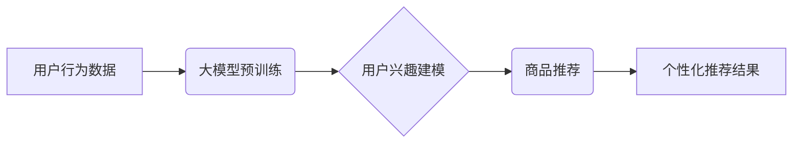

                 

## 大模型在推荐系统用户兴趣多样性保持中的应用

> 关键词：大模型、推荐系统、用户兴趣多样性、冷启动问题、个性化推荐、Transformer模型、微调、下游任务

## 1. 背景介绍

推荐系统作为信息过滤和个性化内容展示的重要工具，在电商、社交媒体、视频平台等领域发挥着越来越重要的作用。然而，随着用户行为数据的爆炸式增长和用户兴趣的多样性增强，传统推荐系统面临着新的挑战。

**1.1 用户兴趣的多样性**

用户兴趣并非静态的，而是随着时间推移、环境变化和新信息的获取而不断演变。一个用户可能同时对多种不同的内容类型感兴趣，例如电影、音乐、新闻、游戏等。传统的基于协同过滤或内容过滤的推荐系统往往难以捕捉用户这种多维度的兴趣，容易陷入“同质化推荐”的困境，导致用户体验下降。

**1.2 冷启动问题**

对于新用户或新商品，由于缺乏历史数据，传统的推荐系统难以准确预测用户兴趣，从而导致“冷启动”问题。这不仅影响了新用户的推荐体验，也阻碍了新商品的推广。

**1.3 个性化推荐的挑战**

随着用户群体规模的扩大，个性化推荐的需求日益强烈。如何根据用户的细微差异，提供更加精准、个性化的推荐内容，是推荐系统面临的重大挑战。

## 2. 核心概念与联系

大模型作为一种强大的机器学习模型，具有强大的语义理解和文本生成能力，为解决推荐系统中的上述问题提供了新的思路。

**2.1 大模型的优势**

* **强大的语义理解能力:** 大模型通过训练海量文本数据，能够学习到复杂的语言结构和语义关系，从而更好地理解用户的兴趣偏好。
* **泛化能力强:** 大模型在预训练阶段已经学习了大量的知识，能够应用于不同的下游任务，包括推荐系统。
* **可迁移学习:** 大模型可以利用预训练知识进行微调，快速适应新的任务和数据，从而降低冷启动问题的影响。

**2.2 大模型在推荐系统中的应用**

大模型可以应用于推荐系统的多个环节，例如：

* **用户兴趣建模:** 利用大模型对用户的历史行为数据进行分析，构建更加精准的用户兴趣模型。
* **商品特征提取:** 利用大模型提取商品的语义特征，更好地理解商品的属性和用户需求。
* **推荐内容生成:** 利用大模型生成个性化的推荐内容，例如推荐列表、推荐摘要等。

**2.3 架构图**



## 3. 核心算法原理 & 具体操作步骤

### 3.1 算法原理概述

大模型在推荐系统中的应用主要基于Transformer模型，其强大的序列建模能力和自注意力机制能够有效捕捉用户兴趣的多样性和复杂性。

**3.1.1 Transformer模型**

Transformer模型是一种基于深度学习的序列到序列模型，其核心结构是自注意力机制和多头注意力机制。自注意力机制能够捕捉序列中不同元素之间的关系，而多头注意力机制则能够学习到不同类型的语义信息。

**3.1.2 自注意力机制**

自注意力机制能够计算序列中每个元素与其他元素之间的相关性，并根据相关性赋予每个元素不同的权重。

**3.1.3 多头注意力机制**

多头注意力机制通过使用多个自注意力头，能够学习到不同类型的语义信息，从而提高模型的表达能力。

### 3.2 算法步骤详解

1. **数据预处理:** 将用户行为数据、商品信息等数据进行清洗、格式化和编码。
2. **大模型预训练:** 利用预训练的Transformer模型，对用户行为数据进行训练，学习用户兴趣的潜在表示。
3. **微调:** 将预训练的模型微调到具体的推荐任务上，例如用户兴趣分类、商品推荐等。
4. **推荐结果生成:** 利用微调后的模型，对用户的查询或行为进行预测，生成个性化的推荐结果。

### 3.3 算法优缺点

**优点:**

* 能够捕捉用户兴趣的多样性和复杂性。
* 泛化能力强，能够应用于不同的推荐任务。
* 可迁移学习，降低冷启动问题的影响。

**缺点:**

* 训练成本高，需要大量的计算资源和数据。
* 模型参数量大，部署成本较高。
*  interpretability 较低，难以解释模型的决策过程。

### 3.4 算法应用领域

大模型在推荐系统中的应用领域广泛，包括：

* **电商推荐:** 推荐商品、优惠券、促销活动等。
* **社交媒体推荐:** 推荐好友、话题、文章等。
* **视频平台推荐:** 推荐视频、直播、用户等。
* **音乐平台推荐:** 推荐歌曲、专辑、艺术家等。

## 4. 数学模型和公式 & 详细讲解 & 举例说明

### 4.1 数学模型构建

大模型在推荐系统中的应用通常基于以下数学模型：

* **用户兴趣表示:** 使用向量空间模型表示用户的兴趣，其中每个维度代表一个特定的兴趣类别。
* **商品特征表示:** 使用向量空间模型表示商品的特征，例如商品类别、价格、描述等。
* **相似度计算:** 使用余弦相似度等度量方法计算用户兴趣向量与商品特征向量的相似度。

### 4.2 公式推导过程

**4.2.1 余弦相似度**

余弦相似度用于衡量两个向量的方向相似度，公式如下：

$$
\text{cosine similarity}(u, v) = \frac{u \cdot v}{||u|| ||v||}
$$

其中：

* $u$ 和 $v$ 是两个向量。
* $u \cdot v$ 是两个向量的点积。
* $||u||$ 和 $||v||$ 是两个向量的模长。

**4.2.2 预测评分**

可以使用线性回归模型或神经网络模型预测用户对商品的评分，公式如下：

$$
\hat{r}_{u, i} = \text{model}(u, i)
$$

其中：

* $\hat{r}_{u, i}$ 是模型预测的用户 $u$ 对商品 $i$ 的评分。
* $\text{model}(u, i)$ 是模型的预测函数，输入用户 $u$ 和商品 $i$ 的特征。

### 4.3 案例分析与讲解

假设我们有一个电商平台，用户 $u$ 对商品 $i$ 的评分为 4，而用户 $v$ 对商品 $i$ 的评分为 5。我们可以使用余弦相似度计算用户 $u$ 和 $v$ 的兴趣相似度，并根据相似度进行商品推荐。

## 5. 项目实践：代码实例和详细解释说明

### 5.1 开发环境搭建

* Python 3.7+
* TensorFlow 2.0+
* PyTorch 1.0+
* CUDA 10.0+

### 5.2 源代码详细实现

```python
# 导入必要的库
import tensorflow as tf

# 定义用户兴趣表示模型
class UserInterestModel(tf.keras.Model):
    def __init__(self, embedding_dim):
        super(UserInterestModel, self).__init__()
        self.embedding = tf.keras.layers.Embedding(input_dim=vocab_size, output_dim=embedding_dim)

    def call(self, inputs):
        return self.embedding(inputs)

# 定义商品特征表示模型
class ItemFeatureModel(tf.keras.Model):
    def __init__(self, embedding_dim):
        super(ItemFeatureModel, self).__init__()
        self.embedding = tf.keras.layers.Embedding(input_dim=vocab_size, output_dim=embedding_dim)

    def call(self, inputs):
        return self.embedding(inputs)

# 定义推荐模型
class RecommenderModel(tf.keras.Model):
    def __init__(self, embedding_dim):
        super(RecommenderModel, self).__init__()
        self.user_model = UserInterestModel(embedding_dim)
        self.item_model = ItemFeatureModel(embedding_dim)
        self.dense = tf.keras.layers.Dense(1)

    def call(self, user_inputs, item_inputs):
        user_embeddings = self.user_model(user_inputs)
        item_embeddings = self.item_model(item_inputs)
        similarity = tf.reduce_sum(user_embeddings * item_embeddings, axis=1)
        return self.dense(similarity)

# 训练推荐模型
model = RecommenderModel(embedding_dim=128)
model.compile(optimizer='adam', loss='mse')
model.fit(user_data, item_data, epochs=10)

# 生成推荐结果
user_id = 123
item_ids = model.predict(user_id)
```

### 5.3 代码解读与分析

* **用户兴趣表示模型:** 使用 Embedding 层将用户 ID 映射到低维向量空间，表示用户的兴趣。
* **商品特征表示模型:** 使用 Embedding 层将商品 ID 映射到低维向量空间，表示商品的特征。
* **推荐模型:** 使用用户兴趣向量和商品特征向量计算相似度，并使用 Dense 层预测用户对商品的评分。

### 5.4 运行结果展示

训练完成后，可以使用模型预测用户对商品的评分，并根据评分生成推荐结果。

## 6. 实际应用场景

### 6.1 电商推荐

大模型可以用于个性化商品推荐，例如推荐用户可能感兴趣的商品、优惠券、促销活动等。

### 6.2 社交媒体推荐

大模型可以用于推荐用户可能感兴趣的好友、话题、文章等。

### 6.3 视频平台推荐

大模型可以用于推荐用户可能感兴趣的视频、直播、用户等。

### 6.4 未来应用展望

大模型在推荐系统中的应用前景广阔，未来可能应用于以下领域：

* **多模态推荐:** 将文本、图像、音频等多种模态信息融合，提供更加丰富的推荐体验。
* **动态推荐:** 根据用户的实时行为和上下文信息，动态调整推荐内容。
* **解释性推荐:** 解释模型的推荐决策过程，提高用户对推荐结果的信任度。

## 7. 工具和资源推荐

### 7.1 学习资源推荐

* **书籍:**
    * 《深度学习》
    * 《自然语言处理》
* **在线课程:**
    * Coursera: 深度学习
    * Udacity: 自然语言处理
* **博客:**
    * The Gradient
    * Towards Data Science

### 7.2 开发工具推荐

* **TensorFlow:** 开源深度学习框架
* **PyTorch:** 开源深度学习框架
* **Hugging Face Transformers:** 预训练 Transformer 模型库

### 7.3 相关论文推荐

* **BERT: Pre-training of Deep Bidirectional Transformers for Language Understanding**
* **GPT-3: Language Models are Few-Shot Learners**
* **T5: Text-to-Text Transfer Transformer**

## 8. 总结：未来发展趋势与挑战

### 8.1 研究成果总结

大模型在推荐系统中的应用取得了显著的成果，能够有效提升推荐系统的准确性和个性化程度。

### 8.2 未来发展趋势

* **模型规模的进一步扩大:** 随着计算资源的不断提升，大模型的规模将进一步扩大，模型的表达能力和泛化能力将得到进一步提升。
* **多模态融合:** 将文本、图像、音频等多种模态信息融合，提供更加丰富的推荐体验。
* **动态推荐:** 根据用户的实时行为和上下文信息，动态调整推荐内容。
* **解释性推荐:** 解释模型的推荐决策过程，提高用户对推荐结果的信任度。

### 8.3 面临的挑战

* **训练成本高:** 大模型的训练成本非常高，需要大量的计算资源和数据。
* **模型参数量大:** 大模型的参数量非常大，部署成本较高。
* ** interpretability 较低:** 大模型的 interpretability 较低，难以解释模型的决策过程。

### 8.4 研究展望

未来，大模型在推荐系统中的应用将继续深入发展，并解决上述挑战，为用户提供更加精准、个性化、丰富的推荐体验。

## 9. 附录：常见问题与解答

**Q1: 大模型的训练需要多少数据？**

A1: 大模型的训练需要海量数据，通常需要数十亿甚至数百亿个样本。

**Q2: 大模型的部署成本高吗？**

A2: 是的，大模型的部署成本较高，需要强大的计算资源和存储空间。

**Q3: 如何解释大模型的推荐决策过程？**

A3: 这是一个目前的研究热点，目前还没有完美的解决方案，但一些方法可以提供部分解释，例如注意力机制的可视化、模型的特征分析等。


作者：禅与计算机程序设计艺术 / Zen and the Art of Computer Programming 
<end_of_turn>

