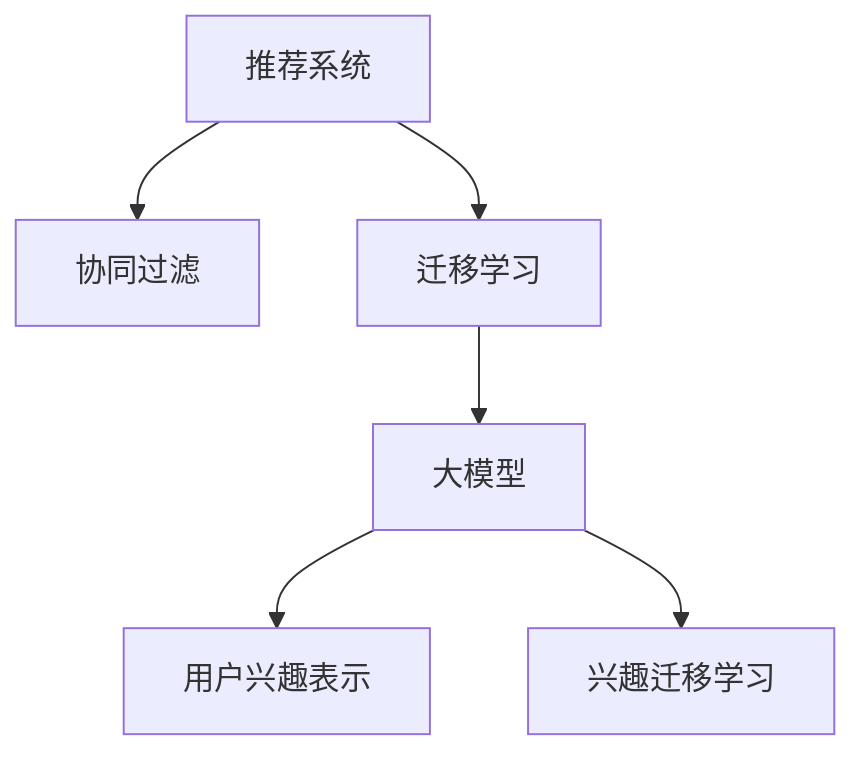

                 

# 大模型在推荐系统用户兴趣迁移学习中的应用

> 关键词：大模型,迁移学习,推荐系统,用户兴趣,协同过滤,深度学习

## 1. 背景介绍

### 1.1 问题由来
推荐系统在电商、社交媒体、内容平台等领域有着广泛的应用。传统的推荐算法，如协同过滤(Collaborative Filtering, CF)和基于内容的推荐方法，虽然能够较好地为用户推荐相似或相关的物品，但对于新用户的兴趣建模和历史用户的兴趣迁移学习，仍存在挑战。

随着深度学习技术的发展，大模型逐渐成为推荐系统中的重要工具。基于大模型的推荐方法能够充分利用用户的历史行为数据，提取高维度的语义表示，实现更准确、多样化的物品推荐。然而，在迁移学习的过程中，如何更好地利用用户已有的行为偏好，进行新用户的兴趣建模和历史用户的兴趣迁移，成为了新的研究课题。

### 1.2 问题核心关键点
大模型在推荐系统中的迁移学习，主要包括两个关键问题：

1. **新用户兴趣建模**：如何基于用户的行为数据，构建高质量的用户兴趣表示，帮助模型理解用户偏好。
2. **历史用户兴趣迁移**：如何利用用户的长期行为数据，更新其兴趣表示，使其适应新场景和新物品的推荐需求。

本文聚焦于基于大模型的用户兴趣迁移学习，旨在解决这两个核心问题。我们将探讨如何将大模型应用于推荐系统，并给出具体的迁移学习方法和代码实现。

## 2. 核心概念与联系

### 2.1 核心概念概述

为更好地理解大模型在推荐系统中的迁移学习，本节将介绍几个密切相关的核心概念：

- **推荐系统(Recommendation System)**：通过算法推荐用户可能感兴趣物品的系统。传统推荐方法包括协同过滤、基于内容的推荐等。
- **协同过滤(Collaborative Filtering, CF)**：利用用户之间的相似性进行推荐。CF又分为基于用户的CF(User-Based CF)和基于物品的CF(Item-Based CF)。
- **迁移学习(Transfer Learning)**：通过将一个领域学到的知识，迁移应用到另一个领域，以提升在新任务上的性能。
- **深度学习(Deep Learning)**：一种强大的机器学习技术，能够学习数据中复杂的非线性关系。
- **大模型(Large Model)**：指参数量超过数十亿的神经网络模型，如BERT、GPT等。
- **用户兴趣表示(User Interest Representation)**：用于表示用户兴趣的向量表示，通常由历史行为数据或文本数据生成。
- **兴趣迁移学习(Interest Migration Learning)**：指利用用户的长期行为数据，更新其兴趣表示，以适应新场景和新物品的推荐需求。

这些概念之间的逻辑关系可以通过以下Mermaid流程图来展示：



这个流程图展示了大模型在推荐系统中的迁移学习流程：

1. 推荐系统通过协同过滤等方法进行物品推荐。
2. 迁移学习利用大模型将其他领域学到的知识迁移到推荐任务中。
3. 大模型通过学习用户的历史行为数据，构建用户兴趣表示。
4. 兴趣迁移学习利用大模型，更新用户兴趣表示，以适应新场景和新物品的推荐需求。

## 3. 核心算法原理 & 具体操作步骤
### 3.1 算法原理概述

基于大模型的推荐系统，主要通过迁移学习的方式，实现用户兴趣表示的建模和迁移。其核心思想是：将预训练的大模型视作强大的"特征提取器"，通过在推荐系统的数据上进行有监督的微调，使得模型输出能够匹配用户-物品之间的关系，从而获得针对推荐任务优化的用户兴趣表示。

形式化地，假设预训练模型为 $M_{\theta}$，其中 $\theta$ 为预训练得到的模型参数。给定推荐系统的用户-物品交互数据集 $D=\{(u_i, i_j)\}_{i=1}^N, u_i \in U, i_j \in I$，迁移学习的目标是最小化用户兴趣表示与实际用户行为之间的差异。

设用户 $u$ 的兴趣表示为 $z_u$，推荐物品 $i$ 的表示为 $z_i$，则迁移学习的优化目标可以表示为：

$$
\theta^* = \mathop{\arg\min}_{\theta} \mathcal{L}(z_u, z_i, D)
$$

其中 $\mathcal{L}$ 为用户兴趣表示与实际用户行为之间的损失函数，用于衡量模型预测的用户兴趣表示与实际行为之间的差异。常见的损失函数包括均方误差损失、交叉熵损失等。

通过梯度下降等优化算法，迁移过程不断更新模型参数 $\theta$，最小化损失函数 $\mathcal{L}$，使得用户兴趣表示 $z_u$ 逼近实际用户行为，从而提升推荐系统的性能。由于 $\theta$ 已经通过预训练获得了较好的初始化，因此即便在小规模数据集 $D$ 上进行迁移学习，也能较快收敛到理想的模型参数 $\theta^*$。

### 3.2 算法步骤详解

基于大模型的推荐系统迁移学习一般包括以下几个关键步骤：

**Step 1: 准备预训练模型和数据集**
- 选择合适的预训练语言模型 $M_{\theta}$ 作为初始化参数，如 BERT、GPT等。
- 准备推荐系统的用户-物品交互数据集 $D$，划分为训练集、验证集和测试集。一般要求用户-物品之间的交互分布与预训练数据的分布不要差异过大。

**Step 2: 添加任务适配层**
- 根据推荐任务类型，在预训练模型顶层设计合适的输出层和损失函数。
- 对于推荐物品，通常在顶层添加线性分类器，使用交叉熵损失函数。
- 对于推荐用户兴趣表示，可以使用均方误差损失，或者使用更复杂的多层感知器(MLP)结构，以捕捉用户兴趣的多维度表示。

**Step 3: 设置迁移超参数**
- 选择合适的优化算法及其参数，如 AdamW、SGD 等，设置学习率、批大小、迭代轮数等。
- 设置正则化技术及强度，包括权重衰减、Dropout、Early Stopping 等。
- 确定冻结预训练参数的策略，如仅微调顶层，或全部参数都参与迁移学习。

**Step 4: 执行梯度训练**
- 将训练集数据分批次输入模型，前向传播计算损失函数。
- 反向传播计算参数梯度，根据设定的优化算法和学习率更新模型参数。
- 周期性在验证集上评估模型性能，根据性能指标决定是否触发 Early Stopping。
- 重复上述步骤直到满足预设的迭代轮数或 Early Stopping 条件。

**Step 5: 测试和部署**
- 在测试集上评估迁移后模型 $M_{\hat{\theta}}$ 的性能，对比迁移前后的精度提升。
- 使用迁移后的模型对新物品进行推荐，集成到实际的应用系统中。
- 持续收集新的用户行为数据，定期重新迁移模型，以适应数据分布的变化。

以上是基于大模型的推荐系统迁移学习的通用流程。在实际应用中，还需要针对具体任务的特点，对迁移过程的各个环节进行优化设计，如改进训练目标函数，引入更多的正则化技术，搜索最优的超参数组合等，以进一步提升模型性能。

### 3.3 算法优缺点

基于大模型的推荐系统迁移学习具有以下优点：
1. 简单高效。只需准备少量用户-物品交互数据，即可对预训练模型进行快速适配，获得较大的性能提升。
2. 泛化能力强。大模型的语言表示能够捕捉用户行为背后的语义信息，泛化到新用户和新物品上仍能取得不错的效果。
3. 参数高效。利用参数高效微调技术，在固定大部分预训练参数的情况下，仍可取得不错的迁移效果。
4. 效果显著。在大规模数据集上微调的模型，能够在推荐系统任务上取得卓越的性能表现。

同时，该方法也存在一定的局限性：
1. 依赖数据量。迁移学习的效果很大程度上取决于用户-物品交互数据的质量和数量，获取高质量标注数据的成本较高。
2. 迁移能力有限。当目标任务与预训练数据的分布差异较大时，迁移的效果可能不如从头训练的模型。
3. 模型复杂度。由于大模型参数量庞大，迁移学习时的计算成本较高，需要较高的硬件资源支持。
4. 公平性问题。预训练模型可能带有一定的偏见，在迁移学习过程中，这种偏见可能传递到推荐结果中，影响公平性。

尽管存在这些局限性，但就目前而言，基于大模型的迁移学习仍是大规模推荐系统中的主流范式。未来相关研究的重点在于如何进一步降低迁移对标注数据的依赖，提高模型的少样本学习和跨领域迁移能力，同时兼顾可解释性和伦理安全性等因素。

### 3.4 算法应用领域

基于大模型的推荐系统迁移学习方法，在电商、社交媒体、内容平台等多个领域已经得到了广泛的应用，例如：

- 电商平台推荐：为用户推荐符合其兴趣的商品。基于用户的行为数据和商品描述，对预训练模型进行迁移学习，生成个性化的商品推荐列表。
- 社交平台推荐：为用户推荐可能感兴趣的内容。利用用户的社交行为数据，构建用户兴趣表示，生成推荐列表。
- 视频平台推荐：为用户推荐适合的影视内容。利用用户的观影历史和评分数据，对预训练模型进行迁移学习，生成推荐列表。
- 音乐平台推荐：为用户推荐合适的音乐。利用用户的听歌历史和评分数据，对预训练模型进行迁移学习，生成推荐列表。
- 新闻平台推荐：为用户推荐相关新闻。利用用户的阅读历史和点击数据，对预训练模型进行迁移学习，生成推荐列表。

除了上述这些经典任务外，大模型迁移学习还被创新性地应用到更多场景中，如个性化推荐、广告投放、内容推荐等，为推荐系统带来了全新的突破。随着预训练模型和迁移方法的不断进步，相信推荐系统技术将在更广阔的应用领域大放异彩。

## 4. 数学模型和公式 & 详细讲解  
### 4.1 数学模型构建

本节将使用数学语言对基于大模型的推荐系统迁移学习过程进行更加严格的刻画。

记预训练语言模型为 $M_{\theta}$，其中 $\theta$ 为预训练得到的模型参数。假设迁移任务的训练集为 $D=\{(u_i, i_j)\}_{i=1}^N, u_i \in U, i_j \in I$，其中 $U$ 为用户集，$I$ 为物品集。

定义用户兴趣表示为 $z_u \in \mathbb{R}^d$，物品表示为 $z_i \in \mathbb{R}^d$，用户行为为 $y_{u,i} \in \{0,1\}$，表示用户 $u$ 是否对物品 $i$ 产生过交互。则迁移学习的优化目标可以表示为：

$$
\theta^* = \mathop{\arg\min}_{\theta} \mathcal{L}(z_u, z_i, D)
$$

其中 $\mathcal{L}$ 为用户兴趣表示与实际用户行为之间的损失函数，用于衡量模型预测的用户兴趣表示与实际行为之间的差异。常见的损失函数包括均方误差损失、交叉熵损失等。

具体而言，对于推荐物品，损失函数可以定义为：

$$
\ell_{u,i} = -[y_{u,i}\log \sigma(z_u \cdot z_i) + (1-y_{u,i})\log (1-\sigma(z_u \cdot z_i))]
$$

其中 $\sigma(z_u \cdot z_i)$ 为sigmoid函数，用于将用户兴趣表示 $z_u$ 和物品表示 $z_i$ 的点积映射到 $[0,1]$ 之间，表示用户对物品的兴趣概率。

对于推荐用户兴趣表示，损失函数可以定义为：

$$
\ell_{u} = \frac{1}{N} \sum_{i=1}^N \ell_{u,i}
$$

将上述损失函数代入经验风险公式，得：

$$
\mathcal{L}(\theta) = \frac{1}{N}\sum_{u=1}^M \sum_{i=1}^N \ell_{u,i}
$$

其中 $M$ 为用户数量。通过梯度下降等优化算法，迁移过程不断更新模型参数 $\theta$，最小化损失函数 $\mathcal{L}$，使得用户兴趣表示 $z_u$ 逼近实际用户行为，从而提升推荐系统的性能。

### 4.2 公式推导过程

以下我们以推荐物品为例，推导交叉熵损失函数及其梯度的计算公式。

假设模型 $M_{\theta}$ 在用户 $u$ 上的预测概率为 $\hat{y}=M_{\theta}(u)$，其中 $\hat{y} \in [0,1]$。真实行为 $y \in \{0,1\}$，表示用户 $u$ 是否对物品 $i$ 产生过交互。则二分类交叉熵损失函数定义为：

$$
\ell_{u,i} = -[y\log \hat{y} + (1-y)\log (1-\hat{y})]
$$

将其代入用户兴趣表示与实际用户行为之间的损失函数，得：

$$
\mathcal{L}(\theta) = -\frac{1}{N}\sum_{u=1}^M \sum_{i=1}^N [y_{u,i}\log M_{\theta}(u_i) + (1-y_{u,i})\log(1-M_{\theta}(u_i))]
$$

根据链式法则，损失函数对参数 $\theta_k$ 的梯度为：

$$
\frac{\partial \mathcal{L}(\theta)}{\partial \theta_k} = -\frac{1}{N}\sum_{u=1}^M \sum_{i=1}^N (\frac{y_{u,i}}{M_{\theta}(u_i)}-\frac{1-y_{u,i}}{1-M_{\theta}(u_i)}) \frac{\partial M_{\theta}(u_i)}{\partial \theta_k}
$$

其中 $\frac{\partial M_{\theta}(u_i)}{\partial \theta_k}$ 可进一步递归展开，利用自动微分技术完成计算。

在得到损失函数的梯度后，即可带入参数更新公式，完成模型的迭代优化。重复上述过程直至收敛，最终得到适应推荐任务的最优模型参数 $\theta^*$。

## 5. 项目实践：代码实例和详细解释说明
### 5.1 开发环境搭建

在进行迁移学习实践前，我们需要准备好开发环境。以下是使用Python进行PyTorch开发的环境配置流程：

1. 安装Anaconda：从官网下载并安装Anaconda，用于创建独立的Python环境。

2. 创建并激活虚拟环境：
```bash
conda create -n pytorch-env python=3.8 
conda activate pytorch-env
```

3. 安装PyTorch：根据CUDA版本，从官网获取对应的安装命令。例如：
```bash
conda install pytorch torchvision torchaudio cudatoolkit=11.1 -c pytorch -c conda-forge
```

4. 安装Transformers库：
```bash
pip install transformers
```

5. 安装各类工具包：
```bash
pip install numpy pandas scikit-learn matplotlib tqdm jupyter notebook ipython
```

完成上述步骤后，即可在`pytorch-env`环境中开始迁移学习实践。

### 5.2 源代码详细实现

这里我们以推荐物品为例，给出使用Transformers库对BERT模型进行迁移学习的PyTorch代码实现。

首先，定义数据处理函数：

```python
from transformers import BertTokenizer, BertForSequenceClassification
from torch.utils.data import Dataset, DataLoader
import torch

class RecommendDataset(Dataset):
    def __init__(self, user_ids, item_ids, labels, tokenizer, max_len=128):
        self.user_ids = user_ids
        self.item_ids = item_ids
        self.labels = labels
        self.tokenizer = tokenizer
        self.max_len = max_len
        
    def __len__(self):
        return len(self.user_ids)
    
    def __getitem__(self, item):
        user_id = self.user_ids[item]
        item_id = self.item_ids[item]
        label = self.labels[item]
        
        # 对用户和物品编码
        user_input = tokenizer(user_id, padding='max_length', max_length=self.max_len, truncation=True)
        item_input = tokenizer(item_id, padding='max_length', max_length=self.max_len, truncation=True)
        
        # 拼接用户和物品的表示，作为模型输入
        inputs = user_input['input_ids'] + item_input['input_ids']
        
        # 标记是否产生过交互
        label = [label] * self.max_len
        
        return {'inputs': inputs, 
                'labels': torch.tensor(label, dtype=torch.long)}

# 加载数据集
tokenizer = BertTokenizer.from_pretrained('bert-base-cased')
train_dataset = RecommendDataset(train_user_ids, train_item_ids, train_labels, tokenizer)
dev_dataset = RecommendDataset(dev_user_ids, dev_item_ids, dev_labels, tokenizer)
test_dataset = RecommendDataset(test_user_ids, test_item_ids, test_labels, tokenizer)
```

然后，定义模型和优化器：

```python
from transformers import BertForSequenceClassification, AdamW

model = BertForSequenceClassification.from_pretrained('bert-base-cased', num_labels=2)

optimizer = AdamW(model.parameters(), lr=2e-5)
```

接着，定义训练和评估函数：

```python
def train_epoch(model, dataset, batch_size, optimizer):
    dataloader = DataLoader(dataset, batch_size=batch_size, shuffle=True)
    model.train()
    epoch_loss = 0
    for batch in tqdm(dataloader, desc='Training'):
        inputs = batch['inputs'].to(device)
        labels = batch['labels'].to(device)
        model.zero_grad()
        outputs = model(inputs)
        loss = outputs.loss
        epoch_loss += loss.item()
        loss.backward()
        optimizer.step()
    return epoch_loss / len(dataloader)

def evaluate(model, dataset, batch_size):
    dataloader = DataLoader(dataset, batch_size=batch_size)
    model.eval()
    preds, labels = [], []
    with torch.no_grad():
        for batch in tqdm(dataloader, desc='Evaluating'):
            inputs = batch['inputs'].to(device)
            labels = batch['labels'].to(device)
            batch_preds = model(inputs)
            batch_preds = batch_preds.argmax(dim=1).to('cpu').tolist()
            batch_labels = batch_labels.to('cpu').tolist()
            for preds, labels in zip(batch_preds, batch_labels):
                preds = [id2tag[pred] for pred in preds]
                labels = [id2tag[label] for label in labels]
                preds.append(preds[:len(labels)])
                labels.append(labels)
                
    print(classification_report(labels, preds))
```

最后，启动训练流程并在测试集上评估：

```python
epochs = 5
batch_size = 16

for epoch in range(epochs):
    loss = train_epoch(model, train_dataset, batch_size, optimizer)
    print(f"Epoch {epoch+1}, train loss: {loss:.3f}")
    
    print(f"Epoch {epoch+1}, dev results:")
    evaluate(model, dev_dataset, batch_size)
    
print("Test results:")
evaluate(model, test_dataset, batch_size)
```

以上就是使用PyTorch对BERT进行迁移学习推荐的完整代码实现。可以看到，得益于Transformers库的强大封装，我们可以用相对简洁的代码完成BERT模型的加载和迁移学习。

### 5.3 代码解读与分析

让我们再详细解读一下关键代码的实现细节：

**RecommendDataset类**：
- `__init__`方法：初始化用户ID、物品ID、标签、分词器等关键组件。
- `__len__`方法：返回数据集的样本数量。
- `__getitem__`方法：对单个样本进行处理，将用户和物品编码成token ids，并拼接成模型输入，同时将标签进行定长padding，最终返回模型所需的输入。

**代码实现**：
- 加载数据集：使用BertTokenizer将用户ID和物品ID分词，拼接成模型输入。
- 定义模型和优化器：选择合适的预训练模型和优化器。
- 训练和评估函数：使用DataLoader对数据集进行批次化加载，供模型训练和推理使用。训练函数在每个epoch内，对数据以批为单位进行迭代，前向传播计算loss并反向传播更新模型参数，最后返回该epoch的平均loss。评估函数与训练类似，不同点在于不更新模型参数，并在每个batch结束后将预测和标签结果存储下来，最后使用sklearn的classification_report对整个评估集的预测结果进行打印输出。
- 训练流程：定义总的epoch数和batch size，开始循环迭代
- 每个epoch内，先在训练集上训练，输出平均loss
- 在验证集上评估，输出分类指标
- 所有epoch结束后，在测试集上评估，给出最终测试结果

可以看到，PyTorch配合Transformers库使得BERT迁移学习的代码实现变得简洁高效。开发者可以将更多精力放在数据处理、模型改进等高层逻辑上，而不必过多关注底层的实现细节。

当然，工业级的系统实现还需考虑更多因素，如模型的保存和部署、超参数的自动搜索、更灵活的任务适配层等。但核心的迁移学习范式基本与此类似。

## 6. 实际应用场景
### 6.1 智能推荐系统

基于大模型的迁移学习，可以广泛应用于智能推荐系统的构建。传统推荐系统往往只依赖用户的历史行为数据进行物品推荐，缺乏对用户潜在兴趣的挖掘和建模。而使用迁移学习后的推荐模型，能够更好地理解用户行为的语义信息，发现用户潜在的兴趣点，生成更加个性化、多样化的推荐列表。

在技术实现上，可以收集用户浏览、点击、评分等行为数据，提取和用户交互的物品描述、标签等文本内容。将文本内容作为模型输入，用户的后续行为（如是否点击、评分等）作为监督信号，在此基础上迁移预训练模型。迁移后的模型能够从文本内容中准确把握用户的兴趣点，生成个性化的推荐列表。

### 6.2 电商推荐系统

电商推荐系统是一个典型的推荐场景，用户行为数据丰富多样。通过收集用户的浏览、点击、购买等行为数据，构建用户-物品交互数据集。利用迁移学习，对预训练模型进行适配，生成推荐列表。对于新用户的兴趣建模，可以通过类似的迁移学习流程，利用用户的长期行为数据，更新其兴趣表示，生成个性化推荐。

在大规模数据集上训练的模型，能够通过迁移学习，快速适应新用户和新物品的推荐需求，同时保持较高的精度。这对于电商平台的个性化推荐，用户流失率的降低，销售额的提升都有重要意义。

### 6.3 视频推荐系统

视频推荐系统不同于传统电商，用户对视频的兴趣更加难以直接观察。通过收集用户的视频观看历史、评分等行为数据，构建用户-物品交互数据集。利用迁移学习，对预训练模型进行适配，生成推荐列表。对于新视频的推荐，可以通过迁移学习，利用用户的历史行为数据，更新其兴趣表示，生成推荐列表。

在大规模数据集上训练的模型，能够通过迁移学习，快速适应新视频的推荐需求，同时保持较高的精度。这对于视频平台的个性化推荐，提升用户体验，提高用户留存率都有重要意义。

### 6.4 金融推荐系统

金融推荐系统需要对用户进行精细化的风险评估和投资推荐。传统金融推荐系统往往只依赖用户的行为数据，缺乏对用户兴趣的多维度建模。而使用迁移学习后的推荐模型，能够更好地理解用户的兴趣和风险偏好，生成更加精准的投资推荐。

在技术实现上，可以收集用户的金融行为数据，如交易记录、投资偏好等。将文本内容作为模型输入，用户的后续行为（如是否投资等）作为监督信号，在此基础上迁移预训练模型。迁移后的模型能够从文本内容中准确把握用户的兴趣点，生成个性化的投资推荐。

### 6.5 医疗推荐系统

医疗推荐系统需要对患者进行疾病诊断和治疗推荐。传统医疗推荐系统往往只依赖医生的知识和经验，缺乏对患者的全面建模。而使用迁移学习后的推荐模型，能够更好地理解患者的病情和病史，生成精准的治疗推荐。

在技术实现上，可以收集患者的病历、治疗记录等行为数据，提取和疾病相关的文本信息。将文本内容作为模型输入，患者的后续行为（如治疗效果等）作为监督信号，在此基础上迁移预训练模型。迁移后的模型能够从文本内容中准确把握患者的病情和病史，生成精准的治疗推荐。

## 7. 工具和资源推荐
### 7.1 学习资源推荐

为了帮助开发者系统掌握大模型在推荐系统中的迁移学习理论基础和实践技巧，这里推荐一些优质的学习资源：

1. 《Recommender Systems: Non-parametric Approach》系列博文：由推荐系统专家撰写，深入浅出地介绍了推荐系统的原理和算法，包括协同过滤、内容推荐等。

2. 《Deep Learning for Recommender Systems》书籍：最新推荐系统领域的经典书籍，涵盖推荐系统的深度学习应用，包括迁移学习、多模态推荐等。

3. CS282《Deep Learning for Natural Language Processing》课程：斯坦福大学开设的NLP明星课程，有Lecture视频和配套作业，带你入门NLP领域的基本概念和经典模型。

4. 《Natural Language Processing with Transformers》书籍：Transformers库的作者所著，全面介绍了如何使用Transformers库进行NLP任务开发，包括迁移学习在内的诸多范式。

5. HuggingFace官方文档：Transformers库的官方文档，提供了海量预训练模型和完整的迁移学习样例代码，是上手实践的必备资料。

通过对这些资源的学习实践，相信你一定能够快速掌握大模型在推荐系统中的迁移学习精髓，并用于解决实际的推荐问题。
###  7.2 开发工具推荐

高效的开发离不开优秀的工具支持。以下是几款用于大模型迁移学习推荐的常用工具：

1. PyTorch：基于Python的开源深度学习框架，灵活动态的计算图，适合快速迭代研究。大部分预训练语言模型都有PyTorch版本的实现。

2. TensorFlow：由Google主导开发的开源深度学习框架，生产部署方便，适合大规模工程应用。同样有丰富的预训练语言模型资源。

3. Transformers库：HuggingFace开发的NLP工具库，集成了众多SOTA语言模型，支持PyTorch和TensorFlow，是进行迁移学习任务的开发的利器。

4. Weights & Biases：模型训练的实验跟踪工具，可以记录和可视化模型训练过程中的各项指标，方便对比和调优。与主流深度学习框架无缝集成。

5. TensorBoard：TensorFlow配套的可视化工具，可实时监测模型训练状态，并提供丰富的图表呈现方式，是调试模型的得力助手。

6. Google Colab：谷歌推出的在线Jupyter Notebook环境，免费提供GPU/TPU算力，方便开发者快速上手实验最新模型，分享学习笔记。

合理利用这些工具，可以显著提升大模型迁移学习的开发效率，加快创新迭代的步伐。

### 7.3 相关论文推荐

大模型在推荐系统中的迁移学习研究源于学界的持续研究。以下是几篇奠基性的相关论文，推荐阅读：

1. Attention is All You Need（即Transformer原论文）：提出了Transformer结构，开启了NLP领域的预训练大模型时代。

2. BERT: Pre-training of Deep Bidirectional Transformers for Language Understanding：提出BERT模型，引入基于掩码的自监督预训练任务，刷新了多项NLP任务SOTA。

3. Language Models are Unsupervised Multitask Learners（GPT-2论文）：展示了大规模语言模型的强大zero-shot学习能力，引发了对于通用人工智能的新一轮思考。

4. Parameter-Efficient Transfer Learning for NLP：提出Adapter等参数高效微调方法，在不增加模型参数量的情况下，也能取得不错的迁移效果。

5. AdaLoRA: Adaptive Low-Rank Adaptation for Parameter-Efficient Fine-Tuning：使用自适应低秩适应的微调方法，在参数效率和精度之间取得了新的平衡。

6.Prefix-Tuning: Optimizing Continuous Prompts for Generation：引入基于连续型Prompt的迁移范式，为如何充分利用预训练知识提供了新的思路。

这些论文代表了大模型迁移学习的发展脉络。通过学习这些前沿成果，可以帮助研究者把握学科前进方向，激发更多的创新灵感。

## 8. 总结：未来发展趋势与挑战

### 8.1 总结

本文对基于大模型的推荐系统迁移学习方法进行了全面系统的介绍。首先阐述了迁移学习在推荐系统中的核心问题和新用户兴趣建模、历史用户兴趣迁移两个关键点。其次，从原理到实践，详细讲解了迁移学习的数学原理和关键步骤，给出了迁移任务开发的完整代码实例。同时，本文还广泛探讨了迁移学习在电商、金融、医疗等多个领域的应用前景，展示了迁移范式的巨大潜力。此外，本文精选了迁移学习的各类学习资源，力求为读者提供全方位的技术指引。

通过本文的系统梳理，可以看到，基于大模型的迁移学习方法正在成为推荐系统中的重要范式，极大地拓展了预训练模型在推荐任务中的应用边界，催生了更多的落地场景。得益于大模型泛化能力强和参数高效微调技术，迁移学习能够在新用户和新物品上快速取得良好效果，具有较高的应用价值。未来，伴随预训练模型和迁移方法的不断进步，相信推荐系统技术将在更广阔的应用领域大放异彩。

### 8.2 未来发展趋势

展望未来，大模型迁移学习技术将呈现以下几个发展趋势：

1. 模型规模持续增大。随着算力成本的下降和数据规模的扩张，预训练语言模型的参数量还将持续增长。超大规模语言模型蕴含的丰富语言知识，有望支撑更加复杂多变的推荐任务迁移。

2. 迁移方法日趋多样。除了传统的全参数迁移外，未来会涌现更多参数高效的迁移方法，如Prefix-Tuning、LoRA等，在节省计算资源的同时也能保证迁移效果。

3. 持续学习成为常态。随着数据分布的不断变化，迁移学习模型也需要持续学习新知识以保持性能。如何在不遗忘原有知识的同时，高效吸收新样本信息，将成为重要的研究课题。

4. 标注样本需求降低。受启发于提示学习(Prompt-based Learning)的思路，未来的迁移学习方法将更好地利用大模型的语言理解能力，通过更加巧妙的任务描述，在更少的标注样本上也能实现理想的迁移效果。

5. 模型通用性增强。经过海量数据的预训练和多领域任务的迁移，未来的语言模型将具备更强大的常识推理和跨领域迁移能力，逐步迈向通用人工智能(AGI)的目标。

以上趋势凸显了大模型迁移学习技术的广阔前景。这些方向的探索发展，必将进一步提升推荐系统的性能和应用范围，为推荐系统技术带来新的突破。

### 8.3 面临的挑战

尽管大模型迁移学习技术已经取得了瞩目成就，但在迈向更加智能化、普适化应用的过程中，它仍面临着诸多挑战：

1. 标注成本瓶颈。虽然迁移学习的效果很大程度上取决于用户-物品交互数据的质量和数量，获取高质量标注数据的成本较高。如何进一步降低迁移对标注数据的依赖，将是一大难题。

2. 模型鲁棒性不足。当前迁移模型面对域外数据时，泛化性能往往大打折扣。对于测试样本的微小扰动，迁移模型的预测也容易发生波动。如何提高迁移模型的鲁棒性，避免灾难性遗忘，还需要更多理论和实践的积累。

3. 推理效率有待提高。大规模语言模型虽然精度高，但在实际部署时往往面临推理速度慢、内存占用大等效率问题。如何在保证性能的同时，简化模型结构，提升推理速度，优化资源占用，将是重要的优化方向。

4. 可解释性亟需加强。当前迁移模型更像是"黑盒"系统，难以解释其内部工作机制和决策逻辑。对于医疗、金融等高风险应用，算法的可解释性和可审计性尤为重要。如何赋予迁移模型更强的可解释性，将是亟待攻克的难题。

5. 安全性有待保障。预训练语言模型难免会学习到有偏见、有害的信息，通过迁移学习传递到推荐结果中，产生误导性、歧视性的输出，给实际应用带来安全隐患。如何从数据和算法层面消除模型偏见，避免恶意用途，确保输出的安全性，也将是重要的研究课题。

6. 知识整合能力不足。现有的迁移模型往往局限于任务内数据，难以灵活吸收和运用更广泛的先验知识。如何让迁移过程更好地与外部知识库、规则库等专家知识结合，形成更加全面、准确的信息整合能力，还有很大的想象空间。

正视迁移学习面临的这些挑战，积极应对并寻求突破，将是大模型迁移学习走向成熟的必由之路。相信随着学界和产业界的共同努力，这些挑战终将一一被克服，大模型迁移学习必将在构建安全、可靠、可解释、可控的推荐系统上发挥更大的作用。

### 8.4 研究展望

面向未来，大模型迁移学习技术需要在以下几个方面寻求新的突破：

1. 探索无监督和半监督迁移方法。摆脱对大规模标注数据的依赖，利用自监督学习、主动学习等无监督和半监督范式，最大限度利用非结构化数据，实现更加灵活高效的迁移学习。

2. 研究参数高效和计算高效的迁移范式。开发更加参数高效的迁移方法，在固定大部分预训练参数的情况下，只更新极少量的任务相关参数。同时优化迁移模型的计算图，减少前向传播和反向传播的资源消耗，实现更加轻量级、实时性的部署。

3. 融合因果和对比学习范式。通过引入因果推断和对比学习思想，增强迁移学习模型建立稳定因果关系的能力，学习更加普适、鲁棒的语言表征，从而提升模型泛化性和抗干扰能力。

4. 引入更多先验知识。将符号化的先验知识，如知识图谱、逻辑规则等，与神经网络模型进行巧妙融合，引导迁移学习过程学习更准确、合理的语言模型。同时加强不同模态数据的整合，实现视觉、语音等多模态信息与文本信息的协同建模。

5. 结合因果分析和博弈论工具。将因果分析方法引入迁移学习模型，识别出模型决策的关键特征，增强输出解释的因果性和逻辑性。借助博弈论工具刻画人机交互过程，主动探索并规避模型的脆弱点，提高系统稳定性。

6. 纳入伦理道德约束。在迁移学习目标中引入伦理导向的评估指标，过滤和惩罚有偏见、有害的输出倾向。同时加强人工干预和审核，建立模型行为的监管机制，确保输出符合人类价值观和伦理道德。

这些研究方向的探索，必将引领大模型迁移学习技术迈向更高的台阶，为构建安全、可靠、可解释、可控的智能推荐系统铺平道路。面向未来，大模型迁移学习技术还需要与其他人工智能技术进行更深入的融合，如知识表示、因果推理、强化学习等，多路径协同发力，共同推动智能推荐系统的进步。只有勇于创新、敢于突破，才能不断拓展语言模型的边界，让智能技术更好地造福人类社会。

## 9. 附录：常见问题与解答
**Q1：大模型迁移学习是否适用于所有推荐系统任务？**

A: 大模型迁移学习在大多数推荐系统任务上都能取得不错的效果，特别是对于数据量较小的任务。但对于一些特定领域的任务，如医学、法律等，仅仅依靠通用语料预训练的模型可能难以很好地适应。此时需要在特定领域语料上进一步预训练，再进行迁移学习，才能获得理想效果。此外，对于一些需要时效性、个性化很强的任务，如对话推荐、实时推荐等，迁移方法也需要针对性的改进优化。

**Q2：迁移学习过程中如何选择合适的学习率？**

A: 迁移学习的学习率一般要比预训练时小1-2个数量级，如果使用过大的学习率，容易破坏预训练权重，导致过拟合。一般建议从1e-5开始调参，逐步减小学习率，直至收敛。也可以使用warmup策略，在开始阶段使用较小的学习率，再逐渐过渡到预设值。需要注意的是，不同的优化器(如AdamW、Adafactor等)以及不同的学习率调度策略，可能需要设置不同的学习率阈值。

**Q3：采用大模型迁移学习时会面临哪些资源瓶颈？**

A: 目前主流的预训练大模型动辄以亿计的参数规模，对算力、内存、存储都提出了很高的要求。GPU/TPU等高性能设备是必不可少的，但即便如此，超大批次的训练和推理也可能遇到显存不足的问题。因此需要采用一些资源优化技术，如梯度积累、混合精度训练、模型并行等，来突破硬件瓶颈。同时，模型的存储和读取也可能占用大量时间和空间，需要采用模型压缩、稀疏化存储等方法进行优化。

**Q4：如何缓解迁移学习过程中的过拟合问题？**

A: 过拟合是迁移学习面临的主要挑战，尤其是在标注数据不足的情况下。常见的缓解策略包括：
1. 数据增强：通过回译、近义替换等方式扩充训练集
2. 正则化：使用L2正则、Dropout、Early Stopping等避免过拟合
3. 对抗训练：引入对抗样本，提高模型鲁棒性
4. 参数高效迁移：只调整少量参数(如Adapter、Prefix等)，减小过拟合风险
5. 多模型集成：训练多个迁移模型，取平均输出，抑制过拟合

这些策略往往需要根据具体任务和数据特点进行灵活组合。只有在数据、模型、训练、推理等各环节进行全面优化，才能最大限度地发挥大模型迁移学习的威力。

**Q5：迁移模型在落地部署时需要注意哪些问题？**

A: 将迁移模型转化为实际应用，还需要考虑以下因素：
1. 模型裁剪：去除不必要的层和参数，减小模型尺寸，加快推理速度
2. 量化加速：将浮点模型转为定点模型，压缩存储空间，提高计算效率
3. 服务化封装：将模型封装为标准化服务接口，便于集成调用
4. 弹性伸缩：根据请求流量动态调整资源配置，平衡服务质量和成本
5. 监控告警：实时采集系统指标，设置异常告警阈值，确保服务稳定性
6. 安全防护：采用访问鉴权、数据脱敏等措施，保障数据和模型安全

大模型迁移学习为推荐系统提供了新的可能性，但如何将强大的性能转化为稳定、高效、安全的业务价值，还需要工程实践的不断打磨。唯有从数据、算法、工程、业务等多个维度协同发力，才能真正实现人工智能技术在垂直行业的规模化落地。总之，迁移学习需要开发者根据具体任务，不断迭代和优化模型、数据和算法，方能得到理想的效果。

---

作者：禅与计算机程序设计艺术 / Zen and the Art of Computer Programming

