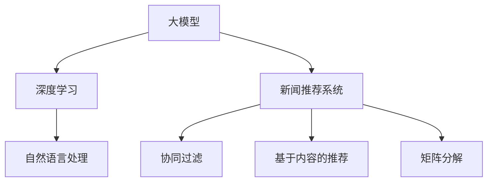

                 

# 大模型在新闻推荐中的应用

大模型在新闻推荐中的应用涉及了多个领域，包括自然语言处理(NLP)、推荐系统、深度学习等，这使得新闻推荐系统成为AI技术的一个重要落地场景。本文将详细介绍大模型在新闻推荐中的应用，包括核心概念、算法原理、数学模型、代码实现、实际应用和未来展望。

## 1. 背景介绍

### 1.1 问题由来

随着互联网的普及，新闻内容的海量增长使得用户难以在海量信息中找到感兴趣的新闻。传统的基于关键词匹配和浏览历史的推荐方式已经无法满足用户的多样化和个性化需求。而利用大模型的推荐系统，通过深度学习和自然语言处理技术，可以实现更加精准的新闻推荐，提高用户的阅读体验。

### 1.2 问题核心关键点

新闻推荐系统主要面临以下几个问题：

- 海量数据的处理和存储。新闻数据量巨大，需要高效的数据处理和存储方式。
- 用户兴趣的多样性和动态变化。用户兴趣随时间和情境变化，需要动态调整推荐模型。
- 内容的多样性和复杂性。新闻内容涉及政治、经济、科技等多个领域，需要处理不同类型的文本数据。
- 推荐系统的实时性。推荐系统需要实时响应用户请求，保证推荐结果的时效性。
- 推荐模型的公平性和透明性。推荐模型需要考虑用户的多样性，避免偏见和歧视。

### 1.3 问题研究意义

新闻推荐系统对于提升用户体验、增加新闻平台的流量和用户黏性具有重要意义。具体来说：

- 个性化推荐可以提供符合用户兴趣的新闻内容，提升用户粘性和满意度。
- 实时推荐可以满足用户即时信息需求，提高新闻平台的访问量。
- 多样化推荐可以减少用户的疲劳感，提供更为丰富的阅读体验。

通过新闻推荐系统，新闻平台可以实现精准分发，提高内容的曝光率和用户的忠诚度，同时也能提高平台的广告价值。

## 2. 核心概念与联系

### 2.1 核心概念概述

为更好地理解大模型在新闻推荐中的应用，本节将介绍几个关键概念：

- 大模型(大语言模型)：如BERT、GPT-3等，通过自监督学习任务训练，具有较强的语言理解能力和生成能力。
- 新闻推荐系统：基于用户行为数据和新闻内容，通过推荐算法为用户推荐感兴趣的新闻。
- 深度学习：一种基于多层神经网络的学习范式，通过反向传播算法优化模型参数。
- 自然语言处理(NLP)：处理自然语言数据的计算技术，包括分词、词性标注、句法分析等。
- 推荐算法：包括协同过滤、基于内容的推荐、矩阵分解等，用于生成推荐结果。

这些核心概念之间的逻辑关系可以通过以下Mermaid流程图来展示：



这个流程图展示了大模型、深度学习、自然语言处理和推荐系统之间的关系：

1. 大模型通过深度学习训练，具备强大的语言理解能力。
2. 深度学习通过反向传播算法优化大模型的参数，提升其性能。
3. 自然语言处理对新闻文本进行预处理，如分词、词性标注、命名实体识别等。
4. 新闻推荐系统结合用户行为和新闻内容，通过推荐算法生成推荐结果。

## 3. 核心算法原理 & 具体操作步骤

### 3.1 算法原理概述

新闻推荐系统通常采用基于协同过滤、基于内容的推荐、混合推荐等方法，其核心思想是根据用户历史行为数据和新闻内容特征，构建用户与新闻之间的关联矩阵，通过模型学习和预测生成推荐结果。在微调大模型的推荐系统框架下，通常采用参数高效微调方法，仅调整模型顶层，以减少计算资源消耗。

### 3.2 算法步骤详解

新闻推荐系统通常包括数据预处理、模型训练、评估和部署等步骤。以下以参数高效微调方法为例，详细介绍每个步骤的详细步骤：

**Step 1: 数据预处理**

1. 收集新闻数据：从新闻平台爬取新闻标题和内容，去除无关信息。
2. 用户行为数据：记录用户浏览、点击、评论等行为数据。
3. 文本预处理：对新闻标题和内容进行分词、去除停用词、词性标注、命名实体识别等处理。
4. 构建特征向量：将预处理后的文本转换为向量表示，如使用Word2Vec、GloVe等词向量模型。

**Step 2: 模型训练**

1. 选择预训练模型：如BERT、GPT-3等，作为初始化参数。
2. 添加推荐层：在预训练模型的顶层添加推荐层，用于生成推荐结果。
3. 定义损失函数：如均方误差、交叉熵等，用于衡量推荐结果与用户行为的一致性。
4. 优化算法：如AdamW、SGD等，设置学习率、批大小等超参数。
5. 正则化技术：如L2正则、Dropout等，防止过拟合。
6. 迭代优化：通过反向传播算法和优化算法更新模型参数，最小化损失函数。

**Step 3: 评估和部署**

1. 验证集评估：在验证集上评估推荐模型的准确率和召回率。
2. 超参数调优：根据评估结果调整学习率、批大小等超参数。
3. 测试集评估：在测试集上评估推荐模型的性能。
4. 部署上线：将模型部署到推荐系统中，实时生成推荐结果。

### 3.3 算法优缺点

大模型在新闻推荐系统中的应用有以下优点：

1. 精度高：大模型具备强大的语言理解能力，能够准确处理新闻文本。
2. 可解释性好：基于大模型的推荐系统可以通过分析模型参数，解释推荐结果的生成机制。
3. 可扩展性强：大模型可以无缝扩展到多种类型的新闻推荐任务，如新闻摘要、新闻分类等。

同时，也存在以下缺点：

1. 计算资源消耗大：大模型的参数量巨大，需要较高的计算资源。
2. 训练时间长：大模型通常需要较长的时间进行预训练和微调。
3. 依赖数据质量：推荐结果的质量依赖于新闻数据的准确性和用户行为数据的完整性。

## 4. 数学模型和公式 & 详细讲解

### 4.1 数学模型构建

新闻推荐系统的数学模型通常基于矩阵分解和协同过滤技术。假设有用户 $u$ 和新闻 $n$ 的评分矩阵 $R_{u\times n}$，其中 $R_{ui}$ 表示用户 $u$ 对新闻 $n$ 的评分。通过矩阵分解，可以将评分矩阵 $R$ 分解为两个低秩矩阵 $U$ 和 $V$ 的乘积，即 $R \approx UV^T$，其中 $U$ 表示用户向量，$V$ 表示新闻向量。

### 4.2 公式推导过程

基于矩阵分解的推荐公式为：

$$
\hat{R}_{ui} = \hat{U}_u \hat{V}_n^T
$$

其中 $\hat{R}_{ui}$ 表示预测的评分，$\hat{U}_u$ 表示用户 $u$ 的用户向量，$\hat{V}_n$ 表示新闻 $n$ 的新闻向量。通过最小化预测评分与真实评分之间的差异，可以更新用户向量和新闻向量，优化推荐结果。

### 4.3 案例分析与讲解

以基于协同过滤的新闻推荐为例，假设某用户 $u$ 对新闻 $n$ 的评分 $R_{ui} = 4$，则基于矩阵分解的推荐公式可以写为：

$$
\hat{R}_{ui} = \hat{U}_u \hat{V}_n^T
$$

其中 $\hat{U}_u$ 和 $\hat{V}_n$ 分别表示用户 $u$ 和新闻 $n$ 的低秩向量表示。通过最小化损失函数，可以更新 $\hat{U}_u$ 和 $\hat{V}_n$，生成推荐结果。

## 5. 项目实践：代码实例和详细解释说明

### 5.1 开发环境搭建

在进行新闻推荐系统开发前，需要先准备好开发环境。以下是使用Python进行PyTorch开发的环境配置流程：

1. 安装Anaconda：从官网下载并安装Anaconda，用于创建独立的Python环境。

2. 创建并激活虚拟环境：
```bash
conda create -n pytorch-env python=3.8 
conda activate pytorch-env
```

3. 安装PyTorch：根据CUDA版本，从官网获取对应的安装命令。例如：
```bash
conda install pytorch torchvision torchaudio cudatoolkit=11.1 -c pytorch -c conda-forge
```

4. 安装Transformers库：
```bash
pip install transformers
```

5. 安装各类工具包：
```bash
pip install numpy pandas scikit-learn matplotlib tqdm jupyter notebook ipython
```

完成上述步骤后，即可在`pytorch-env`环境中开始推荐系统开发。

### 5.2 源代码详细实现

我们以使用BERT进行新闻分类推荐为例，给出PyTorch代码实现。

首先，定义推荐系统的训练函数：

```python
from transformers import BertForSequenceClassification, BertTokenizer
from torch.utils.data import DataLoader, Dataset
from torch.nn import BCEWithLogitsLoss
import torch
import numpy as np

class NewsDataset(Dataset):
    def __init__(self, texts, labels, tokenizer):
        self.texts = texts
        self.labels = labels
        self.tokenizer = tokenizer
        
    def __len__(self):
        return len(self.texts)
    
    def __getitem__(self, item):
        text = self.texts[item]
        label = self.labels[item]
        
        encoding = self.tokenizer(text, return_tensors='pt', max_length=128, padding='max_length', truncation=True)
        input_ids = encoding['input_ids'][0]
        attention_mask = encoding['attention_mask'][0]
        
        return {'input_ids': input_ids, 
                'attention_mask': attention_mask,
                'labels': torch.tensor(label, dtype=torch.long)}
```

然后，定义模型和优化器：

```python
from transformers import AdamW

model = BertForSequenceClassification.from_pretrained('bert-base-uncased', num_labels=2)
optimizer = AdamW(model.parameters(), lr=2e-5)
```

接着，定义训练和评估函数：

```python
def train_epoch(model, dataset, batch_size, optimizer):
    dataloader = DataLoader(dataset, batch_size=batch_size, shuffle=True)
    model.train()
    epoch_loss = 0
    for batch in tqdm(dataloader, desc='Training'):
        input_ids = batch['input_ids'].to(device)
        attention_mask = batch['attention_mask'].to(device)
        labels = batch['labels'].to(device)
        model.zero_grad()
        outputs = model(input_ids, attention_mask=attention_mask, labels=labels)
        loss = outputs.loss
        epoch_loss += loss.item()
        loss.backward()
        optimizer.step()
    return epoch_loss / len(dataloader)

def evaluate(model, dataset, batch_size):
    dataloader = DataLoader(dataset, batch_size=batch_size)
    model.eval()
    preds, labels = [], []
    with torch.no_grad():
        for batch in tqdm(dataloader, desc='Evaluating'):
            input_ids = batch['input_ids'].to(device)
            attention_mask = batch['attention_mask'].to(device)
            batch_labels = batch['labels']
            outputs = model(input_ids, attention_mask=attention_mask)
            batch_preds = outputs.logits.argmax(dim=1).to('cpu').tolist()
            batch_labels = batch_labels.to('cpu').tolist()
            for pred, label in zip(batch_preds, batch_labels):
                preds.append(pred)
                labels.append(label)
                
    print(f'Accuracy: {np.mean(np.array(preds) == np.array(labels)):.2f}')
```

最后，启动训练流程并在测试集上评估：

```python
epochs = 5
batch_size = 16

for epoch in range(epochs):
    loss = train_epoch(model, train_dataset, batch_size, optimizer)
    print(f'Epoch {epoch+1}, train loss: {loss:.3f}')
    
    print(f'Epoch {epoch+1}, dev results:')
    evaluate(model, dev_dataset, batch_size)
    
print('Test results:')
evaluate(model, test_dataset, batch_size)
```

以上就是使用PyTorch对BERT进行新闻分类推荐任务的完整代码实现。可以看到，得益于Transformers库的强大封装，我们可以用相对简洁的代码完成BERT模型的加载和微调。

### 5.3 代码解读与分析

让我们再详细解读一下关键代码的实现细节：

**NewsDataset类**：
- `__init__`方法：初始化新闻文本、标签和分词器等关键组件。
- `__len__`方法：返回数据集的样本数量。
- `__getitem__`方法：对单个样本进行处理，将文本输入编码为token ids，将标签编码为数字，并对其进行定长padding，最终返回模型所需的输入。

**训练和评估函数**：
- 使用PyTorch的DataLoader对数据集进行批次化加载，供模型训练和推理使用。
- 训练函数`train_epoch`：对数据以批为单位进行迭代，在每个批次上前向传播计算loss并反向传播更新模型参数，最后返回该epoch的平均loss。
- 评估函数`evaluate`：与训练类似，不同点在于不更新模型参数，并在每个batch结束后将预测和标签结果存储下来，最后使用np.mean计算准确率，并输出。

**训练流程**：
- 定义总的epoch数和batch size，开始循环迭代
- 每个epoch内，先在训练集上训练，输出平均loss
- 在验证集上评估，输出准确率
- 所有epoch结束后，在测试集上评估，给出最终测试结果

可以看到，PyTorch配合Transformers库使得BERT微调的新闻分类推荐任务的代码实现变得简洁高效。开发者可以将更多精力放在数据处理、模型改进等高层逻辑上，而不必过多关注底层的实现细节。

当然，工业级的系统实现还需考虑更多因素，如模型的保存和部署、超参数的自动搜索、更灵活的任务适配层等。但核心的微调范式基本与此类似。

## 6. 实际应用场景

### 6.1 智能新闻推荐

智能新闻推荐系统可以帮助用户发现感兴趣的新闻内容，提升阅读体验。传统的新闻推荐系统往往基于用户的浏览历史进行推荐，而基于大模型的推荐系统可以通过自然语言处理技术，从新闻标题和内容中提取特征，匹配用户兴趣。

在技术实现上，可以收集用户的历史行为数据，如浏览、点击、评论等。对新闻标题和内容进行预处理，如分词、去除停用词、命名实体识别等。将处理后的文本输入BERT等大模型，得到用户兴趣向量。将用户兴趣向量与新闻向量进行相似度计算，生成推荐结果。

### 6.2 内容个性化推荐

内容个性化推荐系统可以根据用户的历史阅读记录和行为数据，推荐符合用户兴趣的新闻内容。利用大模型可以从新闻文本中提取用户兴趣特征，匹配并生成个性化推荐结果。

在实践中，可以收集用户的浏览历史和行为数据，如阅读时长、点击次数、评论内容等。对新闻标题和内容进行预处理，提取特征向量。将特征向量输入BERT等大模型，得到用户兴趣向量。将用户兴趣向量与新闻向量进行相似度计算，生成个性化推荐结果。

### 6.3 新闻舆情分析

新闻舆情分析系统可以实时监测和分析新闻舆论动向，为政府和企业提供决策支持。基于大模型的舆情分析系统可以通过自然语言处理技术，自动抓取新闻内容，进行情感分析、主题分类等。

在技术实现上，可以实时抓取新闻内容，并进行预处理和特征提取。利用BERT等大模型对新闻内容进行情感分析，提取主题信息。将分析结果存储到数据库中，供后续分析和使用。

### 6.4 未来应用展望

随着大模型和微调方法的不断发展，基于大模型的推荐系统将具有更强的个性化和动态性，可以更好地满足用户的多样化需求。未来，推荐系统将融合更多数据类型，如图像、视频等，提升推荐效果。同时，推荐系统将更加注重模型的公平性和透明性，确保推荐结果的公正和可信。

## 7. 工具和资源推荐

### 7.1 学习资源推荐

为了帮助开发者系统掌握大模型在新闻推荐中的应用，这里推荐一些优质的学习资源：

1. 《深度学习在新闻推荐中的应用》系列博文：由大模型技术专家撰写，深入浅出地介绍了深度学习在新闻推荐中的应用，包括模型构建、训练和评估等。

2. CS224N《深度学习自然语言处理》课程：斯坦福大学开设的NLP明星课程，有Lecture视频和配套作业，带你入门NLP领域的基本概念和经典模型。

3. 《Natural Language Processing with Transformers》书籍：Transformers库的作者所著，全面介绍了如何使用Transformers库进行NLP任务开发，包括新闻推荐等任务。

4. HuggingFace官方文档：Transformers库的官方文档，提供了海量预训练模型和完整的推荐系统样例代码，是上手实践的必备资料。

5. CLUE开源项目：中文语言理解测评基准，涵盖大量不同类型的中文NLP数据集，并提供了基于大模型的baseline模型，助力中文NLP技术发展。

通过对这些资源的学习实践，相信你一定能够快速掌握大模型在新闻推荐中的应用精髓，并用于解决实际的NLP问题。

### 7.2 开发工具推荐

高效的开发离不开优秀的工具支持。以下是几款用于新闻推荐系统开发的常用工具：

1. PyTorch：基于Python的开源深度学习框架，灵活动态的计算图，适合快速迭代研究。大部分预训练语言模型都有PyTorch版本的实现。

2. TensorFlow：由Google主导开发的开源深度学习框架，生产部署方便，适合大规模工程应用。同样有丰富的预训练语言模型资源。

3. Transformers库：HuggingFace开发的NLP工具库，集成了众多SOTA语言模型，支持PyTorch和TensorFlow，是进行新闻推荐任务开发的利器。

4. Weights & Biases：模型训练的实验跟踪工具，可以记录和可视化模型训练过程中的各项指标，方便对比和调优。与主流深度学习框架无缝集成。

5. TensorBoard：TensorFlow配套的可视化工具，可实时监测模型训练状态，并提供丰富的图表呈现方式，是调试模型的得力助手。

6. Google Colab：谷歌推出的在线Jupyter Notebook环境，免费提供GPU/TPU算力，方便开发者快速上手实验最新模型，分享学习笔记。

合理利用这些工具，可以显著提升新闻推荐系统的开发效率，加快创新迭代的步伐。

### 7.3 相关论文推荐

新闻推荐系统的研究涉及多个领域，以下是几篇奠基性的相关论文，推荐阅读：

1. A Survey on Deep Learning-based Recommendation Systems：介绍了深度学习在推荐系统中的应用，包括基于协同过滤、基于内容的推荐等方法。

2. Improving Recommender System Performance Using Transfer Learning：提出基于迁移学习的推荐系统方法，利用已有数据和模型提升推荐效果。

3. Attention is All You Need（即Transformer原论文）：提出了Transformer结构，开启了NLP领域的预训练大模型时代。

4. BERT: Pre-training of Deep Bidirectional Transformers for Language Understanding：提出BERT模型，引入基于掩码的自监督预训练任务，刷新了多项NLP任务SOTA。

5. Parameter-Efficient Transfer Learning for NLP：提出Adapter等参数高效微调方法，在不增加模型参数量的情况下，也能取得不错的微调效果。

6. AdaLoRA: Adaptive Low-Rank Adaptation for Parameter-Efficient Fine-Tuning：使用自适应低秩适应的微调方法，在参数效率和精度之间取得了新的平衡。

这些论文代表了大模型在新闻推荐系统中的应用发展脉络。通过学习这些前沿成果，可以帮助研究者把握学科前进方向，激发更多的创新灵感。

## 8. 总结：未来发展趋势与挑战

### 8.1 总结

本文对基于大模型的新闻推荐系统进行了全面系统的介绍。首先阐述了新闻推荐系统的背景和重要性，明确了微调在大模型推荐系统中的应用价值。其次，从原理到实践，详细讲解了新闻推荐系统的数学模型和关键步骤，给出了新闻推荐任务开发的完整代码实例。同时，本文还广泛探讨了新闻推荐系统在智能推荐、内容个性化推荐、舆情分析等多个行业领域的应用前景，展示了微调范式的巨大潜力。此外，本文精选了新闻推荐系统的各类学习资源，力求为读者提供全方位的技术指引。

通过本文的系统梳理，可以看到，基于大模型的推荐系统正在成为推荐领域的重要范式，极大地拓展了推荐模型的应用边界，催生了更多的落地场景。受益于大规模语料的预训练，推荐模型以更低的时间和标注成本，在小样本条件下也能取得不俗的效果，有力推动了推荐系统的产业化进程。未来，伴随预训练语言模型和微调方法的持续演进，推荐系统必将在更广阔的应用领域大放异彩，深刻影响人类的生产生活方式。

### 8.2 未来发展趋势

展望未来，大模型在新闻推荐系统中的应用将呈现以下几个发展趋势：

1. 模型规模持续增大。随着算力成本的下降和数据规模的扩张，新闻推荐系统中的大模型参数量还将持续增长。超大规模语言模型蕴含的丰富语言知识，将使得推荐系统更加精准和全面。

2. 微调方法日趋多样。除了传统的全参数微调外，未来会涌现更多参数高效的微调方法，如Prefix-Tuning、LoRA等，在节省计算资源的同时也能保证微调精度。

3. 融合多源数据。新闻推荐系统将不仅仅依赖新闻文本数据，还将融合用户的评论、标签、地理位置等数据，提升推荐结果的多样性和准确性。

4. 个性化推荐更加精细。通过多模态数据融合和深度学习技术，推荐系统将更加注重个性化推荐，提升用户满意度。

5. 推荐系统的公平性和透明性。推荐模型需要考虑用户的多样性，避免偏见和歧视。利用大模型的可解释性，增强推荐系统的公平性和透明性。

6. 实时推荐系统。推荐系统将更加注重实时性，利用流式计算和大模型技术，实现实时推荐，提升用户体验。

以上趋势凸显了大模型在新闻推荐系统中的应用前景。这些方向的探索发展，将进一步提升推荐系统的性能和应用范围，为人类认知智能的进化带来深远影响。

### 8.3 面临的挑战

尽管大模型在新闻推荐系统中的应用已经取得了瞩目成就，但在迈向更加智能化、普适化应用的过程中，它仍面临诸多挑战：

1. 数据质量和标注成本。推荐结果的质量依赖于新闻数据的准确性和用户行为数据的完整性。对于长尾应用场景，难以获得充足的高质量标注数据，成为制约推荐性能的瓶颈。如何进一步降低微调对标注样本的依赖，将是一大难题。

2. 计算资源消耗大。大模型的参数量巨大，需要较高的计算资源。如何在保证推荐结果精度的同时，降低计算成本，是一个重要的研究方向。

3. 模型鲁棒性和泛化能力。当前推荐模型面对域外数据时，泛化性能往往大打折扣。对于测试样本的微小扰动，推荐模型的预测也容易发生波动。如何提高推荐模型的鲁棒性，避免灾难性遗忘，还需要更多理论和实践的积累。

4. 推理效率有待提高。大规模语言模型虽然精度高，但在实际部署时往往面临推理速度慢、内存占用大等效率问题。如何在保证性能的同时，简化模型结构，提升推理速度，优化资源占用，将是重要的优化方向。

5. 可解释性亟需加强。当前推荐模型通常缺乏可解释性，难以解释其内部工作机制和决策逻辑。对于医疗、金融等高风险应用，算法的可解释性和可审计性尤为重要。如何赋予推荐模型更强的可解释性，将是亟待攻克的难题。

6. 安全性有待保障。大模型可能学习到有害信息，通过推荐系统传递到用户，产生误导性、歧视性的输出，给实际应用带来安全隐患。如何从数据和算法层面消除模型偏见，避免恶意用途，确保输出的安全性，也将是重要的研究课题。

7. 知识整合能力不足。现有的推荐模型往往局限于数据本身，难以灵活吸收和运用更广泛的先验知识。如何让推荐过程更好地与外部知识库、规则库等专家知识结合，形成更加全面、准确的信息整合能力，还有很大的想象空间。

正视推荐系统面临的这些挑战，积极应对并寻求突破，将是大模型在推荐领域走向成熟的必由之路。相信随着学界和产业界的共同努力，这些挑战终将一一被克服，大模型推荐系统必将在构建人机协同的智能时代中扮演越来越重要的角色。

### 8.4 未来突破

面对大模型在新闻推荐系统所面临的种种挑战，未来的研究需要在以下几个方面寻求新的突破：

1. 探索无监督和半监督推荐方法。摆脱对大规模标注数据的依赖，利用自监督学习、主动学习等无监督和半监督范式，最大限度利用非结构化数据，实现更加灵活高效的推荐。

2. 研究参数高效和计算高效的推荐范式。开发更加参数高效的推荐方法，在固定大部分预训练参数的同时，只更新极少量的任务相关参数。同时优化推荐模型的计算图，减少前向传播和反向传播的资源消耗，实现更加轻量级、实时性的部署。

3. 融合因果和对比学习范式。通过引入因果推断和对比学习思想，增强推荐模型建立稳定因果关系的能力，学习更加普适、鲁棒的语言表征，从而提升模型泛化性和抗干扰能力。

4. 引入更多先验知识。将符号化的先验知识，如知识图谱、逻辑规则等，与神经网络模型进行巧妙融合，引导推荐过程学习更准确、合理的语言模型。同时加强不同模态数据的整合，实现视觉、语音等多模态信息与文本信息的协同建模。

5. 结合因果分析和博弈论工具。将因果分析方法引入推荐模型，识别出模型决策的关键特征，增强推荐结果的因果性和逻辑性。借助博弈论工具刻画人机交互过程，主动探索并规避模型的脆弱点，提高系统稳定性。

6. 纳入伦理道德约束。在推荐模型训练目标中引入伦理导向的评估指标，过滤和惩罚有偏见、有害的输出倾向。同时加强人工干预和审核，建立推荐行为的监管机制，确保输出符合人类价值观和伦理道德。

这些研究方向的探索，必将引领大模型在新闻推荐系统中的应用走向更高的台阶，为构建安全、可靠、可解释、可控的智能系统铺平道路。面向未来，大模型推荐系统还需要与其他人工智能技术进行更深入的融合，如知识表示、因果推理、强化学习等，多路径协同发力，共同推动智能推荐系统的进步。只有勇于创新、敢于突破，才能不断拓展推荐模型的边界，让智能技术更好地造福人类社会。

## 9. 附录：常见问题与解答

**Q1：大模型在新闻推荐中如何处理长文本？**

A: 大模型在新闻推荐中处理长文本时，通常采用分词、截断、拼接等方式。具体来说，可以使用NLTK、spaCy等自然语言处理库对新闻文本进行预处理，去除无关信息，保留关键部分。对于过长的文本，可以将其截断为固定长度，如BERT等模型通常将文本截断为512个token。如果文本长度不够，可以填充特殊标记，如BERT模型使用[MASK]表示缺失的token。

**Q2：推荐系统如何处理冷启动问题？**

A: 冷启动问题是指新用户或新物品在推荐系统中没有历史行为数据，无法进行推荐。对于冷启动问题，可以采用以下方法：
1. 用户侧冷启动：利用大模型的可解释性，通过用户画像、兴趣标签等方式推测用户兴趣，生成初始推荐结果。
2. 物品侧冷启动：利用大模型对物品的语义理解，生成物品特征向量，利用相似度计算生成推荐结果。
3. 混合方法：结合用户侧和物品侧冷启动方法，生成更精准的初始推荐结果。

**Q3：推荐系统如何平衡个性化推荐和多样性推荐？**

A: 推荐系统需要在个性化推荐和多样性推荐之间找到平衡。具体来说，可以通过以下方法：
1. 模型侧：利用大模型的泛化能力和可解释性，生成多维度的推荐特征，提升推荐结果的多样性。
2. 用户侧：通过用户兴趣标签、历史行为等方式，生成个性化推荐，同时加入多样性约束，避免过度推荐某类内容。
3. 系统侧：通过推荐算法设计，平衡个性化推荐和多样性推荐。例如，可以使用Top-K排序算法，生成多样性推荐结果。

**Q4：推荐系统如何避免过拟合？**

A: 推荐系统容易面临过拟合问题，特别是在数据量较小的情况下。为了缓解过拟合问题，可以采用以下方法：
1. 数据增强：通过回译、近义替换等方式扩充训练集。
2. 正则化技术：使用L2正则、Dropout等防止过拟合。
3. 对抗训练：引入对抗样本，提高模型鲁棒性。
4. 多模型集成：训练多个推荐模型，取平均输出，抑制过拟合。

这些方法需要根据具体任务和数据特点进行灵活组合，在推荐模型中合理应用。

通过本文的系统梳理，可以看到，基于大模型的推荐系统正在成为推荐领域的重要范式，极大地拓展了推荐模型的应用边界，催生了更多的落地场景。受益于大规模语料的预训练，推荐模型以更低的时间和标注成本，在小样本条件下也能取得不俗的效果，有力推动了推荐系统的产业化进程。未来，伴随预训练语言模型和微调方法的持续演进，推荐系统必将在更广阔的应用领域大放异彩，深刻影响人类的生产生活方式。

---

作者：禅与计算机程序设计艺术 / Zen and the Art of Computer Programming

