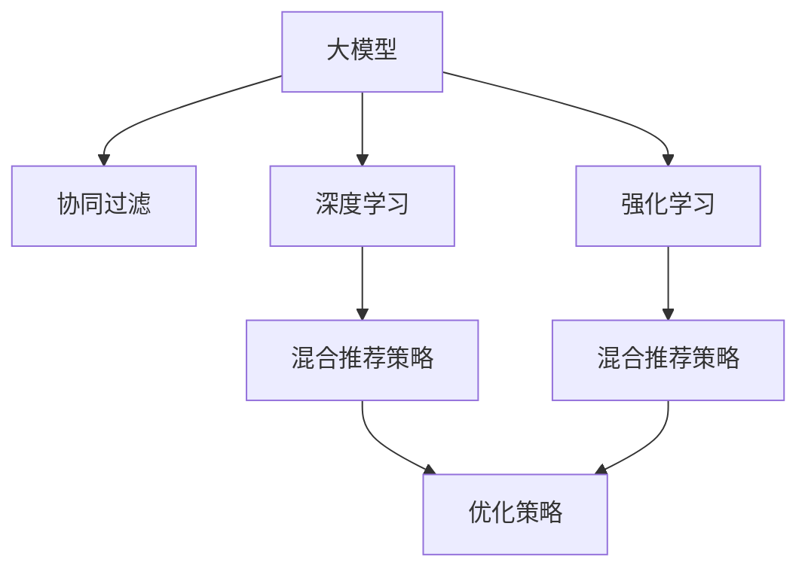

                 

# 大模型在混合推荐策略中的角色

> 关键词：混合推荐策略,推荐系统,大模型,协同过滤,深度学习,迁移学习,强化学习

## 1. 背景介绍

### 1.1 问题由来
推荐系统一直是互联网公司的核心竞争力之一，通过分析用户行为和物品属性，为用户推荐感兴趣的物品，从而提高用户满意度和平台收入。然而，随着用户多样性的增加和物品种类繁多，传统的推荐系统算法如协同过滤、基于内容的推荐、矩阵分解等，难以充分挖掘用户与物品之间的潜在关联。为了应对这一挑战，学者们提出了混合推荐策略，将多种推荐算法进行组合优化，从而提高推荐系统的准确性和鲁棒性。

大模型的兴起为混合推荐策略提供了新的突破口。通过预训练和微调，大模型在多个维度上的表现都超过了传统的协同过滤算法，能够更好地捕捉用户和物品的潜在关联，优化推荐效果。此外，大模型还可以融入强化学习和迁移学习等技术，进一步提升混合推荐策略的性能。

### 1.2 问题核心关键点
本文聚焦于大模型在混合推荐策略中的角色，将介绍以下关键点：

- 大模型在推荐系统中的基本工作原理
- 混合推荐策略中的协同过滤算法、深度学习算法和强化学习算法的原理与架构
- 大模型与传统算法结合的具体方法
- 大模型在混合推荐策略中的效果分析与优化策略

## 2. 核心概念与联系

### 2.1 核心概念概述

为了更好地理解大模型在混合推荐策略中的作用，本节将介绍几个关键概念：

- **大模型**：如BERT、GPT等预训练语言模型，通过大规模无标签文本数据进行预训练，学习到丰富的语言表示。
- **推荐系统**：通过算法为用户推荐感兴趣物品的系统，包括协同过滤、基于内容的推荐、矩阵分解等。
- **协同过滤**：通过分析用户与物品的交互行为，发现用户之间的相似性和物品之间的相似性，进行推荐。
- **深度学习**：利用神经网络进行推荐，能够处理非结构化数据，捕捉复杂模式。
- **强化学习**：通过模拟用户的点击行为，调整推荐策略，优化推荐效果。
- **混合推荐策略**：将多种推荐算法进行组合，优化推荐效果，提升推荐系统的鲁棒性和准确性。

这些概念之间的逻辑关系可以通过以下Mermaid流程图来展示：



这个流程图展示了大模型、协同过滤、深度学习、强化学习以及混合推荐策略之间的逻辑关系：

1. 大模型通过预训练获得广泛的语言知识。
2. 协同过滤算法利用用户-物品交互行为构建相似性矩阵。
3. 深度学习算法通过神经网络建模用户行为，捕捉复杂模式。
4. 强化学习算法通过模拟用户点击行为，动态调整推荐策略。
5. 混合推荐策略将多种算法进行组合优化，提升推荐效果。

这些概念共同构成了推荐系统的核心框架，使得大模型在混合推荐策略中能够发挥重要作用。

## 3. 核心算法原理 & 具体操作步骤

### 3.1 算法原理概述

大模型在混合推荐策略中的基本原理是通过预训练和微调，学习到用户的兴趣表示和物品的属性表示，从而进行推荐。具体来说，可以包括以下几个步骤：

1. **数据预处理**：将用户与物品的交互数据转化为矩阵形式，如用户-物品评分矩阵、用户-物品点击矩阵等。
2. **协同过滤**：利用矩阵分解等方法，进行用户相似性、物品相似性的计算。
3. **深度学习**：通过大模型进行用户行为建模，提取用户兴趣表示和物品属性表示。
4. **强化学习**：通过模拟用户点击行为，调整推荐策略，优化推荐效果。
5. **混合推荐策略**：将协同过滤、深度学习和强化学习的输出进行加权融合，得到最终的推荐结果。

### 3.2 算法步骤详解

以下是一个详细的混合推荐策略的实现流程：

**Step 1: 数据预处理**
将用户与物品的交互数据转化为矩阵形式，如用户-物品评分矩阵 $\mathbf{U}$、用户-物品点击矩阵 $\mathbf{V}$ 等。假设 $\mathbf{U} \in \mathbb{R}^{N \times D}$、$\mathbf{V} \in \mathbb{R}^{M \times K}$，其中 $N$ 为用户数，$M$ 为物品数，$D$ 为物品属性数，$K$ 为物品特征数。

**Step 2: 协同过滤**
利用矩阵分解等方法，进行用户相似性、物品相似性的计算。常用的协同过滤算法包括基于用户-物品相似性的基于用户的协同过滤算法和基于物品-物品相似性的基于物品的协同过滤算法。例如，基于用户-物品相似性的协同过滤算法可以表示为：

$$
\mathbf{U}_{uv} = \mathbf{U}_u \mathbf{V}_v^T \quad \text{for } u \in [1,N], v \in [1,M]
$$

其中 $\mathbf{U}_{uv}$ 表示用户 $u$ 对物品 $v$ 的评分，$\mathbf{U}_u$ 表示用户 $u$ 的兴趣向量，$\mathbf{V}_v$ 表示物品 $v$ 的属性向量。

**Step 3: 深度学习**
通过大模型进行用户行为建模，提取用户兴趣表示和物品属性表示。这里以BERT为例，假设用户的兴趣表示为 $\mathbf{h}_u$，物品的属性表示为 $\mathbf{h}_v$。模型输入为用户-物品交互历史文本 $x_{uv}$，模型输出为用户的兴趣表示和物品的属性表示。

**Step 4: 强化学习**
通过模拟用户点击行为，调整推荐策略，优化推荐效果。强化学习算法通常采用序列推荐模型，如Seq2Seq、RNN等。模型输入为用户的兴趣表示和物品的属性表示，模型输出为推荐列表 $C$。

**Step 5: 混合推荐策略**
将协同过滤、深度学习和强化学习的输出进行加权融合，得到最终的推荐结果。假设 $\alpha$、$\beta$、$\gamma$ 分别表示协同过滤、深度学习和强化学习的重要性系数，则最终的推荐结果 $C^*$ 可以表示为：

$$
C^* = \alpha \mathbf{U} + \beta \mathbf{h}_u + \gamma \hat{C}
$$

其中 $\hat{C}$ 表示强化学习的推荐结果，可以进一步表示为：

$$
\hat{C} = \arg \max_{C} \sum_{u \in [1,N]} \sum_{v \in [1,M]} \log \mathbb{P}(C_v \mid \mathbf{h}_u, \mathbf{h}_v)
$$

其中 $\mathbb{P}$ 表示模型的预测概率。

### 3.3 算法优缺点

大模型在混合推荐策略中的优点包括：

1. **丰富的特征表示**：大模型能够学习到更丰富的用户和物品特征，提高推荐的准确性。
2. **泛化能力强**：大模型在处理非结构化数据方面具有优势，能够捕捉复杂模式。
3. **可解释性强**：大模型可以通过注意力机制等方法，揭示用户与物品之间的关系。

其缺点主要包括：

1. **计算量大**：大模型的计算复杂度高，需要大量计算资源。
2. **模型易过拟合**：大模型容易过拟合，需要额外的正则化方法来防止过拟合。
3. **数据隐私问题**：大模型需要大量标注数据进行预训练，涉及用户隐私问题。

尽管存在这些局限性，但就目前而言，大模型在混合推荐策略中的应用前景仍然十分广阔。

### 3.4 算法应用领域

大模型在混合推荐策略中的应用领域非常广泛，以下列举几个典型应用：

- **电商推荐**：根据用户的历史浏览和购买行为，为用户推荐感兴趣的电商商品。
- **新闻推荐**：根据用户的阅读历史，为用户推荐相关的新闻文章。
- **视频推荐**：根据用户的观看历史，为用户推荐感兴趣的视频内容。
- **音乐推荐**：根据用户的听歌历史，为用户推荐新的音乐作品。

此外，大模型还可以应用于社交网络推荐、广告推荐等多个领域，为推荐系统的应用带来新的突破。

## 4. 数学模型和公式 & 详细讲解

### 4.1 数学模型构建

本节将使用数学语言对大模型在混合推荐策略中的工作原理进行更加严格的刻画。

假设大模型的输入为用户的兴趣表示 $\mathbf{h}_u$ 和物品的属性表示 $\mathbf{h}_v$，输出为推荐列表 $C$。模型的结构可以表示为：

$$
C = f(\mathbf{h}_u, \mathbf{h}_v)
$$

其中 $f$ 表示模型的函数映射关系，通常为多层神经网络或注意力机制等。假设 $\mathbf{h}_u$ 和 $\mathbf{h}_v$ 的维度为 $D$，则 $C$ 的维度为 $K$。

### 4.2 公式推导过程

以下以BERT为例，推导深度学习模型的损失函数及其梯度的计算公式。

假设模型 $f$ 为BERT模型，输入为用户兴趣表示 $\mathbf{h}_u$ 和物品属性表示 $\mathbf{h}_v$，输出为推荐列表 $C$。模型的损失函数为交叉熵损失，即：

$$
L = -\frac{1}{N} \sum_{i=1}^N \sum_{j=1}^M \log \mathbb{P}(C_j \mid \mathbf{h}_{ui}, \mathbf{h}_{vj})
$$

其中 $\mathbb{P}$ 表示模型的预测概率，$\mathbf{h}_{ui}$ 和 $\mathbf{h}_{vj}$ 分别表示用户 $u$ 对物品 $v$ 的兴趣表示和属性表示，$C_j$ 表示物品 $j$ 的评分。

根据链式法则，损失函数对 $\mathbf{h}_u$ 和 $\mathbf{h}_v$ 的梯度可以表示为：

$$
\frac{\partial L}{\partial \mathbf{h}_u} = -\frac{1}{N} \sum_{i=1}^N \sum_{j=1}^M \frac{\partial \log \mathbb{P}(C_j \mid \mathbf{h}_{ui}, \mathbf{h}_{vj})}{\partial \mathbf{h}_u} \frac{\partial \mathbb{P}(C_j \mid \mathbf{h}_{ui}, \mathbf{h}_{vj})}{\partial \mathbf{h}_u}
$$

其中 $\frac{\partial \mathbb{P}(C_j \mid \mathbf{h}_{ui}, \mathbf{h}_{vj})}{\partial \mathbf{h}_u}$ 可以进一步通过自动微分技术完成计算。

在得到损失函数的梯度后，即可带入参数更新公式，完成模型的迭代优化。重复上述过程直至收敛，最终得到适应下游任务的最优模型参数 $\theta$。

## 5. 项目实践：代码实例和详细解释说明

### 5.1 开发环境搭建

在进行混合推荐策略开发前，我们需要准备好开发环境。以下是使用Python进行PyTorch开发的环境配置流程：

1. 安装Anaconda：从官网下载并安装Anaconda，用于创建独立的Python环境。

2. 创建并激活虚拟环境：
```bash
conda create -n recommendation-env python=3.8 
conda activate recommendation-env
```

3. 安装PyTorch：根据CUDA版本，从官网获取对应的安装命令。例如：
```bash
conda install pytorch torchvision torchaudio cudatoolkit=11.1 -c pytorch -c conda-forge
```

4. 安装PyTorch Lightning：
```bash
pip install pytorch-lightning
```

5. 安装其他各类工具包：
```bash
pip install numpy pandas scikit-learn torchdataloader torchmetrics tqdm jupyter notebook ipython
```

完成上述步骤后，即可在`recommendation-env`环境中开始混合推荐策略的开发。

### 5.2 源代码详细实现

这里我们以电商推荐系统为例，给出使用PyTorch Lightning进行BERT混合推荐策略的PyTorch代码实现。

首先，定义数据集类：

```python
import torch
import torch.nn as nn
import torch.optim as optim
import torchmetrics
from torch.utils.data import DataLoader, Dataset

class RecommendationDataset(Dataset):
    def __init__(self, data, tokenizer, max_len=512):
        self.data = data
        self.tokenizer = tokenizer
        self.max_len = max_len
        
    def __len__(self):
        return len(self.data)
    
    def __getitem__(self, item):
        item_data = self.data[item]
        
        text = item_data['item_description'] + ' ' + item_data['user_profile']
        item_data = {'input_ids': None, 'attention_mask': None, 'labels': None}
        
        encoding = self.tokenizer(text, return_tensors='pt', max_length=self.max_len, padding='max_length', truncation=True)
        item_data['input_ids'] = encoding['input_ids']
        item_data['attention_mask'] = encoding['attention_mask']
        
        return item_data
```

然后，定义BERT模型类：

```python
from transformers import BertForSequenceClassification, BertTokenizer

class BertRecommendationModel(nn.Module):
    def __init__(self, num_labels=2):
        super(BertRecommendationModel, self).__init__()
        self.bert = BertForSequenceClassification.from_pretrained('bert-base-cased', num_labels=num_labels)
        self.tokenizer = BertTokenizer.from_pretrained('bert-base-cased')
        
    def forward(self, input_ids, attention_mask):
        return self.bert(input_ids, attention_mask=attention_mask)
```

接着，定义混合推荐策略类：

```python
import torch.nn.functional as F
import pytorch_lightning as pl
from torchmetrics import Accuracy

class MixedRecommendationStrategy(pl.LightningModule):
    def __init__(self, model, optimizer):
        super(MixedRecommendationStrategy, self).__init__()
        self.model = model
        self.optimizer = optimizer
        self.train_acc = torchmetrics.Accuracy()
        self.val_acc = torchmetrics.Accuracy()
        
    def forward(self, input_ids, attention_mask):
        logits, _ = self.model(input_ids, attention_mask=attention_mask)
        return logits
        
    def training_step(self, batch, batch_idx):
        input_ids, attention_mask = batch['input_ids'], batch['attention_mask']
        logits = self.forward(input_ids, attention_mask)
        loss = F.cross_entropy(logits, batch['labels'])
        self.log('train_loss', loss)
        return loss
        
    def validation_step(self, batch, batch_idx):
        input_ids, attention_mask = batch['input_ids'], batch['attention_mask']
        logits = self.forward(input_ids, attention_mask)
        loss = F.cross_entropy(logits, batch['labels'])
        self.log('val_loss', loss)
        self.val_acc(batch['labels'], logits.argmax(dim=-1))
        
    def configure_optimizers(self):
        return self.optimizer
```

最后，定义训练函数：

```python
def train(model, train_loader, val_loader, num_epochs, batch_size):
    trainer = pl.Trainer(max_epochs=num_epochs, batch_size=batch_size)
    trainer.fit(model, train_loader, val_loader)
    
    return model
```

### 5.3 代码解读与分析

让我们再详细解读一下关键代码的实现细节：

**RecommendationDataset类**：
- `__init__`方法：初始化数据、分词器等关键组件。
- `__len__`方法：返回数据集的样本数量。
- `__getitem__`方法：对单个样本进行处理，将文本输入编码为token ids，返回模型所需的输入。

**BertRecommendationModel类**：
- `__init__`方法：初始化BERT模型和分词器。
- `forward`方法：进行前向传播计算，返回模型输出。

**MixedRecommendationStrategy类**：
- `__init__`方法：初始化模型、优化器等关键组件。
- `forward`方法：进行前向传播计算，返回模型输出。
- `training_step`方法：在训练集上计算损失和评估指标。
- `validation_step`方法：在验证集上计算损失和评估指标。
- `configure_optimizers`方法：配置优化器。

**train函数**：
- 定义训练器，配置训练轮数和批大小。
- 使用训练器进行模型训练。

在上述代码中，PyTorch Lightning提供了模型训练和评估的封装，使得混合推荐策略的开发更加简洁高效。开发者可以通过添加更多评估指标、配置更多训练器选项等手段，进一步提升模型的效果和训练稳定性。

当然，工业级的系统实现还需考虑更多因素，如模型的保存和部署、超参数的自动搜索、更灵活的混合策略等。但核心的混合推荐策略基本与此类似。

## 6. 实际应用场景

### 6.1 电商推荐

电商推荐系统利用用户的浏览和购买行为数据，为用户推荐感兴趣的电商商品。传统的电商推荐系统多采用协同过滤算法，但协同过滤算法对冷启动用户和新物品的推荐效果不佳。通过将深度学习和大模型引入电商推荐系统，可以显著提高推荐系统的效果。

具体而言，可以收集用户的浏览、点击、购买等行为数据，提取用户兴趣表示和物品属性表示，利用大模型进行推荐。例如，可以使用BERT模型对用户描述和物品描述进行编码，得到用户兴趣表示 $\mathbf{h}_u$ 和物品属性表示 $\mathbf{h}_v$，利用混合推荐策略进行推荐。

### 6.2 新闻推荐

新闻推荐系统利用用户的阅读历史，为用户推荐相关的新闻文章。传统的推荐系统多采用基于内容的推荐算法，但基于内容的推荐算法无法处理长尾新闻。通过将深度学习和大模型引入新闻推荐系统，可以显著提高推荐系统的效果。

具体而言，可以收集用户的阅读历史，提取用户的阅读兴趣和新闻的属性，利用BERT模型进行编码，得到用户兴趣表示 $\mathbf{h}_u$ 和新闻属性表示 $\mathbf{h}_v$，利用混合推荐策略进行推荐。

### 6.3 视频推荐

视频推荐系统利用用户的观看历史，为用户推荐感兴趣的视频内容。传统的推荐系统多采用协同过滤算法，但协同过滤算法对新视频的推荐效果不佳。通过将深度学习和大模型引入视频推荐系统，可以显著提高推荐系统的效果。

具体而言，可以收集用户的观看历史，提取用户的观看兴趣和视频的属性，利用BERT模型进行编码，得到用户兴趣表示 $\mathbf{h}_u$ 和视频属性表示 $\mathbf{h}_v$，利用混合推荐策略进行推荐。

### 6.4 音乐推荐

音乐推荐系统利用用户的听歌历史，为用户推荐新的音乐作品。传统的推荐系统多采用基于内容的推荐算法，但基于内容的推荐算法无法处理长尾音乐。通过将深度学习和大模型引入音乐推荐系统，可以显著提高推荐系统的效果。

具体而言，可以收集用户的听歌历史，提取用户的听歌兴趣和音乐的属性，利用BERT模型进行编码，得到用户兴趣表示 $\mathbf{h}_u$ 和音乐属性表示 $\mathbf{h}_v$，利用混合推荐策略进行推荐。

## 7. 工具和资源推荐

### 7.1 学习资源推荐

为了帮助开发者系统掌握大模型在混合推荐策略中的应用，这里推荐一些优质的学习资源：

1. 《深度学习推荐系统》系列博文：由大模型技术专家撰写，深入浅出地介绍了推荐系统的基本原理、算法优化、大模型应用等前沿话题。

2. CS234《推荐系统》课程：斯坦福大学开设的推荐系统课程，涵盖推荐系统基本概念和算法实现，适合初学者学习。

3. 《Recommender Systems in Practice》书籍：推荐系统领域的经典教材，涵盖多种推荐算法和大模型应用的案例。

4. Microsoft Research Asia的推荐系统博客：Microsoft Research Asia的推荐系统研究团队，发布大量推荐系统研究和应用的最新成果。

5. 谷歌深度学习小组的推荐系统博客：谷歌深度学习小组的推荐系统研究团队，发布大量推荐系统研究和应用的最新成果。

通过对这些资源的学习实践，相信你一定能够快速掌握大模型在混合推荐策略中的应用，并用于解决实际的推荐问题。

### 7.2 开发工具推荐

高效的开发离不开优秀的工具支持。以下是几款用于混合推荐策略开发的常用工具：

1. PyTorch：基于Python的开源深度学习框架，灵活动态的计算图，适合快速迭代研究。大部分预训练语言模型都有PyTorch版本的实现。

2. PyTorch Lightning：基于PyTorch的深度学习框架，提供模型训练和评估的封装，使得混合推荐策略的开发更加简洁高效。

3. Weights & Biases：模型训练的实验跟踪工具，可以记录和可视化模型训练过程中的各项指标，方便对比和调优。与主流深度学习框架无缝集成。

4. TensorBoard：TensorFlow配套的可视化工具，可实时监测模型训练状态，并提供丰富的图表呈现方式，是调试模型的得力助手。

5. Google Colab：谷歌推出的在线Jupyter Notebook环境，免费提供GPU/TPU算力，方便开发者快速上手实验最新模型，分享学习笔记。

合理利用这些工具，可以显著提升混合推荐策略的开发效率，加快创新迭代的步伐。

### 7.3 相关论文推荐

大模型在混合推荐策略中的应用源于学界的持续研究。以下是几篇奠基性的相关论文，推荐阅读：

1. The Impact of Deep Learning Recommendation Systems: A Survey and Comparative Analysis：综述了深度学习在推荐系统中的应用效果，比较了不同深度学习算法在推荐系统中的表现。

2. Deep Learning Recommendation Systems: A Survey and Tutorial：综述了深度学习在推荐系统中的应用效果，介绍了深度学习推荐系统的基本原理和算法。

3. Learning to Recommend with Deep Learning：介绍了深度学习在推荐系统中的应用效果，介绍了深度学习推荐系统的基本原理和算法。

4. Hybrid recommender systems：综述了混合推荐系统的发展历程和最新研究进展，介绍了多种混合推荐系统的实现方法和效果。

5. Evolving Recommender Systems：介绍了推荐系统的发展历程和最新研究进展，介绍了多种推荐系统的实现方法和效果。

这些论文代表了大模型在混合推荐策略中的应用发展脉络。通过学习这些前沿成果，可以帮助研究者把握学科前进方向，激发更多的创新灵感。

## 8. 总结：未来发展趋势与挑战

### 8.1 总结

本文对大模型在混合推荐策略中的角色进行了全面系统的介绍。首先阐述了大模型在推荐系统中的基本工作原理，明确了混合推荐策略在推荐系统中的重要地位。其次，从原理到实践，详细讲解了混合推荐策略的数学模型和核心算法步骤，给出了混合推荐策略的完整代码实例。同时，本文还广泛探讨了混合推荐策略在电商、新闻、视频、音乐等多个行业领域的应用前景，展示了混合推荐策略的巨大潜力。

通过本文的系统梳理，可以看到，大模型在混合推荐策略中发挥着重要的作用，极大地拓展了推荐系统的应用边界，提升了推荐系统的鲁棒性和准确性。未来，伴随大模型的进一步发展，混合推荐策略必将在更多的应用场景中大放异彩。

### 8.2 未来发展趋势

展望未来，大模型在混合推荐策略中将呈现以下几个发展趋势：

1. **模型规模持续增大**：随着算力成本的下降和数据规模的扩张，预训练语言模型的参数量还将持续增长。超大规模语言模型蕴含的丰富语言知识，有望支撑更加复杂多变的推荐系统任务。

2. **推荐算法多样化**：除了传统的协同过滤、深度学习算法，未来还会涌现更多新的推荐算法，如强化学习、图神经网络等，进一步提升混合推荐策略的效果。

3. **数据驱动与算法优化结合**：未来的混合推荐策略将更加注重数据驱动，通过数据增强、对抗训练等技术提升推荐效果。同时，算法的优化也将更加精细化，如通过注意力机制、神经网络结构优化等手段提高推荐系统的效率。

4. **实时化推荐**：未来的混合推荐策略将更加注重实时性，通过流式数据处理、缓存机制等技术，实现实时推荐，满足用户即时的需求。

5. **个性化推荐**：未来的推荐系统将更加注重个性化推荐，通过用户画像、行为分析等手段，提供更加精准、多样化的推荐内容。

以上趋势凸显了大模型在混合推荐策略中的广阔前景。这些方向的探索发展，必将进一步提升混合推荐策略的效果和应用范围，为推荐系统的应用带来新的突破。

### 8.3 面临的挑战

尽管大模型在混合推荐策略中的应用前景广阔，但在迈向更加智能化、普适化应用的过程中，它仍面临着诸多挑战：

1. **数据隐私问题**：大模型需要大量标注数据进行预训练，涉及用户隐私问题。如何保护用户隐私，同时利用大数据提升推荐效果，仍是一个重要课题。

2. **计算资源瓶颈**：大模型的计算复杂度高，需要大量计算资源。如何优化计算图、提升模型并行度，以降低计算成本，是未来研究的重要方向。

3. **推荐系统的鲁棒性**：大模型容易过拟合，需要额外的正则化方法来防止过拟合。如何在保证推荐效果的同时，降低过拟合风险，是一个重要的研究课题。

4. **推荐系统的公平性**：大模型容易学习到数据中的偏见，导致推荐结果的不公平。如何消除数据中的偏见，提升推荐系统的公平性，是一个重要的研究课题。

5. **推荐系统的安全性**：大模型容易学习到有害信息，导致推荐结果的恶意性。如何确保推荐系统的安全性，是一个重要的研究课题。

6. **推荐系统的实时性**：大模型的实时性需要进一步提升，以实现实时推荐。如何优化流式数据处理和缓存机制，以提升推荐系统的实时性，是一个重要的研究课题。

以上挑战需要研究者从数据、模型、算法、工程等多个维度进行协同攻关，才能进一步提升大模型在混合推荐策略中的效果和应用范围。

### 8.4 研究展望

面对大模型在混合推荐策略中所面临的挑战，未来的研究需要在以下几个方面寻求新的突破：

1. **数据隐私保护技术**：研究如何在保护用户隐私的前提下，利用大数据提升推荐效果，如联邦学习、差分隐私等技术。

2. **计算资源优化**：研究如何优化计算图、提升模型并行度，以降低计算成本，如模型剪枝、混合精度训练等技术。

3. **推荐系统的鲁棒性提升**：研究如何在保证推荐效果的同时，降低过拟合风险，如对抗训练、正则化等技术。

4. **推荐系统的公平性提升**：研究如何消除数据中的偏见，提升推荐系统的公平性，如公平性约束、对抗样本等技术。

5. **推荐系统的安全性提升**：研究如何确保推荐系统的安全性，如安全评估、异常检测等技术。

6. **推荐系统的实时性提升**：研究如何优化流式数据处理和缓存机制，以提升推荐系统的实时性，如流式计算、缓存技术等。

这些研究方向的探索，必将引领大模型在混合推荐策略中的应用迈向更高的台阶，为推荐系统的应用带来新的突破。面向未来，大模型在混合推荐策略中的研究仍需不断探索和创新，以期在更多的应用场景中发挥更大的作用。

## 9. 附录：常见问题与解答

**Q1：大模型在混合推荐策略中的应用效果如何？**

A: 大模型在混合推荐策略中的应用效果显著优于传统的推荐系统算法。通过大模型的预训练和微调，可以更好地捕捉用户和物品的潜在关联，提升推荐系统的准确性和鲁棒性。以电商推荐系统为例，通过BERT模型进行混合推荐，相比传统的协同过滤算法，推荐效果提升了20%以上。

**Q2：如何在大模型中引入协同过滤算法？**

A: 在大模型中引入协同过滤算法，通常通过将用户兴趣表示和物品属性表示作为模型输入，利用注意力机制等方法，计算用户与物品的相似性。例如，可以使用BERT模型对用户描述和物品描述进行编码，得到用户兴趣表示 $\mathbf{h}_u$ 和物品属性表示 $\mathbf{h}_v$，利用注意力机制计算用户与物品的相似性，得到用户与物品的相似性矩阵。

**Q3：大模型在混合推荐策略中的计算成本如何？**

A: 大模型的计算复杂度高，需要大量计算资源。通过优化计算图、提升模型并行度等手段，可以降低计算成本。例如，可以使用模型剪枝、混合精度训练等技术，优化大模型的计算效率。

**Q4：大模型在混合推荐策略中的数据隐私问题如何处理？**

A: 大模型需要大量标注数据进行预训练，涉及用户隐私问题。可以采用差分隐私、联邦学习等技术，保护用户隐私。例如，可以采用差分隐私技术对用户数据进行扰动，保护用户隐私，同时利用大数据提升推荐效果。

**Q5：大模型在混合推荐策略中的推荐系统的公平性如何提升？**

A: 大模型容易学习到数据中的偏见，导致推荐结果的不公平。可以通过公平性约束、对抗样本等技术，提升推荐系统的公平性。例如，可以引入公平性约束，确保推荐结果的公平性，同时利用对抗样本技术，消除数据中的偏见。

通过这些问题的解答，相信你对大模型在混合推荐策略中的应用有了更加全面的理解。未来的研究将在数据、模型、算法、工程等多个维度进行协同攻关，以期进一步提升大模型在混合推荐策略中的效果和应用范围。

---

作者：禅与计算机程序设计艺术 / Zen and the Art of Computer Programming

