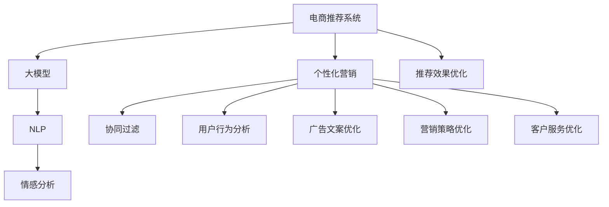

                 

# 大模型在电商平台个性化营销中的应用

> 关键词：电商推荐系统, 个性化营销, 大模型, 深度学习, 用户行为分析, 协同过滤, 自然语言处理

## 1. 背景介绍

### 1.1 问题由来
随着互联网的普及和电子商务的迅猛发展，电商平台已经成为了人们日常购物的重要渠道。然而，由于商品种类繁多、用户需求复杂，传统电商推荐系统往往难以精准地匹配用户需求，导致用户体验不佳、转化率低。为此，电商平台需要引入更加智能化的个性化营销技术，以提升用户体验和销售转化率。

大模型，特别是大语言模型和大规模预训练模型，由于其强大的语言理解和生成能力，在电商推荐系统的构建中扮演了重要角色。通过在大规模电商数据上进行预训练，大模型能够学习到丰富的商品描述、用户行为、交易记录等语义信息，从而在个性化推荐、广告投放、营销策略优化等方面展现出卓越的表现。

### 1.2 问题核心关键点
大模型在电商平台个性化营销中的应用，主要体现在以下几个方面：

1. **推荐系统优化**：利用大模型的语言理解和生成能力，改进电商推荐系统的推荐效果。
2. **广告投放优化**：结合大模型的自然语言处理能力，提升电商广告的文案撰写和投放效果。
3. **营销策略优化**：借助大模型的用户行为分析和情感分析能力，优化电商营销策略，提升用户转化率。
4. **客户服务优化**：利用大模型的自然语言处理能力，提升电商平台的客户服务水平。

### 1.3 问题研究意义
大模型在电商平台个性化营销中的应用，对于提升电商平台的用户体验、促进交易转化、优化营销策略具有重要意义：

1. **提升用户体验**：通过个性化推荐，帮助用户快速找到感兴趣的商品，缩短浏览时间，提升购物满意度。
2. **提高转化率**：个性化营销能够根据用户行为和偏好，精准地展示相关商品，提高用户购买意愿和转化率。
3. **优化营销策略**：通过深入分析用户行为和反馈，优化广告文案和投放策略，提高广告点击率和转化率。
4. **降低运营成本**：个性化推荐可以减少无效展示和点击，降低广告投放成本，提高广告投入产出比。
5. **增强客户黏性**：高质量的个性化推荐和广告，能够增强用户对平台的依赖和黏性，增加复购率。

## 2. 核心概念与联系

### 2.1 核心概念概述

为更好地理解大模型在电商平台个性化营销中的应用，本节将介绍几个密切相关的核心概念：

- **电商推荐系统(e-Commerce Recommendation System)**：通过分析用户行为和商品属性，向用户推荐最相关的商品，提升用户体验和交易转化率。
- **个性化营销(Personalized Marketing)**：针对不同用户的特定需求和偏好，定制化的营销策略，提升广告效果和用户满意度。
- **大模型(Large Model)**：指具有大规模参数量的深度学习模型，如BERT、GPT-3等。
- **自然语言处理(Natural Language Processing, NLP)**：利用计算机技术处理、理解和生成人类语言，包括文本分类、情感分析、命名实体识别等任务。
- **协同过滤(Collaborative Filtering)**：一种基于用户行为和商品相似性进行推荐的技术。
- **用户行为分析(User Behavior Analysis)**：分析用户的历史行为数据，挖掘用户偏好和需求，为个性化营销提供数据支持。
- **情感分析(Sentiment Analysis)**：利用自然语言处理技术，分析用户对商品或服务的情感倾向，优化营销策略。

这些核心概念之间的逻辑关系可以通过以下Mermaid流程图来展示：



这个流程图展示了大模型在电商平台个性化营销中的核心概念及其之间的关系：

1. 大模型通过预训练学习到商品描述、用户行为等语义信息。
2. 在电商推荐系统中，通过大模型的语言理解和生成能力，改进推荐效果。
3. 在个性化营销中，结合大模型的自然语言处理能力，优化广告文案和营销策略。
4. 利用大模型的用户行为分析和情感分析能力，进一步提升推荐和营销效果。

## 3. 核心算法原理 & 具体操作步骤
### 3.1 算法原理概述

大模型在电商平台个性化营销中的应用，本质上是一种基于自然语言处理和深度学习的个性化推荐和营销优化过程。其核心思想是：将大模型作为强大的“特征提取器”，通过分析电商平台上大量的用户行为数据和商品描述数据，学习用户偏好和商品特征，进而根据这些特征生成个性化的推荐和营销方案。

形式化地，假设电商平台的大模型为 $M_{\theta}$，其中 $\theta$ 为大模型预训练得到的参数。给定电商平台的商品描述数据集 $D=\{(x_i, y_i)\}_{i=1}^N$，其中 $x_i$ 为商品描述文本，$y_i$ 为标签（如“购买”、“浏览”、“收藏”等）。个性化的推荐和营销优化目标是通过训练模型，使得 $M_{\theta}$ 在新的输入 $x$ 上，能够输出预测标签 $\hat{y}$，即：

$$
\hat{y} = M_{\theta}(x)
$$

其中 $\hat{y}$ 与真实标签 $y$ 的差异最小化，可以通过损失函数 $\mathcal{L}(\theta, x)$ 衡量。在电商推荐系统中，常用的损失函数包括交叉熵损失、均方误差损失等。

### 3.2 算法步骤详解

大模型在电商平台个性化营销中的应用，主要包括以下几个关键步骤：

**Step 1: 准备电商数据集和模型**

- 收集电商平台的商品描述、用户行为、交易记录等数据，构建电商数据集 $D$。
- 选择合适的预训练大模型 $M_{\theta}$，如BERT、GPT等，将其作为特征提取器。

**Step 2: 定义任务并准备数据**

- 根据电商推荐系统的需求，定义推荐任务，如购买推荐、浏览推荐等。
- 准备标注数据集 $D$，将其划分为训练集、验证集和测试集。

**Step 3: 添加任务适配层**

- 在预训练大模型的顶层，添加适合的输出层和损失函数，如使用全连接层输出标签概率，并使用交叉熵损失函数。
- 对于广告文案优化，可以添加文本生成层，并使用语言模型的解码器输出概率分布。

**Step 4: 设置微调超参数**

- 选择合适的优化算法及其参数，如 AdamW、SGD 等，设置学习率、批大小、迭代轮数等。
- 设置正则化技术及强度，包括权重衰减、Dropout、Early Stopping 等。
- 确定冻结预训练参数的策略，如仅微调顶层，或全部参数都参与微调。

**Step 5: 执行梯度训练**

- 将训练集数据分批次输入模型，前向传播计算损失函数。
- 反向传播计算参数梯度，根据设定的优化算法和学习率更新模型参数。
- 周期性在验证集上评估模型性能，根据性能指标决定是否触发 Early Stopping。
- 重复上述步骤直到满足预设的迭代轮数或 Early Stopping 条件。

**Step 6: 测试和部署**

- 在测试集上评估微调后模型 $M_{\hat{\theta}}$ 的性能，对比微调前后的精度提升。
- 使用微调后的模型对新商品进行推荐，集成到实际的应用系统中。
- 持续收集新的电商数据，定期重新微调模型，以适应数据分布的变化。

以上是使用大模型进行电商推荐系统优化的基本流程。在实际应用中，还需要针对具体任务和场景，对微调过程的各个环节进行优化设计，如改进训练目标函数，引入更多的正则化技术，搜索最优的超参数组合等，以进一步提升模型性能。

### 3.3 算法优缺点

使用大模型进行电商推荐系统优化，具有以下优点：

1. **多模态融合**：电商数据包括文本、图像、视频等多种模态，大模型能够融合不同模态的信息，提升推荐和营销效果。
2. **自适应性强**：大模型通过在大规模数据上进行预训练，能够适应不同的电商场景和用户需求。
3. **效果显著**：在大规模电商数据上进行微调，能够显著提升推荐系统的个性化和准确性。
4. **灵活性高**：大模型可以在不同的推荐和营销任务上进行灵活应用，适用于各种电商应用场景。

同时，大模型在电商推荐系统中的应用也存在一定的局限性：

1. **数据依赖度高**：电商推荐系统的推荐效果高度依赖于标注数据的质量和数量，获取高质量标注数据的成本较高。
2. **计算资源需求大**：大规模预训练模型的计算和存储资源需求较大，需要高性能的计算硬件。
3. **泛化能力有限**：当电商数据与预训练数据的分布差异较大时，微调的性能提升有限。
4. **模型复杂度高**：大模型参数量庞大，推理速度较慢，需要在实际部署中优化资源占用。

尽管存在这些局限性，但就目前而言，使用大模型进行电商推荐系统优化仍然是最主流的方法。未来相关研究的重点在于如何进一步降低对标注数据的依赖，提高模型的泛化能力，同时兼顾可解释性和效率等因素。

### 3.4 算法应用领域

大模型在电商推荐系统中的应用，主要体现在以下几个方面：

1. **商品推荐**：根据用户历史行为和兴趣，推荐用户可能感兴趣的商品。
2. **个性化广告**：根据用户特征和兴趣，生成个性化的广告文案和投放策略。
3. **用户行为分析**：分析用户行为数据，挖掘用户偏好和需求，优化推荐和广告策略。
4. **情感分析**：通过分析用户对商品或服务的评论，优化营销策略，提升用户满意度。
5. **客户服务**：利用大模型的自然语言处理能力，提升客服系统的响应速度和准确性。

除了上述这些经典应用外，大模型还被创新性地应用到更多场景中，如动态定价、库存管理、供应链优化等，为电商平台的运营带来了新的思路和方向。

## 4. 数学模型和公式 & 详细讲解  
### 4.1 数学模型构建

本节将使用数学语言对使用大模型进行电商推荐系统优化的过程进行更加严格的刻画。

假设电商平台的商品描述为 $x_i \in \mathcal{X}$，标签为 $y_i \in \{0,1\}$，其中 $1$ 表示用户购买了该商品。给定电商数据集 $D=\{(x_i, y_i)\}_{i=1}^N$，定义模型 $M_{\theta}$ 在输入 $x_i$ 上的输出为 $\hat{y}=M_{\theta}(x_i) \in [0,1]$，表示模型预测用户购买该商品的概率。

定义模型 $M_{\theta}$ 在数据样本 $(x_i,y_i)$ 上的损失函数为 $\ell(M_{\theta}(x_i),y_i)$，则在数据集 $D$ 上的经验风险为：

$$
\mathcal{L}(\theta) = \frac{1}{N} \sum_{i=1}^N \ell(M_{\theta}(x_i),y_i)
$$

其中 $\ell$ 为交叉熵损失函数，用于衡量模型预测与真实标签之间的差异。

### 4.2 公式推导过程

以下我们以电商推荐系统为例，推导交叉熵损失函数及其梯度的计算公式。

假设模型 $M_{\theta}$ 在输入 $x_i$ 上的输出为 $\hat{y}=M_{\theta}(x_i) \in [0,1]$，真实标签为 $y_i \in \{0,1\}$。则交叉熵损失函数定义为：

$$
\ell(M_{\theta}(x_i),y_i) = -[y_i\log \hat{y} + (1-y_i)\log(1-\hat{y})]
$$

将其代入经验风险公式，得：

$$
\mathcal{L}(\theta) = -\frac{1}{N}\sum_{i=1}^N [y_i\log M_{\theta}(x_i)+(1-y_i)\log(1-M_{\theta}(x_i))]
$$

根据链式法则，损失函数对参数 $\theta_k$ 的梯度为：

$$
\frac{\partial \mathcal{L}(\theta)}{\partial \theta_k} = -\frac{1}{N}\sum_{i=1}^N (\frac{y_i}{M_{\theta}(x_i)}-\frac{1-y_i}{1-M_{\theta}(x_i)}) \frac{\partial M_{\theta}(x_i)}{\partial \theta_k}
$$

其中 $\frac{\partial M_{\theta}(x_i)}{\partial \theta_k}$ 可进一步递归展开，利用自动微分技术完成计算。

在得到损失函数的梯度后，即可带入参数更新公式，完成模型的迭代优化。重复上述过程直至收敛，最终得到适应电商推荐系统任务的模型参数 $\theta^*$。

## 5. 项目实践：代码实例和详细解释说明
### 5.1 开发环境搭建

在进行电商推荐系统优化实践前，我们需要准备好开发环境。以下是使用Python进行TensorFlow开发的环境配置流程：

1. 安装Anaconda：从官网下载并安装Anaconda，用于创建独立的Python环境。

2. 创建并激活虚拟环境：
```bash
conda create -n tf-env python=3.8 
conda activate tf-env
```

3. 安装TensorFlow：根据CUDA版本，从官网获取对应的安装命令。例如：
```bash
conda install tensorflow-gpu=2.7.0-cp38-cp38-manylinux2014_x86_64.whl
```

4. 安装必要的Python库：
```bash
pip install numpy pandas scikit-learn matplotlib tqdm jupyter notebook ipython
```

完成上述步骤后，即可在`tf-env`环境中开始电商推荐系统的微调实践。

### 5.2 源代码详细实现

下面我们以电商推荐系统为例，给出使用TensorFlow对BERT模型进行微调的代码实现。

首先，定义数据处理函数：

```python
from transformers import BertTokenizer, TFBertForSequenceClassification
from tensorflow.keras.preprocessing.text import Tokenizer
from tensorflow.keras.preprocessing.sequence import pad_sequences

tokenizer = BertTokenizer.from_pretrained('bert-base-cased')
max_seq_length = 512

def tokenize_and_truncate(text):
    tokens = tokenizer.tokenize(text)
    truncated_tokens = tokens[:max_seq_length]
    return tokenizer.convert_tokens_to_ids(truncated_tokens)

def pad_sequences(data):
    padded = pad_sequences(data, maxlen=max_seq_length)
    return padded
```

然后，定义模型和优化器：

```python
from tensorflow.keras.models import Model
from tensorflow.keras.layers import Dense, Input, Embedding
from tensorflow.keras.optimizers import Adam
from transformers import TFBertForSequenceClassification

input_ids = Input(shape=(max_seq_length,), dtype=tf.int32, name='input_ids')
labels = Input(shape=(1,), dtype=tf.int32, name='labels')

embedding = Embedding(input_dim=tokenizer.vocab_size, output_dim=128, name='embedding')
attention_output = TFBertForSequenceClassification.from_pretrained('bert-base-cased', num_labels=2)(embedding(input_ids))[0]
output = Dense(1, activation='sigmoid')(attention_output)

model = Model(inputs=[input_ids, labels], outputs=output)
model.compile(optimizer=Adam(learning_rate=2e-5), loss='binary_crossentropy', metrics=['accuracy'])
```

接着，定义训练和评估函数：

```python
from tensorflow.keras.callbacks import EarlyStopping
from sklearn.metrics import classification_report

def train_model(model, train_dataset, validation_dataset, epochs=5, batch_size=16):
    model.fit(x=train_dataset.input_ids,
              y=train_dataset.labels,
              validation_data=(validation_dataset.input_ids, validation_dataset.labels),
              epochs=epochs,
              batch_size=batch_size,
              callbacks=[EarlyStopping(patience=2, restore_best_weights=True)],
              verbose=1)

def evaluate_model(model, test_dataset, batch_size=16):
    y_pred = model.predict(test_dataset.input_ids, batch_size=batch_size)
    y_true = test_dataset.labels
    print(classification_report(y_true, y_pred[:,0]))
```

最后，启动训练流程并在测试集上评估：

```python
from tensorflow.keras.datasets import imdb

# 加载IMDB数据集作为示例数据
(x_train, y_train), (x_test, y_test) = imdb.load_data(num_words=20000)
tokenized_text_train = [tokenize_and_truncate(text) for text in x_train]
tokenized_text_test = [tokenize_and_truncate(text) for text in x_test]

# 构建数据集
train_dataset = pad_sequences(tokenized_text_train)
test_dataset = pad_sequences(tokenized_text_test)

# 构建数据集
train_dataset = tf.data.Dataset.from_tensor_slices((train_dataset, train_dataset))
test_dataset = tf.data.Dataset.from_tensor_slices((test_dataset, test_dataset))

# 构建数据集迭代器
train_iterator = train_dataset.shuffle(buffer_size=8192).batch(batch_size)
test_iterator = test_dataset.batch(batch_size)

# 训练模型
train_model(model, train_iterator, test_iterator)

# 评估模型
evaluate_model(model, test_iterator)
```

以上就是使用TensorFlow对BERT进行电商推荐系统优化的完整代码实现。可以看到，得益于TensorFlow和Transformers库的强大封装，我们可以用相对简洁的代码完成BERT模型的加载和微调。

### 5.3 代码解读与分析

让我们再详细解读一下关键代码的实现细节：

**tokenize_and_truncate函数**：
- 定义了文本分词和截断函数，将文本按照BertTokenizer进行分词，并将长度超出最大序列长度（512）的文本进行截断。

**pad_sequences函数**：
- 将分词后的序列进行填充，使其长度一致。

**模型构建**：
- 使用TensorFlow的Keras API构建模型，包括输入层、嵌入层、Bert嵌入层和输出层。
- 在输入层，定义了输入id和标签。
- 在嵌入层，使用Bert的嵌入层，将其转换为Bert表示。
- 在输出层，使用一个全连接层输出购买概率。
- 在损失函数和优化器方面，使用了Adam优化器，学习率为2e-5，损失函数为二元交叉熵损失。

**训练和评估函数**：
- 训练函数使用了EarlyStopping回调，设定了提前停止条件。
- 评估函数使用了sklearn的classification_report，输出模型的分类指标。

**训练流程**：
- 加载IMDB数据集作为示例数据，使用BertTokenizer进行分词和截断。
- 将分词后的序列进行填充，构建数据集。
- 构建数据集的迭代器，用于模型训练和评估。
- 使用fit方法训练模型，并设置EarlyStopping回调，防止过拟合。
- 在测试集上评估模型，输出分类指标。

可以看到，TensorFlow配合Transformers库使得BERT微调的代码实现变得简洁高效。开发者可以将更多精力放在数据处理、模型改进等高层逻辑上，而不必过多关注底层的实现细节。

当然，工业级的系统实现还需考虑更多因素，如模型的保存和部署、超参数的自动搜索、更灵活的任务适配层等。但核心的微调范式基本与此类似。

## 6. 实际应用场景
### 6.1 智能客服系统

基于大模型的电商推荐系统优化，可以广泛应用于智能客服系统的构建。传统客服往往需要配备大量人力，高峰期响应缓慢，且一致性和专业性难以保证。而使用优化的电商推荐系统，可以7x24小时不间断服务，快速响应客户咨询，用自然流畅的语言解答各类常见问题。

在技术实现上，可以收集企业内部的历史客服对话记录，将问题和最佳答复构建成监督数据，在此基础上对预训练语言模型进行微调。微调后的语言模型能够自动理解用户意图，匹配最合适的答复，减少人工干预。对于客户提出的新问题，还可以接入检索系统实时搜索相关内容，动态组织生成回答。如此构建的智能客服系统，能大幅提升客户咨询体验和问题解决效率。

### 6.2 商品推荐

基于大模型的电商推荐系统优化，可以大幅提升商品推荐的精准度和个性化程度。通过分析用户的浏览、点击、购买等行为数据，大模型可以学习到用户对不同商品的偏好和需求，从而生成个性化的推荐列表。在实际应用中，可以根据用户的实时行为数据，动态更新推荐列表，进一步提升用户满意度。

### 6.3 广告投放优化

利用大模型的自然语言处理能力，可以优化电商广告的文案撰写和投放策略。通过分析用户的兴趣和行为，生成与用户需求匹配的广告文案，提高广告点击率和转化率。同时，可以利用大模型对广告效果进行实时监测和评估，优化投放策略，提高广告投放的ROI。

### 6.4 未来应用展望

随着大模型和电商推荐系统的不断发展，基于大模型优化的方法将在更多领域得到应用，为电商平台的运营带来新的突破。

在智慧物流领域，通过优化物流推荐和库存管理，提升供应链效率，降低运营成本。

在个性化娱乐推荐中，利用大模型分析用户的行为和偏好，推荐电影、音乐、游戏等内容，提升用户体验和黏性。

在智慧金融领域，通过优化理财推荐和风险评估，提升用户满意度，提高金融产品的销售转化率。

此外，在智慧医疗、智慧教育、智慧能源等众多领域，基于大模型优化的方法也将不断涌现，为传统行业带来变革性影响。相信随着技术的日益成熟，基于大模型的电商推荐系统优化必将在更广阔的应用领域大放异彩。

## 7. 工具和资源推荐
### 7.1 学习资源推荐

为了帮助开发者系统掌握大模型在电商平台个性化营销中的应用，这里推荐一些优质的学习资源：

1. **《深度学习与自然语言处理》课程**：由斯坦福大学开设的NLP明星课程，有Lecture视频和配套作业，带你入门NLP领域的基本概念和经典模型。

2. **《深度学习与推荐系统》书籍**：详细介绍了深度学习在推荐系统中的应用，包括电商推荐、协同过滤等经典算法。

3. **Kaggle电商推荐系统竞赛**：参加Kaggle电商推荐系统竞赛，使用大模型优化电商推荐系统，积累实际项目经验。

4. **Transformers官方文档**：提供了丰富的预训练语言模型资源，包括TensorFlow、PyTorch等框架的实现。

5. **e-commerce推荐系统论文**：阅读相关的电商推荐系统论文，了解最新的研究成果和技术进展。

通过对这些资源的学习实践，相信你一定能够快速掌握大模型在电商平台个性化营销中的精髓，并用于解决实际的电商问题。

### 7.2 开发工具推荐

高效的开发离不开优秀的工具支持。以下是几款用于大模型优化开发的常用工具：

1. **TensorFlow**：由Google主导开发的开源深度学习框架，生产部署方便，适合大规模工程应用。

2. **PyTorch**：基于Python的开源深度学习框架，灵活动态的计算图，适合快速迭代研究。

3. **Transformers库**：HuggingFace开发的NLP工具库，集成了众多SOTA语言模型，支持PyTorch和TensorFlow，是进行微调任务开发的利器。

4. **Jupyter Notebook**：交互式开发环境，支持Python和TensorFlow，方便开发者快速上手实验。

5. **Weights & Biases**：模型训练的实验跟踪工具，可以记录和可视化模型训练过程中的各项指标，方便对比和调优。

6. **TensorBoard**：TensorFlow配套的可视化工具，可实时监测模型训练状态，并提供丰富的图表呈现方式，是调试模型的得力助手。

合理利用这些工具，可以显著提升大模型在电商推荐系统优化中的开发效率，加快创新迭代的步伐。

### 7.3 相关论文推荐

大模型在电商平台个性化营销中的应用，源于学界的持续研究。以下是几篇奠基性的相关论文，推荐阅读：

1. **《Attention is All You Need》**：提出了Transformer结构，开启了NLP领域的预训练大模型时代。

2. **《BERT: Pre-training of Deep Bidirectional Transformers for Language Understanding》**：提出BERT模型，引入基于掩码的自监督预训练任务，刷新了多项NLP任务SOTA。

3. **《Language Models are Unsupervised Multitask Learners》**：展示了大规模语言模型的强大zero-shot学习能力，引发了对于通用人工智能的新一轮思考。

4. **《GPT-3》**：展示了大规模语言模型的强大多模态理解和生成能力，推动了自然语言处理技术的发展。

5. **《Revisiting Recommendation Systems》**：综述了推荐系统的经典算法和最新进展，提供了丰富的电商推荐系统案例。

这些论文代表了大模型在电商平台个性化营销中的应用研究的发展脉络。通过学习这些前沿成果，可以帮助研究者把握学科前进方向，激发更多的创新灵感。

## 8. 总结：未来发展趋势与挑战

### 8.1 总结

本文对大模型在电商平台个性化营销中的应用进行了全面系统的介绍。首先阐述了大模型和电商推荐系统的研究背景和意义，明确了大模型在电商推荐系统优化中的独特价值。其次，从原理到实践，详细讲解了电商推荐系统的构建过程，给出了大模型优化的完整代码实例。同时，本文还广泛探讨了电商推荐系统优化在智能客服、商品推荐、广告投放等多个场景中的应用前景，展示了大模型优化的巨大潜力。此外，本文精选了电商推荐系统优化的各类学习资源，力求为读者提供全方位的技术指引。

通过本文的系统梳理，可以看到，基于大模型优化的电商推荐系统，对于提升电商平台的用户体验、促进交易转化、优化营销策略具有重要意义。得益于大模型的强大语言理解和生成能力，电商推荐系统能够精准匹配用户需求，提升用户满意度。随着大模型和电商推荐系统的不断发展，基于大模型优化的方法将在更多领域得到应用，为电商平台的运营带来新的突破。

### 8.2 未来发展趋势

展望未来，大模型在电商平台个性化营销中的应用将呈现以下几个发展趋势：

1. **多模态融合**：电商数据包括文本、图像、视频等多种模态，大模型能够融合不同模态的信息，提升推荐和营销效果。
2. **自适应性强**：大模型通过在大规模数据上进行预训练，能够适应不同的电商场景和用户需求。
3. **效果显著**：在大规模电商数据上进行微调，能够显著提升推荐系统的个性化和准确性。
4. **灵活性高**：大模型可以在不同的推荐和营销任务上进行灵活应用，适用于各种电商应用场景。

同时，大模型在电商推荐系统中的应用也存在一定的局限性：

1. **数据依赖度高**：电商推荐系统的推荐效果高度依赖于标注数据的质量和数量，获取高质量标注数据的成本较高。
2. **计算资源需求大**：大规模预训练模型的计算和存储资源需求较大，需要高性能的计算硬件。
3. **泛化能力有限**：当电商数据与预训练数据的分布差异较大时，微调的性能提升有限。
4. **模型复杂度高**：大模型参数量庞大，推理速度较慢，需要在实际部署中优化资源占用。

尽管存在这些局限性，但就目前而言，使用大模型进行电商推荐系统优化仍然是最主流的方法。未来相关研究的重点在于如何进一步降低对标注数据的依赖，提高模型的泛化能力，同时兼顾可解释性和效率等因素。

### 8.3 面临的挑战

尽管大模型在电商推荐系统中的应用取得了显著成效，但在迈向更加智能化、普适化应用的过程中，它仍面临着诸多挑战：

1. **标注成本瓶颈**：电商推荐系统的推荐效果高度依赖于标注数据的质量和数量，获取高质量标注数据的成本较高。如何进一步降低微调对标注样本的依赖，将是一大难题。
2. **模型鲁棒性不足**：当前电商推荐系统面对域外数据时，泛化性能往往大打折扣。对于测试样本的微小扰动，推荐系统的预测也容易发生波动。如何提高电商推荐系统的鲁棒性，避免灾难性遗忘，还需要更多理论和实践的积累。
3. **推理效率有待提高**：大规模预训练模型的推理速度较慢，需要在实际部署中优化资源占用，提升推理效率。
4. **可解释性亟需加强**：电商推荐系统的决策过程通常缺乏可解释性，难以对其推理逻辑进行分析和调试。
5. **安全性有待保障**：电商推荐系统面临数据隐私和安全性问题，需要采用访问鉴权、数据脱敏等措施，保障数据和模型安全。

6. **知识整合能力不足**：现有的电商推荐系统往往局限于电商数据，难以灵活吸收和运用更广泛的先验知识。如何让电商推荐系统更好地与外部知识库、规则库等专家知识结合，形成更加全面、准确的信息整合能力，还有很大的想象空间。

正视电商推荐系统优化面临的这些挑战，积极应对并寻求突破，将是大模型在电商平台个性化营销中实现更广泛应用的关键。相信随着学界和产业界的共同努力，这些挑战终将一一被克服，大模型优化的电商推荐系统必将在构建人机协同的智能电商中扮演越来越重要的角色。

### 8.4 研究展望

面对电商推荐系统优化所面临的挑战，未来的研究需要在以下几个方面寻求新的突破：

1. **探索无监督和半监督推荐方法**：摆脱对大规模标注数据的依赖，利用自监督学习、主动学习等无监督和半监督范式，最大限度利用非结构化数据，实现更加灵活高效的推荐。
2. **研究参数高效和计算高效的推荐方法**：开发更加参数高效的推荐方法，在固定大部分预训练参数的同时，只更新极少量的任务相关参数。同时优化电商推荐系统的计算图，减少前向传播和反向传播的资源消耗，实现更加轻量级、实时性的部署。
3. **融合因果和对比学习范式**：通过引入因果推断和对比学习思想，增强电商推荐系统建立稳定因果关系的能力，学习更加普适、鲁棒的语言表征，从而提升模型泛化性和抗干扰能力。
4. **引入更多先验知识**：将符号化的先验知识，如知识图谱、逻辑规则等，与神经网络模型进行巧妙融合，引导电商推荐系统学习更准确、合理的语言模型。同时加强不同模态数据的整合，实现视觉、语音等多模态信息与文本信息的协同建模。
5. **结合因果分析和博弈论工具**：将因果分析方法引入电商推荐系统，识别出系统决策的关键特征，增强推荐结果的因果性和逻辑性。借助博弈论工具刻画人机交互过程，主动探索并规避系统的脆弱点，提高系统稳定性。
6. **纳入伦理道德约束**：在模型训练目标中引入伦理导向的评估指标，过滤和惩罚有偏见、有害的推荐结果，确保推荐系统的公平性和安全性。

这些研究方向的探索，必将引领大模型在电商平台个性化营销中实现更广泛的落地应用，为电商平台的运营带来新的思路和方向。

## 9. 附录：常见问题与解答

**Q1：大模型在电商推荐系统优化中的具体应用场景有哪些？**

A: 大模型在电商推荐系统优化中的具体应用场景包括：

1. **商品推荐**：根据用户历史行为和兴趣，推荐用户可能感兴趣的商品。
2. **个性化广告**：根据用户特征和兴趣，生成个性化的广告文案和投放策略。
3. **用户行为分析**：分析用户行为数据，挖掘用户偏好和需求，优化推荐和广告策略。
4. **情感分析**：通过分析用户对商品或服务的评论，优化营销策略，提升用户满意度。
5. **智能客服**：利用大模型的自然语言处理能力，提升客服系统的响应速度和准确性。

这些应用场景涵盖了电商平台的各个环节，通过优化推荐系统，可以显著提升用户体验和销售转化率。

**Q2：如何选择合适的学习率？**

A: 电商推荐系统的学习率一般要比预训练时小1-2个数量级，如果使用过大的学习率，容易破坏预训练权重，导致过拟合。一般建议从1e-5开始调参，逐步减小学习率，直至收敛。也可以使用warmup策略，在开始阶段使用较小的学习率，再逐渐过渡到预设值。需要注意的是，不同的优化器(如AdamW、Adafactor等)以及不同的学习率调度策略，可能需要设置不同的学习率阈值。

**Q3：电商推荐系统优化的目标是什么？**

A: 电商推荐系统优化的目标是通过分析用户的浏览、点击、购买等行为数据，学习用户对不同商品的偏好和需求，从而生成个性化的推荐列表。优化的主要指标包括点击率、转化率、用户满意度等。

**Q4：如何缓解电商推荐系统优化中的过拟合问题？**

A: 电商推荐系统优化的过拟合问题可以通过以下方式缓解：

1. **数据增强**：通过回译、近义替换等方式扩充训练集。
2. **正则化**：使用L2正则、Dropout、Early Stopping等避免过拟合。
3. **对抗训练**：引入对抗样本，提高模型鲁棒性。
4. **参数高效微调**：只调整少量参数，如使用Adapter、Prefix等，减少过拟合风险。
5. **多模型集成**：训练多个推荐模型，取平均输出，抑制过拟合。

这些策略往往需要根据具体任务和数据特点进行灵活组合。只有在数据、模型、训练、推理等各环节进行全面优化，才能最大限度地发挥大模型在电商推荐系统优化中的潜力。

**Q5：电商推荐系统优化的数据预处理包括哪些步骤？**

A: 电商推荐系统优化的数据预处理包括以下步骤：

1. **数据清洗**：去除缺失值、异常值和噪声数据，保证数据质量。
2. **特征工程**：提取、选择和构造特征，如用户ID、商品ID、浏览时间、购买行为等。
3. **数据归一化**：将特征值缩放到[0,1]或[-1,1]区间，防止梯度爆炸。
4. **文本预处理**：对文本数据进行分词、去除停用词、词干提取等处理。
5. **序列填充**：将序列填充至相同长度，便于模型处理。

通过这些预处理步骤，可以提升数据的质量和一致性，为模型训练提供可靠的数据支持。

---

作者：禅与计算机程序设计艺术 / Zen and the Art of Computer Programming

