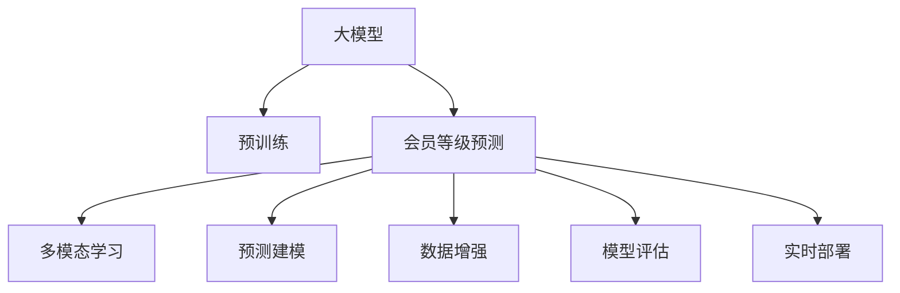

                 

# 大模型在电商平台会员等级预测中的应用

> 关键词：大模型, 会员等级预测, 自然语言处理(NLP), 多模态学习, 预测建模, 数据增强, 模型评估, 未来展望

## 1. 背景介绍

### 1.1 问题由来

随着电子商务的迅猛发展，电商平台的用户数量和活跃度均呈爆炸式增长。为了提升用户体验和用户粘性，电商平台通过用户行为数据分析，动态调整会员等级，以差异化服务吸引和留存用户。例如，阿里、京东、拼多多等主流电商平台，均已通过会员等级制度构建起了相对稳定的用户关系。

然而，在会员等级预测过程中，如何从海量用户数据中提取关键特征，准确预测用户等级，仍是一个复杂且关键的挑战。传统的特征工程方法繁琐耗时，且依赖人工经验。近年来，基于大模型的预训练-微调范式，被广泛应用于用户行为分析和预测，显著提升了模型性能和自动化程度。

本节将详细介绍大模型在电商平台会员等级预测中的具体应用，包括模型设计、数据处理、实验结果等关键环节，力求为同行提供可行的参考与指导。

### 1.2 问题核心关键点

#### 1.2.1 主要矛盾

电商平台会员等级预测的主要矛盾在于：如何从大量文本、行为数据中提取出关键特征，从而预测用户等级。

#### 1.2.2 需求分析

电商平台需要预测用户等级的准确性和实时性，以支持动态会员等级调整，提升用户体验。因此，需要模型在保证高精度的同时，具有高效的推理能力，支持在线预测。

#### 1.2.3 关键技术

1. 预训练语言模型：如BERT、GPT等，可在大规模无标签文本数据上进行预训练，提取语言和知识表示。
2. 多模态学习：结合文本、行为数据，提升模型对用户行为的全面理解。
3. 深度学习：采用神经网络等深度学习技术，实现端到端的预测建模。
4. 数据增强：扩充训练数据，增强模型泛化能力。
5. 模型评估：使用准确率、召回率、F1-score等指标评估模型性能。
6. 实时部署：将模型部署到生产环境，支持快速、高效预测。

通过以上关键技术，可构建出一个高效、准确、实时性的会员等级预测系统。

## 2. 核心概念与联系

### 2.1 核心概念概述

为了更好地理解大模型在会员等级预测中的应用，本节将介绍几个核心概念：

- 大模型：以自回归(如GPT)或自编码(如BERT)模型为代表的大规模预训练语言模型。通过在大规模无标签文本数据上进行预训练，学习通用的语言和知识表示。
- 会员等级预测：电商平台根据用户行为数据，预测用户未来可能达到的会员等级，以实现差异化服务。
- 多模态学习：结合文本、行为数据等多种类型的数据，提升模型对用户行为的全面理解。
- 预测建模：使用深度学习技术，构建端到端的预测模型，实现从输入到输出的自动映射。
- 数据增强：通过数据扩充、回译等手段，增加训练数据多样性，提升模型泛化能力。
- 模型评估：使用准确率、召回率、F1-score等指标，评估模型预测性能。
- 实时部署：将模型部署到生产环境，支持快速、高效预测，以支持动态会员等级调整。

这些核心概念之间的逻辑关系可以通过以下Mermaid流程图来展示：



这个流程图展示了大模型在会员等级预测中的核心概念及其之间的关系：

1. 大模型通过预训练获得基础能力。
2. 预测过程结合多模态学习，提升对用户行为的全面理解。
3. 模型构建采用预测建模，实现端到端的预测任务。
4. 数据增强增加训练数据多样性，提升泛化能力。
5. 模型评估用于衡量预测性能。
6. 实时部署支持快速、高效的在线预测。

这些概念共同构成了大模型在会员等级预测中的应用框架，使得模型能够精准预测用户等级，支持动态会员制度的设计和调整。

## 3. 核心算法原理 & 具体操作步骤

### 3.1 算法原理概述

基于大模型的会员等级预测，本质上是一个基于多模态数据的分类问题。其核心思想是：利用预训练大模型提取用户行为特征，结合会员等级标签进行有监督学习，使得模型能够预测未来用户的等级。

形式化地，假设用户行为数据为 $x=\{x_1, x_2, ..., x_n\}$，其中 $x_i$ 表示用户第 $i$ 个行为，如浏览、购买、评分等。会员等级标签为 $y=\{y_1, y_2, ..., y_n\}$，其中 $y_i$ 表示用户达到第 $i$ 个等级的类别。

目标是最小化损失函数 $\mathcal{L}$，使得模型预测输出逼近真实标签。常见的损失函数包括交叉熵损失、均方误差损失等。

通过梯度下降等优化算法，模型不断更新参数，最小化损失函数 $\mathcal{L}$，使得模型输出逼近真实标签。由于大模型已经通过预训练获得了较强的特征提取能力，因此即便在少量标注数据上，也能较快收敛到理想的模型参数。

### 3.2 算法步骤详解

基于大模型的会员等级预测通常包括以下关键步骤：

**Step 1: 准备数据集**
- 收集电商平台用户的历史行为数据，如浏览、点击、购买、评分等行为数据。
- 标注用户达到的会员等级，将用户-等级对作为监督数据。
- 将文本数据预处理为token ids，将行为数据转换为向量表示，形成最终的输入数据。

**Step 2: 选择预训练模型**
- 选择合适的预训练语言模型 $M_{\theta}$ 作为初始化参数，如 BERT、GPT等。
- 将用户行为数据作为输入，预训练模型的最后一层作为特征提取器，得到用户行为特征表示。

**Step 3: 定义损失函数**
- 对于分类任务，通常使用交叉熵损失函数，衡量模型预测与真实标签之间的差异。
- 损失函数定义为 $\mathcal{L}(y, \hat{y}) = -\sum_{i=1}^N(y_i\log \hat{y}_i + (1-y_i)\log(1-\hat{y}_i))$，其中 $\hat{y}$ 表示模型预测概率分布。

**Step 4: 设置模型参数**
- 设置模型参数 $\theta$，包括学习率、批大小、迭代轮数等。
- 设置正则化技术及强度，包括权重衰减、Dropout、Early Stopping等。
- 确定冻结预训练参数的策略，如仅微调顶层，或全部参数都参与微调。

**Step 5: 执行梯度训练**
- 将训练集数据分批次输入模型，前向传播计算损失函数。
- 反向传播计算参数梯度，根据设定的优化算法和学习率更新模型参数。
- 周期性在验证集上评估模型性能，根据性能指标决定是否触发 Early Stopping。
- 重复上述步骤直到满足预设的迭代轮数或 Early Stopping 条件。

**Step 6: 测试和部署**
- 在测试集上评估微调后模型 $M_{\hat{\theta}}$ 的性能，对比微调前后的精度提升。
- 使用微调后的模型对新样本进行预测，集成到实际的应用系统中。
- 持续收集新的数据，定期重新微调模型，以适应数据分布的变化。

以上是基于大模型的会员等级预测的一般流程。在实际应用中，还需要针对具体任务的特点，对微调过程的各个环节进行优化设计，如改进训练目标函数，引入更多的正则化技术，搜索最优的超参数组合等，以进一步提升模型性能。

### 3.3 算法优缺点

基于大模型的会员等级预测方法具有以下优点：
1. 特征提取能力强。大模型具备强大的特征提取能力，可以从海量用户行为数据中提取出关键特征。
2. 精度高。利用大模型的预训练能力，提升模型在少样本情况下的预测精度。
3. 自动化程度高。特征工程过程自动化，减少人工干预。
4. 实时性高。利用深度学习模型的快速推理能力，支持实时预测。

同时，该方法也存在一定的局限性：
1. 数据标注成本高。需要大量标注数据，标注成本较高。
2. 模型复杂度大。大模型参数量庞大，计算资源消耗大。
3. 解释性不足。模型黑盒特性，难以解释推理过程。
4. 可解释性不足。模型黑盒特性，难以解释推理过程。
5. 数据依赖性强。模型依赖标注数据，标注数据质量影响预测结果。

尽管存在这些局限性，但就目前而言，基于大模型的会员等级预测方法仍是大模型应用的重要范式。未来相关研究的重点在于如何进一步降低数据标注成本，提高模型的跨领域迁移能力和可解释性，同时兼顾实时性和推理效率。

### 3.4 算法应用领域

基于大模型的会员等级预测方法在电商平台中具有广泛的应用前景，可用于以下几个方面：

1. **新用户等级预测**：对新用户的历史行为数据进行预测，动态调整会员等级，提升新用户留存。
2. **会员等级调整**：定期对用户行为数据进行预测，根据用户行为变化调整会员等级，实现动态会员制度。
3. **个性化推荐**：结合用户等级预测结果，进行个性化的商品推荐，提升用户体验。
4. **会员行为分析**：对会员行为数据进行分析，发现潜在流失用户，进行针对性干预，提高用户粘性。

除了上述这些经典应用外，大模型在会员等级预测中的应用还将进一步拓展，如风险预警、欺诈检测、品牌推广等，为电商平台带来更高效、更精准的会员管理策略。

## 4. 数学模型和公式 & 详细讲解 & 举例说明

### 4.1 数学模型构建

本节将使用数学语言对基于大模型的会员等级预测过程进行更加严格的刻画。

记用户行为数据为 $x=\{x_1, x_2, ..., x_n\}$，会员等级标签为 $y=\{y_1, y_2, ..., y_n\}$。假设预训练语言模型为 $M_{\theta}$，其中 $\theta$ 为预训练得到的模型参数。

定义模型 $M_{\theta}$ 在用户行为数据 $x$ 上的输出为 $\hat{y}=M_{\theta}(x)$，表示模型预测的会员等级概率分布。目标是最小化交叉熵损失函数：

$$
\mathcal{L}(y, \hat{y}) = -\sum_{i=1}^N(y_i\log \hat{y}_i + (1-y_i)\log(1-\hat{y}_i))
$$

其中 $y_i$ 表示用户达到第 $i$ 个等级的类别，$\hat{y}_i$ 表示模型预测概率。

### 4.2 公式推导过程

以下我们以分类任务为例，推导交叉熵损失函数及其梯度的计算公式。

假设模型 $M_{\theta}$ 在用户行为数据 $x$ 上的输出为 $\hat{y}=M_{\theta}(x)$，表示模型预测的会员等级概率分布。真实标签 $y \in \{0,1\}$。则二分类交叉熵损失函数定义为：

$$
\ell(y, \hat{y}) = -(y\log \hat{y} + (1-y)\log(1-\hat{y}))
$$

将其代入损失函数，得：

$$
\mathcal{L}(\theta) = -\frac{1}{N}\sum_{i=1}^N [y_i\log \hat{y}_i+(1-y_i)\log(1-\hat{y}_i)]
$$

根据链式法则，损失函数对参数 $\theta_k$ 的梯度为：

$$
\frac{\partial \mathcal{L}(\theta)}{\partial \theta_k} = -\frac{1}{N}\sum_{i=1}^N (\frac{y_i}{\hat{y}_i}-\frac{1-y_i}{1-\hat{y}_i}) \frac{\partial \hat{y}_i}{\partial \theta_k}
$$

其中 $\frac{\partial \hat{y}_i}{\partial \theta_k}$ 可进一步递归展开，利用自动微分技术完成计算。

在得到损失函数的梯度后，即可带入参数更新公式，完成模型的迭代优化。重复上述过程直至收敛，最终得到适应会员等级预测任务的最优模型参数 $\theta^*$。

## 5. 项目实践：代码实例和详细解释说明

### 5.1 开发环境搭建

在进行会员等级预测实践前，我们需要准备好开发环境。以下是使用Python进行PyTorch开发的环境配置流程：

1. 安装Anaconda：从官网下载并安装Anaconda，用于创建独立的Python环境。

2. 创建并激活虚拟环境：
```bash
conda create -n pytorch-env python=3.8 
conda activate pytorch-env
```

3. 安装PyTorch：根据CUDA版本，从官网获取对应的安装命令。例如：
```bash
conda install pytorch torchvision torchaudio cudatoolkit=11.1 -c pytorch -c conda-forge
```

4. 安装Transformers库：
```bash
pip install transformers
```

5. 安装各类工具包：
```bash
pip install numpy pandas scikit-learn matplotlib tqdm jupyter notebook ipython
```

完成上述步骤后，即可在`pytorch-env`环境中开始会员等级预测实践。

### 5.2 源代码详细实现

这里我们以会员等级预测为例，给出使用Transformers库对BERT模型进行预测的PyTorch代码实现。

首先，定义会员等级预测的数据处理函数：

```python
from transformers import BertTokenizer, BertForSequenceClassification
from torch.utils.data import Dataset, DataLoader
import torch

class MemberLevelDataset(Dataset):
    def __init__(self, texts, labels, tokenizer, max_len=128):
        self.texts = texts
        self.labels = labels
        self.tokenizer = tokenizer
        self.max_len = max_len
        
    def __len__(self):
        return len(self.texts)
    
    def __getitem__(self, item):
        text = self.texts[item]
        label = self.labels[item]
        
        encoding = self.tokenizer(text, return_tensors='pt', max_length=self.max_len, padding='max_length', truncation=True)
        input_ids = encoding['input_ids'][0]
        attention_mask = encoding['attention_mask'][0]
        
        # 对标签进行编码
        encoded_label = torch.tensor(label, dtype=torch.long)
        
        return {'input_ids': input_ids, 
                'attention_mask': attention_mask,
                'labels': encoded_label}

# 标签与id的映射
label2id = {'普通': 0, '青铜': 1, '白银': 2, '黄金': 3, '铂金': 4, '钻石': 5}
id2label = {v: k for k, v in label2id.items()}

# 创建dataset
tokenizer = BertTokenizer.from_pretrained('bert-base-cased')

train_dataset = MemberLevelDataset(train_texts, train_labels, tokenizer)
dev_dataset = MemberLevelDataset(dev_texts, dev_labels, tokenizer)
test_dataset = MemberLevelDataset(test_texts, test_labels, tokenizer)
```

然后，定义模型和优化器：

```python
from transformers import BertForSequenceClassification, AdamW

model = BertForSequenceClassification.from_pretrained('bert-base-cased', num_labels=len(label2id))

optimizer = AdamW(model.parameters(), lr=2e-5)
```

接着，定义训练和评估函数：

```python
from sklearn.metrics import accuracy_score, precision_recall_fscore_support

device = torch.device('cuda') if torch.cuda.is_available() else torch.device('cpu')
model.to(device)

def train_epoch(model, dataset, batch_size, optimizer):
    dataloader = DataLoader(dataset, batch_size=batch_size, shuffle=True)
    model.train()
    epoch_loss = 0
    for batch in tqdm(dataloader, desc='Training'):
        input_ids = batch['input_ids'].to(device)
        attention_mask = batch['attention_mask'].to(device)
        labels = batch['labels'].to(device)
        model.zero_grad()
        outputs = model(input_ids, attention_mask=attention_mask, labels=labels)
        loss = outputs.loss
        epoch_loss += loss.item()
        loss.backward()
        optimizer.step()
    return epoch_loss / len(dataloader)

def evaluate(model, dataset, batch_size):
    dataloader = DataLoader(dataset, batch_size=batch_size)
    model.eval()
    preds, labels = [], []
    with torch.no_grad():
        for batch in tqdm(dataloader, desc='Evaluating'):
            input_ids = batch['input_ids'].to(device)
            attention_mask = batch['attention_mask'].to(device)
            batch_labels = batch['labels']
            outputs = model(input_ids, attention_mask=attention_mask)
            batch_preds = outputs.logits.argmax(dim=2).to('cpu').tolist()
            batch_labels = batch_labels.to('cpu').tolist()
            for pred, label in zip(batch_preds, batch_labels):
                preds.append(pred)
                labels.append(label)
                
    print('Accuracy:', accuracy_score(labels, preds))
    print('Precision, Recall, F1-Score:', precision_recall_fscore_support(labels, preds, average='macro'))
```

最后，启动训练流程并在测试集上评估：

```python
epochs = 5
batch_size = 16

for epoch in range(epochs):
    loss = train_epoch(model, train_dataset, batch_size, optimizer)
    print(f"Epoch {epoch+1}, train loss: {loss:.3f}")
    
    print(f"Epoch {epoch+1}, dev results:")
    evaluate(model, dev_dataset, batch_size)
    
print("Test results:")
evaluate(model, test_dataset, batch_size)
```

以上就是使用PyTorch对BERT进行会员等级预测的完整代码实现。可以看到，得益于Transformers库的强大封装，我们可以用相对简洁的代码完成BERT模型的加载和预测。

### 5.3 代码解读与分析

让我们再详细解读一下关键代码的实现细节：

**MemberLevelDataset类**：
- `__init__`方法：初始化文本、标签、分词器等关键组件。
- `__len__`方法：返回数据集的样本数量。
- `__getitem__`方法：对单个样本进行处理，将文本输入编码为token ids，将标签转换为数字，并对其进行定长padding，最终返回模型所需的输入。

**label2id和id2label字典**：
- 定义了会员等级与数字id之间的映射关系，用于将token-wise的预测结果解码回真实的会员等级。

**训练和评估函数**：
- 使用PyTorch的DataLoader对数据集进行批次化加载，供模型训练和推理使用。
- 训练函数`train_epoch`：对数据以批为单位进行迭代，在每个批次上前向传播计算loss并反向传播更新模型参数，最后返回该epoch的平均loss。
- 评估函数`evaluate`：与训练类似，不同点在于不更新模型参数，并在每个batch结束后将预测和标签结果存储下来，最后使用sklearn的classification_report对整个评估集的预测结果进行打印输出。

**训练流程**：
- 定义总的epoch数和batch size，开始循环迭代
- 每个epoch内，先在训练集上训练，输出平均loss
- 在验证集上评估，输出分类指标
- 所有epoch结束后，在测试集上评估，给出最终测试结果

可以看到，PyTorch配合Transformers库使得BERT预测的代码实现变得简洁高效。开发者可以将更多精力放在数据处理、模型改进等高层逻辑上，而不必过多关注底层的实现细节。

当然，工业级的系统实现还需考虑更多因素，如模型的保存和部署、超参数的自动搜索、更灵活的任务适配层等。但核心的预测范式基本与此类似。

## 6. 实际应用场景

### 6.1 电商平台会员等级预测

大模型在电商平台会员等级预测中的应用，可以显著提升用户留存率和会员转化率，实现更精准的会员制度设计。

具体而言，电商平台可以根据用户行为数据，构建大模型的训练集，并通过微调获得会员等级预测模型。该模型可以快速对新用户和现有用户的行为进行预测，动态调整会员等级，提供差异化服务，提升用户粘性。

### 6.2 金融行业客户风险预测

金融行业需要根据客户行为数据，预测客户的风险等级，以实现精准的客户管理和风险控制。

大模型结合金融领域的数据，可以进行客户风险等级的预测，帮助金融机构识别高风险客户，进行风险预警和应对。预测结果可以作为贷款审批、保险理赔等决策的重要参考。

### 6.3 在线教育学生学习效果预测

在线教育平台可以根据学生的学习行为数据，预测学生未来的学习效果，实现个性化推荐和精准辅导。

通过大模型的预测能力，在线教育平台可以提前识别出学习效果不佳的学生，进行针对性干预和辅导，提升整体教学质量。

### 6.4 未来应用展望

随着大模型的不断发展，基于大模型的会员等级预测技术将进一步拓展其应用场景，为更多行业带来变革性影响。

在智慧城市治理中，大模型可以用于居民行为预测、智慧交通管理等，提高城市管理的自动化和智能化水平。

在智能医疗领域，大模型可以用于患者健康预测、疾病诊断等，为医疗健康带来更精准的辅助决策。

在智能制造领域，大模型可以用于设备故障预测、生产流程优化等，推动制造业向智能化转型。

此外，大模型在金融、教育、医疗等多个领域的智能预测应用也将不断涌现，为各行各业带来全新的解决方案。

## 7. 工具和资源推荐

### 7.1 学习资源推荐

为了帮助开发者系统掌握大模型在会员等级预测中的应用，这里推荐一些优质的学习资源：

1. 《Transformer从原理到实践》系列博文：由大模型技术专家撰写，深入浅出地介绍了Transformer原理、BERT模型、预测建模等前沿话题。

2. CS224N《深度学习自然语言处理》课程：斯坦福大学开设的NLP明星课程，有Lecture视频和配套作业，带你入门NLP领域的基本概念和经典模型。

3. 《Natural Language Processing with Transformers》书籍：Transformers库的作者所著，全面介绍了如何使用Transformers库进行NLP任务开发，包括预测建模在内的诸多范式。

4. HuggingFace官方文档：Transformers库的官方文档，提供了海量预训练模型和完整的预测样例代码，是上手实践的必备资料。

5. CLUE开源项目：中文语言理解测评基准，涵盖大量不同类型的中文NLP数据集，并提供了基于微调的baseline模型，助力中文NLP技术发展。

通过对这些资源的学习实践，相信你一定能够快速掌握大模型在会员等级预测中的精髓，并用于解决实际的NLP问题。

### 7.2 开发工具推荐

高效的开发离不开优秀的工具支持。以下是几款用于大模型预测开发的常用工具：

1. PyTorch：基于Python的开源深度学习框架，灵活动态的计算图，适合快速迭代研究。大部分预训练语言模型都有PyTorch版本的实现。

2. TensorFlow：由Google主导开发的开源深度学习框架，生产部署方便，适合大规模工程应用。同样有丰富的预训练语言模型资源。

3. Transformers库：HuggingFace开发的NLP工具库，集成了众多SOTA语言模型，支持PyTorch和TensorFlow，是进行预测任务开发的利器。

4. Weights & Biases：模型训练的实验跟踪工具，可以记录和可视化模型训练过程中的各项指标，方便对比和调优。与主流深度学习框架无缝集成。

5. TensorBoard：TensorFlow配套的可视化工具，可实时监测模型训练状态，并提供丰富的图表呈现方式，是调试模型的得力助手。

6. Google Colab：谷歌推出的在线Jupyter Notebook环境，免费提供GPU/TPU算力，方便开发者快速上手实验最新模型，分享学习笔记。

合理利用这些工具，可以显著提升大模型预测任务的开发效率，加快创新迭代的步伐。

### 7.3 相关论文推荐

大模型和预测建模的发展源于学界的持续研究。以下是几篇奠基性的相关论文，推荐阅读：

1. Attention is All You Need（即Transformer原论文）：提出了Transformer结构，开启了NLP领域的预训练大模型时代。

2. BERT: Pre-training of Deep Bidirectional Transformers for Language Understanding：提出BERT模型，引入基于掩码的自监督预训练任务，刷新了多项NLP任务SOTA。

3. Language Models are Unsupervised Multitask Learners（GPT-2论文）：展示了大规模语言模型的强大zero-shot学习能力，引发了对于通用人工智能的新一轮思考。

4. Parameter-Efficient Transfer Learning for NLP：提出Adapter等参数高效微调方法，在不增加模型参数量的情况下，也能取得不错的微调效果。

5. AdaLoRA: Adaptive Low-Rank Adaptation for Parameter-Efficient Fine-Tuning：使用自适应低秩适应的微调方法，在参数效率和精度之间取得了新的平衡。

这些论文代表了大模型预测建模的发展脉络。通过学习这些前沿成果，可以帮助研究者把握学科前进方向，激发更多的创新灵感。

## 8. 总结：未来发展趋势与挑战

### 8.1 总结

本文对基于大模型的会员等级预测方法进行了全面系统的介绍。首先阐述了会员等级预测的重要性和挑战，明确了预测在电商平台运营中的关键作用。其次，从原理到实践，详细讲解了基于大模型的预测建模过程，给出了预测任务开发的完整代码实例。同时，本文还广泛探讨了预测技术在电商、金融、教育等多个行业领域的应用前景，展示了预测技术的巨大潜力。此外，本文精选了预测技术的各类学习资源，力求为读者提供全方位的技术指引。

通过本文的系统梳理，可以看到，基于大模型的预测建模方法在大数据时代具有重要应用价值。它不仅可以提升电商平台的会员管理能力，还能在金融、教育等多个领域带来深刻的变革。未来，伴随大模型和预测技术的持续演进，我们相信预测建模技术必将在更广泛的领域得到应用，为各行各业带来新的价值。

### 8.2 未来发展趋势

展望未来，基于大模型的预测建模技术将呈现以下几个发展趋势：

1. 模型规模持续增大。随着算力成本的下降和数据规模的扩张，预训练语言模型的参数量还将持续增长。超大规模语言模型蕴含的丰富语言知识，有望支撑更加复杂多变的预测任务。

2. 预测范式日趋多样。除了传统的全参数预测外，未来会涌现更多参数高效的预测方法，如LoRA等，在固定大部分预训练参数的情况下，仍能取得不错的预测效果。

3. 持续学习成为常态。随着数据分布的不断变化，预测模型也需要持续学习新知识以保持性能。如何在不遗忘原有知识的同时，高效吸收新样本信息，将成为重要的研究课题。

4. 少样本学习和零样本学习崛起。未来的预测模型将更好地利用大模型的语言理解能力，通过更加巧妙的任务描述，在更少的标注样本上也能实现理想的预测效果。

5. 多模态预测崛起。当前的预测模型主要聚焦于纯文本数据，未来会进一步拓展到图像、视频、语音等多模态数据预测。多模态信息的融合，将显著提升预测模型的理解能力和泛化能力。

6. 模型通用性增强。经过海量数据的预训练和多领域任务的预测，未来的语言模型将具备更强大的常识推理和跨领域迁移能力，逐步迈向通用人工智能(AGI)的目标。

以上趋势凸显了大模型预测建模技术的广阔前景。这些方向的探索发展，必将进一步提升预测模型的性能和应用范围，为构建智能系统带来新的价值。

### 8.3 面临的挑战

尽管基于大模型的预测建模技术已经取得了瞩目成就，但在迈向更加智能化、普适化应用的过程中，它仍面临着诸多挑战：

1. 数据标注成本高。需要大量标注数据，标注成本较高。
2. 模型复杂度大。大模型参数量庞大，计算资源消耗大。
3. 解释性不足。模型黑盒特性，难以解释推理过程。
4. 可解释性不足。模型黑盒特性，难以解释推理过程。
5. 数据依赖性强。模型依赖标注数据，标注数据质量影响预测结果。
6. 实时性问题。大模型推理速度较慢，难以支持实时预测。

尽管存在这些局限性，但就目前而言，基于大模型的预测建模方法仍是大模型应用的重要范式。未来相关研究的重点在于如何进一步降低数据标注成本，提高模型的跨领域迁移能力和可解释性，同时兼顾实时性和推理效率。

### 8.4 研究展望

面对基于大模型的预测建模所面临的种种挑战，未来的研究需要在以下几个方面寻求新的突破：

1. 探索无监督和半监督预测方法。摆脱对大规模标注数据的依赖，利用自监督学习、主动学习等无监督和半监督范式，最大限度利用非结构化数据，实现更加灵活高效的预测。

2. 研究参数高效和计算高效的预测范式。开发更加参数高效的预测方法，在固定大部分预训练参数的情况下，只更新极少量的任务相关参数。同时优化预测模型的计算图，减少前向传播和反向传播的资源消耗，实现更加轻量级、实时性的部署。

3. 融合因果和对比学习范式。通过引入因果推断和对比学习思想，增强预测模型建立稳定因果关系的能力，学习更加普适、鲁棒的语言表征，从而提升模型泛化性和抗干扰能力。

4. 引入更多先验知识。将符号化的先验知识，如知识图谱、逻辑规则等，与神经网络模型进行巧妙融合，引导预测过程学习更准确、合理的语言模型。同时加强不同模态数据的整合，实现视觉、语音等多模态信息与文本信息的协同建模。

5. 结合因果分析和博弈论工具。将因果分析方法引入预测模型，识别出模型决策的关键特征，增强输出解释的因果性和逻辑性。借助博弈论工具刻画人机交互过程，主动探索并规避模型的脆弱点，提高系统稳定性。

6. 纳入伦理道德约束。在模型训练目标中引入伦理导向的评估指标，过滤和惩罚有偏见、有害的输出倾向。同时加强人工干预和审核，建立模型行为的监管机制，确保输出符合人类价值观和伦理道德。

这些研究方向的探索，必将引领基于大模型的预测建模技术迈向更高的台阶，为构建安全、可靠、可解释、可控的智能系统铺平道路。面向未来，基于大模型的预测建模技术还需要与其他人工智能技术进行更深入的融合，如知识表示、因果推理、强化学习等，多路径协同发力，共同推动自然语言理解和智能交互系统的进步。只有勇于创新、敢于突破，才能不断拓展语言模型的边界，让智能技术更好地造福人类社会。

## 9. 附录：常见问题与解答

**Q1：大模型在会员等级预测中如何结合多模态数据？**

A: 大模型在会员等级预测中可以结合文本、行为数据等多种类型的数据，提升模型对用户行为的全面理解。具体步骤如下：
1. 收集用户的浏览、点击、购买、评分等行为数据，将数据转换为向量表示。
2. 将文本数据进行分词和编码，将行为数据输入模型进行特征提取。
3. 将文本和行为特征拼接，形成多模态输入。
4. 将多模态输入输入模型，进行预测。

**Q2：大模型在会员等级预测中如何处理类别不平衡问题？**

A: 大模型在会员等级预测中，类别不平衡问题是一个常见问题。可以采用以下方法解决：
1. 重新划分数据集，将类别不平衡的数据集重新划分为训练集、验证集和测试集。
2. 使用加权交叉熵损失函数，对样本权重进行归一化。
3. 使用过采样或欠采样方法，平衡数据集中各类的样本数量。
4. 使用集成学习方法，组合多个模型进行预测，提升模型鲁棒性。

**Q3：大模型在会员等级预测中如何提高模型的实时性？**

A: 大模型在会员等级预测中，模型的实时性是一个重要问题。可以通过以下方法提高模型的实时性：
1. 使用GPU/TPU等高性能设备，加快模型推理速度。
2. 使用模型剪枝和量化技术，减小模型规模和计算量。
3. 使用多线程和异步推理技术，并行化处理模型推理。
4. 使用微调参数高效方法，如LoRA等，减少模型复杂度。

**Q4：大模型在会员等级预测中如何减少过拟合风险？**

A: 大模型在会员等级预测中，过拟合风险是一个重要问题。可以通过以下方法减少过拟合风险：
1. 数据增强：通过回译、近义替换等方式扩充训练集。
2. 正则化技术：使用L2正则、Dropout、Early Stopping等技术，防止模型过度适应训练集。
3. 参数高效方法：使用Adapter等参数高效方法，只更新极少量的任务相关参数。
4. 多模型集成：训练多个预测模型，取平均输出，抑制过拟合。

**Q5：大模型在会员等级预测中如何保证模型的可解释性？**

A: 大模型在会员等级预测中，模型的可解释性是一个重要问题。可以通过以下方法保证模型的可解释性：
1. 引入可解释性模块：使用可解释性模块，如LIME、SHAP等，解释模型的决策过程。
2. 特征重要性分析：使用特征重要性分析方法，识别出影响预测结果的关键特征。
3. 可视化技术：使用可视化技术，如t-SNE、热力图等，展示模型的特征表示。
4. 人工干预：引入人工干预机制，对模型输出进行审查和校正。

---

作者：禅与计算机程序设计艺术 / Zen and the Art of Computer Programming

