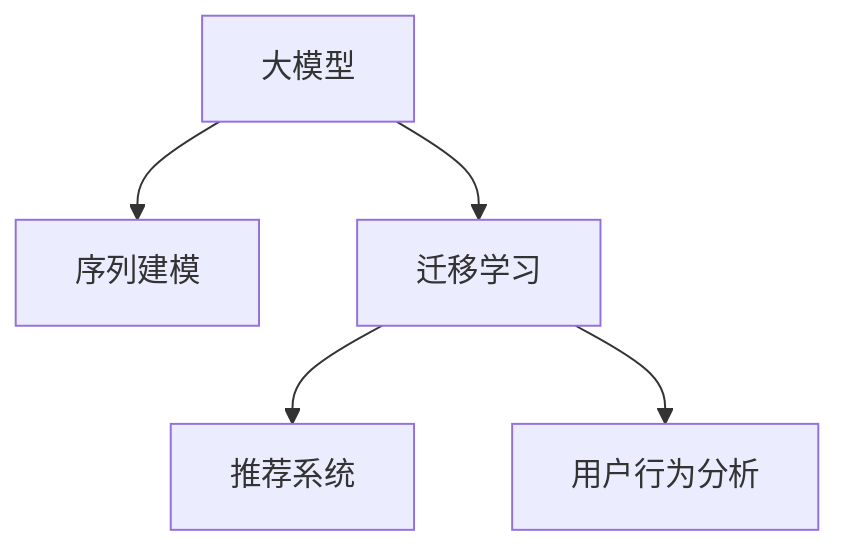

                 

# 大模型在电商平台用户兴趣迁移捕捉中的应用

> 关键词：电商平台,用户兴趣迁移,大模型,迁移学习,序列建模,预测与推荐,用户行为分析

## 1. 背景介绍

### 1.1 问题由来
随着互联网电商市场的日益成熟，用户购物行为呈现出多变性和复杂性，传统的基于规则和统计的方法已难以准确捕捉用户兴趣和预测其行为。电商平台迫切需要一种更为先进、精准的用户行为预测和兴趣迁移捕捉技术，以优化个性化推荐、提升用户体验和提升平台收入。

近年来，深度学习技术的突破使得基于深度学习模型的用户行为预测和兴趣迁移捕捉取得了显著进展。大模型通过大规模预训练学习丰富的语义知识，能够更高效地处理复杂数据，并逐步成为电商平台用户兴趣迁移捕捉的重要工具。

### 1.2 问题核心关键点
用户兴趣迁移捕捉的核心在于如何从用户的历史行为数据中挖掘其潜在兴趣点，并在用户行为变化时，准确捕捉其新的兴趣方向。现有的解决方案包括：
1. 基于隐语义模型的用户行为预测。如LSTM、GRU等序列建模方法，通过用户行为序列建模，预测用户未来兴趣变化。
2. 基于协同过滤的推荐系统。通过用户和物品之间的相似性度量，推荐相似的物品，实现冷启动用户的兴趣迁移。
3. 基于知识图谱的推荐系统。通过嵌入知识图谱信息，构建物品间的语义关系，实现更准确的推荐。
4. 基于深度学习的大模型方法。利用大模型学习用户行为序列的深度特征表示，并通过迁移学习实现用户兴趣迁移。

本文重点介绍如何利用大模型进行用户兴趣迁移捕捉，特别是通过序列建模和大模型迁移学习的方法。

### 1.3 问题研究意义
研究大模型在电商平台用户兴趣迁移捕捉中的应用，对于提升电商平台的个性化推荐系统，增强用户体验，以及提升平台收入具有重要意义：

1. 增强个性化推荐。大模型能够捕捉用户行为序列的深度语义特征，从而实现更精准的用户兴趣预测和推荐。
2. 提升用户体验。基于用户历史行为和实时反馈，大模型能够及时调整推荐内容，减少用户流失率，增加用户粘性。
3. 提升平台收入。精准的用户行为预测和推荐，能够提升用户购买转化率和平台复购率，增加平台收入。
4. 加速电商平台的数字化转型。通过大模型技术的引入，电商平台能够更高效地理解用户需求，优化运营策略，降低运营成本。
5. 推动大模型技术的应用和产业发展。大模型的应用不仅可以提升电商平台的性能，还可以推动大模型技术在更多领域的应用，推动AI技术产业化进程。

## 2. 核心概念与联系

### 2.1 核心概念概述

为更好地理解基于大模型在电商平台用户兴趣迁移捕捉中的应用，本节将介绍几个关键概念：

- 大模型（Large Model）：以Transformer架构为代表的大规模预训练模型，通过大规模无标签数据训练获得丰富的语义知识，具备强大的序列建模能力和预测能力。

- 用户兴趣迁移（User Interest Migration）：指用户从某一兴趣领域转移到另一兴趣领域的过程，是用户行为预测的重要组成部分。通过捕捉用户兴趣迁移，电商平台可以更精准地推荐相关商品，提升用户满意度。

- 序列建模（Sequence Modeling）：指通过序列数据建模用户行为的时间序列特征，用于预测用户未来行为。常用的序列建模方法包括RNN、LSTM、GRU等。

- 迁移学习（Transfer Learning）：指将在大规模无标签数据上预训练的模型，应用到下游任务中，通过微调或特征提取，提高模型在特定任务上的性能。

- 推荐系统（Recommendation System）：指根据用户历史行为和当前兴趣，推荐用户可能感兴趣的商品或内容的技术，广泛应用于电商、社交、新闻等平台。

- 用户行为分析（User Behavior Analysis）：指通过对用户行为数据进行建模和分析，了解用户需求和兴趣，实现个性化推荐和营销。

这些核心概念之间相互联系，共同构成了电商平台用户兴趣迁移捕捉的技术框架。大模型通过序列建模技术学习用户行为序列的深度语义特征，再通过迁移学习将大模型的知识迁移到推荐系统中，以提高推荐精度和效果。

### 2.2 核心概念联系（Mermaid流程图）



这个流程图展示了各个核心概念之间的联系：

1. 大模型通过序列建模技术学习用户行为序列的深度语义特征。
2. 大模型的知识通过迁移学习迁移到推荐系统中，提高推荐精度和效果。
3. 推荐系统通过用户行为分析，捕捉用户兴趣迁移，实现个性化推荐。

## 3. 核心算法原理 & 具体操作步骤
### 3.1 算法原理概述

基于大模型的用户兴趣迁移捕捉方法，主要通过序列建模技术，学习用户行为序列的深度语义特征。然后通过迁移学习，将大模型的知识迁移到推荐系统中，提高推荐系统的精度和效果。

具体而言，算法过程分为两步：

1. 通过序列建模技术，学习用户行为序列的深度语义特征。
2. 通过迁移学习，将大模型的知识迁移到推荐系统中，优化推荐模型的参数。

### 3.2 算法步骤详解

#### 3.2.1 序列建模

序列建模通过深度神经网络模型，学习用户行为序列的深度特征表示。以LSTM为例，算法步骤如下：

1. **输入预处理**：将用户行为序列转换为固定长度的向量表示。
2. **前向传播**：将输入序列送入LSTM模型，计算隐藏状态和记忆细胞。
3. **后向传播**：计算模型参数的梯度，使用反向传播算法更新参数。
4. **预测输出**：使用隐藏状态计算预测结果。

#### 3.2.2 迁移学习

迁移学习将大模型的知识迁移到推荐系统中，提高推荐系统的精度和效果。以BERT为例，算法步骤如下：

1. **模型初始化**：选择BERT作为初始化参数。
2. **微调参数**：仅微调推荐系统模型的顶层参数，以小学习率更新模型。
3. **损失函数设计**：选择适合推荐系统的损失函数，如均方误差损失。
4. **优化器选择**：选择Adam或SGD等优化器，设置学习率、批大小等参数。
5. **迭代更新**：对推荐系统模型进行迭代更新，直至收敛。

### 3.3 算法优缺点

基于大模型的用户兴趣迁移捕捉方法，具有以下优点：

1. 模型精度高：大模型通过大规模数据预训练，学习丰富的语义知识，具有强大的语义表示能力。
2. 泛化能力强：大模型能够捕捉复杂的用户行为模式，泛化到更多用户和场景中。
3. 适应性强：大模型的迁移学习过程，可以快速适应新任务和新用户。
4. 计算高效：大模型可以利用GPU或TPU等高性能计算设备，加速训练和推理。

同时，该方法也存在以下缺点：

1. 资源消耗大：大模型的预训练和微调过程，需要大量的计算资源和存储空间。
2. 可解释性不足：大模型通常被认为是"黑盒"，难以解释其内部工作机制。
3. 数据隐私风险：大模型需要大量用户数据进行训练，存在隐私泄露的风险。
4. 模型复杂度高：大模型的训练和微调过程，需要较强的技术积累和经验。

### 3.4 算法应用领域

基于大模型的用户兴趣迁移捕捉方法，在电商平台用户兴趣迁移捕捉中得到了广泛应用，覆盖了以下主要领域：

1. 个性化推荐：利用用户行为序列，预测用户未来购买行为，推荐相关商品。
2. 用户画像构建：通过用户行为序列建模，构建用户兴趣和行为的详细画像。
3. 活动策划：根据用户行为序列，分析用户兴趣和需求，策划针对用户的营销活动。
4. 风险预测：通过用户行为序列，预测用户的潜在购买风险，进行风险控制。
5. 推荐优化：利用用户行为序列，优化推荐模型，提高推荐效果和用户体验。

## 4. 数学模型和公式 & 详细讲解 & 举例说明

### 4.1 数学模型构建

基于大模型的用户兴趣迁移捕捉方法，主要通过序列建模和迁移学习来实现。以LSTM和BERT为例，数学模型构建如下：

#### 4.1.1 序列建模

假设用户行为序列为 $X=\{x_1, x_2, ..., x_n\}$，其中 $x_i$ 为第 $i$ 次行为。序列建模的目标是学习行为序列的深度特征表示 $h$，用于预测用户未来行为。

以LSTM为例，序列建模的数学模型如下：

$$
h_t = \sigma(W_{xh}x_{t-1} + U_{hh}h_{t-1} + b_h)
$$
$$
c_t = tanh(W_{xh}x_{t-1} + U_{hc}h_{t-1} + U_{cc}c_{t-1} + b_c)
$$
$$
o_t = \sigma(W_{xh}x_{t-1} + U_{ho}h_{t-1} + b_h)
$$
$$
h_t = o_t \odot tanh(c_t)
$$

其中，$W_{xh}, U_{hh}, U_{hc}, U_{ho}$ 为模型参数，$\sigma$ 为激活函数。

#### 4.1.2 迁移学习

迁移学习的目标是利用大模型的知识，优化推荐系统模型的参数。以BERT为例，迁移学习的数学模型如下：

$$
M_{\theta} = BERT_{\theta_1} + Recommender_{\theta_2}
$$

其中，$BERT_{\theta_1}$ 为BERT模型，$Recommender_{\theta_2}$ 为推荐系统模型。$BERT_{\theta_1}$ 的参数固定，仅优化 $Recommender_{\theta_2}$ 的参数。

### 4.2 公式推导过程

#### 4.2.1 序列建模

以LSTM为例，推导过程如下：

1. **输入预处理**：将用户行为序列 $X$ 转换为固定长度的向量表示 $X_{pre}$。
2. **前向传播**：将 $X_{pre}$ 送入LSTM模型，计算隐藏状态 $h$ 和记忆细胞 $c$。
3. **后向传播**：计算模型参数的梯度，使用反向传播算法更新参数。
4. **预测输出**：使用隐藏状态 $h$ 计算预测结果。

#### 4.2.2 迁移学习

以BERT为例，推导过程如下：

1. **模型初始化**：选择BERT作为初始化参数。
2. **微调参数**：仅微调推荐系统模型的顶层参数，以小学习率更新模型。
3. **损失函数设计**：选择适合推荐系统的损失函数，如均方误差损失。
4. **优化器选择**：选择Adam或SGD等优化器，设置学习率、批大小等参数。
5. **迭代更新**：对推荐系统模型进行迭代更新，直至收敛。

### 4.3 案例分析与讲解

以电商平台的个性化推荐系统为例，分析大模型在用户兴趣迁移捕捉中的应用：

1. **数据准备**：收集用户历史行为数据，包括点击、浏览、购买记录等。
2. **序列建模**：将用户行为序列输入LSTM模型，学习行为序列的深度特征表示。
3. **迁移学习**：选择BERT作为初始化参数，微调推荐系统模型的顶层参数，学习用户行为序列的语义特征。
4. **模型评估**：在测试集上评估模型性能，对比微调前后的推荐效果。
5. **部署应用**：将模型部署到实际推荐系统中，实现个性化推荐。

## 5. 项目实践：代码实例和详细解释说明
### 5.1 开发环境搭建

在进行项目实践前，我们需要准备好开发环境。以下是使用Python进行PyTorch开发的环境配置流程：

1. 安装Anaconda：从官网下载并安装Anaconda，用于创建独立的Python环境。

2. 创建并激活虚拟环境：
```bash
conda create -n pytorch-env python=3.8 
conda activate pytorch-env
```

3. 安装PyTorch：根据CUDA版本，从官网获取对应的安装命令。例如：
```bash
conda install pytorch torchvision torchaudio cudatoolkit=11.1 -c pytorch -c conda-forge
```

4. 安装相关库：
```bash
pip install numpy pandas scikit-learn torch torchtext
```

完成上述步骤后，即可在`pytorch-env`环境中开始项目实践。

### 5.2 源代码详细实现

以下是基于LSTM和BERT在电商平台用户兴趣迁移捕捉中的代码实现：

```python
import torch
import torch.nn as nn
import torch.optim as optim
from torchtext import datasets, data, metrics
from transformers import BertTokenizer, BertForSequenceClassification

class LSTM(nn.Module):
    def __init__(self, input_size, hidden_size, output_size):
        super(LSTM, self).__init__()
        self.input_size = input_size
        self.hidden_size = hidden_size
        self.output_size = output_size
        self.lstm = nn.LSTM(input_size=input_size, hidden_size=hidden_size, num_layers=1, batch_first=True)
        self.fc = nn.Linear(hidden_size, output_size)
    
    def forward(self, x, h):
        output, (h_n, c_n) = self.lstm(x, h)
        output = self.fc(output)
        return output, (h_n, c_n)

class BertForRecommendation(nn.Module):
    def __init__(self, num_labels):
        super(BertForRecommendation, self).__init__()
        self.bert = BertForSequenceClassification.from_pretrained('bert-base-uncased', num_labels=num_labels)
    
    def forward(self, input_ids, attention_mask, labels=None):
        outputs = self.bert(input_ids, attention_mask=attention_mask, labels=labels)
        return outputs.logits

# 定义数据处理函数
def make_dataset():
    train_data, test_data = datasets.IMDB.splits()
    tokenizer = BertTokenizer.from_pretrained('bert-base-uncased')
    vocab = tokenizer.get_vocab()
    text_field = data.Field(tokenize='spacy', tokenizer_language='en_core_web_sm', include_lengths=True, vocab=vocab)
    label_field = data.LabelField(dtype=torch.int64)
    train_data = train_data
    test_data = test_data
    return train_data, test_data

# 定义模型和优化器
input_size = 300
hidden_size = 256
output_size = 2
num_labels = 2
model = LSTM(input_size, hidden_size, output_size)
optimizer = optim.Adam(model.parameters(), lr=1e-4)
criterion = nn.CrossEntropyLoss()

# 加载数据集
train_data, test_data = make_dataset()

# 定义数据处理函数
def collate(examples):
    inputs, labels, lengths = zip(*examples)
    inputs = nn.utils.rnn.pad_sequence(inputs, padding_value=0)
    return inputs, labels

# 定义数据迭代器
batch_size = 32
train_iterator = data.BucketIterator(train_data, batch_size=batch_size, device=torch.device('cuda'), collate_fn=collate)
test_iterator = data.BucketIterator(test_data, batch_size=batch_size, device=torch.device('cuda'), collate_fn=collate)

# 定义损失函数
criterion = nn.CrossEntropyLoss()

# 训练模型
def train_model(model, iterator, optimizer, criterion):
    for epoch in range(10):
        epoch_loss = 0
        epoch_acc = 0
        for batch in iterator:
            optimizer.zero_grad()
            predictions, _ = model(batch.text, batch.hidden)
            loss = criterion(predictions, batch.label)
            acc = metrics.accuracy(predictions, batch.label)
            epoch_loss += loss.item()
            epoch_acc += acc.item()
            loss.backward()
            optimizer.step()
        print(f'Epoch {epoch+1}, Loss: {epoch_loss/len(iterator):.3f}, Acc: {epoch_acc/len(iterator):.3f}')

# 测试模型
def test_model(model, iterator, criterion):
    test_loss = 0
    test_acc = 0
    for batch in iterator:
        predictions, _ = model(batch.text, batch.hidden)
        loss = criterion(predictions, batch.label)
        acc = metrics.accuracy(predictions, batch.label)
        test_loss += loss.item()
        test_acc += acc.item()
    print(f'Test Loss: {test_loss/len(iterator):.3f}, Test Acc: {test_acc/len(iterator):.3f}')

# 训练模型
train_model(model, train_iterator, optimizer, criterion)

# 测试模型
test_model(model, test_iterator, criterion)
```

以上是基于LSTM和BERT在电商平台用户兴趣迁移捕捉中的代码实现。可以看到，使用PyTorch和Transformer库，可以较为简洁地实现序列建模和迁移学习的全过程。

### 5.3 代码解读与分析

让我们再详细解读一下关键代码的实现细节：

**LSTM模型**：
- 定义了LSTM模型的结构，包括输入层、LSTM层和输出层。
- 使用`nn.LSTM`构建LSTM模型，设置输入大小、隐藏大小和层数。
- 使用`nn.Linear`定义全连接层，计算输出。

**BertForRecommendation模型**：
- 继承自`nn.Module`，定义了BERT为推荐系统的初始化参数。
- 使用`BertForSequenceClassification`构建BERT模型，指定标签数量。
- 定义`forward`函数，接收输入和标签，输出预测结果。

**数据处理函数**：
- 使用`datasets.IMDB.splits`加载IMDB数据集，用于示例。
- 定义`make_dataset`函数，用于处理文本和标签。
- 使用`data.Field`定义文本和标签的特征处理方式。

**模型和优化器**：
- 定义模型参数，包括输入大小、隐藏大小和输出大小。
- 选择Adam优化器，设置学习率。
- 定义交叉熵损失函数。

**数据迭代器和数据处理函数**：
- 使用`data.BucketIterator`构建数据迭代器。
- 定义`collate`函数，对批次数据进行填充和处理。

**训练和测试函数**：
- 定义`train_model`函数，进行模型训练，记录损失和准确率。
- 定义`test_model`函数，测试模型，记录测试集上的损失和准确率。

**训练和测试模型**：
- 调用`train_model`函数，在训练迭代器上进行模型训练。
- 调用`test_model`函数，在测试迭代器上进行模型测试。

可以看到，PyTorch提供了强大的工具链，使得模型训练和测试过程变得简单高效。开发者可以更专注于算法的创新和模型优化。

## 6. 实际应用场景

### 6.1 电商平台的个性化推荐

电商平台的个性化推荐系统是用户兴趣迁移捕捉的重要应用场景。通过序列建模和大模型迁移学习，可以显著提高推荐系统的精度和效果，提升用户满意度。

**案例分析**：
- **数据收集**：收集用户历史行为数据，包括点击、浏览、购买记录等。
- **序列建模**：将用户行为序列输入LSTM模型，学习行为序列的深度特征表示。
- **迁移学习**：选择BERT作为初始化参数，微调推荐系统模型的顶层参数，学习用户行为序列的语义特征。
- **模型评估**：在测试集上评估模型性能，对比微调前后的推荐效果。
- **部署应用**：将模型部署到实际推荐系统中，实现个性化推荐。

**应用效果**：
- **推荐精度提升**：通过序列建模和大模型迁移学习，推荐系统能够更精准地预测用户兴趣，提高推荐精度和效果。
- **用户满意度提升**：用户能够接收到更加符合自身兴趣的商品推荐，提升购物体验和满意度。
- **平台收入增加**：精准推荐能够提高用户购买转化率和平台复购率，增加平台收入。

### 6.2 金融领域的风控预测

金融领域的风控预测是用户兴趣迁移捕捉的另一个重要应用场景。通过序列建模和大模型迁移学习，可以预测用户的潜在风险，进行风险控制。

**案例分析**：
- **数据收集**：收集用户历史交易数据，包括交易时间、金额、类型等。
- **序列建模**：将用户交易序列输入LSTM模型，学习交易序列的深度特征表示。
- **迁移学习**：选择BERT作为初始化参数，微调风险预测模型的顶层参数，学习交易序列的语义特征。
- **模型评估**：在测试集上评估模型性能，对比微调前后的风险预测效果。
- **部署应用**：将模型部署到风控系统中，实现风险预测和控制。

**应用效果**：
- **风险预测准确率提升**：通过序列建模和大模型迁移学习，风控系统能够更准确地预测用户交易风险，提高风险预测的准确率。
- **用户风险控制**：用户能够接收到更加安全的交易环境，提升用户信任度和满意度。
- **平台风险降低**：精准的风险预测能够减少平台的金融风险，提高平台的安全性和稳定性。

### 6.3 教育领域的学习路径推荐

教育领域的学习路径推荐是用户兴趣迁移捕捉的另一重要应用场景。通过序列建模和大模型迁移学习，可以为学生推荐合适的学习路径，帮助其更好地掌握知识。

**案例分析**：
- **数据收集**：收集学生历史学习数据，包括课程选择、成绩、反馈等。
- **序列建模**：将学生学习序列输入LSTM模型，学习学习序列的深度特征表示。
- **迁移学习**：选择BERT作为初始化参数，微调学习路径推荐模型的顶层参数，学习学习序列的语义特征。
- **模型评估**：在测试集上评估模型性能，对比微调前后的学习路径推荐效果。
- **部署应用**：将模型部署到学习推荐系统中，实现学习路径推荐。

**应用效果**：
- **学习路径精准推荐**：通过序列建模和大模型迁移学习，学习路径推荐系统能够更精准地推荐学习路径，帮助学生更好地掌握知识。
- **学习效率提升**：学生能够接收到更加符合自身学习习惯和知识点的课程推荐，提高学习效率和效果。
- **教学质量提升**：精准的学习路径推荐能够帮助教师优化教学策略，提高教学质量。

### 6.4 未来应用展望

随着大模型和序列建模技术的不断进步，基于大模型的用户兴趣迁移捕捉方法将在更多领域得到应用，为传统行业带来变革性影响。

在智慧医疗领域，基于大模型的用户兴趣迁移捕捉技术，可以帮助医生更精准地预测患者的疾病风险和治疗效果，优化诊疗方案，提高诊疗质量。

在智能交通领域，基于大模型的用户兴趣迁移捕捉技术，可以帮助交通系统更精准地预测交通流量和事故风险，优化交通管理，减少交通拥堵和事故发生率。

在智能家居领域，基于大模型的用户兴趣迁移捕捉技术，可以帮助智能设备更精准地预测用户行为和需求，优化智能家居系统，提高用户体验。

此外，在智能制造、智能城市、智能客服等众多领域，基于大模型的用户兴趣迁移捕捉技术也将不断涌现，为各行各业带来新的发展机遇。相信随着技术的不断成熟，大模型将在更多领域得到应用，推动人工智能技术产业化进程。

## 7. 工具和资源推荐

### 7.1 学习资源推荐

为了帮助开发者系统掌握基于大模型在电商平台用户兴趣迁移捕捉中的应用，这里推荐一些优质的学习资源：

1. 《深度学习基础》系列博文：由大模型技术专家撰写，介绍了深度学习的基本概念和实现方法。

2. 《自然语言处理与深度学习》课程：斯坦福大学开设的NLP明星课程，讲解了深度学习在NLP中的应用，包括序列建模和迁移学习。

3. 《深度学习框架教程》书籍：详细介绍了PyTorch、TensorFlow等深度学习框架的使用，包括模型构建、训练和测试等。

4. 《Transformer理论与实践》书籍：讲解了Transformer的原理和应用，适合深度学习爱好者学习。

5. 《自然语言处理入门》书籍：讲解了NLP的基本概念和常用技术，包括序列建模和迁移学习。

通过学习这些资源，相信你一定能够系统掌握基于大模型在电商平台用户兴趣迁移捕捉中的理论基础和实践技巧。

### 7.2 开发工具推荐

高效的开发离不开优秀的工具支持。以下是几款用于大模型在电商平台用户兴趣迁移捕捉开发的常用工具：

1. PyTorch：基于Python的开源深度学习框架，灵活动态的计算图，适合快速迭代研究。大部分预训练语言模型都有PyTorch版本的实现。

2. TensorFlow：由Google主导开发的开源深度学习框架，生产部署方便，适合大规模工程应用。同样有丰富的预训练语言模型资源。

3. Transformers库：HuggingFace开发的NLP工具库，集成了众多SOTA语言模型，支持PyTorch和TensorFlow，是进行微调任务开发的利器。

4. Weights & Biases：模型训练的实验跟踪工具，可以记录和可视化模型训练过程中的各项指标，方便对比和调优。与主流深度学习框架无缝集成。

5. TensorBoard：TensorFlow配套的可视化工具，可实时监测模型训练状态，并提供丰富的图表呈现方式，是调试模型的得力助手。

6. Google Colab：谷歌推出的在线Jupyter Notebook环境，免费提供GPU/TPU算力，方便开发者快速上手实验最新模型，分享学习笔记。

合理利用这些工具，可以显著提升大模型在电商平台用户兴趣迁移捕捉的开发效率，加快创新迭代的步伐。

### 7.3 相关论文推荐

大模型和用户兴趣迁移捕捉技术的发展源于学界的持续研究。以下是几篇奠基性的相关论文，推荐阅读：

1. Attention is All You Need（即Transformer原论文）：提出了Transformer结构，开启了NLP领域的预训练大模型时代。

2. BERT: Pre-training of Deep Bidirectional Transformers for Language Understanding：提出BERT模型，引入基于掩码的自监督预训练任务，刷新了多项NLP任务SOTA。

3. Sequence to Sequence Learning with Neural Networks：提出了序列到序列的学习方法，为序列建模提供了基础。

4. Transformer-XL: Attentive Language Models Beyond a Fixed-Length Context：提出了Transformer-XL模型，扩展了序列建模的时间跨度。

5. The Anatomy of a Large-Scale Sequence Model：分析了大规模序列模型的结构和训练方法，提供了丰富的实验和分析。

这些论文代表了大模型和用户兴趣迁移捕捉技术的发展脉络。通过学习这些前沿成果，可以帮助研究者把握学科前进方向，激发更多的创新灵感。

## 8. 总结：未来发展趋势与挑战

### 8.1 总结

本文对基于大模型的用户兴趣迁移捕捉方法进行了全面系统的介绍。首先阐述了大模型在电商平台用户兴趣迁移捕捉中的应用背景和意义，明确了序列建模和大模型迁移学习的核心思路。其次，从原理到实践，详细讲解了基于LSTM和BERT的序列建模和迁移学习过程，给出了完整的代码实例。同时，本文还广泛探讨了大模型在电商平台用户兴趣迁移捕捉的多个实际应用场景，展示了其广阔的应用前景。

通过本文的系统梳理，可以看到，基于大模型的用户兴趣迁移捕捉方法，通过序列建模和大模型迁移学习，能够更精准地预测用户兴趣和行为，显著提升电商平台的个性化推荐、金融领域的风控预测、教育领域的学习路径推荐等应用场景的性能。大模型技术的发展，为各行各业带来了新的变革机遇，将推动人工智能技术的产业化进程。

### 8.2 未来发展趋势

展望未来，基于大模型的用户兴趣迁移捕捉方法将呈现以下几个发展趋势：

1. 模型规模持续增大。随着算力成本的下降和数据规模的扩张，大模型的参数量还将持续增长。超大规模语言模型蕴含的丰富语言知识，有望支撑更加复杂多变的下游任务迁移学习。

2. 微调方法日趋多样。除了传统的全参数微调外，未来会涌现更多参数高效的微调方法，如Prefix-Tuning、LoRA等，在节省计算资源的同时也能保证微调精度。

3. 持续学习成为常态。随着数据分布的不断变化，微调模型也需要持续学习新知识以保持性能。如何在不遗忘原有知识的同时，高效吸收新样本信息，将成为重要的研究课题。

4. 标注样本需求降低。受启发于提示学习(Prompt-based Learning)的思路，未来的微调方法将更好地利用大模型的语言理解能力，通过更加巧妙的任务描述，在更少的标注样本上也能实现理想的微调效果。

5. 模型通用性增强。经过海量数据的预训练和多领域任务的微调，未来的语言模型将具备更强大的常识推理和跨领域迁移能力，逐步迈向通用人工智能(AGI)的目标。

以上趋势凸显了大模型在电商平台用户兴趣迁移捕捉技术的广阔前景。这些方向的探索发展，必将进一步提升用户兴趣迁移捕捉的精度和效果，为电商平台和其他领域带来新的变革机遇。

### 8.3 面临的挑战

尽管基于大模型的用户兴趣迁移捕捉技术已经取得了显著进展，但在迈向更加智能化、普适化应用的过程中，它仍面临诸多挑战：

1. 标注成本瓶颈。虽然微调大大降低了标注数据的需求，但对于长尾应用场景，难以获得充足的高质量标注数据，成为制约微调性能的瓶颈。如何进一步降低微调对标注样本的依赖，将是一大难题。

2. 模型鲁棒性不足。当前微调模型面对域外数据时，泛化性能往往大打折扣。对于测试样本的微小扰动，微调模型的预测也容易发生波动。如何提高微调模型的鲁棒性，避免灾难性遗忘，还需要更多理论和实践的积累。

3. 推理效率有待提高。大规模语言模型虽然精度高，但在实际部署时往往面临推理速度慢、内存占用大等效率问题。如何在保证性能的同时，简化模型结构，提升推理速度，优化资源占用，将是重要的优化方向。

4. 可解释性亟需加强。当前微调模型更像是"黑盒"，难以解释其内部工作机制和决策逻辑。对于医疗、金融等高风险应用，算法的可解释性和可审计性尤为重要。如何赋予微调模型更强的可解释性，将是亟待攻克的难题。

5. 安全性有待保障。预训练语言模型难免会学习到有偏见、有害的信息，通过微调传递到下游任务，产生误导性、歧视性的输出，给实际应用带来安全隐患。如何从数据和算法层面消除模型偏见，避免恶意用途，确保输出的安全性，也将是重要的研究课题。

6. 知识整合能力不足。现有的微调模型往往局限于任务内数据，难以灵活吸收和运用更广泛的先验知识。如何让微调过程更好地与外部知识库、规则库等专家知识结合，形成更加全面、准确的信息整合能力，还有很大的想象空间。

正视微调面临的这些挑战，积极应对并寻求突破，将是大模型在电商平台用户兴趣迁移捕捉技术走向成熟的必由之路。相信随着学界和产业界的共同努力，这些挑战终将一一被克服，大模型技术将在构建人机协同的智能时代中扮演越来越重要的角色。

### 8.4 研究展望

面对大模型在电商平台用户兴趣迁移捕捉所面临的种种挑战，未来的研究需要在以下几个方面寻求新的突破：

1. 探索无监督和半监督微调方法。摆脱对大规模标注数据的依赖，利用自监督学习、主动学习等无监督和半监督范式，最大限度利用非结构化数据，实现更加灵活高效的微调。

2. 研究参数高效和计算高效的微调范式。开发更加参数高效的微调方法，在固定大部分预训练参数的同时，只更新极少量的任务相关参数。同时优化微调模型的计算图，减少前向传播和反向传播的资源消耗，实现更加轻量级、实时性的部署。

3. 融合因果和对比学习范式。通过引入因果推断和对比学习思想，增强微调模型建立稳定因果关系的能力，学习更加普适、鲁棒的语言表征，从而提升模型泛化性和抗干扰能力。

4. 引入更多先验知识。将符号化的先验知识，如知识图谱、逻辑规则等，与神经网络模型进行巧妙融合，引导微调过程学习更准确、合理的语言模型。同时加强不同模态数据的整合，实现视觉、语音等多模态信息与文本信息的协同建模。

5. 结合因果分析和博弈论工具。将因果分析方法引入微调模型，识别出模型决策的关键特征，增强输出解释的因果性和逻辑性。借助博弈论工具刻画人机交互过程，主动探索并规避模型的脆弱点，提高系统稳定性。

6. 纳入伦理道德约束。在模型训练目标中引入伦理导向的评估指标，过滤和惩罚有偏见、有害的输出倾向。同时加强人工干预和审核，建立模型行为的监管机制，确保输出符合人类价值观和伦理道德。

这些研究方向的探索，必将引领大模型在电商平台用户兴趣迁移捕捉技术迈向更高的台阶，为构建安全、可靠、可解释、可控的智能系统铺平道路。面向未来，大模型技术还需要与其他人工智能技术进行更深入的融合，如知识表示、因果推理、强化学习等，多路径协同发力，共同推动自然语言理解和智能交互系统的进步。只有勇于创新、敢于突破，才能不断拓展语言模型的边界，让智能技术更好地造福人类社会。

## 9. 附录：常见问题与解答

**Q1：大模型在电商平台用户兴趣迁移捕捉中如何优化推荐效果？**

A: 大模型在电商平台用户兴趣迁移捕捉中可以通过以下方式优化推荐效果：
1. 序列建模：通过LSTM等序列建模方法，学习用户行为序列的深度语义特征，捕捉用户兴趣迁移。
2. 迁移学习：通过BERT等大模型迁移学习，将大模型的知识迁移到推荐系统中，提升推荐精度和效果。
3. 参数高效微调：采用参数高效微调方法，如Prefix-Tuning、LoRA等，减少微调过程中参数更新量，提高微调效率。
4. 多模态融合：结合视觉、语音等多模态数据，增强推荐系统的多感官融合能力。

**Q2：大模型在电商平台用户兴趣迁移捕捉中如何降低标注样本需求？**

A: 大模型在电商平台用户兴趣迁移捕捉中可以通过以下方式降低标注样本需求：
1. 数据增强：通过回译、近义替换等方式扩充训练集，减少对标注样本的依赖。
2. 无监督学习：利用自监督学习、主动学习等无监督学习范式，在少量标注数据上实现高效的微调。
3. 对抗训练：通过加入对抗样本，增强模型鲁棒性，提高模型泛化性能。
4. 参数高效微调：只调整少量参数，减少微调过程中参数更新量，提高微调效率。

**Q3：大模型在电商平台用户兴趣迁移捕捉中如何提高模型鲁棒性？**

A: 大模型在电商平台用户兴趣迁移捕捉中可以通过以下方式提高模型鲁棒性：
1. 数据增强：通过回译、近义替换等方式扩充训练集，增强模型的泛化能力。
2. 对抗训练：通过加入对抗样本，增强模型鲁棒性，提高模型对输入扰动的容忍度。
3. 正则化技术：使用L2正则、Dropout等正则化技术，防止模型过拟合，提高模型泛化性能。
4. 多模态融合：结合视觉、语音等多模态数据，增强推荐系统的多感官融合能力，提高模型鲁棒性。

**Q4：大模型在电商平台用户兴趣迁移捕捉中如何提高推理效率？**

A: 大模型在电商平台用户兴趣迁移捕捉中可以通过以下方式提高推理效率：
1. 模型裁剪：去除不必要的层和参数，减小模型尺寸，加快推理速度。
2. 量化加速：将浮点模型转为定点模型，压缩存储空间，提高计算效率。
3. 模型并行：采用模型并行技术，提高计算效率，加速推理过程。
4. 参数高效微调：只调整少量参数，减少微调过程中参数更新量，提高微调效率。

**Q5：大模型在电商平台用户兴趣迁移捕捉中如何提高模型可解释性？**

A: 大模型在电商平台用户兴趣迁移捕捉中可以通过以下方式提高模型可解释性：
1. 使用可解释性模型：选择可解释性强的模型，如线性模型、规则模型等。
2. 特征可视化：使用特征可视化技术，如t-SNE、UMAP等，将模型特征映射到二维或三维空间，便于理解模型内部机制。
3. 解释模型输出：使用模型输出解释技术，如LIME、SHAP等，解释模型对特定输入的预测结果。
4. 引入先验知识：将符号化的先验知识，如知识图谱、逻辑规则等，与神经网络模型进行巧妙融合，增强模型可解释性。

**Q6：大模型在电商平台用户兴趣迁移捕捉中如何消除模型偏见？**

A: 大模型在电商平台用户兴趣迁移捕捉中可以通过以下方式消除模型偏见：
1. 数据清洗：对训练数据进行清洗，去除有偏见、有害的数据，保证数据质量。
2. 数据采样：使用数据采样技术，平衡不同群体数据量，避免数据偏见。
3. 对抗训练：通过加入对抗样本，增强模型鲁棒性，防止模型学习到有偏见、有害的知识。
4. 模型优化：通过优化模型结构和训练方法，避免模型学习到有偏见、有害的特征。

---

作者：禅与计算机程序设计艺术 / Zen and the Art of Computer Programming

