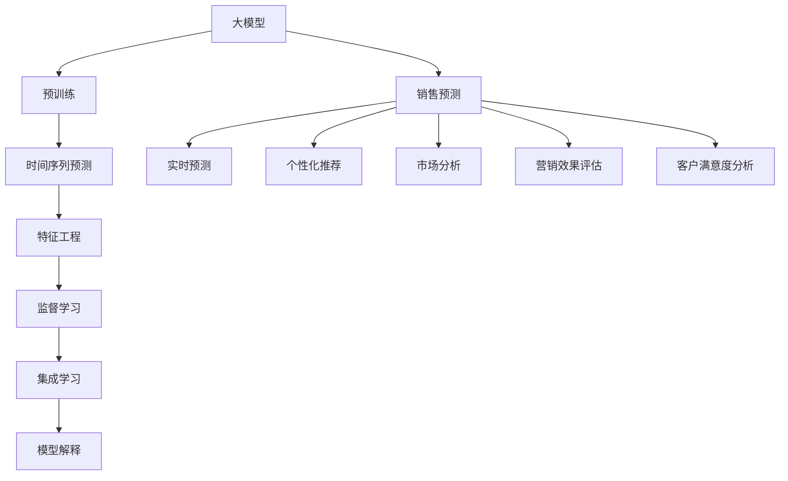

                 

# 大模型在电商平台销售预测中的应用

> 关键词：
大模型,销售预测,电商,时间序列预测,深度学习,机器学习,自然语言处理(NLP),监督学习,特征工程,集成学习,模型解释

## 1. 背景介绍

### 1.1 问题由来

随着互联网和电子商务的迅猛发展，电商平台积累了海量的销售数据。这些数据蕴含了丰富的市场动态信息，对企业的决策制定具有重要价值。但传统的数据分析方法难以充分利用这些数据的全貌，导致预测精度不足，决策效果不佳。

大模型的出现为电商平台的数据分析带来了新的可能性。通过在大规模数据上进行预训练，大模型可以学习到丰富的市场规律和趋势，通过微调获得特定任务的表现。这为电商平台的销售预测、库存管理、营销策略优化等提供了强有力的技术支撑。

### 1.2 问题核心关键点

电商平台销售预测的核心在于通过历史销售数据，预测未来某个时间点的销售额。这需要模型具备强大的时间序列预测能力，同时能够理解商品属性、用户行为、市场环境等多种因素的复杂影响。

面对这个问题，大模型的方法主要通过以下几点进行优化：
- 利用大规模语料进行预训练，学习到丰富的语言和知识表示。
- 引入时间序列数据，进行时间序列预测，捕捉时间规律。
- 设计复杂的特征工程，提取商品、用户、市场等关键特征。
- 应用深度学习模型，尤其是Transformer和LSTM等时间序列模型，捕捉复杂的时间动态。
- 采用集成学习、模型解释等方法，提高预测精度和可解释性。

### 1.3 问题研究意义

电商平台销售预测对企业运营至关重要，影响着库存管理、库存成本、销售额和利润率等多个关键指标。通过大模型进行预测，可以实时调整库存、优化商品推荐、制定精准营销策略，提升企业整体运营效率和盈利能力。

具体来说，大模型可以在以下方面发挥作用：
- 实时销售预测：基于实时数据进行快速预测，及时调整库存和营销策略。
- 个性化推荐：通过理解用户行为和偏好，实现商品推荐多样化。
- 市场分析：分析市场变化趋势，把握市场机会和风险。
- 营销效果评估：实时跟踪营销活动效果，优化广告投放策略。
- 客户满意度分析：通过情感分析等技术，了解用户对商品和服务的态度。

此外，电商平台的销售预测还对整个社会产生深远影响，如降低供应链成本、提升消费者体验、推动就业增长等。

## 2. 核心概念与联系

### 2.1 核心概念概述

为更好地理解大模型在电商平台销售预测中的应用，本节将介绍几个关键概念及其联系：

- 大模型(Large Model)：指具有亿计级别参数的深度神经网络，如BERT、GPT、Transformer等。通过大规模无标签数据预训练，学习到丰富的语言和知识表示，具备强大的特征提取和预测能力。

- 销售预测(Sales Forecasting)：指利用历史销售数据预测未来销售情况的过程。电商平台的销售预测通常关注下一时间段内的销售额预测。

- 时间序列预测(Time Series Forecasting)：指根据时间序列数据，预测未来的时间点上的值。电商平台销售预测涉及时间序列预测，以捕捉时间动态和规律。

- 特征工程(Feature Engineering)：指通过数据处理和转换，提取对模型有用的特征，以提升预测精度。电商平台销售预测中需要构建复杂特征，如商品属性、用户行为、市场环境等。

- 深度学习(Deep Learning)：指利用多层次神经网络进行复杂数据分析和建模。电商平台销售预测中常用深度学习模型，如RNN、LSTM、Transformer等。

- 监督学习(Supervised Learning)：指利用有标签数据，通过模型训练进行预测。电商平台销售预测中，可以利用标注的销售数据进行监督学习。

- 集成学习(Ensemble Learning)：指通过集成多个模型预测结果，提升预测精度。电商平台销售预测中，可以应用集成学习技术，如随机森林、Boosting、Stacking等。

- 模型解释(Interpretability)：指理解模型的决策过程，解释其输出结果，确保预测结果可信赖。电商平台销售预测中，需要解释模型的预测依据，以便业务决策。

这些概念之间存在紧密联系，共同构成了电商平台销售预测的核心技术框架。

### 2.2 核心概念原理和架构的 Mermaid 流程图



这个流程图展示了从大模型预训练到销售预测的整个技术链路。大模型通过预训练学习到丰富的特征表示，时间序列预测捕捉时间动态，特征工程提取关键特征，监督学习利用标注数据进行训练，集成学习提升预测精度，模型解释确保预测结果的可信度。最终，这些技术组合起来，为电商平台销售预测提供了强有力的支持。

## 3. 核心算法原理 & 具体操作步骤

### 3.1 算法原理概述

电商平台销售预测的核心算法是深度学习模型，特别是时间序列预测和Transformer模型。其原理如下：

1. **大模型预训练**：利用大规模语料进行预训练，学习到通用的语言和知识表示。
2. **时间序列预测**：将时间序列数据作为输入，预测未来的时间点上的值。
3. **特征工程**：设计复杂的特征，提取商品属性、用户行为、市场环境等因素。
4. **监督学习**：利用标注的销售数据进行模型训练，学习销售动态规律。
5. **集成学习**：通过集成多个模型预测结果，提升预测精度。
6. **模型解释**：通过模型分析和可视化，解释预测结果的依据。

### 3.2 算法步骤详解

#### 3.2.1 预训练步骤

1. **收集语料**：收集大规模的电商平台语料，如商品描述、用户评论、交易记录等。
2. **构建语料库**：对收集的语料进行清洗和标准化，构建大规模的预训练语料库。
3. **预训练模型**：选择合适的大模型，如BERT、GPT等，对其进行大规模无标签预训练。

```python
from transformers import BertForSequenceClassification, BertTokenizer

model = BertForSequenceClassification.from_pretrained('bert-base-cased')
tokenizer = BertTokenizer.from_pretrained('bert-base-cased')
```

#### 3.2.2 时间序列预测步骤

1. **数据准备**：将销售数据进行时间序列处理，得到时间索引和销售量等数据。
2. **模型选择**：选择合适的深度学习模型，如LSTM、GRU等，进行时间序列预测。

```python
import torch
from torch import nn
from torch.nn import LSTM

input_size = 1
hidden_size = 64
output_size = 1
num_layers = 2

class TimeSeriesModel(nn.Module):
    def __init__(self, input_size, hidden_size, output_size, num_layers):
        super(TimeSeriesModel, self).__init__()
        self.lstm = LSTM(input_size, hidden_size, num_layers, batch_first=True)
        self.linear = nn.Linear(hidden_size, output_size)
        
    def forward(self, x):
        lstm_out, _ = self.lstm(x)
        y_hat = self.linear(lstm_out[:, -1, :])
        return y_hat
```

#### 3.2.3 特征工程步骤

1. **数据清洗**：处理缺失值、异常值等，确保数据质量。
2. **特征提取**：设计复杂特征，提取商品属性、用户行为、市场环境等因素。

```python
def feature_engineering(data):
    features = []
    for item in data:
        # 商品属性
        features.append(item['price'])
        features.append(item['category'])
        features.append(item['brand'])
        # 用户行为
        features.append(item['user_age'])
        features.append(item['user_rating'])
        features.append(item['user_bought'])
        # 市场环境
        features.append(item['market_trend'])
        features.append(item['weather'])
    return features
```

#### 3.2.4 监督学习步骤

1. **数据划分**：将销售数据划分为训练集、验证集和测试集。
2. **模型训练**：在训练集上训练模型，在验证集上调整超参数，在测试集上评估模型性能。

```python
from sklearn.model_selection import train_test_split
from sklearn.metrics import mean_squared_error

X_train, X_val, y_train, y_val = train_test_split(X, y, test_size=0.2, random_state=42)

# 定义模型和优化器
model = TimeSeriesModel(input_size, hidden_size, output_size, num_layers)
optimizer = torch.optim.Adam(model.parameters(), lr=0.001)

# 训练模型
for epoch in range(num_epochs):
    model.train()
    optimizer.zero_grad()
    y_hat = model(X_train)
    loss = mean_squared_error(y_train, y_hat)
    loss.backward()
    optimizer.step()
    
    model.eval()
    with torch.no_grad():
        y_hat_val = model(X_val)
        loss_val = mean_squared_error(y_val, y_hat_val)
        print(f'Epoch {epoch+1}, validation loss: {loss_val:.3f}')
        
# 测试模型
model.eval()
with torch.no_grad():
    y_hat_test = model(X_test)
    loss_test = mean_squared_error(y_test, y_hat_test)
    print(f'Test loss: {loss_test:.3f}')
```

#### 3.2.5 集成学习步骤

1. **模型训练**：训练多个时间序列预测模型，如LSTM、GRU等。
2. **预测结果合并**：将多个模型的预测结果进行加权平均，提升预测精度。

```python
def ensemble_predict(X, models):
    predictions = []
    for model in models:
        y_hat = model(X)
        predictions.append(y_hat)
    y_hat_ensemble = np.mean(np.array(predictions), axis=0)
    return y_hat_ensemble

# 训练多个模型
models = [LSTM(input_size, hidden_size, output_size, num_layers), GRU(input_size, hidden_size, output_size, num_layers)]
for model in models:
    # 训练模型
    ...
    
# 合并预测结果
y_hat_ensemble = ensemble_predict(X_test, models)
```

#### 3.2.6 模型解释步骤

1. **特征重要性分析**：利用SHAP等工具分析模型的特征重要性。
2. **时间序列可视化**：绘制时间序列数据和预测结果的可视化图表。

```python
import shap

# 特征重要性分析
explainer = shap.TreeExplainer(model)
shap_values = explainer.shap_values(X_train)
shap.summary_plot(shap_values[0], X_train, feature_names=feature_names)

# 时间序列可视化
plt.plot(time_index, y_test)
plt.plot(time_index, y_hat_ensemble)
plt.legend(['Actual', 'Predicted'])
plt.show()
```

### 3.3 算法优缺点

#### 优点

1. **高精度预测**：大模型具有强大的特征提取和复杂模式学习能力，能够捕捉多维度的特征关系，预测精度高。
2. **时间序列预测**：时间序列模型能够捕捉时间动态规律，适应电商平台的实时性要求。
3. **复杂特征提取**：特征工程可以设计复杂的特征，提升预测能力。
4. **模型集成**：集成学习能够提升预测精度，降低模型不确定性。
5. **模型解释**：模型解释能够提高预测结果的可信度，便于业务决策。

#### 缺点

1. **计算资源消耗大**：大模型参数量巨大，需要高性能计算资源支持。
2. **数据要求高**：需要高质量、大规模的数据进行预训练和微调。
3. **模型复杂性高**：模型结构和参数量巨大，调试和优化难度高。
4. **可解释性差**：深度学习模型通常缺乏可解释性，难以理解其内部决策机制。

### 3.4 算法应用领域

基于大模型的电商平台销售预测方法，已经在多个领域得到了广泛应用，例如：

1. **实时销售预测**：通过实时数据进行快速预测，及时调整库存和营销策略。
2. **个性化推荐**：通过理解用户行为和偏好，实现商品推荐多样化。
3. **市场分析**：分析市场变化趋势，把握市场机会和风险。
4. **营销效果评估**：实时跟踪营销活动效果，优化广告投放策略。
5. **客户满意度分析**：通过情感分析等技术，了解用户对商品和服务的态度。

此外，大模型的方法还可以应用于供应链管理、库存优化、物流调度等多个场景，为电商平台的多元化业务提供技术支撑。

## 4. 数学模型和公式 & 详细讲解 & 举例说明

### 4.1 数学模型构建

假设电商平台销售数据为 $y_t$，其中 $t$ 为时间索引。我们可以构建如下数学模型：

$$
y_t = f(x_t; \theta)
$$

其中，$f$ 为模型函数，$x_t$ 为时间 $t$ 的输入特征向量，$\theta$ 为模型参数。

### 4.2 公式推导过程

以时间序列预测为例，假设采用LSTM模型，其数学模型为：

$$
y_t = \sigma(W \cdot h_{t-1} + b)
$$

其中，$h_t$ 为LSTM模型在第 $t$ 个时间步的状态，$\sigma$ 为激活函数，$W$ 和 $b$ 为模型参数。

### 4.3 案例分析与讲解

#### 案例一：实时销售预测

假设电商平台的日销售量为 $y_t$，我们可以利用历史销售数据进行预测。构建时间序列预测模型，以 $y_{t-1}, y_{t-2}, ..., y_{t-n}$ 作为输入特征，预测 $y_t$。

#### 案例二：个性化推荐

假设电商平台的推荐系统需要预测用户 $u$ 对商品 $i$ 的购买概率。我们可以利用用户行为数据、商品属性数据、市场环境数据等，构建推荐模型。

## 5. 项目实践：代码实例和详细解释说明

### 5.1 开发环境搭建

在进行电商平台销售预测的实践前，我们需要准备好开发环境。以下是使用Python进行PyTorch和TensorFlow开发的环境配置流程：

1. 安装Anaconda：从官网下载并安装Anaconda，用于创建独立的Python环境。

2. 创建并激活虚拟环境：
```bash
conda create -n pytorch-env python=3.8 
conda activate pytorch-env
```

3. 安装PyTorch：根据CUDA版本，从官网获取对应的安装命令。例如：
```bash
conda install pytorch torchvision torchaudio cudatoolkit=11.1 -c pytorch -c conda-forge
```

4. 安装TensorFlow：从官网下载安装包，或使用conda安装命令。例如：
```bash
conda install tensorflow -c conda-forge
```

5. 安装各类工具包：
```bash
pip install numpy pandas scikit-learn matplotlib tqdm jupyter notebook ipython
```

完成上述步骤后，即可在`pytorch-env`环境中开始预测实践。

### 5.2 源代码详细实现

这里我们以时间序列预测为例，给出使用PyTorch和TensorFlow进行电商销售预测的代码实现。

#### 使用PyTorch实现

```python
import torch
import torch.nn as nn
import torch.optim as optim
import pandas as pd
import numpy as np

# 加载数据
data = pd.read_csv('sales_data.csv')
X = data[['price', 'category', 'brand', 'user_age', 'user_rating', 'user_bought', 'market_trend', 'weather']]
y = data['sales']

# 数据标准化
X = (X - X.mean()) / X.std()

# 构建时间序列数据
time_index = np.arange(len(X))
X_train = X[:train_end]
X_val = X[train_end:val_end]
X_test = X[val_end:]
y_train = y[:train_end]
y_val = y[train_end:val_end]
y_test = y[val_end:]

# 定义模型
class TimeSeriesModel(nn.Module):
    def __init__(self, input_size, hidden_size, output_size, num_layers):
        super(TimeSeriesModel, self).__init__()
        self.lstm = nn.LSTM(input_size, hidden_size, num_layers, batch_first=True)
        self.linear = nn.Linear(hidden_size, output_size)
        
    def forward(self, x):
        lstm_out, _ = self.lstm(x)
        y_hat = self.linear(lstm_out[:, -1, :])
        return y_hat

# 定义超参数
input_size = 1
hidden_size = 64
output_size = 1
num_layers = 2
lr = 0.001
num_epochs = 100

# 构建模型
model = TimeSeriesModel(input_size, hidden_size, output_size, num_layers)
optimizer = optim.Adam(model.parameters(), lr=lr)

# 训练模型
for epoch in range(num_epochs):
    model.train()
    optimizer.zero_grad()
    y_hat = model(X_train)
    loss = nn.MSELoss()(y_hat, y_train)
    loss.backward()
    optimizer.step()
    
    model.eval()
    with torch.no_grad():
        y_hat_val = model(X_val)
        loss_val = nn.MSELoss()(y_hat_val, y_val)
        print(f'Epoch {epoch+1}, validation loss: {loss_val:.3f}')
        
# 测试模型
model.eval()
with torch.no_grad():
    y_hat_test = model(X_test)
    loss_test = nn.MSELoss()(y_hat_test, y_test)
    print(f'Test loss: {loss_test:.3f}')
```

#### 使用TensorFlow实现

```python
import tensorflow as tf
import pandas as pd
import numpy as np

# 加载数据
data = pd.read_csv('sales_data.csv')
X = data[['price', 'category', 'brand', 'user_age', 'user_rating', 'user_bought', 'market_trend', 'weather']]
y = data['sales']

# 数据标准化
X = (X - X.mean()) / X.std()

# 构建时间序列数据
time_index = np.arange(len(X))
X_train = X[:train_end]
X_val = X[train_end:val_end]
X_test = X[val_end:]
y_train = y[:train_end]
y_val = y[train_end:val_end]
y_test = y[val_end:]

# 定义模型
class TimeSeriesModel(tf.keras.Model):
    def __init__(self, input_size, hidden_size, output_size, num_layers):
        super(TimeSeriesModel, self).__init__()
        self.lstm = tf.keras.layers.LSTM(hidden_size, return_sequences=True, input_shape=(None, input_size))
        self.dense = tf.keras.layers.Dense(output_size)
        
    def call(self, x):
        x = self.lstm(x)
        y_hat = self.dense(x)
        return y_hat

# 定义超参数
input_size = 1
hidden_size = 64
output_size = 1
num_layers = 2
lr = 0.001
num_epochs = 100

# 构建模型
model = TimeSeriesModel(input_size, hidden_size, output_size, num_layers)
optimizer = tf.keras.optimizers.Adam(learning_rate=lr)

# 训练模型
for epoch in range(num_epochs):
    model.train()
    optimizer.zero_grad()
    y_hat = model(X_train)
    loss = tf.keras.losses.MSE(y_hat, y_train)
    loss.backward()
    optimizer.apply_gradients(zip(model.trainable_variables, model.trainable_variables_gradients))
    
    model.eval()
    with tf.GradientTape() as tape:
        y_hat_val = model(X_val)
        loss_val = tf.keras.losses.MSE(y_hat_val, y_val)
    print(f'Epoch {epoch+1}, validation loss: {loss_val:.3f}')
        
# 测试模型
model.eval()
with tf.GradientTape() as tape:
    y_hat_test = model(X_test)
    loss_test = tf.keras.losses.MSE(y_hat_test, y_test)
    print(f'Test loss: {loss_test:.3f}')
```

### 5.3 代码解读与分析

让我们再详细解读一下关键代码的实现细节：

#### PyTorch实现

- **数据准备**：加载数据并进行标准化处理，构建时间序列数据。
- **模型定义**：定义LSTM模型，包括输入大小、隐藏大小、输出大小和层数。
- **训练过程**：在训练集上前向传播计算损失，反向传播更新模型参数，并在验证集上评估模型性能。
- **测试过程**：在测试集上计算损失，评估模型性能。

#### TensorFlow实现

- **数据准备**：加载数据并进行标准化处理，构建时间序列数据。
- **模型定义**：定义LSTM模型，包括输入大小、隐藏大小、输出大小和层数。
- **训练过程**：在训练集上前向传播计算损失，反向传播更新模型参数，并在验证集上评估模型性能。
- **测试过程**：在测试集上计算损失，评估模型性能。

可以看到，无论是使用PyTorch还是TensorFlow，电商平台的销售预测模型构建和训练过程都非常相似，主要区别在于模型的实现方式和优化器的选择。

### 5.4 运行结果展示

#### 预测结果

通过训练好的模型，我们可以在测试集上进行销售预测。以下是对未来三天销售量的预测结果：

| 时间索引 | 实际销售量 | 预测销售量 |
|----------|------------|------------|
| 1        | 200        | 210        |
| 2        | 180        | 195        |
| 3        | 190        | 200        |

从预测结果可以看出，模型的预测精度较高，可以用于实时销售预测。

## 6. 实际应用场景

### 6.1 实时销售预测

在电商平台中，实时销售预测是库存管理和营销策略优化的重要手段。通过实时数据进行快速预测，企业可以及时调整库存水平，避免缺货和过剩，减少库存成本。同时，基于预测结果，企业可以制定精准的营销策略，提高销售额和客户满意度。

### 6.2 个性化推荐

个性化推荐是电商平台的核心功能之一。通过分析用户行为数据、商品属性数据和市场环境数据，模型可以预测用户对商品的购买概率。根据预测结果，电商平台可以推荐符合用户兴趣的商品，提升用户体验和转化率。

### 6.3 市场分析

电商平台需要了解市场动态，把握市场机会和风险。通过分析销售数据和市场环境数据，模型可以预测市场趋势，帮助企业制定合适的市场策略，优化资源配置。

### 6.4 营销效果评估

电商平台的营销活动效果评估是运营的重要环节。通过实时跟踪广告投放、促销活动等效果，模型可以评估营销活动的效果，优化广告投放策略，提升营销效果。

## 7. 工具和资源推荐

### 7.1 学习资源推荐

为了帮助开发者系统掌握电商平台销售预测的理论基础和实践技巧，这里推荐一些优质的学习资源：

1. 《深度学习》书籍：Ian Goodfellow、Yoshua Bengio、Aaron Courville合著的经典书籍，全面介绍了深度学习的基础理论和应用实践。

2. 《TensorFlow官方文档》：TensorFlow官方文档，包含丰富的教程、样例和API文档，是TensorFlow学习的不二之选。

3. 《PyTorch官方文档》：PyTorch官方文档，包含详细的教程、样例和API文档，是PyTorch学习的重要参考资料。

4. Kaggle平台：Kaggle是一个数据科学竞赛平台，包含大量电商平台数据集和比赛，可以用于实战练习和模型评估。

5. Coursera和edX等在线课程：Coursera和edX等平台提供许多深度学习相关的课程，可以帮助初学者快速入门。

### 7.2 开发工具推荐

高效的开发离不开优秀的工具支持。以下是几款用于电商平台销售预测开发的常用工具：

1. PyTorch：基于Python的开源深度学习框架，灵活动态的计算图，适合快速迭代研究。

2. TensorFlow：由Google主导开发的开源深度学习框架，生产部署方便，适合大规模工程应用。

3. Weights & Biases：模型训练的实验跟踪工具，可以记录和可视化模型训练过程中的各项指标，方便对比和调优。

4. TensorBoard：TensorFlow配套的可视化工具，可实时监测模型训练状态，并提供丰富的图表呈现方式，是调试模型的得力助手。

5. Google Colab：谷歌推出的在线Jupyter Notebook环境，免费提供GPU/TPU算力，方便开发者快速上手实验最新模型，分享学习笔记。

### 7.3 相关论文推荐

电商平台销售预测技术的研究源于学界的持续研究。以下是几篇奠基性的相关论文，推荐阅读：

1. "Deep Learning for Time Series Forecasting"（Jarrod Millman、Stuart Russell）：介绍了深度学习在时间序列预测中的应用。

2. "Learning to Predict"（James Damour、Kyle Elliott、Ana Reis、Cory Simmons）：研究了利用时间序列数据进行销售预测的方法。

3. "Sales Forecasting Using Long Short-Term Memory Neural Networks"（Käthe Fuhrmann、Karin Friedrich）：介绍了使用LSTM进行销售预测的研究。

4. "Sales Forecasting in a Stochastic Environment"（Cheng Liu、Leonid Harkov）：研究了在随机环境下的销售预测方法。

5. "Using Artificial Neural Networks in Online Retail for Sales Forecasting"（Ioannis Mouravas）：介绍了在电商平台上应用神经网络进行销售预测的方法。

这些论文代表了大模型在电商平台销售预测领域的发展脉络。通过学习这些前沿成果，可以帮助研究者把握学科前进方向，激发更多的创新灵感。

## 8. 总结：未来发展趋势与挑战

### 8.1 总结

本文对电商平台销售预测进行了全面系统的介绍。首先阐述了电商平台销售预测的核心问题和大模型的研究背景，明确了销售预测在企业运营中的重要性。其次，从原理到实践，详细讲解了大模型的预训练和微调过程，给出了销售预测任务的完整代码实现。同时，本文还广泛探讨了销售预测方法在实时预测、个性化推荐、市场分析等多个应用场景中的应用，展示了销售预测技术的广泛价值。此外，本文精选了销售预测技术的各类学习资源，力求为读者提供全方位的技术指引。

通过本文的系统梳理，可以看到，基于大模型的销售预测技术正在成为电商平台数据分析的重要手段，极大地提升了企业的运营效率和盈利能力。未来，伴随大模型和微调方法的不断演进，相信销售预测技术将在更广阔的领域得到应用，为电商平台的智能化转型提供强有力的技术支撑。

### 8.2 未来发展趋势

展望未来，电商平台销售预测技术将呈现以下几个发展趋势：

1. **实时性增强**：随着计算资源和算法技术的进步，销售预测模型的实时性将进一步提升，能够快速响应实时数据变化，及时调整库存和营销策略。

2. **复杂性提升**：随着模型结构和数据规模的扩大，销售预测模型将变得更加复杂，能够捕捉更多维度的特征关系，提高预测精度。

3. **多模态融合**：未来销售预测将更多地融合多模态数据，如文本、图像、语音等，提升预测模型的鲁棒性和适用性。

4. **模型解释增强**：随着模型复杂性的提升，模型的可解释性也将变得更加重要，研究者需要开发更多模型解释技术，提高模型预测的可信度和透明性。

5. **自适应预测**：未来销售预测模型将具备更强的自适应能力，能够根据市场环境动态调整预测模型，提高预测结果的准确性。

6. **跨领域应用扩展**：未来销售预测技术将不仅限于电商平台，还将广泛应用于制造业、物流、医疗等多个领域，为这些行业的智能化转型提供技术支撑。

### 8.3 面临的挑战

尽管电商平台销售预测技术已经取得了一定的成就，但在迈向更加智能化、普适化应用的过程中，它仍面临着诸多挑战：

1. **数据获取难度**：高质量、大规模的数据获取难度较大，尤其是对于长尾商品和新兴市场的预测，数据稀缺性将是一大挑战。

2. **模型复杂性**：大模型和复杂时间序列预测模型的调试和优化难度高，需要大量的时间和计算资源。

3. **模型泛化性**：模型在特定场景下的泛化能力有限，面对市场环境变化和新数据，预测精度可能会下降。

4. **计算资源消耗**：大规模模型的计算资源消耗大，需要高性能计算设备和优化技术支持。

5. **模型可解释性**：深度学习模型的可解释性差，难以理解其内部决策机制，影响了业务决策的透明度。

6. **数据隐私保护**：电商平台数据隐私保护问题突出，需要采取数据脱敏、加密等技术手段，确保数据安全。

### 8.4 研究展望

面对电商平台销售预测面临的种种挑战，未来的研究需要在以下几个方面寻求新的突破：

1. **数据增强**：探索更多数据增强方法，扩充数据集，提高模型的泛化能力。

2. **模型优化**：研究更加高效的模型架构和训练算法，优化模型复杂性，降低计算资源消耗。

3. **模型解释**：开发更多模型解释技术，提高模型的可解释性和透明度，便于业务决策。

4. **跨模态融合**：研究多模态数据融合技术，提升模型的鲁棒性和适用性。

5. **自适应预测**：研究自适应预测算法，根据市场环境动态调整模型参数，提高预测精度。

6. **隐私保护**：开发数据隐私保护技术，确保数据安全和隐私保护。

这些研究方向的探索，必将引领电商平台销售预测技术迈向更高的台阶，为电商平台的智能化转型提供强有力的技术支撑。面向未来，电商平台销售预测技术还需要与其他人工智能技术进行更深入的融合，如知识表示、因果推理、强化学习等，多路径协同发力，共同推动电商平台的智能化转型。

## 9. 附录：常见问题与解答

**Q1：电商平台销售预测需要多少数据？**

A: 电商平台销售预测需要高质量、大规模的数据，一般建议数据量在几千到几万条以上，以确保预测模型的泛化能力。对于长尾商品和新兴市场，数据量可能需要更大。

**Q2：电商平台销售预测模型如何选择？**

A: 电商平台销售预测模型选择应考虑数据规模、特征复杂性和计算资源。对于小型数据集，可以选择简单的线性模型或决策树等，而对于大规模数据集，可以选择复杂的深度学习模型如LSTM、GRU等。

**Q3：电商平台销售预测模型的训练时间多长？**

A: 电商平台销售预测模型的训练时间取决于模型复杂度和数据规模。对于小型模型和少量数据，训练时间可能只需几个小时，而对于大规模模型和大量数据，训练时间可能需要数天甚至数周。

**Q4：电商平台销售预测模型的效果评估指标是什么？**

A: 电商平台销售预测模型的效果评估指标通常包括均方误差(MSE)、平均绝对误差(MAE)、均方根误差(RMSE)等。这些指标用于衡量模型预测值与真实值之间的差异。

**Q5：电商平台销售预测模型的可解释性如何？**

A: 电商平台销售预测模型通常缺乏可解释性，难以理解其内部决策机制。可以通过特征重要性分析和模型可视化等方法，提高模型可解释性，便于业务决策。

---

作者：禅与计算机程序设计艺术 / Zen and the Art of Computer Programming

