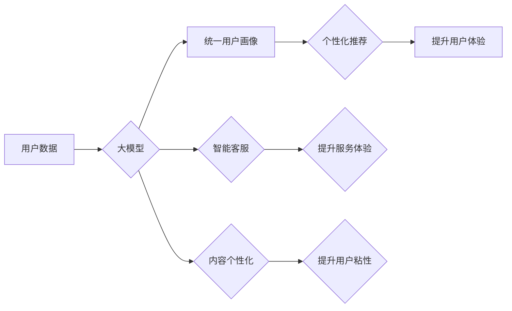

                 

## 大模型如何提升电商平台的全渠道用户体验一致性

> 关键词：大模型、电商平台、用户体验、全渠道、一致性、个性化推荐、自然语言处理、对话系统、知识图谱

## 1. 背景介绍

在当今数字化时代，电商平台已成为人们购物的首选方式。用户期望能够在任何时间、任何地点、任何设备上都能享受到便捷、高效、个性化的购物体验。然而，传统的电商平台往往存在着用户体验不一致的问题，例如：

* **信息孤岛:** 用户在不同平台（网站、APP、社交媒体等）上获取的信息可能不一致，导致购物决策困难。
* **服务割裂:** 用户在不同平台上与客服互动时，可能面临不同的服务水平和流程，影响用户满意度。
* **个性化不足:** 传统的电商平台往往采用基于规则的个性化推荐，无法真正理解用户的需求，导致推荐结果不精准。

为了解决这些问题，大模型技术应运而生。大模型凭借其强大的学习能力和泛化能力，能够有效提升电商平台的全渠道用户体验一致性。

## 2. 核心概念与联系

### 2.1 大模型

大模型是指参数量巨大、训练数据海量的人工智能模型。它能够学习到复杂的模式和关系，并应用于各种自然语言处理任务，例如文本生成、翻译、问答、情感分析等。

### 2.2 全渠道用户体验

全渠道用户体验是指用户在与品牌互动的所有渠道（网站、APP、社交媒体、线下门店等）上都能享受到一致、流畅、个性化的体验。

### 2.3 提升一致性

大模型能够通过以下方式提升电商平台的全渠道用户体验一致性：

* **统一数据平台:** 大模型可以整合不同平台的用户数据，构建统一的用户画像，从而提供更精准的个性化服务。
* **个性化推荐:** 大模型可以学习用户的购物偏好、浏览历史、评价反馈等信息，并提供更精准的商品推荐，提升用户购物体验。
* **智能客服:** 大模型可以构建智能客服系统，能够理解用户的自然语言输入，并提供快速、准确的回复，提升用户服务体验。
* **内容个性化:** 大模型可以根据用户的兴趣爱好，生成个性化的内容推荐，例如商品介绍、促销活动、用户评论等，提升用户粘性。

**Mermaid 流程图**



## 3. 核心算法原理 & 具体操作步骤

### 3.1 算法原理概述

大模型的训练主要基于深度学习算法，例如Transformer模型。Transformer模型通过自注意力机制，能够捕捉文本序列中的长距离依赖关系，从而学习到更深层的语义信息。

### 3.2 算法步骤详解

1. **数据预处理:** 收集并清洗电商平台的用户数据，例如商品信息、用户行为、评价反馈等。
2. **模型构建:** 选择合适的深度学习模型，例如Transformer模型，并根据电商平台的具体需求进行参数调整。
3. **模型训练:** 使用预处理后的数据训练模型，并通过反向传播算法不断优化模型参数。
4. **模型评估:** 使用测试数据评估模型的性能，例如准确率、召回率、F1-score等。
5. **模型部署:** 将训练好的模型部署到电商平台的线上环境，并进行持续监控和优化。

### 3.3 算法优缺点

**优点:**

* **强大的学习能力:** 大模型能够学习到复杂的模式和关系，并应用于各种自然语言处理任务。
* **泛化能力强:** 大模型在训练数据之外的场景下也能表现良好。
* **可扩展性强:** 大模型可以根据需要进行参数调整和模型扩展。

**缺点:**

* **训练成本高:** 大模型需要大量的计算资源和训练数据，训练成本较高。
* **部署成本高:** 大模型的部署需要强大的硬件支持，部署成本较高。
* **解释性差:** 大模型的决策过程较为复杂，难以解释其背后的逻辑。

### 3.4 算法应用领域

大模型在电商平台的应用领域非常广泛，例如：

* **个性化推荐:** 根据用户的购物偏好、浏览历史、评价反馈等信息，推荐个性化的商品。
* **智能客服:** 构建智能客服系统，能够理解用户的自然语言输入，并提供快速、准确的回复。
* **内容生成:** 根据用户的兴趣爱好，生成个性化的内容推荐，例如商品介绍、促销活动、用户评论等。
* **搜索引擎优化:** 优化电商平台的搜索引擎，提高商品的搜索排名。

## 4. 数学模型和公式 & 详细讲解 & 举例说明

### 4.1 数学模型构建

大模型的训练过程可以看作是一个优化问题的求解过程。目标函数通常是模型预测结果与真实值的误差，例如均方误差（MSE）或交叉熵损失（Cross-Entropy Loss）。

**公式:**

$$
MSE = \frac{1}{N} \sum_{i=1}^{N} (y_i - \hat{y}_i)^2
$$

$$
Cross-Entropy Loss = -\sum_{i=1}^{N} y_i \log(\hat{y}_i)
$$

其中：

* $N$ 是样本数量
* $y_i$ 是真实值
* $\hat{y}_i$ 是模型预测值

### 4.2 公式推导过程

上述公式的推导过程较为复杂，涉及到概率论、微积分等数学知识。

### 4.3 案例分析与讲解

例如，在个性化推荐任务中，目标函数可以定义为用户点击商品的概率与模型预测的概率之间的差异。通过优化目标函数，模型可以学习到用户点击商品的潜在特征，并进行更精准的推荐。

## 5. 项目实践：代码实例和详细解释说明

### 5.1 开发环境搭建

* Python 3.x
* TensorFlow 或 PyTorch 深度学习框架
* CUDA 和 cuDNN (可选，用于GPU加速)

### 5.2 源代码详细实现

```python
# 使用 TensorFlow 框架实现一个简单的个性化推荐模型

import tensorflow as tf

# 定义模型结构
model = tf.keras.Sequential([
    tf.keras.layers.Embedding(input_dim=vocab_size, output_dim=embedding_dim),
    tf.keras.layers.LSTM(units=hidden_units),
    tf.keras.layers.Dense(units=num_classes, activation='softmax')
])

# 编译模型
model.compile(optimizer='adam',
              loss='categorical_crossentropy',
              metrics=['accuracy'])

# 训练模型
model.fit(x_train, y_train, epochs=epochs, batch_size=batch_size)

# 评估模型
loss, accuracy = model.evaluate(x_test, y_test)
print('Loss:', loss)
print('Accuracy:', accuracy)
```

### 5.3 代码解读与分析

* **Embedding层:** 将用户和商品的ID转换为稠密的向量表示。
* **LSTM层:** 学习用户和商品之间的序列关系。
* **Dense层:** 将 LSTM 层的输出映射到商品类别概率。
* **Adam优化器:** 用于优化模型参数。
* **Categorical Cross-Entropy损失函数:** 用于计算模型预测结果与真实值的差异。

### 5.4 运行结果展示

训练完成后，可以将模型部署到电商平台，并根据用户的行为数据进行个性化商品推荐。

## 6. 实际应用场景

### 6.1 个性化推荐

大模型可以根据用户的购物偏好、浏览历史、评价反馈等信息，推荐个性化的商品，提升用户购物体验。例如，电商平台可以根据用户的浏览记录，推荐用户可能感兴趣的商品，或者根据用户的购买历史，推荐用户可能需要的商品。

### 6.2 智能客服

大模型可以构建智能客服系统，能够理解用户的自然语言输入，并提供快速、准确的回复，提升用户服务体验。例如，电商平台可以利用大模型构建一个智能客服机器人，帮助用户解答常见问题，处理订单查询等任务。

### 6.3 内容个性化

大模型可以根据用户的兴趣爱好，生成个性化的内容推荐，例如商品介绍、促销活动、用户评论等，提升用户粘性。例如，电商平台可以利用大模型生成个性化的商品推荐邮件，或者根据用户的浏览历史，推荐相关的商品评论。

### 6.4 未来应用展望

随着大模型技术的不断发展，其在电商平台的应用场景将更加广泛，例如：

* **商品画像生成:** 利用大模型生成商品的详细画像，包括商品属性、用户评价、市场趋势等信息，为商品营销提供更精准的数据支持。
* **营销策略优化:** 利用大模型分析用户行为数据，优化营销策略，例如广告投放、促销活动等，提升营销效果。
* **供应链管理:** 利用大模型预测商品需求、优化库存管理、提高物流效率等，提升供应链管理水平。

## 7. 工具和资源推荐

### 7.1 学习资源推荐

* **书籍:**
    * 《深度学习》 by Ian Goodfellow, Yoshua Bengio, Aaron Courville
    * 《自然语言处理》 by Dan Jurafsky, James H. Martin
* **在线课程:**
    * Coursera: Deep Learning Specialization
    * Udacity: Natural Language Processing Nanodegree
* **博客和论坛:**
    * TensorFlow Blog: https://blog.tensorflow.org/
    * PyTorch Blog: https://pytorch.org/blog/
    * Stack Overflow: https://stackoverflow.com/

### 7.2 开发工具推荐

* **TensorFlow:** https://www.tensorflow.org/
* **PyTorch:** https://pytorch.org/
* **Hugging Face Transformers:** https://huggingface.co/transformers/

### 7.3 相关论文推荐

* **BERT: Pre-training of Deep Bidirectional Transformers for Language Understanding**
* **GPT-3: Language Models are Few-Shot Learners**
* **T5: Text-to-Text Transfer Transformer**

## 8. 总结：未来发展趋势与挑战

### 8.1 研究成果总结

大模型技术在电商平台的应用取得了显著成果，例如提升了用户体验、提高了营销效率、优化了供应链管理等。

### 8.2 未来发展趋势

* **模型规模进一步扩大:** 大模型的规模将继续扩大，参数量将达到数千亿甚至万亿级别。
* **多模态融合:** 大模型将融合文本、图像、音频等多模态数据，提供更全面的用户体验。
* **边缘计算部署:** 大模型将部署到边缘设备，实现更低延迟、更高效率的应用。

### 8.3 面临的挑战

* **训练成本高:** 大模型的训练成本仍然很高，需要强大的计算资源和数据支持。
* **模型解释性差:** 大模型的决策过程较为复杂，难以解释其背后的逻辑，这可能会导致用户对模型结果的信任度降低。
* **数据安全和隐私:** 大模型的训练需要大量用户数据，如何保证数据安全和隐私是一个重要的挑战。

### 8.4 研究展望

未来，大模型技术将继续发展，并应用于更多电商平台的场景，为用户提供更智能、更个性化的购物体验。


## 9. 附录：常见问题与解答

**Q1: 大模型的训练需要多少数据？**

A1: 大模型的训练需要海量数据，通常需要数百万甚至数十亿条数据。

**Q2: 大模型的训练需要多少计算资源？**

A2: 大模型的训练需要强大的计算资源，通常需要使用GPU集群进行训练。

**Q3: 如何保证大模型的公平性和可解释性？**

A3: 为了保证大模型的公平性和可解释性，需要采取以下措施：

* 使用多样化的训练数据，避免模型出现偏见。
* 使用可解释性模型，例如线性模型或决策树，以便更容易理解模型的决策过程。
* 定期评估模型的公平性和可解释性，并进行相应的调整。


作者：禅与计算机程序设计艺术 / Zen and the Art of Computer Programming 
<end_of_turn>

