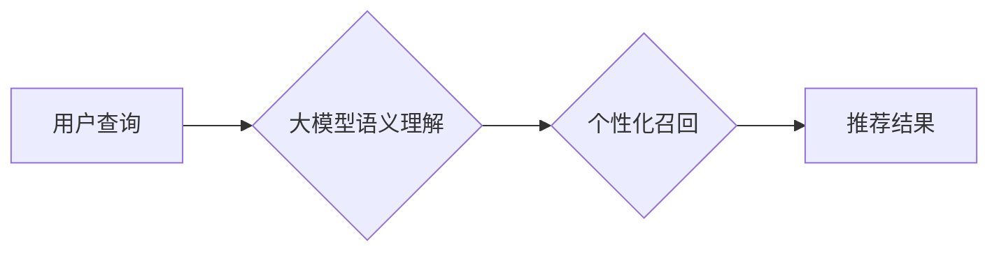

                 

## 大模型对推荐系统召回策略的影响

> 关键词：大模型、推荐系统、召回策略、Transformer、BERT、Fine-tuning、信息检索、个性化推荐

## 1. 背景介绍

推荐系统作为互联网时代的核心技术之一，旨在根据用户的历史行为、偏好和上下文信息，为用户推荐最相关的商品、内容或服务。传统的推荐系统主要依赖于协同过滤、内容过滤和基于知识图谱的方法，但随着数据规模的不断增长和用户需求的多样化，这些方法面临着越来越多的挑战。

近年来，大模型的兴起为推荐系统带来了新的机遇。大模型，通常指参数规模在数十亿甚至千亿级别的神经网络模型，凭借其强大的学习能力和泛化能力，在自然语言处理、计算机视觉等领域取得了突破性进展。在推荐系统领域，大模型也被广泛应用于召回策略，以提升推荐效果和用户体验。

## 2. 核心概念与联系

### 2.1 推荐系统召回策略

召回策略是推荐系统中至关重要的环节，其目标是筛选出与用户需求最相关的候选项，并将其返回给用户。传统的召回策略主要依赖于关键词匹配、基于内容的相似度计算和基于用户的历史行为分析等方法。

### 2.2 大模型

大模型是指参数规模在数十亿甚至千亿级别的神经网络模型，通常基于Transformer架构，例如BERT、GPT等。大模型拥有强大的语义理解和文本生成能力，能够从海量文本数据中学习到丰富的知识和模式。

### 2.3 大模型在推荐系统召回策略中的应用

大模型可以用于提升推荐系统的召回策略，主要通过以下方式：

* **语义理解增强:** 大模型能够理解用户查询的深层语义，从而更准确地识别用户需求。
* **个性化召回:** 大模型可以学习用户的个性化偏好，并根据用户的历史行为和上下文信息进行个性化召回。
* **跨模态召回:** 大模型可以处理多种类型的输入数据，例如文本、图像和视频，从而实现跨模态的召回。

**Mermaid 流程图**



## 3. 核心算法原理 & 具体操作步骤

### 3.1 算法原理概述

大模型在推荐系统召回策略中的应用主要基于以下核心算法原理：

* **Transformer架构:** Transformer是一种新型的神经网络架构，其核心是注意力机制，能够捕捉文本序列中的长距离依赖关系，从而实现更准确的语义理解。
* **BERT模型:** BERT是一种基于Transformer架构的预训练语言模型，通过在大量的文本数据上进行预训练，学习到丰富的语言知识和语义表示。
* **Fine-tuning:** Fine-tuning是指在预训练模型的基础上，针对特定任务进行微调，以提升模型在该任务上的性能。

### 3.2 算法步骤详解

大模型在推荐系统召回策略中的应用，通常可以分为以下步骤：

1. **数据预处理:** 将用户查询、商品信息等数据进行清洗、格式化和向量化处理。
2. **模型预训练:** 使用BERT等预训练语言模型，在大量的文本数据上进行预训练，学习到丰富的语言知识和语义表示。
3. **模型微调:** 将预训练模型 fine-tuning 到特定的推荐任务上，例如商品搜索、内容推荐等。
4. **召回策略构建:** 基于微调后的模型，构建新的召回策略，例如基于语义相似度的召回、基于用户偏好的召回等。
5. **模型评估:** 使用测试数据评估模型的召回效果，并根据评估结果进行模型调优。

### 3.3 算法优缺点

**优点:**

* **语义理解能力强:** 大模型能够理解用户查询的深层语义，从而更准确地识别用户需求。
* **个性化推荐效果好:** 大模型可以学习用户的个性化偏好，并根据用户的历史行为和上下文信息进行个性化召回。
* **跨模态召回能力:** 大模型可以处理多种类型的输入数据，例如文本、图像和视频，从而实现跨模态的召回。

**缺点:**

* **计算资源需求高:** 大模型的训练和部署需要大量的计算资源。
* **数据依赖性强:** 大模型的性能依赖于训练数据的质量和规模。
* **可解释性差:** 大模型的决策过程较为复杂，难以解释其推荐结果背后的逻辑。

### 3.4 算法应用领域

大模型在推荐系统召回策略中的应用领域广泛，例如：

* **电商推荐:** 为用户推荐相关的商品。
* **内容推荐:** 为用户推荐相关的文章、视频、音乐等内容。
* **社交推荐:** 为用户推荐相关的用户、群组和话题。
* **新闻推荐:** 为用户推荐相关的新闻资讯。

## 4. 数学模型和公式 & 详细讲解 & 举例说明

### 4.1 数学模型构建

大模型在推荐系统召回策略中的应用，通常基于以下数学模型：

* **BERT模型的嵌入层:** BERT模型的嵌入层将文本序列映射到低维向量空间，每个词语都对应一个向量表示。

* **注意力机制:** 注意力机制可以学习到文本序列中不同词语之间的关系，并赋予每个词语不同的权重。

* **损失函数:** 损失函数用于衡量模型的预测结果与真实结果之间的差异，例如交叉熵损失函数。

### 4.2 公式推导过程

BERT模型的嵌入层使用词嵌入矩阵将每个词语映射到低维向量空间，公式如下：

$$
\mathbf{e}_i = \mathbf{W}_e \mathbf{x}_i
$$

其中，$\mathbf{e}_i$ 是词语 $i$ 的嵌入向量，$\mathbf{W}_e$ 是词嵌入矩阵，$\mathbf{x}_i$ 是词语 $i$ 的 one-hot 编码向量。

注意力机制的计算公式如下：

$$
\mathbf{a}_{ij} = \frac{\exp( \mathbf{h}_i \cdot \mathbf{h}_j)}{\sum_{k=1}^{n} \exp( \mathbf{h}_i \cdot \mathbf{h}_k)}
$$

其中，$\mathbf{a}_{ij}$ 是词语 $i$ 和词语 $j$ 之间的注意力权重，$\mathbf{h}_i$ 和 $\mathbf{h}_j$ 分别是词语 $i$ 和词语 $j$ 的隐藏状态向量，$n$ 是文本序列的长度。

### 4.3 案例分析与讲解

假设我们有一个电商平台，用户查询“智能手机”，大模型可以将用户查询转换为向量表示，并与商品信息进行比较，找出与用户查询语义最相似的商品，并将其推荐给用户。

## 5. 项目实践：代码实例和详细解释说明

### 5.1 开发环境搭建

* Python 3.6+
* TensorFlow 2.0+
* PyTorch 1.0+
* CUDA 10.0+

### 5.2 源代码详细实现

```python
# 导入必要的库
import tensorflow as tf
from transformers import BertTokenizer, BertModel

# 加载预训练模型和词典
tokenizer = BertTokenizer.from_pretrained('bert-base-uncased')
model = BertModel.from_pretrained('bert-base-uncased')

# 定义用户查询和商品信息的向量化函数
def vectorize_text(text):
  inputs = tokenizer(text, return_tensors='tf')
  outputs = model(**inputs)
  return outputs.last_hidden_state[:, 0, :]

# 计算用户查询和商品信息之间的余弦相似度
def cosine_similarity(vector1, vector2):
  return tf.reduce_sum(vector1 * vector2) / (tf.norm(vector1) * tf.norm(vector2))

# 构建推荐系统
class RecommenderSystem:
  def __init__(self, product_data):
    self.product_data = product_data
    self.product_vectors = [vectorize_text(product['title']) for product in self.product_data]

  def recommend(self, user_query):
    user_vector = vectorize_text(user_query)
    similarities = [cosine_similarity(user_vector, product_vector) for product_vector in self.product_vectors]
    sorted_indices = tf.argsort(similarities)[-10:][::-1]
    return [self.product_data[i] for i in sorted_indices]

# 示例代码
product_data = [
  {'title': '智能手机'},
  {'title': '笔记本电脑'},
  {'title': '平板电脑'},
  {'title': '耳机'},
  {'title': '鼠标'}
]

recommender = RecommenderSystem(product_data)
recommendations = recommender.recommend('智能手机')
print(recommendations)
```

### 5.3 代码解读与分析

* 代码首先导入必要的库，并加载预训练模型和词典。
* 定义了两个函数：`vectorize_text` 用于将文本转换为向量表示，`cosine_similarity` 用于计算两个向量的余弦相似度。
* 构建了 `RecommenderSystem` 类，该类包含商品数据和商品向量。
* `recommend` 方法接收用户查询作为输入，并根据用户查询和商品向量的余弦相似度，返回与用户查询最相关的商品。

### 5.4 运行结果展示

运行上述代码，将输出与用户查询“智能手机”最相关的商品信息。

## 6. 实际应用场景

### 6.1 电商推荐

大模型在电商推荐场景中可以提升商品搜索和个性化推荐效果。例如，阿里巴巴的淘宝平台使用大模型进行商品搜索，可以更准确地理解用户的搜索意图，并推荐更相关的商品。

### 6.2 内容推荐

大模型在内容推荐场景中可以为用户推荐更个性化的文章、视频、音乐等内容。例如，腾讯的微信平台使用大模型进行内容推荐，可以根据用户的阅读历史、点赞记录等信息，推荐更符合用户兴趣的内容。

### 6.3 社交推荐

大模型在社交推荐场景中可以为用户推荐更相关的用户、群组和话题。例如，微博平台使用大模型进行社交推荐，可以根据用户的兴趣爱好、好友关系等信息，推荐更符合用户需求的社交内容。

### 6.4 未来应用展望

大模型在推荐系统召回策略中的应用前景广阔，未来可能在以下方面得到进一步发展：

* **跨模态推荐:** 大模型可以处理多种类型的输入数据，例如文本、图像和视频，从而实现跨模态的推荐。
* **多语言推荐:** 大模型可以支持多种语言，从而实现跨语言的推荐。
* **实时推荐:** 大模型可以实时更新用户偏好和上下文信息，从而实现更精准的实时推荐。

## 7. 工具和资源推荐

### 7.1 学习资源推荐

* **BERT论文:** https://arxiv.org/abs/1810.04805
* **Transformers库文档:** https://huggingface.co/docs/transformers/index

### 7.2 开发工具推荐

* **TensorFlow:** https://www.tensorflow.org/
* **PyTorch:** https://pytorch.org/

### 7.3 相关论文推荐

* **BERT for Recommender Systems:** https://arxiv.org/abs/1908.07930
* **Large Language Models for Recommender Systems:** https://arxiv.org/abs/2106.07677

## 8. 总结：未来发展趋势与挑战

### 8.1 研究成果总结

大模型在推荐系统召回策略中的应用取得了显著成果，能够提升推荐效果和用户体验。

### 8.2 未来发展趋势

未来，大模型在推荐系统召回策略中的应用将朝着以下方向发展：

* **模型规模和能力的提升:** 大模型的规模和能力将不断提升，从而实现更精准的推荐。
* **个性化推荐的增强:** 大模型将更加深入地学习用户的个性化偏好，从而提供更个性化的推荐。
* **跨模态和多语言推荐的普及:** 大模型将支持多种类型的输入数据和语言，从而实现跨模态和多语言的推荐。

### 8.3 面临的挑战

大模型在推荐系统召回策略中的应用也面临着一些挑战：

* **计算资源需求高:** 大模型的训练和部署需要大量的计算资源，这对于一些资源有限的企业来说是一个挑战。
* **数据依赖性强:** 大模型的性能依赖于训练数据的质量和规模，而高质量的训练数据往往难以获取。
* **可解释性差:** 大模型的决策过程较为复杂，难以解释其推荐结果背后的逻辑，这可能会影响用户的信任度。

### 8.4 研究展望

未来，研究者将继续探索大模型在推荐系统召回策略中的应用，并致力于解决上述挑战，以实现更精准、个性化、可解释的推荐系统。

## 9. 附录：常见问题与解答

**Q1: 大模型的训练需要多少计算资源？**

A1: 大模型的训练需要大量的计算资源，例如数十甚至数百个GPU。

**Q2: 如何评估大模型在推荐系统召回策略中的效果？**

A2: 可以使用指标如NDCG、MAP等来评估大模型在推荐系统召回策略中的效果。

**Q3: 如何解决大模型的可解释性问题？**

A3: 可以使用注意力机制等技术来解释大模型的决策过程，并提供更透明的推荐结果。


作者：禅与计算机程序设计艺术 / Zen and the Art of Computer Programming<end_of_turn>

