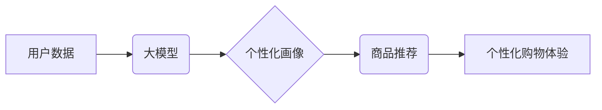

                 

## 大模型驱动的电商个性化购物指南

> 关键词：大模型、电商、个性化推荐、深度学习、自然语言处理、用户画像、购物指南

## 1. 背景介绍

随着电商行业的蓬勃发展，用户对个性化购物体验的需求日益增长。传统电商平台依靠规则引擎和基于协同过滤的推荐算法，难以满足用户多样化的需求。大模型技术的出现为电商个性化购物带来了新的机遇。大模型，例如 GPT-3、BERT 等，拥有强大的语义理解和文本生成能力，能够从海量用户数据中挖掘更深层的个性化信息，为用户提供更精准、更智能的购物建议。

## 2. 核心概念与联系

### 2.1 大模型

大模型是指参数量在数十亿甚至千亿级别的神经网络模型。它们通过训练海量文本数据，学习到丰富的语言知识和模式，能够执行各种自然语言处理任务，例如文本分类、问答、机器翻译等。

### 2.2 个性化购物

个性化购物是指根据用户的个人喜好、购买历史、浏览行为等信息，为用户提供定制化的商品推荐和购物体验。

### 2.3 核心概念联系

大模型能够通过分析用户的文本数据，例如商品评论、搜索历史、聊天记录等，构建用户的个性化画像，并根据用户的画像，推荐符合其兴趣和需求的商品。

**核心概念架构图**



## 3. 核心算法原理 & 具体操作步骤

### 3.1 算法原理概述

大模型驱动的个性化购物推荐主要基于深度学习算法，例如 Transformer、BERT 等。这些算法能够学习到用户和商品之间的复杂关系，并根据用户的个性化特征，预测用户对商品的兴趣和购买意愿。

### 3.2 算法步骤详解

1. **数据收集与预处理:** 收集用户数据，例如商品浏览记录、购买历史、评论信息、搜索关键词等，并进行清洗、格式化和编码处理。
2. **用户画像构建:** 利用大模型对用户数据进行分析，提取用户的兴趣偏好、消费习惯、购买频率等特征，构建用户的个性化画像。
3. **商品特征提取:** 对商品信息进行分析，提取商品的类别、属性、价格、评价等特征，构建商品的特征向量。
4. **推荐模型训练:** 利用用户画像和商品特征，训练推荐模型，例如基于用户的协同过滤、基于内容的推荐、深度学习推荐等。
5. **推荐结果生成:** 根据用户的个性化画像和训练好的推荐模型，预测用户对商品的兴趣和购买意愿，生成个性化的商品推荐列表。
6. **结果展示与反馈:** 将推荐结果展示给用户，并收集用户的反馈信息，用于模型的持续优化和改进。

### 3.3 算法优缺点

**优点:**

* **精准度高:** 大模型能够学习到用户和商品之间的复杂关系，提供更精准的推荐结果。
* **个性化强:** 根据用户的个性化特征，提供定制化的购物体验。
* **可扩展性强:** 大模型能够处理海量数据，支持平台的快速发展和用户规模的增长。

**缺点:**

* **训练成本高:** 大模型的训练需要大量的计算资源和时间。
* **数据依赖性强:** 大模型的性能依赖于训练数据的质量和数量。
* **解释性差:** 大模型的决策过程较为复杂，难以解释推荐结果背后的逻辑。

### 3.4 算法应用领域

大模型驱动的个性化购物推荐技术广泛应用于电商平台、社交媒体、内容推荐等领域。

## 4. 数学模型和公式 & 详细讲解 & 举例说明

### 4.1 数学模型构建

**用户-商品交互矩阵:**

用户-商品交互矩阵是一个二维矩阵，其中每一行代表一个用户，每一列代表一个商品。矩阵中的元素表示用户对商品的交互行为，例如购买、浏览、评分等。

**用户向量:**

用户向量是一个包含用户特征的向量，例如用户的年龄、性别、兴趣爱好、购买历史等。

**商品向量:**

商品向量是一个包含商品特征的向量，例如商品的类别、属性、价格、评价等。

### 4.2 公式推导过程

**协同过滤推荐:**

协同过滤推荐算法基于用户的相似度和商品的相似度进行推荐。

* **用户相似度:** 计算两个用户之间的相似度，例如余弦相似度。

$$
\text{相似度}(u_i, u_j) = \frac{\sum_{m=1}^{M} r_{i,m} \cdot r_{j,m}}{\sqrt{\sum_{m=1}^{M} r_{i,m}^2} \cdot \sqrt{\sum_{m=1}^{M} r_{j,m}^2}}
$$

* **商品相似度:** 计算两个商品之间的相似度，例如余弦相似度。

$$
\text{相似度}(p_i, p_j) = \frac{\sum_{u=1}^{N} r_{u,i} \cdot r_{u,j}}{\sqrt{\sum_{u=1}^{N} r_{u,i}^2} \cdot \sqrt{\sum_{u=1}^{N} r_{u,j}^2}}
$$

* **推荐算法:**

$$
\text{推荐}(u_i, p_j) = \text{相似度}(u_i, u_k) \cdot \text{相似度}(p_j, p_l)
$$

### 4.3 案例分析与讲解

假设有一个电商平台，用户数据包括用户的购买历史、浏览记录和商品评论。我们可以利用大模型对用户数据进行分析，构建用户的个性化画像。例如，我们可以根据用户的购买历史，识别用户的兴趣爱好和消费习惯。然后，我们可以利用商品特征和用户的个性化画像，推荐用户可能感兴趣的商品。

## 5. 项目实践：代码实例和详细解释说明

### 5.1 开发环境搭建

* Python 3.7+
* TensorFlow/PyTorch
* Jupyter Notebook

### 5.2 源代码详细实现

```python
# 导入必要的库
import tensorflow as tf

# 定义用户-商品交互矩阵
user_item_matrix = tf.constant([
    [1, 0, 1, 0],
    [0, 1, 1, 1],
    [1, 1, 0, 1],
    [0, 1, 0, 0]
])

# 定义用户向量
user_vectors = tf.constant([
    [0.2, 0.3, 0.5, 0.1],
    [0.1, 0.4, 0.3, 0.2],
    [0.3, 0.2, 0.4, 0.1],
    [0.1, 0.3, 0.2, 0.4]
])

# 定义商品向量
item_vectors = tf.constant([
    [0.1, 0.2, 0.3, 0.4],
    [0.4, 0.1, 0.2, 0.3],
    [0.3, 0.4, 0.1, 0.2],
    [0.2, 0.3, 0.4, 0.1]
])

# 计算用户-商品交互评分
scores = tf.matmul(user_vectors, item_vectors, transpose_b=True)

# 打印评分结果
print(scores)
```

### 5.3 代码解读与分析

* 代码首先导入必要的库，例如 TensorFlow。
* 然后，定义用户-商品交互矩阵、用户向量和商品向量。
* 利用 TensorFlow 的矩阵乘法函数 `tf.matmul()` 计算用户-商品交互评分。
* 最后，打印评分结果。

### 5.4 运行结果展示

运行代码后，会输出一个包含用户-商品交互评分的矩阵。

## 6. 实际应用场景

### 6.1 个性化商品推荐

大模型驱动的个性化购物推荐技术可以为用户提供更精准的商品推荐，例如根据用户的浏览历史和购买记录，推荐用户可能感兴趣的商品。

### 6.2 个性化购物指南

大模型可以分析用户的购物偏好和需求，生成个性化的购物指南，例如推荐用户购买的商品搭配、优惠活动信息等。

### 6.3 个性化客服服务

大模型可以用于构建智能客服系统，根据用户的咨询内容，提供个性化的购物建议和售后服务。

### 6.4 未来应用展望

未来，大模型驱动的个性化购物体验将更加智能化和人性化。例如，大模型可以根据用户的实时情绪和行为，动态调整推荐结果，提供更精准的购物建议。

## 7. 工具和资源推荐

### 7.1 学习资源推荐

* **书籍:**

    * 深度学习
    * 自然语言处理

* **在线课程:**

    * Coursera
    * edX

### 7.2 开发工具推荐

* **TensorFlow:** 开源深度学习框架
* **PyTorch:** 开源深度学习框架
* **HuggingFace:** 大模型库和工具平台

### 7.3 相关论文推荐

* Attention Is All You Need
* BERT: Pre-training of Deep Bidirectional Transformers for Language Understanding

## 8. 总结：未来发展趋势与挑战

### 8.1 研究成果总结

大模型驱动的个性化购物推荐技术取得了显著的成果，能够为用户提供更精准、更智能的购物体验。

### 8.2 未来发展趋势

* **模型规模和能力提升:** 未来，大模型的规模和能力将进一步提升，能够处理更复杂的数据，提供更精准的推荐结果。
* **多模态融合:** 大模型将融合文本、图像、视频等多模态数据，提供更全面的用户画像和购物体验。
* **个性化程度提升:** 大模型将更加注重用户的个性化需求，提供更加定制化的购物建议。

### 8.3 面临的挑战

* **数据隐私和安全:** 大模型的训练需要大量用户数据，如何保护用户隐私和数据安全是一个重要的挑战。
* **算法解释性和可控性:** 大模型的决策过程较为复杂，难以解释推荐结果背后的逻辑，如何提高算法的解释性和可控性是一个重要的研究方向。
* **模型部署和维护成本:** 大模型的部署和维护成本较高，如何降低部署和维护成本是一个重要的技术挑战。

### 8.4 研究展望

未来，大模型驱动的个性化购物推荐技术将继续发展，为用户提供更加智能、更加人性化的购物体验。


## 9. 附录：常见问题与解答

**Q1: 大模型驱动的个性化购物推荐技术有哪些优势？**

**A1:** 大模型驱动的个性化购物推荐技术具有以下优势:

* **精准度高:** 大模型能够学习到用户和商品之间的复杂关系，提供更精准的推荐结果。
* **个性化强:** 根据用户的个性化特征，提供定制化的购物体验。
* **可扩展性强:** 大模型能够处理海量数据，支持平台的快速发展和用户规模的增长。

**Q2: 大模型驱动的个性化购物推荐技术有哪些挑战？**

**A2:** 大模型驱动的个性化购物推荐技术面临以下挑战:

* **数据隐私和安全:** 大模型的训练需要大量用户数据，如何保护用户隐私和数据安全是一个重要的挑战。
* **算法解释性和可控性:** 大模型的决策过程较为复杂，难以解释推荐结果背后的逻辑，如何提高算法的解释性和可控性是一个重要的研究方向。
* **模型部署和维护成本:** 大模型的部署和维护成本较高，如何降低部署和维护成本是一个重要的技术挑战。


作者：禅与计算机程序设计艺术 / Zen and the Art of Computer Programming 
<end_of_turn>

